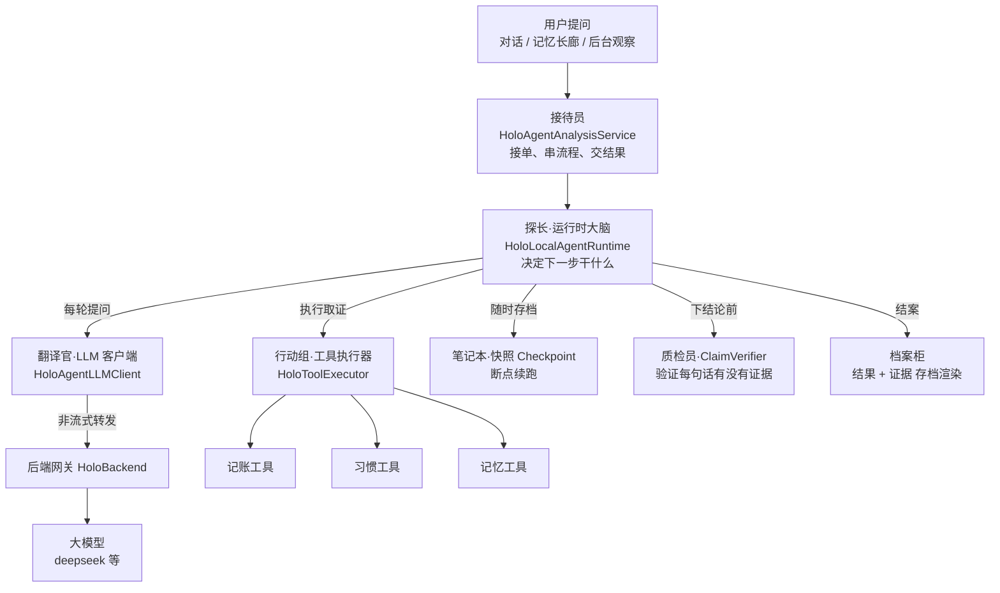
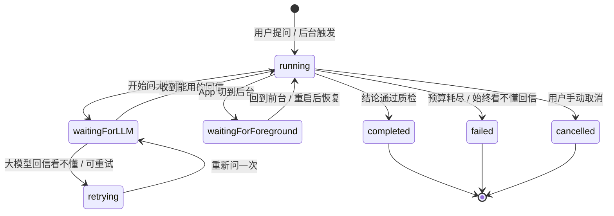
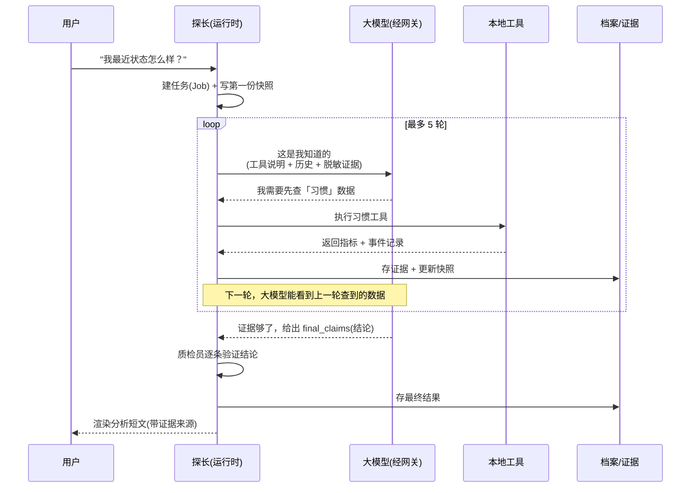
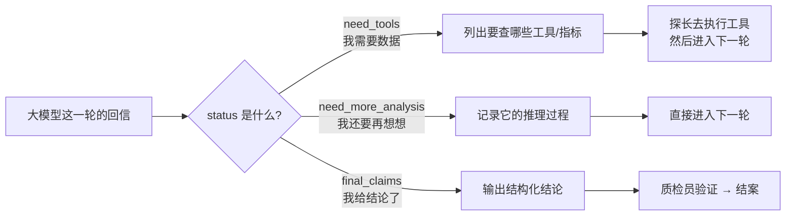

# HoloAI Agent 工作原理（产品视角）

> 这份文档面向产品、运营和想搞懂"深度分析到底怎么跑出来"的同事。
> 不要求懂代码，但要能看懂流程图。技术名词都会先用大白话解释一遍。

---

## 0. 先用一句话理解：Agent 到底是什么

你可能已经习惯了"AI 对话"——你问一句，AI 答一句，一轮就结束，像**记者速答**。

Agent（智能体）是另一种玩法。它更像**侦探破案**：

- 你抛给它一个问题（比如"我这周状态怎么样？"）；
- 它不会立刻瞎编一个答案，而是**先列出要查什么线索**（记账、习惯、记忆……）；
- 然后**自己去查**真实数据，查完**再想**；
- 想完发现证据还不够，就**再查一轮**；
- 直到**攒够了证据**，才下结论，而且每条结论都必须挂上"我是从哪条数据看出来的"。

一句话：**普通对话是"你问我答"，Agent 是"我决定查什么、查完再想、想完再查，直到有据可查才开口"。**

这就引出了 Agent 和普通 AI 对话最大的三个差别：

| | 普通 AI 对话 | Agent 深度分析 |
|---|---|---|
| 谁决定查什么 | 用户喂什么算什么 | AI 自己决定查哪些数据 |
| 有没有"手脚" | 没有，纯靠已有信息 | 有，能调记账/习惯/记忆等工具 |
| 结论可信度 | 容易一本正经地胡说 | 每条结论必须挂证据，且有"质检员"复核 |

---

## 1. Agent 的架构（它由哪些零件组成）

我们用"侦探事务所"来打比方，Holo 的 Agent 由 6 个角色组成：

每个角色的职责（括号里是对应的代码模块，给技术同事看的，PM 可以跳过）：

| 角色 | 干什么 | 代码模块 |
|---|---|---|
| **接待员** | 接到问题后，把"建任务 → 跑分析 → 取结果 → 渲染成短文"这一整套流程串起来 | `HoloAgentAnalysisService` |
| **探长（运行时大脑）** | 全场总指挥，决定"现在该问大模型、该查数据、还是该收尾" | `HoloLocalAgentRuntime` |
| **翻译官（LLM 客户端）** | 把探长的话翻译成大模型能懂的格式，发出去，把回信带回来 | `HoloAgentLLMClient` |
| **后端网关** | 客户端**不直接**连大模型，所有请求经后端转发（更安全、好管理、能统一改 Prompt） | `HoloBackend` |
| **行动组（工具执行器）** | 真正去翻记账、习惯、记忆这些真实数据，把结果带回来 | `HoloToolExecutor` + 各工具 |
| **笔记本（快照）** | 随时把"查到哪了、拿到哪些线索"记下来，App 退后台/重启都能接着跑 | Checkpoint 持久化 |
| **质检员** | 结案前逐条检查结论：有没有证据支撑、数字对不对、有没有乱用因果词 | `HoloClaimVerifier` |
| **档案柜** | 把最终结论和所有证据存档，渲染成用户看到的分析短文 | Result Store + Renderer |

**一个很关键的设计**：客户端不直接持有大模型的"钥匙"（API Key），所有 AI 调用都经后端网关转发。好处是——钥匙不会泄露、能统一升级模型、能统一管理 Prompt、能记录调用日志。

---

## 2. 状态机（一个分析任务的一生）

每个深度分析任务（我们叫一个 **Job**）从被创建到结束，会经历一系列**状态**。可以理解成一份案卷在不同阶段盖的不同章。

状态说明：

| 状态 | 大白话 | 说明 |
|---|---|---|
| `running` | 正在办案 | 任务在正常推进中 |
| `waitingForLLM` | 等大模型回信 | 每一轮都要问一次大模型 |
| `retrying` | 回信看不懂，重问 | 大模型偶尔会返回格式错乱的内容，最多重试 2 次 |
| `waitingForForeground` | 暂停（App 在后台） | 手机退到后台，任务暂停，**不会被杀掉**，回前台接着跑 |
| `completed` | 结案成功 | 结论已生成并通过质检 |
| `failed` | 办案失败 | 钱/时间/次数用完了，或大模型一直回得乱七八糟 |
| `cancelled` | 用户撤案 | 用户主动取消 |

**三条铁律**（PM 记住这三点就够了）：

1. **终态不可复活**：`completed` / `failed` / `cancelled` 是终点，已经结束的任务不会被重新激活。
2. **后台不丢活**：切后台只是"暂停"（变成 `waitingForForeground`），不是"作废"。回到前台或重启 App，会自动把没干完的活捡起来继续。
3. **有预算上限**：不会无限跑下去（见第 4 节"预算"），防止烧钱或卡死。

> 补充一个概念给技术同事：除了"状态"，任务内部还有一套更细的**步骤（Step）**流水线（规划 → 执行工具 → 挖趋势 → 整合 → 验证结论 → … → 存档，共 10 步）。但在真实的深度分析里，这些步骤是由"大模型每一轮的决策"动态驱动的，而不是死板地一步步走。

---

## 3. 数据流转（信息是怎么一步步流动的）

这一节回答："我提一个问题，到最后看到一段分析，中间数据到底怎么跑的？"

我们用一个**时序图**看一次完整的分析（以"我最近状态怎么样？"为例）：

把这个过程拆成 7 步讲清楚：

1. **建任务**：探长接到问题，创建一份"案卷"（Job），同时写第一份快照（记下原始问题）。
2. **组装提问**：每一轮问大模型前，探长会把这几样东西打包给它——
   - 系统指令（告诉它"你是个会查数据的分析助手，必须按 JSON 格式回答"）；
   - **能用哪些工具**（记账、习惯、记忆，以及每个工具能查什么）；
   - **脱敏后的已有证据**（注意：只给摘要，不给完整原文，保护隐私）；
   - 之前几轮的对话历史。
3. **问大模型**：经后端网关转发，大模型回一封"结构化回信"（JSON）。
4. **看回信，分三种情况**（这是核心，下一节详述）。
5. **执行工具**：如果大模型说"我要查数据"，探长就让行动组去查真实记账/习惯/记忆数据。
6. **存证据 + 更新快照**：查到的数据变成"证据"存档，同时更新快照，这样**下一轮大模型能看到上一轮查到的结果**。
7. **结案**：大模型说"证据够了，我给结论"，质检员复核每条结论，通过后存档、渲染成短文给用户。

**几个产品上值得记住的点**：

- **多轮是有记忆的**：第 2 轮能看到第 1 轮查到的数据，第 3 轮能看到前两轮的。所以 Agent 是"越查越清楚"，不是每次从头开始。
- **证据会脱敏**：发给大模型的只是摘要（比如"某天某项指标=某值"），**完整原文留在本地**，只给本地质检员用。
- **落盘顺序有讲究**：永远是"先存证据 → 再存快照 → 最后存任务状态"，这样即使中途崩溃，也不会出现"结论引用了一条不存在的证据"。

---

## 4. 与 AI / 大模型的交互（它和大模型到底怎么配合）

这是最关键的一节，也最能解释"Agent 和普通聊天有什么本质不同"。

### 4.1 不是闲聊，是"按合同办事"

普通 AI 对话里，大模型爱怎么回就怎么回（一通自然语言）。但在 Agent 模式下，我们**逼着大模型签了一份合同**——每轮必须返回一个固定格式的 JSON，里面必须说清楚三件事之一：

这三种 `status`，其实就是**大模型三种"想法"**：

| status | 大模型在想 | 接下来发生什么 |
|---|---|---|
| `need_tools`（要工具） | "证据不够，我得先去查点数据" | 探长执行工具，查完进入下一轮 |
| `need_more_analysis`（还要想） | "数据够了但我还没想清楚，再让我推理一轮" | 记录推理，进入下一轮 |
| `final_claims`（给结论） | "够了，我下结论了" | 进入质检 → 结案 |

> **为什么这个设计很重要？** 因为它把"AI 的自由发挥"框死在了一个协议里。AI 不能再随口编，它要么承认"我还需要数据"，要么必须拿出**带证据**的结论。这是"可信"的根基。

### 4.2 结论不是一句话，是"带出处的断言"

大模型给的每一条结论（我们叫 **Claim**）都不是随便一句话，而是一个结构化对象，必须包含：

- **结论文字**（比如"本周负面习惯频率比上周高 20%"）；
- **指标断言**（具体哪个指标、什么值、对比基线多少）；
- **证据 ID 列表**（这条结论是从哪几条真实数据看出来的，可追溯）；
- **禁止过度推断的声明**（比如明确写"不能把并发现象说成因果、不能做心理/医疗判断"）；
- **置信度**（一条 0~1 的分数）。

### 4.3 双重保险：AI 说了不算，本地还要再审

光有大模型自觉还不够，我们在本地加了一道**质检员（ClaimVerifier）**，用**确定的代码逻辑**（不是再问一次 AI）逐条复核：

1. **证据必须真实存在**：结论引用的证据 ID，在档案里必须能找到，找不到就拒。
2. **指标必须对得上**：结论里的指标名、数值，必须和证据里的一致，对不上就拒。
3. **禁止因果滥用**：结论文字里**不许出现"导致""证明""说明一定因为"**这类词——只能描述"同时发生了什么"，不能断言"A 导致了 B"。

> 这个"禁因果词"的设计，是产品上极其重要的一道护栏。它防止 AI 把"这周睡得晚"和"这周心情记录偏负面"这种**并发**现象，夸大成"睡得晚**导致**心情差"。我们只描述相关性，不编造因果。

### 4.4 预算：给侦探的"办案经费"上限

Agent 不会无限跑。每个任务都带一个**预算（Budget）**，标准深度分析的预算是：

| 维度 | 上限 | 作用 |
|---|---|---|
| 大模型调用轮数 | 5 轮 | 防止无限循环 |
| 工具执行批次 | 5 批 | 防止疯狂查数据 |
| 输入 Token | 10,000 | 控制成本 |
| 输出 Token | 4,000 | 控制成本 |
| 总耗时 | 120 秒 | 防止卡死 |

配合预算还有两个聪明机制：

- **最后一轮强制收尾**：当剩下最后一轮预算时，系统会**明确告诉大模型"时间到了，必须给结论"**，不允许它再要数据或说"还要想"。这样能保证用户基本都能等到一个结果。
- **本地兜底**：万一预算用完了大模型还没收敛，探长会**基于已经查到的数据，本地生成几条保守结论**（低置信度、只描述事实），保证"不会白跑一趟、至少给点观察"。实在一点数据都没有，才标记为失败。

### 4.5 稳健性：大模型偶尔抽风怎么办

大模型（尤其 deepseek）偶尔会返回 503 或格式错乱的内容。我们做了三层兜底：

- **网络层**：遇到 503，**自动等 2 秒重试一次**。
- **解析层**：大模型偶尔会省略空字段，解析器会**自动补全默认值**；实在解析不出来，最多重试 2 次。
- **失败可见**：彻底失败时，错误信息里会**带上大模型返回的原文片段**（前 200 字 + 后 100 字），方便排查，而不是一个干巴巴的"出错了"。

### 4.6 一个值得说道的技术取舍：用"文字对话"模拟工具调用

很多大模型有原生的"工具调用（function calling）"能力，但 Holo 没用，而是用了更通用的方式：

- 在系统指令里**用自然语言告诉大模型"有哪些工具、每个工具能查什么"**；
- 大模型在 JSON 里写出"我要查什么"；
- **本地执行完工具后，把结果编成一段文字**，塞回对话历史；
- 下一轮大模型读到这段"工具执行结果"文字，继续推理。

**好处**：不挑模型——即便用 deepseek 这类对原生工具调用支持一般的模型，也能跑 Agent；换模型也不用改流程。**代价**：稍微费一点 Token。但换来了灵活和稳定，值。

---

## 5. 什么时候会触发 Agent

Agent 不是每次对话都跑（那样太贵也太慢），它有明确的触发场景：

| 触发方式 | 场景 | 说明 |
|---|---|---|
| **用户主动** | 对话里命中"深度分析"分流 | 用户问了一个适合深挖的问题，系统判断"这值得派探长出马" |
| **后台被动** | Observer 异常跟进 | 后台发现数据有异常（比如某指标突变），自动派一个"克制版"Agent 去查 |
| **场景刷新** | 记忆长廊刷新 | 生成记忆长廊的深度分析卡片 |
| **记忆策展** | 记忆整理 | 帮用户整理、归类记忆 |

被动触发的 Agent 用更克制的预算（只 2 轮、60 秒），避免后台偷偷耗费资源。

> 目前 Agent 有**灰度开关**：设置 → AI → Agent 深度分析。可以控制是否启用。

---

## 6. 为什么这么设计（一句话能讲给老板听的卖点）

如果你要给老板或投资人讲 Holo Agent 的三个核心价值，就讲这三点：

1. **可信（不胡说）**：每条结论都挂证据、有出处，还有本地质检员复核 + 禁因果词护栏。AI 没法一本正经地编。
2. **可恢复（不丢活）**：随时存快照，退后台、断网、重启都能接着跑，不会让用户白等。
3. **可控（不烧钱）**：预算封顶（5 轮/120 秒），最后一轮强制收尾，兜底保证有结果。花多少钱、跑多久，都有上限。

一句话总结 Holo Agent：**它是一个"必须查到证据、且被反复质检、还能断点续跑、花销有上限"的 AI 分析助手。**

---

## 附：给技术同事的文件速查表

| 关注点 | 对应代码 |
|---|---|
| 入口编排 | `Services/AI/Agent/HoloAgentAnalysisService.swift` |
| 运行时 + 状态机 + Agent Loop | `Services/AI/Agent/HoloLocalAgentRuntime.swift` |
| LLM 客户端（经网关、重试） | `Services/AI/Agent/HoloAgentLLMClient.swift` |
| Prompt 组装（含脱敏） | `Services/AI/Agent/HoloAgentPromptBuilder.swift` |
| 大模型回信解析（容错） | `Services/AI/Agent/HoloAgentResponseParser.swift` |
| 工具执行器 | `Services/AI/Agent/Tools/HoloToolExecutor.swift` |
| 结论质检 | `Services/AI/Agent/Verification/HoloClaimVerifier.swift` |
| 趋势挖掘 | `Services/AI/Agent/PatternMining/HoloPatternMiner.swift` |
| 任务/状态/预算模型 | `Models/AI/Agent/HoloAgentJobModels.swift` |
| 快照模型 | `Models/AI/Agent/HoloAgentCheckpointModels.swift` |
| 后端网关 agent_loop 路由 + 校验 | `HoloBackend/src/app.js` + `agentResponseValidator.js` |

> 本文档基于 HoloAI Agent V3.1 实现编写。如架构有演进，以代码为准。
