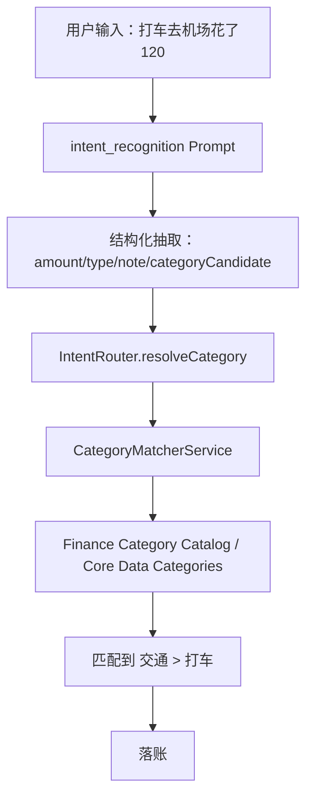

# Holo 科目对照与 Prompt 瘦身实施方案

> **For agentic workers:** REQUIRED SUB-SKILL: Use `subagent-driven-development` (recommended) or `executing-plans` to implement this plan task-by-task. Steps use checkbox (`- [ ]`) syntax for tracking.

**Goal:** 将财务科目体系从 Prompt 正文中抽离，沉淀为后端/客户端可复用的结构化“科目对照”能力，让 Prompt 专注理解用户原话，代码负责稳定匹配科目。

**Architecture:** 后端维护标准财务科目 catalog，并对外提供只读接口；Prompt 只要求模型抽取 `categoryCandidate` 和必要字段，不再枚举完整科目表；App 侧 `IntentRouter` / `CategoryMatcherService` 读取结构化科目与别名进行精确、同义词、模糊匹配，并在低置信度时保留原始语义或追问。后端 Prompt 自动同步机制会把本次 Prompt 瘦身进入网站版本历史。

**Tech Stack:** HoloBackend Node.js / Hono / JSON catalog / Prompt Registry / better-sqlite3；Holo iOS Swift / SwiftUI / Core Data / `IntentRouter` / `CategoryMatcherService`。

---

## 一、背景与判断

当前 `intent_recognition` Prompt 内置完整科目表，包括支出 9 个一级分类、69 个二级分类，以及收入 4 个一级分类、19 个二级分类。这个设计在早期可快速验证，但不适合长期维护：

- Prompt 过长，科目体系成为提示词噪音。
- 每次新增、修改、重命名科目都要改 Prompt。
- Prompt diff 混杂大量科目文本，不利于审查真正的行为规则变化。
- 模型被要求“严格来自下表”时，容易把科目匹配当成语言生成任务，而不是稳定的系统能力。
- iOS 端其实已经有 `CategoryMatcherService`、`CategorySynonymMapping` 和 Core Data 分类实体，后端也已经有 Prompt 管理和版本历史，应该把“科目”从 Prompt 迁移到结构化资源。

我们对目标的共同理解是：

> Prompt 不应该承担“科目数据库”的职责。Prompt 负责理解用户说了什么，科目对照表负责定义系统有哪些科目，匹配代码负责决定最终落到哪个科目。

---

## 二、现状梳理

### 2.1 后端 Prompt 现状

文件：`HOLO/HoloBackend/src/prompts/defaultPrompts.json`

`intent_recognition` 当前包含：

- 意图列表。
- 完整科目体系。
- 输出 JSON Schema。
- 记账规则。
- 示例。

其中“完整科目体系”是本次要移出的主要内容。

### 2.2 iOS 分类体系现状

文件：`HOLO/Holo/Holo APP/Holo/Holo/Models/Category+CoreDataProperties.swift`

当前分类体系已经以 Swift 静态数据存在：

- `Category.expenseHierarchy`
- `Category.incomeHierarchy`
- `Category.seedDefaultCategories(in:)`

这套数据是 App 内实际创建分类的来源。

### 2.3 iOS 匹配现状

文件：

- `HOLO/Holo/Holo APP/Holo/Holo/Services/AI/IntentRouter.swift`
- `HOLO/Holo/Holo APP/Holo/Holo/Services/CategoryMatcherService.swift`
- `HOLO/Holo/Holo APP/Holo/Holo/Services/CategorySynonymMapping.swift`

当前链路大致是：

1. AI 返回 `primaryCategory`、`subCategory`、`categoryCandidate`。
2. `IntentRouter.resolveCategory(...)` 优先用 `subCategory` 匹配。
3. 再用 `categoryCandidate`、`note` 兜底。
4. `CategoryMatcherService` 支持精确匹配、父级校验、部分同义词校验、模糊候选。

问题是：AI 仍被 Prompt 要求读完整科目表并返回一级/二级科目，代码匹配能力没有成为主路径。

---

## 三、目标架构

### 3.1 职责边界

| 层级 | 负责什么 | 不负责什么 |
|------|----------|------------|
| Prompt | 识别用户是否在记账，抽取金额、时间、备注、原始分类语义 | 不维护完整科目表，不做最终科目裁决 |
| 科目 Catalog | 定义标准科目、别名、语义标签、版本 | 不直接调用模型 |
| 匹配代码 | 精确匹配、别名匹配、模糊匹配、置信度和兜底策略 | 不把低置信度匹配伪装成确定结果 |
| 后端管理 | 暴露 catalog 接口、记录 Prompt 版本历史 | 不把 catalog 展开塞回 Prompt |
| App | 使用结构化 catalog / 本地 Core Data 分类完成最终落账 | 不依赖 Prompt 内嵌科目表 |

### 3.2 数据流



### 3.3 Prompt 输出策略

Prompt 输出仍保留字段兼容：

```json
{
  "amount": "120",
  "note": "打车去机场",
  "type": "expense",
  "primaryCategory": "",
  "subCategory": "",
  "categoryCandidate": "打车"
}
```

关键变化：

- `categoryCandidate` 成为必填主字段。
- `primaryCategory` / `subCategory` 只在模型非常确定且语义天然清楚时可填。
- 即使填了 `primaryCategory` / `subCategory`，App 仍必须通过代码匹配验证。
- 不匹配时不能编造系统科目。

---

## 四、实施范围

### 4.1 Prompt 改动

修改：

- `HOLO/HoloBackend/src/prompts/defaultPrompts.json`
- `HOLO/Holo/Holo APP/Holo/Holo/Services/AI/PromptManager.swift`

改动内容：

- 从 `intent_recognition` 删除完整科目表。
- 新增短规则：“科目由系统科目对照表匹配，模型只抽取用户原始分类语义”。
- 保留餐饮餐次规则，因为它属于“用户语义归一”而不是完整科目表。
- 示例更新为以 `categoryCandidate` 为主。

### 4.2 后端代码改动

新增：

- `HOLO/HoloBackend/src/catalog/financeCategories.js`
- `HOLO/HoloBackend/src/catalog/financeCategoryCatalog.js`
- `HOLO/HoloBackend/tests/catalog.test.js`

修改：

- `HOLO/HoloBackend/src/app.js`
- `HOLO/HoloBackend/src/prompts/defaultPrompts.json`
- `HOLO/HoloBackend/tests/prompts.test.js`

后端新增能力：

- `/v1/catalog/finance-categories`
- 返回标准分类、别名、语义标签、catalog version。

### 4.3 iOS 代码改动

新增：

- `HOLO/Holo/Holo APP/Holo/Holo/Models/FinanceCategoryCatalog.swift`
- `HOLO/Holo/Holo APP/Holo/Holo/Services/FinanceCategoryCatalogProvider.swift`

修改：

- `HOLO/Holo/Holo APP/Holo/Holo/Services/CategoryMatcherService.swift`
- `HOLO/Holo/Holo APP/Holo/Holo/Services/AI/IntentRouter.swift`
- `HOLO/Holo/Holo APP/Holo/Holo/Models/AI/AIModels.swift`（如 `ParsedResult` 对空字符串处理需要加强）
- `HOLO/Holo/Holo APP/Holo/Holo/Services/AI/PromptManager.swift`

---

## 五、Catalog 设计

### 5.1 后端 Catalog 数据结构

创建：`HOLO/HoloBackend/src/catalog/financeCategories.js`

```js
export const FINANCE_CATEGORY_CATALOG_VERSION = 1;

export const financeCategoryCatalog = {
  version: FINANCE_CATEGORY_CATALOG_VERSION,
  expense: [
    {
      name: "餐饮",
      children: [
        { name: "早餐", aliases: ["早饭", "早点", "早晨吃饭"], tags: ["meal", "breakfast"] },
        { name: "午餐", aliases: ["午饭", "中饭", "中午饭"], tags: ["meal", "lunch"] },
        { name: "晚餐", aliases: ["晚饭", "正餐"], tags: ["meal", "dinner"] },
        { name: "夜宵", aliases: ["宵夜", "凌晨吃饭"], tags: ["meal", "lateNight"] },
        { name: "零食", aliases: ["小吃", "薯片", "饼干"], tags: ["snack"] },
        { name: "咖啡", aliases: ["拿铁", "美式", "瑞幸", "星巴克"], tags: ["drink", "coffee"] },
        { name: "外卖", aliases: ["点外卖", "美团", "饿了么"], tags: ["meal", "takeaway"] },
        { name: "饮品", aliases: ["奶茶", "饮料", "果茶"], tags: ["drink"] },
        { name: "水果", aliases: ["买水果"], tags: ["food"] },
        { name: "酒水", aliases: ["啤酒", "红酒", "白酒"], tags: ["alcohol"] },
        { name: "超市", aliases: ["便利店", "商超"], tags: ["grocery"] }
      ]
    },
    {
      name: "交通",
      children: [
        { name: "地铁", aliases: ["轨道交通"], tags: ["transport", "publicTransit"] },
        { name: "打车", aliases: ["出租车", "网约车", "滴滴", "高德打车"], tags: ["transport", "taxi"] },
        { name: "公交", aliases: ["巴士"], tags: ["transport", "publicTransit"] },
        { name: "单车", aliases: ["共享单车", "骑车"], tags: ["transport", "publicTransit"] },
        { name: "加油", aliases: ["油费"], tags: ["transport", "car"] },
        { name: "停车", aliases: ["停车费"], tags: ["transport", "car"] },
        { name: "火车", aliases: ["高铁", "动车"], tags: ["transport", "longDistance"] },
        { name: "机票", aliases: ["飞机票", "航班"], tags: ["transport", "longDistance"] },
        { name: "旅行", aliases: ["出行", "旅游交通"], tags: ["transport", "travel"] },
        { name: "过路费", aliases: ["高速费"], tags: ["transport", "car"] }
      ]
    }
  ],
  income: [
    {
      name: "工资收入",
      children: [
        { name: "工资", aliases: ["薪水", "月薪", "发工资"], tags: ["income", "stableIncome"] },
        { name: "奖金", aliases: ["绩效", "年终奖"], tags: ["income", "stableIncome"] },
        { name: "兼职", aliases: ["副业", "外快"], tags: ["income"] },
        { name: "报销", aliases: ["公司报销"], tags: ["income", "reimbursement"] },
        { name: "退款", aliases: ["退钱"], tags: ["income", "refund"] }
      ]
    }
  ]
};
```

说明：

- 上方代码片段只展示结构和部分科目；正式实施时应完整覆盖现有 Swift `expenseHierarchy` / `incomeHierarchy`。
- `tags` 用于语义分析，不只用于落账。例如：
  - `fixedNecessary`
  - `publicTransit`
  - `taxi`
  - `longDistance`
  - `stableIncome`
  - `refund`

### 5.2 Catalog 响应格式

创建：`HOLO/HoloBackend/src/catalog/financeCategoryCatalog.js`

```js
import { financeCategoryCatalog } from "./financeCategories.js";

export function getFinanceCategoryCatalog() {
  return financeCategoryCatalog;
}

export function flattenFinanceCategoryCatalog() {
  const rows = [];
  for (const type of ["expense", "income"]) {
    for (const parent of financeCategoryCatalog[type] ?? []) {
      for (const child of parent.children ?? []) {
        rows.push({
          type,
          primaryCategory: parent.name,
          subCategory: child.name,
          aliases: child.aliases ?? [],
          tags: child.tags ?? [],
        });
      }
    }
  }
  return rows;
}
```

修改：`HOLO/HoloBackend/src/app.js`

```js
import { getFinanceCategoryCatalog } from "./catalog/financeCategoryCatalog.js";

app.get("/v1/catalog/finance-categories", (context) => {
  return context.json(getFinanceCategoryCatalog());
});
```

---

## 六、任务拆解

### Task 1: 后端新增 Finance Category Catalog

**Files:**

- Create: `HOLO/HoloBackend/src/catalog/financeCategories.js`
- Create: `HOLO/HoloBackend/src/catalog/financeCategoryCatalog.js`
- Create: `HOLO/HoloBackend/tests/catalog.test.js`
- Modify: `HOLO/HoloBackend/src/app.js`

- [ ] **Step 1: 写后端 catalog 测试**

在 `HOLO/HoloBackend/tests/catalog.test.js` 新增：

```js
import assert from "node:assert/strict";
import { test } from "node:test";

import { createApp } from "../src/app.js";
import { createDatabase } from "../src/db/database.js";

function createTestApp() {
  return createApp({
    database: createDatabase({ dbPath: ":memory:" }),
    auth: { enforceAppAttest: false },
    routes: {
      chat: {
        provider: "mock",
        model: "holo-mock",
        temperature: 0.2,
        maxTokens: 512,
      },
    },
  });
}

test("GET /v1/catalog/finance-categories returns finance category catalog", async () => {
  const app = createTestApp();
  const response = await app.request("/v1/catalog/finance-categories");

  assert.equal(response.status, 200);
  const json = await response.json();

  assert.equal(typeof json.version, "number");
  assert.ok(Array.isArray(json.expense));
  assert.ok(Array.isArray(json.income));
  assert.ok(json.expense.some((group) => group.name === "餐饮"));
  assert.ok(json.expense.some((group) => group.name === "交通"));

  const transport = json.expense.find((group) => group.name === "交通");
  const taxi = transport.children.find((child) => child.name === "打车");
  assert.ok(taxi.aliases.includes("滴滴"));
  assert.ok(taxi.tags.includes("taxi"));
});
```

- [ ] **Step 2: 运行测试并确认失败**

Run:

```bash
cd HOLO/HoloBackend
node --test tests/catalog.test.js
```

Expected:

```text
fail ... GET /v1/catalog/finance-categories returns finance category catalog
```

失败原因应是路由不存在或 import 文件不存在。

- [ ] **Step 3: 创建 catalog 数据文件**

创建 `HOLO/HoloBackend/src/catalog/financeCategories.js`，内容应完整覆盖当前 Swift 分类体系。正式内容必须包含：

- 支出：餐饮、交通、购物、娱乐、居住、医疗、学习、人情、其他。
- 收入：投资理财、工资收入、人情来往、其他收入。
- 每个二级分类至少有 `name`、`aliases`、`tags`。

最小文件结构：

```js
export const FINANCE_CATEGORY_CATALOG_VERSION = 1;

export const financeCategoryCatalog = {
  version: FINANCE_CATEGORY_CATALOG_VERSION,
  expense: [
    {
      name: "餐饮",
      children: [
        { name: "早餐", aliases: ["早饭", "早点"], tags: ["meal", "breakfast"] },
        { name: "午餐", aliases: ["午饭", "中饭"], tags: ["meal", "lunch"] },
        { name: "晚餐", aliases: ["晚饭"], tags: ["meal", "dinner"] },
        { name: "夜宵", aliases: ["宵夜"], tags: ["meal", "lateNight"] },
        { name: "零食", aliases: ["小吃"], tags: ["snack"] },
        { name: "咖啡", aliases: ["拿铁", "美式", "瑞幸", "星巴克"], tags: ["drink", "coffee"] },
        { name: "外卖", aliases: ["点外卖", "美团", "饿了么"], tags: ["meal", "takeaway"] },
        { name: "饮品", aliases: ["奶茶", "饮料"], tags: ["drink"] },
        { name: "水果", aliases: ["买水果"], tags: ["food"] },
        { name: "酒水", aliases: ["啤酒", "红酒", "白酒"], tags: ["alcohol"] },
        { name: "超市", aliases: ["便利店", "商超"], tags: ["grocery"] }
      ]
    },
    {
      name: "交通",
      children: [
        { name: "地铁", aliases: ["轨道交通"], tags: ["transport", "publicTransit"] },
        { name: "打车", aliases: ["出租车", "网约车", "滴滴", "高德打车"], tags: ["transport", "taxi"] },
        { name: "公交", aliases: ["巴士"], tags: ["transport", "publicTransit"] },
        { name: "单车", aliases: ["共享单车"], tags: ["transport", "publicTransit"] },
        { name: "加油", aliases: ["油费"], tags: ["transport", "car"] },
        { name: "停车", aliases: ["停车费"], tags: ["transport", "car"] },
        { name: "火车", aliases: ["高铁", "动车"], tags: ["transport", "longDistance"] },
        { name: "机票", aliases: ["飞机票", "航班"], tags: ["transport", "longDistance"] },
        { name: "旅行", aliases: ["旅游交通"], tags: ["transport", "travel"] },
        { name: "过路费", aliases: ["高速费"], tags: ["transport", "car"] }
      ]
    }
  ],
  income: [
    {
      name: "工资收入",
      children: [
        { name: "工资", aliases: ["薪水", "月薪", "发工资"], tags: ["income", "stableIncome"] },
        { name: "奖金", aliases: ["绩效", "年终奖"], tags: ["income", "stableIncome"] },
        { name: "兼职", aliases: ["副业", "外快"], tags: ["income"] },
        { name: "报销", aliases: ["公司报销"], tags: ["income", "reimbursement"] },
        { name: "退款", aliases: ["退钱"], tags: ["income", "refund"] }
      ]
    }
  ]
};
```

- [ ] **Step 4: 创建 catalog helper**

创建 `HOLO/HoloBackend/src/catalog/financeCategoryCatalog.js`：

```js
import { financeCategoryCatalog } from "./financeCategories.js";

export function getFinanceCategoryCatalog() {
  return financeCategoryCatalog;
}

export function flattenFinanceCategoryCatalog() {
  const rows = [];
  for (const type of ["expense", "income"]) {
    for (const parent of financeCategoryCatalog[type] ?? []) {
      for (const child of parent.children ?? []) {
        rows.push({
          type,
          primaryCategory: parent.name,
          subCategory: child.name,
          aliases: child.aliases ?? [],
          tags: child.tags ?? [],
        });
      }
    }
  }
  return rows;
}
```

- [ ] **Step 5: 接入后端路由**

在 `HOLO/HoloBackend/src/app.js` 顶部增加：

```js
import { getFinanceCategoryCatalog } from "./catalog/financeCategoryCatalog.js";
```

在 `/v1/prompts/:type` 之前或之后增加：

```js
app.get("/v1/catalog/finance-categories", (context) => {
  return context.json(getFinanceCategoryCatalog());
});
```

- [ ] **Step 6: 运行测试确认通过**

Run:

```bash
cd HOLO/HoloBackend
node --test tests/catalog.test.js
```

Expected:

```text
pass 1
```

- [ ] **Step 7: 提交**

```bash
cd HOLO
git add HoloBackend/src/catalog HoloBackend/src/app.js HoloBackend/tests/catalog.test.js
git commit -m "feat: add finance category catalog endpoint"
```

---

### Task 2: Prompt 瘦身，移除完整科目表

**Files:**

- Modify: `HOLO/HoloBackend/src/prompts/defaultPrompts.json`
- Modify: `HOLO/Holo/Holo APP/Holo/Holo/Services/AI/PromptManager.swift`
- Modify: `HOLO/HoloBackend/tests/prompts.test.js`

- [ ] **Step 1: 写 Prompt 内容测试**

在 `HOLO/HoloBackend/tests/prompts.test.js` 增加：

```js
test("intent_recognition Prompt 不再内嵌完整科目表", async () => {
  const app = createTestApp();
  const response = await app.request("/v1/prompts/intent_recognition");
  assert.equal(response.status, 200);

  const prompt = await response.json();
  assert.ok(prompt.content.includes("categoryCandidate"));
  assert.ok(prompt.content.includes("科目由系统科目对照表匹配"));
  assert.doesNotMatch(prompt.content, /\| 餐饮 \| 早餐、午餐、晚餐/);
  assert.doesNotMatch(prompt.content, /### 支出\n\| 一级 \| 二级 \|/);
});
```

- [ ] **Step 2: 运行测试并确认失败**

Run:

```bash
cd HOLO/HoloBackend
node --test tests/prompts.test.js
```

Expected:

```text
FAIL intent_recognition Prompt 不再内嵌完整科目表
```

- [ ] **Step 3: 更新后端默认 Prompt**

在 `HOLO/HoloBackend/src/prompts/defaultPrompts.json` 的 `intent_recognition` 中：

删除：

```markdown
## 科目体系

记账时根据用户描述匹配科目。科目名必须严格来自下表。不在表中的分类填入 categoryCandidate，primaryCategory/subCategory 留空。

### 支出
...
### 收入
...
```

替换为：

```markdown
## 科目抽取规则

记账时不要在 Prompt 中维护或枚举完整科目表。科目由系统科目对照表匹配。

你只需要抽取用户原始消费/收入语义：
- categoryCandidate：必填，保留用户原始分类语义或最自然的短语，如“打车”“午饭”“房租”“工资”。
- primaryCategory/subCategory：只有当用户语义非常明确且你确信是系统标准科目时才填写；不确定时留空。
- 即使填写 primaryCategory/subCategory，系统仍会用科目对照表做最终校验。
- 不要为了匹配而编造科目。
- 无法判断分类时，保留 categoryCandidate，primaryCategory/subCategory 留空。
```

保留并调整餐饮规则：

```markdown
- 餐饮语义：用户描述涉及吃饭但未明确餐次时，可根据当前时间把 categoryCandidate 归一为“早餐/午餐/晚餐/夜宵”；用户明确说早饭/午饭/晚饭/夜宵时，以用户原话为准。
```

示例改为：

```json
{"mode":"single_action","items":[{"id":"1","intent":"record_expense","confidence":0.95,"extractedData":{"amount":"35","note":"午饭","categoryCandidate":"午饭","primaryCategory":"","subCategory":""}}],"needsClarification":false,"clarificationQuestion":null}
```

- [ ] **Step 4: 更新 App fallback Prompt**

在 `HOLO/Holo/Holo APP/Holo/Holo/Services/AI/PromptManager.swift` 中同步做同样瘦身，避免后端不可用 fallback 时重新回到旧逻辑。

- [ ] **Step 5: 运行 Prompt 测试**

Run:

```bash
cd HOLO/HoloBackend
node --test tests/prompts.test.js
```

Expected:

```text
pass
```

- [ ] **Step 6: 提交**

```bash
cd HOLO
git add HoloBackend/src/prompts/defaultPrompts.json HoloBackend/tests/prompts.test.js "Holo/Holo APP/Holo/Holo/Services/AI/PromptManager.swift"
git commit -m "refactor: slim intent prompt category instructions"
```

---

### Task 3: iOS Catalog 模型与本地 Provider

**Files:**

- Create: `HOLO/Holo/Holo APP/Holo/Holo/Models/FinanceCategoryCatalog.swift`
- Create: `HOLO/Holo/Holo APP/Holo/Holo/Services/FinanceCategoryCatalogProvider.swift`
- Test: `HOLO/Holo/Holo APP/Holo/HoloTests/Models/FinanceCategoryCatalogTests.swift`

- [ ] **Step 1: 新增模型测试**

创建 `HOLO/Holo/Holo APP/Holo/HoloTests/Models/FinanceCategoryCatalogTests.swift`：

```swift
import XCTest
@testable import Holo

final class FinanceCategoryCatalogTests: XCTestCase {
    func testFallbackCatalogContainsTaxiAlias() {
        let catalog = FinanceCategoryCatalogProvider.fallbackCatalog()
        let rows = catalog.flattenedRows

        let taxi = rows.first {
            $0.type == .expense &&
            $0.primaryCategory == "交通" &&
            $0.subCategory == "打车"
        }

        XCTAssertNotNil(taxi)
        XCTAssertTrue(taxi?.aliases.contains("滴滴") == true)
        XCTAssertTrue(taxi?.tags.contains("taxi") == true)
    }
}
```

- [ ] **Step 2: 运行测试并确认失败**

Run:

```bash
cd "HOLO/Holo/Holo APP/Holo"
xcodebuild -project Holo.xcodeproj -scheme Holo -sdk iphonesimulator -only-testing:HoloTests/FinanceCategoryCatalogTests test
```

Expected:

```text
Cannot find 'FinanceCategoryCatalogProvider' in scope
```

- [ ] **Step 3: 创建 Swift catalog 模型**

创建 `HOLO/Holo/Holo APP/Holo/Holo/Models/FinanceCategoryCatalog.swift`：

```swift
import Foundation

struct FinanceCategoryCatalog: Codable, Equatable, Sendable {
    let version: Int
    let expense: [FinanceCategoryGroup]
    let income: [FinanceCategoryGroup]

    var flattenedRows: [FinanceCategoryCatalogRow] {
        expense.flatMap { group in
            group.children.map {
                FinanceCategoryCatalogRow(
                    type: .expense,
                    primaryCategory: group.name,
                    subCategory: $0.name,
                    aliases: $0.aliases,
                    tags: $0.tags
                )
            }
        } + income.flatMap { group in
            group.children.map {
                FinanceCategoryCatalogRow(
                    type: .income,
                    primaryCategory: group.name,
                    subCategory: $0.name,
                    aliases: $0.aliases,
                    tags: $0.tags
                )
            }
        }
    }
}

struct FinanceCategoryGroup: Codable, Equatable, Sendable {
    let name: String
    let children: [FinanceCategoryLeaf]
}

struct FinanceCategoryLeaf: Codable, Equatable, Sendable {
    let name: String
    let aliases: [String]
    let tags: [String]
}

struct FinanceCategoryCatalogRow: Equatable, Sendable {
    let type: TransactionType
    let primaryCategory: String
    let subCategory: String
    let aliases: [String]
    let tags: [String]
}
```

- [ ] **Step 4: 创建 fallback provider**

创建 `HOLO/Holo/Holo APP/Holo/Holo/Services/FinanceCategoryCatalogProvider.swift`：

```swift
import Foundation

enum FinanceCategoryCatalogProvider {
    static func fallbackCatalog() -> FinanceCategoryCatalog {
        FinanceCategoryCatalog(
            version: 1,
            expense: [
                FinanceCategoryGroup(
                    name: "交通",
                    children: [
                        FinanceCategoryLeaf(name: "地铁", aliases: ["轨道交通"], tags: ["transport", "publicTransit"]),
                        FinanceCategoryLeaf(name: "打车", aliases: ["出租车", "网约车", "滴滴", "高德打车"], tags: ["transport", "taxi"]),
                        FinanceCategoryLeaf(name: "公交", aliases: ["巴士"], tags: ["transport", "publicTransit"])
                    ]
                )
            ],
            income: [
                FinanceCategoryGroup(
                    name: "工资收入",
                    children: [
                        FinanceCategoryLeaf(name: "工资", aliases: ["薪水", "月薪", "发工资"], tags: ["income", "stableIncome"])
                    ]
                )
            ]
        )
    }
}
```

正式实施时应完整覆盖现有 Swift 分类体系，不只包含测试中的最小数据。

- [ ] **Step 5: 运行测试确认通过**

Run:

```bash
cd "HOLO/Holo/Holo APP/Holo"
xcodebuild -project Holo.xcodeproj -scheme Holo -sdk iphonesimulator -only-testing:HoloTests/FinanceCategoryCatalogTests test
```

Expected:

```text
TEST SUCCEEDED
```

- [ ] **Step 6: 提交**

```bash
cd HOLO
git add "Holo/Holo APP/Holo/Holo/Models/FinanceCategoryCatalog.swift" "Holo/Holo APP/Holo/Holo/Services/FinanceCategoryCatalogProvider.swift" "Holo/Holo APP/Holo/HoloTests/Models/FinanceCategoryCatalogTests.swift"
git commit -m "feat: add finance category catalog model"
```

---

### Task 4: 升级 iOS 科目匹配逻辑

**Files:**

- Modify: `HOLO/Holo/Holo APP/Holo/Holo/Services/CategoryMatcherService.swift`
- Modify: `HOLO/Holo/Holo APP/Holo/Holo/Services/AI/IntentRouter.swift`
- Test: `HOLO/Holo/Holo APP/Holo/HoloTests/Services/CategoryMatcherServiceTests.swift`

- [ ] **Step 1: 写匹配测试**

创建 `HOLO/Holo/Holo APP/Holo/HoloTests/Services/CategoryMatcherServiceTests.swift`：

```swift
import XCTest
@testable import Holo

final class CategoryMatcherServiceTests: XCTestCase {
    func testCatalogAliasMatchesTaxi() {
        let catalog = FinanceCategoryCatalogProvider.fallbackCatalog()
        let result = CategoryMatcherService.matchCandidate(
            "滴滴",
            type: .expense,
            catalog: catalog
        )

        XCTAssertEqual(result?.primaryCategory, "交通")
        XCTAssertEqual(result?.subCategory, "打车")
        XCTAssertEqual(result?.confidence, 1.0)
    }

    func testUnknownCandidateDoesNotInventCategory() {
        let catalog = FinanceCategoryCatalogProvider.fallbackCatalog()
        let result = CategoryMatcherService.matchCandidate(
            "一件很奇怪的东西",
            type: .expense,
            catalog: catalog
        )

        XCTAssertNil(result)
    }
}
```

- [ ] **Step 2: 运行测试并确认失败**

Run:

```bash
cd "HOLO/Holo/Holo APP/Holo"
xcodebuild -project Holo.xcodeproj -scheme Holo -sdk iphonesimulator -only-testing:HoloTests/CategoryMatcherServiceTests test
```

Expected:

```text
Cannot find 'matchCandidate' in scope
```

- [ ] **Step 3: 新增匹配结果类型**

在 `CategoryMatcherService.swift` 中新增：

```swift
struct FinanceCategoryCandidateMatch: Equatable {
    let type: TransactionType
    let primaryCategory: String
    let subCategory: String
    let confidence: Double
    let matchReason: String
}
```

- [ ] **Step 4: 新增 catalog 匹配方法**

在 `CategoryMatcherService.swift` 中新增：

```swift
static func matchCandidate(
    _ candidate: String,
    type: TransactionType,
    catalog: FinanceCategoryCatalog
) -> FinanceCategoryCandidateMatch? {
    let normalized = candidate.trimmingCharacters(in: .whitespacesAndNewlines).lowercased()
    guard !normalized.isEmpty else { return nil }

    for row in catalog.flattenedRows where row.type == type {
        if row.subCategory.lowercased() == normalized {
            return FinanceCategoryCandidateMatch(
                type: type,
                primaryCategory: row.primaryCategory,
                subCategory: row.subCategory,
                confidence: 1.0,
                matchReason: "exact_subcategory"
            )
        }

        if row.aliases.map({ $0.lowercased() }).contains(normalized) {
            return FinanceCategoryCandidateMatch(
                type: type,
                primaryCategory: row.primaryCategory,
                subCategory: row.subCategory,
                confidence: 1.0,
                matchReason: "alias"
            )
        }
    }

    return nil
}
```

- [ ] **Step 5: 接入 IntentRouter**

在 `IntentRouter.resolveCategory(...)` 中调整优先级：

1. 如果 `subCategory` 非空，仍先走现有 Core Data 精确匹配。
2. 如果 `categoryCandidate` 非空，先走 catalog alias / exact 匹配。
3. 如果 catalog 匹配成功，再用现有 `CategoryMatcherService.matchSingle` 找 Core Data 实体。
4. 如果失败，再用 note 兜底。
5. 仍失败时不编造分类，保留 unmatched。

伪代码：

```swift
let catalog = FinanceCategoryCatalogProvider.fallbackCatalog()
if let candidate = categoryCandidate,
   let catalogMatch = CategoryMatcherService.matchCandidate(candidate, type: type, catalog: catalog) {
    let match = categoryMatcher.matchSingle(
        primaryCategory: catalogMatch.primaryCategory,
        subCategory: catalogMatch.subCategory,
        type: type,
        categories: categories
    )
    if let category = match.matchedCategory {
        return category
    }
}
```

- [ ] **Step 6: 运行测试**

Run:

```bash
cd "HOLO/Holo/Holo APP/Holo"
xcodebuild -project Holo.xcodeproj -scheme Holo -sdk iphonesimulator build
```

Expected:

```text
BUILD SUCCEEDED
```

- [ ] **Step 7: 提交**

```bash
cd HOLO
git add "Holo/Holo APP/Holo/Holo/Services/CategoryMatcherService.swift" "Holo/Holo APP/Holo/Holo/Services/AI/IntentRouter.swift" "Holo/Holo APP/Holo/HoloTests/Services/CategoryMatcherServiceTests.swift"
git commit -m "feat: match finance categories from catalog aliases"
```

---

### Task 5: 上线与验证

**Files:**

- Modify: `HOLO/HoloBackend/src/prompts/defaultPrompts.json`
- Modify: `HOLO/HoloBackend/src/prompts/promptRegistry.js`（无需新增逻辑，只依赖已上线 default sync）
- Deploy: `HOLO/HoloBackend/deploy/docker-compose.yml`

- [ ] **Step 1: 后端全量测试**

Run:

```bash
cd HOLO/HoloBackend
node --test tests/*.test.js
```

Expected:

```text
pass
```

- [ ] **Step 2: iOS 编译验证**

Run:

```bash
cd "HOLO/Holo/Holo APP/Holo"
xcodebuild -project Holo.xcodeproj -scheme Holo -configuration Debug -sdk iphonesimulator build
```

Expected:

```text
BUILD SUCCEEDED
```

- [ ] **Step 3: 部署后端**

沿用当前 ECS 流程：

```bash
rsync -az --delete \
  --exclude 'node_modules' \
  --exclude 'deploy/data' \
  --exclude 'deploy/.env.production' \
  --exclude '.env' \
  HOLO/HoloBackend/ root@123.56.104.9:/root/Holo/HoloBackend/

ssh root@123.56.104.9 'cd /root/Holo/HoloBackend/deploy && docker compose up -d --build'
```

- [ ] **Step 4: 验证后端健康**

Run:

```bash
curl http://123.56.104.9/v1/health
```

Expected:

```json
{"ok":true,"service":"holo-ai-gateway"}
```

- [ ] **Step 5: 验证 Prompt 历史**

打开后台：

```text
http://localhost:8787/admin/prompts/intent_recognition/history
```

预期：

- 新版本来源为 `default_sync` 或 `default`。
- 变更说明包含默认 Prompt 文件同步。
- Diff 中能看到完整科目表被删除，替换为“科目抽取规则”。

- [ ] **Step 6: 真机回归用例**

在真机 HoloAI 输入：

```text
午饭35
```

预期：

- 识别为 `record_expense`。
- `categoryCandidate` 为“午饭”或“午餐”。
- 最终落账到餐饮相关分类。

输入：

```text
滴滴去机场花了120
```

预期：

- 识别为 `record_expense`。
- 最终匹配 `交通 > 打车`。
- 不依赖 Prompt 内完整科目表。

输入：

```text
收到工资15000
```

预期：

- 识别为 `record_income`。
- 最终匹配 `工资收入 > 工资`。

输入：

```text
买了一个完全不知道怎么分类的东西 88
```

预期：

- 如果低置信度，不强行编造科目。
- 保留 `categoryCandidate`。
- 走现有未匹配分类或追问逻辑。

---

## 七、风险与防护

### 7.1 风险：Prompt 瘦身后分类准确率短期下降

原因：模型不再被完整科目表强约束。

防护：

- `categoryCandidate` 必填。
- Catalog alias 覆盖高频同义词。
- 真机用例覆盖餐饮、交通、收入、未知分类。

### 7.2 风险：后端 catalog 与 iOS Core Data 默认分类不一致

防护：

- Task 1 必须完整复制 `Category.expenseHierarchy` / `Category.incomeHierarchy`。
- 后续建议新增一致性脚本，校验后端 catalog 与 Swift 分类树的一级/二级名称一致。

### 7.3 风险：两套 catalog 演化分叉

防护：

- 中期目标应改为“后端 catalog 是源头，iOS 启动后缓存 catalog，失败时 fallback 到本地内置 catalog”。
- 短期先保留 iOS fallback，避免网络失败影响记账。

### 7.4 风险：Prompt 历史出现大 diff

这是预期内的一次性变化。后续科目增删改将主要发生在 catalog 文件，Prompt diff 会变干净。

---

## 八、验收标准

- `intent_recognition` Prompt 不再包含完整支出/收入科目表。
- 后端存在 `/v1/catalog/finance-categories`，返回结构化 catalog。
- 真机记账仍能识别常见场景：午饭、打车、工资、未知分类。
- 科目匹配主要由代码完成，而不是依赖 Prompt 枚举。
- 后端 Prompt 网站历史能看到本次 Prompt 瘦身 diff。
- 后端测试通过。
- iOS Debug simulator build 通过。

---

## 九、后续演进

本方案先做“Prompt 瘦身 + Catalog 化 + 本地匹配增强”。下一阶段可以继续做：

1. 后台新增“科目对照”管理页面。
2. 支持动态别名学习：用户手动改科目后，把原始 `categoryCandidate` 记为该科目的别名候选。
3. Catalog 版本下发到 App，并支持缓存 TTL。
4. 将财务语义标签（固定必要支出、交通结构、稳定收入）全部从硬编码迁到 catalog tags。
5. 在 AI 日志中记录 `categoryCandidate`、匹配结果、matchReason、confidence，方便复盘分类准确率。

---

## 十、自检

- 覆盖用户目标：是。Prompt 不再维护完整科目表，科目对照独立。
- 覆盖后端网站历史：是。依赖已上线的 default Prompt 自动同步机制。
- 覆盖 App 真机链路：是。保留 Prompt 字段兼容，并将匹配逻辑迁到 App 代码。
- 覆盖风险：是。列出准确率、一致性、双 catalog 分叉、大 diff 风险。
- 无占位项：本文没有待补 TBD；正式实施时需要完整复制现有 Swift 科目树，这是明确任务，不是占位。

---

## 十一、Claude 对抗性审查（2026-05-16）

> 审查者：Claude (Sonnet)。基于对 iOS 端和后端源码的实际阅读，验证方案中的假设并指出问题。

### 11.1 核心场景确认

用户补充了真实动机：**用户可能手动新增/重命名/删除科目，而 Prompt 里硬编码的科目表永远跟不上用户的实际科目体系**。在此场景下，方案方向完全正确——将 Prompt 从"科目数据库"角色中解放出来，让匹配代码基于用户的实际 Core Data 科目（含自定义科目）工作。

当前链路的断点：

```
Prompt 硬编码 88 个科目 → AI 被约束"严格来自下表" → 返回的 subCategory 是硬编码里的名字
                                                              ↓
                                        但用户的 Core Data 里可能有自定义科目，或重命名过的科目
                                                              ↓
                                              matchSingle 精确匹配 → 匹配不上 → 落入"待确认"
```

### 11.2 方案无视了已有的关键基础设施

#### 11.2.1 CategorySynonymMapping — 250+ 条同义词，完全被忽略

**文件**：`Services/CategorySynonymMapping.swift`

已有三个静态字典：

| 字典 | 范围 | 条目数 |
|------|------|--------|
| `expenseSubCategorySynonyms` | 支出二级分类同义词 | ~65 个标准名，~200+ 同义词 |
| `incomeSubCategorySynonyms` | 收入二级分类同义词 | ~18 个标准名，~50 同义词 |
| `primaryCategorySynonyms` | 一级分类同义词 | ~12 个标准名，~30 同义词 |

关键方法：
- `findStandardSubCategoryName(_ synonym:, type:) -> String?` — 把同义词归一到标准名
- `findStandardPrimaryCategoryName(_ synonym:) -> String?`

**问题**：方案提出在后端新建 catalog 的 `aliases` 字段做同义词匹配，但 iOS 端已经有完整的同义词数据。两套数据源必然出现不一致（例如 CategorySynonymMapping 里"打车"的同义词是 `["出租车", "滴滴打车", "网约车"]`，方案 catalog 里写的是 `["出租车", "网约车", "滴滴", "高德打车"]`）。

**必须决定**：新 catalog 的 aliases 是要替代 CategorySynonymMapping，还是合并，还是保持两套？方案对此未表态。

#### 11.2.2 CategoryLearnedMapping — 用户纠正后学习，但 lookup 从未被调用

**文件**：`Services/AI/CategoryLearnedMapping.swift`

- `recordTransactionCandidate(...)` — IntentRouter 匹配失败时调用，存入 UserDefaults
- `lookup(candidate:type:primaryCategory:)` — **从未在 IntentRouter.matchCategory 中被调用**

这意味着用户手动把"待确认"交易改到正确分类后，下次遇到同样输入时仍然匹配不上。这是独立 bug，但与本次改动强相关——Prompt 瘦身后 AI 不再给科目参考，学习机制是弥补准确率退化的重要手段。

#### 11.2.3 CategoryMatcherService — fuzzy matching 是死代码

**文件**：`Services/CategoryMatcherService.swift`

`matchSingle` 当前只做精确匹配（exact + synonym via primaryMatches）。`findFuzzyMatch`、`calculateSimilarity`、`levenshteinDistance` 等方法仍然存在但**从未被调用**（文件第 62-63 行注释明确说明"导入是账本迁移，不替用户猜科目"）。

方案新增 `matchCandidate` 方法本质上是在重新发明模糊匹配，但没有解释为什么不用已有的 fuzzy matching 基础设施，也没有解释这个新方法的匹配范围和已有方法如何分工。

### 11.3 技术可行性问题

#### 11.3.1 @MainActor 兼容性

`CategoryMatcherService` 是 `@MainActor class`（单例 `static let shared`），所有现有方法都是实例方法。方案提出新增 `static func matchCandidate(...)` 会绕过 actor 隔离。

`IntentRouter` 也是 `@MainActor final class`。方案 Task 4 Step 5 的伪代码：
```swift
let catalog = FinanceCategoryCatalogProvider.fallbackCatalog()
if let candidate = categoryCandidate,
   let catalogMatch = CategoryMatcherService.matchCandidate(candidate, type: type, catalog: catalog) {
```
在 async 上下文中调用 static 方法会有并发编译警告或错误。应改为实例方法，与现有 `matchSingle` 保持一致。

#### 11.3.2 测试命令可能无法执行

探索发现 `HoloTests/` 目录存在，但 `project.pbxproj` 中未找到名为 `HoloTests` 的独立 target。方案中的命令：
```bash
xcodebuild -project Holo.xcodeproj -scheme Holo -only-testing:HoloTests/FinanceCategoryCatalogTests test
```
如果 HoloTests 不是独立 target，此命令会直接报错。需要先确认测试文件的实际 target 归属，或改用 `xctest` 方式。

#### 11.3.3 后端测试的 createTestApp 简化版可能不工作

`catalog.test.js` 自己定义了一个 `createTestApp()`，但 `tests/prompts.test.js` 里已有完整版。两个版本的参数结构不同。如果 `createApp` 的必要参数发生变化（比如需要额外的 provider 配置），catalog 测试的简化版会悄悄失败。建议复用 prompts.test.js 中的 helper，或提取到共享的 test helper 文件。

### 11.4 方案内部逻辑矛盾

#### 11.4.1 "模型非常确定时可以填 primaryCategory/subCategory"——没有科目表怎么确定？

方案说：
> `primaryCategory` / `subCategory`：只有当用户语义非常明确且你确信是系统标准科目时才填写

但移除科目表后，模型不再知道"系统标准科目"有哪些。它只能靠训练数据里的常识来判断——这比有参考表时的准确率更低。要么完全不让模型填这两个字段（由代码全权决定），要么保留一个轻量级的一级分类提示（只列 9+4 个一级名，不列二级），不能两者都要。

#### 11.4.2 matchSingle 只做精确匹配 + Prompt 不再给科目 = 匹配率下降

当前 `matchCategory` 三步链路（subCategory → categoryCandidate → note）全部依赖 `matchSingle` 的精确匹配。移除 Prompt 科目表后：
- 模型返回的 `subCategory` 可能不再是 Core Data 中的标准名
- `categoryCandidate` 是用户原话（如"滴滴"），不等于 Core Data 里的"打车"
- `note` 更不可能精确匹配

方案虽然新增了 `matchCandidate` 用 aliases 兜底，但没有量化当前匹配率基线，也没有说明瘦身后预期退化多少。

#### 11.4.3 Task 3 fallbackCatalog 只含 10% 科目，但 Task 4 依赖完整数据

`FinanceCategoryCatalogProvider.fallbackCatalog()` 硬编码了最小数据集（2 支出大类 + 1 收入大类）。Task 4 的匹配逻辑需要完整科目才能正常工作。两个 Task 之间存在隐含的数据依赖但未标注。

### 11.5 遗漏项

| 遗漏 | 影响 |
|------|------|
| `correctMealCategoryIfNeeded` 依赖 Prompt 返回的 subCategory 是"早餐/午餐/晚餐/夜宵" | Prompt 瘦身后模型不再有科目表参考，餐饮餐次识别可能退化 |
| iOS PromptManager fallback prompt 也含完整科目表 | Task 2 只说"同步瘦身"但没有测试覆盖 fallback prompt |
| `promptRegistry.js` 的 `PROMPT_VERSIONS.intent_recognition` 当前是 5 | 大改后应该 bump 版本号，否则 sync 逻辑的 diff 计算可能异常 |
| `ensurePendingCategory("待确认")` 的用户体验 | 如果匹配率显著下降，大量交易落入"待确认"，需要量化评估影响 |
| 后端 catalog API 无鉴权 | `/v1/catalog/finance-categories` 任何人可访问，虽然数据不敏感但应考虑是否需要限流 |

### 11.6 替代路径建议

如果目标是"Prompt 不维护科目表，匹配代码基于用户实际科目"，可以不改后端 catalog，只改 iOS 端：

| 改动 | 范围 | 解决什么 |
|------|------|---------|
| Prompt 移除科目表，只要求抽取 categoryCandidate | 后端 defaultPrompts.json + iOS PromptManager.swift | AI 不再受硬编码科目约束 |
| matchCategory 接入 CategorySynonymMapping.findStandardSubCategoryName | IntentRouter.matchCategory 增加 1 步调用 | 同义词归一（"滴滴"→"打车"） |
| matchCategory 接入 CategoryLearnedMapping.lookup | IntentRouter.matchCategory 增加 1 步调用 | 用户历史纠正生效 |
| matchSingle 支持匹配用户自定义科目名 | CategoryMatcherService 1 处改动 | 用户新增的科目能被匹配到 |

这条路径复用已有基础设施（Core Data 实际科目 + CategorySynonymMapping + CategoryLearnedMapping），不需要新建 FinanceCategoryCatalog 模型层、不需要新建后端 catalog API、不需要新建 FinanceCategoryCatalogProvider。

后端 catalog 可以作为后续演进（集中管理科目、支持动态下发）再做，但不应该是本次改动的核心路径。

### 11.7 总结

| 维度 | 评级 | 说明 |
|------|------|------|
| 核心方向 | ✅ 正确 | Prompt 不应维护科目表，用户自定义科目会与之脱节 |
| 现状分析 | ❌ 不完整 | 漏掉 CategorySynonymMapping（250+ 同义词）和 CategoryLearnedMapping（学习结果未查询） |
| 架构设计 | ⚠️ 重复建设 | 新 catalog 与已有同义词系统、Core Data 科目体系重叠 |
| 任务拆解 | ⚠️ 有隐患 | fallback 数据不完整可能通过验收；Task 间隐含依赖未标注 |
| 技术可行性 | ❌ 有硬伤 | @MainActor 兼容性、测试 target、xcodebuild 命令 |
| 风险防护 | ⚠️ 不足 | 缺少准确率退化评估、缺少回滚方案、未考虑"待确认"膨胀 |

**建议 GPT 在修订方案时重点回应**：
1. CategorySynonymMapping 的去留决策
2. CategoryLearnedMapping.lookup 的接入（这是独立 bug 但应一并修复）
3. 选择"建新楼"（catalog）还是"修旧房"（复用已有基础设施）的路径
4. @MainActor 兼容性的具体实现方案
5. 验证测试 target 归属后再定测试命令
