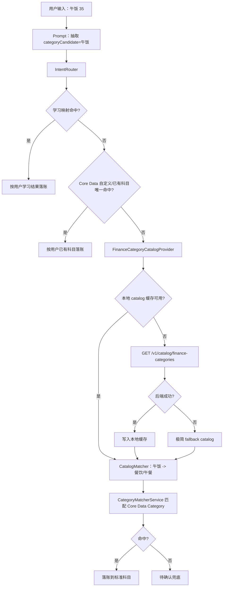

# Holo 科目对照与 Prompt 瘦身实施方案 V2

> **For Claude:** REQUIRED SUB-SKILL: Use superpowers:executing-plans to implement this plan task-by-task.

**Goal:** 将记账意图识别中的完整科目表从 Prompt 中移出，改为由后端统一维护“科目对照 catalog”，App 负责拉取、缓存、匹配和降级，从而让 Prompt 更轻、更稳定，也让科目体系可在后端集中演进。

**Architecture:** 后端是标准科目 catalog 的主源，Prompt 只负责抽取用户原始语义 `categoryCandidate`。iOS 启动或需要时从后端拉取 catalog 并缓存，本地只保留极简兜底版本；记账落库前由代码按“学习映射 -> 用户自定义 Core Data 科目 -> 标准 catalog 归一 -> 待确认”的顺序做确定性匹配。现有 `CategorySynonymMapping.swift` 进入 legacy 迁移路径，避免长期存在三份科目语义源。

**Tech Stack:** HoloBackend Node.js/Hono + SQLite prompt history；iOS Swift/SwiftUI/Core Data；现有 `APIClient`、`HoloBackendEnvironment`、`PromptManager`、`IntentRouter`、`CategoryMatcherService`。

---

## 一、这版 V2 修正了什么

上一版方案方向正确，但存在几个落地断点：

1. 后端新增了 `/v1/catalog/finance-categories`，但 iOS 没有实际消费，真机仍会使用本地静态副本。
2. 项目里已有 `CategorySynonymMapping.swift`，如果再新增后端 catalog 和 iOS fallback catalog，会形成三份语义表。
3. 当前 `categoryCandidate` 匹配会调用 `matchSingle(primaryCategory: "", subCategory: candidate)`，在一级分类为空时容易匹配失败。
4. 餐饮时间修正依赖 `subCategory` 已经是标准餐次；Prompt 瘦身后更可能只填 `categoryCandidate`。
5. `intent_recognition` 的后端默认版本号和 App 本地最低版本号需要一起 bump，确保后台版本历史和本地 fallback 都可见。
6. 用户自定义科目和 `CategoryLearnedMapping.lookup` 必须进入主匹配链路，避免 Prompt 瘦身后个性化分类能力退化。

V2 的核心修正是：后端 catalog 必须被 iOS 拉取和缓存；旧同义词表只作为迁移参考，不再作为新语义主源；用户自己的 Core Data 分类和学习映射优先级高于标准 catalog。

---

## 二、边界定义

### 2.1 Prompt 负责什么

Prompt 只负责理解用户输入，并输出结构化字段：

```json
{
  "amount": "35",
  "note": "午饭",
  "type": "expense",
  "primaryCategory": "",
  "subCategory": "",
  "categoryCandidate": "午饭"
}
```

Prompt 应遵守：

- `categoryCandidate` 是主字段，保留用户最自然的消费或收入语义。
- `primaryCategory` / `subCategory` 只在非常确定时填写。
- Prompt 不枚举完整科目表。
- Prompt 不为了凑系统科目而编造分类。
- Prompt 可以保留少量抽取规则，但不能承担科目数据库职责。

### 2.2 后端负责什么

后端负责维护标准科目 catalog：

- 标准一级分类。
- 标准二级分类。
- alias，同义词和常见说法。
- tags，用于后续洞察分析，例如 `fixedNecessary`、`taxi`、`publicTransit`、`stableIncome`。
- catalog version。

后端不负责替用户落账，也不直接修改 App Core Data。

### 2.3 iOS 负责什么

iOS 负责：

- 从后端拉取 catalog。
- 将 catalog 缓存在本地。
- 后端不可用时使用缓存。
- 缓存也不可用时使用极简 fallback。
- 先用 `CategoryLearnedMapping.lookup` 查询用户手动纠正后的学习映射。
- 直接匹配用户 Core Data 中已有的自定义科目。
- 再将 `categoryCandidate` 通过标准 catalog 映射成标准一级/二级科目。
- 再根据标准一级/二级科目匹配 Core Data 里的 `Category` 实体。
- 无可靠匹配时进入“待确认”，不自动创造错误科目。

---

## 三、最终数据流



---

## 四、文件改动总览

### 4.1 Prompt 改动

修改：

- `HoloBackend/src/prompts/defaultPrompts.json`
- `Holo/Holo APP/Holo/Holo/Services/AI/PromptManager.swift`
- `HoloBackend/src/prompts/promptRegistry.js`

改动：

- 删除 `intent_recognition` 中完整科目表。
- 增加短规则：“科目由系统科目对照 catalog 匹配，模型只抽取用户原始分类语义。”
- 示例全部改成 `categoryCandidate` 为主。
- `PROMPT_VERSIONS.intent_recognition` 从 `5` 升到 `6`。
- `PromptManager.promptVersions[.intentRecognition]` 从 `5` 升到 `6`。

### 4.2 后端代码改动

新增：

- `HoloBackend/src/catalog/financeCategories.js`
- `HoloBackend/src/catalog/financeCategoryCatalog.js`
- `HoloBackend/tests/catalog.test.js`

修改：

- `HoloBackend/src/app.js`
- `HoloBackend/tests/prompts.test.js`

新增接口：

- `GET /v1/catalog/finance-categories`

### 4.3 iOS 代码改动

新增：

- `Holo/Holo APP/Holo/Holo/Models/FinanceCategoryCatalog.swift`
- `Holo/Holo APP/Holo/Holo/Services/FinanceCategoryCatalogProvider.swift`
- `Holo/Holo APP/Holo/Holo/Services/FinanceCategoryCatalogCache.swift`

修改：

- `Holo/Holo APP/Holo/Holo/Models/TransactionType.swift`
- `Holo/Holo APP/Holo/Holo/Services/CategoryMatcherService.swift`
- `Holo/Holo APP/Holo/Holo/Services/AI/IntentRouter.swift`
- `Holo/Holo APP/Holo/Holo/Services/CategorySynonymMapping.swift`

---

## 五、后端 catalog 设计

### 5.1 响应结构

```json
{
  "version": 1,
  "expense": [
    {
      "name": "交通",
      "children": [
        {
          "name": "打车",
          "aliases": ["出租车", "网约车", "滴滴", "高德打车", "打车费"],
          "tags": ["transport", "taxi"]
        }
      ]
    }
  ],
  "income": [
    {
      "name": "工资收入",
      "children": [
        {
          "name": "工资",
          "aliases": ["薪水", "月薪", "薪资", "发工资"],
          "tags": ["income", "stableIncome"]
        }
      ]
    }
  ]
}
```

### 5.2 完整性要求

正式实施时 catalog 必须完整覆盖当前默认科目：

支出：

- 餐饮：早餐、午餐、晚餐、夜宵、零食、咖啡、外卖、饮品、水果、酒水、超市。
- 交通：地铁、打车、公交、单车、加油、停车、火车、机票、旅行、过路费。
- 购物：服饰、数码、日用、美妆、家具、书籍、运动、礼物。
- 娱乐：电影、游戏、视频、音乐、KTV、旅游、健身。
- 居住：房租、房贷、水费、电费、燃气、物业、网费、家电、装修。
- 医疗：就医、药品、体检、健身房、保健品、牙齿保健、医疗用品。
- 学习：课程、教材、考试、文具、订阅。
- 人情：红包礼金、请客、送礼、探望、其他。
- 其他：社交、宠物、理发、洗衣、话费、烟酒、维修、保险、还款、转账、捐赠。

收入：

- 投资理财：利息、股票、房租收入、其他投资。
- 工资收入：工资、奖金、兼职、报销、退款。
- 人情来往：红包、礼物、中奖、转入。
- 其他收入：借入、还款收入、退货、公积金、出闲置。

### 5.3 与旧同义词表的关系

`CategorySynonymMapping.swift` 当前是现有同义词资料来源。V2 实施时：

- 可以从它迁移 aliases 到后端 catalog。
- 新匹配逻辑不再直接依赖它作为主源。
- 文件保留一段时间，标记为 legacy。
- 后续稳定后再删除或只保留导入账单专用逻辑。

---

## 六、任务拆解

### Task 1: 后端新增 Finance Category Catalog

**Files:**

- Create: `HoloBackend/src/catalog/financeCategories.js`
- Create: `HoloBackend/src/catalog/financeCategoryCatalog.js`
- Create: `HoloBackend/tests/catalog.test.js`
- Modify: `HoloBackend/src/app.js`

**Step 1: 写后端 catalog 测试**

在 `HoloBackend/tests/catalog.test.js` 新增测试：

```js
import assert from "node:assert/strict";
import { test } from "node:test";

import { createApp } from "../src/app.js";
import { createDatabase } from "../src/db/database.js";

function createTestApp() {
  return createApp({
    database: createDatabase({ dbPath: ":memory:" }),
    auth: { enforceAppAttest: false },
    routes: {
      chat: {
        provider: "mock",
        model: "holo-mock",
        temperature: 0.2,
        maxTokens: 512,
      },
    },
  });
}

test("GET /v1/catalog/finance-categories returns complete finance category catalog", async () => {
  const app = createTestApp();
  const response = await app.request("/v1/catalog/finance-categories");

  assert.equal(response.status, 200);
  const json = await response.json();

  assert.equal(json.version, 1);
  assert.ok(json.expense.some((group) => group.name === "餐饮"));
  assert.ok(json.expense.some((group) => group.name === "交通"));
  assert.ok(json.income.some((group) => group.name === "工资收入"));

  const transport = json.expense.find((group) => group.name === "交通");
  const taxi = transport.children.find((child) => child.name === "打车");
  assert.ok(taxi.aliases.includes("滴滴"));
  assert.ok(taxi.tags.includes("taxi"));

  const salaryGroup = json.income.find((group) => group.name === "工资收入");
  const salary = salaryGroup.children.find((child) => child.name === "工资");
  assert.ok(salary.aliases.includes("薪水"));
  assert.ok(salary.tags.includes("stableIncome"));
});
```

**Step 2: 运行测试确认失败**

Run:

```bash
cd HoloBackend
node --test tests/catalog.test.js
```

Expected:

```text
fail
```

失败原因应是路由或 catalog 模块不存在。

**Step 3: 创建 catalog 数据文件**

创建 `HoloBackend/src/catalog/financeCategories.js`。

要求：

- 完整覆盖第五章列出的所有默认科目。
- 每个二级科目都包含 `name`、`aliases`、`tags`。
- aliases 优先迁移 `CategorySynonymMapping.swift` 里的现有同义词。
- 不要只实现测试里的最小样例。

**Step 4: 创建 catalog helper**

创建 `HoloBackend/src/catalog/financeCategoryCatalog.js`：

```js
import { financeCategoryCatalog } from "./financeCategories.js";

export function getFinanceCategoryCatalog() {
  return financeCategoryCatalog;
}

export function flattenFinanceCategoryCatalog() {
  const rows = [];
  for (const type of ["expense", "income"]) {
    for (const parent of financeCategoryCatalog[type] ?? []) {
      for (const child of parent.children ?? []) {
        rows.push({
          type,
          primaryCategory: parent.name,
          subCategory: child.name,
          aliases: child.aliases ?? [],
          tags: child.tags ?? [],
        });
      }
    }
  }
  return rows;
}
```

**Step 5: 接入 app 路由**

在 `HoloBackend/src/app.js` 注册：

```js
import { getFinanceCategoryCatalog } from "./catalog/financeCategoryCatalog.js";

app.get("/v1/catalog/finance-categories", (context) => {
  return context.json(getFinanceCategoryCatalog());
});
```

**Step 6: 运行后端测试**

Run:

```bash
cd HoloBackend
node --test tests/catalog.test.js
node --test tests/*.test.js
```

Expected:

```text
pass
```

---

### Task 2: Prompt 瘦身与版本登记

**Files:**

- Modify: `HoloBackend/src/prompts/defaultPrompts.json`
- Modify: `HoloBackend/src/prompts/promptRegistry.js`
- Modify: `HoloBackend/tests/prompts.test.js`
- Modify: `Holo/Holo APP/Holo/Holo/Services/AI/PromptManager.swift`

**Step 1: 修改后端默认 Prompt**

在 `intent_recognition` 中删除完整科目表，替换为：

```markdown
## 科目抽取规则

记账时不要在 Prompt 中维护或枚举完整科目表。科目由系统科目对照 catalog 匹配。

你只需要抽取用户原始消费/收入语义：
- categoryCandidate：必填，保留用户原始分类语义或最自然的短语，例如“打车”“午饭”“房租”“工资”。
- primaryCategory/subCategory：只有当用户语义非常明确且你确信是系统标准科目时才填写；不确定时留空。
- 即使填写 primaryCategory/subCategory，系统仍会用科目对照 catalog 做最终校验。
- 不要为了匹配而编造科目。
- 无法判断分类时，保留 categoryCandidate，primaryCategory/subCategory 留空。
```

示例改为：

```json
{
  "mode": "single_action",
  "items": [
    {
      "id": "1",
      "intent": "record_expense",
      "confidence": 0.95,
      "extractedData": {
        "amount": "35",
        "note": "午饭",
        "type": "expense",
        "categoryCandidate": "午饭",
        "primaryCategory": "",
        "subCategory": ""
      }
    }
  ],
  "needsClarification": false,
  "clarificationQuestion": null
}
```

**Step 2: bump 后端 Prompt 版本**

在 `HoloBackend/src/prompts/promptRegistry.js`：

```js
const PROMPT_VERSIONS = {
  intent_recognition: 6,
  memory_insight_generation: 4,
  annual_review: 1,
};
```

**Step 3: bump iOS fallback Prompt 版本**

在 `PromptManager.swift`：

```swift
private static let promptVersions: [PromptType: Int] = [
    .intentRecognition: 6,
    .memoryInsightGeneration: 4,
    .annualReview: 1
]
```

并同步瘦身本地 fallback 模板，避免后端不可用时回到旧科目表。

**Step 4: 增加 Prompt 测试**

在 `HoloBackend/tests/prompts.test.js` 增加断言：

- `intent_recognition` 不包含 `### 支出` 和 `### 收入` 的完整科目表。
- 包含 `categoryCandidate`。
- 包含 `系统科目对照 catalog`。
- 默认版本为 6 或 default sync 后版本递增。

**Step 5: 运行测试**

Run:

```bash
cd HoloBackend
node --test tests/prompts.test.js
node --test tests/*.test.js
```

Expected:

```text
pass
```

---

### Task 3: iOS Catalog 模型、缓存与后端拉取

**Files:**

- Create: `Holo/Holo APP/Holo/Holo/Models/FinanceCategoryCatalog.swift`
- Create: `Holo/Holo APP/Holo/Holo/Services/FinanceCategoryCatalogCache.swift`
- Create: `Holo/Holo APP/Holo/Holo/Services/FinanceCategoryCatalogProvider.swift`
- Modify: `Holo/Holo APP/Holo/Holo/Models/TransactionType.swift`

**Step 1: 更新 TransactionType**

修改 `TransactionType.swift`：

```swift
enum TransactionType: String, Codable, Sendable {
    case income = "income"
    case expense = "expense"
}
```

**Step 2: 创建 catalog 模型**

创建 `FinanceCategoryCatalog.swift`：

```swift
import Foundation

struct FinanceCategoryCatalog: Codable, Equatable, Sendable {
    let version: Int
    let expense: [FinanceCategoryGroup]
    let income: [FinanceCategoryGroup]

    var flattenedRows: [FinanceCategoryCatalogRow] {
        expense.flatMap { group in
            group.children.map {
                FinanceCategoryCatalogRow(
                    type: .expense,
                    primaryCategory: group.name,
                    subCategory: $0.name,
                    aliases: $0.aliases,
                    tags: $0.tags
                )
            }
        } + income.flatMap { group in
            group.children.map {
                FinanceCategoryCatalogRow(
                    type: .income,
                    primaryCategory: group.name,
                    subCategory: $0.name,
                    aliases: $0.aliases,
                    tags: $0.tags
                )
            }
        }
    }
}

struct FinanceCategoryGroup: Codable, Equatable, Sendable {
    let name: String
    let children: [FinanceCategoryLeaf]
}

struct FinanceCategoryLeaf: Codable, Equatable, Sendable {
    let name: String
    let aliases: [String]
    let tags: [String]
}

struct FinanceCategoryCatalogRow: Equatable, Sendable {
    let type: TransactionType
    let primaryCategory: String
    let subCategory: String
    let aliases: [String]
    let tags: [String]
}
```

**Step 3: 创建本地缓存**

创建 `FinanceCategoryCatalogCache.swift`：

```swift
import Foundation

@MainActor
final class FinanceCategoryCatalogCache {
    static let shared = FinanceCategoryCatalogCache()

    private let catalogKey = "com.holo.financeCategoryCatalog.content"
    private let versionKey = "com.holo.financeCategoryCatalog.version"

    private init() {}

    func load() -> FinanceCategoryCatalog? {
        guard let data = UserDefaults.standard.data(forKey: catalogKey) else {
            return nil
        }
        return try? JSONDecoder().decode(FinanceCategoryCatalog.self, from: data)
    }

    func save(_ catalog: FinanceCategoryCatalog) {
        guard let data = try? JSONEncoder().encode(catalog) else {
            return
        }
        UserDefaults.standard.set(data, forKey: catalogKey)
        UserDefaults.standard.set(catalog.version, forKey: versionKey)
    }

    func clear() {
        UserDefaults.standard.removeObject(forKey: catalogKey)
        UserDefaults.standard.removeObject(forKey: versionKey)
    }
}
```

**Step 4: 创建后端拉取 provider**

创建 `FinanceCategoryCatalogProvider.swift`：

```swift
import Foundation
import os.log

@MainActor
final class FinanceCategoryCatalogProvider {
    static let shared = FinanceCategoryCatalogProvider()

    private let logger = Logger(subsystem: "com.holo.app", category: "FinanceCategoryCatalogProvider")
    private let baseURL: String
    private let apiClient: APIClient
    private let cache: FinanceCategoryCatalogCache
    private var memoryCache: FinanceCategoryCatalog?

    init(
        baseURL: String = HoloBackendEnvironment.baseURL,
        apiClient: APIClient = .shared,
        cache: FinanceCategoryCatalogCache = .shared
    ) {
        self.baseURL = baseURL
        self.apiClient = apiClient
        self.cache = cache
    }

    func loadCatalog(forceRefresh: Bool = false) async -> FinanceCategoryCatalog {
        if !forceRefresh, let memoryCache {
            return memoryCache
        }

        if !forceRefresh, let cached = cache.load() {
            memoryCache = cached
            return cached
        }

        do {
            let request = APIRequest(
                baseURL: baseURL,
                path: "/v1/catalog/finance-categories",
                method: .get,
                headers: [
                    "X-Holo-Device-Id": HoloBackendDeviceIdentity.shared.deviceId
                ],
                body: nil
            )
            let remote: FinanceCategoryCatalog = try await apiClient.send(request)
            cache.save(remote)
            memoryCache = remote
            return remote
        } catch {
            logger.warning("科目 catalog 拉取失败，使用 fallback：\(error.localizedDescription)")
            let fallback = Self.fallbackCatalog()
            memoryCache = fallback
            return fallback
        }
    }

    func clearCache() {
        memoryCache = nil
        cache.clear()
    }
}
```

**Step 5: 实现极简 fallback**

在同文件补充：

```swift
extension FinanceCategoryCatalogProvider {
    static func fallbackCatalog() -> FinanceCategoryCatalog {
        FinanceCategoryCatalog(
            version: 0,
            expense: [
                FinanceCategoryGroup(
                    name: "餐饮",
                    children: [
                        FinanceCategoryLeaf(name: "早餐", aliases: ["早饭", "早点"], tags: ["meal", "breakfast"]),
                        FinanceCategoryLeaf(name: "午餐", aliases: ["午饭", "中饭"], tags: ["meal", "lunch"]),
                        FinanceCategoryLeaf(name: "晚餐", aliases: ["晚饭"], tags: ["meal", "dinner"]),
                        FinanceCategoryLeaf(name: "夜宵", aliases: ["宵夜"], tags: ["meal", "lateNight"])
                    ]
                ),
                FinanceCategoryGroup(
                    name: "交通",
                    children: [
                        FinanceCategoryLeaf(name: "打车", aliases: ["出租车", "网约车", "滴滴"], tags: ["transport", "taxi"]),
                        FinanceCategoryLeaf(name: "地铁", aliases: ["轨道交通"], tags: ["transport", "publicTransit"]),
                        FinanceCategoryLeaf(name: "公交", aliases: ["巴士"], tags: ["transport", "publicTransit"])
                    ]
                )
            ],
            income: [
                FinanceCategoryGroup(
                    name: "工资收入",
                    children: [
                        FinanceCategoryLeaf(name: "工资", aliases: ["薪水", "月薪", "发工资"], tags: ["income", "stableIncome"]),
                        FinanceCategoryLeaf(name: "报销", aliases: ["公司报销"], tags: ["income", "reimbursement"]),
                        FinanceCategoryLeaf(name: "退款", aliases: ["退钱"], tags: ["income", "refund"])
                    ]
                )
            ]
        )
    }
}
```

说明：fallback 是兜底，不是主源；完整 catalog 在后端。

---

### Task 4: iOS 候选词匹配、学习映射与餐饮归一

**Files:**

- Modify: `Holo/Holo APP/Holo/Holo/Services/CategoryMatcherService.swift`
- Modify: `Holo/Holo APP/Holo/Holo/Services/AI/IntentRouter.swift`
- Modify: `Holo/Holo APP/Holo/Holo/Services/CategorySynonymMapping.swift`

**Step 1: 新增匹配结果类型**

在 `CategoryMatcherService.swift` 新增：

```swift
struct FinanceCategoryCandidateMatch: Equatable {
    let type: TransactionType
    let primaryCategory: String
    let subCategory: String
    let confidence: Double
    let matchReason: String
}
```

**Step 2: 新增标准 catalog 匹配方法，不使用静态方法**

沿用现有 `CategoryMatcherService.shared` 形态：

```swift
func matchCandidate(
    _ candidate: String,
    type: TransactionType,
    catalog: FinanceCategoryCatalog
) -> FinanceCategoryCandidateMatch? {
    let normalized = candidate.trimmingCharacters(in: .whitespacesAndNewlines).lowercased()
    guard !normalized.isEmpty else { return nil }

    for row in catalog.flattenedRows where row.type == type {
        if row.subCategory.lowercased() == normalized {
            return FinanceCategoryCandidateMatch(
                type: type,
                primaryCategory: row.primaryCategory,
                subCategory: row.subCategory,
                confidence: 1.0,
                matchReason: "exact_subcategory"
            )
        }

        if row.aliases.map({ $0.lowercased() }).contains(normalized) {
            return FinanceCategoryCandidateMatch(
                type: type,
                primaryCategory: row.primaryCategory,
                subCategory: row.subCategory,
                confidence: 1.0,
                matchReason: "alias"
            )
        }
    }

    return nil
}
```

**Step 3: 新增 Core Data candidate 精确匹配方法，保护用户自定义科目**

在 `CategoryMatcherService.swift` 新增：

```swift
func matchExistingCategoryByCandidate(
    _ candidate: String,
    primaryCategory: String,
    type: TransactionType,
    categories: [Category]
) -> Category? {
    let normalizedCandidate = candidate.trimmingCharacters(in: .whitespacesAndNewlines).lowercased()
    let normalizedPrimary = primaryCategory.trimmingCharacters(in: .whitespacesAndNewlines).lowercased()
    guard !normalizedCandidate.isEmpty else { return nil }

    // 如果 AI 明确给了一级分类，复用现有严格匹配。
    if !normalizedPrimary.isEmpty {
        let result = matchSingle(
            primaryCategory: primaryCategory,
            subCategory: candidate,
            type: type,
            categories: categories
        )
        return result.matchedCategory
    }

    // 一级分类为空时，允许按二级科目名唯一精确命中，保护用户自定义科目。
    let subMatches = categories.filter {
        $0.isSubCategory &&
        $0.name.trimmingCharacters(in: .whitespacesAndNewlines).lowercased() == normalizedCandidate
    }

    if subMatches.count == 1 {
        return subMatches[0]
    }

    // 如果用户建的是一级分类，也允许唯一精确命中。
    let topLevelMatches = categories.filter {
        $0.isTopLevel &&
        $0.name.trimmingCharacters(in: .whitespacesAndNewlines).lowercased() == normalizedCandidate
    }

    if topLevelMatches.count == 1 {
        return topLevelMatches[0]
    }

    return nil
}
```

规则说明：

- 只做精确匹配，不做模糊匹配。
- 一级为空时，二级科目必须唯一命中才自动落账。
- 如果多个一级下存在同名二级科目，不自动选择，交给待确认。
- 这个方法用于用户自定义科目和 note 兜底，不替代标准 catalog alias 归一。

**Step 4: 增加餐饮归一方法**

在 `IntentRouter.swift` 中把餐饮修正改成基于 candidate/note：

```swift
private func normalizedMealCandidate(
    categoryCandidate: String?,
    note: String?
) -> String? {
    let text = [categoryCandidate, note].compactMap { $0 }.joined(separator: " ")

    if text.contains("早餐") || text.contains("早饭") || text.contains("早点") {
        return "早餐"
    }
    if text.contains("午餐") || text.contains("午饭") || text.contains("中饭") {
        return "午餐"
    }
    if text.contains("晚餐") || text.contains("晚饭") {
        return "晚餐"
    }
    if text.contains("夜宵") || text.contains("宵夜") {
        return "夜宵"
    }

    let genericMealKeywords = ["吃饭", "饭", "餐", "外卖"]
    guard genericMealKeywords.contains(where: { text.contains($0) }) else {
        return nil
    }

    let hour = Calendar.current.component(.hour, from: Date())
    switch hour {
    case 5..<10: return "早餐"
    case 10..<16: return "午餐"
    case 16..<21: return "晚餐"
    default: return "夜宵"
    }
}
```

**Step 5: 调整 IntentRouter 匹配顺序**

在 `matchCategory(...)` 中调整为：

1. 如果 `subCategory` 非空，先走现有 Core Data 严格匹配。
2. 生成 `normalizedCandidate`：优先使用餐饮归一结果，否则使用 `categoryCandidate`。
3. 查询 `CategoryLearnedMapping.lookup`，优先尊重用户历史纠正。
4. 直接用 `normalizedCandidate` 精确匹配 Core Data，保护用户自定义科目。
5. 从 `FinanceCategoryCatalogProvider.shared.loadCatalog()` 获取标准 catalog。
6. 用 `CategoryMatcherService.shared.matchCandidate(...)` 得到标准一级/二级。
7. 再调用现有 `matchSingle(primaryCategory: catalogMatch.primaryCategory, subCategory: catalogMatch.subCategory)` 找 Core Data 实体。
8. 如果失败，再用 note 做 Core Data 唯一精确兜底。
9. 仍失败时返回 nil，由待确认兜底。

核心伪代码：

```swift
let normalizedCandidate = normalizedMealCandidate(
    categoryCandidate: categoryCandidate,
    note: note
) ?? categoryCandidate

if let candidate = normalizedCandidate, !candidate.isEmpty {
    if let learned = CategoryLearnedMapping.lookup(
        candidate: candidate,
        type: type,
        primaryCategory: primaryCategory ?? ""
    ) ?? CategoryLearnedMapping.lookup(candidate: candidate, type: type) {
        let learnedResult = CategoryMatcherService.shared.matchSingle(
            primaryCategory: learned.primary,
            subCategory: learned.sub,
            type: type,
            categories: categories
        )
        if let matched = learnedResult.matchedCategory {
            return matched
        }
    }

    if let customMatched = CategoryMatcherService.shared.matchExistingCategoryByCandidate(
        candidate,
        primaryCategory: primaryCategory ?? "",
        type: type,
        categories: categories
    ) {
        return customMatched
    }

    let catalog = await FinanceCategoryCatalogProvider.shared.loadCatalog()
    if let catalogMatch = CategoryMatcherService.shared.matchCandidate(candidate, type: type, catalog: catalog) {
        let catalogResult = CategoryMatcherService.shared.matchSingle(
            primaryCategory: catalogMatch.primaryCategory,
            subCategory: catalogMatch.subCategory,
            type: type,
            categories: categories
        )
        if let matched = catalogResult.matchedCategory {
            return matched
        }
    }
}

if let noteMatched = CategoryMatcherService.shared.matchExistingCategoryByCandidate(
    note,
    primaryCategory: "",
    type: type,
    categories: categories
) {
    return noteMatched
}
```

优先级说明：

- 学习映射最高，因为它来自用户手动纠正。
- Core Data 直接匹配高于标准 catalog，因为它代表用户自己的分类体系。
- 标准 catalog 主要解决“滴滴 -> 打车”“薪水 -> 工资”这类标准科目的别名归一。
- note 只做最后的精确兜底，不做模糊匹配。

**Step 6: 标记旧同义词表为 legacy**

在 `CategorySynonymMapping.swift` 顶部注释加：

```swift
// Legacy note:
// 新记账意图识别的科目语义主源已迁移到后端 finance category catalog。
// 本文件暂时保留给账单导入等旧逻辑使用，后续稳定后再收敛。
```

不要在本任务中删除旧文件，避免影响账单导入。

---

### Task 5: 验证

**Files:**

- No production file unless verification reveals issues.

**Step 1: 后端测试**

Run:

```bash
cd HoloBackend
node --test tests/*.test.js
```

Expected:

```text
pass
```

**Step 2: iOS 编译**

当前工程 `xcodebuild -list` 只显示 `Holo` target，不假设 `HoloTests` target 一定可运行。先执行 build：

```bash
cd "Holo/Holo APP/Holo"
xcodebuild -project Holo.xcodeproj -scheme Holo -sdk iphonesimulator build
```

Expected:

```text
BUILD SUCCEEDED
```

**Step 3: 本地后端接口验证**

启动后端后请求：

```bash
curl http://127.0.0.1:3000/v1/catalog/finance-categories
```

Expected:

```text
包含 version、expense、income；交通/打车 aliases 包含 滴滴；工资收入/工资 aliases 包含 薪水
```

**Step 4: 后台 Prompt 历史验证**

部署后打开后台：

- `Prompts -> intent_recognition -> 版本历史`

Expected:

- 能看到新版本记录。
- source 为 `default_sync` 或后台编辑来源。
- change_note 能说明来自 `defaultPrompts.json` 或手动编辑。
- diff 显示完整科目表被删除，`categoryCandidate` 规则被保留。

**Step 5: 真机手工验证话术**

在 HoloAI 输入：

```text
午饭 35
```

Expected:

- 记一笔支出。
- 金额 35。
- 分类为餐饮/午餐。

输入：

```text
买个手办 200
```

前置条件：

- 用户已经在支出分类里创建了唯一的自定义科目“手办”。

Expected:

- 记一笔支出。
- 金额 200。
- 分类为用户自定义科目“手办”。
- 不因为“手办”不在后端标准 catalog 中而进入待确认。

输入：

```text
滴滴去机场 120
```

Expected:

- 记一笔支出。
- 金额 120。
- 分类为交通/打车。

输入：

```text
发工资 12000
```

Expected:

- 记一笔收入。
- 金额 12000。
- 分类为工资收入/工资。

输入：

```text
买了个完全不知道怎么分类的东西 19
```

Expected:

- 不编造系统分类。
- 进入待确认或使用现有待确认兜底。

---

## 七、部署顺序

1. 合并并部署 HoloBackend。
2. 确认 `/v1/catalog/finance-categories` 可访问。
3. 确认后台 Prompt 历史出现 `intent_recognition` 新版本。
4. 再编译安装 iOS。
5. 在真机刷新 Prompt 缓存。
6. 输入验证话术。

---

## 八、验收标准

### 8.1 Prompt 验收

- `intent_recognition` 不再包含完整支出/收入科目表。
- `categoryCandidate` 是记账分类抽取主字段。
- `primaryCategory/subCategory` 不再要求模型强填。
- 后台网站能看到此次 Prompt 变更历史。

### 8.2 后端验收

- 后端存在 `/v1/catalog/finance-categories`。
- catalog 完整覆盖当前默认科目。
- catalog 包含 aliases 和 tags。
- catalog 有 version。
- 测试覆盖接口和关键 alias。

### 8.3 iOS 验收

- iOS 会实际请求后端 catalog。
- 后端失败时使用本地缓存。
- 缓存失败时使用极简 fallback。
- `CategoryLearnedMapping.lookup` 进入 HoloAI 主匹配链路，用户纠正过的候选词优先命中。
- 用户自定义科目可以通过 Core Data 唯一精确匹配命中。
- `午饭 35` 能归到餐饮/午餐。
- 用户自定义“手办”科目后，`买个手办 200` 能归到“手办”。
- `滴滴去机场 120` 能归到交通/打车。
- `发工资 12000` 能归到工资收入/工资。
- 未知分类不被编造。

---

## 九、风险与处理

### 风险 1：后端 catalog 和 Core Data 默认分类不一致

处理：

- catalog 必须覆盖当前默认分类。
- catalog 只映射到标准名称；最终仍以 Core Data 实体是否存在为准。
- 找不到实体时不自动创建普通分类，进入待确认。

### 风险 2：旧 `CategorySynonymMapping.swift` 仍被导入账单使用

处理：

- 本次不删除。
- 只标记 legacy。
- 后续单独做导入账单分类逻辑收敛。

### 风险 3：后端不可用导致分类能力下降

处理：

- 优先使用内存缓存。
- 其次使用 UserDefaults 持久缓存。
- 最后使用极简 fallback。

### 风险 4：Prompt 后台版本历史看不到变更

处理：

- bump `PROMPT_VERSIONS.intent_recognition` 到 6。
- 部署后确认 `default_sync` 写入 prompt history。
- 如果后台已有手动版本覆盖，需要在后台编辑器中手动同步该 Prompt，并填写 change note。

### 风险 5：标准 catalog 压过用户自定义科目

处理：

- 匹配顺序固定为：学习映射 -> Core Data 直接精确匹配 -> 标准 catalog。
- 用户自定义科目唯一命中时，优先使用用户自己的分类。
- 标准 catalog 只处理别名归一，不覆盖用户已建立的分类习惯。

### 风险 6：同名自定义二级科目导致误匹配

处理：

- 一级分类为空时，Core Data 二级科目必须唯一命中才自动落账。
- 如果多个一级分类下存在同名二级科目，进入待确认。
- 不用模糊匹配自动落账。

---

## 十、明确放到后端的内容

这次放到后端的是：

1. 标准科目树。
2. 科目 aliases。
3. 科目 tags。
4. catalog version。
5. 瘦身后的 `intent_recognition` 默认 Prompt。
6. Prompt 版本历史。

这次不放到后端的是：

1. 用户个人分类实例。
2. 用户交易落账逻辑。
3. Core Data 里的 `Category` 实体。
4. 具体某笔账该落哪个本地对象的最终决定。

---

## 十一、暂不做

- 不做后台网页 catalog 编辑器。
- 不做用户自定义分类同步。
- 不做服务端直接落账。
- 不删除 `CategorySynonymMapping.swift`。
- 不引入模糊匹配自动落账，避免误分类。
