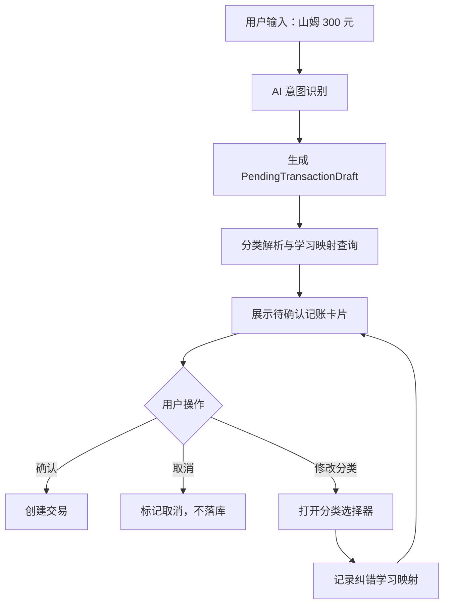

# HoloAI 记账确认与分类学习方案

> **状态：方案草案，待评审。**

**Goal:** 将 HoloAI 财务记账从“AI 直接创建交易”调整为“AI 先生成待确认账单，用户确认后落库；用户纠正分类后系统学习，下次优先沿用”的闭环。

**核心判断:** 不能依赖补全商户 catalog 解决分类准确性。长尾商户、菜市场、小店、临时备注无法穷举。正确方向是让系统具备个性化学习能力：用户第一次改对后，下次同类输入优先复用用户确认过的分类。

---

## 一、背景

当前 HoloAI 财务识别存在两类问题：

1. **识别深度不足**
   AI 有时只识别到一级分类，例如把“山姆 300 元”识别为“购物”，没有稳定落到具体二级分类。

2. **缺乏纠错学习闭环**
   用户以前可能已经把“山姆”记到“餐饮 / 超市”，但系统下次仍可能按模型常识重新猜成“购物”。这说明当前系统没有把用户纠正过的分类作为最高优先级。

本方案不以“补更多商户别名”为主路径，而是建立确认、纠错、学习、复用的完整闭环。

---

## 二、设计原则

### 2.1 交易必须经用户确认

HoloAI 不应在解析完成后立即创建交易，而是先展示待确认记账卡片。

用户明确点击「确认」后才落库；点击「取消」则不创建交易。

### 2.2 交易必须落到二级分类

记账不允许只选择一级分类。一级分类只能用于分组、展示和筛选，不能作为交易最终分类。

如果 AI 只能判断到一级分类，卡片应进入待确认状态，并提示用户修改到具体二级分类或使用“待分类”二级分类兜底。

### 2.3 纠错即学习

只要用户修改了 AI 给出的分类，就记录学习映射，不限于“待分类”场景。

以下情况都应触发学习：

- AI 识别为“购物 / 日用”，用户改为“餐饮 / 超市”。
- AI 识别为“待分类”，用户改为“餐饮 / 超市”。
- AI 识别为“餐饮 / 午餐”，用户改为“餐饮 / 超市”。

### 2.4 学习结果优先于模型猜测

分类优先级应调整为：

```text
用户学习映射 > 用户历史同候选记录 > 本地真实二级科目匹配 > AI 建议 > 待分类
```

AI 只提供候选语义，不作为最终裁决者。

---

## 三、目标交互

### 3.1 输入示例

用户输入：

```text
山姆 300 元
```

HoloAI 返回一张待确认记账卡片：

```text
支出 ¥300
备注：山姆
分类：购物 / 日用

分类不对？修改分类

[确认]   [取消]
```

按钮文案固定为：

- 「确认」：按当前卡片内容创建交易。
- 「取消」：放弃本次记账，不创建交易。

### 3.2 分类不确定时

如果系统无法可靠识别二级分类：

```text
支出 ¥300
备注：山姆
分类：待分类

我还不确定这个分类。你可以修改一次，我下次会记住。

[确认]   [取消]
```

用户可以直接确认落到“其他 / 待分类”，也可以先点“修改分类”改成“餐饮 / 超市”。

### 3.3 用户修改分类后

用户将分类改为：

```text
餐饮 / 超市
```

卡片展示：

```text
支出 ¥300
备注：山姆
分类：餐饮 / 超市

已学习：下次遇到“山姆”会优先建议“餐饮 / 超市”，你仍可修改。

[确认]   [取消]
```

学习提示应克制，不需要弹窗打断。

---

## 四、数据流



关键变化：

- `record_expense` / `record_income` 不再立即调用 `FinanceRepository.addTransaction`。
- AI 路由先创建内存态或消息态草稿。
- 只有用户点击「确认」后才真正落库。

---

## 五、核心模型

### 5.1 待确认交易草稿

建议新增或扩展卡片数据结构：

```swift
struct PendingTransactionDraft {
    let id: UUID
    let type: TransactionType
    let amount: Decimal
    let note: String?
    let accountId: UUID?

    let rawInput: String
    let categoryCandidate: String?
    let normalizedCategoryCandidate: String?
    let semanticCategoryHint: String?

    let aiPrimaryCategory: String?
    let aiSubCategory: String?
    var selectedCategoryId: UUID?
    var selectedPrimaryName: String?
    var selectedSubName: String?

    var status: PendingTransactionStatus
}
```

```swift
enum PendingTransactionStatus {
    case pending
    case confirmed(transactionId: UUID)
    case cancelled
}
```

### 5.2 学习映射

现有 `CategoryLearnedMapping` 可以继续复用，但触发条件需要扩大。

建议记录维度：

```text
type
candidate
normalizedCandidate
originalPrimary
originalSub
targetPrimary
targetSub
source=user_correction
updatedAt
```

第一期可以继续落在 `UserDefaults`，后续再迁移到 Core Data，方便展示、编辑和同步。

---

## 六、学习规则

### 6.1 候选词选择

学习映射的 key 不应直接使用完整输入，而应优先使用稳定候选：

1. `categoryCandidate`
2. `normalizedCategoryCandidate`
3. 从 `note` 中抽取出的商户/关键词

例如：

```text
rawInput: 山姆 300 元
candidate: 山姆
target: 餐饮 / 超市
```

下次以下输入可优先尝试命中：

```text
山姆 280
山姆买东西 120
山姆会员店 500
```

第一期先做精确 candidate 命中；第二期再做相似归并。

### 6.2 触发学习的时机

用户在待确认卡片里修改分类时：

```text
AI 原分类 != 用户选择分类
```

则立即记录学习映射。

用户在交易详情页修改分类时：

```text
交易存在 AI 创建来源 / 暂存 candidate
且旧分类 != 新分类
```

也记录学习映射。

### 6.3 不学习的情况

以下情况不记录学习：

- 用户没有修改分类，仅点击「确认」。
- 用户点击「取消」。
- 用户选择的分类不是二级分类。
- 分类被改为“待分类”。

---

## 七、与现有链路的关系

### 7.1 IntentRouter

当前 `IntentRouter` 直接处理 `record_expense` / `record_income` 并创建交易。新方案中它应改为：

1. 解析金额、备注、类型、候选分类。
2. 尝试解析二级分类。
3. 构造 `PendingTransactionDraft`。
4. 返回待确认卡片。

### 7.2 TransactionChatCard

现有交易卡片需要扩展两种状态：

- `pending`：显示「确认」「取消」和“修改分类”入口。
- `confirmed`：显示已创建交易，可进入详情。
- `cancelled`：显示已取消，不可再次确认，必要时提供“重新生成”入口。

### 7.3 CategoryLearnedMapping

现有学习机制偏向“待分类交易被用户编辑后学习”。需要改为更通用：

```text
任意 AI 创建/草稿交易，只要用户把 AI 分类改成另一个二级分类，就学习。
```

---

## 八、实施分期

### Phase 1：确认式记账

- 新增待确认交易草稿状态。
- HoloAI 记账不再直接落库。
- 待确认卡片提供「确认」「取消」。
- 确认后创建交易。
- 取消后不创建交易。
- 卡片展示当前分类和“修改分类”入口。

验收：

- 输入“山姆 300 元”不会立刻创建交易。
- 点击「确认」后才新增交易。
- 点击「取消」后不新增交易。

### Phase 2：纠错学习

- 待确认卡片支持修改分类。
- 修改分类后记录学习映射。
- 下次相同 candidate 优先命中学习映射。

验收：

- 第一次“山姆 300”改成“餐饮 / 超市”并确认。
- 第二次“山姆 280”默认展示“餐饮 / 超市”。

### Phase 3：学习管理与透明反馈

- 设置页展示学习映射列表。
- 支持删除错误学习。
- 卡片中展示轻量学习反馈：“已学习，下次会优先使用该分类”。

验收：

- 用户能看到“山姆 -> 餐饮 / 超市”。
- 删除后，下次不再套用该学习映射。

### Phase 4：候选归并

- 将“山姆”“山姆会员店”“山姆买东西”归并到同一学习候选。
- 支持基于历史同备注记录的推荐。

验收：

- 用户无需为明显同源表达重复纠正。

---

## 九、二级分类约束

本方案要求交易最终分类必须是二级分类。

已完成的底层修复包括：

- `FinanceRepository.addTransaction` / `updateTransaction` / `addInstallmentTransactions` 统一校验 `category.isSubCategory`。
- 手动记账保存按钮必须选择二级分类才可用。
- AI 匹配结果只接受二级分类。
- “待分类”必须是挂在父分类下的二级分类。
- CSV 导入即使一级/二级同名，也创建二级节点，不再把交易挂到一级分类。
- 余额调整交易使用二级系统分类。

这条约束应作为后续所有记账入口的硬性规则。

---

## 十、测试计划

### 10.1 单元测试

- `FinanceRepository.addTransaction` 传入一级分类应抛出 `subCategoryRequired`。
- `FinanceRepository.updateTransaction` 更新为一级分类应抛出 `subCategoryRequired`。
- AI 匹配 `primary=购物, sub=购物` 时不能返回一级分类。
- `CategoryLearnedMapping` 能记录并查询 `山姆 -> 餐饮 / 超市`。

### 10.2 集成测试

- “山姆 300 元”生成待确认卡片，不直接创建交易。
- 点击「确认」后创建交易。
- 点击「取消」后不创建交易。
- 修改分类后确认，学习映射生效。
- 第二次输入同一 candidate，默认使用学习分类。

### 10.3 回归测试

- 手动记账仍能正常保存二级分类交易。
- 分期记账仍能正常创建。
- CSV 导入仍能完成，但交易全部挂到二级分类。
- 余额调整仍能创建交易，且分类为二级系统分类。

---

## 十一、风险与取舍

### 11.1 交互成本增加

每笔 AI 记账都需要用户确认，会比直接落库多一步。

但财务数据是强准确性场景，确认成本是合理的。后续可以在高置信学习命中时提供“一键确认”的轻量体验，而不是回到自动落库。

### 11.2 学习错误会被复用

如果用户误改分类，系统可能下次沿用错误分类。

因此 Phase 3 必须提供学习映射管理入口，允许用户删除或修正。

### 11.3 Candidate 抽取质量影响学习

如果 candidate 抽错，例如把“山姆买牛奶”整体作为 key，复用能力会变弱。

第一期先保证精确 candidate 可用；第二期再做候选归并和商户词抽取。

---

## 十二、对抗性工程审查记录

> **审查时间**：2026-05-31
> **审查工具**：plan-eng-review (gstack)
> **审查结论**：DONE_WITH_CONCERNS — 方向正确，11 个设计缺失已补充，5 个 CRITICAL GAP 需实施时补齐

### 12.1 审查范围确认

| 决策项 | 结论 |
|--------|------|
| 实施范围 | Phase 1（确认式记账）+ Phase 2（纠错学习）全做 |
| Phase 3/4 | 按原方案分期 |

### 12.2 已解决的设计决策（11 项）

#### D1: PendingTransactionDraft 存储位置

**问题**：方案说"内存态或消息态"，没有定义 draft 的持久化策略。SwiftUI LazyVStack 会回收 cell，App 后台被杀会丢失 draft。

**决策**：持久化到现有 Message 实体的 `extractedData` 字段中，不新建 Core Data 实体。

**理由**：
- Message 已有 `extractedDataDictionary` 的持久化机制，draft 数据可以序列化进去
- 重启后从 Message 恢复 pending 状态，无状态丢失风险
- 复用现有持久化机制，零新增 Core Data 复杂度
- Draft 的 status 变更同步写回 Message，Cell 回收安全

**实施要点**：
- `IntentRouter` 构造 draft 后，序列化为字典写入 `Message.extractedData`
- `ChatViewModel` 从 `Message.extractedData` 反序列化 draft 状态
- 确认/取消后更新 Message 中的 draft status 字段

#### D2: 确认/取消的事件流架构

**问题**：当前 `TransactionChatCard` 只有 `onTap` 回调，方案没有定义确认/取消按钮如何把事件传回 FinanceRepository。

**决策**：ViewModel 闭包回调模式。

```
TransactionChatCard(onConfirm/onCancel/onCategoryChange)
    → ChatViewModel (持有 draft 状态)
        → FinanceRepository.addTransaction / 标记取消
```

**理由**：
- 与现有单向数据流 `ChatViewModel → MessageBubbleView → TransactionChatCard` 兼容
- ChatViewModel 已是聊天交互的中心节点，增加 draft 管理职责自然
- 不需要新增单例类，避免过度设计

**实施要点**：
- `TransactionChatCard` 新增 `onConfirm`、`onCancel`、`onCategoryChange` 闭包参数
- `ChatViewModel` 新增 `confirmDraft(messageId:)`、`cancelDraft(messageId:)`、`modifyDraftCategory(messageId:)` 方法
- draft 状态由 ChatViewModel 通过 `@Published` 属性持有，驱动 UI 刷新

#### D3: RouteResult 结构改造

**问题**：当前 `RouteResult` 返回 `transactionId`（已创建交易）。新方案要求 IntentRouter 不创建交易，只返回草稿数据。

**决策**：扩展现有 `RouteResult` struct，新增 draft 相关字段。

```swift
struct RouteResult {
    let text: String
    let transactionId: UUID?         // pending 阶段为 nil，确认后由 ViewModel 填入
    let taskId: UUID?
    let habitId: UUID?
    let thoughtId: UUID?
    let linkedEntity: LinkedEntity?
    let categoryUnmatched: Bool
    let matchedPrimaryCategory: String?
    let matchedSubCategory: String?

    // 新增：待确认交易草稿
    var pendingDraft: PendingTransactionDraft?
    var isPendingConfirmation: Bool { pendingDraft != nil }
}
```

**理由**：
- 不拆分为枚举，避免影响其他意图类型（task、habit 等）的处理逻辑
- `transactionId` 在 pending 阶段为 nil，确认后由 ViewModel 调用 `addTransaction` 拿到真实 ID 再更新 Message
- 其他意图类型的 RouteResult 不受影响

#### D4: 分类修改的 UI 形式

**问题**：方案只说"提供修改分类入口"，没有定义交互形式。同时方案只允许改分类，但实际用户可能还想改金额/备注。

**决策**：从 pending 卡片弹出半屏 Sheet，复用现有分类选择器逻辑。

**理由**：
- 复用 `AddTransactionSheet` 中的分类选择组件，不需要新写
- Sheet 可以连带支持修改金额/备注（扩展性好）
- 半屏 Sheet 不完全遮挡聊天上下文

**实施要点**：
- 提取现有 `AddTransactionSheet` 中的分类选择逻辑为独立组件
- Sheet 接收 draft 数据预填，返回修改后的 draft
- ChatViewModel 处理 Sheet 的回调，更新 draft 状态

#### D5: 学习映射冲突策略

**问题**：同一商户可能产生冲突的学习映射（"山姆"→"餐饮/超市" vs "山姆"→"日用/牛奶"）。

**决策**：接受"后写覆盖"行为，同一 candidate 只保留最近一次纠正。Phase 4 做候选归并时再解决。

**理由**：
- 当前 `CategoryLearnedMapping` 用 `type|primary|candidate` 做 key，天然是单值
- 同一商户的不同商品场景在实际使用中比例不高
- Phase 3 管理入口允许用户手动删除错误映射
- 过早引入多值映射增加实现复杂度，收益不明确

#### D6: 三层数据结构的 DRY 处理

**问题**：`PendingTransactionDraft`、`TransactionCardData`、`IntentRouter.extractedData` 三处都有分类/金额/备注字段。

**决策**：保持三层分立，用 `init(from:)` 工厂方法统一转换逻辑。

```
IntentRouter extractedData (AI 解析层)
    → PendingTransactionDraft.init(from: extractedData) (业务模型层)
        → TransactionCardData.init(from: draft) (UI 展示层)
```

**理由**：
- 三层职责不同：解析层提取、模型层持有状态、展示层格式化
- 合并任何两层会违背职责分离
- 用工厂方法集中转换逻辑，避免散落的字段拷贝

#### D7: 确认失败时的错误处理

**问题**：用户点确认时 `FinanceRepository.addTransaction` 可能失败（分类被删除、账户被删除等），方案没有处理。

**决策**：卡片内显示错误信息，状态回退到 pending 让用户重新选择。

**实施要点**：
- `PendingTransactionStatus` 新增 `.failed(reason: String)` 状态
- 确认失败时卡片显示"记账失败：分类不存在，请重新选择"
- 用户可以重新选择分类后再次确认
- 错误状态不影响其他 pending draft

**可能的失败场景**：

| 场景 | 处理方式 |
|------|---------|
| 选中的二级分类被删除 | 卡片提示"分类不存在"，回 pending |
| 关联的账户被删除 | 卡片提示"账户不存在"，回 pending |
| Core Data 写入失败 | 卡片提示"保存失败"，回 pending |

#### D8: AI 创建交易的标记机制

**问题**：方案说"任意 AI 创建交易的分类变更都学习"，但 `Transaction` 实体没有"AI 创建"标记。当前只有"待分类"交易才存了 candidate，其他 AI 交易在详情页编辑时无法触发学习。

**决策**：在 Core Data `Transaction` 实体新增 `isAICreated` Bool 字段。

**实施要点**：
- 新增字段，默认值 `false`，Core Data lightweight migration 自动处理
- `IntentRouter` 创建交易（Phase 1 确认后）时标记 `isAICreated = true`
- 交易详情页编辑分类时，检查 `transaction.isAICreated == true` 且旧分类 != 新分类，触发 `CategoryLearnedMapping.record()`
- 同时保存 `categoryCandidate` 到交易（新增 `aiCandidate` String 字段），用于学习映射的 key

#### D9: matchCategory 优先级链完整改造

**问题**：方案 2.4 节声明的新优先级和当前实现不对齐，"用户历史同候选记录"是全新概念，代码库中不存在。

**决策**：完整实现新优先级链（7 层）。

```
新优先级（从高到低）：
1. CategoryLearnedMapping.lookup（用户学习映射）
2. 历史同候选记录缓存（新增）
3. 精确匹配（sub + primary 完全一致）
4. 自定义分类匹配
5. 标准 catalog 别名
6. note 降级匹配
7. 原始 candidate
兜底：待分类
```

**理由**：
- 学习映射提至第 1 位：用户纠正过的映射应优先于任何猜测
- 精确匹配降至第 3 位：catalog 的精确匹配不应覆盖用户的个性化偏好
- 历史同候选记录是介于"学习"和"猜测"之间的补充层

#### D10: 测试覆盖范围扩展

**问题**：方案原测试计划只覆盖 12 条路径，实际需要 45+ 条。有 5 个 CRITICAL GAP。

**决策**：完整覆盖所有路径。

**CRITICAL GAP（必须测试）**：

| 编号 | 缺口 | 风险 |
|------|------|------|
| C1 | addTransaction 确认失败时的卡片错误状态 | 用户不知道记账失败 |
| C2 | 多 draft 并存时的状态一致性 | 可能重复创建交易 |
| C3 | Core Data migration (isAICreated) | 迁移失败导致 crash |
| C4 | App 重启后 pending 卡片恢复 | 丢失待确认交易 |
| C5 | 学习映射误匹配后的影响范围 | 所有同 candidate 交易都错 |

**补充测试清单（在原方案第十节基础上扩展）**：

单元测试新增：
- `IntentRouter.handleRecordExpense` 不调用 `addTransaction`，返回 draft
- `RouteResult.isPendingConfirmation` 正确判断
- `PendingTransactionDraft` 序列化/反序列化往返一致
- `CategoryLearnedMapping.lookup` 在新第 1 优先级命中时的行为
- 历史同候选记录缓存查询命中/未命中
- `Transaction.isAICreated` 标记正确传播
- `matchCategory` 7 层优先级的每一层独立命中
- 确认失败时 `PendingTransactionStatus.failed` 正确设置

集成测试新增：
- 多笔 pending draft 并存，各自独立确认/取消
- App 重启后从 Message 恢复 pending 状态
- 交易详情页编辑分类触发学习（isAICreated = true 场景）
- 分类被删除后确认，卡片显示错误并回退
- Sheet 修改分类/金额后 draft 正确更新
- 学习映射删除后下次不再命中

回归测试新增：
- 其他意图类型（task、habit、thought）的 RouteResult 不受影响
- 现有"待分类"交易详情页编辑仍正常触发学习
- 非端到端场景：手动记账不设置 isAICreated

#### D11: 历史同候选记录的性能方案

**问题**："历史同候选记录"层需要在每次 AI 记账时查询交易历史，引入 Core Data I/O 到原纯内存的关键路径。

**决策**：内存缓存层，类似 `CategoryLearnedMapping` 的维护模式。

**实施要点**：
- 新增 `RecentCandidateCache`（参考 CategoryLearnedMapping 的 UserDefaults 模式）
- `FinanceRepository.addTransaction` 成功时，如果交易有 `note`，提取候选词同步写入缓存
- 缓存结构：`candidate → (categoryId, date)`，按日期排序保留最近 N 条
- `matchCategory` 第 2 层查询缓存，O(1) 命中
- 缓存容量上限（如 500 条），LRU 淘汰

### 12.3 NOT in scope（明确推迟）

| 推迟项 | 原因 |
|--------|------|
| 候选归并（Phase 4） | 方案已明确推迟 |
| 高置信度自动确认 | 所有交易先走确认流程，后续优化 |
| 多值学习映射 | 同一 candidate 多 target，推迟到 Phase 4 |
| 语音记账的确认流程适配 | Phase 1 先覆盖文本输入 |
| 后端 Prompt 改造 | 本方案只改 iOS 端 |

### 12.4 失败模式清单

| 失败场景 | 有测试 | 有错误处理 | 用户看到 | 严重度 |
|---------|--------|-----------|---------|--------|
| 确认时分类已被删除 | 需补 | 已设计（卡片内错误） | 错误提示 → 重新选择 | CRITICAL |
| 多 draft 并存导致重复创建 | 需补 | 需实施时防重 | 可能重复记账 | CRITICAL |
| Core Data migration 失败 | 需补 | lightweight migration 自动处理 | App 启动异常 | HIGH |
| App 重启后 pending 恢复 | 需补 | 已设计（持久化到 Message） | 正常恢复 | MEDIUM |
| 学习映射误匹配 | 需补 | Phase 3 管理入口可修正 | 分类错误 | MEDIUM |
| 交易详情页改分类不触发学习 | 需补 | 已设计（isAICreated） | 学习遗漏 | HIGH |

### 12.5 实施依赖与并行策略

> **第二轮审查修订**：本小节为 GLM 第一轮建议，已被第 13.5 节的实施顺序修订。执行时以第 13.5 节为准，尤其是：先复用 `create_task` 的 `executionBatch/skipped item` 待确认模式，再扩展数据层学习能力；不要按本小节直接先做 `RecentCandidateCache`。

```
Lane A: 数据层（先行）
├── Transaction 加 isAICreated + aiCandidate 字段
├── CategoryLearnedMapping 扩展触发条件
├── RecentCandidateCache 新增
└── matchCategory 新 7 层优先级链

Lane B: UI 层（依赖 Lane A）
├── PendingTransactionDraft 模型定义
├── RouteResult 扩展 draft 字段
├── IntentRouter 改为返回 draft
├── TransactionChatCard 四状态改造
├── ChatViewModel 确认/取消/修改逻辑
├── 分类选择 Sheet 提取与集成
└── Message extractedData 持久化/恢复
```

Lane A 内部 4 个子任务可并行（不同文件），Lane A 完成后 Lane B 启动。

---

## 十三、第二轮对抗性审查记录

> **审查时间**：2026-05-31  
> **审查对象**：第十二章 GLM / gstack 工程审查记录  
> **审查结论**：GLM 审查方向正确，但其中 5 项决策需要纠偏，3 项应降级到后续阶段，2 项遗漏了当前代码已有模式。实施时应以本章裁决为准。

### 13.1 总体裁决

GLM 的审查补上了原方案缺失的持久化、事件流、错误处理、测试覆盖等问题，这些问题成立。

但它有一个核心偏差：把“待确认记账”设计成一套新的 `PendingTransactionDraft + RouteResult.pendingDraft + RecentCandidateCache` 体系，忽略了当前代码已经有一条更贴近需求的模式：

```text
create_task 待确认流
  → ConversationCoordinator 生成 AIExecutionItem(status: .skipped)
  → renderData["confirmationStatus"] = "pending"
  → executionBatchJSON 持久化到 ChatMessage
  → ChatViewModel.confirmPendingTask 再调用 IntentRouter.route 真正创建实体
```

因此，HoloAI 记账确认流应优先复用 `create_task` 的确认架构，而不是另起一套 draft 持久化与 RouteResult 分支。

### 13.2 必须纠偏的 GLM 决策

#### R1: Draft 持久化不应只写 `extractedDataJSON`

GLM D1 说将 draft 持久化到 Message 的 `extractedData` 字段。这个结论不够准确。

真实实现中：

- `ChatMessage` 持久化字段是 `extractedDataJSON`、`parsedBatchJSON`、`executionBatchJSON`。
- 单卡旧路径会从 `extractedDataJSON` 渲染。
- 多动作和待确认任务的真实渲染主路径是 `executionBatchJSON`。
- `ChatMessageViewData` 的 linked entity 解析也已经明确“新路径 executionBatch 优先，旧路径 extractedDataJSON 兜底”。

**第二轮裁决：**

记账 pending 状态必须以 `executionBatch.items[].renderData` 为主存储位置：

```text
AIExecutionItem.status = .skipped
renderData["confirmationStatus"] = "pending"
renderData["pendingKind"] = "transaction"
renderData["amount"] = ...
renderData["type"] = "expense" / "income"
renderData["categoryCandidate"] = ...
renderData["selectedCategoryId"] = ...
```

`extractedDataJSON` 只保留首项兼容字段，不能作为多 draft 的唯一状态源。

#### R2: 不应优先改 `RouteResult`，应优先复用 Coordinator 的 skipped item 模式

GLM D3 建议给 `RouteResult` 增加 `pendingDraft`。这会让 `IntentRouter` 同时承担“执行动作”和“创建待确认草稿”两种职责，边界变浑。

当前 `ConversationCoordinator` 已经对 `createTask` 做了执行前拦截：

```swift
if item.intent == .createTask {
    renderData["confirmationStatus"] = "pending"
    executionItems.append(status: .skipped)
    continue
}
```

**第二轮裁决：**

`record_expense` / `record_income` 应在 `ConversationCoordinator` 中走同样模式：

```text
record_expense / record_income
  → 不调用 IntentRouter.route
  → 先生成 skipped execution item
  → 用户点「确认」后，ChatViewModel 再调用 IntentRouter.route
```

这样可以最大限度复用现有待确认任务流，也减少对 `RouteResult`、`IntentRouting` mock、其他意图类型的影响。

#### R3: `PendingTransactionStatus.failed` 与现有 `AIExecutionStatus` 不匹配

GLM D7 提出新增 `PendingTransactionStatus.failed(reason:)`，但当前持久化的执行状态是 `AIExecutionStatus`，只有：

```swift
success / failed / skipped
```

如果另建 `PendingTransactionStatus`，需要额外处理它与 `AIExecutionItem.status` 的同步，反而引入双状态源。

**第二轮裁决：**

第一期不要新增独立状态枚举。使用现有字段组合表达：

| 场景 | `AIExecutionItem.status` | `renderData["confirmationStatus"]` |
|------|--------------------------|------------------------------------|
| 待确认 | `skipped` | `pending` |
| 已确认 | `success` | `confirmed` |
| 已取消 | `skipped` | `cancelled` |
| 确认失败但可重试 | `skipped` | `failed` |

错误文案放在：

```text
renderData["confirmationError"]
```

这样卡片仍可渲染、可重试，也不会误用 `AIExecutionStatus.failed` 导致系统把它当成不可恢复执行失败。

#### R4: “历史同候选记录缓存”不应进入 Phase 1/2 主线

GLM D9 / D11 把“用户历史同候选记录”提升为第 2 优先级，并设计 `RecentCandidateCache`。

这个方向有风险：

- 它可能把用户从未纠正过的普通历史记录当成学习结果。
- 如果 `FinanceRepository.addTransaction` 对所有 note 自动写缓存，会污染学习链路。
- 缓存里存 `categoryId` 时必须处理分类删除、重命名、跨类型同名等问题。
- 这不是用户当前最核心诉求。用户要的是“我改对一次，下次记住”，不是“系统从所有历史里猜”。

**第二轮裁决：**

Phase 1/2 的优先级应收敛为：

```text
用户显式学习映射 > 本地真实二级科目匹配 > 标准 catalog 别名 > 待分类
```

“历史同候选记录”降级到 Phase 4，且必须满足：

- 只读取 AI 创建且已确认的交易，不能读取所有手动交易。
- 命中前校验 category 仍存在且仍是二级分类。
- 只作为“建议分类”，不能覆盖显式学习映射。

#### R5: “后写覆盖”不能被描述为低风险

GLM D5 认为同一商户不同商品场景比例不高，可以接受后写覆盖。这个判断对“山姆、菜市场、便利店、淘宝、京东”等场景并不稳。

同一个 candidate 可能对应：

- 山姆买食品：餐饮 / 超市
- 山姆买清洁用品：购物 / 日用
- 山姆买电器：居住 / 家电

**第二轮裁决：**

第一期仍可采用“单 candidate 最近一次纠正覆盖”，但必须把它标为有意取舍，而不是低风险事实。

卡片学习提示也不能说得过满：

```text
已学习：下次遇到“山姆”会优先建议“餐饮 / 超市”，你仍可修改。
```

不要写成：

```text
以后遇到“山姆”会归到“餐饮 / 超市”。
```

### 13.3 应采纳的 GLM 结论

以下 GLM 结论成立，应保留：

| 编号 | 裁决 |
|------|------|
| D2 | 事件应从卡片回到 `ChatViewModel`，再由 ViewModel 调仓库/路由执行 |
| D4 | 分类修改应使用半屏 Sheet，但第一期只要求分类修改，金额/备注可作为后续增强 |
| D6 | 解析层、业务状态层、展示层保持分离，用工厂方法转换 |
| D8 | 已确认交易需要保留 AI 来源和 candidate，否则详情页二次纠错无法学习 |
| D10 | 多 draft、重启恢复、确认失败、学习误匹配都必须测试 |

### 13.4 需要补充的遗漏

#### O1: 多动作语句中的记账确认

如果用户说：

```text
山姆 300，明天提醒我买牛奶
```

当前多动作架构会生成多个 `AIExecutionItem`。记账 pending 不能阻断任务 pending，也不能因为其中一个确认而影响另一个。

实施时每个 pending item 必须通过 `executionItem.id` 或 `parseItemId` 精确定位，而不是只按 messageId 找第一张卡。

#### O2: 防重复确认必须进入 Phase 1

多次点击「确认」、网络/主线程卡顿、View 刷新重复触发，都可能造成重复记账。

确认逻辑必须满足：

```text
只有 confirmationStatus == pending 的 item 可以确认
确认开始时先写入 confirming 或本地 inFlight 锁
确认成功后写 transactionId + confirmed
再次点击确认必须 no-op
```

如果第一期不想扩展状态枚举，可在 ViewModel 内维护 `confirmingExecutionItemIds`，但持久状态仍必须最终写回 `executionBatchJSON`。

#### O3: 已完成的二级分类约束需要作为前置依赖

本方案依赖“交易必须挂二级分类”的底层约束。该约束已经在本地修复过，但实施确认式记账时仍要把它当作前置条件：

- pending 卡片不能确认一级分类。
- 分类 Sheet 不能返回一级分类作为最终选择。
- 确认时仍以 `FinanceRepository` 的 `subCategoryRequired` 错误作为最后防线。

### 13.5 修订后的实施顺序

第二轮审查后，推荐实施顺序改为：

```text
Step 0: 保留并验证二级分类硬约束

Step 1: 复用 create_task 待确认模式
  - ConversationCoordinator 对 record_expense / record_income 生成 skipped item
  - renderData 写 confirmationStatus=pending
  - 卡片显示「确认」「取消」

Step 2: ChatViewModel 确认/取消交易
  - 按 executionItem.id 精确定位
  - 确认时再调用 IntentRouter.route
  - 成功后写 transactionId/entityId/confirmed
  - 取消后写 cancelled

Step 3: 分类修改 Sheet
  - 先只支持修改分类
  - 返回二级分类 id 和展示名
  - 更新 renderData，不落库

Step 4: 显式纠错学习
  - 只在用户修改分类后学习
  - 记录 candidate -> target primary/sub
  - confirmed 后交易写 isAICreated + aiCandidate

Step 5: 交易详情页二次纠错学习
  - 仅对 isAICreated 且有 aiCandidate 的交易生效
```

Phase 1/2 不做 `RecentCandidateCache`，不做自动历史推断，不做高置信自动确认。

### 13.6 第二轮后的最终边界

| 能力 | Phase 1/2 是否做 | 说明 |
|------|------------------|------|
| 文本 AI 记账待确认 | 做 | 复用 executionBatch skipped item |
| 按钮文案「确认」「取消」 | 做 | 不使用“确认记账/不确认记账” |
| 分类修改 | 做 | 第一版只改分类 |
| 金额/备注修改 | 暂缓 | 可在 Sheet 结构中预留 |
| 显式纠错学习 | 做 | 用户改分类才学习 |
| 历史同候选推断 | 暂缓 | 降级 Phase 4 |
| 候选归并 | 暂缓 | Phase 4 |
| 高置信自动落库 | 不做 | 所有 AI 记账都确认 |
| 语音记账 | 如果进入同一 Chat 文本管线则自然覆盖 | 不单独做语音专属流程 |

---

## 十四、第三轮审查：Claude 对 GPT 纠偏的终裁

> **审查时间**：2026-05-31
> **审查方**：Claude (plan-eng-review)
> **审查对象**：第十三章 GPT 第二轮审查的 R1-R5 纠偏与 O1-O3 遗漏
> **审查结论**：GPT 全部 5 项纠偏经验证正确，全部接受。第十三章的实施顺序（13.5 节）作为最终执行依据。

### 14.1 验证过程

GPT 引用了 7 个代码模式来支撑其纠偏。Claude 通过代码库验证：

| 模式 | 验证结果 | 关键文件 |
|------|---------|---------|
| ConversationCoordinator 拦截 createTask | 确认存在 | `Services/AI/ConversationCoordinator.swift:172-189` |
| AIExecutionItem(.skipped) | 确认存在 | `Models/AI/AIModels.swift:220-230` |
| executionBatchJSON 与 extractedDataJSON 并列 | 确认存在 | `ChatMessage+CoreDataProperties.swift:26,30` |
| ChatViewModel.confirmPendingTask | 确认存在 | `Views/Chat/ChatViewModel.swift:507-572` |
| AIExecutionStatus (.success/.failed/.skipped) | 确认存在 | `Models/AI/AIModels.swift:132-136` |
| renderData["confirmationStatus"] pending/confirmed 流转 | 确认存在 | Coordinator:174 / ChatCardData:67 / ChatViewModel:531 |
| ChatMessageViewData executionBatch 优先兜底 | 确认存在 | `ChatMessageViewData.swift:381-404` |

**7/7 全部验证通过。** GPT 的代码引用准确无误。

### 14.2 逐项裁决

#### R1: Draft 持久化 → 接受纠偏

| | 第十二章决策（Claude） | 第十三章纠偏（GPT） |
|---|---|---|
| 存储位置 | `extractedDataJSON`（旧路径） | `executionBatch.items[].renderData`（新路径） |

**Claude 犯错原因**：追踪了 `TransactionChatCard` → `TransactionCardData` → `extractedDataDictionary` 旧路径，没有发现 `MessageBubbleView` 中 `executionBatch` 优先的新渲染管线。

**终裁**：记账 pending 状态必须存入 `executionBatchJSON`，复用 `AIExecutionItem(status: .skipped)` + `renderData["confirmationStatus"] = "pending"` 模式。

#### R2: RouteResult vs Coordinator → 接受纠偏

| | 第十二章决策（Claude） | 第十三章纠偏（GPT） |
|---|---|---|
| 方案 | 扩展 RouteResult 新增 pendingDraft 字段 | 在 Coordinator 中拦截，走 skipped item 模式 |
| IntentRouter 职责 | 同时负责执行和创建草稿 | 保持"只负责执行"单一职责 |

**终裁**：`record_expense`/`record_income` 在 `ConversationCoordinator` 中走与 `createTask` 相同的拦截模式。用户确认后 `ChatViewModel` 再调用 `IntentRouter.route` 真正执行。不改 `RouteResult`。

#### R3: 状态枚举 → 接受纠偏

| | 第十二章决策（Claude） | 第十三章纠偏（GPT） |
|---|---|---|
| 方案 | 新建 PendingTransactionStatus 枚举 | 复用 AIExecutionStatus + renderData 组合 |
| 状态数 | 独立 4 值枚举 | 2 个现有字段的组合 |

**终裁**：不新建状态枚举。使用现有字段组合：

| 场景 | AIExecutionItem.status | renderData["confirmationStatus"] |
|------|------------------------|----------------------------------|
| 待确认 | `.skipped` | `pending` |
| 已确认 | `.success` | `confirmed` |
| 已取消 | `.skipped` | `cancelled` |
| 确认失败可重试 | `.skipped` | `failed` |

错误文案放在 `renderData["confirmationError"]`。

#### R4: 历史同候选记录 → 接受纠偏

| | 第十二章决策（Claude） | 第十三章纠偏（GPT） |
|---|---|---|
| Phase 1/2 | 完整 7 层优先级 + RecentCandidateCache | 简化 4 层优先级 |
| 历史推断 | Phase 2 实现 | 降级 Phase 4 |

**GPT 的关键论点**：历史同候选记录可能把从未纠正过的普通交易当成学习结果，污染分类链路。核心诉求是"我改对一次，你记住"，不是"你从所有历史里猜"。

**终裁**：Phase 1/2 优先级简化为：

```
用户显式学习映射 > 本地真实二级科目匹配 > 标准 catalog 别名 > 待分类
```

"历史同候选记录"和 `RecentCandidateCache` 降级到 Phase 4，且必须满足 GPT 提出的三个约束：只读 AI 创建且已确认的交易、命中前校验分类仍存在、只作为建议不覆盖显式学习。

#### R5: 后写覆盖风险表述 → 接受纠偏

**终裁**：方案文档中应将"后写覆盖"标注为有意取舍，而非低风险。卡片学习提示文案应保留"你仍可修改"的限定语，不说成绝对断言。

#### O1: 多动作语句 item 级定位 → 接受

复用 `executionBatch` 架构天然解决这个问题——每个 `AIExecutionItem` 有独立的 `id` 和 `parseItemId`，同一 Message 中的多个 pending item 互不干扰。

#### O2: 防重复确认 → 接受，Phase 1 必须

`ChatViewModel` 维护 `confirmingItemIds: Set<String>` 防重集合，确认开始时写入，成功后转为持久化状态。

#### O3: 二级分类前置约束 → 接受

已在原方案第九节定义，作为 Step 0 前置验证。

### 14.3 Claude 第十二章需要修正的决策

以下决策被第三轮审查推翻或修正：

| 编号 | 原决策 | 修正后 |
|------|--------|--------|
| D1 | 持久化到 extractedDataJSON | 持久化到 executionBatchJSON 的 renderData |
| D3 | RouteResult 新增 pendingDraft 字段 | 不改 RouteResult，在 Coordinator 层拦截 |
| D9 | 完整 7 层优先级链 | Phase 1/2 简化为 4 层，历史推断降级 Phase 4 |
| D11 | RecentCandidateCache Phase 2 实现 | 降级 Phase 4 |

以下决策保持不变：

| 编号 | 决策 | 理由 |
|------|------|------|
| D2 | ViewModel 闭包回调 | GPT 明确认可 |
| D4 | Sheet 弹出分类选择器 | GPT 认可，第一期只改分类 |
| D5 | 接受覆盖策略 | 保留，但风险表述按 R5 修正 |
| D6 | 三层分立 + 工厂方法 | GPT 认可 |
| D7 | 卡片内错误提示 | 保留，状态表达改为 renderData 组合 |
| D8 | Transaction 加 isAICreated | GPT 认可 |
| D10 | 45+ 路径测试覆盖 | GPT 认可，需按新架构调整测试项 |

### 14.4 最终实施顺序

以第 13.5 节为准，不再使用 12.5 节的 Lane A/B 划分。

```text
Step 0: 保留并验证二级分类硬约束

Step 1: 复用 create_task 待确认模式
  - ConversationCoordinator 对 record_expense / record_income 生成 skipped item
  - renderData 写 confirmationStatus=pending + pendingKind=transaction
  - 卡片显示「确认」「取消」
  - 按 executionItem.id 精确定位，支持多动作语句

Step 2: ChatViewModel 确认/取消交易
  - 复用 confirmPendingTask 模式，新增 confirmPendingTransaction
  - 确认时再调用 IntentRouter.route
  - 防重复：confirmingItemIds 集合
  - 成功后写 transactionId/entityId/confirmed
  - 取消后写 cancelled
  - 失败后写 failed + confirmationError，保留 pending 可重试

Step 3: 分类修改 Sheet
  - 先只支持修改分类，金额/备注在 Sheet 结构中预留
  - 返回二级分类 id 和展示名
  - 更新 renderData，不落库

Step 4: 显式纠错学习
  - 只在用户修改分类后学习
  - 记录 candidate → target primary/sub
  - 确认后交易写 isAICreated + aiCandidate
  - CategoryLearnedMapping.lookup 提升到第 1 优先级

Step 5: 交易详情页二次纠错学习
  - 仅对 isAICreated 且有 aiCandidate 的交易生效
```

### 14.5 三轮审查差异总结

| 维度 | 第一轮（Claude） | 第二轮（GPT） | 第三轮终裁 |
|------|-----------------|--------------|-----------|
| 架构方向 | 新建 PendingTransactionDraft 管道 | 复用 create_task skipped item 管道 | 采纳 GPT |
| 存储位置 | extractedDataJSON | executionBatchJSON | 采纳 GPT |
| RouteResult | 新增 pendingDraft 字段 | 不改，Coordinator 拦截 | 采纳 GPT |
| 状态管理 | 新建枚举 | 复用 AIExecutionStatus + renderData | 采纳 GPT |
| 优先级链 | 7 层含历史推断 | 4 层简化 | 采纳 GPT |
| 错误处理 | .failed(reason:) 枚举值 | renderData["confirmationError"] | 采纳 GPT |
| 确认防重 | 未提及 | 必须进入 Phase 1 | 采纳 GPT |
| AI 来源标记 | isAICreated + aiCandidate | 相同 | 两轮一致 |
| 测试覆盖 | 45+ 路径 | 认可，按新架构调整 | 两轮一致 |
| 后写覆盖 | 标为低风险 | 标为有意取舍 | 采纳 GPT |

---

## 十五、最终轮收敛审查（Codex）

> **审查时间**：2026-05-31  
> **审查目标**：在 GLM 第三轮审查基础上做最后一轮收敛，尽可能与 GLM 达成共识；若发现第三轮仍有偏差，明确标出给用户决策。  
> **最终结论**：GLM 第三轮的主判断成立，实施应采纳第 13.5 与第 14.4 节的路线。但文档前半部分仍保留了一些已被推翻的旧设计名词，实施前必须按本节明确的优先级执行，避免误读。

### 15.1 与 GLM 达成共识的最终执行原则

以下内容视为最终共识，不再重新争论：

| 共识点 | 最终采用方案 | 说明 |
|--------|--------------|------|
| Pending 状态来源 | 复用 `executionBatchJSON` | 不再新增独立 `PendingTransactionDraft` 持久化管道 |
| 拦截层级 | `ConversationCoordinator` 拦截 | 不改 `IntentRouter.RouteResult`，确认后再调用 `IntentRouter.route` 执行 |
| 状态表达 | `AIExecutionStatus` + `renderData["confirmationStatus"]` | 不新增 `PendingTransactionStatus` 枚举 |
| 卡片定位 | `AIExecutionItem.id` / `parseItemId` | 支持一条消息里多个待确认动作 |
| 用户操作 | 「确认」「取消」 | 不使用“确认记账/不确认记账”这类长文案 |
| 学习触发 | 只由用户显式改分类触发 | 不从普通历史记录里猜测学习结果 |
| Phase 1/2 优先级 | 显式学习映射 > 本地二级科目匹配 > catalog 别名 > 待分类 | `RecentCandidateCache`、历史同候选推断、高置信自动确认全部后置 |
| 二级分类约束 | 必须前置验证 | 不能允许没有二级分类的交易完成落库 |
| 防重复确认 | Phase 1 必做 | 至少使用 `confirmingItemIds`，并在执行前重读最新消息状态 |

这组共识同时覆盖了两个原始问题：

1. **识别深度不足**：AI 记账不能绕过二级分类硬约束；若无法定位二级分类，应进入可确认、可修改的待确认态，而不是直接落到一级分类。
2. **缺乏学习能力**：用户把“山姆”改成“餐饮 / 超市”后，系统记录显式学习映射；下次同候选优先命中用户映射，而不是继续依赖通用 catalog。

### 15.2 必须废弃或降级的旧描述

文档前半部分仍保留一些概念模型和审查历史。为避免实施误读，最终执行优先级如下：

```text
第 15 节 > 第 14.4 节 > 第 13.5 节 > 第 9 节二级分类约束 > 其他早期设计段落
```

以下旧描述只能作为历史背景或概念说明，不能按字面实施：

| 旧描述位置 | 旧方案 | 最终处理 |
|------------|--------|----------|
| 第 5.1 节 | `PendingTransactionDraft` 独立草稿模型 | 仅保留为概念模型；真实持久化在 `executionBatch.items[].renderData` |
| 第 7.1 节 | `IntentRouter` 返回待确认草稿 | 废弃；真实拦截发生在 `ConversationCoordinator` |
| 第 12.2 节 D1 | 写入 `extractedDataJSON` | 废弃；写入 `executionBatchJSON` |
| 第 12.2 节 D3 | `RouteResult.pendingDraft` | 废弃；不改 `RouteResult` |
| 第 12.2 节 D9 | 7 层优先级链 | 降级；Phase 1/2 只做 4 层 |
| 第 12.2 节 D11 | Phase 2 做 `RecentCandidateCache` | 降级到 Phase 4，且只能作为建议来源 |
| 第 12.5 节 | Lane A/B 拆分与缓存方案 | 已被第 13.5 / 14.4 节替代 |

因此，实施任务拆分时不要创建 `PendingTransactionDraft` 实体、不要扩展 `RouteResult`、不要优先实现 `RecentCandidateCache`。

### 15.3 我与 GLM 第三轮存在的细微偏差

GLM 第三轮整体判断正确，但有三处表述需要压实。

#### 偏差 1：Core Data 迁移不能说成“自动就安全”

GLM 接受 `Transaction` 新增 `isAICreated` 与 `aiCandidate`，这个方向我同意。但 HOLO 当前 Core Data 模型是代码构建的，不是只在 Xcode `.xcdatamodeld` 里点两个字段。实施时必须同步修改：

| 修改点 | 必须动作 |
|--------|----------|
| `CoreDataStack+FinanceEntities.swift` | 给 `Transaction` entity 增加 `isAICreated`、`aiCandidate` 属性 |
| `Transaction` 扩展/访问层 | 补齐字段访问方式，避免 KVC 字符串散落 |
| 交易创建路径 | AI 确认落库时写入 `isAICreated = true` 和原始候选 `aiCandidate` |
| 普通手动记账路径 | 明确默认 `isAICreated = false`，`aiCandidate = nil` |
| 迁移验证 | 用已有 store 做启动 smoke test，确认 additive migration 不破坏本地数据与 CloudKit 同步 |

我对 GLM 的修正意见是：**可以采用这两个字段，但不能把迁移风险描述成无条件自动处理。** 文档执行时必须把“已有数据库迁移验证”列为完成标准。

#### 偏差 2：防重复确认不能只靠内存集合

`confirmingItemIds: Set<String>` 是 Phase 1 合理方案，我同意 GLM 接受它。但只靠内存集合不能覆盖 App 被杀、重启、并发恢复等情况。Phase 1 可以不做持久化锁，但必须满足两个条件：

1. 点击「确认」后立即把 item id 加入 `confirmingItemIds`，阻止同一会话内连点。
2. 真正执行 `IntentRouter.route` 前，从当前 `ChatMessage.executionBatchJSON` 重读该 item，确认仍是 `confirmationStatus = pending`，否则直接返回，不再创建交易。

如果用户要求崩溃恢复级别的强一致，再升级为持久化 `confirming` 状态；但第一版不建议增加这个复杂度。

#### 偏差 3：`ChatMessageViewData` 的引用范围要精确

GLM 第三轮说 `ChatMessageViewData` 已验证 `executionBatch` 优先兜底，这个方向没错，但它主要证明的是**实体 id 解析优先级**，不是完整卡片渲染链路本身。最终实现仍要同时核对：

| 链路 | 关注点 |
|------|--------|
| `MessageBubbleView` / `ChatCardData.multiple(from:)` | 卡片是否真实从 `executionBatch` 生成 |
| `ChatMessageViewData.buildLinkedEntityIds` | 详情跳转与实体 id 是否优先使用 `executionBatch` |
| `TransactionChatCard` | 「确认」「取消」「修改分类」按钮是否按 item 级回调 |

这不是路线偏差，但实现验收时不能只看 `ChatMessageViewData` 一个文件。

### 15.4 需要用户拍板的两个取舍

我建议默认按下表执行；若用户有不同偏好，可在进入实现前调整。

| 决策点 | 推荐选择 | 代价 |
|--------|----------|------|
| Phase 1 是否立即给 `Transaction` 加 `isAICreated` / `aiCandidate` | **加** | 需要做迁移 smoke test，但能支撑详情页二次纠错学习 |
| 是否做持久化 `confirming` 锁 | **暂不做** | App 被杀后不会保留“确认中”状态，但重读 pending 状态可避免重复落库 |

如果用户不想承担 Core Data 迁移风险，可以把详情页二次纠错学习整体后移，只保留确认卡片内的显式学习。但这会削弱“后续在详情页改错也能学习”的闭环。

### 15.5 最终验收清单

实施完成后至少验证以下路径：

| 验收项 | 预期 |
|--------|------|
| 输入“山姆 300 元” | 生成待确认交易卡片，显示「确认」「取消」，不直接落库 |
| 无法识别二级分类 | 不允许完成记账；卡片必须提示用户选择二级分类 |
| 修改分类为“餐饮 / 超市”后确认 | 交易落库到该二级分类，并写入显式学习映射 |
| 再次输入“山姆 300 元” | 优先命中用户学习映射 |
| 连点「确认」 | 不产生重复交易 |
| 一条消息含多个记账动作 | 每个 pending item 独立确认、独立取消 |
| App 重启后打开聊天 | pending 状态仍从 `executionBatchJSON` 恢复 |
| 取消记账 | 不落库，卡片状态变为 cancelled |
| 确认失败 | 不吞掉错误，卡片显示错误并允许重试 |
| 旧数据库启动 | 新增 `Transaction` 字段迁移成功，无本地数据丢失 |
| 手动记账 | 不被标记为 AI 创建，不参与 AI 纠错学习 |
| 交易详情页改分类 | 仅 `isAICreated && aiCandidate != nil` 的交易触发学习 |

### 15.6 最终审查结论

我与 GLM 第三轮在主架构上已经达成共识：**不要补无穷 catalog，要建立确认与显式纠错学习闭环；不要新建一套 pending 管道，要复用现有 `executionBatch` 待确认模式。**

我保留的不同意见只有工程严谨性层面：

1. Core Data 字段新增必须明确迁移验证，不能被“轻量迁移会自动处理”一句话带过。
2. 防重复确认必须在执行前重读消息状态，不能只依赖内存集合。
3. 文档早期的 `PendingTransactionDraft` / `RouteResult.pendingDraft` / `RecentCandidateCache` 描述必须视为历史方案，不得进入 Phase 1/2 实施。

在这三个边界被接受后，本方案可以进入实现阶段。

---

## 十六、第四轮终裁：Claude 对 Codex 收敛审查的确认

> **审查时间**：2026-05-31
> **审查方**：Claude (plan-eng-review)
> **审查对象**：第十五章 Codex 最终收敛审查
> **审查结论**：全量接受。Codex 的三个偏差全部经代码验证为正确。方案正式进入可实施状态。

### 16.1 对 Codex 三个偏差的代码验证

#### 偏差 1 验证：Core Data 迁移风险比预想更大

经代码验证，HOLO 的 Core Data 架构有三个特殊点：

| 特征 | 验证结果 |
|------|---------|
| 模型构建方式 | 纯代码（`CoreDataStack+FinanceEntities.swift` 用 `NSEntityDescription` + `NSAttributeDescription` 运行时构建），**无 `.xcdatamodeld` 版本化** |
| 迁移机制 | `NSMigratePersistentStoresAutomaticallyOption` + `NSInferMappingModelAutomaticallyOption` 均为 true（轻量迁移） |
| 同步机制 | `NSPersistentCloudKitContainer`，容器 ID `iCloud.com.tangyuxuan.Holo`，同步到 iCloud 私有数据库 |

**这意味着**：新增 `isAICreated`(Bool) + `aiCandidate`(String) 不仅需要修改 `CoreDataStack+FinanceEntities.swift` 和 `Transaction.swift`，还需要：

1. **本地迁移验证**：用已有 store 做 smoke test，确认 additive migration 不破坏本地数据
2. **CloudKit schema 更新**：新字段需要同步到 CloudKit schema，否则不会同步到其他设备
3. **字段默认值必须合理**：`isAICreated = false`（现有交易都是手动/旧版 AI 创建的，不应被标记为 AI 创建）

Claude 之前说"lightweight migration 自动处理"过于草率。Codex 的纠偏完全正确。

**最终结论**：Phase 1 必须做迁移，但必须在验收清单中增加"已有数据库迁移 smoke test + CloudKit schema 验证"。

#### 偏差 2 验证：防重复确认的两层防护

Codex 提出的两层防护策略正确：

| 层级 | 机制 | 覆盖场景 |
|------|------|---------|
| 第 1 层 | `confirmingItemIds: Set<String>` 内存集合 | 同一会话内连点 |
| 第 2 层 | 执行前重读 `ChatMessage.executionBatchJSON` 确认仍是 pending | App 被杀重启后重复确认 |

两层结合覆盖了绝大多数场景。持久化 `confirming` 锁推迟到有需求时再做。

#### 偏差 3 验证：ChatMessageViewData 不足以证明完整渲染链

`ChatMessageViewData.buildLinkedEntityIds` 只证明了实体 ID 解析的优先级。卡片渲染的完整链路需要额外验证：

| 链路节点 | 需验证内容 |
|---------|-----------|
| `MessageBubbleView` → `ChatCardData.multiple(from:)` | 卡片是否真实从 `executionBatch` 生成 |
| `ChatCardData` 的 transaction 类型解析 | pending 状态的 transaction item 是否能正确映射到带按钮的卡片 |
| `TransactionChatCard` | 确认/取消/修改按钮是否按 `AIExecutionItem.id` 精确回调 |

### 16.2 对验收清单（15.5）的补充

Codex 的验收清单已很全面。补充两条：

| 补充验收项 | 预期 |
|-----------|------|
| `CategoryLearnedMapping.lookup` 在 matchCategory 第 1 优先级命中 | "山姆"学习为"餐饮/超市"后，matchCategory 返回"餐饮/超市"而非 catalog 的"购物/日用" |
| Transaction 新字段迁移 | `CoreDataStack+FinanceEntities.swift` 新增字段后，已有 store 启动无报错，CloudKit schema 干跑验证通过 |

### 16.3 最终实施文档优先级确认

```text
第 16 节（本节）= 第 15 节 > 第 14.4 节 > 第 13.5 节 > 第 9 节二级分类约束 > 其他早期设计段落
```

早期设计段落（第一节至第十一节）保留为背景参考，不得按字面实施。具体废弃项见 15.2 节。

### 16.4 四轮审查总结

| 轮次 | 审查方 | 核心贡献 | 关键纠偏 |
|------|--------|---------|---------|
| 第一轮 | Claude | 发现 11 个设计缺失：持久化、错误处理、测试覆盖、AI 标记 | 建立了完整的决策框架 |
| 第二轮 | GPT | 发现现有 `create_task` 确认管道可复用 | 推翻 D1/D3/D9/D11，简化架构方向 |
| 第三轮 | Claude | 验证 GPT 代码引用全部正确，接受纠偏 | 确认实施顺序以 13.5 节为准 |
| 第四轮 | Codex | 收敛最终共识，压实工程严谨性 | Core Data 迁移验证、防重复两层、渲染链路完整性 |
| 第五轮 | Claude | 验证 Codex 偏差全部正确 | 补充验收项，确认最终优先级 |

**方案正式进入可实施状态。**

---

## 十七、定稿方案

> **定稿时间**：2026-05-31  
> **定稿结论**：本方案正式进入实现阶段。实施时以本节为最高优先级；第 16 节、第 15 节、第 14.4 节和第 13.5 节作为审查依据与细节补充；第一节至第十一节只保留为背景与需求来源，不得按早期草案字面实施。

### 17.1 一句话方案

HoloAI 记账不再追求补全全世界的商户 catalog，而是建立一条用户可确认、可纠错、可学习的记账闭环：

```text
AI 理解输入
→ 生成待确认交易卡片
→ 用户确认 / 取消 / 修改分类
→ 确认后才落库
→ 用户修改过的分类写入学习映射
→ 下次同候选优先尊重用户习惯
```

### 17.2 最终用户体验

以“山姆 300 元”为例：

1. 用户输入“山姆 300 元”。
2. HoloAI 解析为一笔支出，但不直接创建交易。
3. 聊天里出现一张待确认交易卡片，按钮只有两个主操作：
   - 「确认」
   - 「取消」
4. 卡片必须展示当前分类。如果分类不准确，用户可以进入分类选择 Sheet 修改到具体二级分类，例如“餐饮 / 超市”。
5. 用户点「确认」后，交易才真正落库。
6. 如果用户曾把“山姆”改成“餐饮 / 超市”，下次再输入“山姆 300 元”，分类识别优先命中用户学习映射。

若 AI 无法识别到二级分类，则不能完成记账；必须停留在待确认状态，引导用户选择二级分类。

### 17.3 最终架构决策

| 主题 | 定稿决策 |
|------|----------|
| 待确认管道 | 复用现有 `create_task` 的 `executionBatchJSON + AIExecutionItem(.skipped)` 模式 |
| 持久化位置 | pending 状态写入 `executionBatch.items[].renderData` |
| 拦截位置 | `ConversationCoordinator` 拦截 `record_expense` / `record_income` |
| 真正落库 | 用户点「确认」后，`ChatViewModel` 再调用 `IntentRouter.route` |
| 状态表达 | 不新增状态枚举，使用 `AIExecutionStatus` + `renderData["confirmationStatus"]` |
| 多动作定位 | 以 `AIExecutionItem.id` / `parseItemId` 精确定位每张卡片 |
| 学习触发 | 只在用户显式修改分类后触发学习 |
| 学习优先级 | 显式学习映射 > 本地二级科目匹配 > catalog 别名 > 待分类 |
| 历史推断 | Phase 1/2 不做，`RecentCandidateCache` 降级到 Phase 4 |
| 自动确认 | 不做高置信自动落库，AI 记账一律需要确认 |

明确不做：

1. 不新增独立 `PendingTransactionDraft` 持久化实体。
2. 不扩展 `RouteResult.pendingDraft`。
3. 不把普通历史交易当作学习来源。
4. 不允许一级分类交易绕过二级分类约束落库。

### 17.4 最终实施步骤

#### Step 0：修复并验证二级分类硬约束

所有交易创建入口都必须满足：

```text
交易必须有 primaryCategoryId + subcategoryId
subcategoryId 必须存在且属于该 primaryCategoryId
```

如果当前财务记账允许不选二级分类就完成记账，这是必须先修的阻断级 bug。

#### Step 1：接入 AI 记账待确认卡片

在 `ConversationCoordinator` 中拦截 `record_expense` / `record_income`：

- 不立即调用落库逻辑。
- 生成 `AIExecutionItem(status: .skipped)`。
- 在 `renderData` 写入：
  - `confirmationStatus = pending`
  - `pendingKind = transaction`
  - 金额、方向、候选词、一级分类、二级分类、备注、日期等草稿字段
- 聊天卡片展示「确认」「取消」。

#### Step 2：实现确认 / 取消

在 `ChatViewModel` 中新增交易确认能力，参考 `confirmPendingTask`：

- `confirmPendingTransaction(messageId:itemId:)`
- `cancelPendingTransaction(messageId:itemId:)`
- 用 `confirmingItemIds: Set<String>` 防连点。
- 执行前重读 `ChatMessage.executionBatchJSON`，确认 item 仍是 `pending`。
- 确认成功后写回：
  - `confirmationStatus = confirmed`
  - `transactionId`
  - `linkedEntityType = transaction`
  - `linkedEntityId`
- 取消后写回：
  - `confirmationStatus = cancelled`
- 确认失败后写回：
  - `confirmationStatus = failed`
  - `confirmationError`
  - 保留重试入口

#### Step 3：实现分类修改 Sheet

第一版只支持修改分类，不支持修改金额、备注、日期。

要求：

- 必须选择到二级分类。
- 返回二级分类 id 和展示名。
- 只更新 pending item 的 `renderData`，不提前落库。
- 卡片立即刷新为用户选择的新分类。

#### Step 4：实现显式纠错学习

当用户把 AI 给出的分类改成另一个二级分类时，写入学习映射：

```text
candidate → targetPrimaryCategoryId + targetSubcategoryId
```

例如：

```text
山姆 → 餐饮 / 超市
```

学习映射必须进入分类匹配的第一优先级。也就是说，下次识别“山姆”时，先查用户学习映射，再查本地分类、catalog 或模型猜测。

#### Step 5：给 AI 创建交易打来源标记

确认落库后的 AI 交易写入：

- `isAICreated = true`
- `aiCandidate = 原始候选词`

手动记账默认：

- `isAICreated = false`
- `aiCandidate = nil`

新增字段需要同步处理：

- `CoreDataStack+FinanceEntities.swift`
- `Transaction` 访问扩展
- 本地已有 store 迁移 smoke test
- CloudKit schema 验证

#### Step 6：交易详情页二次纠错学习

如果用户后续在交易详情页修改分类，只有满足以下条件才触发学习：

```text
transaction.isAICreated == true
transaction.aiCandidate != nil
旧分类 != 新分类
```

这样可以避免手动记账被误学习，也避免没有候选词的旧交易污染学习映射。

### 17.5 实施分期

| 阶段 | 范围 | 是否进入本轮实现 |
|------|------|------------------|
| Phase 1 | 二级分类硬约束、待确认卡片、确认/取消、防重复确认 | 必做 |
| Phase 2 | 分类修改 Sheet、显式纠错学习、学习映射优先级 | 必做 |
| Phase 3 | `isAICreated` / `aiCandidate`、详情页二次纠错学习 | 建议同轮做，但必须带迁移验证 |
| Phase 4 | 学习管理页、撤销学习、候选归并、历史建议 | 暂缓 |
| Phase 5 | 高置信自动建议、跨设备学习策略优化 | 暂缓 |

### 17.6 最终验收标准

| 场景 | 通过标准 |
|------|----------|
| 输入“山姆 300 元” | 出现待确认交易卡片，不直接落库 |
| 卡片操作 | 主按钮为「确认」「取消」 |
| 未识别二级分类 | 不能完成记账，必须引导选择二级分类 |
| 修改分类为“餐饮 / 超市”并确认 | 交易落库到该二级分类，并写入学习映射 |
| 再次输入“山姆 300 元” | 优先识别为“餐饮 / 超市” |
| 连点「确认」 | 不产生重复交易 |
| 一条消息多个记账动作 | 每个动作独立确认、独立取消 |
| App 重启后打开聊天 | pending 状态仍可从 `executionBatchJSON` 恢复 |
| 点「取消」 | 不创建交易，卡片状态变为 cancelled |
| 确认失败 | 显示错误，保留重试能力 |
| 手动记账 | 不写 `isAICreated = true`，不参与 AI 学习 |
| AI 交易详情页改分类 | 满足 `isAICreated && aiCandidate != nil` 时触发学习 |
| 旧数据库升级 | 新字段迁移成功，本地数据不丢，CloudKit schema 验证通过 |

### 17.7 最终拍板

本方案的核心不是让 HoloAI 认识更多商户，而是让它形成用户自己的分类习惯。

最终执行口径如下：

```text
AI 负责理解输入
用户负责确认和纠错
系统负责记住纠错
下次优先尊重用户习惯
```

**经五轮对抗性审查与最终收敛，本方案定稿。后续实现不得再回到补 catalog、独立 PendingTransactionDraft、RouteResult.pendingDraft 或历史同候选自动推断路线。**
