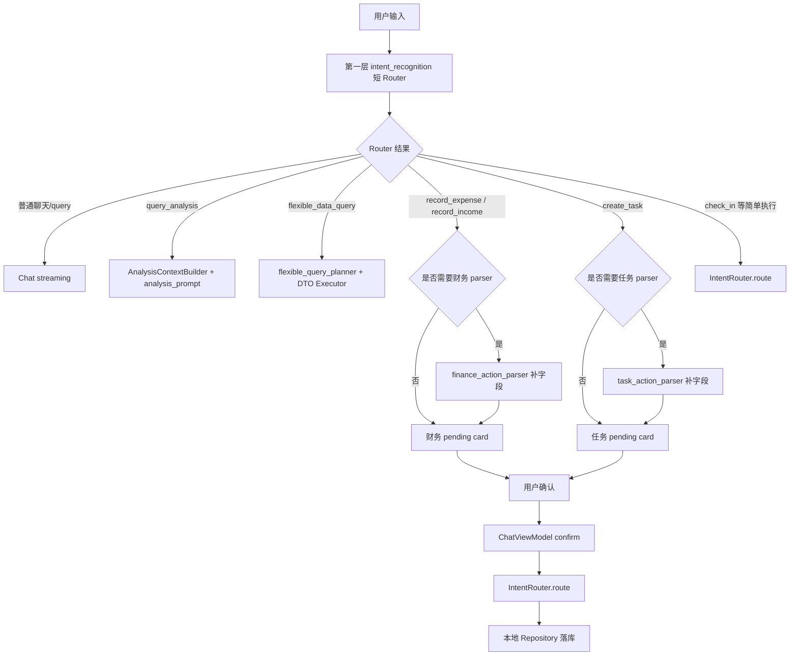

# HoloAI 多层路由 Prompt 瘦身 Implementation Plan

> **For Claude:** REQUIRED SUB-SKILL: Use superpowers:executing-plans to implement this plan task-by-task.

**Goal:** 将生产环境 11007 字符的 `intent_recognition` 从“总路由 + 全字段抽取器”收敛成“兼容式短 Router”，复杂字段交给专用 parser，降低 prompt 噪音和路由冲突，同时不破坏现有稳定的记账、任务创建、灵活数据查询和分析查询。

**Architecture:** 保留现有 `intent_recognition` endpoint、`AIParseBatch` JSON 外形和 iOS 调用入口，第一层只做意图分流、multi-action 拆分和少量基础字段。第二层复用已有 `finance_action_parser`、`task_action_parser` 和 `flexible_query_planner`，在 `ConversationCoordinator` 生成 pending 卡片或查询执行前补齐复杂结构。所有执行仍走现有本地确认和 `IntentRouter` 落库链路。

**Tech Stack:** iOS Swift/SwiftUI/Core Data, HoloBackend Node.js/Hono/SQLite prompt history, `/v1/prompts/:type`, `/v1/ai/chat/completions`, mock provider tests, ECS Docker deployment.

---

## 1. 背景

生产环境刚确认：

```text
intent_recognition = version 16 / default_sync / 11007 字符
```

这说明当前线上实际 prompt 已经不是单看源码常量能解释的状态。HoloBackend 的 prompt registry 会把 `defaultPrompts.json` 同步进 SQLite 历史，线上 `/v1/prompts/intent_recognition` 才是真实生效源。

当前 `intent_recognition` 已承担过多职责：

1. 判断用户是记账、任务、习惯、分析、查询还是聊天。
2. 抽取记账金额、分类候选、分类归一、任务标题、提醒时间、子任务、习惯字段、分析时间段、灵活查询约束。
3. 维护 `flexible_data_query` 与 `query_analysis` 的细粒度分流规则。
4. 输出完整 `AIParseBatch` schema 示例。

这带来几个问题：

1. prompt 变长后，新增规则会互相干扰。
2. 路由规则和字段抽取规则混在一起，出问题时很难判断是“意图错”还是“字段错”。
3. 每次补字段都要改总 prompt，最容易误伤稳定的记账和任务创建。
4. iOS fallback `PromptManager.swift` 和后端 prompt history 容易版本漂移。

本方案建议采用“兼容式多层路由”，不是推倒重写。

## 2. 当前代码事实

### 2.1 已存在能力

代码里已经有第二层 parser 的基础设施：

| 能力 | 现状 |
|------|------|
| 后端 prompt key | `finance_action_parser`, `task_action_parser` 已在 `defaultPrompts.json` |
| 后端 route config | `config.routes.finance_action_parser`, `config.routes.task_action_parser` 已存在 |
| iOS PromptType | `PromptManager.PromptType.financeActionParser`, `taskActionParser` 已存在 |
| Provider 方法 | `AIProvider.parseActionInput(...)` 已存在 |
| 后端 provider | `HoloBackendAIProvider.parseActionInput(...)` 已存在 |
| Coordinator 调用点 | `ConversationCoordinator` 已在分期/重复任务触发时调用 action parser |

因此本次重点不是“新增 parser”，而是把总 prompt 从 11007 字符的全字段抽取器降级为短 Router，并把字段权威边界写清楚。

### 2.2 真实执行链路

当前执行链路是：

```text
用户输入
  -> ChatViewModel.send
  -> ConversationCoordinator.process
  -> provider.parseUserInputBatch
  -> HoloBackend purpose=intent
  -> intent_recognition 返回 AIParseBatch
  -> ConversationCoordinator 拦截 query_analysis / flexible_data_query / pending action
  -> create_task / finance 生成 pending card
  -> 用户确认
  -> ChatViewModel.confirmPendingTask / confirmPendingTransaction
  -> IntentRouter.route
  -> 本地 Repository 落库
```

关键结论：

1. `intent_recognition` 仍是第一层入口，不能突然换 endpoint，除非同时改 iOS provider 和 fallback。
2. `ConversationCoordinator` 是 parser 前置和 pending 卡片数据合并的关键位置。
3. `IntentRouter` 仍是确认后的落库执行器，但不是初始 pending 卡片生成的唯一控制点。
4. 财务分类最终权威在 iOS 本地分类匹配，不在 prompt。

## 3. 目标与非目标

### 3.1 目标

1. 将 `intent_recognition` 生效 prompt 从 11007 字符降到 2500 字符以内，理想目标 1500 到 2200 字符。
2. 保持现有 `AIParseBatch` 外形兼容，降低 iOS 结构改动。
3. 保持稳定路由边界：
   - 确定金额、次数、最近一次、距今多久、最大/最小一笔等单点问题走 `flexible_data_query`。
   - 分析、复盘、趋势、结构、占比、总结类问题走 `query_analysis`。
4. 记账和任务创建仍走 pending 卡片确认，不做静默自动落库。
5. 专用 parser 只补字段，不重新决定业务 intent。
6. 后端、iOS fallback、测试、发版校验形成闭环。

### 3.2 非目标

1. 不重写整个 AI 执行链路。
2. 不新增全新的 `intent_router` endpoint。
3. 不把分类 catalog 重新塞回 prompt。
4. 不改变 `flexible_query_planner` 的规划和执行策略。
5. 不在本阶段新增预算、日程、复杂循环任务等新业务能力。
6. 不取消 pending 确认机制。

## 4. 推荐架构



## 5. 第一层 Router 设计

### 5.1 Router 职责

`intent_recognition` 只负责：

1. 判断 `mode`。
2. 拆分多动作。
3. 判断业务 intent。
4. 保留少量基础字段，供卡片和第二层 parser 使用。
5. 维护 `flexible_data_query` 与 `query_analysis` 的稳定边界。
6. 给出 `needsClarification` 和 `clarificationQuestion`。

### 5.2 Router 不再负责

`intent_recognition` 不再负责：

1. 完整分类归一细节。
2. 分期字段。
3. 重复任务字段。
4. 大量任务扩展字段说明。
5. 完整分析字段 schema。
6. 灵活查询 planner 字段。
7. 面向所有 intent 的长 JSON 字段大全。

### 5.3 Router 输出 schema

建议保持当前 `AIParseBatch` 兼容形状：

```json
{
  "mode": "single_action | multi_action | query | clarification | unknown",
  "items": [
    {
      "id": "1",
      "intent": "record_expense | record_income | create_task | complete_task | update_task | delete_task | check_in | create_note | record_mood | record_weight | query_tasks | query_habits | flexible_data_query | query_analysis | query | generate_memory_insight | unknown",
      "confidence": 0.95,
      "extractedData": {
        "amount": "仅金额明确时填写",
        "categoryCandidate": "记账原始分类语义",
        "normalizedCategoryCandidate": "非常确定时填写，否则留空",
        "semanticCategoryHint": "非常确定时填写，否则留空",
        "title": "任务核心标题",
        "description": "任务描述或补充说明",
        "subtasks": "逗号分隔的子任务列表（2项及以上并列待办事项时提取）",
        "taskKeyword": "任务关键词",
        "dueDate": "yyyy-MM-dd 或 yyyy-MM-dd HH:mm",
        "reminderDate": "yyyy-MM-dd HH:mm",
        "habitName": "习惯名",
        "habitValue": "数值",
        "analysisDomain": "finance | habit | task | thought | health | goal | crossModule",
        "periodLabel": "时间段描述",
        "queryDomain": "finance",
        "queryGoal": "用户查询目标",
        "rawConstraints": "用户原始约束"
      }
    }
  ],
  "needsClarification": false,
  "clarificationQuestion": null
}
```

注意：不建议新增 `requiresParser` 到 schema。当前本地已经有 `looksLikeInstallment(...)` 和 `looksLikeRepeatTask(...)`，第一阶段可继续由本地触发判断决定是否调用第二层 parser。等 Router 稳定后，再考虑加 `parserHint` 这类非阻断字段。

### 5.4 Router prompt 草案

下面是目标 prompt 的方向，不是最终逐字版本：

```text
你是 HoloAI 的短意图 Router。只判断用户要做什么，并输出 JSON。不要解释，不要闲聊。

当前日期：{{todayDate}}
当前时间：{{currentTime}}

输出必须是 JSON object，格式为：
{
  "mode": "single_action | multi_action | query | clarification | unknown",
  "items": [
    {
      "id": "1",
      "intent": "...",
      "confidence": 0.0-1.0,
      "extractedData": {}
    }
  ],
  "needsClarification": false,
  "clarificationQuestion": null
}

意图：
- record_expense：记录支出。金额明确时填 amount，原始消费语义填 categoryCandidate。
- record_income：记录收入。金额明确时填 amount，原始收入语义填 categoryCandidate。
- create_task：创建待办或提醒。填 title；能确定日期时填 dueDate/reminderDate。多个并列事项时填 subtasks（逗号分隔），title 概括整体意图。
- complete_task/update_task/delete_task：操作已有任务。填 taskKeyword。
- check_in：习惯打卡。填 habitName/habitValue。
- create_note/record_mood/record_weight：记录笔记、心情、体重。
- query_tasks/query_habits：查询任务或习惯状态。
- flexible_data_query：查询确定金额、次数、最近一次、哪一笔、距今多久、最大/最小一笔、超过 N 元、关键词限定花了多少。
- query_analysis：分析、复盘、趋势、结构、占比、总结、健康/目标/任务/习惯进展分析。
- query：非数据类普通问答或闲聊。
- generate_memory_insight：记忆回放。
- unknown：无法判断。

关键分流：
- “今年收入是多少”“本月花了多少钱”“今年买烟花花了多少”“咖啡一共花了多少”是确定数字，必须 flexible_data_query。
- “分析今年收入结构”“复盘本月消费”“最近财务状态怎么样”是分析总结，才是 query_analysis。
- 涉及具体数据的查询不要用 query。

规则：
- 多动作拆成多个 items。
- 查询和执行混在一句话时返回 clarification。
- 不确定就 clarification，不要编造字段。
- 记账分类只保留用户原始语义，不维护科目表。
- 复杂字段由专用 parser 处理，不要输出 installment* / repeat* 字段。
- 无法判断时输出 intent: "unknown", mode: "unknown"，不要输出自由文本。

示例：
- "今天午饭花了35" → intent: "record_expense", extractedData: { amount: "35", categoryCandidate: "午饭" }
- "今年收入是多少" → intent: "flexible_data_query", extractedData: { queryGoal: "今年收入总额" }
- "帮我分析一下最近的花销" → intent: "query_analysis", extractedData: { analysisDomain: "finance", periodLabel: "最近" }
- "明天去山姆买牛奶、鸡蛋和纸巾" → intent: "create_task", extractedData: { title: "去山姆购物", subtasks: "买牛奶,买鸡蛋,买纸巾" }
- "嗯..." → intent: "unknown", mode: "unknown"
```

## 6. 第二层 parser 边界

### 6.1 `finance_action_parser`

只在第一层 intent 为 `record_expense` 或 `record_income`，且本地判断像分期时调用。

第一阶段建议仅支持分期支出，收入分期先不做。

保留字段：

```text
installmentEnabled
installmentTotalAmount
installmentPeriods
installmentFeePerPeriod
installmentFirstDueDate
installmentSummary
```

> **第三轮审查修正**：原方案写的是 `installmentStartDate`、`installmentIntervalUnit`、`installmentIntervalValue`，但实际代码使用 `installmentFirstDueDate`（7 处引用），后两者零引用。已修正为与当前 `finance_action_parser` prompt 和 `IntentRouter` 消费代码一致的字段名。`installmentIntervalUnit/Value` 可作为未来扩展字段，但第一阶段不放入白名单。

边界：

1. parser 不决定 `record_expense` 还是 `record_income`。
2. parser 不决定最终分类。
3. parser 不计算每期真实金额列表，金额尾差由 iOS 本地 Decimal 逻辑处理。
4. 第一阶段只支持现有按月分期链路，非月分期返回 clarification 或 unsupported；不新增 `installmentIntervalUnit/Value` 字段。

### 6.2 `task_action_parser`

只在第一层 intent 为 `create_task`，且本地判断像重复任务时调用。

保留字段：

```text
repeatEnabled
repeatType
repeatInterval
repeatWeekdays
repeatMonthDay
repeatUntilDate
repeatSummary
```

边界：

1. parser 不重新决定是否创建任务。
2. parser 不负责普通任务标题抽取，标题仍来自 Router 或本地处理。
3. 当前若 `RepeatRule.interval` 还未完全落地，要明确哪些 interval 可以真实执行。
4. 不输出 `repeatUntilCount`，除非本地完成次数追踪已经实现。

### 6.3 `flexible_query_planner`

不属于本次新 parser，但第一层 Router 必须继续正确分流到 `flexible_data_query`。

稳定边界：

| 用户问题 | 应走 intent |
|----------|-------------|
| 今年收入是多少 | `flexible_data_query` |
| 本月花了多少钱 | `flexible_data_query` |
| 今年买烟花花了多少钱 | `flexible_data_query` |
| 最近一次打车是什么时候 | `flexible_data_query` |
| 分析今年收入结构 | `query_analysis` |
| 复盘本月消费 | `query_analysis` |
| 最近财务状态怎么样 | `query_analysis` |

## 7. 数据合并规则

### 7.1 Router 与 parser 的权威关系

1. Router 决定业务 intent。
2. Parser 只补充该 intent 下的复杂字段。
3. Parser 不允许把 `record_expense` 改成 `create_task`，也不允许把 `flexible_data_query` 改成 `query_analysis`。
4. Parser 字段覆盖 Router 同名字段，但只限 parser 自己的字段域。
5. 用户在 pending 卡片里编辑过的字段永远优先，不被二次 parser 覆盖。

### 7.2 推荐合并策略

> **工程审查修正**：原方案用 `hasPrefix("installment")` / `hasPrefix("repeat")` 做白名单，存在匹配意外 key 的风险。改为显式 `Set<String>` 白名单，与 Section 6.1/6.2 列出的字段完全对齐。

```swift
// 显式白名单 —— 与 finance_action_parser / task_action_parser 实际字段一一对应
let installmentParserKeys: Set<String> = [
    "installmentEnabled", "installmentTotalAmount",
    "installmentPeriods", "installmentFeePerPeriod",
    "installmentFirstDueDate", "installmentSummary"
]
let repeatParserKeys: Set<String> = [
    "repeatEnabled", "repeatType", "repeatInterval",
    "repeatWeekdays", "repeatMonthDay", "repeatUntilDate", "repeatSummary"
]
let allowedParserKeys = installmentParserKeys.union(repeatParserKeys)

var renderData = item.extractedData ?? [:]

if shouldCallActionParser {
    let parserData = actionResult.data
    for (key, value) in parserData where !value.isEmpty {
        if allowedParserKeys.contains(key) {
            renderData[key] = value
        }
    }
}
```

不要无差别合并所有 parser 字段，避免 parser 覆盖 `categoryCandidate`、`title`、`amount` 等基础字段。新增字段必须显式加入白名单。

## 8. 分阶段计划

## Phase 0：黄金回归集

**目标：** 先把现有稳定行为固定成测试，不先改 prompt。

**Files:**
- Modify: `HoloBackend/tests/chat.test.js`
- Modify: `HoloBackend/tests/prompts.test.js`
- Optional Modify: `Holo/Holo APP/Holo/HoloTests/...`

**测试样例：**

| 输入 | 期望 |
|------|------|
| 今天午饭花了 35 | `record_expense` |
| 发工资 20000 | `record_income` |
| 明天早上提醒我买水 | `create_task`, 有 `reminderDate` |
| 明天去山姆买牛奶、鸡蛋和纸巾 | `create_task`, `subtasks` 包含 买牛奶/买鸡蛋/买纸巾, `title` 为"去山姆购物"或"购物清单" |
| 今天跑步打卡 | `check_in` |
| 今年收入是多少 | `flexible_data_query` |
| 今年买烟花花了多少钱 | `flexible_data_query` |
| 最近一次打车是什么时候 | `flexible_data_query` |
| 分析今年收入结构 | `query_analysis` |
| 复盘本月消费 | `query_analysis` |
| 你能做什么 | `query` |

**验收：**

```bash
cd /Users/tangyuxuan/Desktop/Claude/HOLO/HoloBackend
npm test
```

期望：所有现有测试通过，新增 golden tests 通过。

## Phase 1：Router prompt 瘦身

**目标：** 修改 `intent_recognition`，去掉全字段大全和已下沉字段，保留兼容 schema。

**Files:**
- Modify: `HoloBackend/src/prompts/defaultPrompts.json`
- Modify: `HoloBackend/src/prompts/promptRegistry.js`
- Modify: `Holo/Holo APP/Holo/Holo/Services/AI/PromptManager.swift`
- Modify: `HoloBackend/tests/prompts.test.js`
- Modify: `HoloBackend/tests/chat.test.js`

**版本策略：**

1. 生产当前是 `version 16 / default_sync`（线上 API 返回值为准）。源码 `promptRegistry.js` 常量为 `15`，iOS `promptVersions` 为 `14`，三处已漂移。
2. 本次后端默认 prompt 变更后，现有 SQLite 生产库应进入 `version 17 / default_sync`。
3. `promptRegistry.js` 的 `PROMPT_VERSIONS.intent_recognition` 建议同步到 `17`，保证新库初始版本也正确。
4. iOS `PromptManager.promptVersions[.intentRecognition]` 从当前 `14` 直接同步到 `17`。
5. **验收时不要求"三端版本号完全相等"**。SQLite `syncDefaultPromptsToHistory()` 使用 `latest.version + 1` 自增，生产版本可能高于源码常量。正确验收方式见下方。

**验收：**

1. `intent_recognition` content length 小于 2500。
2. prompt 不包含 `installmentEnabled`、`installmentPeriods`、`repeatEnabled`、`repeatType` 等下沉字段。
3. prompt 仍包含 `flexible_data_query` 与 `query_analysis` 的关键分流规则。
4. prompt 保留 `subtasks` 和 `description` 的最小提取规则（不退化购物清单能力）。
5. golden tests 全部通过。
6. 版本对齐验收（不要求三端完全相等）：
   - `promptRegistry.js` 的 `PROMPT_VERSIONS.intent_recognition` >= 17
   - iOS `PromptManager.promptVersions[.intentRecognition]` >= 17
   - 生产 `/v1/prompts/intent_recognition` version >= 17
   - 生产 `contentLength` < 2500
   - 生产 `source` 为 `default_sync` 或 `default`

## Phase 2：前端 fallback 与缓存校准

> **工程审查调整**：Phase 2 和原 Phase 3 对调。fallback 校准紧跟 Phase 1 的 prompt 瘦身，减少同时引入的变量。合并策略收紧放到 Phase 3，确保只改一个东西。

**目标：** 后端不可用时，iOS fallback 行为仍与后端语义一致。

**Files:**
- Modify: `Holo/Holo APP/Holo/Holo/Services/AI/PromptManager.swift`
- Optional Modify: `Holo/Holo APP/Holo/Holo/Services/AI/HoloBackendPromptService.swift`

**改动：**

1. 同步 iOS fallback prompt 与后端瘦身后 prompt 的核心分流规则。
2. 修复当前 fallback 已知漂移：缺少 `reminderDate` 字段、时间段映射不一致（iOS "早上=06-11" vs 后端 "早上=09:00"）。
3. fallback prompt 也小于 2500 字符。
4. `promptVersions[.intentRecognition]` 从 14 同步到 17。

**验收：**

1. fallback prompt 也小于 2500 字符。
2. fallback prompt 与后端 prompt 的核心分流规则一致。
3. fallback prompt 包含 `reminderDate` 字段，时间段映射与后端对齐。
4. 部署后提醒真机杀 App 重启，避免 2 分钟 prompt metadata cache 影响验证。

## Phase 3：parser 合并规则收紧

> **工程审查调整**：从原 Phase 2 移至此处。在 Phase 1 prompt 瘦身和 Phase 2 fallback 校准均完成后再改合并逻辑，确保每阶段只引入一个变量。

**目标：** 防止 Router 和 parser 双源冲突。

**前置条件：** Phase 0 golden tests 全通过 + Phase 1 prompt 瘦身验收通过 + Phase 2 fallback 校准完成。

**Files:**
- Modify: `Holo/Holo APP/Holo/Holo/Services/AI/ConversationCoordinator.swift`
- Test: existing or new Coordinator parser tests

**改动分两步：**

### Step 3a：日志探针（先不改逻辑）

在切换到白名单前，先在 ConversationCoordinator 的 parser 合并处加临时日志，只记录 parser 实际返回的 key set，不记录 value。先用 DEBUG / TestFlight / 灰度日志观察，确认：

1. `finance_action_parser` 是否返回了 `installment*` 以外的字段。
2. `task_action_parser` 是否返回了 `repeat*` 以外的字段。
3. 有没有非预期字段被当前全量覆写逻辑依赖。

```swift
// Step 3a: 临时探针，上线观察后移除
// 注意：只记录 key 名称，不记录 value 内容（避免泄漏金额、标题等用户数据）
#if DEBUG
let keys = actionResult.data.keys.sorted().joined(separator: ",")
logger.debug("Action parser returned keys: \(keys, privacy: .public)")
#endif
for (key, value) in actionResult.data where !value.isEmpty {
    renderData[key] = value  // 暂时保持全量覆写
}
```

### Step 3b：切换到白名单模式

探针数据确认安全后，替换为 Section 7.2 的显式 `Set<String>` 白名单合并策略。

**验收：**

1. 普通记账不触发 parser。
2. 分期记账触发 parser，pending 卡片显示分期摘要。
3. 普通任务不触发 parser。
4. 重复任务触发 parser，pending 卡片显示重复摘要。
5. 白名单外的 parser 字段被静默丢弃，不影响基础字段。

## Phase 4：后端发版与线上验证

**目标：** 后端 prompt 改动在线上真实生效。

后端改动包括：

```text
HoloBackend/src/prompts/defaultPrompts.json
HoloBackend/src/prompts/promptRegistry.js
HoloBackend/tests/*
```

因此必须发版，不发版线上不会变。

**服务器验证：**

```bash
curl http://127.0.0.1:8787/v1/health
curl http://127.0.0.1:8787/v1/prompts/intent_recognition
curl http://127.0.0.1:8787/v1/prompts/finance_action_parser
curl http://127.0.0.1:8787/v1/prompts/task_action_parser
```

**期望：**

```text
/v1/health = ok
intent_recognition version >= 17
intent_recognition source = default_sync 或 default
intent_recognition contentLength < 2500
finance_action_parser 可访问
task_action_parser 可访问
```

**真实 intent 验证：**

至少验证：

```text
今年买烟花花了多少钱 -> flexible_data_query
今年收入是多少 -> flexible_data_query
分析今年收入结构 -> query_analysis
今天午饭花了35 -> record_expense
明天早上提醒我买水 -> create_task
```

## 9. 测试策略

### 9.1 后端 prompt tests

新增或调整断言：

1. `/v1/prompts/intent_recognition` 返回 prompt。
2. content length 小于 2500。
3. 不包含已下沉复杂字段。
4. 包含 `flexible_data_query` 和 `query_analysis`。
5. 包含“确定数字”和“分析/复盘/趋势”的边界说明。

### 9.2 后端 mock intent tests

覆盖：

1. 确定金额类必须 `flexible_data_query`。
2. 分析复盘类必须 `query_analysis`。
3. 普通执行类保持原 intent。
4. 混合查询 + 执行返回 clarification。

### 9.3 iOS tests

如果现有测试不方便完整跑 UI，可以至少补纯逻辑测试：

1. `looksLikeInstallment` 不误触“期末考试”“今天心情不错”。
2. `looksLikeRepeatTask` 正确触发“每天”“每周一”“每隔三天”。
3. parser 合并只写入允许前缀字段。
4. pending renderData 保留基础字段。

## 10. 风险与缓解

| 风险 | 影响 | 缓解 |
|------|------|------|
| Router 过短导致召回下降 | 用户说法稍复杂时识别不出来 | Phase 0 golden tests 先覆盖高频表达，低置信返回 clarification |
| `flexible_data_query` 与 `query_analysis` 再次混淆 | 数据查询体验倒退 | 把确定数字 vs 分析复盘边界留在第一层 Router |
| Parser 与 Router 双源冲突 | 卡片字段不一致 | parser 只允许写入 `installment*` / `repeat*` |
| iOS fallback 版本漂移 | 后端不可用时行为不同 | 同步 `PromptManager.swift`，版本升到同一语义版本 |
| 生产 SQLite prompt history 与源码常量不一致 | 误判是否生效 | 一律用 `/v1/prompts/intent_recognition` 验证线上真实状态 |
| 后端改动未发版 | 线上无变化 | 后端 Docker rebuild + live health/prompt/intent 验证 |
| 两次 LLM 调用增加延迟 | 分期/重复任务等待更久 | 只有命中特征才调用第二层 parser，普通记账/任务仍 1 次 |
| 新 Router prompt 线上大面积识别错误 | 用户体验严重退化 | 见 Section 13 回滚预案 |
| Router 响应延迟退化 | 整体交互变慢 | Phase 4 线上验证时对比 Router 调用延迟（旧 vs 新），确认 P99 不退化 |

## 11. GLM 评审重点

请 GLM 优先审以下问题：

1. 第一层 Router 保留的字段是否还太多，是否能进一步压缩但不影响现有 iOS 解码。
2. 不新增 `requiresParser`，继续由本地触发 parser 是否合理。
3. `flexible_data_query` 与 `query_analysis` 的边界是否足够清晰。
4. parser 只允许写入 `installment*` / `repeat*` 是否过窄，会不会影响已有分期/重复任务体验。
5. `PROMPT_VERSIONS.intent_recognition` 和 iOS `promptVersions` 同步到 17 是否是最稳策略。
6. 是否应该把 prompt length 验收阈值设为 2500，还是更激进地设为 2000。
7. 是否有遗漏的高频意图会因为总 prompt 瘦身而退化。
8. 是否需要在后台管理页增加 prompt length / version drift 的可视化提醒。

## 12. Go / No-Go 结论

**Conditional Go.**

可以推进，但要满足三个条件：

1. 先补 Phase 0 golden tests，不能直接改 prompt。
2. 第一阶段只做兼容式瘦身，不改 `intent_recognition` endpoint 和 JSON 外形。
3. 后端改动完成后必须发版，并以线上 `/v1/prompts/intent_recognition` 和真实 `purpose=intent` 结果作为最终验收。

不建议一开始做全新 `intent_router` endpoint，也不建议把 Router 简化到只剩”记账/任务/习惯/分析/聊天”五类。Holo 现在真正容易出错的不是大类判断，而是 `flexible_data_query`、`query_analysis`、执行类 pending 卡片之间的细边界。

## 13. 回滚预案

> **工程审查新增，第三轮审查重写**：第一轮写的回滚方案有根本性错误——把 Docker 镜像回滚等同于 Prompt 回滚。实际上后端 Prompt 主存储是 SQLite `prompt_versions` 表，挂载在 Docker volume 上，镜像回滚不会覆盖。以下重写。

### 13.1 回滚触发条件

满足任一即触发回滚：

1. Phase 4 真实 intent 验证中，5 个核心用例有 2 个以上失败。
2. 上线后 24 小时内收到 3 个以上用户反馈 AI 识别错误。
3. `/admin/logs` 中 intent 为 `unknown` 的比例超过 20%（基线待测）。

### 13.2 Prompt 回滚（最快，1 分钟）

Prompt 存储在 SQLite `prompt_versions` 表中，**不随 Docker 镜像回滚**。回滚 Prompt 必须通过管理后台：

```text
最快 Prompt 回滚：
  1. 打开 /admin/prompts/intent_recognition
  2. 进入 history 页面，选择上线前备份版本的内容做 rollback
  3. 注意：rollback 会生成一个新的 latest version（例如 v18），不能期望 API 返回 v16
  4. 验证 content 与上线前备份一致，version 只要求 >= 当前最新
  5. 验证 /v1/prompts/intent_recognition 返回的内容正确

重要：
  - “恢复默认”按钮恢复的是当前镜像里的 defaultPrompts.json 内容
  - 如果当前镜像已经是 v17，”恢复默认”恢复的就是 v17 的内容，不是 v16
  - 要回到 v16 内容，必须用 history rollback，不能用”恢复默认”
```

### 13.3 Docker 回滚（仅回滚后端代码，不等价于 Prompt 回滚）

```text
Docker 回滚仅用于回滚后端代码变更（如 route handler、config 变更）。
它不会改变 volume 中的 SQLite Prompt 数据。
如需同时回滚 Prompt 和代码，需要两步操作。
```

### 13.4 部署前备份

在 Phase 4 部署前，必须：

```bash
# 1. 导出当前生产 prompt JSON（含 version、content、source 等）
curl http://127.0.0.1:8787/v1/prompts/intent_recognition > /tmp/intent_pre_v17_backup.json

# 2. 备份 SQLite 数据库文件
cp deploy/data/holo-backend.db deploy/data/holo-backend.db.pre-v17

# 3. 记录上线前版本号、contentLength 和 source
node -e 'const fs=require("fs"); const d=JSON.parse(fs.readFileSync("/tmp/intent_pre_v17_backup.json","utf8")); console.log(`version=${d.version} contentLength=${d.contentLength ?? d.content?.length ?? "unknown"} source=${d.source}`)'
```

### 13.5 iOS 侧降级

- 后端回滚后 iOS 自动跟随（后端优先策略）
- iOS fallback prompt 在 Phase 2 已同步更新为 v17，后端回滚后 fallback 仍为 v17
- 最坏情况下用户离线时会用 v17 fallback，不影响核心功能
- 不需要紧急发版，下一版本修正即可

## 14. 失败模式分析

> **工程审查新增**：列出每个新 codepath 的生产失败场景。

| 失败模式 | 有测试覆盖？ | 有错误处理？ | 用户看到？ | 严重度 |
|----------|-------------|-------------|-----------|--------|
| Router 返回 `unknown` intent | ❌ | ❌ 无降级策略 | 可能看到空回复或不响应 | P2 |
| Parser 返回非白名单字段被静默丢弃 | ❌ → Phase 3 探针补 | Phase 3 白名单兜底 | 分期/重复任务卡片字段缺失 | P2 |
| 后端部署后 prompt 未更新（Docker cache） | ❌ 部分有 | Phase 4 验证步骤覆盖 | 不确定行为 | P1 |
| iOS fallback 与后端语义不一致 | ❌ → Phase 2 补 | 后端优先，fallback 仅离线 | 离线场景识别退化 | P3 |
| `flexible_data_query` 被误判为 `query_analysis` | ❌ → Phase 0 golden tests 补 | 方案重点解决了边界规则 | 数据查询走分析路径，返回格式不同 | P1 |
| `query_analysis` 被误判为 `query` | ❌ → Phase 0 golden tests 补 | 低置信度走 clarification | 分析请求变成闲聊回复 | P2 |
| 合并策略变更导致分期摘要丢失 | ❌ → Phase 3 Step 3a 探针预防 | 白名单 + 探针 | 分期 pending 卡片缺少分期信息 | P2 |
| 版本号三处不一致导致 prompt metadata cache 混乱 | ❌ → Phase 1 验收补 | 2 分钟 cache TTL 限制 | 短暂行为不一致 | P3 |

## 15. 测试覆盖图谱

> **工程审查新增**：量化当前测试覆盖和目标。

```
CODE PATHS                                            USER FLOWS
[+] HoloBackend: intent_recognition 瘦身              [+] 记账意图识别
  ├── Phase 0: golden tests                              ├── [GAP→Phase0] “今天午饭花了35” → record_expense
  │   ├── [GAP→Phase0] 11 个 golden test 用例            ├── [GAP→Phase0] “发工资20000” → record_income
  │   └── [GAP→Phase0] mock provider 覆盖全 intent       ├── [GAP→Phase0] “分期买手机” → record_expense + parser
  │   └── [GAP→Phase0] multi_action 拆分测试             └── [GAP→Phase0] 混合输入 → clarification
  ├── Phase 1: prompt 瘦身                             [+] 查询意图分流
  │   ├── [GAP→Phase1] prompt length < 2500 断言         ├── [GAP→Phase0] “今年收入是多少” → flexible_data_query
  │   ├── [GAP→Phase1] 不含下沉字段断言                  ├── [GAP→Phase0] “分析今年收入结构” → query_analysis
  │   └── [GAP→Phase1] 包含分流规则断言                  ├── [GAP→Phase0] “最近一次打车” → flexible_data_query
  │   └── [GAP→Phase1] golden tests 全通过              └── [GAP→Phase0] “你能做什么” → query
  ├── Phase 3: 合并策略收紧                             [+] 任务意图识别
  │   ├── [GAP→Phase3] 普通记账不触发 parser             ├── [GAP→Phase0] “明天提醒我买水” → create_task
  │   ├── [GAP→Phase3] 分期记账触发 parser              └── [GAP→Phase0] “每天提醒我喝水” → create_task + parser
  │   ├── [GAP→Phase3] 显式白名单只允许已声明字段     [+] 回滚与降级
  │   └── [GAP→Phase3] parser 不覆盖基础字段             └── [GAP→Phase4] 旧 prompt 回滚后行为一致
  └── Phase 4: 线上验证
      ├── [GAP→Phase4] [→EVAL] 真实 LLM intent 验证
      └── [GAP→Phase4] version 下限 + contentLength/source 验证

iOS 侧:
[+] ConversationCoordinator 合并逻辑                    [+] Fallback 行为
  ├── [GAP→Phase3] looksLikeInstallment 不误触           └── [GAP→Phase2] 后端不可用时 fallback 仍正确
  ├── [GAP→Phase3] looksLikeRepeatTask 正确触发
  └── [GAP→Phase3] parser 白名单合并

COVERAGE: 0/~30 路径有测试（当前）
目标: Phase 0 完成后 ≥11/30, Phase 1 完成后 ≥15/30, 全部完成后 ≥25/30
EVAL: Phase 4 需要 ≥5 个核心用例的真实 LLM 验证
```

## 16. 并行化策略

> **工程审查新增**：分析各 Phase 的并行执行机会。

### 16.1 依赖关系

```
Phase 0 (golden tests) ──→ Phase 1 (prompt 瘦身) ──→ Phase 4 (部署验证)
                              │
                              └──→ Phase 2 (fallback 校准)
                                       │
                                       └──→ Phase 3 (合并策略收紧)
```

### 16.2 执行计划

```text
Lane A（后端）: Phase 0 → Phase 1 → Phase 4 部署验证
Lane B（iOS）:  Phase 2 fallback 校准（Phase 1 完成后立即开始，与 Phase 4 并行）
Lane C（iOS）:  Phase 3 合并策略收紧（等 Lane A Phase 1 + Lane B Phase 2 均完成）

启动顺序: Lane A 先跑 Phase 0-1
         Phase 1 完成后同时启动 Lane B + Lane A Phase 4
         Lane B 完成后启动 Lane C
```

### 16.3 冲突标记

Lane A 和 Lane B 不共享文件（A 改后端 + 测试，B 改 iOS PromptManager），可安全并行。
Lane B 和 Lane C 共享 `ConversationCoordinator.swift`，**不可并行**，必须串行。

## 17. 工程审查总结

> **审查工具**: plan-eng-review | **审查时间**: 2026-06-07 | **审查状态**: Conditional Go（附 8 项修正）

### 17.1 审查发现

| # | 严重度 | 置信度 | 发现 | 处理方式 |
|---|--------|--------|------|----------|
| 1 | P1 | 9/10 | 合并策略变更是行为修改，需先验证 parser 实际返回字段 | → Phase 3 加探针阶段 |
| 2 | P2 | 8/10 | 版本号三处漂移，需明确 source of truth | → Phase 1 验收加三端对齐检查 |
| 3 | P2 | 7/10 | Router prompt 缺少 error fallback 示例 | → Section 5.4 已补充 |
| 4 | P3 | 6/10 | Phase 2/3 顺序可优化 | → 已调换，每阶段单变量 |
| 5 | P2 | 8/10 | hasPrefix 白名单脆弱 | → Section 7.2 已改为显式 Set |
| 6 | P3 | 6/10 | extractedData 字段仍偏多 | → GLM 评审问题 #1，可选压缩 |
| 7 | P2 | 7/10 | 缺少回滚预案 | → Section 13 已补充 |
| 8 | P3 | 7/10 | 缺少延迟量化目标 | → Phase 4 加延迟对比 |

### 17.2 NOT in scope（确认合理）

- 不重写 AI 执行链路 ✅
- 不新增 intent_router endpoint ✅
- 不改变 flexible_query_planner 策略 ✅
- 不新增预算/日程等新业务 ✅

### 17.3 已有代码复用确认

| 已有能力 | 方案是否复用 |
|----------|-------------|
| `finance_action_parser` / `task_action_parser` 后端 prompt + iOS PromptType | ✅ 复用 |
| `ConversationCoordinator` 条件 parser 调用链 | ✅ 复用，Phase 3 仅改合并策略 |
| 后端 managed/default 双层 prompt 机制 | ✅ 复用，回滚依赖此机制 |
| 后端 admin 后台 prompt 编辑和版本管理 | ✅ 复用，Phase 4 验证依赖 |
| `flexible_query_planner` plan-execute-answer 管线 | ✅ 不改动 |

### 17.4 修正后的 Go / No-Go 条件

> **注意**：本节为第一轮审查结论，已被 Section 19.4 的合并版 Go/No-Go 条件取代。以下保留供历史参考。

**Conditional Go.** 满足以下条件即可推进：

1. ✅ 先补 Phase 0 golden tests，不能直接改 prompt。
2. ✅ 第一阶段只做兼容式瘦身，不改 endpoint 和 JSON 外形。
3. ✅ 后端改动完成后必须发版，线上 `/v1/prompts/intent_recognition` 和真实 intent 结果作为最终验收。
4. ✅ Phase 3 合并策略变更前必须先跑探针，确认 parser 实际返回字段。
5. ~~🆕 部署前给当前 Docker 镜像打 pre-v17 回滚标签。~~ 已被 Section 13 重写的回滚预案取代（备份方式改为导出 prompt JSON + 备份 SQLite DB）。
6. ~~🆕 版本号三端对齐（源码常量 == 生产 API == iOS promptVersions）作为 Phase 1 验收条件。~~ 已被第三轮审查修正为"version 下限 + contentLength/source 对齐"。

---

## 18. 第二轮审查记录（Codex，2026-06-07）

> 审查目标：对 GLM 修改后的方案做 code-vs-doc 第二轮审查，确认是否可进入实施。结论：主方向仍成立，但当前版本存在 2 个阻断级偏差和 3 个高优先级修正项，需修订后再开工。

### 18.1 总结论

**Conditional Go，但必须先修正文档。**

可以继续采用“兼容式短 Router + 专用 parser”的架构，不建议新建 `intent_router` endpoint，也不建议把第一层压成只有五大模块的大类判断。

但当前方案还不能直接实施，原因是：

1. `subtasks` / `description` 等任务扩展字段被计划从 Router 下沉，但当前 `task_action_parser` 只在重复任务场景触发，不会处理购物清单子任务。直接瘦身会让现有“购物清单子任务”能力退化。
2. 回滚方案把 Docker 镜像回滚和 Prompt 回滚混在一起，但当前后端 prompt 真实主存储是 SQLite `prompt_versions`。旧镜像不会覆盖 volume 里的最新 prompt row。
3. 版本号“三端完全相等”不符合当前 SQLite 自增历史机制。更稳的是校验内容 hash / contentLength / source / version 下限。
4. Phase 3 探针示例会把 parser 原始字段值写入日志，存在用户内容泄漏风险，而且示例代码不符合当前 `Logger` 用法。
5. `finance_action_parser` 字段白名单与当前实现字段名不完全一致。

### 18.2 Findings

| # | 严重度 | 结论 | 位置 | 说明 |
|---|--------|------|------|------|
| 1 | P1 | 任务子任务会被 Router 瘦身误删 | §5.2, §5.3, Phase 0 | 当前 `ChatCardData.from(.createTask)` 读取 `subtasks`，`IntentRouter.handleCreateTask` 也用 `subtasks` 创建 checklist。方案把任务扩展字段移出 Router，但 `task_action_parser` 只服务重复任务，购物清单不会触发 parser。 |
| 2 | P1 | 回滚方案不符合 SQLite prompt history | §13 | `resetPrompt()` 会把当前 `defaultPrompts.json` 作为新版本写入；`rollbackPrompt()` 也是把目标内容复制成新版本。Docker 镜像回滚不会覆盖 `deploy/data` volume 里的最新 prompt row。 |
| 3 | P2 | 版本号三端相等不可作为长期验收 | §8 Phase 1, §17.4 | `syncDefaultPromptsToHistory()` 对已有 DB 使用 `latest.version + 1`，生产若已有手动版本或回滚版本，就不会稳定等于源码常量。 |
| 4 | P2 | Phase 3 探针日志有隐私和编译风险 | §8 Phase 3 | 示例 `Logger.debug(..., category:)` 不符合当前 `ConversationCoordinator` 的 `logger` 用法；记录 raw value 会包含金额、标题、商品、日期等用户内容。 |
| 5 | P2 | 分期字段白名单与当前实现漂移 | §6.1, §7.2 | 当前 parser prompt / mock / `IntentRouter` 使用 `installmentFirstDueDate`，方案白名单写的是 `installmentStartDate`，还新增了当前未消费的 `installmentIntervalUnit/Value`。 |

### 18.3 必须修正

#### 修正 1：保留任务子任务字段，或新增通用 task parser

二选一：

**推荐 A：第一阶段 Router 继续保留 `subtasks` / `description` / `reminderDate`。**

原因：这是现有用户可见能力，且当前 `task_action_parser` 不会覆盖普通购物清单场景。Router 瘦身可以先删除重复任务字段和长说明，但不要删掉 `subtasks` 的最小规则。

Phase 0 golden tests 需要从“保留购物语义”改成明确断言：

```text
明天去山姆买牛奶、鸡蛋和纸巾
-> create_task
-> title = 去山姆购物 或 购物清单
-> subtasks 包含 买牛奶,买鸡蛋,买纸巾
```

**备选 B：把 `task_action_parser` 扩展为通用任务字段 parser。**

如果选择 B，`ConversationCoordinator.looksLikeRepeatTask` 不能再是唯一触发条件，需要新增 list-like task 触发判断，并让 parser 负责 `subtasks` / `description` / `reminderDate` / `repeat*`。这比 A 更大，不建议作为本次第一阶段。

#### 修正 2：重写回滚预案

推荐把 §13 改成：

```text
最快 Prompt 回滚：
1. 打开 /admin/prompts/intent_recognition/history
2. 选择上线前备份版本的内容做 rollback
3. 注意：系统会生成一个新的 latest version，例如 v18；不能期望 API 返回 v16
4. 验证 content 与上线前备份一致，version 只要求 >= 当前最新

部署前备份：
1. 导出 /v1/prompts/intent_recognition JSON
2. 备份 deploy/data/holo-backend.db
3. 记录 history 中上线前版本号和 content_length

Docker 回滚：
仅用于回滚后端代码，不等价于 prompt 回滚。
如要通过 Docker 回滚 prompt，必须同时回滚 SQLite DB 或在 admin history 里回滚 prompt 内容。
```

不要再写“恢复默认可回到 v16”。`恢复默认`会恢复当前镜像里的 default prompt；如果当前镜像已经是 v17，它恢复的就是 v17 内容。

#### 修正 3：验收从“三端版本号相等”改为“语义版本对齐”

建议把 §8 Phase 1 和 §17.4 改为：

```text
验收：
- HoloBackend/src/prompts/promptRegistry.js 的 PROMPT_VERSIONS.intent_recognition >= 17
- iOS PromptManager.promptVersions[.intentRecognition] >= 17
- 生产 /v1/prompts/intent_recognition version >= 17
- 生产 contentLength < 2500
- 生产 content hash 与本次发布的 defaultPrompts.json intent_recognition 一致，或 source/change_note 明确来自本次 default_sync
```

这样能兼容 SQLite 历史自增、admin rollback、manual managed prompt 等真实情况。

#### 修正 4：探针只记录 key，不记录 value

Phase 3 Step 3a 建议改成：

```swift
#if DEBUG
let keys = actionResult.data.keys.sorted().joined(separator: ",")
logger.debug("Action parser returned keys: \(keys, privacy: .public)")
#endif
```

如需线上观测，只记录：

```text
parser kind
key set
field count
hasUnsupportedReason
duration
```

不要记录金额、标题、note、商品名、日期等 raw value。

#### 修正 5：对齐 `finance_action_parser` 字段表

当前实现已使用：

```text
installmentFirstDueDate
```

方案白名单不应只写：

```text
installmentStartDate
```

建议第一阶段保持现有字段名：

```text
installmentEnabled
installmentTotalAmount
installmentPeriods
installmentFeePerPeriod
installmentFirstDueDate
installmentSummary
```

`installmentIntervalUnit` / `installmentIntervalValue` 可以作为未来字段，但如果第一阶段不消费，就不要放入“必须保留字段”或合并白名单。

### 18.4 可保留的 GLM 修正

以下 GLM 修正方向是正确的，建议保留：

1. 不新增 `requiresParser`，先继续由本地触发 parser。
2. parser 合并从 `hasPrefix` 改成显式 `Set<String>` 白名单。
3. Phase 0 必须先做 golden tests，不能直接改 prompt。
4. 保留 `flexible_data_query` / `query_analysis` 边界在第一层 Router。
5. 加入回滚预案、失败模式、测试覆盖图谱和延迟验证。

### 18.5 修正后 Go / No-Go 条件

修正以上 5 点后，结论仍是：

**Conditional Go.**

进入实施前必须满足：

1. Phase 0 golden tests 明确覆盖购物清单 `subtasks`，且这些字段在第一阶段不退化。
2. 回滚预案以 SQLite prompt history 为准，不把 Docker image rollback 当作 prompt rollback。
3. 生产验收使用 version 下限 + content hash/contentLength/source，不使用“三端版本完全相等”。
4. 探针日志不得记录用户原始字段值。
5. parser 字段白名单与当前 PromptManager / MockAIProvider / IntentRouter 实际字段一致。

## 19. 第三轮审查记录（Claude，2026-06-07）

> 审查目标：对 GPT 第二轮审查（Section 18）的 5 项发现逐条代码验证，确认是否成立，并补充遗漏。结论：5 项全部确认成立，另发现 2 项 GPT 遗漏。所有修正已内联写入方案。

### 19.1 GPT 发现裁定

| # | GPT 严重度 | 裁定 | 验证方式 | 修正位置 |
|---|-----------|------|----------|----------|
| 1 | P1 阻断 | ✅ 确认 | 代码验证：`ChatCardData.swift:84` 读 subtasks，`IntentRouter.swift:326` 用 subtasks，`task_action_parser` 零涉及 | Section 5.3 补回 subtasks/description，Section 5.4 补 subtasks 规则和示例，Phase 0 精确化断言 |
| 2 | P1 阻断 | ✅ 确认 | 代码验证：`docker-compose.yml:13` volume 挂载，`promptRegistry.js:84` 自增版本，`resetPrompt()` 写新版本 | Section 13 整体重写 |
| 3 | P2 | ✅ 确认 | 代码验证：`syncDefaultPromptsToHistory()` line 84 `latest.version + 1` | Phase 1 验收条件改为"version 下限 + contentLength/source" |
| 4 | P2 | ✅ 确认 | 代码验证：`ConversationCoordinator.swift:33` 用实例 logger，非静态调用；raw value 泄漏用户数据 | Phase 3 Step 3a 探针代码改为只记 key 不记 value |
| 5 | P2 | ✅ 确认 | 全库搜索：`installmentFirstDueDate` 7 处引用，`installmentStartDate` 零命中，`installmentIntervalUnit/Value` 零命中 | Section 6.1、Section 7.2 白名单字段全部修正 |

### 19.2 第三轮新增发现

| # | 严重度 | 发现 | 说明 | 修正位置 |
|---|--------|------|------|----------|
| 6 | P1 | `description` 字段也会被误删 | `ChatCardData.swift:81` 读取 `data["description"]` 用于任务卡片展示，但 Section 5.3 schema 没列 | Section 5.3 补回 description 字段 |
| 7 | P2 | Phase 0 购物清单断言不够精确 | 原表写"保留购物语义"太模糊，不能作为 golden test 的精确断言 | Phase 0 表格精确化为"subtasks 包含买牛奶/买鸡蛋/买纸巾" |

### 19.3 修正清单

共 10 处内联修正：

1. **Section 5.3** — extractedData schema 补回 `description` 和 `subtasks` 字段
2. **Section 5.4** — create_task 规则补 subtasks 提取说明
3. **Section 5.4** — 示例补充购物清单用例
4. **Section 6.1** — 分期字段表从 8 个修正为 6 个（去掉 `installmentStartDate/IntervalUnit/IntervalValue`，加 `installmentFirstDueDate`）
5. **Section 7.2** — 白名单 Set 同步修正字段名
6. **Section 8 Phase 0** — 购物清单断言精确化
7. **Section 8 Phase 1** — 版本策略说明修正，验收条件从"三端相等"改为"version 下限 + content/source"
8. **Section 8 Phase 1** — 验收条件新增第 4 条：prompt 保留 subtasks 和 description 规则
9. **Section 8 Phase 3** — 探针代码修正为只记 key 不记 value，用 `#if DEBUG` + 实例 logger
10. **Section 13** — 回滚预案整体重写

### 19.4 最终 Go / No-Go 条件（三轮审查合并）

**Conditional Go.** 进入实施前必须满足：

**第一轮条件（Claude）：**
1. ✅ 先补 Phase 0 golden tests，不能直接改 prompt。
2. ✅ 第一阶段只做兼容式瘦身，不改 endpoint 和 JSON 外形。
3. ✅ 后端改动完成后必须发版，线上验证作为最终验收。

**第二轮条件（GPT）：**
4. ✅ Phase 0 golden tests 明确覆盖购物清单 `subtasks`，且这些字段在第一阶段不退化。
5. ✅ 回滚预案以 SQLite prompt history 为准，不把 Docker image rollback 当作 prompt rollback。
6. ✅ 生产验收使用 version 下限 + contentLength/source，不使用"三端版本完全相等"。
7. ✅ 探针日志不得记录用户原始字段值。
8. ✅ parser 字段白名单与当前实现实际字段一致。

**第三轮条件（Claude）：**
9. ✅ Router prompt 保留 `subtasks` 和 `description` 的最小提取规则。
10. ✅ 分期字段使用实际代码中的 `installmentFirstDueDate`，不用不存在的 `installmentStartDate`。

全部 10 条条件已通过方案修正满足。**可以进入实施。**

---

## 20. 最终审查记录（Codex，2026-06-07）

> 审查目标：对第三轮修订后的方案做最终 gate review，确认是否仍有阻断项。结论：文档已吸收前两轮关键修正，剩余问题均为口径清理，已在本节前完成内联修正。

### 20.1 最终结论

**Go。**

可以进入 Phase 0 实施。实施顺序仍必须是：

```text
Phase 0 golden tests
-> Phase 1 Router prompt 瘦身
-> Phase 2 iOS fallback 校准
-> Phase 3 parser 合并白名单
-> Phase 4 后端发版与 live intent 验证
```

不要跳过 Phase 0，也不要直接改生产 prompt。

### 20.2 最终复核结果

| 检查项 | 结论 |
|--------|------|
| `subtasks` / `description` 退化风险 | 已修正。Router schema、prompt 草案和 Phase 0 golden tests 均保留购物清单能力。 |
| SQLite prompt history 回滚 | 已修正。回滚预案明确 Prompt 回滚走 admin history / SQLite，不再把 Docker 回滚等同于 Prompt 回滚。 |
| 版本验收 | 已修正。验收改为 version 下限 + contentLength/source，不再要求三端版本号完全相等。 |
| 探针日志隐私 | 已修正。探针只记录 key set，不记录金额、标题、note、商品名等 value。 |
| `finance_action_parser` 字段 | 已修正。白名单使用当前真实字段 `installmentFirstDueDate`，不再使用不存在的 `installmentStartDate`。 |
| `flexible_data_query` / `query_analysis` 边界 | 保留在第一层 Router，符合当前稳定路由边界。 |
| 后端发版要求 | 已明确。涉及 `HoloBackend/src/prompts/defaultPrompts.json` 和 `promptRegistry.js` 的改动必须部署后端并 live 验证。 |

### 20.3 最终执行约束

实施时必须按以下约束执行：

1. **先写测试，再改 prompt。** Phase 0 的 golden tests 必须先失败或锁住当前行为，再进入 Phase 1。
2. **Router 不新增 endpoint。** 第一阶段继续使用 `intent_recognition` 和现有 `AIParseBatch` JSON 外形。
3. **Router 保留任务基础字段。** `title`、`description`、`subtasks`、`dueDate`、`reminderDate` 仍由 Router 抽取，避免购物清单能力退化。
4. **Parser 只补复杂字段。** `finance_action_parser` 只补分期字段；`task_action_parser` 只补重复任务字段，不重新决定业务 intent。
5. **上线验收以线上为准。** 本地测试通过后，还必须验证生产 `/v1/prompts/intent_recognition` 的 version、source、contentLength 和真实 `purpose=intent` 返回。

### 20.4 最终 Go / No-Go

**Go。**

这份方案已经可以作为实施依据。下一步建议从 Phase 0 开始，先补后端 golden tests，尤其覆盖：

```text
今年收入是多少 -> flexible_data_query
今年买烟花花了多少钱 -> flexible_data_query
分析今年收入结构 -> query_analysis
明天去山姆买牛奶、鸡蛋和纸巾 -> create_task + subtasks
今天午饭花了35 -> record_expense
```
