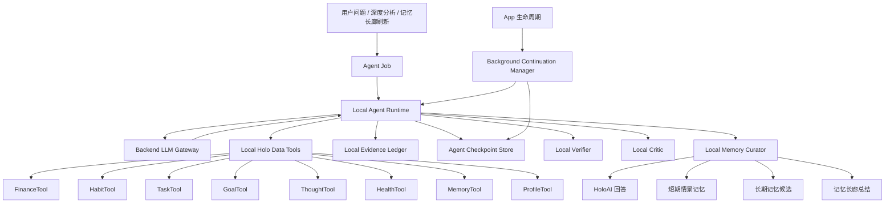

# HoloAI 本地优先可恢复 Agent 架构方案 V3

> 日期：2026-06-13  
> 范围：HoloAI 深度分析、自动巡检、短期情景记忆、长期记忆候选、Evidence Ledger、Agent Runtime、iOS 后台短时续跑、断点恢复、后端 LLM 网关。  
> 核心结论：V3 不接受智能体能力降级。HoloAI 应采用 **Local-first Full Agent Runtime**：完整 Agent 编排和 Holo 数据工具执行在 App 本地完成，后端只提供无状态 LLM 推理能力；App 进入后台后尽量短时续跑，无法继续时保存 checkpoint，下次前台恢复后从断点继续。

---

## 1. 背景

V2 提出了 Evidence-first、Tool-first、双 Agent、Pattern Miner、Verifier、Memory Curator 等方向。GLM 的对抗性审查指出，完整多轮 Agent 在 iOS 本地执行会遇到延迟、后台限制和多轮网络请求问题，因此建议降级为“规则规划 + 单次 deep_analysis”。

经过讨论，产品目标进一步明确：

1. **不能接受智能体能力降级**。  
   用户要的是 AI 能自主判断该查什么数据、如何比较、哪些结论值得记住，而不是工程师用关键词规则表枚举场景。

2. **可以接受更多 token 消耗和更长等待时间**。  
   深度分析不是普通聊天，它可以是一个后台任务，有进度、有恢复、有结果沉淀。

3. **不现实要求用户把全量个人数据交给后端**。  
   财务、健康、习惯、想法等数据高度敏感。如果为了后端真 Agent 建一份全量 AI Data Vault，工程成本、隐私压力和用户信任成本都太高。

4. **本地优先仍然是 Holo 的长期可信路线**。  
   Holo 的用户数据主要在 iOS 本地 Core Data / CloudKit 生态内，AI 应该围绕本地数据工具运行；后端负责模型能力，不拥有用户完整生活数据库。

所以 V3 的核心不是“把 Agent 降级”，也不是“把全部数据搬到后端”，而是：

```text
本地完整 Agent + 后端无状态 LLM + 本地 Evidence Ledger + 可暂停恢复的 Agent Job
```

---

## 2. 架构立场

### 2.1 不接受的方案

#### 不接受 A：规则规划替代 Agent

```text
关键词规则表 -> 固定工具集合 -> 一次 deep_analysis
```

这个方案短期容易，但会伤害核心能力：

- 不能覆盖用户无法提前举例的生活场景。
- 工具选择依赖工程师枚举。
- AI 不能主动追问工具，也不能根据中间结果继续探索。
- 容易退回“总结器”，而不是“研究员”。

规则可以做兜底、加速和安全边界，但不能替代 Agent Planner。

#### 不接受 B：后端保存用户全量 AI Data Vault

```text
iOS 全量同步生活数据到后端 -> 后端常驻 Agent 查询数据库
```

这个方案技术上强，但当前不现实：

- 需要用户主动授权大量敏感数据上云。
- 需要账号体系、后端用户数据库、加密、删除、导出、保留期策略。
- 需要重建一套和 Core Data / CloudKit 同步关系一致的数据层。
- 一旦数据同步不完整，Agent 结论反而更不可信。

它可以是远期企业级方向，不应作为当前 V3 主线。

### 2.2 接受的方案

#### 推荐：Local-first Full Agent Runtime

```text
iOS 本地 Agent Runtime
  -> LLM Planner 请求工具
  -> iOS 本地执行 Holo Data Tools
  -> LLM 继续规划或生成结论
  -> 本地 Verifier 校验证据和数字
  -> 本地 Critic 过滤低价值内容
  -> 本地 Memory Curator 决定写入短期/长期/展示-only
  -> Evidence Ledger 和 Agent Checkpoint 全部本地保存
```

后端职责收窄为：

- LLM 网关。
- Prompt / purpose 管理。
- 结构化 JSON 输出。
- 限流和日志。
- 可选的非流式后台请求支持。

后端不保存用户完整数据，不拥有用户长期生活数据库。

---

## 3. iOS 后台能力边界

V3 必须对 iOS 后台能力保持诚实。

### 3.1 App 回桌面后发生什么

用户把 App 返回桌面，并且没有杀掉进程时，App 通常会经历：

```text
active -> inactive -> background -> suspended
```

进程“没有被杀”不等于仍能持续执行。进入 suspended 后，App 仍在内存里，但代码不会继续跑。

### 3.2 可用后台能力

| 能力 | 能做什么 | 不能做什么 |
| --- | --- | --- |
| `beginBackgroundTask` | App 退后台后争取一小段收尾时间 | 不能长时间跑完整 Agent |
| `background URLSession` | 系统代管上传/下载类网络任务 | 不能让本地工具链持续运行 |
| `BGTaskScheduler` | 系统选择时机唤醒执行维护任务 | 不能保证准时，也不能承诺任务一定跑完 |
| 后台常驻模式 | 音频、定位、蓝牙等特定场景 | AI 分析不属于正当常驻场景 |

参考：

- Apple Developer: `beginBackgroundTask(expirationHandler:)`
- Apple Developer: `Extending your app's background execution time`
- Apple Developer: `URLSessionConfiguration.background(withIdentifier:)`
- Apple Developer: `BGTaskScheduler`

### 3.3 V3 对后台的产品承诺

V3 不承诺：

```text
用户回桌面后，本地 Agent 一定会完整跑完。
```

V3 承诺：

```text
用户回桌面后，Agent 会尽量完成当前阶段；
如果系统挂起 App，Agent 会保存 checkpoint；
用户下次回到 App 时，从断点继续；
已经完成的 evidence、tool results、LLM outputs 不会丢失。
```

这不是智能体降级，而是移动端可恢复任务模型。

---

## 4. 高层架构



---

## 5. 核心目标

### 5.1 功能目标

HoloAI V3 应支持：

1. 用户主动深度分析。
2. 记忆长廊深度总结。
3. 自动巡检证据预采集。
4. 多轮 Agent 工具调用。
5. 本地 Evidence Ledger。
6. 本地 Agent Checkpoint。
7. App 退后台后的短时续跑。
8. App 恢复后的断点继续。
9. 结果可解释、可校验、可写入记忆。

### 5.2 非功能目标

| 维度 | 目标 |
| --- | --- |
| 隐私 | 默认不上传完整业务数据库，只上传 Agent 当前需要的脱敏 evidence pack |
| 可靠性 | 任一阶段失败后可恢复，不丢失已完成结果 |
| 可控性 | 用户可取消 Agent Job，取消后已有 evidence 可保留但不展示 |
| 成本 | Deep Agent 可消耗更多 token，但有 job 级预算上限 |
| 延迟 | 允许 30-90 秒深度任务，不要求即时完成 |
| 体验 | 用户可离开当前页面，返回后看到进度或结果 |

---

## 6. Agent Job 模型

### 6.1 Agent Job 是第一等对象

深度分析不应再是一次普通 chat request，而应是一个可恢复任务。

```swift
struct HoloAgentJob: Codable, Identifiable {
    var id: String
    var type: HoloAgentJobType
    var userQuestion: String?
    var trigger: HoloAgentTrigger
    var state: HoloAgentJobState
    var currentStep: HoloAgentStep
    var createdAt: Date
    var updatedAt: Date
    var lastForegroundRunAt: Date?
    var timeRange: HoloTimeRange?
    var budget: HoloAgentBudget
    var checkpointID: String?
    var resultID: String?
    var errorSummary: String?
}

enum HoloAgentJobType: String, Codable {
    case deepAnalysis
    case memoryGallerySummary
    case observerInspection
    case memoryCuration
}

enum HoloAgentJobState: String, Codable {
    case queued
    case running
    case waitingForLLM
    case waitingForForeground
    case paused
    case completed
    case failed
    case cancelled
}
```

### 6.2 Agent Step

```swift
enum HoloAgentStep: String, Codable, CaseIterable {
    case plan
    case executeTools
    case integrateToolResults
    case continueOrConclude
    case verifyClaims
    case critique
    case curateMemory
    case render
    case persistResult
}
```

Agent Job 不是一次线性函数调用，而是状态机。每个 step 完成后都写 checkpoint。

---

## 7. 本地完整 Agent Runtime

### 7.1 Agent Loop

V3 保留完整 Agent 能力：

```text
1. LLM Planner 读取用户问题、可用工具描述、相关记忆摘要
2. LLM 输出 toolRequests 或 finalAnswerDraft
3. iOS 执行本地工具
4. 工具结果写入 Evidence Ledger
5. iOS 把 toolResults + evidenceRefs 发回 LLM
6. LLM 可以继续请求工具，也可以输出结构化 claims
7. 本地 Verifier 校验 claims
8. 本地 Critic 过滤空话
9. Memory Curator 决定结果去向
```

### 7.2 轮次控制

不是无限循环，也不是单次总结。

| 模式 | 最大 LLM 轮次 | 最大工具批次 | 适用场景 |
| --- | --- | --- | --- |
| Normal Deep | 3 | 3 | 普通深度分析 |
| Extended Deep | 5 | 5 | 用户明确点“继续深挖” |
| Observer Follow-up | 2 | 2 | 巡检后的增强解释 |
| Memory Gallery | 4 | 4 | 记忆长廊周期总结 |

达到预算上限时，Agent 必须输出：

- 已完成的结论。
- 未完成的分析范围。
- 是否建议继续深挖。

### 7.3 Tool Protocol

V3 可以不依赖上游模型原生 tool calling，而使用 Holo 自定义 JSON 协议。

#### LLM 请求工具

```json
{
  "status": "need_tools",
  "reason": "需要比较最近14天和前14天的习惯、财务、任务变化",
  "toolRequests": [
    {
      "id": "tool_req_001",
      "tool": "HabitTool",
      "query": "trend_summary",
      "timeRange": "last_14_days",
      "baseline": "previous_14_days",
      "requiredMetrics": ["frequency_change", "goal_conflict", "streak_break"]
    },
    {
      "id": "tool_req_002",
      "tool": "FinanceTool",
      "query": "spending_pattern",
      "timeRange": "last_14_days",
      "baseline": "previous_14_days",
      "requiredMetrics": ["amount_change", "time_distribution_shift", "category_concentration"]
    }
  ],
  "stopIfUnavailable": false
}
```

#### 工具返回结果

```json
{
  "toolRequestID": "tool_req_001",
  "tool": "HabitTool",
  "coverage": {
    "level": "rich",
    "reason": "最近14天与前14天均有记录"
  },
  "metrics": [
    {
      "metricKey": "habit.negative.over_limit_days",
      "value": 5,
      "baselineValue": 2,
      "unit": "days",
      "direction": "increasing",
      "evidenceIDs": ["ev_001", "ev_002"]
    }
  ],
  "events": [
    {
      "evidenceID": "ev_001",
      "excerpt": "某控制型行为在 2026-06-10 超过目标",
      "sensitivity": "high"
    }
  ],
  "warnings": []
}
```

### 7.4 可用工具描述

Planner 必须能知道工具能力边界。工具描述由本地动态注册生成，不写死在 prompt 文案里。

```swift
struct HoloToolDescriptor: Codable {
    var name: String
    var description: String
    var supportedQueries: [String]
    var supportedTimeRanges: [String]
    var outputMetrics: [String]
    var sensitivityPolicy: HoloToolSensitivityPolicy
}
```

每个工具提供：

- 能查什么。
- 不能查什么。
- 输出哪些 metric。
- 是否支持 baseline。
- 是否会涉及敏感数据。

---

## 8. 本地 Holo Data Tools

### 8.1 工具层原则

1. 工具在 iOS 本地读取 Core Data / 本地 Store。
2. 工具输出结构化数据，不输出自然语言长文。
3. 工具生成 evidence records。
4. 工具不做最终人生判断。
5. 敏感内容默认脱敏后进入 LLM。

### 8.2 首批工具

| 工具 | 首批能力 | 备注 |
| --- | --- | --- |
| FinanceTool | 金额变化、分类集中度、时段分布、预算偏离 | 不直接上传完整流水 |
| HabitTool | 频次变化、连续性、目标冲突、正负向习惯 | 高敏习惯名默认符号化 |
| TaskTool | 积压、延期、高优任务推进、执行差距 | 区分普通完成数量和真正阻塞 |
| MemoryTool | 长短期记忆召回、用户反馈、suppression | 防止重复低价值洞察 |
| ProfileTool | 用户主动档案、目标、称呼、禁忌 | 高可信上下文 |

### 8.3 第二批工具

| 工具 | 能力 |
| --- | --- |
| GoalTool | 目标推进、任务/习惯关联、停滞风险 |
| ThoughtTool | 主题变化、重复表达、阶段关注点 |
| HealthTool | 睡眠、运动、健康趋势、数据覆盖度 |
| CorrelationTool | 跨模块共现，只输出相关，不输出因果 |

---

## 9. Evidence Ledger

### 9.1 设计原则

Evidence Ledger 仍然是 V3 地基，但它本地保存。

```text
原始业务数据 -> Tool Result -> Evidence Record -> Pattern / Claim / Memory
```

### 9.2 存储建议

MVP 用 JSON Store，保持和现有记忆 Store 一致：

```text
Application Support/Holo/Memory/evidenceLedger.json
Application Support/Holo/Memory/agentJobs.json
Application Support/Holo/Memory/agentCheckpoints.json
Application Support/Holo/Memory/agentResults.json
```

如果 evidence 超过 10000 条，再迁移 SQLite 或 Core Data。

### 9.3 Evidence Record

```swift
struct HoloEvidenceRecord: Codable, Identifiable {
    var id: String
    var dedupeKey: String
    var sourceModule: HoloMemorySource
    var sourceID: String?
    var sourceKind: HoloEvidenceSourceKind
    var timeRange: HoloTimeRange?
    var occurredAt: Date?
    var metricKey: String
    var metricValue: Double?
    var unit: String?
    var baselineValue: Double?
    var comparison: HoloEvidenceComparison?
    var excerpt: String
    var redactedExcerpt: String
    var sensitivity: HoloMemorySensitivity
    var confidence: Double
    var status: HoloEvidenceStatus
    var generatedBy: String
    var generatedAt: Date
    var referencedByJobIDs: [String]
    var referencedByMemoryIDs: [String]
}
```

### 9.4 去重

Evidence 不允许同窗口重复追加。

```text
dedupeKey = sourceModule + metricKey + timeRange + baselineRange + scopeHash
```

相同 dedupeKey 时执行 upsert。

---

## 10. Agent Checkpoint

### 10.1 为什么必须有 checkpoint

iOS 可能在任何时候挂起 App。Agent 如果没有 checkpoint，深度分析会出现：

- 用户离开页面后进度丢失。
- LLM 请求完成了但结果无法接上。
- 工具已经查完但未写入记忆。
- 用户回来后只能重新跑，成本翻倍。

V3 必须把 Agent 设计成可恢复任务。

### 10.2 Checkpoint 模型

```swift
struct HoloAgentCheckpoint: Codable, Identifiable {
    var id: String
    var jobID: String
    var step: HoloAgentStep
    var completedSteps: [HoloAgentStep]
    var conversationState: [HoloAgentMessage]
    var pendingToolRequests: [HoloToolRequest]
    var completedToolResults: [HoloDataToolResult]
    var evidenceRecordIDs: [String]
    var validatedClaimIDs: [String]
    var memoryCandidateIDs: [String]
    var llmRequestID: String?
    var createdAt: Date
    var updatedAt: Date
}
```

### 10.3 恢复策略

| 挂起位置 | 恢复方式 |
| --- | --- |
| Planner 请求前 | 从 plan step 重新开始 |
| LLM 请求中 | 查询请求结果；若无结果则重试 |
| 工具执行中 | 重新执行未完成工具，已完成工具用 dedupeKey 跳过 |
| 验证中 | 用已保存 claims 继续验证 |
| 记忆写入中 | 用幂等 ID 重试写入 |

---

## 11. 后台短时续跑

### 11.1 Background Continuation Manager

```swift
final class HoloBackgroundContinuationManager {
    func appDidEnterBackground() {
        // 1. 通知 Agent Runtime 即将进入后台
        // 2. 请求 beginBackgroundTask
        // 3. 让当前 step 尽快收尾
        // 4. 保存 checkpoint
        // 5. 如果当前是非流式 LLM 请求，尝试交给 background URLSession
    }

    func appWillEnterForeground() {
        // 1. 读取未完成 jobs
        // 2. 查询 LLM 请求是否有结果
        // 3. 从 checkpoint 恢复
    }
}
```

### 11.2 后台策略

| 当前阶段 | App 退后台后策略 |
| --- | --- |
| 本地工具执行 | 如果很快可完成，继续；否则保存 checkpoint |
| LLM 非流式请求 | 尝试 background URLSession 继续；返回后保存响应 |
| LLM 流式请求 | 不适合作为后台任务，切换为非流式或暂停 |
| Verifier / Critic | 短任务，尽量完成；超时则 checkpoint |
| Memory Curator 写入 | 幂等写入，尽量完成 |

### 11.3 重要限制

```text
background URLSession 可以帮网络请求继续，
但不能帮本地 Agent loop 无限继续。
```

所以 V3 的后台模型是：

```text
短时续跑 + 网络托管 + 断点恢复
```

不是：

```text
iOS 本地后台常驻 Agent
```

---

## 12. LLM 调用方式

### 12.1 后端仍是无状态 LLM 网关

新增 purpose：

| Purpose | 作用 | 是否流式 | 是否 JSON |
| --- | --- | --- | --- |
| `agent_planner` | 生成 toolRequests 或继续计划 | 否 | 是 |
| `agent_reasoner` | 读取 toolResults，继续推理或输出 claims | 否 | 是 |
| `agent_renderer` | 将验证后的 claims 渲染为用户回答 | 可选 | 可选 |
| `agent_memory_curator` | 可选，辅助记忆策展 | 否 | 是 |

MVP 可以合并为两个 purpose：

- `agent_planner`
- `agent_reasoner`

Renderer 可以先本地模板 + reasoner 输出，后续再拆。

### 12.2 非流式优先

Deep Agent 默认使用非流式 JSON 请求。原因：

- 容易保存完整响应。
- 便于 background URLSession。
- 便于结构化解析。
- 便于 retry 和 checkpoint。

普通聊天继续使用 streaming。

### 12.3 结构化 Claim

LLM 不能只输出自然语言 statement。必须输出结构化 metric assertions。

```json
{
  "claims": [
    {
      "id": "claim_001",
      "type": "metric_comparison",
      "displayText": "最近14天晚间餐饮次数明显增加",
      "metricAssertions": [
        {
          "metricKey": "finance.meal.nighttime_count",
          "value": 4,
          "baselineValue": 1,
          "unit": "count",
          "comparison": "increased",
          "evidenceIDs": ["ev_001", "ev_002"]
        }
      ],
      "prohibitedInferences": [
        "不能据此推断压力大",
        "不能据此推断自控力差"
      ],
      "confidence": 0.9
    }
  ]
}
```

本地 Verifier 只校验 `metricAssertions`，不从自然语言里抽数字。

---

## 13. Verifier / Critic / Memory Curator

### 13.1 Verifier

本地确定性校验：

- evidenceID 是否存在。
- metricKey 是否来自工具输出。
- value / baselineValue 是否一致。
- claim 是否越过敏感边界。
- 短期证据是否被写成长期事实。
- 相关是否被写成因果。

### 13.2 Critic

过滤低价值内容：

- 没有 evidence 的段落。
- 只有“继续保持”“注意控制”的段落。
- 只有统计值但没有变化或意义的段落。
- 与用户 suppression rules 冲突的段落。

### 13.3 Memory Curator

本地规则为主，LLM 可辅助但不能单独决定。

| 去向 | 条件 |
| --- | --- |
| responseOnly | 只适合本次回答 |
| evidenceOnly | 只作为巡检证据，不展示 |
| episodicMemory | 近期状态变化，默认过期 |
| longTermCandidate | 用户确认或多周期命中 |
| displayOnly | 适合记忆长廊展示，不参与召回 |
| suppressionRule | 用户拒绝或少提醒 |

---

## 14. 自动巡检

### 14.1 Observer 不降级

Observer 不用规则总结替代 Agent，但它可以分层：

| 层级 | 是否 LLM | 作用 |
| --- | --- | --- |
| Tier 0 | 否 | 判断是否需要巡检 |
| Tier 1 | 否 | 本地工具预采集 evidence 和 pattern |
| Tier 2 | 是 | 当 evidence 足够重要时启动 Agent 解释 |

Tier 1 是确定性预处理，不是智能体替代品。Tier 2 才是 Agent 化解释。

### 14.2 触发时机

| 触发 | 说明 |
| --- | --- |
| App 前台恢复 | 检查上次巡检时间，只做轻量判断 |
| 用户打开记忆长廊 | 可触发 Deep Agent 总结 |
| 用户主动问 HoloAI | 可触发 Deep Agent |
| 新增关键数据 | 标记 needsObservation，不立即重跑大任务 |
| BGTaskScheduler | 可作为 opportunistic trigger，不作为可靠承诺 |

---

## 15. 用户体验

### 15.1 深度分析任务

用户看到的不是“卡住的聊天”，而是一个任务：

```text
正在深度分析
已完成：读取习惯、财务、任务数据
进行中：整理证据并验证结论
你可以先离开，回来后会继续
```

状态：

- 排队中。
- 正在读取本地数据。
- 正在请求 AI 推理。
- 正在验证结论。
- 已暂停，等待回到 App 继续。
- 已完成。

### 15.2 App 回桌面

用户回桌面时：

- 当前阶段尽量收尾。
- 若不能完成，保存进度。
- 下次打开后自动继续。
- 如果已得到部分结果，可以先展示部分结果。

### 15.3 取消

用户取消时：

- 停止继续 LLM 请求。
- 已生成 evidence 标记为 `partial`。
- 不写入记忆候选。
- 可选择“保留已分析结果”或“彻底删除本次任务”。

---

## 16. 隐私与数据上传

### 16.1 默认不上云完整数据

V3 默认不上传：

- 完整交易流水。
- 完整习惯历史。
- 完整任务列表。
- 完整想法原文。
- 完整健康记录。

### 16.2 只上传当前 Agent 需要的脱敏 evidence pack

LLM 只看到：

- 聚合指标。
- 必要的证据摘要。
- 脱敏后的高敏行为描述。
- 与当前问题相关的记忆摘要。

例如：

```text
本地完整事实：2026-06-10 抽烟 12 根，目标 8 根。
发给 LLM：某控制型行为在 2026-06-10 超过当日目标。
本地 Verifier：仍保留完整数值，用于校验 claim。
```

### 16.3 用户设置

建议新增设置：

```text
AI 深度分析数据分享精细度：
- 最小：只发送脱敏指标
- 模糊：发送趋势和部分数字，不发送敏感名称
- 完整：发送完整 evidence 摘要，仅用于当前请求
```

默认：模糊。

---

## 17. 与现有代码的落点

### 17.1 可复用

| 现有模块 | 复用方式 |
| --- | --- |
| `HoloBackendAIProvider` | 新增 agent purpose 调用 |
| `PromptManager` | 新增 agent planner / reasoner prompt |
| `ConversationCoordinator` | 增加 deep agent 分流入口 |
| `UserContextBuilder` | 提供轻量上下文，不再承担深度分析全部职责 |
| `HoloLongTermMemoryStore` | 继续保存 L3 长期记忆候选 |
| `HoloEpisodicMemoryStore` | 保存 L2 短期情景记忆 |
| `HoloMemorySummaryProvider` | MemoryTool 的召回来源之一 |
| `HabitMemorySignalBuilder` | 可迁移为 HabitTool 内部规则 |
| `MemoryInsightContextBuilder` | 兼容旧记忆长廊，逐步被 Evidence Pack 替代 |

### 17.2 需要新增

| 新模块 | 职责 |
| --- | --- |
| `HoloAgentJobStore` | 保存 Agent Job |
| `HoloAgentCheckpointStore` | 保存 checkpoint |
| `HoloAgentResultStore` | 保存结果 |
| `HoloLocalAgentRuntime` | 执行 Agent 状态机 |
| `HoloToolRegistry` | 注册本地数据工具 |
| `HoloEvidenceLedger` | 保存 evidence |
| `HoloBackgroundContinuationManager` | 处理后台短时续跑和恢复 |
| `HoloAgentLLMClient` | 非流式 JSON LLM 请求 |
| `HoloClaimVerifier` | 本地 claim 校验 |
| `HoloInsightCritic` | 低价值过滤 |
| `HoloMemoryCurator` | 记忆路由 |

### 17.3 后端改动

需要新增：

- `agent_planner` purpose。
- `agent_reasoner` purpose。
- 对应 prompt。
- 后端 route 配置。
- JSON mode 支持验证。
- usage limit 按 purpose 区分。

注意：这些是后端改动，必须部署 HoloBackend 后生产环境才会生效。

---

## 18. 实施路线

### Phase 0：方案地基和旧系统止血

目标：避免旧记忆继续污染信任。

任务：

1. 旧格式记忆候选降权或标记。
2. 明确 feature flags。
3. 增加 debug 导出当前 memory / insight / observer 状态。
4. 定义 V3 schema，不实现完整 Agent。

验收：

- 能解释当前记忆从哪里来。
- 旧格式浅摘要不再混入新系统。

### Phase 1：Agent Job + Checkpoint 地基

目标：先让任务可恢复。

任务：

1. 新增 `HoloAgentJobStore`。
2. 新增 `HoloAgentCheckpointStore`。
3. 新增 `HoloAgentResultStore`。
4. 新增状态机骨架。
5. 支持模拟 job 从 checkpoint 恢复。

验收：

- App 重启后还能看到未完成 Agent Job。
- mock step 可从断点继续。

### Phase 2：Tool Registry + Evidence Ledger

目标：让 Agent 有本地数据工具和证据地基。

任务：

1. 新增 `HoloToolDescriptor`。
2. 新增 `HoloToolRegistry`。
3. 新增 `HoloEvidenceLedger`。
4. 首批接 `HabitTool`、`FinanceTool`、`MemoryTool`。
5. 实现 evidence dedupeKey。

验收：

- 工具输出结构化 metrics/events/evidence。
- 相同窗口重复分析不会重复写 evidence。

### Phase 3：LLM Planner + Reasoner

目标：真 Agent 跑通。

任务：

1. 后端新增 `agent_planner`、`agent_reasoner`。
2. iOS 新增 `HoloAgentLLMClient`。
3. Planner 输出 toolRequests。
4. Reasoner 输出 structured claims。
5. 支持最多 3 轮 Agent loop。

验收：

- 用户问开放问题时，Planner 能选择工具。
- 工具结果能被再次交给 LLM。
- Agent 能根据中间结果继续请求工具或输出结论。

### Phase 4：Verifier / Critic / Curator

目标：让结论可信。

任务：

1. 本地 claim 校验。
2. 低价值过滤。
3. 记忆路由。
4. 敏感内容确认策略。

验收：

- 没有 evidence 的 claim 被拒绝。
- 数字不一致的 claim 被拒绝。
- “继续保持”“注意控制”类空话被过滤。

### Phase 5：后台短时续跑和恢复

目标：让深度分析适配 iOS 生命周期。

任务：

1. App 退后台时保存 checkpoint。
2. `beginBackgroundTask` 尽量完成当前 step。
3. 非流式 LLM 请求支持后台转交或重试。
4. 前台恢复时继续 job。

验收：

- 用户切桌面再回来，任务不丢。
- 进程未杀时，短任务可继续完成。
- 进程被挂起或杀掉后，下次打开可恢复。

### Phase 6：记忆长廊和 Observer 接入

目标：把 Agent 结果沉淀到产品体验。

任务：

1. 记忆长廊读取 Agent Result / Evidence / Episodic Memory。
2. Observer Tier 1 预采集 evidence。
3. Observer Tier 2 调用 Agent 解释重要变化。
4. 用户反馈写入 suppression rules。

验收：

- 记忆长廊出现的是阶段变化，不是浅统计。
- 自动巡检不会生成低价值噪音。

---

## 19. 关键验收用例

### 19.1 开放式状态分析

用户问：

```text
我最近是不是状态不太对？
```

期望：

- Planner 选择多个工具。
- Tool Results 有证据。
- Reasoner 输出结构化 claims。
- Verifier 校验通过后渲染回答。
- 如果 App 退后台，恢复后继续。

### 19.2 坏习惯趋势

输入数据：

- 用户目标：控制某负向习惯。
- 最近 3 天发生量连续上升。

期望：

- HabitTool 输出 frequency_change / goal_conflict。
- LLM 不把“发生更多”说成“完成更好”。
- 结论进入 episodic memory 候选。
- 长期记忆需要用户确认。

### 19.3 低价值任务摘要过滤

输入数据：

- 本周完成 5 个任务。
- 逾期 0 个。
- 没有高优事项，没有目标冲突。

期望：

- 可出现在页面摘要。
- 不进入记忆候选。
- 不在记忆中心反复出现。

### 19.4 后台恢复

步骤：

1. 用户发起深度分析。
2. Agent 完成 Planner 和部分工具。
3. 用户返回桌面。
4. iOS 挂起 App。
5. 用户重新打开 App。

期望：

- Job 状态显示 paused / resumed。
- 已完成工具不重复执行。
- Agent 从 checkpoint 继续。

---

## 20. 风险与缓解

| 风险 | 影响 | 缓解 |
| --- | --- | --- |
| iOS 后台时间不足 | Agent 无法一次跑完 | checkpoint + resume |
| 非流式 LLM 较慢 | 用户等待变长 | 任务化 UI + 可离开 |
| token 成本上升 | 成本不可控 | job budget + 轮次限制 |
| 本地 JSON Store 增长 | 文件变大 | dedupe + 清理 + 后续迁移 SQLite |
| LLM 输出格式错误 | Agent 卡住 | JSON parser + retry + fallback |
| 敏感数据上传 | 用户不信任 | 本地完整、上传脱敏、用户可配置 |
| 旧记忆污染 | 低价值内容继续出现 | legacy 标记 + 新系统优先 |
| 多设备冲突 | 不同设备 Agent 结果不一致 | MVP 仅本机 Agent，CloudKit 同步结果后续再设计 |

---

## 21. ADR

### ADR-001：采用本地优先 Agent，而不是后端全量 Data Vault

状态：Proposed

背景：后端全量 Agent 可以在 App 关闭后继续运行，但需要用户把完整生活数据同步到后端，成本和信任风险过高。

决策：V3 采用本地优先 Agent。用户数据工具和 Evidence Ledger 在 iOS 本地，后端只做无状态 LLM 推理。

正面影响：

- 隐私压力低。
- 与现有 Core Data / CloudKit 架构一致。
- 不需要重建后端用户数据库。

负面影响：

- App 被挂起后 Agent 不能无限继续。
- 需要 checkpoint 和恢复机制。

替代方案：

- 后端 AI Data Vault：能力强，但当前过重。
- 规则规划降级：开发快，但损害智能体本质。

### ADR-002：保留完整 Agent Planner，不用规则表替代

状态：Proposed

背景：用户明确不接受智能体能力降级。规则表无法覆盖用户无法提前举例的生活模式。

决策：Planner 由 LLM 完成，规则表只作为 fallback、安全约束和工具描述生成辅助。

正面影响：

- 保留 AI 自主调度能力。
- 能覆盖开放场景。
- 与“真正可靠的 AI 洞察”目标一致。

负面影响：

- token 成本更高。
- 输出 schema 需要严格校验。

### ADR-003：Deep Agent 使用非流式 JSON

状态：Proposed

背景：流式适合聊天体验，但不适合 checkpoint、后台网络托管和结构化验证。

决策：Deep Agent 默认使用非流式 JSON；普通聊天继续 streaming。

正面影响：

- 易恢复。
- 易解析。
- 易保存完整响应。

负面影响：

- 用户无法看到逐字流式输出。
- 需要任务进度 UI 弥补等待感。

### ADR-004：Agent Job 状态机先于工具和 prompt 实现

状态：Proposed

背景：iOS 生命周期是最大不确定性。如果先实现工具和 prompt，再补恢复机制，后续返工会很大。

决策：Phase 1 先实现 Agent Job / Checkpoint / Result Store，再接工具和 LLM。

正面影响：

- 从第一天就支持恢复。
- 后续工具和 LLM 都有统一容器。

负面影响：

- 用户可见能力出现较晚。
- 前期工程更像地基建设。

---

## 22. 最终建议

V3 的可开工方向是：

```text
不降级智能体能力。
不做后端全量用户数据仓库。
本地执行完整 Agent。
后端只做无状态 LLM。
用 checkpoint 适配 iOS 后台限制。
用 Evidence Ledger 保证结论可信。
用任务化 UI 承接更长等待时间。
```

这条路线比“后端全量 Agent”轻，比“规则降级 Agent”聪明，也更符合 Holo 作为个人生活数据产品的信任边界。

下一步不应该继续讨论”是否降级”，而应该进入 V3 的 Phase 0/1 设计审查：

1. Agent Job schema 是否够稳。
2. Checkpoint 是否覆盖 iOS 挂起和重启。
3. Tool Protocol 是否足够表达多轮推理。
4. Evidence Ledger 是否能支撑记忆长廊和长期记忆。
5. 后端新增 purpose 是否足够少、可部署、可验证。

---

## 附录 A：对抗性审查报告

> 审查日期：2026-06-13
> 审查前提：**不降级 Agent 能力**。基于 V3 的 Local-first Full Agent 方向，审查落地路径上的技术断点。
> 审查方法：逐节审查 + 后端/IOS 代码交叉验证

---

### 🔴 CRITICAL — 不补齐会阻塞 Agent 跑通

#### C1. Agent Loop 的 conversationState 类型未定义，但它是多轮推理的命脉

**问题位置**：§10.2 `HoloAgentCheckpoint.conversationState: [HoloAgentMessage]`

`HoloAgentMessage` 在整个方案中从未定义。但 Agent 的多轮推理依赖它：
- Planner 第一轮输出 toolRequests
- iOS 执行工具后，需要把 tool results 追加到对话历史
- Reasoner 读取完整对话历史（包含前几轮的 toolRequests + toolResults）才能继续推理
- 如果恢复时不知道前几轮的对话状态，Agent 会丢失上下文

这不是”类型细节”，而是 Agent 能否正确恢复的先决条件。

**建议补齐**：

```swift
enum HoloAgentMessageRole: String, Codable {
    case system
    case user              // 用户原始问题
    case assistant         // LLM 输出（toolRequests 或 claims）
    case toolResult        // 本地工具执行结果
}

struct HoloAgentMessage: Codable {
    var role: HoloAgentMessageRole
    var content: String              // JSON string（结构化内容）
    var toolRequestID: String?       // role=toolResult 时关联的请求 ID
    var toolName: String?            // role=toolResult 时对应的工具名
    var timestamp: Date
    var tokenEstimate: Int?          // 用于预算追踪
}
```

关键点：
- `assistant` 消息存储 LLM 的原始 JSON 输出（包含 toolRequests 或 claims）
- `toolResult` 消息存储工具执行后的结构化结果
- 恢复时从 checkpoint 的 conversationState 重建完整对话上下文，发送给 LLM

#### C2. Planner 和 Reasoner 的职责边界和切换时机未定义

**问题位置**：§12.1 定义了 `agent_planner` 和 `agent_reasoner` 两个 purpose

方案说 Planner “生成 toolRequests 或继续计划”，Reasoner “读取 toolResults，继续推理或输出 claims”。但以下场景没有定义：

| 场景 | Planner 还是 Reasoner？ | 当前方案是否覆盖 |
|------|------------------------|----------------|
| 第一轮：理解用户问题，决定查什么 | Planner | ✅ |
| 第二轮：拿到工具结果，决定是否继续查 | **?** | ❌ |
| 第二轮：拿到工具结果，决定输出结论 | **?** | ❌ |
| 第三轮：继续追问工具 | **?** | ❌ |
| 最后一轮：整合所有证据，输出结构化 claims | Reasoner | ✅ |

问题核心：**Planner 和 Reasoner 是两个不同的 purpose，意味着两个不同的 prompt、不同的后端路由、不同的模型/温度配置。但 Agent 循环中，LLM 在每一步都需要同时具备”规划”和”推理”能力。**

如果第二轮用 Planner，它可能不知道怎么处理工具结果；如果用 Reasoner，它可能不会发起新的 toolRequests。

**建议**：

**方案 A（推荐）：合并为一个 purpose `agent_loop`**

用一个 prompt 处理所有 Agent 步骤。LLM 的输出通过 `status` 字段区分：
- `”need_tools”` → 需要继续调用工具
- `”need_more_analysis”` → 需要继续推理但不调工具
- `”final_claims”` → 输出最终结论

```json
{
  “status”: “need_tools | need_more_analysis | final_claims”,
  “reasoning”: “我已经拿到习惯和财务数据，但健康数据还没查。用户问的是整体状态，需要健康数据才能完整回答。”,
  “toolRequests”: [...],
  “claims”: [...],
  “nextStep”: “继续查询 HealthTool，然后综合分析”
}
```

优点：
- 一个 prompt 处理所有场景，不需要在 iOS 端判断”这一轮该调 Planner 还是 Reasoner”
- LLM 自己决定下一步，真正体现 Agent 自主性
- 只需 1 个新 purpose，后端改动最小

**方案 B：保留两个 purpose，明确定义切换规则**

如果坚持拆分，需要定义：
- 第一轮：调 Planner
- 每次拿到工具结果后：调 Planner（让它决定是否继续查工具）
- Planner 认为数据够了：调 Reasoner（输出 claims）
- Reasoner 如果发现数据不足：回到 Planner

但这会引入一个”Planner 说数据够了但 Reasoner 说不够”的死循环风险。

**无论选哪个，方案都需要明确定义 LLM 调用序列**。

#### C3. Tool Protocol 缺少 error/empty/partial 状态，Agent 会卡死

**问题位置**：§7.3 Tool Protocol

当前 Tool Protocol 只定义了成功路径（metrics + events + warnings）。但实际场景中：

| 场景 | 当前协议支持 | Agent 会怎样 |
|------|------------|-------------|
| 工具返回空数据（用户没有财务记录） | ❌ 无 error 字段 | LLM 收到空结果，不知道是”查询成功但没数据”还是”查询失败” |
| 工具执行出错（Core Data 查询失败） | ❌ 无 error 字段 | Agent 循环中断，不知道该重试还是跳过 |
| LLM 请求了不存在的工具 | ❌ 无校验 | 工具执行报错，Agent 卡住 |
| LLM 请求了无效参数（时间范围不对） | ❌ 无校验 | 工具返回错误数据，Verifier 无法校验 |
| 工具执行超时（>5s） | ❌ 无超时机制 | Agent 无限等待 |

**建议补齐**：

```swift
struct HoloDataToolResult: Codable {
    var toolRequestID: String
    var tool: String
    var status: HoloToolResultStatus       // 新增
    var coverage: HoloDataCoverage?
    var metrics: [HoloMetric]
    var events: [HoloEvidenceEvent]
    var warnings: [HoloToolWarning]
    var error: HoloToolError?              // 新增
}

enum HoloToolResultStatus: String, Codable {
    case success       // 正常返回
    case empty         // 查询成功但无数据
    case partial       // 部分数据可用
    case error         // 执行出错
    case unavailable   // 工具不可用（如用户未授权某模块）
    case timeout       // 执行超时
}

struct HoloToolError: Codable {
    var code: String       // “CORE_DATA_ERROR” / “INVALID_PARAMS” / “TOOL_NOT_FOUND”
    var message: String    // 人类可读的错误描述
    var recoverable: Bool  // Agent 是否应该重试
}
```

**iOS 端工具执行器**：

```swift
actor HoloToolExecutor {
    func execute(request: HoloToolRequest) async -> HoloDataToolResult {
        // 1. 校验工具是否存在
        guard let tool = registry.tool(named: request.tool) else {
            return .init(toolRequestID: request.id, tool: request.tool,
                         status: .error, error: .init(code: “TOOL_NOT_FOUND”,
                         message: “工具 \(request.tool) 不存在”, recoverable: false))
        }

        // 2. 校验参数
        guard tool.validateParams(request) else {
            return .init(toolRequestID: request.id, tool: request.tool,
                         status: .error, error: .init(code: “INVALID_PARAMS”,
                         message: “参数校验失败”, recoverable: false))
        }

        // 3. 带超时执行
        do {
            return try await withTimeout(seconds: 5) {
                let result = try await tool.execute(request)
                return result.metrics.isEmpty && result.events.isEmpty
                    ? result.withStatus(.empty)
                    : result
            }
        } catch is TimeoutError {
            return .init(toolRequestID: request.id, tool: request.tool,
                         status: .timeout, error: .init(code: “TIMEOUT”,
                         message: “工具执行超时”, recoverable: true))
        } catch {
            return .init(toolRequestID: request.id, tool: request.tool,
                         status: .error, error: .init(code: “EXECUTION_ERROR”,
                         message: error.localizedDescription, recoverable: true))
        }
    }
}
```

#### C4. Checkpoint 恢复时”查询 LLM 请求结果”在技术上不可行

**问题位置**：§10.3 恢复策略 “LLM 请求中 → 查询请求结果；若无结果则重试”

**代码事实**：HoloBackend 是完全无状态的：
- 后端不存储 LLM 响应
- 没有 request ID 追踪
- 没有 “查询上次请求结果” 的 API
- `openAICompatibleProvider.js` 在返回响应后不保留任何状态

所以当 iOS App 被挂起时：
1. LLM 请求已发出
2. 后端可能已经完成 LLM 调用并尝试返回响应
3. 但 iOS 端的 URLSession 连接已断开，响应丢失
4. App 恢复后，无法”查询”这个响应——后端根本没有存储

**这不是 Edge Case**，而是 Agent 运行中最常见的暂停场景（LLM 请求通常需要 3-8 秒，用户切 App 的概率很高）。

**建议**：

**恢复策略修正为：LLM 请求进行中被挂起 → 重试同一请求（使用相同 conversationState）**

关键点：
- 不叫”查询结果”，叫”重试请求”
- 使用 checkpoint 中保存的 `conversationState` 重建完整上下文
- LLM 是确定性的（temperature > 0 有随机性，但结果质量不受影响）
- 成本：重试会消耗额外 token，但这是移动端的固有代价

```swift
// 恢复逻辑修正
func resumeFromCheckpoint(_ checkpoint: HoloAgentCheckpoint) async throws {
    switch checkpoint.step {
    case .plan, .continueOrConclude:
        // LLM 请求前被挂起 → 直接重新开始当前 step
        try await executeStep(checkpoint.step, context: checkpoint.conversationState)

    case .integrateToolResults:
        // LLM 请求中被挂起 → 重试（不是查询）
        // conversationState 已保存，可完整重建请求
        try await retryLLMCall(with: checkpoint.conversationState)

    case .executeTools:
        // 工具执行中被挂起 → 用 dedupeKey 跳过已完成的工具
        let pending = checkpoint.pendingToolRequests.filter { req in
            !checkpoint.completedToolResults.contains { $0.toolRequestID == req.id }
        }
        try await executeTools(pending)

    // ... 其他 step 同理
    }
}
```

#### C5. 后端 JSON 输出不可靠，Agent 会频繁卡在格式错误上

**代码事实**：
- 后端只透传 `response_format: {type: “json_object”}`，不做 JSON 校验
- 如果 LLM 返回非法 JSON，后端原样返回给 iOS
- 当前后端的 `memory_observer` 和 `intent_recognition` 都依赖 JSON 输出，但错误处理是”解析失败就日志报错 + return”
- **iOS 端已有的 fallback 是回退到 clarification 模式**（”我没完全理解这句话”），这对 Agent 是灾难性的——Agent 不需要给用户展示 clarification，它需要知道 LLM 格式错误并重试

**Agent 场景的影响**：
- Agent 的每一步都依赖 LLM 输出严格 JSON（toolRequests / claims）
- 如果 Planner 输出的 JSON 缺少 `status` 字段，iOS 端无法判断 LLM 是要调工具还是要输出结论
- 不同 LLM provider（DeepSeek / Qwen / Moonshot）的 JSON mode 可靠性不同

**建议**：

**1. 后端增加 JSON 校验层**

```javascript
// app.js 中新增
function validateAgentResponse(response, purpose) {
    if (purpose === 'agent_planner' || purpose === 'agent_loop') {
        try {
            const content = response.choices?.[0]?.message?.content;
            const parsed = JSON.parse(content);
            if (!parsed.status) {
                return { valid: false, error: 'Missing required field: status' };
            }
            return { valid: true, parsed };
        } catch (e) {
            return { valid: false, error: 'Invalid JSON: ' + e.message };
        }
    }
    return { valid: true };
}
```

**2. iOS 端增加 Agent 专用 JSON 解析 + 重试**

```swift
struct HoloAgentResponseParser {
    /// 解析 Agent LLM 响应，最多重试 N 次
    static func parse(
        rawResponse: String,
        maxRetries: Int = 2
    ) async throws -> HoloAgentOutput {
        // 第一层：尝试直接解析
        if let output = tryParseStrict(rawResponse) {
            return output
        }

        // 第二层：尝试提取 JSON（处理 LLM 在 JSON 外加注释的情况）
        if let json = extractJSON(from: rawResponse),
           let output = tryParseStrict(json) {
            return output
        }

        // 第三层：日志记录 + 重试
        logger.error(“Agent LLM 输出 JSON 解析失败，原始内容：\(rawResponse.prefix(200))”)

        if maxRetries > 0 {
            logger.info(“尝试重试 Agent LLM 调用（剩余 \(maxRetries) 次）”)
            throw HoloAgentError.outputParseFailure(needsRetry: true)
        }

        // 第四层：彻底失败，Agent 进入 failed 状态
        throw HoloAgentError.outputParseFailure(needsRetry: false)
    }

    private static func tryParseStrict(_ text: String) -> HoloAgentOutput? {
        guard let data = text.data(using: .utf8),
              let output = try? JSONDecoder().decode(HoloAgentOutput.self, from: data) else {
            return nil
        }
        return output
    }
}
```

**3. 在 Agent prompt 中强化 JSON 输出约束**

现有 prompt 用”只输出 JSON”就够了，但 Agent 的 prompt 需要更严格的约束：
- 给出完整的 JSON schema 示例
- 列出所有可能的 status 值
- 明确说明 “如果不确定 status，输出 final_claims”
- 禁止在 JSON 外添加任何文本

---

### 🟠 HIGH — 影响质量或效率，应在对应 Phase 开工前补齐

#### H1. Evidence Ledger 与 Agent Checkpoint 之间缺少事务性保障

**问题位置**：§9, §10

方案描述了两个独立的 JSON Store：
- `evidenceLedger.json` — 证据记录
- `agentCheckpoints.json` — Agent 断点

两者有引用关系：Checkpoint 引用 evidence IDs。但它们是独立文件、独立队列。

**风险场景**：
1. Agent 写入 5 条 evidence → evidenceLedger.json 保存成功
2. Agent 保存 checkpoint（引用这 5 条 evidence ID）→ **App 被杀，checkpoint 保存失败**
3. 结果：5 条 orphaned evidence 没有任何 job 引用它们

或者反过来：
1. Agent 保存 checkpoint → 成功
2. Agent 写入 evidence → **失败**
3. 恢复时 checkpoint 引用了不存在的 evidence IDs

**建议**：

**不引入分布式事务（过重），而是用”写入顺序 + 引用检查”保证最终一致**：

```swift
actor HoloAgentPersistenceManager {
    // 统一管理所有持久化操作，保证写入顺序

    /// 原子保存：先写 evidence，再写 checkpoint
    func saveProgress(
        evidence: [HoloEvidenceRecord],
        checkpoint: HoloAgentCheckpoint
    ) async throws {
        // 1. 先写 evidence（即使后续失败，orphaned evidence 也比 missing evidence 好）
        try await evidenceLedger.append(evidence)

        // 2. 再写 checkpoint（checkpoint 引用的 evidence 一定已存在）
        try await checkpointStore.save(checkpoint)
    }

    /// 恢复时校验引用完整性
    func validateCheckpoint(_ checkpoint: HoloAgentCheckpoint) -> Bool {
        let allEvidenceIDs = Set(evidenceLedger.load().map(\.id))
        return checkpoint.evidenceRecordIDs.allSatisfy { allEvidenceIDs.contains($0) }
    }
}
```

额外策略：
- 定期清理 orphaned evidence（没有任何 job/memory 引用的 evidence，超过 7 天则删除）
- 恢复时如果发现 checkpoint 引用不存在的 evidence → 标记该 step 需要重新执行

#### H2. Agent Budget 模型未定义，无法控制成本

**问题位置**：§6.1 `HoloAgentJob.budget: HoloAgentBudget`

`HoloAgentBudget` 在方案中从未展开。但它是 Agent 安全运行的关键约束——没有预算上限，Agent 可能无限循环。

**建议补齐**：

```swift
struct HoloAgentBudget: Codable {
    // 轮次限制
    var maxLLMRounds: Int               // Normal: 3, Extended: 5, Observer: 2
    var maxToolBatches: Int             // Normal: 3, Extended: 5, Observer: 2

    // Token 预算（估算）
    var maxInputTokens: Int             // 累计 input tokens 上限
    var maxOutputTokens: Int            // 累计 output tokens 上限

    // 时间预算
    var maxWallTimeSeconds: Int         // 最大执行时间

    // 已消耗
    var consumedLLMRounds: Int
    var consumedInputTokens: Int        // 通过 tokenEstimate 累计
    var consumedOutputTokens: Int
    var consumedWallTimeSeconds: Int    // 通过 Date() 差值计算

    // 查询
    var isExhausted: Bool {
        consumedLLMRounds >= maxLLMRounds
        || consumedInputTokens >= maxInputTokens
        || consumedOutputTokens >= maxOutputTokens
        || consumedWallTimeSeconds >= maxWallTimeSeconds
    }
}

// 预设
extension HoloAgentBudget {
    static func normalDeep() -> HoloAgentBudget {
        .init(maxLLMRounds: 3, maxToolBatches: 3,
              maxInputTokens: 10_000, maxOutputTokens: 4_000,
              maxWallTimeSeconds: 120)
    }

    static func extendedDeep() -> HoloAgentBudget {
        .init(maxLLMRounds: 5, maxToolBatches: 5,
              maxInputTokens: 20_000, maxOutputTokens: 8_000,
              maxWallTimeSeconds: 300)
    }

    static func observerFollowUp() -> HoloAgentBudget {
        .init(maxLLMRounds: 2, maxToolBatches: 2,
              maxInputTokens: 6_000, maxOutputTokens: 2_000,
              maxWallTimeSeconds: 60)
    }
}
```

**预算耗尽时的 Agent 行为**：

```swift
// Agent Runtime 中每轮检查预算
func executeAgentLoop(job: inout HoloAgentJob, checkpoint: inout HoloAgentCheckpoint) async throws {
    while !job.budget.isExhausted {
        let llmOutput = try await callLLM(checkpoint.conversationState)
        job.budget.consumedLLMRounds += 1

        switch llmOutput.status {
        case .needTools:
            let results = try await executeTools(llmOutput.toolRequests)
            checkpoint.conversationState.append(/* results */)
        case .finalClaims:
            try await handleClaims(llmOutput.claims)
            return
        }

        try await persistenceManager.saveProgress(...)
    }

    // 预算耗尽：输出已完成的部分结论
    try await handlePartialResult(reason: .budgetExhausted)
}
```

#### H3. Pattern Miner 的位置和职责在 V3 中消失了

**问题位置**：V2 有详细的 Pattern Miner 设计（11 种 pattern type），V3 完全没有提及。

V3 的架构是：Tools → LLM Reasoner → Verifier。但 Pattern Miner 应该在哪里？

| 选项 | 优点 | 缺点 |
|------|------|------|
| 内嵌在工具中（工具输出 pattern signals） | 简单，不需要额外组件 | 工具变重，pattern 逻辑和查询逻辑耦合 |
| Agent Loop 内的独立 step | 清晰，可测试 | 增加一个 step，增加 LLM 调用 |
| 本地规则引擎（在工具和 LLM 之间） | 快速、确定性、不依赖 LLM | 需要额外实现 |

**建议**：Pattern Miner 应作为本地规则引擎，在 Tool Results 交给 LLM 之前运行：

```text
工具执行 → Pattern Miner（本地规则）→ Pattern Signals + Tool Results → LLM
```

理由：
- LLM 不擅长从原始 metrics 中发现统计模式（频次变化、连续性中断等），这是规则引擎的强项
- Pattern Signals 作为额外上下文输入给 LLM，帮助它更快聚焦到有意义的趋势
- 减少 LLM 的推理负担（不需要 LLM 自己算”5 天超标 vs 2 天超标是否构成 frequency_change”）

这在 Agent 流程中增加一个 step：

```swift
enum HoloAgentStep: String, Codable, CaseIterable {
    case plan
    case executeTools
    case minePatterns        // 新增：在工具执行后、LLM 推理前
    case integrateResults    // 原 integrateToolResults，现在包含 pattern signals
    case continueOrConclude
    case verifyClaims
    case critique
    case curateMemory
    case render
    case persistResult
}
```

#### H4. Observer Tier 1 → Tier 2 的衔接条件未定义

**问题位置**：§14.1

方案说 Tier 1 是”本地工具预采集 evidence 和 pattern”，Tier 2 是”当 evidence 足够重要时启动 Agent 解释”。”足够重要”的判断标准是什么？

如果定义不清，会出现两种问题：
- 过度触发：Tier 1 每次都认为有重要发现 → Tier 2 频繁跑 Agent → token 成本失控
- 触发不足：Tier 1 标准太高 → 重要变化被遗漏 → 用户感知不到 Observer 价值

**建议补齐**：

```swift
struct HoloObserverTriggerPolicy {
    /// Tier 2 触发条件（满足任一）
    var triggers: [HoloObserverTier2Trigger]

    /// 冷却期：两次 Tier 2 之间的最小间隔
    var tier2CooldownMinutes: Int = 360  // 6 小时
}

enum HoloObserverTier2Trigger {
    /// Pattern severity >= high
    case highSeverityPattern

    /// 目标冲突（用户行为与明确目标矛盾）
    case goalConflict(pattern: HoloPatternSignal)

    /// 短期记忆状态变化（从 active 变为 suggested）
    case episodicMemoryStateChange(memoryID: String, newState: HoloEpisodicMemoryState)

    /// 用户上次 Tier 2 至今超过阈值且有新 evidence
    case accumulatedEvidence(count: Int, sinceLastTier2: TimeInterval)

    /// 用户手动触发
    case userRequested
}
```

#### H5. HoloAgentJob 的清理和归档策略缺失

**问题位置**：§6.1

Job 会持续积累（每次深度分析、巡检、记忆长廊刷新都创建 Job）。方案没有定义：
- completed / failed / cancelled 的 Job 保留多久？
- checkpoint 和 result 随 Job 清理还是独立管理？
- 清理时级联删除 evidence 还是保留（evidence 可能被其他 Job 引用）？

**建议**：

```swift
struct HoloJobCleanupPolicy {
    /// completed Job 保留天数（用户可回顾）
    var completedRetentionDays: Int = 30

    /// failed / cancelled Job 保留天数
    var failedRetentionDays: Int = 7

    /// 清理时是否级联删除 checkpoint
    var cascadeCheckpoint: Bool = true

    /// 清理时是否级联删除 result
    var cascadeResult: Bool = true

    /// 清理时不删除被其他 Job 或 Memory 引用的 evidence
    var preserveReferencedEvidence: Bool = true
}
```

---

### 🟡 MEDIUM — 改善方案质量

#### M1. background URLSession 用于 LLM 请求的实际可行性存疑

**问题位置**：§11.2 “LLM 非流式请求 → 尝试 background URLSession 继续”

**技术约束**：
- background URLSession 需要实现 `URLSessionDelegate` 的 `urlSessionDidFinishEvents(forBackgroundURLSession:)`
- 后端非流式请求 timeout 是 60s，但 background URLSession 的回调时机由系统决定
- App 被 suspend 后，background URLSession 的完成回调可能在 App 被 systemd 唤醒很久之后才到
- 后端 response 是 JSON body，不是文件下载——background URLSession 更适合大文件传输

**建议**：不依赖 background URLSession 承接 LLM 请求。改为：

- App 退后台 → `beginBackgroundTask` 争取 ~30s 续跑
- 如果当前 LLM 请求在 30s 内返回 → 正常处理
- 如果未返回 → 取消请求，保存 checkpoint（conversationState 已保存）
- 前台恢复 → 用 checkpoint 中的 conversationState 重试

这比 background URLSession 更简单、更可控。

#### M2. 敏感数据脱敏的实现层次不清

**问题位置**：§16.2, §9.3 `redactedExcerpt`

方案说 Evidence Record 有 `excerpt` 和 `redactedExcerpt` 两个版本。但没说：
- 谁负责生成 `redactedExcerpt`？工具？独立 filter？
- 如果 LLM 收到的是 `redactedExcerpt`，但 Verifier 需要用 `excerpt` 校验数字，如何保证 Verifier 知道”某控制型行为”对应什么具体数据？
- LLM 输出的 claim 中可能包含脱敏后的描述，Verifier 如何用本地完整数据校验脱敏后的描述？

**建议**：脱敏发生在”发给 LLM 前”这一步，不影响内部数据流：

```text
工具输出完整 excerpt → Evidence Ledger 存完整 excerpt + redactedExcerpt
    → 发给 LLM 时用 redactedExcerpt
    → Verifier 用完整 excerpt（本地）校验
    → 给用户展示时用 redactedExcerpt
```

```swift
struct HoloLLMPackager {
    /// 把 evidence pack 脱敏后发给 LLM
    static func packageForLLM(
        evidence: [HoloEvidenceRecord],
        sensitivityLevel: HoloSensitivityLevel
    ) -> [HoloLLMEvidenceItem] {
        evidence.map { record in
            HoloLLMEvidenceItem(
                id: record.id,
                metricKey: record.metricKey,
                metricValue: record.metricValue,       // 数值不脱敏
                baselineValue: record.baselineValue,   // 数值不脱敏
                excerpt: sensitivityLevel == .full
                    ? record.excerpt
                    : record.redactedExcerpt,           // 按级别脱敏
                sensitivity: record.sensitivity
            )
        }
    }
}
```

#### M3. HoloToolDescriptor 的注册和发现机制缺失

**问题位置**：§7.4

方案定义了 `HoloToolDescriptor` 结构，但没说：
- 工具如何注册到 `HoloToolRegistry`
- Registry 如何生成工具描述给 LLM prompt
- 新增工具时是否需要修改 prompt 模板

**建议**：

```swift
protocol HoloDataTool {
    var descriptor: HoloToolDescriptor { get }
    func execute(_ request: HoloToolRequest) async throws -> HoloDataToolResult
    func validateParams(_ request: HoloToolRequest) -> Bool
}

struct HoloToolRegistry {
    private var tools: [String: HoloDataTool] = [:]

    mutating func register(_ tool: HoloDataTool) {
        tools[tool.descriptor.name] = tool
    }

    /// 生成给 LLM prompt 的工具描述（动态生成，不硬编码）
    func toolDescriptionsForPrompt() -> String {
        tools.values.map { tool in
            let d = tool.descriptor
            return “””
            \(d.name): \(d.description)
            支持的查询: \(d.supportedQueries.joined(separator: “, “))
            时间范围: \(d.supportedTimeRanges.joined(separator: “, “))
            输出指标: \(d.outputMetrics.joined(separator: “, “))
            敏感度: \(d.sensitivityPolicy)
            “””
        }.joined(separator: “\n\n”)
    }

    func tool(named name: String) -> HoloDataTool? {
        tools[name]
    }
}
```

这样新增工具只需实现 `HoloDataTool` 协议并注册，不需要修改任何 prompt。

#### M4. 多设备场景虽标记为”后续设计”，但数据模型应预留扩展性

**问题位置**：§20 风险表 “MVP 仅本机 Agent”

当前方案的所有 ID 都是本地生成的（UUID），Store 都是本地 JSON 文件。如果后续要支持多设备：
- Job / Checkpoint / Result 需要通过 CloudKit 同步
- 本地 UUID 需要改为全局唯一 ID（否则两台设备可能生成相同 ID）
- Evidence Ledger 的 dedupeKey 在多设备环境下需要加入 deviceID 维度

**建议**：现在就使用 UUID v4（已经是全局唯一），并在所有 model 中预留 `deviceID: String?` 字段（MVP 不填，后续多设备时使用）。

#### M5. Agent 结果展示的”参考证据”交互未设计

**问题位置**：§15 用户体验

方案说用户可以”离开当前页面，回来后看到结果”，但没有描述结果展示的交互：
- 回答中如何展示引用了哪些证据？（内联标注？脚注？可展开卡片？）
- 用户点击某条 evidence 时能看到什么？（原始数据？时间范围？置信度？）
- “记住 / 忽略 / 不准 / 少提醒”反馈入口在哪里？

这是产品体验的关键细节，建议在 Phase 3（Agent 跑通后）的 UI 设计中补齐。

---

### 🔵 LOW — 改善建议

#### L1. Agent Job 状态机缺少 `retrying` 状态

当前状态有 `queued / running / waitingForLLM / waitingForForeground / paused / completed / failed / cancelled`。

LLM 格式错误导致的重试应该有一个独立状态 `retrying`，UI 可展示”正在重试 AI 推理”。

#### L2. 方案缺少可测试性设计

每个 Phase 应定义测试要求：
- Phase 1：Agent Job 的状态机转换测试、Checkpoint 保存/恢复测试
- Phase 2：工具输出的结构化测试、Evidence 去重测试
- Phase 3：LLM 输出解析的 golden test、多轮 Agent 的集成测试
- Phase 4：Verifier 的 claim 校验测试、Critic 的过滤测试

建议在 §18 每个 Phase 中增加”测试要求”子节。

#### L3. 成本估算缺失

基于 Full Agent 模式（3 轮 LLM 调用 + 本地工具）：

| 模式 | LLM 轮次 | Input Tokens/轮 | Output Tokens/轮 | 总 Tokens | 估算成本/次 |
|------|---------|----------------|-----------------|----------|------------|
| Normal Deep | 3 | ~2,500 | ~800 | ~9,900 | ~¥0.05 |
| Extended Deep | 5 | ~3,000 | ~800 | ~19,000 | ~¥0.10 |
| Observer Tier 2 | 2 | ~2,000 | ~600 | ~5,200 | ~¥0.03 |
| Memory Gallery | 4 | ~3,000 | ~800 | ~15,200 | ~¥0.08 |

月度估算：~¥5-15/用户/月（取决于使用频率和模型选择）。

---

### 审查总结

| 级别 | 数量 | 核心主题 |
|------|------|----------|
| 🔴 CRITICAL | 5 | conversationState 未定义、Planner/Reasoner 职责不清、Tool Protocol 缺 error 状态、Checkpoint 恢复不可行、后端 JSON 不可靠 |
| 🟠 HIGH | 5 | Evidence/Checkpoint 事务性、Budget 未定义、Pattern Miner 消失、Observer Tier 2 触发条件、Job 清理 |
| 🟡 MEDIUM | 5 | background URLSession 可行性、脱敏层次、Tool 注册机制、多设备预留、结果展示交互 |
| 🔵 LOW | 3 | retrying 状态、可测试性、成本估算 |

**最关键的一个判断**：V3 的架构方向完全正确——Local-first Full Agent + checkpoint 恢复 + Evidence Ledger 是正确的选择。但方案在 **Agent Loop 的内部协议** 上有 5 个结构性缺口，如果不补齐，Phase 3（Agent 跑通）会卡住：

1. **conversationState 类型** — 不定义它，Agent 恢复后不知道上下文
2. **Planner/Reasoner 合并** — 两个 purpose 的切换逻辑会引入复杂度和死循环风险
3. **Tool error 状态** — 没有它，Agent 遇到工具故障会卡死
4. **Checkpoint 恢复** — “查询结果”不可行，必须改为”重试请求”
5. **JSON 解析兜底** — LLM 格式错误是常态不是异常，需要多层解析 + 重试

**建议补齐优先级**：先补齐 C1-C5（可在 Phase 1 开工前用 1-2 天完成），然后按 Phase 0 → 1 → 2 → 3 顺序推进。H1-H5 在对应 Phase 开工前补齐即可。
