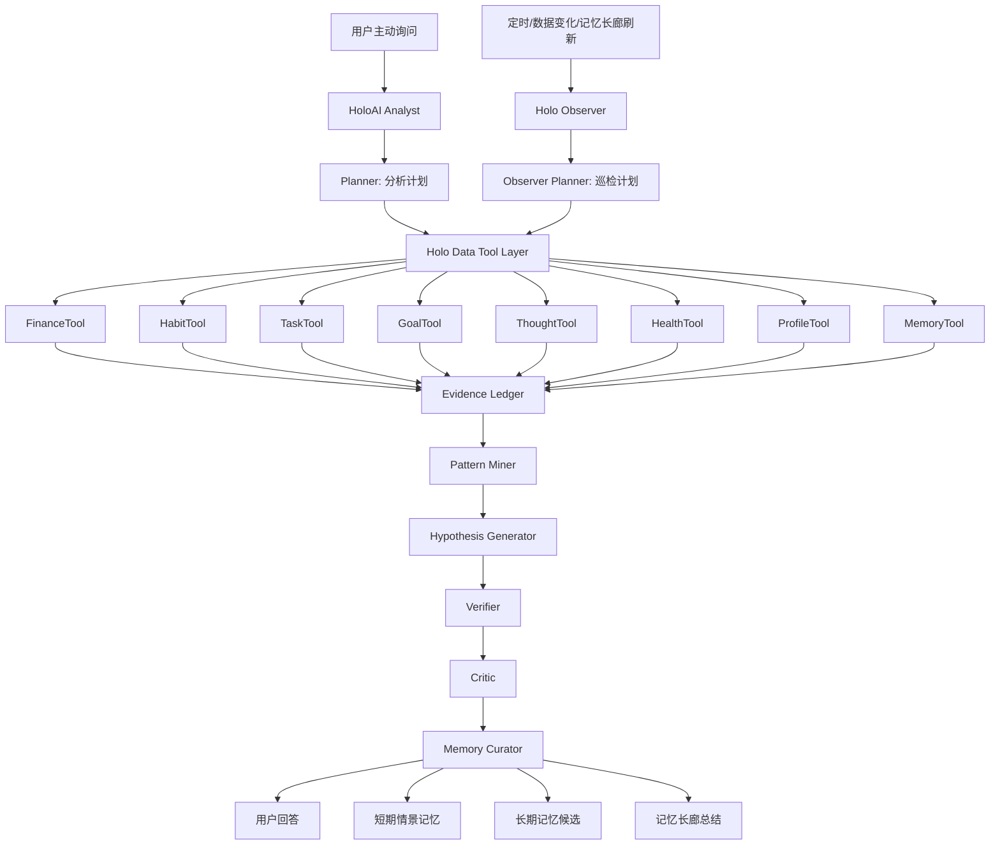

# HoloAI 通用数据推理 Agent 架构方案

> 日期：2026-06-13  
> 范围：HoloAI 主动问答、自动巡检、记忆长廊、短期情景记忆、长期记忆、Memory Insight、Daily Sense、数据工具层、证据账本、AI 多阶段推理。  
> 结论：HoloAI 的下一阶段不应该继续把更多数据堆进一个 prompt，而应该升级为“可调度 Holo 数据工具、可沉淀证据、可验证结论、可回写记忆”的个人智能体系统。主动问答和自动巡检应拆成两个 Agent，但共享同一套证据层、模式挖掘层、记忆层和用户反馈层。

---

## 1. 背景与问题

用户当前对 HoloAI 记忆和洞察的不满，本质不是“AI 没有输出更多卡片”，而是：

1. 输出像统计摘要，不像洞察。  
   “任务清零”“支出偏高”“任务全部闭环”只是结果汇总，缺少趋势、原因、边界、证据和行动价值。

2. 记忆没有真正变成持续理解。  
   用户用了几天后，HoloAI 没有明显表现出“我知道你最近状态发生了什么变化”，也没有在回答时稳定召回相关上下文。

3. 短期记忆和长期记忆缺少可靠分工。  
   一周内的状态变化不应该立刻变成长期事实；长期事实也不应该被浅层统计污染。

4. prompt 堆料已经到达上限。  
   把财务、习惯、任务、目标、想法、健康、记忆全部塞进一个 prompt，只会让 AI 做“泛泛总结”，不会自然产生可靠洞察。

5. 用户要的是通用智能，不是几个硬编码 case。  
   夜宵、抽烟只是例子。真正需要的是一套能覆盖任意 Holo 数据域的通用推理框架：AI 可以决定要查什么数据、怎么比较、怎么形成证据、怎么验证结论、哪些值得记住。

---

## 2. 目标

### 2.1 用户目标

HoloAI 应该能做到：

- 用户主动问时，能像一个认真分析过数据的助手，而不是读摘要的机器人。
- 自动巡检时，能持续发现细节变化和趋势证据，但不乱打扰用户。
- 进入记忆长廊的内容，应该是“有证据、有阶段意义、有复用价值”的记忆。
- AI 给出结论时，用户能看懂它依据什么数据，为什么这么判断。
- 用户可以纠正 AI，让系统下次少输出同类低价值内容。

### 2.2 系统目标

HoloAI 架构需要从：

```text
固定上下文构建 -> 单次 prompt -> 洞察卡/回答
```

升级为：

```text
用户问题/巡检触发
  -> Agent 规划
  -> 调用 Holo 数据工具
  -> 生成结构化证据
  -> 模式挖掘
  -> 假设生成
  -> 验证与批判
  -> 回答 / 短期记忆 / 长期记忆候选 / 记忆长廊总结
```

### 2.3 非目标

本方案不主张：

- 一次性让 AI 读取所有 Core Data 原始数据。
- 把所有分析都改成后端实时大模型推理。
- 用更多 prompt 文案替代结构化证据。
- 让自动巡检每天强行生成“人生建议”。
- 把 AI 自己生成过的洞察当作下一轮事实来源反复放大。

---

## 3. 当前代码事实与主要断点

当前 Holo 已经有一部分记忆基础设施，问题不是从零开始，而是链路没有形成“可信智能体闭环”。

### 3.1 已存在能力

| 能力 | 现状 | 评价 |
| --- | --- | --- |
| 长期记忆模型 | `HoloLongTermMemoryModels.swift` 已有 confirmed / candidate / rejected、evidence、semanticType、useScopes、aiUseSummary | 模型基础较好 |
| 长期记忆 Store | `HoloLongTermMemoryStore.swift` 支持 load / save / confirm / reject / query | 可复用 |
| 记忆摘要召回 | `HoloMemorySummaryProvider.swift` 会按 useScopes 或旧 type 筛选长期记忆 | 召回入口已存在 |
| 聊天上下文注入 | `AIUserContextMessageBuilder.swift` 在 chat 场景注入 profile、趋势、记忆摘要 | 已接入回答链路 |
| 情景记忆模型 | `HoloEpisodicMemoryModels.swift` 有 active / suggested / promotionCandidate / expired 等状态 | 可作为短期记忆层 |
| Memory Observer | `HoloMemoryObserverService.swift` 已有 signal -> LLM -> parser -> validator -> applier 骨架 | 方向正确 |
| Observation Package | `HoloObservationPackageBuilder.swift` 已有 token 裁剪、existing memories、suppression rules | 可扩展 |
| 负向习惯语义 | 习惯链路已有 polarity、控制率、超标天数、坏习惯规则 | 可作为首批高价值数据域 |
| HoloProfile | 用户主动档案已能进入聊天和部分分析链路 | 应作为最高可信上下文 |

### 3.2 关键断点

#### D1. 当前短期快照不是用户期待的短期记忆

`HoloMemorySnapshotBuilder` 当前是单次流程内快照，主要输出“今日习惯”“今日消费”等轻量信号，不跨会话缓存，也没有形成可持续积累的近期状态池。

影响：用户感受到的是“今天数据被读到了”，不是“最近几天的变化被理解了”。

#### D2. Observer 不是日常主链路

`HoloMemoryObserverService` 的骨架正确，但 `episodicMemoryObservationEnabled` 默认关闭，且当前输入只覆盖习惯和目标。

影响：用户正常使用一周，自动巡检不一定持续运行，也无法覆盖财务、任务、健康、想法等模块。

#### D3. 记忆仍依赖 Memory Insight 卡片产物

长期记忆候选仍主要来自 `MemoryInsightService -> memoryInsightDidGenerate -> HoloLongTermMemoryCandidateObserver -> HoloLongTermMemoryStore`。这意味着“写得像洞察的卡片”会被当成记忆候选，而不是先经过独立证据层验证。

影响：浅摘要、旧格式卡片、低价值卡片会污染记忆中心。

#### D4. HoloAI 没有真正的数据工具调度能力

现有 `UserContextBuilder` 更像“固定上下文打包器”。它不能让 AI 根据问题动态决定：

- 需要查哪个模块。
- 需要查哪个时间窗口。
- 需要做本期/上期对比还是个人基线对比。
- 需要按时段、分类、频次、连续性还是目标冲突分析。

影响：AI 只能消费预先塞给它的摘要，而不能像研究员一样主动查证。

#### D5. 缺少统一 Evidence Ledger

当前 evidence 分散在长期记忆、情景记忆、洞察卡 payload 中。系统没有一个统一规则要求“每条结论必须绑定证据 ID、来源、时间范围、指标、基线和置信度”。

影响：AI 容易输出“听起来合理但无法追溯”的判断，用户无法建立信任。

---

## 4. 总体设计原则

### 4.1 Evidence-first

任何可进入回答、洞察、短期记忆、长期记忆的结论，都必须先有证据。  
没有证据的内容只能是提问、假设或建议，不能写成事实。

### 4.2 Tool-first，不是 Prompt-first

AI 不应该一次性收到所有数据。  
它应该先规划，再调用受控数据工具，拿到结构化结果后再推理。

### 4.3 两个 Agent，共享地基

主动问答和自动巡检是不同产品场景，应拆成两个 Agent：

- `HoloAI Analyst`：面向用户主动提问，追求解释质量和回答体验。
- `Holo Observer`：面向后台巡检，追求证据收集、趋势发现和低打扰。

但它们必须共享：

- 数据工具层。
- Evidence Ledger。
- Pattern Miner。
- Verifier / Critic。
- Memory Curator。
- 用户反馈和 suppression rules。

### 4.4 规则负责事实，AI 负责解释

规则/本地代码负责：

- 统计事实。
- 时间窗口。
- 数值比较。
- 类目归属。
- evidence ID。
- 趋势阈值。

AI 负责：

- 判断这些变化是否对用户有意义。
- 把多个信号组合成一个可理解的洞察。
- 用合适语气解释。
- 判断是否值得进入短期或长期记忆。

### 4.5 记忆是分层产品，不是一个列表

HoloAI 至少需要四层：

| 层级 | 名称 | 例子 | 生命周期 |
| --- | --- | --- | --- |
| L0 | 原始事件 | 某天一笔支出、一次打卡、一条任务 | 永久存在于业务数据 |
| L1 | 结构化信号 | 最近 7 天某行为频次上升 | 可重新计算 |
| L2 | 短期情景记忆 | 最近一周某状态正在恶化/恢复 | 默认过期，可续期 |
| L3 | 长期记忆 | 用户长期目标、稳定偏好、反复出现模式 | 用户确认或高置信静默接受 |

### 4.6 不能让 AI 自我强化

AI 生成的洞察不能直接成为下一次分析的事实来源。  
下一次分析可以参考“上次 AI 说过什么”，但必须回到原始业务数据和 evidenceRefs 做验证。

---

## 5. 高层架构



---

## 6. 核心组件设计

### 6.1 HoloAI Analyst

定位：用户主动提问时运行的深度分析 Agent。

典型入口：

- HoloAI 对话。
- 记忆长廊总结生成。
- `query_analysis` 类深度分析。
- 用户点击“深度分析”。

职责：

1. 理解用户问题。
2. 生成数据查询计划。
3. 多轮调用 Holo Data Tools。
4. 组织 evidence pack。
5. 生成候选洞察。
6. 调用 Verifier / Critic。
7. 输出用户可读回答。
8. 将高价值结果交给 Memory Curator。

用户可见体验：

- 快速模式：先用现有上下文给初步回答。
- 深度模式：显示“正在分析最近 14 天数据”，允许 10-30 秒。
- 后台补充模式：先答一版，稍后把深挖结果补到对话或记忆长廊。

### 6.2 Holo Observer

定位：后台自动巡检 Agent。

典型触发：

- App 前台恢复，距离上次巡检超过阈值。
- 新增关键业务数据后轻量触发。
- 每日/每周低频任务。
- 用户打开记忆中心或记忆长廊时手动刷新。

职责：

1. 选择本次巡检范围。
2. 调用数据工具生成结构化信号。
3. 识别异常、趋势、恢复、冲突、重复模式。
4. 更新 Evidence Ledger。
5. 创建或命中短期情景记忆。
6. 对多周期命中的短期记忆提出长期记忆候选。

重要边界：

- Observer 默认不直接打扰用户。
- Observer 的首要产物是 evidence 和 memory candidates，不是“每日建议”。
- 只有高置信、高价值、高风险或用户授权时，才生成主动提醒。

### 6.3 Holo Data Tool Layer

这是本方案最关键的地基。它把“AI 任意调动 Holo 数据”变成可控、安全、可测试的工具调用。

#### 6.3.1 工具层原则

1. AI 不能直接读取全量数据库。
2. 每个工具只暴露受控查询能力。
3. 工具返回结构化结果，而不是自然语言长段落。
4. 工具必须返回 evidenceRefs。
5. 工具必须声明数据覆盖度和缺失风险。
6. 敏感数据需要 purpose 和 scope。

#### 6.3.2 工具分类

| 工具 | 读取范围 | 主要能力 |
| --- | --- | --- |
| `FinanceTool` | 交易、分类、账户、预算 | 金额趋势、分类集中度、时段分布、预算偏离、消费语义 |
| `HabitTool` | 习惯、打卡、目标值、正负向 | 频次、连续性、超标、控制率、恢复、反弹 |
| `TaskTool` | 任务、截止时间、优先级、完成状态 | 积压、延期、闭环、重复创建、执行差距 |
| `GoalTool` | 目标、进度、关联任务/习惯 | 目标冲突、推进速度、停滞、达成风险 |
| `ThoughtTool` | 想法、标签、时间、情绪/主题 | 高频主题、重复表达、阶段性关注点 |
| `HealthTool` | 健康指标、睡眠、运动等 | 趋势、缺失、异常、生活节奏变化 |
| `ProfileTool` | HoloProfile、用户主动设置 | 称呼、目标、禁忌、偏好、长期背景 |
| `MemoryTool` | 长短期记忆、反馈、suppression | 召回相关记忆、查用户拒绝过什么 |

#### 6.3.3 工具调用结果协议

```swift
struct HoloDataToolResult: Codable {
    var toolName: String
    var purpose: HoloAgentPurpose
    var timeRange: HoloTimeRange
    var coverage: HoloDataCoverage
    var metrics: [HoloMetric]
    var events: [HoloEvidenceEvent]
    var baselines: [HoloBaseline]
    var warnings: [HoloToolWarning]
}
```

要求：

- `metrics` 是聚合指标，例如最近 7 天发生次数、金额、完成率。
- `events` 是可追溯证据，例如某天某条记录。
- `baselines` 是对照基线，例如前 7 天、过去 30 天均值、用户目标值。
- `warnings` 说明数据缺失、样本太少、分类不确定等风险。

### 6.4 Evidence Ledger

Evidence Ledger 是 HoloAI 可信度的核心。

#### 6.4.1 证据模型

```swift
struct HoloEvidenceRecord: Codable, Identifiable {
    var id: String
    var sourceModule: HoloMemorySource
    var sourceID: String?
    var sourceKind: HoloEvidenceSourceKind
    var occurredAt: Date?
    var timeRange: HoloTimeRange?
    var metricKey: String
    var metricValue: Double?
    var unit: String?
    var baselineValue: Double?
    var comparison: HoloEvidenceComparison?
    var excerpt: String
    var confidence: Double
    var sensitivity: HoloMemorySensitivity
    var generatedBy: String
    var generatedAt: Date
}
```

#### 6.4.2 证据类型

| 类型 | 说明 | 例子 |
| --- | --- | --- |
| rawEvent | 原始业务事件 | 一笔交易、一次打卡 |
| aggregateMetric | 聚合指标 | 7 天内餐饮金额 |
| baseline | 基线 | 前 7 天均值、30 天均值 |
| comparison | 对比结果 | 本期较上期 +40% |
| targetRelation | 与目标关系 | 超过每日上限、偏离戒烟目标 |
| memoryReference | 记忆引用 | 用户长期目标或偏好 |
| userFeedback | 用户反馈 | “这个不准”“别再提醒” |

#### 6.4.3 证据使用规则

- 每条洞察至少引用 2 类证据：一个变化指标 + 一个基线或目标关系。
- 高影响内容必须有原始事件证据，不能只靠聚合指标。
- 敏感内容默认不进入长期记忆，除非用户确认。
- AI 回答可以不展示全部 evidence，但内部必须保留 evidenceRefs。

### 6.5 Pattern Miner

Pattern Miner 是通用洞察的核心，不按“夜宵/抽烟”写死，而按模式类型识别。

#### 6.5.1 通用模式类型

| 模式 | 定义 | 可覆盖场景 |
| --- | --- | --- |
| frequency_change | 频次显著变化 | 抽烟次数、外卖次数、打卡次数 |
| amount_change | 数量/金额变化 | 支出、摄入量、运动时长 |
| time_distribution_shift | 时段分布迁移 | 夜间餐饮、深夜想法、晚睡 |
| category_concentration | 分类集中度变化 | 餐饮占比、交通占比、任务类型集中 |
| streak_break | 连续性中断 | 连续打卡中断、预算连续超标 |
| recovery | 恢复趋势 | 习惯控制率回升、任务积压清理 |
| goal_conflict | 与目标冲突 | 戒烟目标 vs 抽烟上升、省钱目标 vs 消费上升 |
| plan_execution_gap | 计划执行差距 | 目标有计划但任务无推进 |
| co_occurrence | 并发现象 | 熬夜后任务完成率下降 |
| repeated_feedback | 用户反复纠错 | 多次拒绝同类洞察 |
| anomaly_against_baseline | 偏离个人基线 | 某天支出远高于个人日均 |

#### 6.5.2 模式输出协议

```swift
struct HoloPatternSignal: Codable, Identifiable {
    var id: String
    var patternType: HoloPatternType
    var sourceModules: [HoloMemorySource]
    var title: String
    var metricSummary: String
    var evidenceRefs: [String]
    var baselineRefs: [String]
    var goalRefs: [String]
    var direction: HoloTrendDirection
    var severity: HoloPatternSeverity
    var confidence: Double
    var suggestedUseScopes: [HoloMemoryUseScope]
    var prohibitedInferences: [String]
}
```

### 6.6 Hypothesis Generator

Hypothesis Generator 负责把多个 pattern signal 组合成候选洞察。

它可以说：

- “最近晚间餐饮变多。”
- “这个变化和用户控糖/控预算目标可能相关。”
- “这更像节奏变化，而不是单纯消费异常。”

它不能直接说：

- “用户压力很大。”
- “用户自控力变差。”
- “这是因为工作太忙。”

除非 Holo 有明确证据，例如想法文本、任务压力、睡眠下降等多源证据共同支持，并且 Verifier 通过。

### 6.7 Verifier

Verifier 是防幻觉组件。

它检查：

1. 结论是否有足够 evidenceRefs。
2. 数字是否和工具返回一致。
3. 是否把相关说成因果。
4. 是否把短期波动说成长期事实。
5. 是否违背用户当前明确输入。
6. 是否使用了被 suppression 的主题。
7. 敏感内容是否需要用户确认。

Verifier 输出：

```swift
struct HoloVerificationResult: Codable {
    var status: HoloVerificationStatus
    var acceptedClaims: [HoloClaim]
    var rejectedClaims: [HoloRejectedClaim]
    var requiredUserConfirmation: Bool
    var riskNotes: [String]
}
```

### 6.8 Critic

Critic 专门负责过滤低营养内容。

应被过滤的内容：

- “继续保持。”
- “注意控制支出。”
- “任务完成不错。”
- “最近有波动。”
- 没有具体证据的“状态不错/压力较大”。

允许通过的内容必须至少满足：

- 有明确变化对象。
- 有时间窗口。
- 有对比基线。
- 有证据。
- 有对用户目标或行为的意义。
- 有可执行建议，或者明确说明“这只是观察，不建议过度解读”。

### 6.9 Memory Curator

Memory Curator 决定一条结论的去向。

| 去向 | 条件 | 例子 |
| --- | --- | --- |
| responseOnly | 只适合本次回答 | 一次性解释某笔账 |
| evidenceOnly | 自动巡检证据，不展示 | 某个轻微频次变化 |
| episodicMemory | 近期状态，可能过期 | 最近一周某坏习惯反弹 |
| longTermCandidate | 多周期重复、高价值 | 用户长期在控制某类行为 |
| displayOnly | 适合记忆长廊展示，不参与 AI 召回 | 一个阶段性高光 |
| suppressionRule | 用户明确不喜欢/不准 | “不要再提醒我这个” |

长期候选必须满足至少一个：

- 用户明确说“记住这个”。
- 同一模式跨 2-3 个独立周期命中。
- 与 HoloProfile 中的长期目标强相关。
- 用户多次主动询问同一主题。
- 该记忆能显著改善未来回答。

---

## 7. 两类 Agent 的运行流程

### 7.1 用户主动询问流程

```text
用户问：“我最近是不是状态不太对？”
  -> Analyst 识别这是跨模块状态分析
  -> Planner 选择时间窗口：最近 14 天 + 前 14 天
  -> 调用 HabitTool / FinanceTool / TaskTool / HealthTool / ThoughtTool / MemoryTool
  -> Evidence Ledger 记录所有指标和原始证据
  -> Pattern Miner 找到候选模式
  -> Hypothesis Generator 组合解释
  -> Verifier 删除证据不足的说法
  -> Critic 删除空话建议
  -> 返回回答
  -> Memory Curator 判断是否生成短期情景记忆或长期候选
```

回答形态：

```text
我更倾向于说：最近不是“整体状态差”，而是有两个具体变化。

1. 晚间记录变多：最近 7 天 21 点后的餐饮记录有 4 次，前 7 天是 1 次。
2. 控制型习惯变弱：某个负向习惯最近 3 天发生量连续上升，并超过你的目标线。

我不建议把它解释成压力大，因为目前没有足够证据支持原因。更稳妥的判断是：你的晚间节奏和控制型习惯最近在偏离原来的轨道。
```

### 7.2 自动巡检流程

```text
App 前台恢复 / 每日低频触发
  -> Observer 判断是否需要巡检
  -> 选择轻量巡检范围
  -> 调用工具生成 L1 signals
  -> Pattern Miner 找趋势
  -> Verifier 检查证据
  -> 更新 Evidence Ledger
  -> 命中或创建 episodic memory
  -> 多周期命中后提交 long-term candidate
```

Observer 默认产物：

- 不一定生成用户可见卡片。
- 可以只更新证据和短期记忆状态。
- 用户打开记忆中心/记忆长廊/主动询问时再展示。

### 7.3 记忆长廊总结流程

记忆长廊不应该再只读取 Memory Insight 卡片。它应该读取：

- 已验证的短期情景记忆。
- 长期记忆候选。
- 当前周期的 Evidence Ledger。
- 用户已确认的长期目标和偏好。
- 用户对旧洞察的反馈。

总结应该优先展示：

- 阶段变化。
- 关键转折。
- 目标相关进展。
- 值得保存的生活模式。

不应优先展示：

- 普通完成数量。
- 没有变化的统计项。
- 旧格式浅摘要。

---

## 8. 多次 AI 调度是否可行

结论：可行，而且应该做，但要严格分工。

### 8.1 推荐调度结构

| 阶段 | 是否需要 LLM | 说明 |
| --- | --- | --- |
| Intent / Planner | 可用轻量 LLM | 判断要查哪些工具 |
| Data Tools | 不需要 LLM | 本地/后端确定性查询 |
| Pattern Miner | 优先规则 | 保证数字可靠 |
| Hypothesis | 需要 LLM | 生成候选解释 |
| Verifier | 规则 + LLM | 数字用规则，语义边界用 LLM |
| Critic | 可用 LLM | 过滤废话和过度推断 |
| Renderer | 需要 LLM | 面向用户表达 |
| Memory Curator | 规则 + LLM | 决定写入层级 |

### 8.2 为什么不是“多个 prompt 拼接”

错误方式：

```text
Prompt A 总结财务
Prompt B 总结习惯
Prompt C 总结任务
Prompt D 拼起来生成建议
```

这种方式的问题：

- 每一步都可能编造。
- 没有统一 evidence ID。
- 无法验证数字是否一致。
- 后续记忆不知道来源。
- 成本高但可靠性没有提高。

正确方式：

```text
工具拿事实 -> 证据账本记录 -> 模式挖掘 -> AI 解释 -> 验证 -> 记忆策展
```

多次 AI 调用的价值不在“分段写作文”，而在“分角色降低错误率”。

### 8.3 成本与延迟控制

建议提供三档：

| 模式 | 触发 | 成本 | 用户体验 |
| --- | --- | --- | --- |
| Fast | 默认聊天 | 低 | 3 秒内回答，使用现有上下文和近期记忆 |
| Deep | 用户明确分析/记忆长廊刷新 | 中高 | 10-30 秒，调用多工具和多阶段推理 |
| Background | 自动巡检 | 可控 | 低频运行，结果暂存，不强打扰 |

Deep 模式允许一次回答背后调用 5-20 次工具/AI 子任务，但必须：

- 可取消。
- 有 loading 状态。
- 有超时降级。
- 结果可缓存。
- 不重复分析同一时间窗口。

---

## 9. 记忆写入规则

### 9.1 写入层级

```text
L0 原始数据：业务模块保存
L1 结构化信号：可重算，不一定持久化
L2 短期情景记忆：HoloEpisodicMemoryStore
L3 长期记忆：HoloLongTermMemoryStore
```

### 9.2 L2 短期情景记忆

适合进入 L2 的内容：

- 最近 7-30 天内明显变化。
- 与用户目标相关。
- 有行动价值。
- 可能只是阶段性，不适合长期保存。

示例：

- 最近一周晚间餐饮频次明显上升。
- 最近几天某个控制型习惯连续超标。
- 最近任务积压在恢复，但高优事项仍无推进。
- 最近睡眠/运动节奏和任务完成率同时变差。

### 9.3 L3 长期记忆

适合进入 L3 的内容：

- 用户明确告诉 AI 要记住。
- 用户长期目标或稳定偏好。
- 多周期重复出现的模式。
- 对未来回答有长期复用价值。
- 用户确认过的重要个人背景。

不适合进入 L3 的内容：

- 单周普通统计。
- 一次异常消费。
- 没有目标关系的任务完成数量。
- AI 自己猜测的原因。
- 用户标记为“没感觉”的洞察。

### 9.4 敏感内容确认策略

以下内容默认需要用户确认：

- 健康、成瘾、情绪、财务压力。
- 负向习惯。
- 可能影响用户自我评价的结论。
- 可能被误解为人格判断的内容。

文案原则：

```text
我观察到一个近期变化，是否要把它作为短期提醒保留？
```

不要写成：

```text
我已经记住你最近自控力变差。
```

---

## 10. 产品体验设计

### 10.1 HoloAI 对话

新增能力：

- “快速回答 / 深度分析”两种状态。
- 深度分析时显示正在查哪些模块。
- 回答末尾可展示“参考了哪些证据”。
- 对高影响结论提供“记住 / 不准 / 没感觉 / 少提醒”反馈。

示例：

```text
这次分析参考了：
- 最近 14 天习惯记录
- 最近 14 天餐饮和交通支出
- 你的目标：控制某类习惯
- 2 条近期情景记忆
```

### 10.2 记忆长廊

记忆长廊应从“卡片陈列”升级为“阶段变化回放”。

内容来源：

- 已验证的 episodic memories。
- 多周期命中的 pattern signals。
- 用户确认的 long-term memories。
- 高价值 displayOnly 记忆。

卡片结构：

```text
标题：最近晚间节奏变密集
判断：这是一条近期情景观察，不是长期事实
证据：过去 7 天 21 点后餐饮 4 次，前 7 天 1 次
边界：不能据此推断压力大
操作：记住 / 忽略 / 不准 / 少提醒
```

### 10.3 记忆管理中心

记忆管理中心需要从“列表”变成“可解释控制台”。

每条记忆展示：

- 记忆层级：短期 / 长期 / 展示-only。
- 置信度。
- 有效期。
- 来源模块。
- 证据条数。
- 是否会参与 AI 召回。
- 禁止推断边界。

### 10.4 自动巡检提示

自动巡检默认不打扰。可以在以下场景提示：

- 用户主动打开记忆长廊。
- 用户问相关问题。
- 高置信且与用户明确目标冲突。
- 用户开启“重要变化提醒”。

---

## 11. 与现有代码的落点映射

### 11.1 可复用

| 现有模块 | 复用方式 |
| --- | --- |
| `HoloLongTermMemoryModels.swift` | 继续作为 L3 长期记忆模型，补 evidenceRefs / sourceModules 可选字段 |
| `HoloEpisodicMemoryModels.swift` | 作为 L2 短期情景记忆主模型 |
| `HoloMemoryObserverService.swift` | 扩展为 Observer runtime 的第一版执行器 |
| `HoloObservationPackageBuilder.swift` | 从 Habit/Goal 扩展为多模块 signal package |
| `HoloMemorySummaryProvider.swift` | 扩展为 MemoryTool 的召回能力 |
| `AIUserContextMessageBuilder.swift` | 保留 fast path 上下文注入，但不承担深度分析全部职责 |
| `MemoryInsightContextBuilder.swift` | 可作为 MemoryGallery / Insight 的兼容输入，后续逐步切换到 Evidence Pack |
| `HoloProfileService` / `HoloProfilePromptRenderer` | 作为 ProfileTool 和高可信上下文来源 |
| `HabitMemorySignalBuilder.swift` | 改造成 domain signal builder 的一个实现 |
| `GoalMemorySignalBuilder.swift` | 改造成 domain signal builder 的一个实现 |

### 11.2 需要新增

| 新模块 | 职责 |
| --- | --- |
| `HoloAgentRuntime` | 管理 Planner -> Tools -> Miner -> Verifier -> Curator 的执行 |
| `HoloDataToolRegistry` | 注册可被 Agent 调用的数据工具 |
| `HoloEvidenceLedger` | 统一保存和查询 evidence records |
| `HoloPatternMiner` | 通用模式识别 |
| `HoloHypothesisGenerator` | 组合候选解释 |
| `HoloInsightVerifier` | 验证证据、数字、推断边界 |
| `HoloInsightCritic` | 过滤低价值输出 |
| `HoloMemoryCurator` | 决定 responseOnly / episodic / longTermCandidate / displayOnly |
| `FinanceDataTool` | 财务工具 |
| `HabitDataTool` | 习惯工具 |
| `TaskDataTool` | 任务工具 |
| `GoalDataTool` | 目标工具 |
| `ThoughtDataTool` | 想法工具 |
| `HealthDataTool` | 健康工具 |
| `ProfileDataTool` | 档案工具 |
| `MemoryDataTool` | 记忆召回和反馈工具 |

### 11.3 后端影响

如果新增或修改以下能力，需要后端发版：

- 新增 Agent 相关 purpose。
- 新增 prompt：planner、hypothesis、verifier、critic、curator。
- 修改 prompt registry。
- 新增后端路由或 Docker 配置。
- 调整 HoloBackendAIProvider 的 purpose 映射。

上线时必须明确：本地代码提交不等于生产生效，涉及 HoloBackend 的改动需要部署后端。

---

## 12. 分阶段实施路线

### Phase 0：地基审计与止血

目标：避免旧记忆继续污染用户信任。

任务：

1. 标记旧格式 MemoryInsight 卡片和旧 promptVersion 产物。
2. 明确 Release/TestFlight 下 memory feature flags 的默认状态。
3. 增加 debug 导出：
   - long-term memories。
   - episodic memories。
   - latest observation run。
   - latest evidence pack。
   - 本次 AI 回答使用的 memory IDs。
4. 修复长期记忆 JSON 日期解码等已知基础风险。

验收：

- 能解释“为什么这条记忆出现”。
- 旧格式浅摘要不再混入新记忆候选。

### Phase 1：Evidence Ledger + 工具层骨架

目标：建立通用架构地基。

任务：

1. 新增 `HoloEvidenceRecord` 模型。
2. 新增 `HoloEvidenceLedger` 本地 Store。
3. 新增 `HoloDataToolResult` 协议。
4. 建立 `HoloDataToolRegistry`。
5. 首批接入 `HabitDataTool`、`FinanceDataTool`、`MemoryDataTool`。

验收：

- 任意 pattern signal 都能追溯到 evidence IDs。
- 工具输出能被单元测试验证，不依赖 LLM。

### Phase 2：Pattern Miner + Verifier + Critic

目标：先让结论可靠，再让文案好看。

任务：

1. 实现通用 pattern types。
2. 实现基础阈值规则：频次、金额、时段、连续性、目标冲突。
3. 实现 Verifier 的硬规则：
   - 无 evidence 不通过。
   - 数字不一致不通过。
   - 相关不能写成因果。
   - 短期不能写成长期。
4. 实现 Critic 低价值过滤。

验收：

- “任务完成 5 个、逾期 0 个”默认不能进入记忆。
- “某负向习惯连续上升且与目标冲突”可以进入短期候选。
- “支出偏高”必须被要求补充具体分类、时段、基线或证据。

### Phase 3：HoloAI Analyst 主动深度分析

目标：让用户主动询问时立刻感受到 HoloAI 变聪明。

任务：

1. 新增 Analyst runtime。
2. 支持 Planner 选择数据工具。
3. 支持 10-30 秒 deep analysis。
4. 回答中展示证据摘要。
5. 回答结果交给 Memory Curator。

验收：

- 用户问“我最近状态有什么变化”，AI 能主动查多个模块。
- 回答有具体趋势、证据、边界和建议。
- 用户能反馈“不准 / 没感觉 / 记住 / 少提醒”。

### Phase 4：Holo Observer 自动巡检

目标：让系统在后台持续收集趋势证据。

任务：

1. 扩展 `HoloMemoryObserverService` 输入，不再只支持 Habit + Goal。
2. 加入 Finance / Task / Thought / Health signals。
3. 设计低频触发策略。
4. 短期记忆命中、续期、衰减。
5. 多周期命中后提交长期候选。

验收：

- 用户不主动问，系统也能积累 evidence。
- 自动巡检不会每天输出低价值建议。
- 打开记忆长廊时能看到近期状态变化。

### Phase 5：记忆长廊与记忆管理升级

目标：把可信洞察变成用户能感知、能控制的产品体验。

任务：

1. 记忆长廊读取 verified patterns 和 episodic memories。
2. 记忆管理中心展示证据、有效期、是否参与召回。
3. 支持“少提醒这个”写入 suppression rules。
4. 长期候选需要确认、编辑、拒绝。

验收：

- 记忆长廊不再主要展示“任务清零”这类浅摘要。
- 用户能看到 AI 为什么记住某件事。
- 用户拒绝后，同类低价值内容不会换说法重复出现。

### Phase 6：全域扩展与优化

目标：把架构扩展到所有 Holo 数据域。

任务：

1. 接入更多工具：预算、账户、健康细项、想法主题、目标关系。
2. 引入跨模块 co-occurrence，但默认不做因果判断。
3. 建立 prompt / model 成本监控。
4. 建立 offline golden dataset。
5. 增加用户级个性化阈值。

验收：

- 新增数据域不需要重写 Agent 架构，只需要新增 Tool + Pattern rule。
- AI 质量能通过 golden tests 持续回归。

---

## 13. 验收标准

### 13.1 通用验收

一条可用洞察必须满足：

1. 有时间窗口。
2. 有变化对象。
3. 有个人基线或目标关系。
4. 有 evidenceRefs。
5. 有置信度。
6. 有禁止推断边界。
7. 有明确去向：只回答 / 短期 / 长期候选 / 展示-only。

### 13.2 主动问答验收

用户问开放问题时：

- AI 能说明本次查了哪些模块。
- AI 不会把没有查到的数据说成事实。
- AI 能主动指出数据不足。
- AI 回答不是简单罗列统计，而是解释变化。
- 高影响判断必须保守表达。

### 13.3 自动巡检验收

自动巡检：

- 能在没有用户询问时生成 evidence records。
- 只对高价值趋势创建 episodic memory。
- 不把普通完成统计写入长期记忆候选。
- 不因旧 AI 洞察重复自我强化。
- 能被用户反馈抑制。

### 13.4 记忆召回验收

AI 回答使用记忆时：

- 只召回与当前问题相关的记忆。
- 不让长期记忆覆盖用户当前明确输入。
- 近期情景记忆要标注为近期状态，不是长期事实。
- 用户删除/拒绝后的记忆不得继续参与召回。

---

## 14. 风险与缓解

| 风险 | 影响 | 缓解 |
| --- | --- | --- |
| 成本过高 | 多 Agent 调用费用上升 | Fast / Deep / Background 分层，缓存同窗口结果 |
| 延迟过长 | 用户等待不耐烦 | 先答初步，再后台补充；深度模式显式 loading |
| 隐私风险 | 财务、健康、坏习惯敏感 | purpose 限制、敏感内容默认确认、日志脱敏 |
| 幻觉风险 | 用户失去信任 | Evidence Ledger + Verifier 硬门槛 |
| 误归因 | 把相关说成因果 | prohibitedInferences，Verifier 强制检查 |
| 旧数据污染 | 旧格式卡片继续进入记忆 | Phase 0 标记、降权、刷新或隔离 |
| 自我强化 | AI 洞察反复当事实 | 洞察只能做 reference，必须回查原始 evidence |
| 过度打扰 | 自动巡检变成噪音 | Observer 默认只存证据，高置信才提醒 |
| 架构过大 | 一次性无法落地 | 先建骨架和 2-3 个工具，再扩域 |

---

## 15. 架构决策记录

### ADR-001：采用双 Agent，而不是单一全能 Agent

状态：Proposed

背景：用户主动问答和后台巡检的目标不同。主动问答需要解释质量和交互体验；后台巡检需要低成本、低打扰、持续证据积累。

决策：拆分为 `HoloAI Analyst` 和 `Holo Observer`，但共享工具层、证据层、模式层、验证层、记忆层。

正面影响：

- 产品体验更清晰。
- 后台巡检不被对话体验绑架。
- 主动分析可以更深，不必担心每天自动运行成本过高。

负面影响：

- Runtime 和调试复杂度上升。
- 需要统一数据协议，避免两套系统分裂。

替代方案：

- 单一 Agent：简单但职责混乱。
- 只改 MemoryInsight：成本低但无法解决“AI 不能主动查数据”的根因。

### ADR-002：采用 Evidence Ledger，而不是继续依赖洞察卡 evidence

状态：Proposed

背景：当前 evidence 分散在洞察卡、长期记忆和情景记忆中，缺少统一追溯规则。

决策：新增 Evidence Ledger，所有可被记忆和回答复用的结论都必须绑定 evidence records。

正面影响：

- 结论可追溯。
- Verifier 可以工作。
- 用户信任感更强。
- 后续所有数据域可复用。

负面影响：

- 需要新增模型和 Store。
- 早期开发工作量增加。

替代方案：

- 继续在 MemoryInsight payload 中塞 evidence：改动小，但无法支持跨 Agent 和跨周期复用。

### ADR-003：AI 通过工具查数据，不直接读取全量上下文

状态：Proposed

背景：把所有数据塞 prompt 会导致成本高、噪音大、结论泛化、难以验证。

决策：建立 Holo Data Tool Layer，让 AI 按需调用受控工具，每个工具返回结构化数据、coverage、metrics、events、baselines 和 warnings。

正面影响：

- 可控、安全、可测试。
- 每个数据域可独立扩展。
- 避免 prompt pollution。

负面影响：

- 需要设计工具协议。
- Planner 和工具注册表需要额外实现。

替代方案：

- 扩展 `UserContextBuilder`：短期容易，但会继续变成巨型上下文打包器。

### ADR-004：先做主动深度分析，再做完整自动巡检

状态：Proposed

背景：用户当前最需要感受到 HoloAI 真的变聪明。后台巡检虽然关键，但用户感知更慢。

决策：Phase 1-3 先完成 Evidence Ledger、工具层、主动深度分析；Phase 4 再扩展 Observer 自动巡检。

正面影响：

- 更快获得用户反馈。
- 能先验证工具层和 Verifier 是否有效。
- 降低一次性后台自动化的风险。

负面影响：

- 前期自动记忆体感仍有限。
- 需要临时保留旧 MemoryInsight 链路兼容。

替代方案：

- 先做 Observer：更符合记忆沉淀，但短期用户难以感知改变。

---

## 16. 建议优先级结论

最优先不是继续调 prompt，而是先做这三件事：

1. **Evidence Ledger**：让 AI 的每个判断有证据。
2. **Data Tool Layer**：让 AI 能按需查 Holo 数据，而不是被动读固定上下文。
3. **Analyst Deep Mode**：让用户主动问时，立刻看到 HoloAI 从“总结器”变成“分析者”。

自动巡检和长期记忆升级应该作为第二波接入。否则后台系统做得再多，用户也可能继续看到“任务清零”“支出偏高”这种低价值内容。

本方案的核心判断是：  
**HoloAI 要可信，必须先从”会说话”变成”会查证”；要可用，必须先从”总结数据”变成”解释变化”；要值得信任，必须让每条记忆都能说明它为什么存在。**

---

## 附录 A：对抗性审查报告

> 审查日期：2026-06-13
> 审查方法：逐节审查 + 现有代码交叉验证
> 审查立场：假设方案存在缺陷，逐条寻找反例和遗漏

### 🔴 CRITICAL — 可能导致方案无法落地的结构性问题

#### C1. 后端不支持 Tool Calling，”Tool-first” 的地基不存在

**方案前提**（§4.2, §6.3）：AI 应通过工具调用数据，而不是被动读固定上下文。

**代码事实**：HoloBackend 当前是纯无状态请求-响应架构：
- 没有 OpenAI Function Calling / tool 参数传递
- 没有 Agent 编排循环（tool call → execute → return → continue）
- `openAICompatibleProvider.js` 只转发 `messages`、`temperature`、`maxTokens`、`response_format`
- 没有 `tools` 字段、没有 tool_choice、没有 tool role message 处理

**影响**：方案最核心的架构升级——“AI 按需调度数据工具”——在当前后端上无法实现。需要在 iOS 端自行实现一个完整的 Agent Runtime：iOS 构造 messages → 发到后端 → 后端转发 LLM → 返回 → iOS 解析”要调什么工具” → 本地执行工具 → 把工具结果追加到 messages → 再次发到后端……每一轮都是一次完整的 HTTP 往返。

**建议**：
1. **明确 Agent Runtime 的执行位置**——是 iOS 端编排（多轮 HTTP）还是后端新增 Agent 编排能力（后端内部多轮）？
2. 如果选 iOS 端编排：需要重新评估延迟（见 C2）和网络可靠性。
3. 如果选后端编排：需要新增一个 agent purpose，后端内部循环调用 LLM + 执行工具，只返回最终结果。但后端目前也无法访问用户的本地 Core Data 数据。
4. **这可能需要混合方案**：后端支持 tool calling 协议（透传 tools 参数给 LLM），iOS 端负责编排循环和工具执行。

#### C2. 多轮 LLM 调用的延迟被严重低估

**方案声称**（§8.3）：Deep Mode 10-30 秒，允许 5-20 次工具/AI 子任务。

**现实计算**：
- 每次后端 LLM 调用往返（iOS → 阿里云 → LLM → 阿里云 → iOS）：乐观 1.5-3 秒，移动网络波动可达 5-8 秒
- Deep Mode 最少需要：Planner(1 次) → Tools(本地，0.1s) → Hypothesis(1 次) → Verifier(1 次) → Critic(1 次) → Renderer(1 次) = **5 次串行 LLM 调用**
- 乐观总计：5 × 2s = 10s（刚好踩到下限）
- 实际场景：移动网络 + LLM 排队 + 后端冷启动 = **15-40 秒**

**更关键的是**：方案没有区分哪些阶段可以并行。如果 Planner 返回了多个工具调用需求，这些工具的 LLM 后续处理（如 Hypothesis）能否并行？如果不行，串行链路会很长。

**建议**：
1. 给出每个阶段的预期延迟和 token 消耗估算。
2. 明确哪些阶段可以并行执行。
3. 考虑”后端一次调用返回多步结果”的模式：把 Planner + Hypothesis + Verifier 合并为一次 LLM 调用（用结构化 prompt 引导分步输出），减少网络往返。
4. 或者：将 Agent Runtime 部署到后端（后端直连 LLM，省去 iOS↔后端的网络往返），但需要解决后端无法访问用户本地数据的问题。

#### C3. Evidence Ledger 的持久化和增长策略完全缺失

**方案定义**（§6.4）了 `HoloEvidenceRecord` 模型，但未说明：
- 存储位置：Core Data？JSON 文件？内存缓存？
- 增长速率估算：一次 Deep Analysis 会产生多少条 evidence？Observer 每日巡检呢？
- 清理策略：evidence 记录保留多久？过期后如何处理？被引用的 evidence 被清理后，引用它的记忆怎么办？
- 与现有 `HoloLongTermMemoryEvidence` 的关系：重叠还是替代？迁移路径？

**现有代码事实**：
- 当前 `HoloLongTermMemoryEvidence` 已有 `source`、`sourceID`、`excerpt`、`observedAt` 字段
- 情景记忆和长期记忆都通过 JSON 文件存储（`episodicMemories.json`、`HoloLongTermMemories.json`）
- 如果 Evidence Ledger 也用 JSON，三个 JSON 文件之间的引用关系如何维护一致性？

**建议**：
1. 明确 Evidence Ledger 的存储方案（建议 Core Data，因为需要复杂查询和关系管理）。
2. 给出增长估算：假设每日产生 N 条 evidence，30 天后存储大小是多少。
3. 定义 evidence 生命周期：当关联的 episodic memory 过期时，evidence 是否也过期？长期记忆引用的 evidence 永不过期？
4. 明确与现有 `HoloLongTermMemoryEvidence` 的关系（建议扩展而非替代）。

#### C4. iOS 后台执行限制使 Observer 的触发模型不可靠

**方案声称**（§6.2）：Observer 可通过”App 前台恢复、每日低频任务、数据变化触发”运行。

**iOS 现实**：
- `BGTaskScheduler` 不保证执行时间和频率，系统可能完全不触发
- App 前台恢复的执行窗口有限（`applicationDidBecomeActive` 中做重操作会阻塞 UI）
- 方案描述的 Observer 流程：选择范围 → 调用工具 → Pattern Miner → Verifier → 更新 Evidence → 处理记忆。这在前台恢复回调中做太重了

**当前代码**：`HoloMemoryObserverService` 已经是手动触发模式，没有后台调度。

**建议**：
1. 承认 iOS 后台执行的局限性，将 Observer 定位为”前台低频 + 用户触发”，而不是”后台自动”。
2. Observer 的执行应该是轻量异步任务：前台恢复时只做”上次巡检是否过期”检查，如果过期则启动一个 `Task {}` 在后台队列异步执行，不阻塞 UI。
3. “每日低频任务”改为”用户打开 App 且距上次巡检超过 6 小时”。
4. 考虑将 Observer 的 LLM 调用部分移到后端定时任务（后端有用户的数据快照即可），彻底绕开 iOS 后台限制。

---

### 🟠 HIGH — 方案显著质量风险

#### H1. Verifier “数字是否和工具返回一致”在技术上极难实现

**方案声称**（§6.7）：Verifier 检查”数字是否和工具返回一致”。

**技术挑战**：
- Hypothesis Generator 的输出是自然语言（”最近 7 天 21 点后餐饮 4 次”）
- 工具返回的是结构化数据（`HoloDataToolResult.metrics`）
- 要从自然语言中提取”21 点后餐饮 4 次”并与结构化数据中的数字比对，需要：
  - NLP 数字提取（”4 次” → 4）
  - 语义匹配（”21 点后餐饮” → `finance.meal.timeRange(21:00-24:00)`）
  - 容差判断（3.8 次 ≈ 4 次？）
- 这本身就是一个需要 LLM 的任务，而 Verifier 已经在用 LLM 了——让 LLM 自己验证自己的数字是循环论证

**建议**：
1. Verifier 的硬规则层（规则部分）应该直接在代码中实现：从 Hypothesis 输出的结构化数据（而非自然语言）中提取数字，与 Tool Result 原始数据比对。
2. 这意味着 Hypothesis Generator 不应该只输出自然语言，而应该同时输出结构化 claim（包含 metricKey + 数值），供 Verifier 做确定性比对。
3. 修改 `HoloVerificationResult` 中的 `acceptedClaims` 为结构化 claim 而非自然语言。

#### H2. 方案没有给出 Agent 与 LLM 的交互协议

整个方案描述了 10+ 个组件（Planner、Tools、Miner、Hypothesis、Verifier、Critic、Renderer、Curator），但没有说明：
- 哪些组件是 LLM 调用（需要发 prompt 到后端）
- 哪些是本地规则引擎（纯 Swift 代码）
- 组件之间的数据如何传递（messages 数组？自定义结构？文件？）
- 每个 LLM 组件的 prompt 长什么样（输入模板、输出 schema）

**当前后端**：16 种 prompt 类型，但方案需要新增 6+ 种（planner、hypothesis、verifier、critic、curator、observer_planner），每种都需要：
- 定义输入格式
- 定义输出 schema
- 在 `defaultPrompts.json` 中注册
- 在后端 `config.js` 中配置 purpose 路由
- 在 iOS 端 `HoloBackendAIProvider` 中新增 purpose 映射

**建议**：在方案中增加一节”§6.10 LLM 交互协议”，包含：
1. 每个需要 LLM 的组件的输入输出 schema
2. 组件间传递的数据结构（不是自然语言，而是结构化 JSON）
3. 后端需要新增的 purpose 列表和路由配置
4. Prompt 模板的骨架（至少给出 system prompt 的结构）

#### H3. 双 Agent 共享状态的并发安全未讨论

**方案声称**（§4.3）：Analyst 和 Observer 共享 Evidence Ledger、Pattern Miner、Verifier、Memory Curator。

**风险场景**：
1. 用户正在深度分析（Analyst 运行中），Observer 定时触发，两者同时写入 Evidence Ledger
2. Observer 发现一个 pattern 并写入短期记忆，Analyst 同时也在分析同一个 pattern，产生冲突判断
3. Analyst 生成的长期记忆候选和 Observer 生成的长期记忆候选，哪个优先级更高？

**当前代码**：`HoloEpisodicMemoryStore` 和 `HoloLongTermMemoryStore` 用 `DispatchQueue.concurrent(flags: .barrier)` 做并发安全，但没有事务性保证（两个 Agent 同时读写可能出现 lost update）。

**建议**：
1. 增加一个简单的互斥策略：Analyst 运行时挂起 Observer；Observer 运行时 Analyst 等待。
2. 或者：引入乐观锁（version 字段），写入时检查版本号。
3. 在 Memory Curator 中增加去重逻辑：两个 Agent 提交的长期记忆候选如果指向同一 pattern，合并而非创建两条。

#### H4. Phase 0-6 的依赖关系和风险传递未建模

**方案声称**（§12）：6 个 Phase，但没有：
- 时间估算（每个 Phase 预计多久？）
- Phase 间的硬依赖（Phase 3 是否依赖 Phase 2 的全部 11 种 pattern type？）
- 失败回退（如果 Phase 2 的 Pattern Miner 效果不好，Phase 3 怎么办？）
- 并行可能性（Phase 1 和 Phase 0 能否并行？）

**实际风险**：Phase 2 要实现 11 种 pattern type 的规则引擎，这是一个不小的工程。如果只实现了其中 3-4 种就进入 Phase 3，Analyst 的能力会明显受限。

**建议**：
1. 给出 Phase 间依赖图。
2. 定义每个 Phase 的”最小可行交付”（MVP）：Phase 2 的 MVP 是哪几种 pattern type？
3. 为关键 Phase 设计回退方案：如果 Pattern Miner 规则不够，能否用 LLM 做兜底？
4. 考虑 Phase 2 和 Phase 3 的合并——Pattern Miner 的基础能力和 Analyst 的第一个可用版本可以同步开发。

#### H5. 成本模型完全缺失

**方案提到**（§14 风险表）”成本过高”但没有给出任何数字估算。

**粗略估算**（基于方案描述的 Deep Mode）：
- Planner：~500 input + ~300 output tokens
- Hypothesis Generator：~2000 input（evidence pack）+ ~500 output tokens
- Verifier：~1500 input + ~300 output tokens
- Critic：~500 input + ~200 output tokens
- Renderer：~2000 input + ~800 output tokens
- **单次 Deep Analysis 总计**：~6,800 input + ~2,100 output ≈ ~9,000 tokens
- 如果用户每天做 2 次深度分析：~18,000 tokens/天
- Observer 每日巡检（假设 1 次，流程更短）：~4,000 tokens/天
- **月度估算**：~660,000 tokens/月 ≈ 约 $0.5-2/月/用户（取决于模型和 provider）

这不算贵，但方案应该在文档中给出这个估算，而不是让审查者自己去算。

**建议**：
1. 增加”§17 成本估算”章节。
2. 按 Fast / Deep / Background 三档分别给出 token 消耗估算。
3. 给出 Observer 的每日/每周成本。
4. 设定用户级 token 预算上限。

---

### 🟡 MEDIUM — 方案质量问题，不影响落地但影响质量

#### M1. “AI 不直接读取全量数据库”与 Planner 的工具发现矛盾

Planner 需要知道每个工具的能力边界才能做出正确的工具选择。但方案没有描述：
- Planner 如何知道 FinanceTool 能查”时段分布”但 HabitTool 不能？
- 工具的描述（description / capability schema）从哪来？是硬编码在 Planner prompt 中，还是动态注册？
- 新增工具时，Planner 的 prompt 需要同步更新——谁来保证一致性？

**建议**：定义 `HoloToolDescriptor` 协议，每个工具实现 `var descriptor: HoloToolDescriptor`，Planner 运行时动态读取所有已注册工具的描述，而不是硬编码。

#### M2. Hypothesis Generator 和 Verifier 的职责边界模糊

**方案声称**（§6.6, §6.7）：
- Hypothesis “不能直接说用户压力大”但”除非有明确证据”
- Verifier 检查”是否把相关说成因果”

问题：如果 Hypothesis 已经被约束为”不能说压力大”，那 Verifier 检查”相关说成因果”是在检查什么？两者都在做”语义边界”检查，但标准不同。

**建议**：明确分工——Hypothesis 只负责组合 pattern signals 生成候选解释（可以大胆假设），Verifier 负责用硬规则否定不合法的假设。让 Hypothesis “敢想”，让 Verifier “敢砍”。

#### M3. 记忆长廊”阶段变化回放”需要时序数据，但 Evidence Ledger 没有设计时序维度

**方案声称**（§7.3）：记忆长廊应从”卡片陈列”升级为”阶段变化回放”，优先展示”阶段变化”和”关键转折”。

但 `HoloEvidenceRecord` 的设计是单条快照（occurredAt + metricValue + baselineValue），不存储变化轨迹。要展示”阶段变化”，需要：
- 同一 metricKey 在多个时间窗口的证据记录
- 或者一个聚合的 `HoloChangeTrajectory` 模型

**建议**：在 Pattern Miner 输出中增加 `trajectory` 字段，记录一个 pattern 的多周期变化轨迹（如”第 1 周上升、第 2 周持平、第 3 周恢复”）。

#### M4. 方案没有讨论错误恢复和部分结果

**场景**：
- Deep Mode 执行到 Hypothesis Generator 时网络断开——前面的 Evidence 和 Pattern 已经生成，但 Hypothesis 为空
- Observer 调用 FinanceTool 成功但 HabitTool 失败——部分证据已写入 Ledger

**当前代码**：`HoloMemoryObserverService` 是一次性流程，失败就失败，没有中间状态保存。

**建议**：
1. Agent Runtime 支持 checkpoint：每个阶段完成后保存中间状态。
2. 失败后可以从最后一个 checkpoint 恢复。
3. 定义”部分结果”协议：即使只完成了 Planner + Tools + Pattern Miner，这些 evidence 也可以被下次分析复用。

#### M5. Deep Mode “可取消”的实现细节缺失

**方案声称**（§8.3）：Deep Mode 可取消、有 loading 状态、有超时降级。

但取消后：
- 已经写入 Evidence Ledger 的记录是否回滚？
- 已经生成的 Pattern Signal 是否保留（下次可能有用）？
- 超时降级是返回空结果还是返回已完成的部分结果？

**建议**：
1. 取消时保留已生成的 evidence 和 pattern signal（标记为 `status: partial`）。
2. 超时降级返回已完成部分的分析结果，附注”分析未完成，部分数据可能不完整”。
3. 下次相同时间窗口的分析可以复用这些部分结果。

#### M6. 与旧系统的兼容和迁移路径不清晰

**方案声称**（§11.1, §11.2）：可复用现有模块 + 新增模块。

但没有说明：
- 新旧系统如何共存？是功能开关切换还是长期并存？
- 用户已有的长期记忆（旧格式，没有 evidenceRefs）如何处理？
- 旧 MemoryInsight 链路（从 `MemoryInsightService` 到 `HoloLongTermMemoryStore`）何时废弃？
- 如果旧系统还在生成记忆候选，新系统也在生成，会不会冲突？

**建议**：
1. 定义”新系统优先”策略：新系统启用后，旧 MemoryInsight 链路的记忆候选自动降权。
2. 已有长期记忆不强制迁移，但标记为 `legacyFormat: true`，新系统回答时可以标注”此记忆来自旧版本”。
3. 给出旧链路的废弃时间表（如 Phase 3 完成后停用旧 MemoryInsight 记忆候选）。

#### M7. 隐私方案停留在原则层面

**方案声称**（§4.1, §6.3.1）：敏感数据需要 purpose 和 scope。

但没有说明：
- purpose 和 scope 如何在代码中强制执行？（编译时检查？运行时断言？审计日志？）
- 用户的财务数据、健康数据发送到后端 LLM 的合规性——LLM 提供商（DeepSeek/通义/Moonshot）是否允许处理这类数据？数据主权在哪？
- Evidence Ledger 中的敏感内容（如具体金额、习惯名称）是否需要脱敏后才发送给 LLM？

**建议**：
1. 在工具层增加 `sensitivity` 过滤：高敏感数据（具体金额、健康指标）在发送给 LLM 前做分级脱敏。
2. 定义脱敏策略：LLM 只能看到”最近餐饮支出上升 40%”，不需要知道具体金额。
3. 增加 `HoloDataSensitivityLevel` 枚举，工具返回时标记每条数据的敏感级别。

---

### 🔵 LOW — 改善建议，不影响方案核心

#### L1. 方案的 Mermaid 架构图缺少错误路径

当前架构图只展示了 happy path。建议增加：
- 工具返回空数据时的分支
- Verifier 拒绝后的回退路径
- Critic 全部过滤后的处理

#### L2. 方案缺少可测试性设计

方案提到 Phase 6 建立”offline golden dataset”，但更早的 Phase 也需要测试策略：
- Pattern Miner 的每种 pattern type 应该有单元测试用例
- Verifier 的每条硬规则应该有测试用例
- 工具层应该有 mock data 测试

建议在 §12 的每个 Phase 中增加”测试要求”子节。

#### L3. ADR 缺少”不采纳的替代方案”的详细分析

ADR-001 到 ADR-004 列出了替代方案但分析较浅。例如：
- ADR-003 的替代方案”扩展 UserContextBuilder”被一句”短期容易”否定，但没有分析”短期容易”是否能先用 1-2 个 Phase 快速验证假设，再决定是否建工具层。
- 可以考虑”渐进式方案”：先扩展现有 UserContextBuilder 为”可注入多模块摘要”，验证 AI 的分析质量是否真的提升，再投入工具层的建设。

#### L4. 方案没有考虑离线场景

如果用户在无网络环境下使用 HoloAI：
- Fast Mode 可以工作吗？（如果依赖后端 LLM，不能）
- 工具层本地可以工作，但没有 LLM 解释
- 已有的 evidence 和 pattern 能否用于离线回答？

建议：Fast Mode 可以考虑纯本地规则 + 模板回答作为离线降级。

---

### 审查总结

| 级别 | 数量 | 核心主题 |
|------|------|----------|
| 🔴 CRITICAL | 4 | 后端无 Tool Calling、延迟低估、Evidence 持久化缺失、iOS 后台限制 |
| 🟠 HIGH | 5 | Verifier 技术难题、LLM 协议缺失、并发安全、Phase 依赖、成本缺失 |
| 🟡 MEDIUM | 7 | 工具发现矛盾、职责边界、时序数据、错误恢复、取消策略、迁移路径、隐私 |
| 🔵 LOW | 4 | 架构图、可测试性、ADR 深度、离线场景 |

**最关键的结论**：方案的产品愿景和技术架构方向是正确的——Evidence-first + Tool-first + 双 Agent 是合理的架构选择。但方案在”如何从当前状态到达目标状态”这条路上有几个结构性断点：

1. **后端基础设施缺口最大**：Tool Calling 不支持意味着 Agent Runtime 要么全在 iOS 端（慢且不可靠），要么需要后端大改（工作量大但效果好）。
2. **移动端约束被低估**：延迟、后台执行、网络波动、进程生命周期——这些不是”风险表”里一行文字能概括的。
3. **数据架构的”最后一公里”缺失**：Evidence Ledger 存哪、怎么清理、和现有模型什么关系——这些不明确，Phase 1 就无法开工。

**建议在进入实施前，先补齐三个关键设计决策**：
1. Agent Runtime 执行位置（iOS 编排 vs 后端编排 vs 混合），并给出延迟估算。
2. Evidence Ledger 的存储方案（Core Data vs JSON vs 混合），并给出增长和清理策略。
3. Observer 的触发模型重新设计，承认 iOS 后台限制，定位为”前台低频 + 用户触发”。

---

## 附录 B：审查补齐方案 — 关键设计决策

> 本附录针对附录 A 提出的 CRITICAL 和 HIGH 问题，逐项给出完整的补齐方案。
> 目标：让方案从”方向正确但无法开工”变成”可以立即开始 Phase 0”。

---

### B.1 Agent Runtime 执行方案

> 解决 C1（后端无 Tool Calling）+ C2（延迟被低估）+ H2（LLM 协议缺失）

#### B.1.1 核心判断

原方案描述的多轮 Agent 循环——Planner(LLM) → Tools → Hypothesis(LLM) → Verifier(LLM) → Critic(LLM) → Renderer(LLM)——是**终极形态**，不适合作为第一版。

理由：

1. **后端现状**：`openAICompatibleProvider.js` 是纯透传网关，只转发 `messages` + `temperature` + `maxTokens` + `response_format`，不支持 `tools` 参数，不解析 `tool_calls` 响应字段。改造需要修改 Provider + app.js 路由 + 新增 tool role 消息处理。
2. **移动端现实**：每多一次 LLM 调用就多一次 iOS → 阿里云 → LLM → 阿里云 → iOS 的完整 HTTP 往返。移动网络下单次往返 1.5-5 秒，5 次串行就是 7.5-25 秒。
3. **80% 场景不需要交互式工具调用**：用户问”我最近怎么样”，需要的是”多模块数据收集 + 一次性深度分析”，不是”AI 先想一想、再查一查、再想一想”。

**推荐路径：分阶段编排（Phased Orchestration）**

不是一步到位做成完整 Agent，而是先用”先收集、再分析”的 2 次 LLM 调用模式覆盖核心场景，验证价值后再逐步升级。

#### B.1.2 Phase-A（MVP）：规则规划 + 单次深度分析

**架构图**：

```text
用户问题
  │
  ▼
LLM 调用 1：意图分类（扩展现有 intent_recognition）
  │ 输出：intent + modules[] + timeRange + depth
  │
  ▼
iOS 规则引擎：根据 modules 选择工具
  │ 规则表匹配（不需要 LLM）
  │
  ▼
工具层执行（纯本地，无 LLM，0.3-1s）
  │ 产出：HoloDataToolResult[]
  │
  ▼
Pattern Miner（纯规则引擎，无 LLM，0.1-0.5s）
  │ 产出：HoloPatternSignal[]
  │
  ▼
iOS 打包 evidence pack
  │ 包含：工具结果 + pattern signals + 相关记忆 + 用户目标 + 验证规则
  │
  ▼
LLM 调用 2：深度分析（新 purpose: deep_analysis）
  │ 输出：结构化回答 + claims[] + memoryCandidates[]
  │
  ▼
iOS 后处理（纯规则，无 LLM，<0.1s）
  │ Claim 数值验证 + Critic 低价值过滤 + Memory Curator 路由
  │
  ▼
返回给用户
```

**延迟估算**：

| 阶段 | 耗时 | 说明 |
|------|------|------|
| LLM 1：意图分类 | 1-2s | 短 prompt（~500 input tokens），后端路由到轻量模型 |
| 工具执行 | 0.3-1s | 本地 Core Data 查询 + 聚合计算 |
| Pattern Miner | 0.1-0.5s | 纯 Swift 规则匹配 |
| LLM 2：深度分析 | 3-8s | 中等 prompt（~3000 input tokens），后端路由到主力模型 |
| iOS 后处理 | <0.1s | 规则验证 + 路由 |
| **总计** | **4.5-11.5s** | **对比原方案 15-40s，降低 60-70%** |

**后端改造量（Phase-A）**：

| 改造项 | 工作量 | 文件 |
|--------|--------|------|
| 新增 `deep_analysis` purpose 路由 | 小 | `config.js` 加一条路由配置 |
| 新增 `deep_analysis` prompt 模板 | 中 | `defaultPrompts.json` 新增一个模板 |
| 扩展 `intent_recognition` prompt 输出 schema | 小 | `defaultPrompts.json` 修改现有模板 |
| 透传 tools 参数 | **不需要** | MVP 不用 tool calling |
| Agent 循环 | **不需要** | MVP 是 2 次独立调用 |

**iOS 端改造量（Phase-A）**：

| 改造项 | 工作量 | 文件 |
|--------|--------|------|
| `HoloBackendPurpose` 新增 `.deepAnalysis` | 小 | `HoloBackendAIProvider.swift` |
| 新增 `HoloDeepAnalysisService` | 中 | 新文件，编排 2 次 LLM 调用 + 工具执行 |
| 新增 `HoloToolPlanRule` 规则表 | 小 | 新文件 |
| 新增 `HoloClaimValidator` 数值验证 | 中 | 新文件 |
| UI：深度分析 loading 状态 | 小 | `ChatView` 相关 |

#### B.1.3 规则规划器（Rule-based Planner）

MVP 阶段不需要 LLM 来决定查哪些工具。用规则表覆盖常见场景：

```swift
struct HoloToolPlanRule {
    /// 触发关键词（匹配用户问题的 intent 或关键词）
    var intentKeywords: [String]
    /// 需要调用的工具
    var requiredTools: [String]
    /// 默认时间窗口
    var timeRangePreset: HoloTimeRangePreset
    /// 分析深度
    var depth: HoloAnalysisDepth
}

enum HoloTimeRangePreset: String {
    case last_7_days, last_14_days, last_30_days, thisMonth, lastMonth
}

enum HoloAnalysisDepth: String {
    case quick, deep
}

// 规则表示例（实际应为完整配置）
static let defaultRules: [HoloToolPlanRule] = [
    // 财务相关
    .init(intentKeywords: [“钱”, “花”, “消费”, “支出”, “预算”, “省钱”],
          requiredTools: [“FinanceTool”],
          timeRangePreset: .last_14_days,
          depth: .deep),

    // 习惯相关
    .init(intentKeywords: [“习惯”, “打卡”, “控制”, “坚持”, “戒”],
          requiredTools: [“HabitTool”],
          timeRangePreset: .last_14_days,
          depth: .deep),

    // 任务相关
    .init(intentKeywords: [“任务”, “待办”, “拖延”, “进度”],
          requiredTools: [“TaskTool”],
          timeRangePreset: .last_14_days,
          depth: .deep),

    // 跨模块状态（最常见的开放式问题）
    .init(intentKeywords: [“状态”, “怎么样”, “最近”, “总结”, “分析”],
          requiredTools: [“HabitTool”, “FinanceTool”, “TaskTool”, “HealthTool”, “MemoryTool”],
          timeRangePreset: .last_14_days,
          depth: .deep),

    // 目标相关
    .init(intentKeywords: [“目标”, “计划”, “达成”],
          requiredTools: [“GoalTool”, “TaskTool”, “HabitTool”],
          timeRangePreset: .last_30_days,
          depth: .deep),
]
```

**Fallback 策略**：规则表未命中时，回退到 LLM 意图分类的 `modules` 输出。如果 `modules` 为空，默认调用全部工具。

#### B.1.4 Phase-B（增强）：有限 Tool Calling

当 Phase-A 的规则引擎无法确定工具选择时（约 15-20% 的复杂查询），启用有限 tool calling：

```text
用户问题
  │
  ▼
LLM 调用 1：意图分类 + 工具选择（prompt 包含工具描述）
  │
  ├── 返回 tool_calls：
  │     → iOS 执行工具
  │     → LLM 调用 2：分析工具结果
  │
  └── 未返回 tool_calls（规则匹配足够）：
        → iOS 规则引擎选工具
        → 工具执行
        → LLM 调用 2：深度分析
  │
  ▼
iOS 后处理
```

**最多 2-3 次 LLM 调用**，不开放无限循环。

**后端改造量（Phase-B）**：

| 改造项 | 工作量 | 文件 | 说明 |
|--------|--------|------|------|
| `openAICompatibleProvider.js` 透传 `tools` 参数 | 中 | Provider | 把 iOS 发来的 `tools` 字段原样传给上游 LLM |
| `openAICompatibleProvider.js` 解析 `tool_calls` 响应 | 中 | Provider | 从 LLM 响应中提取 `tool_calls` 字段返回给 iOS |
| `app.js` 支持 tool role 消息 | 小 | 路由 | 允许 messages 中包含 `role: “tool”` 的消息 |
| iOS 端 `HoloBackendAIProvider` 解析 tool_calls | 中 | Provider | 解析响应中的 `function_call` / `tool_calls` |
| iOS 端编排循环 | 中 | 新文件 | 最多 2 轮 tool calling |

#### B.1.5 Phase-C（终极形态）

仅在 Phase-A/B 验证后确有需求时推进。此时对应原方案描述的完整 Agent 循环。

**后端需要**：
- 支持完整 tool calling 循环
- 可能需要 agent session 管理
- 成本和延迟控制机制

**不建议直接跳到 Phase-C**，因为：
- 没有经过 Phase-A 验证”AI 深度分析”对用户的真实价值
- 没有经过 Phase-B 验证 tool calling 的实际需求频次
- 过早投入后端 Agent 编排可能做了不需要的东西

#### B.1.6 对原方案 §8 的修正

原方案 §8.1 的调度结构表修正为：

| 阶段 | Phase-A（MVP） | Phase-B | Phase-C |
|------|----------------|---------|---------|
| Intent / Planner | 扩展 intent_recognition | 同左 + LLM 工具选择 | 独立 Planner LLM |
| Data Tools | iOS 规则引擎选工具 | iOS + LLM tool_calls | 同左 |
| Pattern Miner | 本地规则（4 种核心 pattern） | 扩展至 8-11 种 | 同左 |
| Hypothesis | 合入 deep_analysis 一次 LLM 调用 | 同左 | 独立 LLM 调用 |
| Verifier | iOS 端硬规则验证 | 同左 + LLM 语义边界 | 规则 + LLM |
| Critic | iOS 端规则过滤 | 同左 + LLM 语义过滤 | 独立 LLM |
| Renderer | 合入 deep_analysis | 同左 | 独立 LLM |
| Memory Curator | iOS 端规则路由 | 同左 + LLM 边界判断 | 规则 + LLM |
| **LLM 调用总次数** | **2** | **2-3** | **5-6** |

---

### B.2 Evidence Ledger 存储方案

> 解决 C3（持久化缺失）+ M3（时序数据）

#### B.2.1 存储选型

| 方案 | 优点 | 缺点 | 推荐 |
|------|------|------|------|
| **Core Data** | 复杂查询、关系管理、iCloud 同步 | Schema 迁移复杂、调试困难、项目用纯代码构建 model | ❌ 过度工程 |
| **JSON 文件** | 与现有 episodic/long-term store 一致、易调试、开发快 | 大文件性能差、并发需手动管理 | ✅ **MVP** |
| **SQLite** | 查询性能好、并发好 | 多一层技术栈、与项目风格不一致 | ✅ 后期可选（超过 10000 条时迁移） |

**MVP 推荐：JSON 文件**，与现有记忆 store 保持一致的架构模式。

当前 `HoloEpisodicMemoryStore`（258 行）和 `HoloLongTermMemoryStore`（246 行）都用 JSON + DispatchQueue.concurrent(flags: .barrier) + 原子写入。Evidence Ledger 重量级相同，用同样模式最合理。

**文件路径**：`ApplicationSupport/Holo/Memory/evidenceLedger.json`

#### B.2.2 数据模型（修正原方案 §6.4）

在原方案 `HoloEvidenceRecord` 基础上增加生命周期管理字段：

```swift
struct HoloEvidenceRecord: Codable, Identifiable {
    var id: String

    // 来源
    var sourceModule: HoloMemorySource        // finance / habits / tasks / ...
    var sourceID: String?                     // 关联的业务对象 ID
    var sourceKind: HoloEvidenceSourceKind    // rawEvent / aggregateMetric / baseline / comparison / targetRelation / memoryReference / userFeedback

    // 时间
    var occurredAt: Date?                     // 事件发生时间
    var timeRange: HoloTimeRange?             // 聚合指标的时间范围

    // 指标
    var metricKey: String                     // 如 “finance.meal.nighttime_count”
    var metricValue: Double?                  // 指标值
    var unit: String?                         // 单位
    var baselineValue: Double?                // 基线值（前周期 / 个人均值 / 目标值）
    var comparison: HoloEvidenceComparison?   // 上升 / 下降 / 持平

    // 描述
    var excerpt: String                       // 人类可读摘要（用于展示和调试）

    // 质量
    var confidence: Double                    // 0.0-1.0
    var sensitivity: HoloMemorySensitivity    // 公开 / 内部 / 敏感 / 高敏

    // 来源追踪
    var generatedBy: String                   // “HabitDataTool” / “Observer.Tier1” / “Analyst.Deep”
    var generatedAt: Date                     // 生成时间

    // ===== 以下为审查新增字段 =====

    // 生命周期管理
    var status: HoloEvidenceStatus            // active / archived / superseded / partial
    var supersededByID: String?               // 被哪条新记录替代

    // 引用追踪
    var referencedByMemoryIDs: [String]       // 引用此 evidence 的记忆 ID
    var referencedByPatternIDs: [String]      // 引用此 evidence 的 pattern ID

    // 时序维度（解决 M3）
    var previousValue: Double?                // 上一个周期的值（支持轨迹展示）
    var previousTimeRange: HoloTimeRange?     // 上一个周期的时间范围
}

enum HoloEvidenceStatus: String, Codable {
    case active       // 当前有效，正常参与召回
    case archived     // 关联记忆已过期，保留但不再参与召回
    case superseded   // 被更新版本的 evidence 替代
    case partial      // 分析中断产生的部分结果，可被后续复用
}
```

#### B.2.3 与现有模型的关系

```
现有模型：
  HoloLongTermMemoryEvidence（嵌入在记忆模型内部）
    → 字段：source, sourceID, excerpt, observedAt
    → 存储位置：episodicMemories.json / HoloLongTermMemories.json 内嵌

新增模型：
  HoloEvidenceRecord（独立存储，可被多个消费者引用）
    → 字段：上述完整字段
    → 存储位置：evidenceLedger.json（独立文件）

关系策略：互补而非替代

  记忆模型中的 evidence 数组（HoloLongTermMemoryEvidence）：
    → 保留（向后兼容）
    → 作为”记忆携带的简化证据摘要”，用于快速展示

  记忆模型新增 evidenceRecordIDs: [String] 字段：
    → 指向 Evidence Ledger 中的完整记录
    → 需要详情时通过 ID 从 Ledger 查找

  双写策略：
    → 创建记忆时：同时写入内嵌 evidence + Ledger 记录
    → 读取记忆时：先看内嵌 evidence（快），需要详情再查 Ledger（准）
```

```swift
// 扩展现有模型
struct HoloLongTermMemory: Codable {
    // ... 现有所有字段保留不变 ...
    var evidence: [HoloLongTermMemoryEvidence]  // 保留（兼容）

    // 新增：指向 Evidence Ledger 的完整记录
    var evidenceRecordIDs: [String]?            // 可选，新写入的才会有
}

struct HoloEpisodicMemory: Codable {
    // ... 现有所有字段保留不变 ...
    var evidence: [HoloLongTermMemoryEvidence]  // 保留（兼容）

    // 新增
    var evidenceRecordIDs: [String]?
}
```

#### B.2.4 增长估算

| 场景 | 频次 | 每次生成条数 | 日增量 | 月增量 |
|------|------|-------------|--------|--------|
| Observer Tier 1 轻量巡检 | 1-2 次/天 | 5-15 条 | 5-30 条 | 150-900 条 |
| Analyst Deep Mode | 0-2 次/天 | 10-30 条 | 0-60 条 | 0-1800 条 |
| Pattern Miner 输出 | 被动（跟随上面） | 2-8 条 | 2-8 条 | 60-240 条 |
| **典型日增量** | — | — | **7-98 条** | — |
| **典型月增量** | — | — | — | **210-2940 条** |

**存储大小**：每条记录约 500 bytes → 月增量约 0.1-1.5 MB → 年增量约 1.2-18 MB。完全可控。

#### B.2.5 清理策略

```swift
struct HoloEvidenceCleanupPolicy {
    // 关联的情景记忆过期后 → evidence 标记 archived
    // 30 天后硬删（释放空间）
    var orphanedArchiveDelayDays: Int = 30

    // 被长期记忆引用的 evidence → 永不自动删除
    var longTermReferencedRetention: Bool = true

    // 被新 evidence superseded 的旧记录 → 7 天后删除
    var supersededRetentionDays: Int = 7

    // partial 状态的记录 → 7 天后删除（未被复用则清理）
    var partialRetentionDays: Int = 7

    // 总量安全阀：超过 5000 条时触发批量清理
    var maxRecordsBeforeCleanup: Int = 5000

    // 清理时保留最近 N 天的所有记录（无论状态）
    var recentWindowDays: Int = 60
}
```

**清理时机**：Observer 每次运行时检查总量，超限则异步执行清理（不阻塞主流程）。

---

### B.3 Observer 触发模型重设计

> 解决 C4（iOS 后台限制）

#### B.3.1 核心原则

**放弃依赖 BGTaskScheduler**。iOS 后台执行不可靠（系统可能完全不触发、延迟数小时、执行时间极短），把 Observer 的可靠性建立在 BGTaskScheduler 上是架构失误。

**替代原则：前台优先、分层触发**。所有触发点都在 App 前台运行，确定性 100%。

#### B.3.2 三层触发模型

```text
┌─────────────────────────────────────────────────────┐
│ Tier 0：前台轻量检查（每次 App 前台恢复，<0.1s）      │
│                                                      │
│ 触发：applicationDidBecomeActive                      │
│ 动作：比较 lastObservationRun 与阈值（默认 6 小时）    │
│ 结果：过期 → 标记 needsObservation = true             │
│        未过期 → 跳过                                  │
└────────────────────┬────────────────────────────────┘
                     │ needsObservation = true
                     ▼
┌─────────────────────────────────────────────────────┐
│ Tier 1：前台异步巡检（Task {} 异步，1-3s）            │
│                                                      │
│ 触发：needsObservation = true + 用户界面稳定后         │
│       （延迟 2 秒执行，避免冷启动卡顿）                │
│                                                      │
│ 动作：                                               │
│   1. 选择巡检范围（全部 or 最近有变化的模块）          │
│   2. 调用工具层（纯本地，无 LLM）                     │
│   3. Pattern Miner（纯规则，无 LLM）                 │
│   4. 写入 Evidence Ledger                            │
│   5. 更新短期记忆状态                                 │
│                                                      │
│ 产物：evidence records + pattern signals             │
│ LLM 调用：无                                         │
│                                                      │
│ 如果发现高置信异常 → 标记 needsLLMAnalysis = true     │
└────────────────────┬────────────────────────────────┘
                     │ needsLLMAnalysis = true
                     ▼
┌─────────────────────────────────────────────────────┐
│ Tier 2：LLM 增强分析（条件触发，3-8s）                │
│                                                      │
│ 触发条件（满足任一）：                                 │
│   1. 用户打开记忆中心 / 记忆长廊                      │
│   2. 用户主动向 AI 提问                               │
│   3. Tier 1 发现高置信异常且与用户目标冲突             │
│   4. 首次进入 HoloAI 对话页且有未处理的 Tier 1 结果   │
│                                                      │
│ 动作：                                               │
│   1. 读取 Tier 1 积累的 evidence + patterns          │
│   2. 调用 deep_analysis purpose                      │
│   3. 生成结构化洞察 + 记忆候选                        │
│   4. 用户可见（如果有值得展示的内容）                  │
│                                                      │
│ 产物：洞察 + 记忆候选                                │
│ LLM 调用：1 次                                       │
└─────────────────────────────────────────────────────┘
```

#### B.3.3 执行流程伪代码

```swift
actor HoloObserverRuntime {

    private var lastObservationRun: Date?
    private var needsLLMAnalysis = false
    private var pendingPatterns: [HoloPatternSignal] = []

    // Tier 0：前台恢复时调用
    func checkIfNeeded() -> Bool {
        guard let last = lastObservationRun else { return true }
        return Date().timeIntervalSince(last) > 6 * 3600 // 6 小时阈值
    }

    // Tier 1：前台异步执行（无 LLM）
    func runLightweightObservation() async throws -> HoloObservationResult {
        // 1. 确定巡检范围
        let scope = determineObservationScope()

        // 2. 执行工具（纯本地）
        var toolResults: [HoloDataToolResult] = []
        for tool in scope.tools {
            let result = try await tool.execute(timeRange: scope.timeRange)
            toolResults.append(result)
        }

        // 3. Pattern Miner（纯规则）
        let patterns = HoloPatternMiner.analyze(toolResults)

        // 4. 写入 Evidence Ledger
        let evidenceRecords = patterns.flatMap(\.evidenceRefs)
        await evidenceLedger.append(evidenceRecords)

        // 5. 更新短期记忆
        await episodicStore.refresh(patterns: patterns)

        // 6. 标记是否需要 LLM
        let hasHighSeverity = patterns.contains { $0.severity >= .high }
        let hasGoalConflict = patterns.contains { $0.patternType == .goalConflict }
        needsLLMAnalysis = hasHighSeverity || hasGoalConflict
        pendingPatterns = patterns

        lastObservationRun = Date()

        return HoloObservationResult(
            needsLLMAnalysis: needsLLMAnalysis,
            newPatterns: patterns,
            toolResults: toolResults
        )
    }

    // Tier 2：LLM 增强分析
    func runLLMAnalysis() async throws -> HoloDeepAnalysisResult {
        guard needsLLMAnalysis || !pendingPatterns.isEmpty else {
            return .noAnalysisNeeded
        }

        let result = try await deepAnalysisService.analyze(
            patterns: pendingPatterns,
            mode: .observerFollowUp
        )

        // 清理状态
        needsLLMAnalysis = false
        pendingPatterns = []

        return result
    }
}
```

#### B.3.4 触发频率控制

| 触发条件 | Tier 1 频率上限 | Tier 2 频率上限 | LLM 调用 |
|----------|----------------|----------------|----------|
| App 前台恢复 | 每 6 小时 1 次 | — | 否 |
| 用户打开记忆中心 | — | 有 Tier 1 积累时触发 | 是 |
| 用户打开记忆长廊 | — | 同上 | 是 |
| 用户主动问 AI | — | 每次对话可触发 | 是 |
| 习惯打卡 / 目标更新 | 每 1 小时 1 次 | — | 否 |

#### B.3.5 对原方案 §6.2 的修正

原方案说 Observer 触发包括”App 前台恢复、新增关键业务数据后轻量触发、每日/每周低频任务”。修正为：

- ~~每日/每周低频任务~~（BGTaskScheduler 不可靠，删除）
- **前台恢复**：保留，作为 Tier 0 的触发点
- **业务数据变化**：保留，但改为”距上次 Tier 1 超过 1 小时才触发”，且只做 Tier 1（不触发 LLM）
- **用户打开记忆页面**：新增，作为 Tier 2 的主要触发点

---

### B.4 LLM 交互协议

> 解决 H1（Verifier 技术难题）+ H2（LLM 协议缺失）

#### B.4.1 Phase-A（MVP）的 LLM 调用设计

**调用 1：意图分类（扩展现有 intent_recognition）**

现有 `intent_recognition` prompt 输出需要扩展，新增 `modules`、`timeRange`、`depth` 字段：

```json
// 输出 schema（扩展后）
{
  “intent”: “cross_module_status_analysis”,
  “modules”: [“habits”, “finance”, “tasks”, “health”],
  “timeRange”: “last_14_days”,
  “depth”: “deep”,
  “confidence”: 0.85
}
```

**改造量**：修改 `defaultPrompts.json` 中的 `intent_recognition` prompt，要求 LLM 额外输出 modules 和 timeRange。iOS 端解析逻辑做对应扩展。

**调用 2：深度分析（新 purpose: deep_analysis）**

这是整个系统的核心 LLM 调用。设计要点：**把验证规则写进 prompt，让 LLM 一次性完成”分析 + 验证 + 输出结构化 claims”**。

**输入（iOS 端构造 evidence pack）**：

```json
{
  “userQuestion”: “我最近是不是状态不太对？”,
  “userProfile”: “称呼：东林。主要目标：控制某类行为、保持记账习惯。”,
  “tools”: [
    {
      “toolName”: “HabitTool”,
      “timeRange”: {“start”: “2026-05-30”, “end”: “2026-06-13”},
      “coverage”: “14天完整数据”,
      “metrics”: [
        {“key”: “negative_habit.over_limit_days”, “value”: 5, “baseline”: 2, “unit”: “天”, “direction”: “increasing”},
        {“key”: “positive_habit.streak”, “value”: 3, “baseline”: 8, “unit”: “天”, “direction”: “decreasing”}
      ],
      “events”: [
        {“date”: “2026-06-10”, “excerpt”: “某控制型行为发生，超过当日目标”, “sensitivity”: “sensitive”},
        {“date”: “2026-06-11”, “excerpt”: “某控制型行为发生，超过当日目标”, “sensitivity”: “sensitive”}
      ],
      “baselines”: [
        {“name”: “前14天均值”, “overLimitDays”: 2, “controlRate”: 0.78},
        {“name”: “个人30天基线”, “overLimitDays”: 3, “controlRate”: 0.71}
      ],
      “warnings”: [“负向习惯名称已脱敏”]
    },
    {
      “toolName”: “FinanceTool”,
      “timeRange”: {“start”: “2026-05-30”, “end”: “2026-06-13”},
      “coverage”: “14天完整数据”,
      “metrics”: [
        {“key”: “meal.nighttime_count”, “value”: 4, “baseline”: 1, “unit”: “次”, “direction”: “increasing”},
        {“key”: “total_spend”, “value”: 3200, “baseline”: 2800, “unit”: “元”, “direction”: “increasing”}
      ],
      “baselines”: [
        {“name”: “前14天”, “nighttimeMealCount”: 1, “totalSpend”: 2800}
      ],
      “warnings”: []
    }
  ],
  “patterns”: [
    {
      “type”: “time_distribution_shift”,
      “title”: “晚间餐饮频次上升”,
      “evidenceIDs”: [“ev_001”, “ev_002”],
      “metricSummary”: “21点后餐饮：本期4次，上期1次，上升300%”,
      “direction”: “increasing”,
      “severity”: “medium”,
      “confidence”: 0.9
    },
    {
      “type”: “frequency_change”,
      “title”: “控制型行为超标天数上升”,
      “evidenceIDs”: [“ev_003”],
      “metricSummary”: “超标天数：本期5天，上期2天”,
      “direction”: “increasing”,
      “severity”: “high”,
      “confidence”: 0.85
    }
  ],
  “relevantMemories”: [
    {“type”: “episodic”, “title”: “上周控制型习惯曾出现反弹”, “state”: “active”, “confidence”: 0.7},
    {“type”: “longTerm”, “title”: “用户长期目标：控制某类行为”, “useScope”: “coreContext”}
  ],
  “userGoals”: [“控制某类行为”, “保持记账习惯”],
  “verificationRules”: [
    “每条结论必须引用 evidenceID”,
    “不能把相关说成因果（A和B同时变化≠A导致B）”,
    “不能推断用户的心理状态（压力大、自控力差等）”,
    “短期波动不能说成长期趋势”,
    “必须标注不确定性（如证据不足时明确说明）”,
    “敏感数据用脱敏表述（不说具体行为名称）”
  ]
}
```

**输出 schema**：

```json
{
  “answer”: “最近不是整体状态差，而是有两个具体变化值得关注。”,
  “sections”: [
    {
      “title”: “晚间节奏偏移”,
      “content”: “最近7天21点后的餐饮记录有4次，前7天是1次。这个变化是明确的，但原因不确定——可能是作息变化、社交增多或其他原因。”,
      “claims”: [
        {
          “id”: “claim_001”,
          “statement”: “最近7天21点后餐饮4次”,
          “evidenceIDs”: [“ev_001”, “ev_002”],
          “confidence”: 0.95
        }
      ],
      “prohibitedInferences”: [“不能据此推断压力大或自控力变差”]
    },
    {
      “title”: “控制型行为偏离目标”,
      “content”: “某控制型行为最近14天内超标5天，前14天是2天。这与你的控制目标产生了冲突。”,
      “claims”: [
        {
          “id”: “claim_002”,
          “statement”: “控制型行为14天内超标5天”,
          “evidenceIDs”: [“ev_003”],
          “confidence”: 0.9
        }
      ],
      “prohibitedInferences”: [“不能推断原因，只能描述变化”]
    }
  ],
  “memoryCandidates”: [
    {
      “type”: “episodic”,
      “title”: “晚间节奏偏移 + 控制型行为偏离”,
      “summary”: “最近14天晚间餐饮频次上升、控制型行为超标天数上升”,
      “evidenceIDs”: [“ev_001”, “ev_002”, “ev_003”],
      “suggestedExpiryDays”: 30,
      “sensitivity”: “medium”
    }
  ],
  “dataGaps”: [“健康数据不足，无法判断睡眠或运动是否受影响”],
  “uncertainties”: [“两个变化是否有关联尚不确定”]
}
```

**Prompt 模板骨架**（`defaultPrompts.json` 中新增 `deep_analysis`）：

```text
你是 HoloAI 深度分析引擎。你将收到一份结构化的证据包（Evidence Pack），包含用户问题、工具返回的数据指标、模式信号、相关记忆和验证规则。

你的任务：
1. 基于证据包中的数据和模式，回答用户问题
2. 每条结论必须引用具体的 evidenceID
3. 严格遵守 verificationRules 中的每一条
4. 对证据不足的判断，必须明确标注不确定性
5. 输出必须严格遵循 JSON schema

关键原则：
- 描述变化，不推断原因（除非有多源证据强支持）
- 宁可保守说”不确定”，也不能编造解释
- 敏感数据用脱敏表述
- 数字必须与 evidence pack 中的数据完全一致
```

#### B.4.2 iOS 端验证（替代独立 Verifier LLM 调用）

**核心洞察**：LLM 自己验证自己的数字是循环论证。正确的做法是 LLM 输出结构化 claims，iOS 端用确定性代码做数字验证。

```swift
struct HoloClaimValidator {
    /// 验证 LLM 返回的 claims 中的数值是否与工具结果一致
    static func validate(
        claims: [HoloClaim],
        toolResults: [HoloDataToolResult],
        evidenceLedger: HoloEvidenceLedger
    ) -> [HoloValidatedClaim] {
        claims.map { claim in
            // 1. 检查 evidenceIDs 是否都存在
            let evidenceExists = claim.evidenceIDs.allSatisfy { id in
                evidenceLedger.contains(id: id)
            }

            // 2. 从 claim.statement 中提取数字
            let claimedNumbers = extractNumbers(from: claim.statement)

            // 3. 从 toolResults 的 metrics 中找对应数字
            let toolNumbers = findMatchingMetrics(
                claimedNumbers: claimedNumbers,
                toolResults: toolResults,
                evidenceIDs: claim.evidenceIDs
            )

            // 4. 容差比对（±5%）
            let numericMatch = claimedNumbers.allSatisfy { claimed in
                toolNumbers.contains { abs($0 - claimed) / max(abs(claimed), 1) < 0.05 }
            }

            return HoloValidatedClaim(
                claim: claim,
                evidenceValid: evidenceExists,
                numericValid: numericMatch,
                status: (evidenceExists && numericMatch) ? .accepted : .rejected
            )
        }
    }

    /// 从自然语言中提取数字（简单正则，不需要 NLP）
    private static func extractNumbers(from text: String) -> [Double] {
        // 匹配中文数字和阿拉伯数字
        // “4次” → 4.0, “上升300%” → 不提取（百分比是衍生值）
        let pattern = /(\d+\.?\d*)(?:次|天|笔|个|条)/
        return text.matches(of: pattern).compactMap { Double($0.1) }
    }
}
```

#### B.4.3 Critic 规则过滤（替代独立 Critic LLM 调用）

```swift
struct HoloInsightCritic {
    /// 过滤低价值内容
    static func filter(sections: [HoloAnalysisSection]) -> [HoloAnalysisSection] {
        sections.filter { section in
            // 必须至少有一条被验证的 claim
            guard !section.validatedClaims.filter({ $0.status == .accepted }).isEmpty else {
                return false
            }
            // 不能是空话
            let vaguePhrases = [“继续保持”, “注意控制”, “状态不错”, “有波动”, “保持关注”]
            let isVague = vaguePhrases.contains(where: { section.content.contains($0) })
                && section.validatedClaims.filter({ $0.status == .accepted }).count < 2
            return !isVague
        }
    }
}
```

#### B.4.4 Memory Curator 规则路由（替代独立 Curator LLM 调用）

```swift
struct HoloMemoryCurator {
    static func route(candidate: HoloMemoryCandidate, context: HoloCurationContext) -> HoloMemoryDestination {
        // 规则 1：用户明确说”记住”→ longTermCandidate
        if context.userExplicitlyRequested { return .longTermCandidate }

        // 规则 2：与用户长期目标强相关 → longTermCandidate
        if candidate.relatedGoalIDs.count >= 1 && candidate.confidence >= 0.8 {
            return .longTermCandidate
        }

        // 规则 3：短期状态变化 → episodicMemory
        if candidate.timeRange.durationDays <= 30 && candidate.confidence >= 0.6 {
            return .episodicMemory
        }

        // 规则 4：只有本次回答有用 → responseOnly
        return .responseOnly
    }
}
```

#### B.4.5 后端新增 purpose 清单

| Phase | Purpose | 模型建议 | Temperature | Max Tokens | 说明 |
|-------|---------|---------|-------------|------------|------|
| Phase-A | `deep_analysis` | 主力模型（DeepSeek-V3 / Qwen-Max） | 0.3 | 4096 | 核心分析能力 |
| Phase-B | `tool_planner` | 轻量模型（DeepSeek-V3 / Qwen-Plus） | 0.0 | 1024 | 工具选择（Phase-B 新增） |
| Phase-C | `hypothesis` | 主力模型 | 0.4 | 2048 | 候选解释（Phase-C 新增） |
| Phase-C | `verifier` | 轻量模型 | 0.0 | 1024 | 语义边界验证（Phase-C 新增） |

**MVP 只需新增 1 个 purpose**：`deep_analysis`。

#### B.4.6 iOS 端 HoloBackendAIProvider 改造

```swift
// 新增 purpose
enum HoloBackendPurpose: String {
    case chat
    case intent
    case insight
    case thoughtVoiceSummary
    case memoryObserver
    case financeActionParser
    case taskActionParser
    case thoughtOrganization
    case deepAnalysis  // 新增
}

// 新增深度分析方法
extension HoloBackendAIProvider {
    func deepAnalysis(evidencePack: HoloEvidencePack) async throws -> HoloDeepAnalysisResult {
        let promptResult = await loadManagedPromptResult(.deepAnalysis)
        let messages: [ChatMessageDTO] = [
            .system(promptResult.content),
            .user(try JSONEncoder().encode(evidencePack).toJSONString())
        ]
        let request = buildRequest(
            purpose: .deepAnalysis,
            messages: messages,
            responseFormat: .jsonObject
        )
        let response = try await apiClient.send(request)
        return try HoloDeepAnalysisResultParser.parse(response.body)
    }
}
```

---

### B.5 补齐项

> 解决 H3（并发安全）+ H4（Phase 依赖）+ H5（成本模型）+ M1-M7（工具发现、职责边界、迁移、隐私等）

#### B.5.1 双 Agent 并发策略

**简单互斥 + 优先级抢占**：

```swift
actor HoloAgentCoordinator {
    private var activeAgent: AgentType?
    private var waitingQueue: [(AgentType, CheckedContinuation<Bool, Never>)] = []

    enum AgentType: Int {
        case observer = 0   // 低优先级
        case analyst = 1    // 高优先级
    }

    /// 请求执行权限，返回 true 表示获得锁
    func requestExecution(_ agent: AgentType) async -> Bool {
        // 如果当前无 Agent 运行 → 直接获得
        if activeAgent == nil {
            activeAgent = agent
            return true
        }

        // 如果当前运行的是低优先级 Agent，且请求者是高优先级 → 抢占
        if let current = activeAgent, current.rawValue < agent.rawValue {
            // 通知当前 Agent 暂停（设置标志位）
            activeAgent = agent
            return true
        }

        // 否则排队等待
        return await withCheckedContinuation { continuation in
            waitingQueue.append((agent, continuation))
        }
    }

    func release(_ agent: AgentType) {
        if activeAgent == agent {
            activeAgent = nil
            // 唤醒队列中下一个
            if let next = waitingQueue.first {
                waitingQueue.removeFirst()
                activeAgent = next.0
                next.1.resume(returning: true)
            }
        }
    }
}
```

**策略**：
- Analyst 优先级高于 Observer。Analyst 运行时 Observer 排队等待。
- Observer 正在执行 Tier 1（无 LLM）时可以被 Analyst 抢占（Observer 保存 checkpoint 后暂停）。
- Observer 正在执行 Tier 2（有 LLM）时不被抢占（等待 LLM 返回后再释放锁）。

#### B.5.2 Phase 依赖图与修正后的实施路线

**原方案 §12 修正为以下依赖关系**：

```text
Phase 0: 地基审计与止血 ─────────────────────────── [可立即开始]
    │
    ▼
Phase 1: Evidence Ledger + 工具层骨架 ────────────── [依赖 Phase 0]
    │
    ├──────────────────────┐
    ▼                      ▼
Phase 2A: Pattern Miner MVP  Phase 2B: Analyst Deep Mode
(4 种核心 pattern)          (2 次 LLM 调用)
│ 可与 2B 并行开发          │ 依赖 2A 的核心 pattern
│                           │ 但可先用 mock patterns 开发
    │                      │
    ▼                      ▼
    └──────── Phase 3 ─────┘
    Analyst + Pattern Miner 联调
    [用户首次体验到”AI 变聪明”]
    │
    ▼
Phase 4: Observer 前台巡检 ──────────────────────── [依赖 Phase 3]
    │
    ▼
Phase 5: 记忆长廊 + 记忆管理升级 ────────────────── [依赖 Phase 4]
    │
    ▼
Phase 6: 全域扩展 + Pattern Miner 补全 ─────────── [依赖 Phase 5]
```

**Phase 2 的 MVP（最小可行交付）**：

只需实现 4 种核心 pattern type，覆盖 ~80% 场景：

| Pattern Type | 覆盖场景 | 复杂度 |
|-------------|---------|--------|
| `frequency_change` | 习惯频次、消费频次、打卡次数变化 | 低 |
| `amount_change` | 支出金额、运动时长、摄入量变化 | 低 |
| `streak_break` | 连续打卡中断、预算连续超标 | 中 |
| `goal_conflict` | 行为与用户目标矛盾 | 中 |

**Phase 6 再补全**：`time_distribution_shift`、`category_concentration`、`recovery`、`plan_execution_gap`、`co_occurrence`、`repeated_feedback`、`anomaly_against_baseline`。

#### B.5.3 成本模型

**基于 Phase-A（2 次 LLM 调用）的估算**：

| 模式 | LLM 调用 | Input Tokens | Output Tokens | 估算成本/次 | 日均频次 | 月成本/用户 |
|------|---------|-------------|--------------|------------|---------|------------|
| Fast（普通聊天） | 1 | ~1,500 | ~500 | ~¥0.01 | 5-10 次 | ¥1.5-3 |
| Deep（深度分析） | 2 | ~3,500 | ~1,500 | ~¥0.05 | 0-2 次 | ¥0-3 |
| Observer Tier 1 | 0 | 0 | 0 | ¥0 | 1-4 次 | ¥0 |
| Observer Tier 2 | 1 | ~2,000 | ~800 | ~¥0.03 | 0-1 次 | ¥0-0.9 |
| **月度合计** | — | — | — | — | — | **¥1.5-7** |

*注：成本基于 DeepSeek-V3 定价（约 ¥1/M input tokens, ¥2/M output tokens），如用 Qwen-Max 约 2-3 倍。*

**用户级预算上限**：

```swift
struct HoloAIUsageBudget {
    var fastModeDailyLimit: Int = 50       // 50 次/天
    var deepModeDailyLimit: Int = 10       // 10 次/天
    var observerDailyLLMLimit: Int = 2     // Tier 2 最多 2 次/天
    var monthlyTokenBudget: Int = 500_000  // 50 万 tokens/月
}
```

#### B.5.4 新旧系统迁移路径

| 阶段 | 旧系统状态 | 新系统状态 | 共存策略 |
|------|-----------|-----------|---------|
| Phase 0-1 | 全量运行 | 开发中 | 功能开关隔离（`HoloAIFeatureFlags.evidenceLedgerEnabled`） |
| Phase 2-3 | 继续运行 | Analyst 启用 | **双写**：旧 MemoryInsight 继续生成，新系统同时生成 Evidence + Analysis |
| Phase 4 | 降权运行 | Observer 启用 | 旧 MemoryInsight 不再作为长期记忆候选来源 |
| Phase 5 | 停用 | 全量运行 | 旧 MemoryInsight 标记 `legacyFormat: true`，保留展示，不再更新 |

**旧数据处理**：
- 已有长期记忆：不强制迁移，标记 `legacyFormat: true`
- 已有情景记忆：保持不变，自然过期（90 天）
- 已有 MemoryInsight 卡片：保留在记忆长廊展示，不再作为记忆候选来源

#### B.5.5 错误恢复与部分结果

```swift
struct HoloAgentCheckpoint: Codable {
    var runID: String
    var stage: HoloAgentStage
    var completedStages: Set<HoloAgentStage>
    var evidenceRecordIDs: [String]        // 已生成的 evidence
    var patternSignalIDs: [String]         // 已生成的 pattern
    var toolResults: [HoloDataToolResult]? // 工具执行结果（可复用）
    var error: String?
    var createdAt: Date
}

enum HoloAgentStage: String, Codable, CaseIterable {
    case intentClassification
    case toolExecution
    case patternMining
    case llmAnalysis
    case postProcessing
}
```

**恢复策略**：
- 取消/超时时 → 保存 checkpoint，已生成的 evidence 标记 `status: partial`
- 下次分析同时间窗口 → 从 checkpoint 恢复，跳过已完成的阶段
- 部分结果展示给用户：”部分分析已完成，完整分析因网络中断。已分析的部分结论如下：”

#### B.5.6 隐私与脱敏

**工具层脱敏分级**：

| 级别 | 数据类型 | 示例 | 脱敏策略 | LLM 可见 |
|------|---------|------|---------|---------|
| L0 公开 | 分类名称、日期范围 | “餐饮”、”最近14天” | 不脱敏 | ✅ |
| L1 内部 | 趋势百分比、完成率 | “上升40%”、”完成率71%” | 不脱敏 | ✅ |
| L2 敏感 | 具体金额、具体频次 | “消费¥1,234” | 量化模糊：→”餐饮消费较上月上升40%” | ⚠️ 可配置 |
| L3 高敏 | 习惯名称、健康指标、想法内容 | “抽烟5次” | 符号化：→”某控制型行为发生5次” | ❌ 默认不发送 |

**实现方式**：

```swift
struct HoloDataSensitivityFilter {
    static func filter(
        _ result: HoloDataToolResult,
        level: HoloSensitivityLevel
    ) -> HoloDataToolResult {
        var filtered = result
        filtered.events = result.events.map { event in
            var e = event
            switch level {
            case .minimal:
                // L3 全部符号化
                e.excerpt = symbolize(event.excerpt)
            case .obfuscated:
                // L2 金额模糊化
                e.excerpt = obfuscateAmounts(event.excerpt)
            case .full:
                // 不脱敏（开发/调试模式）
                break
            }
            return e
        }
        return filtered
    }
}
```

**用户可配置**：设置 > 隐私 > “AI 数据分享精细度”（完整 / 模糊 / 最小）。默认”模糊”。

---

### B.6 审查补齐总结

| 原审查问题 | 补齐方案 | 关键决策 |
|-----------|---------|---------|
| C1 后端无 Tool Calling | B.1 分阶段编排 | MVP 用规则规划 + 2 次 LLM 调用，不需要 tool calling |
| C2 延迟被低估 | B.1.2 延迟估算 | Phase-A 总计 4.5-11.5s（对比原方案 15-40s） |
| C3 Evidence 持久化缺失 | B.2 JSON 文件 | 与现有 store 一致，增长可控（~1.5MB/月） |
| C4 iOS 后台限制 | B.3 三层前台触发 | 放弃 BGTaskScheduler，Tier 0/1/2 全在前台 |
| H1 Verifier 技术难题 | B.4.2 iOS 端硬规则验证 | LLM 输出结构化 claims，iOS 代码做数字比对 |
| H2 LLM 协议缺失 | B.4.1 完整协议设计 | evidence pack 输入 + 结构化 claims 输出 |
| H3 并发安全 | B.5.1 Actor 互斥 | Analyst 优先级高于 Observer |
| H4 Phase 依赖 | B.5.2 依赖图 | Phase 2A/2B 可并行，Phase 3 联调 |
| H5 成本缺失 | B.5.3 成本模型 | ¥1.5-7/用户/月（Phase-A） |
| M1 工具发现 | B.1.3 规则表 | MVP 用规则表，Phase-B 再加 LLM 工具选择 |
| M2 职责边界 | B.4.1 prompt 设计 | LLM 一次性完成分析+验证，iOS 做后验证 |
| M3 时序数据 | B.2.2 previousValue 字段 | Evidence Record 新增时序维度 |
| M4 错误恢复 | B.5.5 Checkpoint | 支持从断点恢复，部分结果可复用 |
| M5 取消策略 | B.5.5 部分结果 | 取消时保留已生成内容，标记 partial |
| M6 迁移路径 | B.5.4 分阶段迁移 | 双写 → 降权 → 停用，不强制迁移旧数据 |
| M7 隐私脱敏 | B.5.6 四级脱敏 | L0-L3 分级，默认”模糊”模式 |
