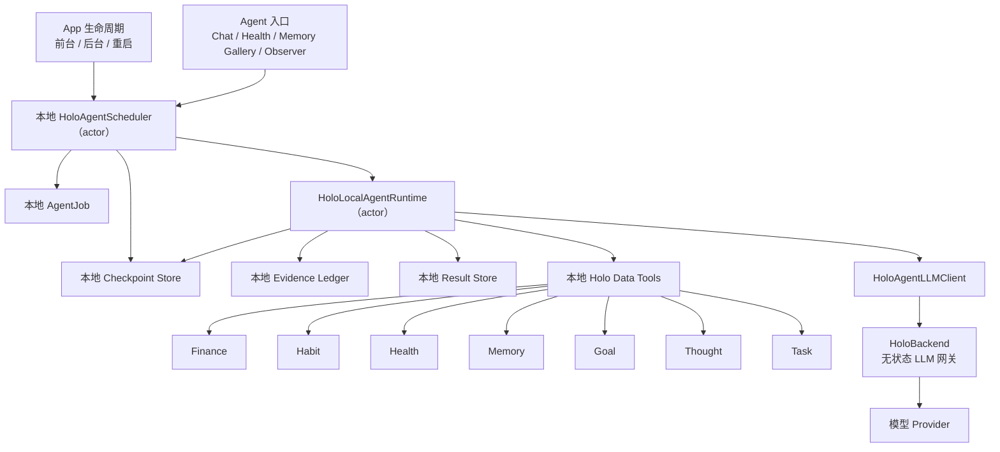
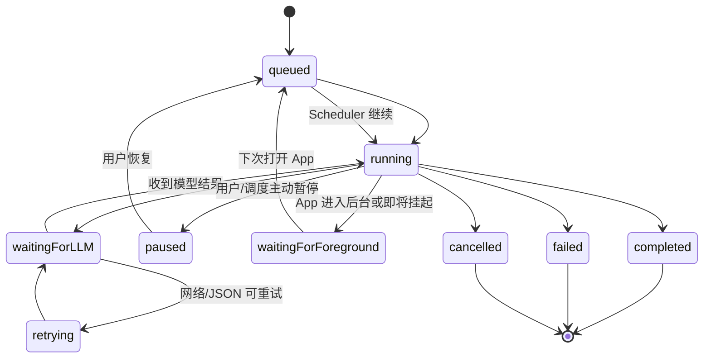

# Holo 全局可恢复 Agent 运行方案（R2）

> 日期：2026-06-27（R2 收束版）
> 范围：HoloAI 对话深度分析、健康洞察、记忆长廊、Observer 巡检、记忆策展、目标/任务/财务/习惯等所有需要多轮 Agent 推理的能力。
> 定位：可审查、可交付实施的全局架构方案。
> 核心结论：Holo 的所有 Agent 都应运行在同一套 **本地优先、可暂停、可恢复、短步推理、后端无状态** 的任务体系上。后端只处理单次 LLM 推理请求，不托管完整用户数据，也不等待整个 Agent 跑批完成。
>
> **现行实施说明（2026-07-19）**：本文件保留全局原理与接入公约；实施顺序、执行一致性、HealthKit 锁屏语义、step 幂等和 iOS 26 后台能力以 [Holo Agent 全场景稳定执行实施方案](./2026-07-19-Holo-Agent全场景稳定执行实施方案.md) 为准。该方案已取代本文件“后台只能机会性推进”的绝对结论。
>
> **R2 相对 R1 的收束**：内化两轮对抗审查结论，删除审查附录。关键修正三点——① 补 Phase 0（灰度开关矩阵与放量）；② Phase 1 的第一职责明确为「Scheduler 接管所有运行 Task 并真正重启未完成 job 的 runLoop」，修正 R1 隐含的「现有基础已可恢复」失真（现状 `resume` 只标记状态不重启推理，App 重启后未完成 job 会晾死）；③ Phase 3 把 wallTime 超时与旧 checkpoint 兼容纳入。其余架构思想与 ADR 不变。

---

## 1. 背景与问题

Holo 的 Agent 已经具备多轮调用能力：模型可以先判断需要查什么数据，再调用本地工具读取健康、记账、习惯、想法、目标、任务和记忆等证据，随后继续推理，直到形成带证据的结论。

这条路线符合 Holo 的产品方向：AI 不是凭空聊天，而是围绕用户真实生活数据做观察。但它天然带来一个移动端问题：

- 多轮 Agent 可能需要 30 秒、90 秒，甚至更久。
- 用户不一定愿意一直停留在当前页面。
- 手机可能自动熄屏、切后台、系统挂起 App。
- Holo 的设计原则是不把用户完整生活数据库放到后端。

所以全局架构不能建立在"用户必须一直等到 Agent 完成"这个假设上，也不能退回"把所有数据同步到后端，由后端常驻 Agent 跑完"的路线。

本方案要解决的是：

```text
在不把完整用户数据放到后端的前提下，让所有 Holo Agent 都能中断、恢复、继续、完成，并且用户体验不崩。
```

---

## 2. 设计原则

### 2.1 本地是任务所有者

每一个 Agent 任务都必须由 App 本地创建、保存和恢复。任务进度、checkpoint、工具结果、证据 ID、最终结果都以本地为准。后端不拥有一个"正在跑的完整任务"，后端只知道一次请求需要它完成一轮模型推理。

### 2.2 后端是短生命周期 LLM 网关

后端职责收敛为：转发模型请求；管理模型、Prompt、限流、日志和结构化校验；对 `agent_loop` 这类 purpose 做 JSON 协议验证；设置单次请求超时、取消和错误返回。

后端不承担：保存完整用户生活数据库；保存完整 Agent job 状态；等待 App 下次上线后继续同一个 job；在用户离开 App 后独立把整个 Agent 跑完。

### 2.3 后台能力分系统分层，不承诺无限执行

iOS 后台能力仍由系统调度，不能被设计成无限常驻计算环境。Holo 按系统版本分层：

- iOS 26+ `BGContinuedProcessingTask`：只用于用户明确发起、可衡量进度的 Agent；系统接纳后可在回桌面、切其他 App 或锁屏后继续，系统中止则回落到断点恢复。
- `beginBackgroundTask`：App 退后台时争取一小段时间保存 checkpoint 或收尾当前安全点。
- `BGAppRefreshTask` / `BGProcessingTask`：系统愿意唤醒时做轻量恢复检查或推进一小步。
- background `URLSession`：只用于系统可接管的上传/下载类请求。
- Live Activity / 本地通知：展示进度或完成提醒，不负责执行计算。

产品承诺必须是「支持的系统会尽量继续；系统暂停或终止时保留安全断点，下次打开继续」，而不是「锁屏后一定实时跑完」。iOS 17–25 仍只承诺短时后台收尾与可靠恢复。

### 2.4 所有 Agent 共享一套运行公约

不管入口来自哪里，都不能各自实现一套异步逻辑。以下能力都应接入同一个 `AgentJob → Runtime → Checkpoint → Result` 体系：对话里的深度分析；健康页的 LLM 洞察；记忆长廊的深度整理；Observer 异常跟进；记忆策展与长期记忆候选生成；未来目标/任务/财务/习惯的跨模块生活分析。

---

## 3. 推荐架构



R2 相对 R1 的关键修正：入口与生命周期**先经过 Scheduler**，再触达 Runtime。Scheduler 是「恢复链真正闭合」的关键一层（见 §5、Phase 1）。

这套架构把 Agent 拆成两种东西：

| 层级 | 所属 | 说明 |
| --- | --- | --- |
| Agent Job | iOS 本地 | 任务身份、状态、预算、进度、结果归属 |
| Agent Step | iOS 本地 | 可恢复的最小推进单元 |
| Tool Execution | iOS 本地 | 读取本机真实数据，生成 evidence |
| Checkpoint | iOS 本地 | 断点恢复依据 |
| Result | iOS 本地 | 最终可展示结果 |
| LLM Step Request | 后端短请求 | 单轮模型推理，不代表完整任务 |
| Prompt / Provider / Rate Limit | 后端 | 统一治理模型行为和成本 |

---

## 4. Agent Job 全局模型

现有工程已具备 `HoloAgentJob`、`HoloAgentCheckpoint`、`HoloLocalAgentRuntime`、`HoloBackgroundContinuationManager` 等基础。全局方案不推翻这套结构，而是把它提升为所有 Agent 必须遵守的契约。

### 4.1 Job 类型与触发

现状 `HoloAgentJobType` 有 5 个 case（`HoloAgentJobModels.swift:10`），`HoloAgentTrigger` 有 4 个（`:18`）。R2 扩展为按入口区分：

```swift
enum HoloAgentJobType: String, Codable, CaseIterable, Sendable {
    case chatDeepAnalysis
    case healthInsight
    case memoryGallerySummary
    case observerInspection
    case memoryCuration
    case goalTaskReview
    case financeHabitReview
    case debugMock
}
```

迁移注意（Phase 1/3 处理）：
- 现有 `deepAnalysis` 是已持久化进本地 JSON store 的生产枚举值。`chatDeepAnalysis` 的 rawValue 必须保留 `"deepAnalysis"` 或在 Codable 解码层做兼容映射，否则旧 checkpoint 反序列化失败。
- `HoloAgentTrigger` 需同步扩展（健康洞察、财务/习惯复盘等新入口的 trigger），或在方案中明确"新入口复用 `userQuestion`、trigger 不再细化"。Job 结构里 trigger 是必填字段（`:56`），不可遗漏。

不同入口可以共享 runtime，但需要不同预算、展示策略和结果落点。

### 4.2 Job 状态

全局状态机（现状已有 9 个 state，`:25-35`，含 `paused`）。R2 状态机明确纳入 `paused`：



硬规则：
- `completed / failed / cancelled` 是终态，不自动复活。
- `waitingForForeground` 表示本地可恢复，不表示后端仍在等。
- `waitingForLLM` 只对应一次正在进行的后端短请求。
- App 恢复时不直接把所有任务设为 `running`，而是交给 Scheduler 根据预算、优先级和网络状态逐个推进（见 §5、Phase 1）。

### 4.3 Checkpoint 内容

现状 `HoloAgentCheckpoint` 已具备恢复所需的绝大部分字段（`HoloAgentCheckpointModels.swift:27`）：`jobID / step / completedSteps / conversationState / pendingToolRequests / completedToolResults / patternSignals / evidenceRecordIDs / validatedClaimIDs / memoryCandidateIDs / retryCountByStep`。

R2 在 Phase 3 补齐三个字段：
- `inputSnapshotHash`：恢复时若本地关键输入（用户问题、时间范围、选定模块）已变化，Agent 需判断"继续旧分析还是重新规划"。粒度按 **job 输入整体**，不按工具结果——避免频繁误判重规划。
- `schemaVersion`：支持旧 checkpoint 的向前兼容迁移。
- step 级幂等 key：配合后端 `runId + stepId`（Phase 4），防止恢复后重复请求导致重复 token 成本。

---

## 5. 本地 Scheduler：让恢复链闭合的关键一层

> 这是 R2 相对 R1 最重要的修正。R1 把 Scheduler 描述为"补一层优先级调度"；代码实证表明，**现状的恢复链是断的，Scheduler 的第一职责是让恢复真正重启推理，其次才是优先级与去重。**

### 5.1 现状断点（必须先认知）

现状恢复路径（已核实，非推断）：

1. `HoloBackgroundContinuationManager.appWillEnterForeground` → `runtime.resumeUnfinishedJobs()`（`HoloBackgroundContinuationManager.swift:35-39`）。
2. `resumeUnfinishedJobs` 遍历非终态、非 running 的 job，逐个调 `resume`（`HoloLocalAgentRuntime.swift:300-309`）。
3. `resume` 只做"对齐 currentStep/checkpoint + 设 `state = .running` + upsert"，**不调用 runLoop**（`:124-140`）。
4. `runAnalysis` 永远 `startAnalysisJob` 新建，从不续跑（`HoloAgentAnalysisService.swift:34`）；且其唯一触发点是用户发消息（`ChatViewModel.swift:288`），`scenePhase .active` 回前台**不触发**（`HoloApp.swift:102`）。

后果（孤儿成因）：App 进程被系统终止后重启 → 回前台 → `resume` 把未完成 job 标成 running 但**无人重新 runLoop** → 又因 `resumeUnfinishedJobs` 的 `where state != .running` 条件，该 job 此后每次回前台都被排除 → **永久晾死**。

边界（须讲准）：仅 **App 进程被终止后重启** 时晾死；若仅切后台未被杀，原 runLoop Task 仍存活（`pauseForBackground` 未取消它），会自行跑完。

### 5.2 Scheduler 职责

`HoloAgentScheduler` 是 **actor**（非 MainActor，避免把 LLM 推进绑死主线程，违反"用户当前操作优先"）。职责按优先级：

1. **重启未完成 job 的推理（第一职责，Phase 1）**：恢复时不仅标记状态，更要对未完成 job 重新触发 `runLoop`。`resumeUnfinishedJobs` 的语义改为"标记可恢复 + 交由 Scheduler 拉起 runLoop"，而非现状的"标记 running 即返回"。
2. **接管所有运行 Task**：持有运行中的 Task 池，提供取消、超时、并发上限。
3. **优先级调度**：前台用户请求优先于后台观察任务。
4. **去重**：防止多个入口重复启动同类任务（降低重复 token 成本）。
5. **回前台限量恢复**：App 回前台只恢复有限高优任务，避免批量恢复拖慢首屏。
6. **取消在途 Task 的 state 一致性**：`pauseForBackground` 之后若在途 runLoop Task 仍在后台窗口内写回，需 state CAS 校验，避免状态漂移（现状 actor 串行化已兜住大部分，但多设备/多入口并发仍建议显式校验）。

### 5.3 优先级

| 优先级 | 任务 | 策略 |
| --- | --- | --- |
| P0 | 用户当前正在等待的对话深度分析 | 前台立即跑，可展示进度 |
| P1 | 用户主动刷新的健康/记忆洞察 | 前台跑，离开后可恢复 |
| P2 | 已开始但未完成的任务 | 下次打开自动续跑（Phase 1 修复的"续跑"真正含义） |
| P3 | Observer 触发的异常跟进 | 低预算、可延后 |
| P4 | 记忆策展、预整理、周期报告 | 只在空闲或后台机会窗口跑 |

产品上，这意味着 Holo 不会在用户刚打开 App 时同时恢复十个旧任务。它会优先恢复用户最可能关心的那个，并且**真的把它跑完**。

---

## 6. 后端职责与风险边界

### 6.1 后端不持有完整任务

正确链路：

```text
App 本地恢复 job
  -> Scheduler 拉起 runLoop
  -> 组装下一轮 messages
  -> 请求后端 agent_loop
  -> 后端调用模型
  -> 后端返回本轮 JSON
  -> App 本地执行工具 / 写 checkpoint
  -> App 决定是否进入下一轮
```

如果用户锁屏发生在一次模型请求中间，后端可能短时间内继续处理这一次请求。这是"孤儿单步请求"，不是"后端托管完整 Agent"。

### 6.2 后端需补的保护（Phase 4）

| 能力 | 现状 | Phase 4 目标 |
| --- | --- | --- |
| `runId + stepId` | 缺失 | 标识一次本地 job 的某一轮模型请求 |
| 幂等窗口 | 缺失 | 同 `runId + stepId` 重试避免重复计费/日志污染 |
| 单次请求超时 | **provider 层已有**（`openAICompatibleProvider.js:53`，stream 120s / 非 stream 60s） | 补 agent_loop purpose 级独立配置 |
| 客户端断连处理 | 缺失（无 `req.on('close')` 监听） | 尽量 abort provider，停止继续等待 |
| 日志脱敏 | 缺失 | 不记录完整敏感上下文，对 agent_loop 日志单独降采样 |
| usage 归因 | 部分有 | 归因到设备、purpose、runId，而非保存业务数据 |

> 修正 R1 表述：后端 provider 层**已具备**单步超时（AbortController），Phase 4 补的是 purpose 级配置、断连取消、runId 归因与日志脱敏，不是"从零补超时"。

注意：若后端增加 `runId + stepId` 的短期幂等缓存，它保存的是技术元数据或短期响应缓存，不是完整用户生活数据库。缓存应有 TTL，不能成为长期任务队列。

### 6.3 后端不应做的事

后端不应新增：长期 `agent_jobs` 表保存用户任务全文；服务端工具执行器读取用户业务数据；用户完整健康/记账/习惯/想法镜像库；"App 离线后服务端继续跑完整 Agent"能力。

---

## 7. iOS 后台策略

### 7.1 前台是主执行场

所有重型 Agent 的主要执行场景仍然是前台。前台可稳定完成多轮模型请求、本地工具执行、checkpoint 保存、结果渲染、用户取消或继续。

### 7.2 退后台时只做安全收尾

App 进入后台：申请 `beginBackgroundTask`；把 `running / waitingForLLM / retrying` 标记为可恢复状态；写入最新 checkpoint；若正处于本地工具执行后、LLM 请求前，停止进入下一轮；若正处于 LLM 请求中，等待短时间，超过安全窗口则允许本地标记为待恢复。

核心目标不是"继续跑完"，而是"不要丢断点"。Phase 1 补充：对在途 runLoop Task 做取消或 state CAS，防止其后台窗口内写回覆盖 `waitingForForeground`。

### 7.3 BGTask 只能做机会性推进

`BGAppRefreshTask` / `BGProcessingTask` 可用于：检查是否有未完成 P2/P3/P4 任务；推进一个小 step；整理过期 job；生成低成本预摘要。

> 复用提示：现状 `Services/AI/MemoryInsightBackgroundService.swift:28-46` 已为 memory insight 注册了 BGAppRefreshTask 并封装 submit/cancel。Phase 2 接 BGTask 直接复用此注册模式，不另起一套。

不能用于：承诺某个用户问题一定在锁屏后完成；长时间多轮 LLM 跑批；对用户展示"后台实时分析中"的确定承诺。

### 7.4 回前台时自动续跑（Phase 1 修复其语义）

App 回到前台：Scheduler 扫描未完成 job → 过滤终态和过期任务 → 校验 checkpoint 和 evidence 完整性 → 对比 `inputSnapshotHash` → 根据优先级恢复 1 个或少量任务 → **重新触发 runLoop（而非仅标记 running）** → UI 展示"继续整理中"或"已整理完成"。

---

## 8. 用户体验公约

全局 Agent 体验要从"等待一个请求"改成"委托一个整理任务"。

### 8.1 页面文案

推荐表达：「我会继续整理，完成后放在这里。」「这次分析需要多看几类线索，你可以先离开。」「上次整理中断了，我正在接着看。」「已根据目前证据整理出初步观察。」

避免表达：「后台实时分析中。」「锁屏后会继续跑完。」「正在云端排队分析你的全部数据。」

### 8.2 结果交付

| 入口 | 结果落点 |
| --- | --- |
| Chat 深度分析 | 当前对话 + 可选保存到记忆 |
| 健康洞察 | 健康页洞察卡片 + 对话可引用 |
| 记忆长廊 | 记忆长廊 Agent 结果卡 |
| Observer | 低打扰提醒 / 状态卡片 / 待用户确认 |
| 记忆策展 | 长期记忆候选池，不自动强写 |

### 8.3 任务可见性

各入口局部展示进行中状态；设置/调试页提供 Agent 任务全集列表（不做独立任务中心，避免过度设计）；失败可重试；用户可取消；成本较高的"继续深挖"需用户明确触发。

---

## 9. 安全、隐私与成本风险

### 9.1 孤儿单步请求

风险：App 断开后，后端或模型 provider 还在生成，结果没人接收。缓解：单步请求超时；客户端断连时尝试 abort；`runId + stepId` 记录 usage；App 恢复时允许重试同 step。

### 9.2 重复执行

风险：App 不知上一次 LLM step 是否完成，恢复后重复请求导致重复 token 成本。缓解：step 级幂等 key；本地 checkpoint 在每次工具结果和模型结果后立刻保存；后端保留短 TTL 响应摘要或 request fingerprint（Phase 4）。

### 9.3 数据变化导致结论过时

风险：Agent 开始时的数据和恢复时的数据不同。缓解：checkpoint 记录 `inputSnapshotHash`（Phase 3）；恢复时发现关键数据变化，改为重新规划或提示"数据已更新，正在重新整理"。

### 9.4 后端日志隐私

风险：agent_loop messages 里包含工具摘要、证据摘录或用户原话。缓解：agent_loop 日志**只存 runId/stepId/状态/usage/错误码和消息角色/长度**，不存 reasoning 摘要、完整 messages、requestHash、模型响应与工具结果原文；管理后台日志设置保留期和访问权限（Phase 4/7）。

### 9.5 启动恢复造成卡顿

风险：App 一打开就恢复重型任务，拖慢首屏。缓解：首屏渲染后再恢复；Scheduler 每次只恢复一个高优任务；P3/P4 延后到空闲；用户当前操作优先。

### 9.6 成本与体积边界（R2 新增）

- **轮数封顶兜住成本**：现状 `maxLLMRounds` 封顶 5（`HoloAgentJobModels.swift:98/110`），单 job token 成本有上界。`maxWallTimeSeconds` 当前**不生效**（runLoop 只按轮数循环，`HoloLocalAgentRuntime.swift:192`），真实危害是"单次慢 LLM 调用无法超时退出"而非成本爆炸。Phase 3 让 wallTime 真正参与中断判定（且可注入测试时间）。
- **prompt O(N²) 未来风险**：`runLoop` 每轮把全部 completedToolResults 重编码 append（`:250-254`），PromptBuilder 又把全部 conversationState 塞进每次请求（`:202-208`）。当前轮数封顶 5 故可控；若未来为复杂任务提升轮数上限，需引入 conversationState 压缩/滑窗。
- **本地数据无清理**：evidence/checkpoint 无上限 append，历史 job 累积后 `jobStore.load()`（`resumeUnfinishedJobs` 与 `pauseForBackground` 均全量调用）会随历史线性变慢。需补终态 job 保留期与定期清理（建议作为 Phase 1/2 的小项）。
- **不跨设备**：Agent job/checkpoint/evidence/result 全部纯本地 JSON，不进 CloudKit。与 ADR-1 一致，但"手机委托整理、iPad 看结果"这类跨设备诉求现状与方案均不支持，属产品意图待定项。

---

## 10. 全局接入规则

以后新增任何 Agent 能力，都必须回答这 10 个问题：

1. 这个能力的 `HoloAgentJobType` 是什么？
2. 它的触发入口是什么？
3. 它的结果落在哪里？
4. 它使用哪一档预算？
5. 它是否允许后台机会性推进？
6. 它需要哪些本地工具？
7. 它的 evidence 是否可被其他模块复用？
8. 它中断后恢复时，是否需要重新校验数据快照？
9. 它失败时给用户什么保守结果？（现状 runLoop 轮数耗尽已全局生成 fallbackClaims，`HoloLocalAgentRuntime.swift:266-274`，已"全局启用保守结论"；关注点是保守结论质量与是否按入口分级，而非要不要启用。）
10. 它是否需要用户确认后才写入长期记忆或改变本地数据？

绕过这些问题直接在页面里发起多轮 LLM 请求，会重新制造"锁屏断链、无法恢复、结果丢失、成本失控"的问题。

---

## 11. 与现有代码的关系

现有基础（全部经代码核实）：

| 文件 | 现状 | R2 增量 |
| --- | --- | --- |
| `Models/AI/Agent/HoloAgentJobModels.swift` | JobType 5 个 / Trigger 4 个 / State 9 个（含 paused）/ Budget 3 档预设 | Phase 1 扩 JobType+Trigger；Phase 3 修 wallTime 生效 |
| `Models/AI/Agent/HoloAgentCheckpointModels.swift` | 11 字段齐备 | Phase 3 加 inputSnapshotHash / schemaVersion / step 幂等 key |
| `Services/AI/Agent/HoloLocalAgentRuntime.swift` | actor；runLoop / pause / resume | **Phase 1 修 resume 不重启 runLoop 的断点** |
| `Services/AI/Agent/HoloAgentRuntimeShared.swift` | shared runtime，已注册 7 类工具 | 不变 |
| `Services/AI/Agent/HoloBackgroundContinuationManager.swift` | 进后台 pause / 回前台 resumeUnfinishedJobs | Phase 1 改走 Scheduler 真正续跑 |
| `Services/AI/Agent/HoloAgentAnalysisService.swift` | Chat 深度分析入口，调 runLoop | Phase 2 经 Scheduler 创建/触发 |
| `Services/AI/MemoryInsightBackgroundService.swift` | 已注册 BGAppRefreshTask（memory insight） | Phase 2 复用其注册模式 |
| `Services/AI/Agent/Persistence/HoloAgentJSONStore.swift` | actor + atomic + 损坏 backup + 原子读改写 | 存储可靠性无忧；Phase 1/2 补清理 |
| `HoloBackend/src/app.js` | agent_loop purpose 网关 + JSON 校验 | Phase 4 补 runId/stepId/脱敏/断连 |

已接入 Runtime 的入口：Chat（`ChatViewModel.swift:41` → `HoloAgentAnalysisService`）、Observer（`HoloMemoryObserverService.swift:140`）、MemoryGallery（`MemoryGalleryViewModel.swift:981`）。Health 尚未接入，Phase 2 补。

关键事实：整套体系当前被 `HoloAIFeatureFlags.agentRuntimeEnabled` 门控、**默认关闭**（`HoloAICapability.swift:134`，`AISettingsView.swift:430` 仅设置页 Toggle）。这是 Phase 0 要解决的前置。

---

## 12. 分阶段路线（R2 主线）

### Phase 0：灰度开关矩阵与放量策略

目标：把"可恢复体系是否对普通用户生效"这个前置决策显式化，不与架构 Phase 混在一起。

- 盘点哪些能力被 `agentRuntimeEnabled` 门控（前后台续跑 `HoloApp.swift:98`、Chat 深度分析、MemoryGallery 等），形成开关矩阵。
- 定义放量阶梯：默认关 → 内部全开 → 按比例放量 → 默认开；每档的观测指标（成功率、恢复续跑率、成本、卡顿）。
- 明确回前台自动续跑**不单独设用户开关**，随主开关一并生效（避免增加用户认知负担）。

### Phase 1：Scheduler 接管所有运行 Task，并真正重启未完成 job 的 runLoop

目标：闭合现状断裂的恢复链。这是整套可恢复承诺的根基。

- 新增 `HoloAgentScheduler`（actor），接管所有 Agent 运行 Task（持有 Task 池、并发上限、取消、超时）。
- 修复 N1 断点：恢复路径在标记可恢复后，由 Scheduler 对未完成 job 重新触发 `runLoop`，而非现状 `resume` 标记 running 即返回。
- `resumeUnfinishedJobs` 改为"标记可恢复 + 交 Scheduler 拉起"，消除"running 后被永久排除"的晾死路径。
- 加入优先级（P0–P4）与同类去重。
- 回前台限量恢复，避免批量恢复拖慢首屏。
- `pauseForBackground` 对在途 runLoop Task 做取消或 state CAS。
- 补终态 job 保留期与定期清理（缓解 §9.6 体积增长）。

### Phase 2：迁移 Chat / Observer / MemoryGallery / Health 的入口边界

目标：所有入口经 Scheduler 创建与触发，统一 job type / trigger / budget / result destination。

- Chat / Observer / MemoryGallery 由现状"各自直接调 runtime / AnalysisService"改为经 Scheduler。
- 新增 Health 入口（`healthInsight` job type），结果落健康页洞察卡片 + 对话可引用。
- 复用 `MemoryInsightBackgroundService` 的 BGTask 注册模式接入机会性推进（仅 P4）。

### Phase 3：checkpoint schema、inputSnapshotHash、wallTime 超时、旧 checkpoint 兼容

目标：让中断恢复可审计、可验证、可回滚。

- checkpoint 增加 `schemaVersion`、`inputSnapshotHash`（job 输入整体粒度）、step 级幂等 key。
- 让 `maxWallTimeSeconds` 真正参与 runLoop 中断判定，且可注入测试时间（解决现状注释点名的测试性缺陷）。
- 旧 checkpoint 向前兼容：`schemaVersion` 迁移 + `deepAnalysis → chatDeepAnalysis` 的 rawValue/解码兼容，避免旧数据反序列化失败。
- 恢复时校验 evidence 完整性。

### Phase 4：后端 runId/stepId、日志脱敏、断连处理

目标：降低孤儿请求、重复请求、日志隐私和成本风险。

- `agent_loop` 请求接受 `runId / stepId`，usage 归因到 runId。
- 客户端断连 abort provider（补 `req.on('close')` 监听）。
- agent_loop 日志只存元数据 + reasoning 摘要，不存完整 messages / 工具结果原文。
- 配置 agent_loop purpose 级独立超时（provider 层已有 120s/60s，此处补 purpose 级配置）。

---

## 13. 关键决策（ADR）

### ADR-1：Agent 编排在 iOS 本地，后端只做无状态 LLM step

决策：所有 Holo Agent 的任务状态、工具执行、证据和结果都归本地所有。后端只处理单轮模型推理。

原因：符合 Holo 不上传完整用户数据库的产品原则；能复用现有 Core Data / HealthKit / 本地工具；降低后端隐私和同步复杂度。

代价：无法承诺 App 离线后完整跑完；需要做本地 checkpoint 和恢复；需要处理孤儿单步请求。

### ADR-2：iOS 后台能力按版本分层，可靠恢复始终兜底

决策：iOS 26 用户主动 Agent 可申请 Continued Processing；iOS 17–25、自动 Agent 和系统不接纳场景仍使用短时收尾/机会性推进。所有版本都以持久化断点和恢复链作为可靠性底座。

原因：Continued Processing 为用户主动长任务提供了系统认可的执行窗口，但仍可能被系统结束；AI 分析也不属于音频、导航、蓝牙等常驻后台场景。分层承诺既利用新系统能力，也避免误导用户。

代价：用户锁屏后不一定马上得到结果；需要把体验设计成"下次打开继续"。

### ADR-3：新增 Scheduler（actor），且第一职责是重启未完成 job 的 runLoop

决策：所有 Agent 入口必须通过统一 Scheduler 创建、恢复、取消和去重；Scheduler 为 actor（非 MainActor）；恢复时必须重新触发 runLoop。

原因：现状恢复链断裂（`resume` 不重启推理），不修则"可恢复"承诺落空；统一入口防止各页面各自启动任务，降低重复 token 成本；actor 串行化任务队列且不阻塞主线程。

代价：需要新增一层调度抽象；Phase 1 需迁移现有入口并修复 runLoop 重启。

---

## 14. 验收与移交

- Phase 1 验收的硬指标：App 在 Agent 运行中被系统杀掉后重启，未完成 job 能被 Scheduler 重新拉起 runLoop 并最终到达终态（completed/failed/cancelled），不再出现"标记 running 后晾死"。
- 各 Phase 的接入均需回答 §10 的 10 个问题。
- 后端改动（Phase 4）需重新部署并验证（`curl /v1/prompts/agent_loop` 等）。

**R2 状态**：方向与主线已收束，两轮对抗审查的有效结论已内化进 Phase 0–4 与各章节。本版可进入最终审查（GLM 终审）。

---

## 15. 一句话总结

Holo 的 Agent 不应该是一次必须盯着等完的网络请求，也不应该变成后端托管的用户数据跑批。它应该是一个本地拥有、可暂停、可恢复、能逐步产出证据和结果的生活分析任务：

```text
本地保存任务与证据
  -> 后端只跑单步模型推理
  -> 中断时保存 checkpoint
  -> 下次打开由 Scheduler 真正继续 runLoop（而非仅标记状态）
  -> 所有 Agent 入口共享同一套运行公约
```
