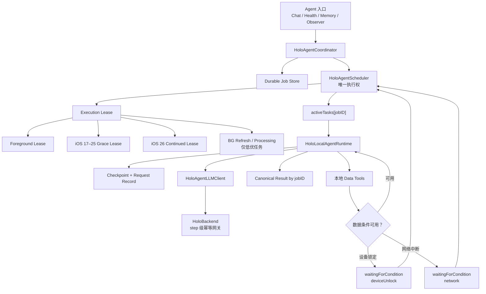

# Holo Agent 全场景稳定执行实施方案

> 日期：2026-07-19
>
> 状态：Phase 0–7 工程交付完成度 100%，生产协议验证已完成；待东林执行 iOS 26/iOS 17–18 真机与 TestFlight 验收
>
> 适用版本：iOS 17+；iOS 26+ 增加持续后台执行能力
>
> 基础方案：[2026-06-27-Holo全局可恢复Agent运行方案.md](./2026-06-27-Holo全局可恢复Agent运行方案.md)
>
> 定位：本方案保留旧 R2 的“本地 Job / Checkpoint / Tool / Result + 后端短生命周期 LLM 网关”原则，但**取代其 Phase 1–4 实施顺序与后台能力结论**。实施必须先修复执行一致性、持久化和锁屏数据语义，再接入 iOS 26 `BGContinuedProcessingTask`。

---

## 一、实施结论

本轮实施不把“后台 API 能启动”当成完成，而是交付三层产品能力：

| 能力层级 | 覆盖系统 | 对用户的真实承诺 | 本轮是否交付 |
|---|---|---|---|
| L1：可靠恢复 | iOS 17+ | 离开页面、切后台、系统终止后，任务状态不丢；回到 App 后从安全断点继续，不重复产出 | 是，P0 主线 |
| L2：持续执行 | iOS 26+ | 用户主动发起的 Agent 在回桌面、切其他 App 或锁屏后可继续执行；系统中止时仍回落到 L1 | 是，P0 完成后接入 |
| L3：离线托管 | iOS 17+ | App 被用户强制关闭后，服务端仍可独立完成已经冻结证据的推理 | 否，作为独立产品决策保留 |

本轮最终用户体验：

```text
用户发起深度分析
  → Holo 持久化任务与初始断点
  → Scheduler 获取唯一执行权
  → 前台执行
  → iOS 26：转入系统持续处理租约
  → iOS 17–25：短时后台收尾，随后可靠暂停
  → 条件恢复后从同一 job 继续
  → 一个 job 只生成一个最终结果
```

### 1.1 实施审查结论（2026-07-19）

| 阶段 | 代码 | 自动化 | 仍需人工/运营完成 |
|---|---|---|---|
| Phase 0–3：一致性、持久化、预算、健康锁屏语义 | 已完成 | 已完成 | 真机 HealthKit 锁屏/解锁 |
| Phase 4：step 级幂等 | iOS + 后端已完成并部署，响应 AES-256-GCM 加密落盘 | 自动化、密文迁移/轮换与生产重复请求均通过 | 无工程缺口；随真机矩阵做端到端复验 |
| Phase 5：统一 execution lease 与旧系统 fallback | 已完成 | 已完成 | iOS 17/18 真机 fallback |
| Phase 6：iOS 26 Continued Processing | 已完成 | fake 调度与状态回归已完成 | iOS 26 真机系统接纳、系统 UI、锁屏、停止/expiration |
| Phase 7：可观测性、隐私导出与说明 | 已完成 | 事件/脱敏导出测试已完成 | TestFlight 分档灰度和指标观察 |

结论：Phase 7 此前确实尚未实施；现在工程侧已补齐，Phase 4 后端也已完成生产幂等、AES-256-GCM 响应加密与发布强校验。剩余项目不是继续补业务代码，而是真机系统行为和灰度数据两道发布门。Optional Phase 8 是明确延后建设的 L3 服务端 Agent，不属于“漏做”。

### 1.2 Go / No-Go 边界

- **Go**：先实施 Phase 0–3，修复稳定 Hash、唯一执行权、持久化、预算和锁屏数据语义。
- **Conditional Go**：Phase 4 后端幂等完成并部署验证后，接 iOS 26 持续处理。
- **No-Go**：在 P0 阻断项未清零前，直接把现有 `runLoop` 放进 `BGContinuedProcessingTask`。
- **No-Go**：使用音频、定位、蓝牙等不匹配业务的后台模式维持常驻。
- **Deferred**：完整服务端 Agent、强杀后继续、多设备接力执行。

---

## 二、目标、非目标与非功能要求

### 2.1 功能目标

1. Chat、Health、Memory、Observer 等 Agent 共用同一份 Job、Scheduler、Checkpoint 和 Result 契约。
2. 同一 `jobID` 任意时刻最多存在一个有效执行者。
3. App 切页面、切后台、锁屏、系统终止、冷启动后，任务状态与 UI 一致。
4. iOS 26 用户主动任务可使用系统持续处理能力。
5. iOS 17–25 后台时间到期后进入可解释等待，不伪装成继续运行。
6. HealthKit 锁屏不可读时进入等待，不生成零值证据。
7. 网络重试、恢复重试不能重复模型计费或生成重复 Result。
8. 用户可以取消；系统取消、用户取消和条件等待不混为一谈。

### 2.2 非功能指标

| 类别 | 目标 |
|---|---|
| 状态真实性 | 没有有效 execution lease 时不得展示“正在运行” |
| 单执行者 | 同一 `jobID` 的有效 `runLoop` 数恒为 0 或 1 |
| 数据丢失 | 已持久化 checkpoint/evidence 的 RPO = 0 |
| 恢复延迟 | Store 就绪后，高优先级任务在 2 秒内进入“执行/等待原因明确”状态 |
| 结果幂等 | 每个 job 最多一个 canonical result |
| 请求幂等 | 同一 `runId + stepId + requestHash` 最多产生一次有效模型结果 |
| 健康正确性 | `DEVICE_LOCKED` 不得转换为 0、空样本或“无健康数据”结论 |
| 隐私 | 锁屏系统 UI 不出现用户问题原文、金额、健康指标或工具摘要 |
| 资源 | 前台/持续处理最多 1 个 P0 用户 Agent；P3/P4 不与 P0 抢占 |
| 可观测性 | 每次状态转换、租约、恢复、取消、幂等命中都有无敏感内容的结构化事件 |

### 2.3 非目标

- 不承诺 iOS 17–25 离开 App 后实时跑完整个 Agent。
- 不承诺用户从 App Switcher 强制关闭 Holo 后本地任务继续。
- 不把完整财务、健康、观点、记忆数据库同步给后端。
- 不把自动 Observer 接入 `BGContinuedProcessingTask`。
- 不在本轮建设独立任务中心、多设备同步或服务端完整工具执行器。
- 不把“模拟器 build 成功”当成后台与锁屏能力验收完成。

---

## 三、实施前基线与阻断项（现均已解决）

### 3.1 已有可复用基础

- `HoloAgentJob`、`HoloAgentCheckpoint`、`HoloAgentResult` 已落盘。
- `HoloLocalAgentRuntime` 已按 LLM 轮次和工具结果保存 checkpoint。
- `HoloAgentScheduler.resumeAndContinue` 已能重新触发 `runLoop`。
- `HoloBackgroundContinuationManager` 已区分快速回前台和后台时间到期。
- Chat 状态已从持久化 Job/Message 推导，并按当前 `jobID` 读取结果。
- `MemoryInsightBackgroundService` 已有 `BGAppRefreshTask` 注册范式。
- 后端 `agent_loop` 已识别 `runId/stepId` 日志字段，但 iOS 尚未发送，也尚未实现幂等。

### 3.2 P0 阻断项

| 编号 | 问题 | 当前后果 | 本方案处理 |
|---|---|---|---|
| P0-1 | `inputSnapshotHash` 使用 Swift `Hasher` | 进程重启后相同输入 Hash 变化，任务可能被误判为输入变化并跳过 | 改为 canonical payload + SHA-256 |
| P0-2 | Scheduler 没有 `activeTasks[jobID]` 和执行代次 | 后台旧 loop 与前台恢复 loop 可能并发写回 | Task 注册表 + execution generation + CAS |
| P0-3 | wall time 从创建时间连续计算 | 锁屏/暂停时间被算入运行预算，恢复后可能直接耗尽 | 累计 active runtime + 独立 absolute deadline |
| P0-4 | HealthKit 查询回调吞掉 error | 锁屏错误会伪装为 0 步、0 睡眠、空运动 | Agent 严格查询接口 + `DEVICE_LOCKED` 可恢复错误 |
| P0-5 | JSON Store 所有读取错误都返回 `[]` | 临时不可读或数据保护错误可能被当作空库并覆盖 | typed error；只有 file-not-found 才返回空集合 |
| P0-6 | Result 按随机 ID upsert | 崩溃恢复可能为同一 job 生成多个结果，并读回旧结果 | Result 按 `jobID` 唯一；启动一致性修复 |
| P0-7 | iOS 未发送 `runId/stepId` | API/LLM 双层重试可能重复调用模型 | 客户端 step identity + 后端短 TTL 幂等 |

### 3.3 P1 缺口

- `beginBackgroundTask` 绑定 App 场景，不绑定具体活跃 Job；Job 完成后不会立即释放租约。
- `resumeAndContinue` 使用 `try?` 吞掉恢复失败，且“Hash 不匹配”没有落到可解释状态。
- 状态仅表达 `waitingForForeground`，无法区分等待解锁、网络和系统容量。
- `waitingForLLM` 在网络请求前没有作为完整 request record 持久化。
- 最终 Result 与 Job 状态跨文件保存，不具备事务；需要启动修复器兜底。
- Agent 核心能力与 Observer Tier 2 自动深挖已收敛为产品默认开启，并由触发条件、并发预算和可观测指标控制风险。
- 现有测试把“新 Runtime 实例”当成“新进程”，没有发现随机 Hash 问题。

---

## 四、目标架构



### 4.1 核心不变量

1. **Job 是持久化事实**：UI、恢复与结果归属都从 Job/Checkpoint/Result 推导。
2. **Scheduler 是唯一执行权所有者**：页面、生命周期和 BGTask 不能直接调用 `runLoop`。
3. **Lease 只表示现在能否执行**：Lease 失效不等于 Job 失败。
4. **每个副作用可重放或幂等**：网络请求、工具执行和 Result 提交都必须有稳定 identity。
5. **等待原因一等公民**：设备锁定、网络断开、等待前台、系统容量不足不能显示成同一句“暂停”。
6. **过期处理不依赖临终写盘**：checkpoint 在正常推进中持续保存，expiration handler 只快速发取消信号。

### 4.2 控制面与数据面

| 层 | 内容 | 锁屏策略 |
|---|---|---|
| 控制面 | jobID、state、waitReason、generation、checkpointRevision、进度 | 允许在首次解锁后后台读取，保证状态恢复 |
| 数据面 | 用户问题、conversation、tool results、evidence | 最小化、明确文件保护；只让本轮必要数据参与后台执行 |
| 业务真相 | Core Data / HealthKit / Memory Repository | 不因 Agent 后台能力降低原始数据库保护级别 |

控制面与数据面的文件保护策略必须显式配置和真机验证，不能依赖默认值。锁屏可见的系统标题只能使用通用文案。

---

## 五、模型与持久化改造

### 5.1 稳定输入快照

新增稳定结构：

```swift
struct HoloAgentInputSnapshot: Codable, Sendable {
    let schemaVersion: Int
    let jobType: HoloAgentJobType
    let userQuestion: String?
    let timeRange: HoloAgentTimeRange?
    let referenceDate: Date
    let snapshotCutoffAt: Date
    let toolCatalogVersion: Int
}
```

Hash 规则：

1. 日期统一 ISO-8601 UTC。
2. JSON key 固定排序。
3. 可选值显式编码，不使用 Swift 运行时 Hash。
4. 使用 CryptoKit `SHA256` 输出十六进制字符串。
5. 单测写死一组 canonical payload 与预期摘要，防止未来编码漂移。

`inputSnapshotHash` 只验证任务输入身份。已经完成的工具结果继续从 checkpoint 冻结使用；未完成工具查询必须受 `snapshotCutoffAt` 约束，避免恢复后混入任意新数据。

### 5.2 Job 新字段

在保留旧 Codable 兼容的前提下新增：

```swift
var executionGeneration: Int?
var checkpointRevision: Int?
var waitReason: HoloAgentWaitReason?
var consumedActiveRuntime: TimeInterval?
var activeSegmentStartedAt: Date?
var absoluteDeadline: Date?
var lastResumeReason: HoloAgentResumeReason?
```

建议新增状态：

```swift
case waitingForCondition
case superseded
```

其中：

- `waitingForForeground`：后台执行机会耗尽，需要 App 活跃。
- `waitingForCondition`：App 可以运行，但外部条件不满足。
- `paused`：用户或产品明确暂停，不自动恢复。
- `superseded`：输入已变化，被新任务取代；终态。

`HoloAgentWaitReason` 至少覆盖：

```swift
case backgroundTimeExpired
case deviceUnlock
case protectedData
case network
case systemCapacity
case userPaused
case inputChanged
```

### 5.3 Checkpoint 与 LLM request record

Checkpoint 新增：

```swift
var revision: Int?
var executionGeneration: Int?
var pendingLLMRequest: HoloAgentLLMRequestRecord?
```

Request record：

```swift
struct HoloAgentLLMRequestRecord: Codable, Sendable {
    let runID: String          // jobID
    let stepID: String         // llm-<round>-<revision>
    let requestHash: String
    var status: Status         // prepared / completed / applied
    var responseHash: String?
}
```

调用顺序：

```text
生成 request record
  → 保存 prepared checkpoint
  → 请求后端
  → 保存 completed response identity
  → 应用模型输出/执行工具
  → 保存 applied checkpoint
```

如果 App 在任意位置终止，恢复后使用同一 `runID + stepID + requestHash`，由后端返回同一响应或安全重试。

### 5.4 Result 唯一性与一致性修复

- `HoloAgentResultStore.upsert` 改为按 `jobID` 唯一更新。
- 推荐 canonical result ID：`agent-result:<jobID>`。
- `forJob(jobID:)` 不再取“首个匹配”，而是依赖唯一约束。
- App 启动增加 `HoloAgentConsistencyReconciler`：
  - Result 存在、Job 非终态 → 补成 completed。
  - Job completed、Result 缺失 → 标记 needs-finalization 或失败，不展示伪完成。
  - Checkpoint 引用 evidence 缺失 → 等待修复或失败，不能继续生成无证据结论。
  - 同 job 历史多 Result → 选最新有效 revision，归档其余结果。

### 5.5 JSON Store 硬化

本轮先修现有 Store，不强制迁移数据库：

- `load()` 改为 `throws`。
- 只有文件不存在返回空数组。
- `NSFileReadNoPermissionError`、数据保护和 I/O 错误原样上抛。
- 解码失败生成只读隔离备份并阻止后续 `mutate` 覆盖。
- destination 不存在时走首次原子创建；存在时才 `replaceItemAt`。
- `mutate` 在 load 失败时不得执行 transform/save。
- 增加 file protection 属性验证测试。

当所有 Agent 入口稳定接入且 JSON 数据量增长后，再单独评估将控制面迁移到独立 SQLite/WAL；不让存储迁移阻塞本轮交付。

---

## 六、Scheduler 与执行租约

### 6.1 Scheduler 对外接口

推荐收敛成：

```swift
actor HoloAgentScheduler {
    func createAndRun(_ request: HoloAgentStartRequest) async throws -> HoloAgentJob
    func runOrAttach(jobID: String, reason: HoloAgentResumeReason) async throws -> HoloAgentJob
    func resumeEligibleJobs(trigger: HoloAgentResumeTrigger) async
    func cancel(jobID: String, source: HoloAgentCancellationSource) async
    func pause(jobID: String, reason: HoloAgentWaitReason) async
}
```

内部必须持有：

```swift
private var activeTasks: [String: Task<HoloAgentJob, Error>]
```

规则：

- `runOrAttach` 发现已有 Task 时等待/订阅已有任务，不创建第二份。
- 新执行必须先在 JobStore 原子递增 `executionGeneration`。
- `runLoop` 每次保存 checkpoint、evidence、result 前验证 generation。
- generation 过期抛 `staleExecution`，不得写回。
- Task 完成、失败、取消后统一从 `activeTasks` 清理。
- `resumeEligibleJobs` 不使用 `try?`；每个跳过与失败都写入可解释状态。
- P0 用户任务并发上限 1；P3/P4 在 P0 活跃时不启动。

### 6.2 Runtime 职责收缩

Runtime 只负责执行一个已获得 execution generation 的 job：

- 不自行决定是否可以恢复。
- 不直接管理 UIKit/BGTask 生命周期。
- 不从页面入口直接创建 Task。
- 接受 `generation` 与 cancellation。
- 在工具调用、LLM 调用、Result 提交等副作用边界检查 generation 与 cancellation。

### 6.3 Lease 协议

新增：

```swift
protocol HoloAgentExecutionLease: Sendable {
    var kind: HoloAgentExecutionLeaseKind { get }
    func report(_ progress: HoloAgentProgressSnapshot) async
    func finish(success: Bool) async
}
```

实现：

| Lease | 系统 | 用途 |
|---|---|---|
| ForegroundLease | iOS 17+ | App 活跃时正常执行 |
| LegacyBackgroundLease | iOS 17–25 / fallback | `beginBackgroundTask` 短时续跑和安全取消 |
| ContinuedProcessingLease | iOS 26+ | 用户主动 Agent 持续后台执行 |
| RefreshLease | iOS 17+ | P3/P4 机会性推进一个安全 step |

Lease 完成必须回调 Scheduler；Job 提前完成后立即释放，不等待 scene 回前台或系统 expiration。

### 6.4 expiration 语义

expiration handler 只做：

1. 原子设置 expired/cancel flag。
2. 取消对应 `activeTasks[jobID]`。
3. 尽快调用系统完成/释放接口。

它不承担完整 checkpoint 保存。正常 `runLoop` 必须在每个关键副作用前后已经落盘。若系统来不及写 `waitingForForeground`，冷启动把带旧 generation 的非终态 Job 当作 orphan 恢复。

---

## 七、锁屏、HealthKit 与数据保护

### 7.1 Agent 严格健康查询接口

不直接改变现有 UI 的 best-effort 读取语义，新增 Agent 专用严格接口，避免一次改动扩大到整个健康模块：

```swift
enum HoloHealthQueryOutcome<Value> {
    case value(Value)
    case noData
    case waitingForUnlock
    case unavailable(HoloHealthQueryError)
}
```

严格接口必须读取 HealthKit callback 的 error：

- `HKError.errorDatabaseInaccessible` → `.waitingForUnlock`
- 权限拒绝 → `.unavailable(.authorizationDenied)`
- 查询成功但无样本 → `.noData`
- 网络/系统暂时错误 → 可恢复错误
- 真实零值 → `value(0)`，并附覆盖信息

`HoloDefaultHealthDataSource` 和 `HoloHealthTool` 使用严格接口；禁止把 error 转为空数组。

### 7.2 等待解锁与恢复

- 工具返回 `DEVICE_LOCKED` 时，Runtime 保存 checkpoint。
- Job 进入 `waitingForCondition + deviceUnlock`。
- UI 显示“设备锁定，解锁后继续读取健康数据”，不显示失败。
- `UIApplication.protectedDataDidBecomeAvailableNotification` 或回到 active 后由 Scheduler 重新评估。
- 已完成的工具结果不重复查询。

### 7.3 证据快照

- 创建 Job 时冻结 `referenceDate/snapshotCutoffAt`。
- 确定性可判断的数据域可以先执行 prerequisite tool。
- HealthKit 无法在锁屏前完成时允许等待解锁，不为了“后台完成率”制造伪快照。
- 发送后端的证据只包含本轮必要聚合和样例，不包含完整数据库。
- 锁屏持续推理使用已持久化的最小证据快照，不重新读取 HealthKit。

### 7.4 文件保护与锁屏隐私

- 明确配置 Agent control store 的 file protection；真机验证首次解锁后锁屏可读。
- 敏感证据存储采用最小化 + 明确保护策略，不降低原业务数据库保护等级。
- Live Activity 标题固定为“正在完成 Holo 深度分析”。
- 副标题只显示通用阶段，例如“正在整理证据”或“第 2 轮分析”。
- 不显示用户问题、健康指标、金额、商户、观点或记忆摘要。

---

## 八、后端 step 级幂等

### 8.1 iOS 请求协议

扩展 `HoloBackendChatCompletionRequest`：

```json
{
  "purpose": "agent_loop",
  "runId": "<jobID>",
  "stepId": "llm-2-7",
  "requestHash": "<sha256>",
  "messages": [],
  "stream": false
}
```

只有 `agent_loop` 强制要求三字段；其他 purpose 保持兼容。

### 8.2 后端行为

同一个 `runId + stepId`：

- 首次请求：创建 processing 记录并调用 provider。
- 相同 `requestHash` 重试：
  - processing → 返回明确 `STEP_IN_PROGRESS`，客户端退避；
  - completed → 返回缓存的同一结构化响应；
  - failed-retryable → 允许受控重试；
  - failed-final → 返回相同终态错误。
- 不同 `requestHash` → 返回 `STEP_ID_CONFLICT`，防止错误复用。

幂等存储只保存技术字段和短期结构化响应：

```text
run_id / step_id / request_hash / status / encrypted_response / expires_at / usage
```

不保存完整 messages，不进入管理后台详情，不作为长期 Agent Job 表。TTL 应覆盖正常恢复窗口，并可配置；过期后由本地 checkpoint 决定重新请求还是重新规划。

落盘加密契约：

- 使用 AES-256-GCM；随机 96-bit IV，每条记录独立信封。
- `runId + stepId + requestHash` 作为 AAD，密文不能跨 step 调包。
- 生产密钥由 `HOLO_AGENT_STEP_IDEMPOTENCY_ENCRYPTION_KEY` 注入，不进入仓库、镜像、日志或发布状态。
- 支持 previous key 列表；启动时用旧密钥解密并重包裹为主密钥。
- 首次部署自动把仍在 TTL 内的历史明文响应事务化迁移为密文；过期记录先清理。
- 密钥缺失、未知 key id、密文篡改或 AAD 不匹配一律失败关闭，不能退化成缓存 miss 后重复调用 provider。

### 8.3 断连与取消

- 普通 HTTP 断连不再等同于完整 Job 取消。
- Provider request 可被网关超时或明确取消中止。
- 客户端 cancellation 不自动复用新 stepID。
- usage 与 requestId 归因到 `runId/stepId`，日志只保留元数据。

### 8.4 发布要求

该阶段修改 `HoloBackend/`，必须执行：

1. 本地后端测试。
2. iOS 向旧后端兼容验证。
3. 先部署后端向后兼容协议。
4. 验证生产健康、版本和真实幂等请求。
5. 再发布启用客户端字段的 iOS 版本。

不能先发强依赖新字段的 iOS，再部署后端。

---

## 九、iOS 26 持续处理接入

### 9.1 适用范围

只用于以下条件同时满足的 Job：

- iOS 26+。
- 用户在前台通过发送问题、点击“深度分析/继续深挖”明确发起。
- Job 有明确完成定义和可报告进度。
- 用户已经同意 AI 数据处理。
- 当前没有另一个 P0 用户 Job 持有持续执行权。

Observer、定时报告、自动记忆策展、维护清理不得使用。

### 9.2 注册与标识

- `Info.plist` 增加以实际 bundle identifier 为前缀的 permitted identifier，优先使用 build setting，避免 Debug/Release bundle 不一致。
- 推荐 wildcard：`$(PRODUCT_BUNDLE_IDENTIFIER).agent.continued.*`。
- 动态后缀使用 jobID 的安全短标识。
- App 启动时根据持久化 pending job 重建必要注册；同一 identifier 只注册一次。

### 9.3 提交策略

Chat/P1 主动洞察采用 `.fail`：

- 系统能立即接纳 → 从 Continued lease 启动/接管同一 Job。
- 系统不能立即接纳 → 继续 Foreground lease；离开后回落 Legacy lease 与可靠暂停。
- 不把互动式聊天任务长时间放在系统队列里。

若未来出现“导出完整年度报告”这类允许排队的明确任务，再单独评估 `.queue`。

### 9.4 进度模型

系统进度使用真实预算单位：

```text
totalUnitCount = maxLLMRounds + maxToolBatches
completedUnitCount = consumedLLMRounds + consumedToolBatches
```

要求：

- progress 单调不回退。
- 提前完成时直接补齐并结束，不伪造中间百分比。
- retry 不增加已完成单位，只更新安全副标题。
- 每次 checkpoint 后报告一次，避免高频刷新。
- 系统 UI 与 App 内状态读取同一 `HoloAgentProgressSnapshot`。

### 9.5 用户取消与系统 expiration

实施前做一个最小 spike，确认系统 Live Activity 取消在当前 SDK/真机上是否能与资源 expiration 可靠区分：

- 可区分：用户取消 → Job cancelled；系统 expiration → 可恢复等待。
- 不可区分：结束本次 execution lease，Job 进入 paused 并记录来源；不得自动悄悄复活，App 内提供“继续”。

无论哪种情况，都不能让旧 generation 写回。

### 9.6 iOS 17–25 fallback

- 继续使用 `beginBackgroundTask`，但租约绑定活跃 Job。
- Job 完成后立即释放。
- expiration 取消 Task；下次 active 由 Scheduler 恢复。
- 不使用 background `URLSession` 伪装完整 Agent 执行；它只适合系统接管的上传/下载，不能替代多轮本地工具循环。

---

## 十、分阶段实施任务

### Phase 0：建立 RED 基线与迁移护栏

目标：先用失败测试固定所有已知风险，避免改完后只证明 happy path。

任务：

1. 增加 canonical SHA-256 固定向量测试。
2. 增加“同一 job 并发 runOrAttach 只执行一次”测试。
3. 增加“旧 generation 网络结果返回不得写回”测试。
4. 增加“暂停 3 分钟不消耗 active runtime”测试。
5. 增加“HealthKit device locked 不产生 0 evidence”测试。
6. 增加 JSON load 暂时失败后不得保存覆盖测试。
7. 增加“Result 已落盘、Job 未完成”启动修复测试。
8. 增加同 job 多 Result 迁移测试。

验收门：所有新增测试先能明确复现旧实现失败；不能使用 `try?` 吞掉测试写入错误。

### Phase 1：稳定身份与持久化

目标：解决 P0-1、P0-5、P0-6。

任务：

1. 引入 `HoloAgentInputSnapshot` 与 SHA-256。
2. checkpoint schema 升级并兼容旧 `Hasher` 数据：旧 Hash 不用于拒绝恢复，先重建稳定快照或进入 needs-replan。
3. JSON Store typed error 与防覆盖。
4. Result 按 jobID 唯一。
5. 增加一致性修复器。
6. 为 control/data store 明确文件保护策略并补诊断导出字段。

验收门：两个独立进程对同一固定输入得到相同摘要；读取失败不能让 Job 数量归零；同 job 始终只有一个 Result。

### Phase 2：Scheduler 唯一执行权

目标：解决 P0-2，并把入口和生命周期从 Runtime 解耦。

任务：

1. 增加 `activeTasks[jobID]`。
2. JobStore 增加原子 generation acquire/CAS。
3. 实现 `runOrAttach`、cancel、pause、resumeEligibleJobs。
4. Runtime 写入前校验 generation。
5. 所有 `runLoop` 入口改走 Scheduler。
6. Background manager 只申请/释放 lease，不直接改 Runtime 状态。
7. 恢复失败与跳过原因落盘，不再 `try?`。

验收门：并发、快速切前后台、旧请求晚返回都不会出现双 loop、双 checkpoint 覆盖或双 Result。

### Phase 3：预算、等待条件与 HealthKit 锁屏语义

目标：解决 P0-3、P0-4。

任务：

1. Budget 改为 active runtime。
2. 增加 absolute deadline。
3. 增加 waitReason / waitingForCondition / superseded 兼容迁移。
4. 新增 Agent 严格健康查询接口。
5. HoloHealthTool 传播可恢复错误。
6. protected data / 解锁事件接 Scheduler。
7. 更新 Chat 状态文案和 Message 持久化映射。

验收门：真机锁屏查询健康时显示等待解锁，解锁后继续；不存在伪零数据；暂停时间不耗尽运行预算。

### Phase 4：客户端与后端 step 级幂等

目标：解决 P0-7。

任务：

1. iOS DTO 增加 `runId/stepId/requestHash`。
2. Runtime 在请求前持久化 request record。
3. 后端增加 step idempotency store 与 TTL 清理。
4. 后端增加冲突、进行中、完成响应协议。
5. 归并 APIClient 与 AgentLLMClient 重试职责，避免重试乘法。
6. 增加后端并发相同请求、断连、容器重启后的验证。
7. 增加响应 AES-256-GCM 加密、旧明文迁移、密钥轮换和篡改失败关闭。
8. 部署 ECS 并做生产协议与数据库零明文验证。

验收门：相同 step 重试只产生一次 provider 有效调用；不同 payload 复用 stepID 必须拒绝；有效响应落盘均为认证密文；生产验证通过。

### Phase 5：Execution Lease 抽象与 iOS 17–25 fallback

目标：先统一租约，再接 iOS 26。

任务：

1. 新增 Foreground/LegacyBackground lease。
2. 租约绑定具体 jobID。
3. Job 完成立即释放后台 task。
4. expiration 取消 Scheduler Task。
5. 快速回前台只 attach，不重复启动。
6. 冷启动扫描 orphan 并取得新 generation。

验收门：旧系统的桌面、其他 App、锁屏、系统终止、冷启动路径全部状态真实且可恢复。

### Phase 6：iOS 26 Continued Processing

目标：交付 L2 持续执行。

当前状态（2026-07-19）：**工程实现、生产依赖与自动化门完成，真机放量仍为 Conditional Go。** 已完成
Continued lease、wildcard identifier、`.fail` 回落、真实进度、通用系统文案、expiration/
`setTaskCompleted`、iOS 17–25 fallback，并补齐注册失败、重复注册、晚到 launch、失败进度、
完整 job 标识及旧 execution 回调防串扰。Continued lease 与系统 task 包装器额外修复了 iOS 26.3
Simulator 可复现的 MainActor 析构非法释放；Address Sanitizer 13/13、普通 Continued 13/13、
Scheduler/Continued/step 幂等/一致性/JSON Store hardening 组合回归 60/60 均通过；Observer Tier 2
启动链路保留真实自动触发来源，不会通过用户任务门槛申请 Continued Processing。iPhoneOS 26.2 SDK Release 真机架构
构建成功，正式 `.app` 已确认包含 `com.tangyuxuan.holo-app.agent.continued.*`。

Phase 4 后端已部署到 ECS：后端全量 133/133，通过 ECS 本机 health、公网鉴权验收及真实重复
Agent step 验证；第二次请求返回 `X-Holo-Step-Idempotency: hit`，两次响应逐字节一致。管理员发布
状态确认 `agentStepIdempotencyResponseEncryption = aes-256-gcm-v1`；生产数据库 TTL 内 4/4 条
完成响应为认证密文、明文 0 条，其中本次新写入的生产验收记录也为密文。生产身份为
Git `4f6757a3bdae34ff769c354f15a6b779bba243ae` + source digest
`78667682b4e101f8d8277104b7bdee205c3e0087a3da56488464f9334aa0bbd8`，构建时间
`2026-07-19T08:34:56Z`。部署脚本现按实际 Docker context 生成可跨机器复算的源码指纹，避免 rsync 发布时旧 SHA
误报为新容器证据。

尚未完成的发布门只剩：在 iOS 26.3.1 真机上完成回桌面、切高负载 App、锁屏、用户停止、系统 expiration
与回前台手动恢复矩阵；模拟器/fake 不能替代这一步。

任务：

1. 完成系统取消语义 spike。
2. 新增 Continued lease manager。
3. 更新 Info.plist permitted identifier。
4. 在用户动作后注册/提交 request。
5. 接系统 progress/title/subtitle。
6. 接 expiration/cancel/setTaskCompleted。
7. `#available(iOS 26.0, *)` fallback。
8. iOS 26 真机验证回桌面、切高负载 App、锁屏和系统取消。

验收门：持续任务从系统 UI 可见、进度真实、内容不泄露、用户可停止、系统中止后仍能恢复。

### Phase 7：可观测性、放量与文档收尾

目标：在默认开启前证明真实成功率。

当前状态（2026-07-19）：**工程实现完成，默认开启仍需真机与 TestFlight 指标门。** 已完成
结构化事件持久化、可靠性指标聚合、技术元数据 Debug 快照、调试页导出、设置与 Chat
边界文案、后端 step 事件脱敏日志、全局原理文档与真机/灰度清单。Debug 导出不再包含用户问题、
对话、工具结果、证据、结论、requestHash 或原始错误文本。尚未完成的是需要真实设备/分发环境的
运营验收：iOS 26 真机矩阵、iOS 17/18 fallback，以及 TestFlight 分档放量观察。生产发布身份
新增源码指纹与构建时间硬校验；无管理员令牌时验收脚本会失败关闭，不能退化成只看 health。

任务：

1. 增加无敏感内容结构化事件。
2. Debug 导出增加 generation、lease、waitReason、request step、恢复原因。
3. 更新 Agent 设置说明和 Chat 提示。
4. 更新全局 Agent 原理文档与验证流程。
5. 更新 CHANGELOG。
6. 核心能力默认开启 → TestFlight 验证 → 按可靠性与成本指标持续校准触发策略。

验收门：指标达到 §2.2，且 crash、watchdog、后台能耗和重复 token 无回归。

### Optional Phase 8：服务端异步推理

仅当产品决定支持 L3 时另立方案，不能混入本轮：

- 本地先冻结最小 evidence package。
- 服务端持久化异步 Job 和 worker。
- App 强杀后服务端继续推理。
- 服务端无法补调本地工具；证据不足返回 needs-foreground。
- 结果下次启动拉取，APNs 只作提示。
- 重新做隐私、成本、删除和 App Review 评估。

---

## 十一、文件级实施范围

### 11.1 新增文件（推荐）

```text
Holo/Holo APP/Holo/Holo/Models/AI/Agent/HoloAgentExecutionModels.swift
Holo/Holo APP/Holo/Holo/Services/AI/Agent/HoloAgentInputSnapshotHasher.swift
Holo/Holo APP/Holo/Holo/Services/AI/Agent/HoloAgentConsistencyReconciler.swift
Holo/Holo APP/Holo/Holo/Services/AI/Agent/Execution/HoloAgentExecutionLease.swift
Holo/Holo APP/Holo/Holo/Services/AI/Agent/Execution/HoloAgentForegroundLease.swift
Holo/Holo APP/Holo/Holo/Services/AI/Agent/Execution/HoloAgentLegacyBackgroundLease.swift
Holo/Holo APP/Holo/Holo/Services/AI/Agent/Execution/HoloAgentContinuedProcessingLease.swift
Holo/Holo APP/Holo/Holo/Services/AI/Agent/Health/HoloStrictHealthQueryService.swift
```

按职责拆分；若项目自动同步文件到 Xcode target，不手工制造重复 PBX 引用。

### 11.2 主要修改文件

| 文件 | 修改 |
|---|---|
| `Models/AI/Agent/HoloAgentJobModels.swift` | generation、wait reason、active budget、兼容状态 |
| `Models/AI/Agent/HoloAgentCheckpointModels.swift` | revision、稳定 snapshot identity、request record |
| `Services/AI/Agent/HoloAgentScheduler.swift` | Task registry、CAS、runOrAttach、取消和优先级 |
| `Services/AI/Agent/HoloLocalAgentRuntime.swift` | generation guard、request record、active runtime、等待条件 |
| `Services/AI/Agent/HoloBackgroundContinuationManager.swift` | 收缩为 lease/lifecycle 协调，移除直接 Runtime 状态写入 |
| `Services/AI/Agent/HoloAgentRuntimeShared.swift` | 注入统一 Scheduler 与 lease factory |
| `Services/AI/Agent/HoloAgentAnalysisService.swift` | 只通过 Scheduler 启动/attach，扩展状态映射 |
| `Services/AI/Agent/Persistence/HoloAgentJSONStore.swift` | typed read error、防覆盖、file protection |
| `Services/AI/Agent/Persistence/HoloAgentJobStore.swift` | generation CAS、等待原因更新 |
| `Services/AI/Agent/Persistence/HoloAgentResultStore.swift` | jobID 唯一 upsert |
| `Services/AI/Agent/Persistence/HoloAgentPersistenceManager.swift` | revision 提交与一致性修复接口 |
| `Services/AI/Agent/HoloAgentLLMClient.swift` | 单一重试策略、step identity |
| `Services/AI/HoloBackendAIProvider.swift` | runId/stepId/requestHash DTO |
| `Models/HealthRepository.swift` | 暴露严格错误读取底层能力，不影响 UI best-effort 包装 |
| `Services/AI/Agent/Tools/HoloHealthDataSource.swift` | 使用严格 HealthKit outcome |
| `Services/AI/Agent/Tools/HoloHealthTool.swift` | DEVICE_LOCKED 可恢复错误 |
| `HoloApp.swift` | protected-data/lifecycle 恢复触发与 continued 注册接线 |
| `Info.plist` | iOS 26 permitted identifier |
| `HoloBackend/src/app.js` | step 幂等协议接线 |
| `HoloBackend/src/agent/stepIdempotencyStore.js` | 幂等状态机、TTL、明文迁移与密钥轮换 |
| `HoloBackend/src/agent/stepResponseCipher.js` | AES-256-GCM 信封加密、AAD 与失败关闭 |

### 11.3 测试文件

优先扩展：

```text
HoloTests/Services/AI/Agent/HoloAgentSchedulerTests.swift
HoloTests/Services/AI/Agent/HoloLocalAgentRuntimeTests.swift
HoloTests/Services/AI/Agent/HoloAgentPersistenceStoreTests.swift
HoloTests/Services/AI/Agent/HoloBackgroundContinuationManagerTests.swift（如需独立）
HoloTests/Services/AI/Agent/HoloAgentInputSnapshotHasherTests.swift
HoloTests/Services/AI/Agent/HoloAgentConsistencyReconcilerTests.swift
HoloTests/Services/AI/Agent/HoloAgentContinuedProcessingTests.swift
HoloTests/Services/AI/Agent/HoloStrictHealthQueryServiceTests.swift
HoloBackend/test/*agent*idempotency*.test.js
```

现有 Xcode 项目已包含 `HoloTests` target，目标测试走 `xcodebuild test`；纯 Foundation 逻辑仍可保留 standalone 运行，跨进程 Hash 必须使用两个独立可执行进程验证，不能只实例化两个对象。

---

## 十二、验收矩阵

### 12.1 生命周期矩阵

| 场景 | 预期 |
|---|---|
| Chat 返回 Holo 首页 | Job 继续；UI 重进后 attach 同一 job |
| iOS 桌面 5 秒 | 有 lease 则继续；无 lease 则状态真实 |
| iOS 桌面超过 legacy expiration | 进入等待前台，旧 Task 已取消 |
| 打开其他普通 App | iOS 26 继续；旧系统按 fallback |
| 打开高内存 App | Holo 被系统终止后冷启动恢复，不双跑 |
| 锁屏发生在 LLM 前 | 已有证据可继续；需 HealthKit 时等待解锁 |
| 锁屏发生在 LLM 中 | step identity 保持；响应应用至多一次 |
| 锁屏发生在工具中 | 已完成工具不重做；HealthKit 错误不转零值 |
| 锁屏发生在 Result 保存中 | 启动 reconciler 修复半完成状态 |
| 用户取消持续任务 | 不再自动悄悄复活；状态可解释 |
| 用户强制关闭 App | 本地停止；下次手动打开恢复，符合 L1 承诺 |

### 12.2 网络与系统条件

- Wi-Fi → 蜂窝切换。
- 网络断开后恢复。
- API 超时、503、429、无效 JSON。
- Provider 已成功但客户端超时。
- 低电量模式。
- 后台 App 刷新关闭。
- 系统不给 Continued Processing 容量。
- 跨午夜、时区变化、系统时间调整。
- 首次解锁前与首次解锁后锁屏。

### 12.3 并发与一致性

- 同 job 同时从 Chat、scene active、BGTask 三处触发。
- 快速 background → active → background。
- expiration 与 LLM response 同时发生。
- cancel 与 final result 同时发生。
- 旧 generation 工具结果晚返回。
- 同 step 相同 payload 并发请求后端。
- 同 step 不同 payload 冲突。
- checkpoint 文件损坏、暂时不可读、旧 schema。

### 12.4 真机要求

至少覆盖：

- iOS 17/18 真机：Legacy fallback。
- iOS 26 真机：Continued Processing、系统 UI、取消、锁屏。
- 有真实 HealthKit 数据的 iPhone：锁屏查询与解锁恢复。

模拟器可做状态和调度回归，不能替代 HealthKit 锁屏、系统后台资源和 App Switcher 强杀验收。

---

## 十三、可观测性、灰度与回滚

### 13.1 结构化事件

只记录技术元数据：

```text
agent_job_created
agent_execution_acquired
agent_execution_attached
agent_execution_stale_rejected
agent_checkpoint_committed
agent_waiting_for_condition
agent_execution_expired
agent_resume_started
agent_step_idempotency_hit
agent_result_reconciled
agent_job_completed
agent_job_failed
agent_job_cancelled
agent_lease_changed
```

公共字段：jobType、trigger、state、waitReason、generation、checkpointRevision、leaseKind、round、duration、errorCode、requestId。不得记录用户问题和工具结果原文。

### 13.2 产品默认策略

`agentRuntimeEnabled`、`agentStepIdempotencyEnabled`、`agentContinuedProcessingEnabled`、
`agentMemoryGalleryEnabled` 和 `agentObserverTier2Enabled` 统一作为产品默认能力开启，不向普通用户或
Debug 设置页暴露技术开关。
启动时会覆盖历史调试期保存的关闭值，避免升级用户继续被旧配置阻断；内部属性仅保留给自动化测试和
紧急版本回退。依赖顺序仍固定为 Runtime → step 幂等 → Continued Processing，后一个不能绕过
前一个单独生效；Continued Processing 还必须满足 iOS 26、用户主动任务和 AI 数据处理授权。

Observer 自动深挖的模型调用、耗电和成本由目标信号门槛、P0 抢占、并发限制、运行预算与可观测指标
约束，而不是交给用户配置；若指标异常，应调整触发策略或通过紧急版本统一回退。
`agentDebugModeEnabled` 默认关闭；Agent 诊断入口只存在于 Debug 构建，并在 Debug AI 设置中直接可见。

执行 generation/CAS、持久化防覆盖和 HealthKit 锁屏严格语义属于 P0 正确性，已作为基础能力始终
启用，不设置可关闭开关；否则回滚会重新引入双执行、数据覆盖或健康伪零值。

### 13.3 放量顺序

1. Debug + 自动测试。
2. 内部真机，验证 Observer Tier2 只在目标信号满足时触发且不与 P0 用户任务争抢。
3. TestFlight 仅用户主动 Chat Agent。
4. 验证 iOS 26 continued processing 的系统接纳率与回退表现。
5. 观察成功率、恢复率、重复请求、能耗、crash/watchdog。
6. 再决定 Memory/Health 主动入口和 Observer 的接入。

### 13.4 回滚

- 紧急版本关闭 `agentContinuedProcessingEnabled` → 回到 Foreground/Legacy lease，不丢 Job。
- 紧急版本关闭 `agentStepIdempotencyEnabled` 前必须确认客户端仍兼容后端协议；后端保留向后兼容。
- 内部策略回退不能删除 checkpoint/result，也不提供普通用户手动入口。
- 后端幂等表异常时可停止新记录，但不能让客户端复用冲突 step。

---

## 十四、安全、隐私与运营风险

| 风险 | 影响 | 缓解 |
|---|---|---|
| 锁屏 Live Activity 泄露敏感问题 | 隐私与信任损失 | 只显示通用标题和阶段 |
| Agent store 为锁屏执行降低保护 | 扩大敏感数据暴露面 | 控制/数据分层、最小证据、明确 file protection、真机安全审查 |
| 后端幂等缓存保存推理内容 | 短期敏感数据落盘 | 加密、短 TTL、不进后台日志、最小字段、访问隔离 |
| 双层重试增加 token 成本 | 重复计费 | 单一 retry owner + step 幂等 |
| 自动 Agent 占用持续后台资源 | 电量与 App Review 风险 | Continued Processing 只允许明确用户动作 |
| 进度不真实导致系统判断 stalled | 更易 expiration | 使用真实轮次/工具批次，不伪造百分比 |
| 恢复大量旧任务拖慢首屏 | 用户体验下降 | 只恢复一个 P0；其余排队/等待 |
| Backend 部署顺序错误 | 客户端请求失败 | 后端先兼容部署，生产验证后再开客户端 flag |

---

## 十五、ADR

### ADR-01：可靠性地基独立于 iOS 后台 API

**状态**：Accepted

**决策**：Job、Checkpoint、Result、唯一 execution generation 和幂等是可靠性地基；`BGContinuedProcessingTask` 只是可替换 Lease。

**正面影响**：iOS 17–25、系统 expiration 和冷启动都走同一恢复路径。

**负面影响**：在接新 API 前需要先做一轮内部一致性改造。

**否决方案**：直接把现有 `runLoop` 包进 continued task；会保留双执行、随机 Hash 和伪零健康数据问题。

### ADR-02：iOS 26 主动 Agent 使用 Continued Processing，自动 Agent 不使用

**状态**：Accepted

**决策**：用户明确发起、可衡量进度的 P0/P1 Job 才能申请 continued lease；交互任务优先 `.fail` 策略。

**正面影响**：覆盖回桌面、其他 App 和锁屏后的持续执行，系统 UI 透明可控。

**负面影响**：仅 iOS 26；仍会 expiration；需要维护系统进度和取消语义。

**否决方案**：把 Observer/维护任务伪装成用户任务；不符合系统设计和产品预期。

### ADR-03：后端只做 step 级短期幂等，不托管完整 Agent

**状态**：Accepted

**决策**：后端保存 `runId/stepId/requestHash/status/短期响应`，不保存完整本地 Job 和业务数据库。

**正面影响**：解决重复调用、断连重试和 token 归因，同时保持本地优先。

**负面影响**：新增短期敏感响应存储、TTL 清理和部署运维。

**备选方案**：纯内存幂等缓存；容器重启即丢，不满足恢复要求。

### ADR-04：本轮硬化 JSON Store，SQLite 迁移延后

**状态**：Accepted

**决策**：先修 typed error、防覆盖、Result 唯一和启动修复；待全局 Agent 稳定接入后再评估独立 SQLite/WAL。

**正面影响**：减少本轮迁移风险，尽快修掉真实数据安全问题。

**负面影响**：跨 Job/Checkpoint/Result 仍无单事务，需要 reconciler 兜底。

**备选方案**：立即迁移 Core Data/SQLite；范围过大，会把后台稳定性与数据库迁移绑在同一次发布。

---

## 十六、提交切片与交付定义

### 16.1 推荐提交顺序

1. `test: 补充 Agent 跨进程恢复与并发一致性回归`
2. `fix: 使用稳定快照摘要并硬化 Agent 持久化`
3. `refactor: 统一 Agent 唯一执行权与恢复租约`
4. `fix: 区分 HealthKit 锁屏等待与真实零数据`
5. `feat: 接入 Agent step 级请求幂等`
6. `feat: 支持 iOS 26 Agent 持续后台处理`
7. `docs: 更新 Agent 稳定执行验收与用户说明`

后端提交与 iOS 提交保持可独立回滚；不要把全部阶段压成一个 commit。

### 16.2 Definition of Done

只有同时满足以下条件，才能说“Agent 全场景稳定执行 V1 完成”：

- P0-1 至 P0-7 全部关闭。
- 所有 Agent 入口不再直接启动 `runLoop`。
- 同 job 并发与旧 generation 测试通过。
- 跨进程 SHA-256 固定向量通过。
- HealthKit 真机锁屏/解锁通过。
- iOS 17/18 fallback 真机通过。
- iOS 26 continued processing 真机通过。
- 用户取消和系统 expiration 均有真实状态。
- 后端幂等已部署生产并用真实请求验证。
- 后端幂等响应已加密落盘，生产数据库有效响应零明文，发布验收强校验算法状态。
- Release build 通过。
- CHANGELOG 和用户可见后台边界文案更新。
- 无关脏改未进入提交。

---

## 十七、参考

- Apple：Choosing Background Strategies for Your App
  <https://developer.apple.com/documentation/BackgroundTasks/choosing-background-strategies-for-your-app>
- Apple：Performing long-running tasks on iOS and iPadOS
  <https://developer.apple.com/documentation/BackgroundTasks/performing-long-running-tasks-on-ios-and-ipados>
- Apple：`BGContinuedProcessingTaskRequest.SubmissionStrategy.queue`
  <https://developer.apple.com/documentation/backgroundtasks/bgcontinuedprocessingtaskrequest/submissionstrategy/queue>
- Apple：HealthKit `errorDatabaseInaccessible`
  <https://developer.apple.com/documentation/healthkit/hkerror/code/errordatabaseinaccessible>
- Apple：Swift `Hasher` 使用每进程随机 seed
  <https://developer.apple.com/documentation/swift/hasher/init()>

---

## 十八、实施起点

Phase 0–7 已按“可靠性地基 → 唯一执行权 → 锁屏语义 → 后端幂等 → lease → iOS 26 →
可观测性”的顺序落地。后续不再新增执行机制，按
[真机与灰度验收清单](./2026-07-19-Holo-Agent真机与灰度验收清单.md) 完成生产、真机和
TestFlight 三道门；任一门失败时使用 §13.4 开关回退，不删除 Job、Checkpoint 或 Result。
