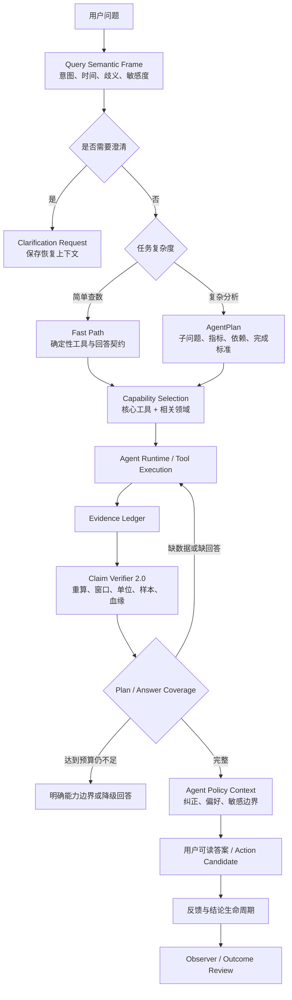

# Holo Agent 成熟度审查与演进方案

> 日期：2026-07-24  
> 状态：✅ 全阶段实施完成（P0-A → P2），等待验收  
> 范围：Holo Agent 查询、分析、验证、个性化与主动闭环  
> 依据：外部《Holo Agent 仓库审查报告》与当前 iOS、HoloBackend 实现交叉核验  
> 核验：2026-07-24 已对 iOS 端 17 项能力 + 后端 5 项实现逐项比对真实代码。核心判断（能力已存在、分散未汇聚、不推翻重做）成立；§七落点表与 P0-D 版本语义已按核验结果订正（标「核验订正」处）。iOS 侧 `agent_loop` 基线已确认为 v10（`PromptManager.swift` L140 `.agentLoop: 10`），与后端一致，§二第 12 条与 §三第 6 条判断成立。  
> 实施：2026-07-24 全部 7 阶段（P0-A/B/C/D + P1-A/B + P2）已实施完成，iOS App build 成功，7 套 standalone 测试全部通过（共 166 条用例），后端 SSE 可靠性测试 12/12 通过。P0-D 后端 SSE 加固需后端发版。

## 一、产品结论

外部报告的总方向值得采纳：下一阶段不应继续以“增加更多工具”为主，而应优先解决完整规划、结论验证、稳定评测和反馈复用。

但报告对当前实现存在明显低估。Holo 已经具备独立时间语义解析、证据账本、Claim 校验、记忆生命周期、反馈聚合、Observer、洞察转行动和固定执行预算；真实问题不是“这些能力完全没有”，而是：

1. 能力分散在查询、记忆、洞察和主动观察链路中，尚未汇聚为统一的 Agent 决策链。
2. 现有校验偏结构和单指标一致性，尚不能系统判断“证据是否足以支撑这句话”。
3. 复杂问题仍缺少可持久化、可覆盖检查的正式计划。
4. 有大量单元和可靠性测试，但缺少完整 Agent 轨迹的语义回归门禁。
5. 后端协议兼容和 SSE 解析偏“尽量成功”，缺少对静默退化的可观测性。

因此，本方案的产品判断是：

> **有条件采纳外部建议，但不重建 Agent。以现有 Runtime、时间解析、Evidence Ledger、Memory Record、Observer 和 Action Candidate 为底座，补齐“计划—执行—验证—学习—行动—复盘”闭环。**

不采用“当前成熟度 68 分、完成四项即可到 80 分”这类主观评分作为目标。后续以用户问题完整回答率、硬事实正确率、证据可复现率、澄清正确率、反馈复犯率和主动打扰接受率作为验收标准。

## 二、逐条审查结论

| 外部建议 | 审查结论 | 当前真实情况 | 产品决策 | 优先级 |
|---|---|---|---|---|
| 建立独立 `AgentPlan` 与覆盖检查 | **采纳，但限定复杂任务启用** | 现有 v10 回答契约已要求逐项回答，并能按 metric key 补齐缺失指标；但没有可持久化的子问题、依赖和完成标准 | 在现有答案契约上增加计划层，不另建平行执行框架；简单查数走快路径 | P0 |
| 建立独立时间语义解析器 | **方向正确，事实判断过时** | 已有 `HoloAgentTimeSemanticResolver`，覆盖本/上月、本/上周、年、最近 N 天、显式年月和成对比较 | 扩展歧义、自然周期、季度、工作日/周末、节日前后，并输出解析说明；不重新开发一套 | P0 |
| 建立真正的 Claim Verifier | **强烈采纳，但“当前没有”不正确** | 已有 `HoloClaimVerifier` 和 `HoloEvidenceLedger`，可检查 evidence、metric key、数值一致性和因果禁词；但验证深度不足 | 升级为 Verifier 2.0，系统计算置信度并支持通过、降级、拒绝三态 | P0 |
| 反馈形成自动学习闭环 | **修正后采纳** | 已有 `HoloMemoryRecord` 生命周期、用户确认/纠正/否定、显式偏好抽取、洞察反馈聚合和查询前记忆注入 | 不新增第二套“用户策略数据库”；统一生成轻量 `AgentPolicyContext` 注入 Agent | P1 |
| 建立主动性评分模型 | **方向正确，但当前主动能力被低估** | 已有 Observer、触发策略、表达决策、跨域候选、Action Candidate 和提醒；缺少统一价值/打扰成本决策 | 先保证结论质量，再统一主动评分；默认“存储优先、打扰谨慎” | P2 |
| 增加 `need_clarification` | **部分采纳** | `ConversationCoordinator` 已能在路由前澄清，但进入 Agent Loop 后没有结构化澄清状态 | 歧义优先由确定性策略分级；Agent 增加结构化澄清结果和恢复上下文 | P0 |
| 两阶段工具路由 | **作为扩展性优化采纳，不做硬领域门控** | 当前会把完整注册工具描述放入 Prompt，工具继续增长会增加 token 和混淆；但现阶段工具量尚未构成首要瓶颈 | 使用“核心工具 + 高置信领域 + 跨域能力 + 一次扩展回退”，避免错误领域选择截断答案 | P1 |
| 任务成本规划 | **部分采纳** | 已有 `normalDeep`、`extendedDeep`、`observerFollowUp` 固定预算，但用户分析主要使用同一预算，缺少复杂度选择 | 增加任务画像与预算选择，复用现有预算结构，不新建计费系统 | P1 |
| 建立 400～500 条 Agent Eval | **采纳评测体系，不采纳一次性数量指标** | 已有大量工具、协议、时间、持久化、恢复测试，也有部分 intent golden cases；缺少统一端到端语义轨迹评测 | 先建立 80～120 条高价值基准与反例，再由线上失败持续扩充；质量和覆盖优先于条数 | P0 |
| 开发严格、生产兼容并记录协议退化 | **强烈采纳** | iOS 和后端都会自动补空数组、默认类型、默认置信度等，确实可能掩盖模型协议退化 | 建立契约策略与非敏感指标；Debug/Test 严格，生产只修复白名单字段并记录 | P0 |
| 加固 SSE 解析和残余 buffer | **强烈采纳** | 当前坏帧会跳过，流结束没有完整处理 decoder/buffer，`finish_reason` 和 usage 还可能被默认值掩盖 | 作为后端可靠性 P0 修复，异常不得静默伪装成正常完成 | P0 |
| 拆分 Prompt/协议/工具/客户端/数据库版本 | **概念正确，但报告中的版本漂移未被证实** | 当前 iOS 与后端基线均为 `agent_loop v10`；数据库历史版本与协议兼容性确实不是同一概念 | 先拆 `promptRevision`、`agentProtocolVersion`、`toolSchemaVersion`；只有真实存在不兼容下发时再引入最低客户端版本 | P1 |
| 增加结论生命周期与假设追踪 | **能力已存在，需接入 Agent** | `HoloMemoryRecord` 已有 hypothesis、证据/反证、confirmed/disputed/superseded/invalidated 等状态 | 复用现有 Memory Record；定义哪些 Agent Claim 值得进入生命周期，不为每次临时回答持久化 | P1 |
| 洞察转行动、效果回看、受控提醒 | **前两项部分已有，效果回看仍缺** | 已有任务/习惯/预算/回访等 Action Candidate，用户确认后执行；结果与后续指标尚未形成统一回看 | 扩展现有 Action Candidate 和 Observer，建立 Outcome Review，不再建设第二套动作系统 | P2 |
| 产品壁垒是可验证、可追踪、可纠正的个人认知 | **采纳** | 与 Holo 当前个人数据资产和记忆系统方向一致 | 作为 Agent 后续产品北极星，但必须受隐私、可撤销和低打扰约束 | 长期原则 |

## 三、外部报告中需要明确纠正的判断

### 1. “时间主要靠 Prompt”不准确

当前查询开始前已经运行确定性时间解析器，并将结果写入执行上下文。问题是覆盖范围和歧义协议不足，不是缺少解析器。

### 2. “缺少真正的工具结果验证器”表述过度

当前已经存在 Claim Verifier、Evidence Ledger、Metric Semantic Catalog 和 Runtime 完成检查。真正缺口是窗口、单位、样本、覆盖率、重复血缘、证据独立性及系统置信度。

### 3. “反馈只是偶尔查询，没有学习闭环”不准确

当前已经具备用户确认、纠正、否定、遗忘、洞察偏好聚合、沟通风格和敏感边界。真实缺口是这些结果没有统一、稳定地进入每一次相关 Agent 任务。

### 4. “Agent 基本只有用户问、Agent 回答”不准确

Holo 已有后台 Observer、自动深挖、触发策略、表达决策、跨域模式和动作候选。真实缺口是主动链路的价值、置信、可行动、重复度和打扰成本还没有统一评分。

### 5. “长期模式、反馈学习、行动闭环尚未建立”过于绝对

这些能力都已有局部实现，处于“有组件、缺统一闭环”的阶段。若按报告从零实施，会制造重复状态源和冲突生命周期。

### 6. “Prompt 当前存在 v10/v11 漂移”没有足够证据

本次核验中，iOS 和后端 `agent_loop` 基线均为 v10。数据库历史自动递增和线上内容变化可能造成观察者误判，但不能直接推断客户端协议已落后。版本语义应拆分，但不能把未经证实的漂移当成线上事故。

### 7. “首批必须 400～500 条 Eval”属于虚假精确

一次性堆数量会产生大量低价值同义样例，维护成本高。首批应覆盖关键边界和已知故障，再按生产回归增长；硬语义应尽量确定性判定，语言自然度才使用校准后的 rubric。

## 四、目标架构



架构约束：

1. **确定性语义先于模型推理。** 时间、预算、权限、危险动作和可复算指标不交给模型自由决定。
2. **模型负责拆解与表达，系统负责约束与验收。**
3. **Evidence Ledger 是唯一证据真相源，Memory Record 是长期结论真相源。**
4. **简单问题不能因为增加规划层而变慢。**
5. **澄清和执行确认分开。** 查询歧义使用澄清；删除、创建、修改等动作继续走现有确认卡和执行链。
6. **主动能力默认不打扰。** 先存储，再根据价值和用户授权决定是否表达。

## 五、分阶段实施方案

## P0-A：先建立 Agent Eval 和当前基线

### 目标

在改动 Runtime 之前先固定“什么叫答对”，避免继续依赖单个示例修 Prompt。

### 实施

1. 在 Agent 测试目录建立版本化 JSON fixtures 和统一 runner。
2. 首批 80～120 条，优先覆盖：
   - 时间与比较窗口；
   - 单域简单查数；
   - 多子问题；
   - 跨域相关；
   - 无数据、未授权和部分覆盖；
   - 诱导因果、医疗/心理越界；
   - 用户纠正和偏好冲突；
   - 需要澄清与不应澄清；
   - SSE/协议退化导致的不完整结果。
3. 每条用例记录完整轨迹：
   - semantic frame；
   - plan 或 fast path；
   - capability/tool requests；
   - evidence；
   - verifier 结果；
   - coverage；
   - final answer。
4. 硬门禁使用确定性断言：时间、工具、数字、证据、越界、覆盖、澄清。
5. 自然表达使用少量人工 rubric；如引入模型评分，必须用固定样本校准，不作为唯一门禁。
6. 生产失败经脱敏后进入 regression corpus，禁止只修 Prompt 不补回归。

### 验收

- 已知时间、计算、越界和回答不完整问题全部有固定回归样例。
- 改 Prompt、模型、工具 schema、时间解析或 verifier 时可一键运行对应评测。
- 关键数字与证据一致性在基准集中必须全部通过。

## P0-B：Query Semantic Frame、AgentPlan 与澄清

### 目标

让复杂任务先形成明确计划，同时保留简单查数的速度。

### 核心模型

```swift
struct HoloAgentPlan: Codable, Equatable {
    let objective: String
    let subQuestions: [SubQuestion]
    let requirements: [MetricRequirement]
    let dependencies: [Dependency]
    let completionCriteria: [CompletionCriterion]
    let unresolvedAmbiguities: [Ambiguity]
}
```

关键约束：

1. 子问题、指标要求和完成标准使用稳定 ID，可被 Coverage Check 引用。
2. 模型可以提出拆解，但所有工具、字段、指标和依赖必须经 Registry 校验。
3. 只有多领域、多比较窗、多子问题或高风险结论进入正式计划；单一查数继续 fast path。
4. 当前 v10 的 metric 补齐逻辑并入 Coverage Check，不重复生成两套“完整回答”判断。
5. 歧义分级由系统决定：
   - 低影响：采用产品默认，并在回答中说明；
   - 中影响：可在同一成本预算内双算，差异显著再说明或追问；
   - 高影响：返回 `HoloAgentClarificationRequest`。
6. Agent job 保存 clarification token 和原 plan；用户回答后恢复原 job，不重新猜测整个问题。

### 时间解析扩展

- “最近”“近期”“最近一个月”的产品默认及说明；
- 当前月至今、最近 30 天、上一完整自然月的明确区分；
- 季度、今年以来、最近 N 周；
- 工作日/周末；
- 节日前后使用可版本化节日日历；
- 不完整周期和对比周期的对齐策略；
- 解析结果带 `assumption`、`completeness`、`comparisonAlignment`，便于回答披露和 verifier 使用。

### 验收

- 复杂问题的每个明确子问题都有 answered / unsupported / clarification_needed 状态。
- 未完成的计划不能直接伪装成完整答案。
- 简单查数不增加额外 LLM 轮次。
- 同一歧义在不同数据域使用一致策略。

## P0-C：Claim Verifier 2.0

### 目标

将“JSON 合法”升级为“结论可复算、证据足够、表达强度匹配”。

### 校验维度

1. evidence ID 存在且未 orphan；
2. metric assertion 可由工具结果重算；
3. 当前期和基准期窗口可比；
4. 单位、币种、时区和粒度一致；
5. 分母不为零，百分比方向与绝对值一致；
6. 样本量、时间覆盖和数据新鲜度达到相应 claim 门槛；
7. 去重键和数据血缘不存在重复计算；
8. 相关性证据来自足够重叠窗口和独立维度；
9. 表达类型和强度不超过证据；
10. 系统置信度由数据质量计算，模型置信度只作为弱输入或完全忽略。

### 输出

```text
verified：允许展示
degraded：系统降低强度并披露限制
rejected：不展示该结论，转为能力边界
```

降级文案优先由 Metric Semantic Catalog 和固定模板生成，避免再次调用模型改写出新事实。

### 验收

- 故意注入错百分比、错单位、错窗口、重复证据、零基期和低覆盖数据时，不能展示强结论。
- confidence 能说明来自哪些质量因子，且不再由模型随意填写。
- 所有用户可见数字可回溯到 evidence 和可复算步骤。

## P0-D：协议与 SSE 可靠性加固

### 目标

任何协议或流式传输退化都能被识别、归因和回归，不能静默伪装成正常完成。

### Agent Contract

1. 建立 `HoloAgentContractPolicy`：
   - Debug/Test：必填字段缺失直接失败；
   - 灰度：严格校验并保留可控回退；
   - 生产：仅允许白名单字段兼容修复，并记录 repair/violation。
2. `final_claims` 空 claims、事实 claim 无 evidence、非法 confidence 等关键错误不可兼容放过。
3. 指标只记录技术元数据，不记录用户问题、金额、健康数据或证据正文：
   - `agent_contract_violation_rate`
   - `agent_contract_repair_rate`
   - `missing_field_rate`
   - `invalid_evidence_rate`
   - `empty_final_claim_rate`
   - provider / model / prompt revision / protocol / tool schema

### SSE Parser

1. 正确处理 CRLF、注释行、多行 data、分片 UTF-8、`[DONE]`；
2. 流结束时 flush decoder 并处理剩余 buffer；
3. 记录 chunk、坏帧、空帧、DONE、finish reason、usage 和 remaining buffer；
4. 内容完整性不确定时返回明确 upstream incomplete/error，不能合成 `finish_reason=stop` 掩盖异常；
5. 增加碎片帧、坏帧、无 DONE、残余帧、usage 缺失、UTF-8 截断测试。

### 版本语义

**核验订正**：`promptRevision` 机制在后端 `promptRegistry.js` 已相当完整（`version + diff + change_note + source` + SQLite 历史表 + 回滚 API），**不需重建**。首期真正要补的是另外两类版本，以及 iOS 与后端之间的对齐：

```text
agentProtocolVersion   ← 真缺：回答契约结构版本（当前 v10），需显式声明并下发
toolSchemaVersion      ← 真缺：需先给 HoloToolRegistry 补 version 字段（现仅 InputSnapshotHasher 硬编码 =1）
promptRevision         ← 已存在：复用，补 iOS↔后端 对齐校验与对外暴露
```

数据库历史版本（`prompt_versions` 的递增 `version`）保留为内部审计，不作为客户端兼容版本。只有后端开始按 `agentProtocolVersion` 下发不兼容协议时，再引入 `minimumClientBuild`。

### 验收

- 协议字段持续缺失可以在指标中被发现，而不是全部补默认值。
- SSE 测试可区分模型坏 JSON、上游坏帧、网络截断和客户端解析问题。
- 每次 Agent 请求可以按三类版本完成归因。

> 本阶段包含 HoloBackend 改动，实施后必须完成后端测试、ECS 发版和生产真实请求验证。

## P1-A：任务画像、预算与能力选择

### 目标

让简单问题更快，复杂问题有足够预算，同时不因硬路由漏掉跨域工具。

### 实施

新增确定性 `TaskProfile`：

```text
simple_lookup
single_domain_analysis
comparison_analysis
cross_domain_analysis
sensitive_analysis
observer_follow_up
```

根据 profile 选择现有 budget、是否启用 plan、允许的工具轮次、是否强制 verifier，以及模型/Token 上限。`extendedDeep` 只有在复杂任务满足条件时使用。

工具发现采用软选择：

1. 所有任务保留小型 core capabilities；
2. 注入高置信相关领域描述；
3. 明确跨域问题注入 cross-domain capability；
4. Coverage Check 发现缺能力时最多扩展一次；
5. 不使用不可恢复的单领域硬门控。

### 验收

- 简单查数的 P50/P95 延迟和 Token 不高于改造前。
- 多子问题和跨域任务不再因固定预算提前结束。
- 能力预选错误可通过一次扩展回退恢复。

## P1-B：统一 AgentPolicyContext 与长期结论接入

### 目标

让 Agent 稳定记住用户纠正，同时避免把偏好固化成不可更改的“人格标签”。

### 数据来源

复用：

- `HoloMemoryRecord` 的 preference、hypothesis、evidence/counterEvidence 和生命周期；
- 用户显式确认、纠正、否定、无关、遗忘；
- `InsightPreferenceProfile` 的表达和建议偏好；
- Profile 的沟通风格和敏感边界；
- feedback 工具的近期纠正主题。

不新增第二套用户策略存储。

### 冲突顺序

```text
当前明确输入
> 当前任务的安全与产品规则
> 用户明确纠正/禁止项
> 用户确认的稳定偏好
> 近期弱偏好
> 全局默认
```

每次只注入与当前任务相关的少量 policy，携带来源、状态和有效期。用户纠正后，旧规则进入 superseded/disputed，而不是永久叠加。

重要 Agent Claim 只有满足重复、价值和证据门槛时才进入 Memory Record；一次性查数不进入长期结论生命周期。

### 验收

- 用户明确否定过的推断在相关任务中不再复犯。
- 当前输入能覆盖旧偏好。
- 用户可以查看、纠正和遗忘由反馈形成的策略。
- Policy 注入有 Token 上限且不会泄露无关领域数据。

## P2：主动洞察、行动和效果回看

### 目标

在现有 Observer、Expression Decision 和 Action Candidate 上形成低打扰闭环。

### 主动评分

```text
value
× confidence
× actionability
× novelty
× timing fitness
− interruption cost
− repetition penalty
```

结果分为：

```text
notify：高价值、高置信、可行动且已获相应授权
store：有价值但不值得打扰，进入记忆/长廊
watch：证据不足，继续观察
ignore：低价值或重复
```

### Outcome Review

Action Candidate 执行后保存：

- action ID 与来源 claim；
- 用户是否确认、修改或取消；
- 目标指标与观察窗口；
- 后续是否执行；
- 指标是否改善、无变化或无法判断；
- 是否继续、调整或停止关注。

效果回看只能表达相关变化，不把行动与结果自动写成因果。

### 验收

- 未授权、低置信或重复信号不会主动打扰。
- 每个主动提醒都能解释“为什么现在提醒”并可暂停同类提醒。
- 已执行动作能够在合理窗口后回看，无法判断时明确说明数据不足。

## 六、实施顺序与依赖

```text
P0-A Eval 基线
    ↓
P0-B Plan / Semantic Frame / Clarification
    ↓
P0-C Verifier 2.0
    ↓
P0-D Contract / SSE / Version Observability
    ↓
P1-A Budget / Capability Selection
    ↓
P1-B AgentPolicyContext
    ↓
P2 Proactivity / Outcome Review
```

其中 P0-D 的 SSE 修复可以与 P0-B、P0-C 并行开发，但生产灰度必须使用 P0-A 的评测门禁。P1、P2 不应提前于 Verifier 2.0 扩大表达范围，否则只是让不稳定结论更个性化、更主动地打扰用户。

## 七、关键技术落点

### iOS 现有能力复用

- `HoloAgentTimeSemanticResolver.swift`：扩展语义结果和歧义，不替换。
- `HoloLocalAgentRuntime.swift`（1632 行）：接入 fast path、plan、coverage、clarification 和 task profile。固定预算 `normalDeep / extendedDeep / observerFollowUp` 真实存在，但定义在 `Models/AI/Agent/HoloAgentJobModels.swift` 的 `HoloAgentBudget`，本文件为引用方；v10 的 metric key 补齐逻辑也在此文件（缺失断言补 `-supplement` claim），P0-B 的 Coverage Check 应并入此处而非 OutputModels。预算 `maxWallTimeSeconds` 实际语义为 active runtime（锁屏/等待不计入），非 wall-clock 总时长。
- `HoloAgentOutputModels.swift`（`Models/AI/Agent/HoloAgentOutputModels.swift`）：**核验订正——该文件仅 46 行纯模型定义**，无 metric key 补齐逻辑（补齐在 Runtime）。在此增加 plan/clarification/verification 相关协议字段没问题，但不要在此寻找补齐实现。
- `HoloAgentResponseParser.swift`：改为返回原始解码结果、repair 和 violation，不再静默吞掉协议退化。
- `HoloClaimVerifier.swift`：升级为 Verifier 2.0。
- `HoloEvidenceLedger.swift`：继续作为证据真相源。
- `HoloMetricSemanticCatalog`：**核验订正——无独立文件**，是 `Models/AI/Agent/HoloAgentToolModels.swift` 内的 `nonisolated enum`（L63–243）。能力覆盖 80+ metricKey 中文标题、topic 归类、sentence 生成、formattedNumber、内部 token 泄漏检测。负责确定性降级表达。
- `HoloToolRegistry`（`Services/AI/Agent/Tools/HoloToolRegistry.swift`）：**核验订正——当前仅做注册/查找/prompt 描述汇总，没有 capability index，也没有 schema/version 字段**。所谓"工具目录版本"是 `HoloAgentInputSnapshotHasher.swift` 里硬编码的 `currentToolCatalogVersion = 1`；覆盖度清单是独立的 `HoloAgentToolCoverage`。P0-D 的 `toolSchemaVersion` 与 P1-A 的能力软选择需先为其补建 capability 索引与版本字段。
- `HoloMemoryRecord`（`Models/AI/HoloMemoryRecord.swift`）、`HoloMemoryFeedbackService`、`InsightFeedbackAggregator`：生成统一 policy，不新建存储。**核验订正**：`HoloMemoryRecord` 的 `hypothesis` / `explicitPreference` 是 `HoloMemoryClaimKind` 枚举值（经 `claimKind` 字段表达），不是独立命名字段；结构化偏好画像在独立的 `InsightPreferenceProfile`。生命周期状态 `candidate/active/disputed/superseded/invalidated/archived/...` 属实。
- `HoloObserverTriggerPolicy`、`HoloExpressionDecisionEngine`、`InsightActionCandidate`：扩展主动评分和效果回看。**核验订正**：Action Candidate 的 6 种类型（taskDraft/habitAdjustmentDraft/budgetReminderDraft/reflectionQuestion/checkInReminder/noAction）与模型完整，但 `InsightActionCandidateBuilder` 当前为硬编码规则（注释自述 Phase 6 前置，仅覆盖任务逾期/习惯断连/消费偏离/恢复迹象），规则广度仍属早期，P2 扩展时需扩充规则集而非假定已完备。

### HoloBackend

- `src/providers/openAICompatibleProvider.js`：SSE 完整性和观测。**核验属实**：问题集中在 `completeViaStream()`（agent_loop 实走路径）——坏帧 `catch { continue }` 无计数/日志；循环 break 后未调 `decoder.decode()` 做 flush，多字节 UTF-8 尾字节可能丢失；保留的残余 `buffer = frames.pop()` 循环后从不处理被静默丢弃；`finish_reason ?? "stop"` + `usage ?? 全零` 掩盖异常。透传 `stream()`（`passesThroughSSE: true`）不解析帧，不受影响。
- `src/agentResponseValidator.js`：严格/兼容策略及 violation 结果。**核验属实**：后端已有宽松兼容（空数组 / `type=observation` / `confidence=0.5` / `evidenceIds→evidenceIDs` 兼容等），仅硬结构错误（JSON 失败、缺 status、status 与数组不匹配、`final_claims` 下 claim 缺 displayText）才返 502。
- `src/app.js`：记录非敏感协议与 SSE 指标。**核验属实**：当前无任何 SSE 维度指标（帧数/坏帧/截断/usage 缺失率）。已有 `logAgentStepEvent`（`category: "holo_agent"` + 字段白名单 + 注释禁敏感）可复用为同一事件范式，不必另起炉灶。
- `src/prompts/promptRegistry.js`：明确 prompt revision，与协议/schema 版本解耦。**核验订正——revision 机制已相当完整**：已有 `PROMPT_VERSIONS` 基线（`agent_loop: 10`）、`version + diff_from_prev + change_note + source` 字段、SQLite `prompt_versions` 历史表、回滚/对比/sync API 一整套。本条落点应改为：复用现有 revision，补 **iOS ↔ 后端的 revision 对齐校验**与对外暴露的元数据，而非从零建立。
- `src/prompts/defaultPrompts.json`：等 iOS 协议落地后同步升级 Agent Prompt。**后端基线核验为 v10**（`agent_loop: 10` + `_agent_loop_v10_contract` 附录 + 内部标记 `V10` 三方一致）。iOS 侧基线需单独核验（当前工作区有大量未提交 iOS 改动）。

### 测试

- iOS Agent 测试目录新增 `Evals/Fixtures` 与 runner。
- 时间解析、Plan Coverage、Verifier、Policy Context 使用 standalone/单元测试。
- 后端增加 SSE parser、contract policy、version metadata 测试。
- Prompt 改动必须同步 iOS fallback、后端默认 Prompt、版本和生产验证。

## 八、失败模式与防护

| 风险 | 用户影响 | 防护 |
|---|---|---|
| 所有问题都先规划 | 简单查数变慢、显得笨重 | TaskProfile + fast path；不增加简单查询 LLM 轮次 |
| 领域路由过硬 | 跨域或隐含问题漏查 | 核心能力常驻 + 软选择 + 一次扩展回退 |
| Verifier 过严 | 有价值结论全部被拦截 | pass/degraded/rejected 三态；记录误杀并进入 Eval |
| 兼容修复过多 | 模型协议退化长期不被发现 | 白名单修复 + 字段级指标 + 灰度严格模式 |
| 反馈被永久固化 | 用户被旧偏好束缚 | 来源、有效期、冲突顺序、superseded 和可遗忘 |
| 主动评分追求点击率 | 提醒频繁、用户失去信任 | 默认 store，显式授权、冷却、重复惩罚和一键暂停 |
| 效果回看误写因果 | 错误建议被强化 | 只描述前后变化；独立证据与对照不足时不下因果结论 |
| 观测记录个人数据 | 隐私风险 | 只记录状态、字段名、版本、计数和错误类型，不记原文和证据内容 |

## 九、产品验收总门槛

P0 完成不以“代码已写”或“测试数量增加”为准，而必须同时满足：

1. 复杂问题的所有明确子问题都有可审计状态；
2. 用户可见硬数字可重算、可追溯；
3. 时间默认和歧义处理一致并可说明；
4. 越界推断、弱证据强结论和缺数据假装有结论被系统阻断；
5. 协议或 SSE 退化能够被识别和归因；
6. 评测覆盖既有故障，并在 Prompt/模型/工具变更时自动回归；
7. 简单查询性能不因架构升级显著退化。

P1 完成后，用户应能感知“Holo 记得我的纠正，并按我的方式回答”，同时可以查看和撤销这些策略。

P2 完成后，用户应能感知“Holo 不只是发现问题，还能在获得授权后推动行动并回看结果”，且主动提醒不会成为新的打扰源。

## 十、最终取舍

下一阶段停止以“工具数量”作为 Agent 进步的主要指标，但不冻结真实产品所需的数据覆盖。优先级按以下顺序执行：

```text
评测真相
> 完整规划
> 结论验证
> 协议与流可靠性
> 成本和工具选择
> 个性化策略
> 主动行动闭环
```

这条路线不是把 Holo 从查询器推翻重做，而是把已经存在的可靠执行、数据工具、证据、记忆和主动组件，收口为一个能解释“为什么这样查、为什么能这样说、为什么现在提醒、用户纠正后为什么不会再犯”的个人 Agent。
