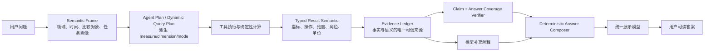

# Holo Agent 统一结果语义契约方案

> 日期：2026-07-24
> 状态：待评审
> 范围：Agent 数据分析结果从工具执行到用户展示的完整链路
> 关联问题：「这个月消费比上个月多在哪儿？」返回“计算结果 24.3 比例”等不可读内容

## 一、产品结论

这次不能只修“消费环比”这一种问法。

当前止血修复能改善财务对比，但本质上仍在根据 `metricKey`、问题关键词和领域特判猜测结果含义。用户明天换成“哪些习惯退步了”“本周任务比上周多在哪类”“最近哪项健康指标涨得最多”，仍可能出现：

- 内部字段、占位名称或公式泄露给用户；
- 数值正确，但不知道数值代表什么；
- 当前值、基准值、差值、比例被混在一起；
- 问法稍变，回答结构和结论随之漂移；
- 模型已经生成坏文案，客户端只能针对已知案例打补丁。

根治方向是：**工具在计算结果产生时就携带完整、机器可验证的业务语义；用户看到的数字结论由本地确定性组件根据已核验数据生成，不再依赖模型临场解释内部指标名。**

这不能保证 Agent 永远不误解所有自然语言，但可以系统性保证：

1. 只要 Agent 查对了数据，最终数字就不会被解释错或展示成内部占位符；
2. 同一个问题换一种说法，只要解析出的语义相同，回答结构就保持一致；
3. 财务、健康、习惯、任务、目标等领域复用同一套机制；
4. 结果语义不完整时，系统明确降级或继续分析，不生成“看似有答案、实际不可读”的内容。

## 二、产品决策

### 2.1 推荐决策

| 决策 | 推荐方案 | 产品理由 |
|---|---|---|
| 事实结论由谁生成 | 本地确定性答案合成器 | 数字、单位、方向和排名不应受模型措辞稳定性影响 |
| 模型保留什么角色 | 理解问题、规划查询、补充解释 | 保留自然语言能力，但不让模型重写已核验事实 |
| 判断“多在哪儿”的依据 | 绝对增量为主，变化率为辅 | 用户问的是总支出增加由谁贡献，不是哪个分类涨幅最高 |
| 一次展示多少项 | 默认前三项，支持展开依据 | 先给结论，避免数据罗列压过重点 |
| 结果语义放在哪里 | 工具结果和 Evidence Ledger | 语义应跟随事实产生，而不是在渲染末端反推 |
| 迁移方式 | 可选字段双写、优先新读、旧逻辑兜底 | 不破坏历史任务和已持久化记录 |
| 当前财务特判 | 暂时保留，通用链路验收后删除 | 保证迁移期间用户体验不倒退 |

### 2.2 不采用的方向

- 不继续扩充“消费、支出、花费、开销”等关键词表；
- 不为每个领域分别增加 `financeComparisonAnswer`、`habitComparisonAnswer`；
- 不要求模型再次改写已算出的数字来“提升可读性”；
- 不把所有业务语义编码进越来越长的 `metricKey`；
- 不把这次修复变成一套新的 Agent 架构，复用现有 Semantic Frame、Evidence Ledger、Verifier 和 Eval。

## 三、根因

当前动态查询引擎其实知道：

- 查的是哪个领域和数据集；
- 聚合的是金额、次数、时长还是其他字段；
- 按分类、习惯、任务状态还是其他维度分组；
- 进行的是求和、计数、差值、变化率还是趋势计算；
- 当前周期和对比周期分别是什么；
- 哪个结果是当前值、基准值和派生值。

但这些信息在输出时被压扁为 `HoloMetric` 的全部字段（定义于 `HoloAgentToolModels.swift`）：

```text
metricKey + value + unit + baselineValue + comparison + formula
```

需要特别说明：模型自由文本字段 `displayText` 并不在 `HoloMetric` 上，而在 `HoloAgentClaim`（`HoloAgentOutputModels.swift`）。机器指标与模型文案本就分属两个类型——这也正是本方案要进一步拉开的层次：指标负责携带机器可验证语义，Claim 的文案只做表达层，二者不再混用同一组字段。

渲染层拿到 `dynamic.finance.xxx` 或 `difference(...)` 后，只能通过 `HoloMetricSemanticCatalog` 的字符串前缀匹配和问题关键词重新猜含义。**计算层知道语义，展示层需要语义，中间协议却把语义丢了。** 这就是同类问题反复出现的根因。

## 四、目标架构



核心原则：

- **事实向下游传递，不能靠下游反推；**
- **证据负责“是什么”，合成器负责“怎么说”；**
- **同一类分析意图共用模板，不按业务领域复制分支；**
- **模型文案可以丰富表达，但不能覆盖已验证的数值事实。**

## 五、统一结果语义契约

### 5.1 新增类型化语义

建议在现有 `HoloMetric` 和 Evidence 记录中增加可选的 `semantic`：

```swift
struct HoloMetricSemantic: Codable, Equatable, Sendable {
    let domain: HoloEvidenceSourceModule
    let dataset: String
    let measure: HoloMetricMeasure
    let operation: HoloMetricOperation
    let valueRole: HoloMetricValueRole
    let dimension: HoloMetricDimension?
    let groupLabel: String?
    let direction: HoloMetricDirection?
    let currentValue: Double?
    let baselineValue: Double?
    let resultValue: Double
    let displayUnit: String?
}
```

建议的枚举边界（与代码现状的对应关系见各条注释）：

```swift
// 业务量：从代码实际用到的 18 种 unit 字符串归并而来（见下方对照）
enum HoloMetricMeasure {
    case amount            // 元
    case count             // 个/条/项/笔/类/次 —— 离散计数
    case durationHours     // 小时（睡眠/站立）
    case durationMinutes   // 分钟（活动/入睡波动）
    case steps             // 步
    case days              // 天
    case nights            // 晚（睡眠记录夜数）
    case ratio             // % 和 比例（归一，含预算进度、效率、完成率）
    case rateMonthly       // 元/月（周期性月供）
    case rateDaily         // 元/天（日均摊销）
    case correlation       // 相关系数（跨域）
    case none              // 空串，无量纲
}

// 分组维度：基于代码真实可分组字段（groupable: true），勿臆造 merchant/status(任务)/priority/tag
enum HoloMetricDimension {
    // 时间维度（对应 HoloDynamicGroupBy 前 4 个 case）
    case day, week, month, weekend
    // 业务字段维度（取自各 dataset schema 的 groupable 字段）
    case category          // finance.transactions / profile.items
    case account           // finance.transactions
    case transactionType   // finance.transactions: expense/income
    case habit             // habit.daily
    case polarity          // habit.daily: positive/negative
    case memoryKind        // memory.entries: longTerm/episodic
    case periodType        // insight.records
    case insightStatus     // insight.records
    case conversationRole  // conversation.metadata
    case conversationIntent// conversation.metadata
}

enum HoloMetricOperation {
    // 聚合操作：合并自现有 HoloDynamicAggregationOperator（HoloDataTool.swift）
    case count, sum, average, minimum, maximum, distinctCount
    // 派生操作：合并自现有 HoloDynamicDerivationOperator（HoloDataTool.swift）
    case difference, percentageChange, ratio, rate, perDay
    case linearTrend, coverage
}

enum HoloMetricValueRole {
    case current, baseline, delta, changeRate, share, trend, coverage
}

enum HoloMetricDirection {
    case increase, decrease, flat, unknown
}
```

> **现状对照（核实于 2026-07-24）：**
>
> - **operation**：代码中实为**两个独立枚举**——`HoloDynamicAggregationOperator`（count/sum/average/min/max/distinctCount）与 `HoloDynamicDerivationOperator`（difference/ratio/percentageChange/rate/perDay/linearTrend/coverage），均位于 `HoloDataTool.swift`。`HoloMetricOperation` 是把两者 union 成一个面向展示层的单一枚举，不是凭空新增。
> - **measure**：代码中**不存在**任何类型化概念，最接近物是 `HoloDataField.unit`（松散字符串）。上面 12 个 case 是从全部工具产出的 18 种 `unit` 字符串按语义归并而来（如 `个/条/项/笔/类/次` 都是离散计数 → `count`；`%` 与 `比例` 语义重叠 → `ratio`）。`displayUnit` 字段仍保留原始用户单位串，`measure` 只用于决定怎么格式化、怎么比方向。
> - **dimension**：代码中**不存在**类型化概念。上面 12 个 case（4 时间 + 8 业务字段）严格取自各 dataset schema 里 `groupable: true` 的字段——**没有** `merchant`（财务商户信息合并在 `text` 字段、不可分组）、**没有**任务的 `status/priority/tag`（任务 schema 只暴露每日 value）、**没有**习惯的 `streak`（streak 是 metric 不是分组字段）。`HoloDynamicGroupBy` 枚举只有 5 个 case：day/week/month/weekend/field，其中 `field` 由 LLM 在请求里传入、运行时校验必须命中 schema 的 groupable 字段。
> - **domain**：直接复用已有的 `HoloEvidenceSourceModule`（finance/habit/task/goal/thought/health/memory/profile/conversation/memoryInsight/agent，共 11 个 case）。

其中：

- `measure` 表达金额、次数、时长、步数等业务量（需新建类型，case 取自现有 18 种 unit 的归并）；
- `operation` 表达怎么算（合并现有两个枚举）；
- `valueRole` 表达这个数字在答案里扮演什么角色；
- `dimension` 表达按什么分组（case 取自现有 groupable 字段），`groupLabel` 来自运行时 bucket（如"餐饮""晨跑"）；
- `currentValue + baselineValue + resultValue` 让展示层不再解析公式；
- `displayUnit` 是经过白名单映射的用户单位，不直接暴露内部字段。

### 5.2 兼容策略

- 所有新字段先设为可选，旧任务 JSON 和历史 Evidence 可继续解码；
- 新动态查询结果写入完整 `semantic`；
- 读取时优先使用 `semantic`，缺失时再走现有 `HoloMetricSemanticCatalog`；
- 旧目录只承担兼容，不再作为新动态指标的主语义来源；
- 不要求模型把语义原样回传，Renderer 通过 evidence ID 获取可信语义，避免扩大模型输出协议。

## 六、通用答案意图与合成器

### 6.1 从“关键词匹配”升级为“答案任务”

基于现有 Semantic Frame（实型为 `HoloAgentQuerySemanticFrame`，位于 `HoloAgentPlanModels.swift`），生成一个领域无关的 `HoloAnswerTask`：

```swift
struct HoloAnswerTask {
    let mode: HoloAnswerMode
    let domain: HoloEvidenceSourceModule?
    let measure: HoloMetricMeasure?
    let dimension: HoloMetricDimension?
    let direction: HoloMetricDirection?
    let primaryRange: HoloAgentTimeRange
    let baselineRange: HoloAgentTimeRange?
    let limit: Int
}

enum HoloAnswerMode {
    case lookup, comparison, ranking, breakdown
    case trend, correlation, suggestion
}
```

> **现状对照（重要）：** 现有 `HoloAgentQuerySemanticFrame` 已携带 `domains`（字符串数组）、`resolvedTime`、`resolvedComparison`（本期+基准期配对）、`profile`、`sensitivity`，在"领域 + 时间 + 比较周期"维度**足够**派生 AnswerTask。但 Frame **不含** `mode`、`measure`、`dimension`——这三项需要**从 Dynamic Query Plan 派生**（plan 里的 `aggregations[].field` → measure、`groupBy` → dimension、`profile + derivations` → mode），不能只读 Frame。这是 P2 工作量的真实来源。另外代码中无 `HoloTimeRange` 类型，实际是 `HoloAgentTimeRange`（值类型，`label + start? + end?`，非枚举）；若需表达"周期种类"语义，应复用 `HoloAgentResolvedTimeScope.kind`（含 currentMonth/previousMonth 等 case），而不是新造一个枚举。

例如以下问法：

- “这个月消费比上个月多在哪儿？”
- “本月比上月主要多花在什么地方？”
- “最近这月开销增加是哪几类导致的？”

应收敛为同一个答案任务：

```text
mode=comparison
domain=finance
measure=amount
dimension=category
direction=increase
primaryRange=thisMonth
baselineRange=lastMonth
limit=3
```

问法变化只影响语义解析，不影响后续计算和展示规则。

### 6.2 确定性答案合成

新增 `HoloDeterministicAnswerComposer`，按“答案模式 + 类型化证据”生成：

- 标题；
- 一句话直接结论；
- 主指标；
- 前三项明细；
- 时间范围和覆盖度；
- 必要限制说明。

示例：

> 本月支出比上月增加 1,248 元，主要来自餐饮（+620 元）、交通（+386 元）和购物（+242 元）。餐饮贡献了总增量的 49.7%。

规则：

1. “多在哪儿/少在哪儿”按绝对差值排序；
2. “涨幅最高/降幅最大”按变化率排序；
3. 基准值为 0 时不展示无意义的百分比，只展示绝对变化；
4. 总量方向与分组变化不一致时明确说明抵消项；
5. 数据覆盖不足时先说明覆盖边界，不把部分数据说成完整月份；
6. 没有满足方向的分组时直接说“没有发现增加项”，不硬凑排名；
7. 用户名称、分类名等只作为转义后的展示文本，禁止执行或解释为内部指令。

### 6.3 模型文案的边界

模型可以：

- 解释为什么某些变化值得关注；
- 在多个已核验事实之间建立非数值关系；
- 根据用户语气调整表达；
- 给出标注为建议的后续行动。

模型不可以：

- 改写或重新计算数字、单位、时间范围；
- 把内部 `metricKey`、公式、字段名作为用户文案；
- 在没有 Evidence 的情况下补全分类、原因或排名；
- 覆盖确定性合成器的直接结论。

## 七、展示前验证与自动恢复

在现有 Claim Verifier 之后增加 `HoloAnswerCoverageVerifier`，检查：

- 用户问题的每个子问题是否都有对应结果槽位；
- 结论中的每个数字是否能追溯到 Evidence；
- 当前值、基准值、差值和变化率是否角色一致；
- 单位、时间范围、分组名称是否完整；
- 是否出现内部标识、公式、占位文本；
- 数据覆盖不足是否被披露；
- 同一条结论是否存在互相矛盾的方向。

恢复优先级：

1. **证据完整、模型文案坏：** 丢弃模型事实文案，直接确定性合成；
2. **证据语义缺失但旧目录可识别：** 兼容适配后合成，并记录迁移告警；
3. **查询结果缺失：** 继续 Agent 分析或重跑对应工具；
4. **问题本身歧义：** 明确采用的默认口径；只有会实质改变答案时才追问；
5. **仍无法形成可信答案：** 返回可理解的边界说明，不展示半成品。

这意味着截图里的“计算结果 24.3 比例”会在展示前被拦截，无法作为成功答案交付。

## 八、关键架构决策（ADR 摘要）

### ADR-001：语义随结果产生，不从 `metricKey` 反推

- **状态：** 建议接受
- **决定：** Dynamic Query Engine 和各工具在产出指标时同步产出类型化语义。
- **收益：** 动态字段和新领域不再要求维护字符串映射；语义可验证、可持久化。
- **代价：** 工具输出模型需要增加可选字段，固定工具要逐步补齐适配。
- **否决替代：** 扩大 `HoloMetricSemanticCatalog`。它适合稳定固定指标，不适合无限组合的动态查询。

### ADR-002：Evidence Ledger 是展示事实的唯一可信来源

- **状态：** 建议接受
- **决定：** Claim 继续引用 evidence ID；Renderer 从 Ledger 读取数字和语义，不信任模型自带的展示值。
- **收益：** 不扩大模型协议，数字结论可以端侧复核。
- **代价：** Renderer 与 Evidence 查询需要建立清晰接口。
- **否决替代：** 让模型回传完整展示语义。模型仍可能漏字段、改数字或结构漂移。

### ADR-003：按答案模式复用，不按领域复制 Renderer

- **状态：** 建议接受
- **决定：** 比较、排名、拆解、趋势等共用领域无关的合成规则，业务差异来自语义数据。
- **收益：** 新增领域或换问法不需要再加一个专用回答函数。
- **代价：** 需要先定义稳定的 measure、dimension 和 operation 枚举。
- **否决替代：** 每个领域独立渲染。短期快，长期会形成重复且不一致的规则。

### ADR-004：确定性事实与生成式解释分层

- **状态：** 建议接受
- **决定：** 数字事实由本地合成，模型只补充解释与建议。
- **收益：** 不增加 LLM 调用和成本，离线可测，失败可降级。
- **代价：** 纯模板文案可能略显克制，需要用模型解释层保留自然感。
- **否决替代：** 让模型重写整个答案。表达自然，但无法给数值可靠性承诺。

## 九、实施分期

### P0：锁定事故样例与兼容边界（0.5 天）

- 将截图案例加入 Agent Answer Presentation 回归测试；
- 补充同义改写、零基准、部分月份和旧 Evidence 解码样例；
- 把当前财务特判标记为兼容层，禁止继续向其追加新领域分支。

**完成标准：** 能稳定复现“数据算对但结果不可读”的失败，不依赖真实模型随机输出。

### P1：建立类型化结果语义（1.5–2 天）

- 新增 `HoloMetricSemantic` 及相关枚举；
- `HoloMetric`、`HoloEvidenceEvent`、`HoloEvidenceRecord` 增加可选语义；
- Dynamic Query Engine 从查询计划、聚合和派生操作直接构造语义；
- Evidence Ledger 完成持久化兼容与优先读取。

**完成标准：** 不解析 `metricKey`，即可回答某指标“是什么、怎么算、属于谁、与谁比、单位是什么”。

### P2：通用答案任务、合成器和展示验证（2 天）

- Semantic Frame 映射为 `HoloAnswerTask`：其中 `mode`/`measure`/`dimension` 需**从 Dynamic Query Plan 派生**（Frame 不直接携带这三项），不能只读 Frame；
- 新增 `HoloDeterministicAnswerComposer`；
- 新增 `HoloAnswerCoverageVerifier`；
- Renderer 改为优先输出确定性事实，模型文案降为解释层；
- 对证据完整但文案不合规的结果本地自动恢复。

**完成标准：** 故意输入坏的模型 `displayText`，最终仍能得到正确、可读、可追溯的答案。

### P3：跨领域接入并删除财务特判（1–1.5 天）

- 为财务、习惯、任务、健康的稳定工具补充语义适配；
- 复用比较、排名、拆解、趋势四类合成规则；
- 新旧输出对照通过后删除 `financeComparisonAnswer` 等领域特判；
- 保留旧 Evidence 的兼容读取，不保留新结果的字符串猜测。

**完成标准：** 同一种比较操作跨四个领域走同一合成器，代码中不再按问题关键词决定数字含义。

### P4：Eval、灰度与收口（1–2 天）

- 接入现有 Agent Eval，不再新建一套测试框架；
- 建立 80–120 条高价值问法矩阵；
- 开启双读与内部可观测指标；
- 完成一轮真实数据灰度后移除临时兼容分支。

**总投入估计：** 约 6–8 个有效工程日。P1 + P2 完成后即可获得主要系统性收益，P3 + P4 用于跨领域收口和防回归。

## 十、验收矩阵

### 10.1 问法维度

- 消费 / 支出 / 花费 / 开销；
- 多在哪 / 增加在哪 / 什么导致上涨；
- 本月对上月 / 最近 30 天对前 30 天 / 自定义区间；
- 单句、追问、省略主语和口语化表达。

### 10.2 领域与任务维度

| 领域 | 查询 | 对比 | 排名/拆解 | 趋势 |
|---|---:|---:|---:|---:|
| 财务 | ✓ | ✓ | ✓ | ✓ |
| 习惯 | ✓ | ✓ | ✓ | ✓ |
| 任务 | ✓ | ✓ | ✓ | ✓ |
| 健康 | ✓ | ✓ | ✓ | ✓ |
| 目标/观点 | ✓ | 适用时 | ✓ | 适用时 |

### 10.3 边界样例

- 基准值为 0；
- 当前和基准都为 0；
- 缺失分类或用户自定义名称；
- 增量并列；
- 总量增加但部分分类下降；
- 只有 24/31 天有效记录；
- 数值为负、无穷、NaN 或单位缺失；
- 工具部分成功、跨域部分失败；
- 旧任务没有 `semantic`；
- 模型返回错标题、错单位、内部 key 或乱码。

### 10.4 发布门槛

必须同时满足：

1. 用户可见数字 100% 可追溯到已核验 Evidence；
2. 0 个内部 `metricKey`、公式、占位标签泄露；
3. 同义问法映射为同一 Answer Task 后，答案结构和数字完全一致；
4. 比较、排名、拆解规则跨领域复用，无新增领域特判；
5. 坏模型文案不影响最终数字结论；
6. 历史持久化任务和旧 Evidence 解码不崩溃；
7. 本地合成不增加额外 LLM 请求，目标额外耗时不超过 20ms；
8. 部分数据、零基准和无法回答场景有明确、可理解的降级。

## 十一、灰度与可观测性

建议增加两个独立开关：

- `agentTypedResultSemanticsEnabled`
- `agentDeterministicAnswerComposerEnabled`

迁移顺序：

1. 新结果双写语义，Renderer 仍使用旧逻辑；
2. 内部环境影子生成新旧答案，只记录结构差异；
3. Renderer 优先新语义，旧目录兜底；
4. 开启确定性合成器；
5. 跨领域 Eval 和真实数据灰度通过；
6. 删除当前财务特判和动态字符串猜测。

新增本地聚合指标：

- `agent.semantic.missing`
- `agent.semantic.legacy_fallback`
- `agent.answer.composer_used`
- `agent.answer.model_text_discarded`
- `agent.answer.coverage_failed`
- `agent.answer.internal_token_blocked`

日志只记录类型、领域、操作和失败码，不记录用户原始问题、分类名称或具体财务数字。

## 十二、失败模式与防护

| 失败模式 | 用户影响 | 防护 |
|---|---|---|
| 工具漏写语义 | 无法确定性展示 | 兼容目录兜底并上报，发布门槛阻止新增漏写 |
| 语义写错 | 答案方向或单位错误 | 由 Query Plan 派生，不允许调用方自由拼字符串；增加不变量断言 |
| 模型误解问题 | 查错数据 | 保留 Semantic Frame、Plan 和 Claim 验证；必要时继续分析或澄清 |
| 模型文案错误 | 当前截图类事故 | 丢弃事实文案，使用 Evidence 确定性合成 |
| 历史数据无新字段 | 老任务打不开 | 可选字段、双读、旧目录适配 |
| 模板表达机械 | 体验不自然 | 事实句确定性，解释句允许模型润色 |
| 百分比误导 | 用户误判贡献大小 | “多在哪”默认绝对增量；“涨幅最高”才以变化率为主 |
| 数据覆盖不足 | 把部分数据当整月 | Coverage 进入答案必填槽位，不满足时强制披露 |

## 十三、落地文件范围

预计涉及（2026-07-24 标注 git 状态，便于判断"在干净文件动手"还是"在已改动文件上叠加"）：

| 文件 | 操作 | 当前状态 | 说明 |
|---|---|---|---|
| `Models/AI/Agent/HoloAgentToolModels.swift` | 改 | **已 modified** | `HoloMetric`、`HoloMetricSemanticCatalog` 在此；P0 已有改动，叠加 §5 需先落库 |
| `Models/AI/Agent/HoloEvidenceModels.swift` | 改 | 干净 | `HoloEvidenceRecord` 加可选 `semantic` |
| `Services/AI/Agent/Tools/HoloDataTool.swift` | 改 | 干净 | Dynamic Query Engine 从 plan 构造语义的入口 |
| `Services/AI/Agent/HoloLocalAgentRuntime.swift` | 改 | **已 modified** | 引用 V2 Verifier；Renderer 上游 |
| `Services/AI/Agent/Presentation/HoloAgentAnswerTask.swift` | 新增 | — | §6.1 |
| `Services/AI/Agent/Presentation/HoloDeterministicAnswerComposer.swift` | 新增 | — | §6.2 |
| `Services/AI/Agent/Verification/HoloAnswerCoverageVerifier.swift` | 新增 | — | §七，与现有 `HoloClaimVerifierV2` 同目录 |
| `Services/AI/Agent/Presentation/HoloAgentResultRenderer.swift` | 改 | **已 modified** | §六改造主战场 |
| `HoloTests/Services/AI/Agent/HoloAgentAnswerPresentationStandaloneTests.swift` | 改 | **已 modified**（+97 行） | P0 截图回归宿主 |
| `HoloTests/Services/AI/Agent/Evals/` | 改/扩 | **整目录 untracked** | P0/P4 回归基线（4 文件，148 用例） |

> **注意**：标"已 modified"的 4 个文件 + Evals 目录是 §十五建议的"P0 基线先提交"对象。在这批改动落库前，不建议在这些文件上叠加 §5/§6 的新改动，否则两批 diff 会缠在同一文件，无法独立审查或回滚。`HoloEvidenceModels.swift` 和 `HoloDataTool.swift` 是干净基线，可直接动手。

第一批实现不要求修改后端或 Prompt：后端继续传递工具 JSON，模型无需回传新增语义。若后续决定让模型消费这些语义以补充解释，再单独升级 iOS fallback Prompt、后端 Prompt、版本号并完成生产部署，避免把展示根治与 Prompt 发布耦合。

## 十四、完成定义

这项工作只有在以下条件全部成立后，才能称为“系统性修复”：

- 截图案例和同义改写全部通过；
- 至少财务、习惯、任务、健康四个领域接入；
- 比较、排名、拆解、趋势四种答案模式复用同一套规则；
- 换问法不再需要新增关键词；
- 新动态指标不再需要向语义目录手工登记；
- 模型返回坏文案时用户仍得到正确答案；
- 当前财务专用特判已删除；
- 80–120 条 Agent Eval 纳入持续回归。

在此之前，现有修复都应明确标注为兼容或止血，不能对外宣称已经根治。

## 十五、实施前提（2026-07-24 核实）

启动 P1/P2 前，必须先满足以下工程前提，否则会在漂移的工作区上叠加新代码，导致 diff 缠结、审查困难、回滚不可逆。

### 15.1 工作区未提交是最大风险

当前 Agent 相关目录存在 **11 个 untracked 源文件 + 17 个 modified 文件**未进入版本控制，其中包含本方案几乎全部前置依赖。一次 `git checkout` / `git clean` 即可丢失。

**与本方案强相关的未提交前置（必须在 P1 之前落库）：**

| 文件 | 状态 | 为何是本方案前置 |
|---|---|---|
| `HoloAgentPlanModels.swift`（含 `HoloAgentQuerySemanticFrame`） | untracked | §6.1 AnswerTask 的派生源；被 BudgetSelector、SemanticFrameBuilder 引用 |
| `Services/AI/Agent/Verification/HoloClaimVerifierV2.swift` | untracked | §七 展示前验证的基座；已被 `HoloLocalAgentRuntime.swift` 引用 |
| `HoloTests/.../Evals/`（4 文件，148 条用例） | untracked | P0/P4 的回归基线；RunnerTests 硬断言 `>=80` |
| `HoloAgentContractPolicy.swift` + `HoloAgentContractViolationCounter.swift` | untracked | 契约/恢复链路；Observability 的 contract 指标依赖它们 |
| `HoloAgentResultRenderer.swift` | modified | §六要直接改造的目标文件 |
| `Models/AI/Agent/HoloAgentToolModels.swift` | modified | §五要加 `semantic` 字段的目标文件 |
| `HoloLocalAgentRuntime.swift` | modified | 引用 V2 Verifier、ContractPolicy；是 Renderer 上游 |
| `HoloAgentObservability.swift` | modified | §十一 6 个新指标的挂载点 |
| `HoloAgentAnswerPresentationStandaloneTests.swift` | modified | P0 截图回归用例的宿主（+97 行未提交） |

### 15.2 建议的提交顺序

1. **先提交 P0 基线**：`HoloAgentPlanModels` + SemanticFrameBuilder + BudgetSelector + PolicyContext + ContractPolicy + ContractViolationCounter + ClaimVerifierV2 + Evals 全目录 + 配套测试。这是"Agent 成熟度演进 P0"的成果，应作为独立提交。
2. **再提交 Renderer/Observability/Runtime/ToolModels 现有改动**：这些是 P0 已引入、尚未落库的运行时改动。
3. **确认基线干净后**，再启动本方案 P1（在 `HoloMetric`/`HoloEvidenceRecord` 加可选 `semantic`）。

> 在第 1、2 步完成前，不建议在 `HoloAgentToolModels.swift`、`HoloAgentResultRenderer.swift` 上叠加 §5/§6 的新改动——否则 P1 的双写 diff 会和 P0 未提交改动缠在同一文件，无法独立审查或回滚。

### 15.3 后端发版同步

本方案 §13 已明确"第一批实现不要求修改后端或 Prompt"。核实确认：后端侧三个铺路 commit（`6633c71` 解析恢复、`182bb44` 最终结论契约、`de094a9` 受控恢复轮）**已合入**，iOS 侧对应的 `HoloAgentContractPolicy` / `HoloAgentContractViolationCounter` 在工作区未提交。本方案 P1–P4 不触及后端，无需后端发版。若后续 P3 决定让模型消费类型化语义（§13 末尾提到的可选升级），届时再单独升级 iOS fallback Prompt、后端 Prompt、版本号并完成生产部署。

### 15.4 文档订正记录（2026-07-24）

本次评审已订正以下与代码现状不符之处：

1. `displayText` 归属：不在 `HoloMetric` 上，在 `HoloAgentClaim` 上（§三已补说明）。
2. `operation` 实为两个枚举的合并抽象：`HoloDynamicAggregationOperator` + `HoloDynamicDerivationOperator`（§5.1 已补对照）。
3. Semantic Frame 实名为 `HoloAgentQuerySemanticFrame`，且不含 mode/measure/dimension，需从 Dynamic Query Plan 派生（§6.1 已补对照与 P2 说明）。
4. `HoloTimeRange` 不存在，实型为 `HoloAgentTimeRange`（§6.1 已改引用）。
