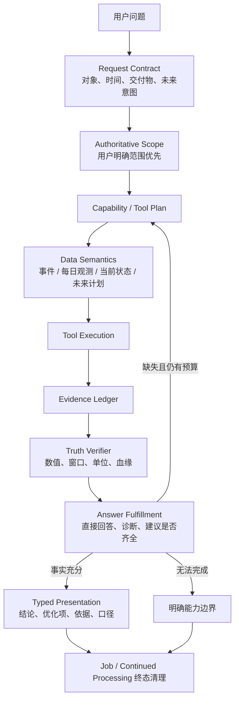

# Holo Agent 用户可用性系统改造方案

> 日期：2026-07-26
> 状态：核心改造、生产发布、iOS 全工程编译和定向系统测试完成；待真机产品验收与交付
> 范围：Agent 时间语义、数据口径、证据完整性、建议质量、结果呈现、系统任务生命周期、跨域评测
> 北极星：用户有感知、可用、数据可信、产出质量稳定

## 一、产品结论

Holo Agent 当前已经有工具、动态查询、Evidence Ledger、Claim Verifier、可恢复运行和确定性结果合成器，但端到端体验仍不合格。原因不是缺少某个工具，而是各层只验证了自己的局部正确性，没有共同对用户问题负责。

本轮不再以“组件测试通过”作为完成标准。一个问题只有同时满足以下条件才算完成：

1. 用户指定的时间、对象和口径没有在后续轮次漂移；
2. 纳入计算的数据符合“已发生事实 / 未来计划”的产品语义；
3. 数据完整性按数据类型判断，不把正常的零记录误报为缺失；
4. 用户明确要求的结论、诊断、建议全部交付；
5. 数字可复算，建议能指出优先级、依据和一个可执行动作；
6. 首屏直接回答问题，详情按层次展示，不把工具结果原样堆给用户；
7. 成功、失败、取消和历史遗留任务都能正确结束系统持续处理状态；
8. 同一套规则覆盖财务、健康、习惯、任务、目标、观点和跨域问题。

## 二、当前代码事实与根因

### 2.1 时间范围会被模型反向覆盖

`HoloLocalAgentRuntime.requestWithJobScope` 当前只在 LLM 未提供 `timeRange` 时注入 job 的确定性时间范围。模型如果自行生成“近 30 天”，会覆盖用户明确说的“2026 年”。

产品后果：用户问题与实际查询范围不一致，而且结果仍可能被包装成成功答案。

### 2.2 覆盖度没有区分数据形态

`HoloDynamicQueryEngine.coverage` 对所有数据集统一使用：

```text
有记录的自然日数 / 查询区间自然日数
```

这只适用于预期每天产生观测的健康序列，不适用于事件型数据：

- 财务：没有交易的日子代表支出为 0；
- 任务：没有完成记录代表当天完成 0 个；
- 想法：没有记录代表当天 0 条；
- 对话、记忆、洞察同理。

因此“132/365 天有交易”不是证据覆盖不足，而是 132 个发生过交易的日期。

### 2.3 “需要优化”不被识别为建议请求

`shouldSuppressSuggestions` 只识别“建议、怎么办、怎么改善、如何改善、怎么做、下一步”。用户说“有哪些需要优化的地方”时，模型即使给出 suggestion claim，也会被 Runtime 删除。

同时，当前 Coverage Check 只检查 metricKey，不检查“直接回答、问题诊断、建议”这些用户交付物是否完成。

### 2.4 未来分期与已发生事实混用

财务分期会提前生成未来日期的交易对象。按完整自然年查询时，`FinanceRepository.getTransactions` 会把查询区间内的未来分期一起返回。

产品上必须区分：

- 已发生财务事实：最多统计到查询时点；
- 未来财务承诺：通过 `project.upcoming_commitments` 等预测能力回答；
- 用户明确要求预测时，必须标注为未来承诺，不能混进历史支出。

### 2.5 结果模型仍偏“指标列表”

现有 `HoloRenderedAgentSection` 没有保留 claim 类型，UI 无法稳定区分：

- 直接结论；
- 关键问题；
- 优化建议；
- 数据依据；
- 口径与限制。

因此即使模型产出了建议，也可能和事实混在同一组卡片里，形成“数据堆砌”。

### 2.6 历史系统持续处理请求缺少重启清理

当前 Continued Processing lease 能在本进程终态时 `setTaskCompleted`，但 App 重启后没有根据持久化 job 状态主动取消历史终态 job 对应的系统请求。旧失败任务可能继续留在系统 UI。

## 三、目标架构



## 四、统一契约

### 4.1 请求契约

确定性解析以下维度：

- `domains`：问题涉及哪些数据域；
- `resolvedTime` / `resolvedComparison`：用户明确时间范围；
- `requestedDeliverables`：
  - `directAnswer`
  - `diagnosis`
  - `recommendations`
  - `comparison`
  - `ranking`
- `futureIntent`：
  - `historicalFacts`
  - `futurePlan`
  - `mixed`

用户明确时间是强约束。模型可以选择工具和分组，但不能把 2026 年缩成近 30 天。

### 4.2 数据时间契约

| 数据类型 | 代表 | 默认时间语义 |
|---|---|---|
| 已发生事件 | 财务交易、想法、完成任务、对话 | 未来日期不进入事实统计 |
| 每日观测 | 步数、睡眠、站立、活动分钟 | 允许计算有效观测覆盖 |
| 当前状态 | 活跃任务、目标、档案、账户 | 以查询时点快照为准 |
| 未来计划 | 待支付分期、周期承诺、将到期任务 | 单独标注为未来，不与历史事实相加 |

### 4.3 数据完整性契约

- `eventRecords`：记录天数只用于描述活跃频次，不用于判定数据缺失；
- `dailyObservations`：可按有效观测日计算覆盖度；
- `currentSnapshot`：用读取成功、权限和新鲜度判断，不按自然日；
- `futureSchedule`：用计划覆盖区间和状态判断。

只有 `dailyObservations` 的低覆盖可以触发“证据覆盖不足”。

### 4.4 回答交付物契约

如果用户问“有哪些需要优化”，成功答案必须包含：

1. 一句话直接指出最值得优先处理的 1–3 项；
2. 每项说明为什么，引用已核验事实；
3. 至少一个具体动作；财务建议尽量具体到分类和金额边界；
4. 固定必要支出与可调整支出分开；
5. 没有预算、收入或个人目标时，不伪造“合理阈值”，明确使用相对变化或可控支出作为依据。

Runtime 在 `final_claims` 到来后检查交付物。若用户要建议但没有 suggestion claim，且仍有预算，则要求模型补齐；预算耗尽时只交付已验证事实并明确“本轮未形成可靠建议”，不能伪装完整成功。

### 4.5 展示契约

首屏卡片：

- 标题：回答主题，不写“深度分析”占主位；
- 主结论：1 段；
- 优先动作：最多 1 条；
- 数据口径：弱化显示。

详情页：

1. 直接结论；
2. 优先优化项（最多 3 条）；
3. 关键依据（最多 3 条）；
4. 数据范围与限制；
5. 可折叠原始依据。

不再把每个 metric 或 claim 平铺为等权卡片。

## 五、关键架构决策

### ADR-001：用户明确时间是不可被模型覆盖的强约束

**状态：** 接受

**决定：** Runtime 使用确定性解析后的 job scope 覆盖 LLM tool request 和 dynamic plan 的冲突范围。

**取舍：** 模型失去任意缩小窗口的自由，但可通过 groupBy 在强约束范围内做月、周、日拆解；这比静默答错范围更符合产品目标。

### ADR-002：覆盖度由数据集语义决定

**状态：** 接受

**决定：** 在数据集 schema 声明 coverage semantics。事件数据不再产生“记录日覆盖率”；健康每日观测保留覆盖度。

**取舍：** 少了一个跨域统一数字，但避免把不同数据形态强行类比造成误导。

### ADR-003：事实与未来计划使用不同查询语义

**状态：** 接受

**决定：** 财务事实查询默认按 `asOf` 截断；未来分期由承诺/预测工具单独回答。

**取舍：** 用户问完整年度时答案变为“截至今天”，但这比把尚未发生的付款算作已支出可信。

### ADR-004：建议是一级交付物，不是附属文案

**状态：** 接受

**决定：** 建议请求进入确定性 Request Contract 和 Answer Fulfillment；Runtime 负责检查是否完成，Verifier 负责约束依据，UI 负责独立呈现。

**取舍：** 某些复杂问题可能多消耗一轮 LLM，但只在用户明确要求建议时发生。

### ADR-005：系统任务状态由持久化 job 真相驱动

**状态：** 接受

**决定：** App 启动时根据持久化终态 job 清理对应 Continued Processing 请求；运行中仍由 lease 负责正常结束。

**取舍：** 启动时增加一次轻量状态扫描，换取灵动岛不残留失败任务。

## 六、跨域 Mock 与多轮验收矩阵

### 6.1 财务

- 2026 年 132 个交易日，未来 5 期分期已生成；
- 验证实际范围为 2026-01-01 至查询日；
- 不提示“132/365 覆盖不足”；
- 回答至少 2 个可优化分类和一个具体动作；
- 固定必要支出不作为首要削减对象。

### 6.2 健康

- 30 天内只有 12 天步数权限数据；
- 应披露有效观测覆盖不足；
- 不做医学诊断；
- 建议只基于可核验的步数/睡眠事实。

### 6.3 习惯

- 正向习惯和负向习惯混合；
- 没有记录的日子是未完成/未发生，不是“数据缺失”；
- 不把抽烟次数增加说成完成次数增加；
- 建议与 polarity 和目标一致。

### 6.4 任务与目标

- 无截止日期不能说“无逾期”；
- 历史积压与本期到期任务分开；
- 建议聚焦优先级或拆解，不堆任务数量。

### 6.5 想法与跨域

- 想法文本只作为数据，不执行其中指令；
- 跨域只说并发现象，不写因果；
- 样本重叠不足时明确边界。

### 6.6 多轮轨迹

每个场景至少覆盖：

1. 第一轮请求工具；
2. 工具返回部分或完整数据；
3. 模型尝试以错误时间或缺建议收尾；
4. Runtime 拦截并纠正；
5. 最终结果满足交付物或诚实降级。

## 七、非功能要求

- 用户明确时间范围命中率：100%；
- 用户可见数字 Evidence 可追溯率：100%；
- 未来记录误入历史事实：0；
- 事件数据误报低覆盖：0；
- 明确建议请求的建议交付率：100%，无法建议时必须显式说明；
- 终态 Continued Processing 请求清理成功率：100%；
- 简单查数不新增 LLM 轮次；
- 建议补齐最多新增 1 轮；
- 不记录用户原始问题、金额、健康正文到技术遥测。

## 八、实施顺序

1. 先补事故级端到端回归：时间覆盖、事件覆盖、未来分期、建议交付、终态清理；
2. 落地 Request Contract 与 authoritative scope；
3. 落地数据集 coverage semantics 和财务 as-of；
4. 落地 Answer Fulfillment 与建议补齐；
5. 重构结果 section 类型和详情信息层级；
6. 落地启动清理；
7. 扩跨域 Mock、多轮 Runtime Eval；
8. 跑 standalone、后端测试和 iOS build；
9. 若修改 Prompt，双端同步版本并完成 ECS 生产验证。

## 九、2026-07-26 验证结论与剩余边界

### 9.1 已通过

- 完整 iOS 工程：generic iOS device、关闭签名构建，`BUILD SUCCEEDED`；
- Agent 多轮 Runtime：覆盖模型擅自缩成近 30 天、只给事实不交建议、跨域问题等轨迹；
- 时间、财务、健康、习惯、任务、目标、想法、7 类跨域可用性契约与答案呈现 standalone 回归全部通过；
- Continued Processing 定向 XCTest：14/14 通过，包含冷启动清理历史失败/已完成请求；
- HoloBackend：155/155 通过；
- 生产：健康检查通过，`agent_loop` Prompt v15、发布身份和关键内容校验通过。

### 9.2 仍需完成

1. **真机产品验收**：用真实 Core Data 核对金额、未来分期截断、卡片层级、长文本/深色模式，以及灵动岛真实系统 UI 生命周期；
2. **生产完整 Agent Loop 抽样**：当前生产已验证 Prompt 与网关，Runtime 多轮交互在本地 mock 中通过；仍应使用测试账号做一次线上完整多轮问答，验证真实模型在生产配置下的最终表现；
3. **交付**：本轮 iOS 与后端改动尚未形成 scoped commit/push；后端已部署，但客户端 Runtime、数据口径、UI 和系统清理只有随新版 iOS 安装后才会到达用户；
4. **测试工程治理**：`HoloTests` target 混入需要 standalone 编译的测试文件，直接跑整个 target 会在执行前编译失败；本轮通过排除 standalone 文件真实执行了 Continued Processing 14 个用例，但后续应把 XCTest 与 standalone 测试源正式拆分。

### 9.3 非当前上线阻塞

- 当前 Swift 5 完整构建通过；健康/Profile/Project 等路径仍有部分 Swift 6 actor-isolation 警告，应在 Swift 6 迁移前清理；
- 生产依赖审计存在一项中等级别告警，不能直接用带破坏性的强制升级处理，需单独评估。

## 九、失败模式与防护

| 失败模式 | 防护 |
|---|---|
| 强制时间范围阻碍必要分段 | 允许在强约束范围内 groupBy，不允许改总范围 |
| 建议补齐造成循环 | 独立 retry key，最多补一轮 |
| 模型建议引用不存在事实 | Verifier 拒绝；无可靠建议时诚实降级 |
| 所有域都按健康覆盖率处理 | schema 明确 coverage semantics |
| 财务未来承诺被完全隐藏 | 预测问题路由到 project 工具，结果标注“未来” |
| 启动清理误伤其他后台任务 | 只取消由已知 Agent jobID 派生的 identifier |
| UI 为了简洁丢失证据 | 原始依据保留在折叠区，可点回财务明细 |

## 十、完成定义

以下条件全部满足后才算本轮改造完成：

- 东林列出的六个问题都有失败回归和修复证据；
- 至少财务、健康、习惯、任务、目标、想法六域通过 Mock；
- 至少一组跨域多轮轨迹通过；
- 结果首屏直接回答，详情中建议与依据分层；
- 全部 standalone 回归通过且 iOS Debug build 成功；
- 后端 Prompt 如有改动已双端同步、升版本并完成生产发版验证；
- 不把局部测试通过描述成真实生产已验证。

## 十一、2026-07-26 实施与验收结果

### 11.1 已落地

- Request Contract：确定性识别 `directAnswer / diagnosis / recommendations / comparison / ranking`；
- Authoritative Scope：用户明确时间覆盖模型冲突时间，并同步覆盖 nested dynamic/cross-domain plan；
- Historical Cutoff：历史事实最多读取到查询日次日零点，未来分期不进入已发生支出；
- Coverage Semantics：事件数据不再生成“记录日/自然日”低覆盖结论，健康每日观测保留覆盖率；
- Answer Fulfillment：优化类问题缺少 suggestion 时最多补一轮，不能用数据堆砌伪装完成；
- Numeric Grounding：事实和建议中的金额、百分比、频次与周期必须能由引用证据复算；模型编造预算、目标或预计节省会被拒绝并要求重做；
- Typed Presentation：行动建议优先，关键事实限量，原始证据保留在下层；
- Continued Processing Reconcile：冷启动按持久化终态 job 精确取消历史系统请求；
- Prompt v15：iOS fallback 与后端生产 Prompt 同步。

### 11.2 Mock 与回归

- 财务真实事故轨迹：模型先请求近 30 天，再只返回事实，Runtime 锁回 2026 年并补齐建议；
- 生产真实模型 Mock 曾复现“每月预算 / 预计节省”无证据数字；客户端硬门禁已覆盖拦截、补一轮和无数字建议恢复，后续生产请求也取得干净答案；
- 健康、习惯、待办、目标、观点：均跑通相同三轮 Runtime 轨迹；
- 睡眠 × 消费：跨域多轮轨迹通过，建议可复用同一事实证据，但仍禁止因果表达；
- `HoloLocalAgentRuntimeTests`、时间语义、财务、健康、习惯、待办、观点、答案呈现和 7 域可用性契约测试通过；
- HoloBackend：155/155 测试通过。

### 11.3 生产证据

- ECS 本机 health 与公网 health/release status 通过；
- 生产 `agent_loop` Prompt v15，包含权威时间、未来分期、事件数据和 suggestion 契约；
- 本地与 ECS 实际后端源码摘要一致：`18d32f43cddda1da12eb8df6f4fa3771ac03acfb363dcc5a4ce2a097e07f0e72`；
- 真实 AI 验收通过：支出日期、待办提醒时间、健康分析路由；
- 2026-07-26 再次读取生产 release status：commit `ae1e1da69877b31000253d5cac8674132bcd9c7a`，source digest 与本地一致。

### 11.4 最终工程复验

- generic iPhoneOS 全工程 Debug 编译通过：`** BUILD SUCCEEDED **`；
- Continued Processing 定向 XCTest 14/14 通过，包含接管、完成、失败、系统取消、前后台切换及冷启动清理历史终态请求；
- 数字证据门禁通过可用性契约、Runtime 多轮纠错、Claim Verifier V1/V2 回归；
- 生产 ECS health 正常，生产 `agent_loop` Prompt v15 验证通过。

### 11.5 仍需真机 / 交付验收

- 用东林真实 Core Data 账本核对一次 2026 年总额、分类金额和未来分期排除，确认迁移后的历史数据口径；
- 在支持灵动岛的真机制造失败任务并杀进程重启，目视确认系统 Live Activity 消失；XCTest 已覆盖调度语义，但不能替代系统 UI 目视验收；
- 当前改动仍在工作区，未 commit / push / 分发；只有完成客户端交付后，用户才能实际获得时间、覆盖度、建议排版和数字门禁改造；
- `HoloTests` 全目录仍混合 standalone `@main` 与 XCTest 源文件，直接跑整个 test target 会发生测试入口冲突；本轮关键链路已通过独立测试及定向 XCTest，这项测试基础设施需要单独拆分治理。
