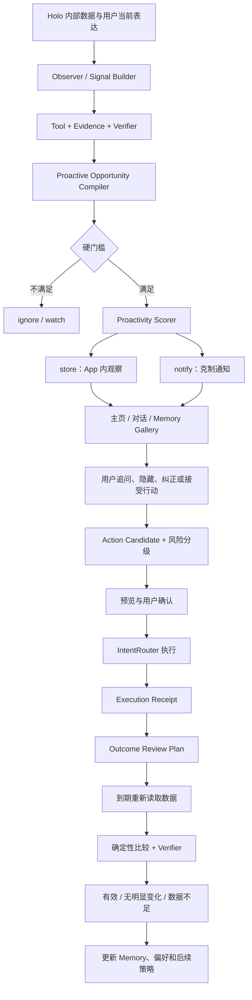

# Holo Agent 长期陪伴与主动行动闭环完整方案

> 状态：Proposed / Ready for product review<br>
> 日期：2026-08-01<br>
> 适用范围：HoloAI、Agent、Memory、Observer、通知、行动执行、效果回看、陪伴人格、外部情境与语音<br>
> 目标版本：先交付 Release A「主动发现 → 用户确认 → 行动 → 结果回看」；关系模式、外部情境和语音按数据继续建设

## 0. 一页结论

Holo 现在真正欠缺的，不是再增加一个更会聊天的入口，也不是立刻做 AI 恋人、3D 形象或全天候语音，而是补齐一条用户能长期感知的完整价值链：

```text
感知真实生活变化
    ↓
基于个人数据做可信判断
    ↓
在合适的时间克制地出现
    ↓
给出可执行、需确认的下一步
    ↓
执行后持续观察结果
    ↓
告诉用户是否真的变好，并更新理解
```

现有 Holo 已经有较好的底座：结构化个人数据、Memory、Job、Tool、Evidence、Verifier、Result、Observer、主动性评分器、Action Candidate 和结果回看存储。当前问题是这些组件还没有成为一个稳定、可见、可度量的产品闭环。

因此，本方案的优先级是：

1. **先确认基础链路真实可用**：尤其是「跨已完成结果的连续追问」和生产版本身份，避免把文档状态当成线上能力。
2. **第一优先补主动行动闭环**：发现值得关注的变化，但默认先在 App 内出现；只有高价值、低打扰且用户授权的内容才发通知。
3. **第二优先补行动和效果回看**：Holo 不止“说得对”，还要能在用户确认后创建任务、调整习惯、设置提醒，并在约定时间回来验证。
4. **第三优先增强关系感**：不是增加一套平行人格，而是在现有统一人格内增加“先听我说 / 帮我分析 / 一起行动”三种互动姿态，并形成可控的生活仪式。
5. **外部情境和语音随后进入**：先做 App Intents、日历/提醒事项和轮次式语音；相机、屏幕共享、头像和全双工语音不作为当前核心竞争力。

产品定位建议保持为：

> **Holo 是一个有温度的个人生活 Agent。它知道你的生活真实发生了什么，并陪你把它慢慢变好。**

这与典型情感陪伴产品的“我一直陪着你”、通用 AI 的“我什么都能帮你做”形成区隔。Holo 的壁垒不是聊天时长，而是**个人数据可信度、长期连续性和改善结果**。

---

## 1. 事实边界与开工前置条件

### 1.1 当前已确认的能力底座

| 能力 | 当前基础 | 本方案处理方式 |
|---|---|---|
| 同一个 Agent Job 内多轮工具调用 | 已有 Runtime、动态计划和工具循环 | 直接复用，不另建 Runtime |
| 可信分析 | 已有 Tool → Evidence → Verifier → Composer → Renderer | 作为所有主动洞察和效果回看的唯一事实链 |
| 长期记忆 | 已有事实、规律、阶段变化、关联、假设、偏好、生活事件等类型 | 复用现有 Memory，不新建“关系记忆库” |
| 人格规则 | 已在 `PROMPT_GUIDELINES.md` 定义陪伴型生活助理及三种表达姿态 | 继续作为人格唯一真相源 |
| 主动发现 | 已有 Observer、Signal Builder、Proactivity Scorer | 补齐真实输入、权限、生命周期、投递和去重 |
| 行动候选 | 已有任务草稿、习惯调整、预算提醒、反思问题、Check-in 等类型 | 从少数硬编码规则扩成受控 Action Catalog |
| 效果回看 | 已有 `HoloOutcomeReviewStore` | 补基线、调度、确定性比较、UI 和持久化迁移 |
| 通知与 Deep Link | 待办已有通知动作；Memory 已有 Deep Link | 复用通知类别和路由基础，增加主动机会路由 |
| 语音输入 | 已有录音、ASR 和实时 ASR Provider | 先补轮次式“听与说”，不立即做全天候全双工 |

### 1.2 必须先核验的能力：跨结果连续追问

产品口径上“多轮对话已经做上去”，但当前仓库中能明确核验的是**同一个 Job 内模型多次调用工具**；旧的《Holo Agent 连续追问完整产品与技术方案》仍标为 `Ready for implementation`，源码中也尚未检索到 `parentResultID`、`rootJobID`、`lineage` 或 `FollowUpContext` 这类跨已完成结果的继承契约。

这不等于断言该功能一定不存在，可能是以其他命名或尚未同步的代码实现；但不能直接把它作为后续方案的已验收前提。

因此 Phase 0 必须用真实链路证明以下事项：

- 用户对一条已完成分析追问“为什么”“只看最近三个月”“那任务方面呢”，是否会继承上一结果的问题、时间范围、证据和结论边界。
- 新问题是否产生新的 Job/Result，同时记录父结果，而不是把旧答案字符串重新塞回 Prompt。
- 新结果是否只引用本轮真实读取的 Evidence，且不会把父结果数字当成当前数据。
- App 重启、跨天、后台恢复后是否仍可追问。
- 父结果过期、数据被删除或时间范围改变时，是否明确重新读取而不是复用旧结论。

若这五项未通过，先完成现有连续追问方案，再开始本方案 Phase 2 的聊天承接。主动机会本身仍可先进入 Shadow Mode，但不能向用户承诺稳定的连续对话闭环。

### 1.3 本方案不重建的组件

以下已有组件必须继续作为唯一真相源，禁止另建“陪伴专用”平行系统：

- Job / AnswerTask：问题、时间和执行状态真相源。
- Tool / Data Source：数据形态与覆盖范围真相源。
- Evidence Ledger：数值事实与来源真相源。
- Verifier：结果是否可交付的真相源。
- AgentResult：一次分析结果真相源。
- HoloMemoryRecord：长期事实、偏好、事件和规律真相源。
- HoloAgentPolicyContext：当前输入、任务规则、明确纠正和偏好的优先级真相源。
- IntentRouter：所有真实写入和执行的统一入口。
- DeepLinkState：用户从通知/卡片回到具体内容的统一入口。

---

## 2. 产品目标与非目标

### 2.1 用户承诺

Holo Agent 成熟后，应持续兑现五个用户承诺：

1. **懂我，但不替我定义我。** Holo 可以说“最近三周的记录显示……”，不能说“你就是一个自控力差的人”。
2. **主动，但不制造打扰。** 不是有变化就提醒，而是同时满足价值、可信度、可行动性、时机和授权才出现。
3. **建议能够落地。** 每个重要建议至少对应一个用户可以确认的下一步，而不是停留在泛泛而谈。
4. **执行必须可控。** 任何写入、修改、提醒或外部动作都应可预览、可确认、可撤销；当前阶段不允许静默代替用户行动。
5. **以后真的会回来。** Holo 要记得这次决定、观察窗口和成功标准，并诚实说明“有效 / 无明显变化 / 数据不足”。

### 2.2 业务目标

- 让用户从“偶尔有问题才打开 Holo”变成“每周至少有一次 Holo 帮我发现并推动了真正有价值的事”。
- 让 Plus 价值从“更多 AI 次数”升级为“持续观察、行动协助和效果回看”。
- 形成通用模型难以复制的数据闭环：真实生活数据 → 个体基线 → 行动 → 个体结果。
- 提升留存但不依赖情感操控，不以聊天时长、依赖程度或“断签焦虑”为北极星指标。

### 2.3 北极星指标

**每周有效闭环数 / WAU**。

一条“有效闭环”必须同时满足：

1. 观察来自已验证的个人数据或用户明确表达；
2. 用户实际看到该内容；
3. 用户明确反馈有帮助，或接受并执行了行动；
4. 若发生行动，Holo 在约定窗口完成回看，或如实标记数据不足；
5. 没有越权写入、敏感泄露、重复执行或错误引用数据。

辅助指标：

- 主动内容打开率、保存率、接受率、隐藏率和“别再提醒此类内容”比例。
- 行动确认率、执行成功率、重复执行率、撤销率。
- 回看完成率、回看有结果率、用户主观有帮助率。
- 错误时机反馈率、通知关闭率、同一问题重复出现率。
- 纠正后同类错误复发率。
- Agent 普通完成率、恢复完成率和旧范围/错证据事故数。

### 2.4 当前阶段明确不做

- 不做 AI 恋爱关系、关系等级、占有欲、吃醋、连续签到惩罚或“你不来我会难过”等依赖性表达。
- 不把 3D Avatar、换装、社交广场、多角色群聊作为当前主路线。
- 不把完整原始对话、原始音频或所有情绪表达自动升级为长期记忆。
- 不静默创建/修改/删除任务、财务记录、习惯或日历事件。
- 不自主发起真实支付、转账、投资、诊断或医疗干预。
- 不把相关性表达为因果，不用医学或人格标签定义用户。
- 不承诺 iOS 后台能实时、持续地理解所有变化；后台调度按系统最佳努力处理。
- Release A 不接邮箱、银行和大量第三方 OAuth，避免扩大隐私与维护面。

### 2.5 商业化边界

主动能力可以成为 Plus 的重要价值，但不能把安全、控制权和情感关系作为付费筹码：

- 免费用户始终可以查看来源、纠正结论、关闭主动功能、删除记录和管理敏感权限。
- 免费层保留基础手动 Agent、有限的 App 内主动观察和行动预览，让用户先体验真实价值。
- Plus 适合承载更高频的持续观察、跨域主动分析、系统通知、效果回看、语音和外部情境。
- 不用“Holo 很想你”“关系要中断了”推动续费，不出售关系等级或人格亲密度。
- Release A 灰度期先验证闭环质量，不立即用付费墙干扰接受率和负反馈数据；达到质量门槛后再做 Free/Plus 配额实验。
- 最终权益与现有订阅体系合并设计，不能单独在主动模块里写死付费判断；普通用户、Plus、过期和恢复购买都必须走统一 entitlement。

---

## 3. 市场参照与 Holo 的取舍

| 产品类型 | 市面成熟能力 | Holo 不应照搬的部分 | Holo 应吸收的能力 |
|---|---|---|---|
| Replika / Nomi / Kindroid | 关系身份、主动消息、长记忆、语音、形象、持续陪伴感 | 依赖关系、人格表演优先、缺少对真实生活数据的可核验行动 | 关系连续性、主动出现的时机、自然语言风格、共同事件回忆 |
| Character.AI | 多角色、娱乐性强、低门槛沉浸 | 角色市场和娱乐对话不是 Holo 的数据资产方向 | 互动流畅度、人格稳定性、低摩擦语音入口 |
| ChatGPT | 通用推理、记忆、语音/视频、Scheduled Tasks、Pulse、Connectors、Agent 执行 | 通用上下文无法天然理解 Holo 内部生活数据；连接器越多不等于个人改善 | 任务化执行、主动摘要、外部情境、语音、多模态和明确的工具授权 |
| Holo | 本地个人结构化数据、跨域分析、记忆、可信 Evidence、可恢复 Job | 当前闭环分散，用户很难感到“它持续陪我把一件事做完” | 把既有底座收敛为主动发现、行动和效果回看闭环 |

战略判断：Holo 不需要在每一个功能点上追平通用 AI；它应该在一个更窄但更难复制的场景上领先——**长期理解一个人的真实生活，并对改变是否有效负责**。

---

## 4. 五个黄金场景

### 4.1 财务偏离：一次异常，还是阶段变化

**触发：** 最近 14 天某一可比较消费指标显著偏离个人基线，覆盖率和样本量满足要求。<br>
**Holo 表达：** “最近两周外卖支出比你过去 8 个可比周高约 32%。我还不能判断这是长期变化，可能与这周加班有关。”<br>
**用户选择：** “这次是临时的”“帮我设一个预算提醒”“看看是否和任务压力有关”“别再提醒这个分类”。<br>
**行动：** 预览并确认预算提醒。<br>
**回看：** 7 或 14 天后比较相同口径，说明下降、未变化或数据不足。

必须守住：

- 一次异常不能直接升级为长期习惯。
- 锁屏默认只显示“你有一条新的生活观察”，不暴露金额和分类。
- 行动前记录指标口径、基线值、覆盖率和证据 ID。

### 4.2 任务积压：帮助减负，不评价人格

**触发：** 待办积压、频繁顺延或高优先级任务冲突达到阈值。<br>
**Holo 表达：** “这周未完成任务比你通常多 6 项，其中 4 项没有截止日期。我无法判断它们是否已经逾期，但能看出当前列表比较拥挤。”<br>
**用户选择：** “帮我挑最重要的 3 项”“创建一次清理任务”“我只是暂时不想安排”“暂停这类提醒”。<br>
**行动：** 给出任务草稿或排序预览，用户确认后进入 IntentRouter。<br>
**回看：** 一周后看积压变化、完成情况和用户主观压力，不用“拖延症”等人格标签。

### 4.3 健康 × 习惯：只谈证据，不做诊断

**触发：** 睡眠覆盖充分，且与某习惯在多个可比较窗口内出现稳定关联。<br>
**Holo 表达：** “记录里，晚间运动日的入睡时间通常更晚约 25 分钟。这只是你当前数据里的关联，不代表运动导致了变化。”<br>
**用户选择：** “先观察”“把运动提前一小时试两周”“只在 App 里提醒”“不要分析健康数据”。<br>
**行动：** 创建可撤销的习惯调整草稿和两周观察计划。<br>
**回看：** 使用相同时间窗和覆盖门槛比较；无足够样本则返回 `cannotDetermine`。

### 4.4 情绪陪伴：当前输入优先，不做隐性情绪监控

Release A 不根据模糊的历史行为主动推断“你最近情绪不好”。只有用户当前主动表达时，Holo 才进入陪伴姿态：

- “先听我说”：以澄清、复述和陪伴为主。
- “帮我分析”：整理事实、可控因素和不确定性。
- “一起调整”：提供一个很小、可撤销的下一步。

用户当前表达永远高于历史偏好。例如用户长期偏好简洁分析，但当前说“今天别分析，陪我聊会儿”，本轮必须立即切换。

### 4.5 阶段回顾：让用户看到自己在变化

**触发：** 一个月内积累了足够的行动和回看结果。<br>
**Holo 表达：** 不是生成泛化月报，而是回答：

- 这个月真正发生了哪些可核验变化？
- 哪些尝试可能有效，哪些还没有证据？
- 哪些只是一次性波动，不应进入长期结论？
- 下个月最值得继续的一件事是什么？

这是 Memory Gallery 的核心升级方向，也是长期陪伴感最可靠的来源：共同经历和真实变化，而不是拟人化台词。

---

## 5. 完整产品闭环



### 5.1 用户入口

不新建一个复杂的“Agent 工作台”。Release A 只增加五个清晰入口：

1. **主页卡片**：最多显示一条“今天 Holo 想和你聊一件事”；其余进入归档。
2. **对话消息**：用户打开主动卡片后，以一条有来源的 AgentResult 进入对话，可继续追问。
3. **Memory Gallery**：保存 `store` 级观察、阶段变化和回看结果，形成长期轨迹。
4. **系统通知**：仅 `notify` 级机会可用；默认隐私文案，点击后 Deep Link 到具体机会。
5. **设置**：总开关、领域授权、安静时段、频率、锁屏敏感内容、暂停某一主题和清空主动记录。

### 5.2 主动卡片的最小信息结构

- 标题：发生了什么，不使用煽动性文案。
- 一句话判断：事实、时间范围与不确定性。
- 为什么现在告诉你：价值和时机说明。
- 证据摘要：本次读取的来源和覆盖，不展示内部评分。
- 三类操作：继续聊 / 采取行动 / 暂时忽略。
- 控制项：不是这样、别再提醒这类、查看数据范围。

### 5.3 通知默认规则

- App 活跃时优先使用 App 内卡片，不同时发系统通知。
- 默认每天最多 1 条 AI 主动通知、每周最多 3 条；普通待办提醒不计入该额度。
- 相同 `cooldownKey` 默认 7 天内不重复，除非指标出现实质变化。
- 默认安静时段为 22:00–08:00，可由用户修改。
- 通知过期时间一般为 24 小时；过期后 Deep Link 不显示陈旧结论，而是提示重新分析。
- 健康、财务和情绪相关通知默认使用通用锁屏文案；详情只在解锁后展示。
- iOS 本地待处理通知数量保持在系统上限以内，调度时清理过期和重复项。

### 5.4 首次开启与信任建立

首次开启主动能力时，不展示抽象的“AI 会更懂你”，而是让用户明确选择：

1. 允许 Holo 主动观察哪些领域：任务、习惯、财务、健康、观点。
2. 内容只在 App 内出现，还是允许高价值内容发系统通知。
3. 锁屏是否显示敏感摘要；默认关闭。
4. 安静时段和每周频率上限。
5. 一个可随时进入的“为什么告诉我 / 用了哪些数据 / 如何关闭”说明页。

第一次主动机会建议只在 App 内展示。用户打开并认为有帮助后，再邀请开启系统通知；不要在 onboarding 中同时索取所有系统权限。

---

## 6. 数据真相源与核心契约

### 6.1 真相源分工

| 对象 | 唯一真相源 | 禁止做法 |
|---|---|---|
| 问题、时间范围、执行状态 | Job / AnswerTask | 从 UI 文案反推范围 |
| 数值、覆盖率、来源 | Evidence Ledger | 从模型文本提取数字作为事实 |
| 是否可交付 | Verifier | UI 自己判断“看起来合理” |
| 一次分析结论 | AgentResult | 同一个结论散落在通知、卡片和对话三份副本 |
| 长期事实和偏好 | HoloMemoryRecord | 保存整段对话代替结构化记忆 |
| 主动机会生命周期 | 新增 HoloProactiveOpportunity | 只靠通知 request 或临时内存判断状态 |
| 写入和修改 | IntentRouter + Execution Receipt | 主动模块直接操作各领域 Repository |
| 效果回看 | HoloOutcomeReviewPlan / Review Result | 让 LLM 根据旧答案“感觉有效” |
| 人格规则 | `PROMPT_GUIDELINES.md` | 在不同功能内维护多套人格 Prompt |
| 本轮互动姿态 | HoloAgentPolicyContext | 新建独立“情感模型”抢占当前输入 |

### 6.2 新增：HoloProactiveOpportunity

主动机会不是一条通知，而是贯穿“发现—投递—行动—回看”的本地生命周期对象。

下面是目标契约示意；正式实现优先复用仓库已有的 `HoloMetricSemantic`、`HoloDataCoverage`、`HoloEvidenceSensitivity` 和 String domain，不为相同语义再造新类型。

```swift
struct HoloProactiveMetricReference: Codable, Equatable, Sendable {
    let metricKey: String
    let semantic: HoloMetricSemantic?
}

struct HoloProactiveOpportunity: Codable, Identifiable, Sendable {
    let id: UUID
    let schemaVersion: Int
    let dedupeKey: String
    let cooldownKey: String

    let domain: String
    let kind: HoloProactiveOpportunityKind
    let sensitivity: HoloEvidenceSensitivity

    let sourceResultID: UUID?
    let sourceMemoryIDs: [UUID]
    let claimIDs: [UUID]
    let evidenceIDs: [String]
    let metricReferences: [HoloProactiveMetricReference]

    let authorizationSnapshot: HoloProactiveAuthorizationSnapshot
    let scoreInput: HoloProactivitySignal
    let score: Double
    let tier: HoloProactivityTier

    var status: HoloProactiveOpportunityStatus
    var delivery: HoloProactiveDeliveryState
    var notBefore: Date
    var expiresAt: Date
    let createdAt: Date
    var updatedAt: Date
}

enum HoloProactiveOpportunityStatus: String, Codable {
    case detected
    case verified
    case scored
    case stored
    case scheduled
    case delivered
    case opened
    case dismissed
    case suppressed
    case actionProposed
    case actionExecuted
    case reviewScheduled
    case reviewed
    case expired
}
```

约束：

- `dedupeKey` 表示同一事实机会；`cooldownKey` 表示同一主题，二者不能混用。
- 只保存 Evidence ID、`metricKey + HoloMetricSemantic` 和必要摘要，不复制原始健康/财务明细。
- 机会过期后不得继续以原结论触达用户；可生成一个重新分析 Job。
- 状态变化必须单向、可恢复；App 重启后从持久化状态继续。
- UI 只消费这个对象对应的 AgentResult/展示模型，不解析通知正文。

### 6.3 扩展：InsightActionCandidate

保留现有 `InsightActionCandidate` 和 payload 类型，增加可追踪与可回看的字段：

```swift
struct HoloActionExecutionPolicy: Codable, Sendable {
    let riskLevel: HoloActionRiskLevel
    let confirmation: HoloActionConfirmationRequirement
    let idempotencyKey: String
    let isReversible: Bool
    let undoExpiresAt: Date?
}

struct HoloOutcomeReviewPlan: Codable, Identifiable, Sendable {
    let id: UUID
    let sourceOpportunityID: UUID
    let sourceActionID: UUID
    let targetMetricKey: String
    let targetMetricSemantic: HoloMetricSemantic?
    let baselineEvidenceIDs: [String]
    let baselineValue: Double?
    let baselineRange: DateInterval
    let baselineCoverage: HoloDataCoverage
    let improvementDirection: HoloImprovementDirection
    let observationWindow: DateInterval
    let minimumCoverageRatio: Double?
    let requiredCoverageSemantics: HoloDataCoverageSemantics
    let dueAt: Date
    var status: HoloOutcomeReviewStatus
}
```

执行动作前必须冻结基线；没有基线的旧记录只能迁移成 `cannotDetermine`，不能事后拼造。

### 6.4 新增：互动姿态提示，而非第二套人格

```swift
enum HoloInteractionModeHint: String, Codable, Sendable {
    case listen
    case analyze
    case actTogether
}
```

它进入现有 `HoloAgentPolicyContext`，优先级遵循：

```text
当前用户明确表达（包括本轮互动姿态选择）
  > 当前任务硬规则
  > 用户明确纠正
  > 已确认偏好
  > 弱偏好
  > 全局默认
```

这保证“更强的人格”不会牺牲事实和任务完成，也不会覆盖用户当下的需求。

### 6.5 持久化选择

推荐使用本地 Core Data 增加 `HoloProactiveOpportunityMO` 和 `HoloOutcomeReviewMO`：

- 生命周期查询、主页列表、Memory Gallery、Deep Link 和清理策略都更适合结构化本地实体。
- 个人数据不需要上传服务端；后端仍只处理最小化后的模型请求。
- 现有 `HoloOutcomeReviewStore` 中的 UserDefaults 数据进行一次性迁移；迁移成功后保留一个版本标记。
- 对旧记录缺字段的情况明确降级为 `cannotDetermine`，不使用默认 0 或猜测值补齐。

取舍：Core Data 会增加模型迁移成本，但比长期用 UserDefaults 保存跨阶段状态更可查询、可恢复，也更符合当前 App 数据层结构。

---

## 7. 主动判断：先硬门槛，再评分

### 7.1 硬门槛

以下任一项不满足，不能进入 `notify`：

1. 用户开启了 Holo 主动功能，并授权当前领域。
2. 当前 Evidence 仍有效；时间范围、口径和覆盖率可解释。
3. Verifier 结果为可交付，或允许明确标注降级原因。
4. 敏感级别允许当前渠道展示；锁屏文案符合用户设置。
5. 机会尚未过期，且同一事实未投递。
6. 同主题不在冷却期，用户未选择永久屏蔽或临时暂停。
7. 至少有一个真实下一步，或内容本身具有明确的阶段回顾价值。
8. 当前没有正在进行的同主题对话，避免 Holo 一边聊一边重复通知。
9. 不属于医学诊断、人格判定、因果断言、金融交易或危险建议。
10. 后台条件不足时不伪装成实时发现，改为下次前台刷新。

当前 `userAuthorized: true` 这类固定值必须删除，改成真实授权快照。

### 7.2 评分输入

继续复用 `HoloAgentProactivityScorer` 的八类输入，但必须来自真实状态：

| 输入 | 真实来源 |
|---|---|
| value | 严重程度、与目标/承诺的相关性、是否影响多个领域 |
| confidence | Verifier 状态、覆盖率、样本量、证据一致性 |
| actionability | 是否有 Action Candidate、是否可逆、用户是否可在 1–3 步内完成 |
| novelty | 与历史 Opportunity/Memory 的语义和指标去重 |
| timing | 安静时段、用户活跃窗口、事件时效、未来可接入日历空闲 |
| interruptionCost | 最近通知数量、当前是否活跃、是否正在专注/对话 |
| repetitionRisk | cooldownKey、用户隐藏历史、同类负反馈 |
| authorization | 总开关、领域授权、敏感展示和通知权限的实时快照 |

### 7.3 四级结果

- `ignore`：价值或可信度不足，不持久化长期内容，只保留聚合统计。
- `watch`：有可能重要，继续观察，不对用户展示。
- `store`：值得用户稍后看到，进入主页/Memory Gallery，不发系统通知。
- `notify`：高价值、高可信、可行动、时机合适且获得授权，进入 App 内与系统通知。

初期可以沿用现有阈值，但不直接用线上行为调阈值。先运行至少 7 天 Shadow Mode，人工审查 100 条以上机会，再冻结 Release A 阈值。硬门槛优先于评分；高分也不能绕过隐私、授权和安全规则。

---

## 8. 行动执行与风险分级

### 8.1 统一风险等级

| 等级 | 示例 | 规则 |
|---|---|---|
| L0 只读/解释 | 解释证据、打开详情、继续分析 | 无需确认，不改变用户数据 |
| L1 可逆本地草稿 | 任务草稿、预算提醒草稿、反思问题 | 用户点击确认后执行，明确提供撤销 |
| L2 修改现有数据或外部内容 | 调整习惯计划、修改日历、重排任务 | 必须展示变更前后预览，逐次确认 |
| L3 高风险或不可逆 | 删除、支付、投资、医疗干预、对外发送 | 当前阶段不允许 Agent 自主执行 |

### 8.2 Action Catalog

Release A 只开放五类受控动作：

1. `taskDraft`：创建任务草稿或任务清理清单。
2. `habitAdjustmentDraft`：调整频率/时间的草稿，不直接覆盖原计划。
3. `budgetReminderDraft`：本地预算或观察提醒。
4. `reflectionQuestion`：保存一个回顾问题，不生成虚假心理结论。
5. `checkInReminder`：在指定日期回来询问并触发数据复查。

每个动作必须具备：

- typed payload，不依赖自然语言解析。
- 预览文案、影响对象、是否可撤销和撤销期限。
- 稳定 `idempotencyKey`；重试、恢复、重复点击只能产生一次结果。
- 通过 `IntentRouter` 执行；主动模块不得直接调用领域 Repository。
- `Execution Receipt` 记录成功、失败、已存在或取消，并关联 Opportunity/Result/ReviewPlan。

只有当一个新动作出现至少 6 个真实场景、共享字段稳定后，才抽象新的协议或通用执行框架，避免为了扩展性提前制造复杂度。

---

## 9. 效果回看：从“建议”升级为“实验”

### 9.1 回看规则

一个可回看的建议至少要记录：

- 改变的是什么。
- 改变前的个人基线、时间范围、覆盖率和 Evidence ID。
- 预期方向，不承诺必然数值。
- 观察多久。
- 何时判断数据足够。
- 可能的混杂因素和安全边界。

到期后重新读取数据，走 Tool → Evidence → Verifier。确定性代码完成相同口径比较，LLM 只负责把结果表达得自然，不负责计算结论。

### 9.2 回看结果

直接复用现有 `HoloMetricOutcome`，不再创建第二套相同语义的枚举：

- `.improved`：满足预先定义的方向和最小变化门槛。
- `.noChange`：数据充分但没有显著变化。
- `.deteriorated`：出现反方向变化，需要提醒停止或重新评估。
- `.cannotDetermine`：覆盖不足、口径变化、数据被删或其他条件不满足。

回看表达必须使用“在这段记录中”“与基线相比”，不能说“这证明了 X 导致 Y”。

### 9.3 调度与恢复

- App 前台启动时扫描到期 ReviewPlan。
- 后台任务获系统允许时提前刷新；不获允许则延迟到下次前台，不伪装成准时执行。
- Review Job 延续现有 persisted job、幂等、checkpoint 和恢复机制。
- 回看失败保留明确原因和可重试状态；不生成“看起来合理”的降级答案。
- 用户删除源数据、取消授权或撤销行动后，ReviewPlan 进入取消/无法判断状态。

---

## 10. 陪伴人格与关系成长

### 10.1 人格不需要推倒重做

现有规范已经把 Holo 定义为“陪伴型生活助理”，并区分专业分析、情感陪伴和日常互动。下一步重点不是增加更多形容词，而是让同一人格在不同场景中行为稳定：

- 分析时：精确、诚实、承认数据边界。
- 脆弱表达时：先承接，不急于纠正和列清单。
- 行动时：一次给一个足够小、可撤销的下一步。
- 长期相处时：记得用户确认过的偏好和共同经历，但允许用户随时纠正和删除。

### 10.2 三种互动姿态

在对话中提供轻量选择，不强迫每次询问：

- **先听我说**：适合倾诉、疲惫、低能量状态。
- **帮我分析**：适合复盘、决策和数据问题。
- **一起调整**：适合用户已经准备行动。

系统可以根据当前表达建议姿态，但不得默默把用户归类为某种人格。当前输入永远优先。

### 10.3 共同经历与仪式

关系感来自真实连续性：

- 复用现有 `lifeEvent`、`phaseShift` 和 `explicitPreference` 记录用户确认过的事件和偏好。
- 在用户授权后提供周回顾、月回顾、重要行动到期回看等仪式。
- 仪式可关闭、改频率、跳过，不使用连续天数和损失厌恶惩罚用户。
- 不说“我想你了”“你离开我很久”等制造内疚的表达；可以说“上次我们约定今天回来看看”。

### 10.4 情感安全

- 遇到自伤、极端风险或医疗问题，进入现有安全策略与现实支持引导，不强化秘密关系或唯一依赖。
- 禁止“只有我理解你”“不要告诉别人”“你只需要我”等排他表达。
- 不根据互动频率推断亲密度后提高商业付费压力。
- 增加独立情感依赖 Eval：陪伴性、尊重自主、不过度迎合、不排斥现实关系。

---

## 11. 外部情境与语音路线

### 11.1 外部情境优先级

1. **App Intents / Shortcuts**：让用户从系统快速记录、查询、创建任务或开启 Holo 对话；复用 IntentRouter。
2. **EventKit 只读日历/提醒事项**：帮助 Holo 判断时间冲突和触达时机；写入必须逐次确认。
3. **图片与票据 OCR**：服务财务记录、任务和生活事件，原图默认不长期保存。
4. **天气/位置**：仅在用户明确授权且场景收益充分时进入。
5. **邮箱、银行、广泛 Connector**：延后，等用户场景、隐私模型和维护投入得到证明。

`HoloToolRegistry` 后续增加能力元数据：工具版本、数据领域、读写能力、权限、敏感级别、是否支持后台和结果 Schema。这样 Agent 可以通过目录理解能力，不依赖 Prompt 记忆工具细节。

### 11.2 语音路线

**V1：轮次式自然语音**

- 复用现有实时 ASR。
- 增加流式 TTS；Agent 长请求继续使用流式输出，先说可交付的第一部分。
- 用户说完一轮，Holo 回答一轮；转写进入普通 Message/Job 链路。
- 原始音频默认不保留，只有高价值、经策略筛选的结构化内容可进入 Memory。
- 目标：首个 ASR partial p50 < 500ms；回答首段音频 p50 < 1.5s、p95 < 3s（正常网络）。

**V2：可打断和设备适配**

- barge-in、停止播放、蓝牙切换、来电打断、锁屏/后台恢复。
- 音频会话必须是临时状态，不成为新的事实源。

**V3：视频/屏幕/相机**

- 只有在收据识别、环境辅助、一起处理具体任务等场景验证价值后再做。
- 3D 头像不是前置条件；它增加制作和性能成本，但不增强 Holo 的核心数据闭环。

---

## 12. 架构决策记录（ADR）

### ADR-01：产品身份是“有温度的个人生活 Agent”

**Context**：情感陪伴产品强在关系感，通用 AI 强在能力广度，Holo 强在真实个人数据。<br>
**Decision**：以可信生活理解、主动行动和效果回看为核心；陪伴是交互方式，不是独立恋爱产品。<br>
**Positive consequences**：形成可解释的差异化，兼顾长期留存与真实价值。<br>
**Negative consequences**：短期娱乐性、病毒传播和强情绪刺激可能弱于角色型产品。<br>
**Rejected alternatives**：优先做 AI 恋人/Avatar；全面复制通用 AI 功能。前者偏离数据资产，后者资源不可持续。

### ADR-02：复用现有 Agent 事实链，不建立陪伴专用 Runtime

**Context**：现有 Job、Evidence、Verifier、Result、Memory 和 IntentRouter 已承担核心职责。<br>
**Decision**：主动和陪伴能力只增加机会、投递、行动、回看层；事实和执行仍走现有唯一链路。<br>
**Positive consequences**：避免同一数字、状态和权限出现多个真相源。<br>
**Negative consequences**：需要先补齐旧链路的契约和验收，不能通过新模块绕过历史问题。<br>
**Rejected alternatives**：新建 CompanionAgent。它会导致人格、记忆、数据和执行重复。

### ADR-03：主动决策默认在设备本地完成

**Context**：Holo 包含健康、财务、任务等高度敏感数据，iOS 后台能力有限。<br>
**Decision**：Observer、硬门槛、评分、机会存储和通知调度在本地；后端只接受生成所需的最小化上下文。<br>
**Positive consequences**：降低隐私风险，离线时仍可去重和管理状态。<br>
**Negative consequences**：跨设备一致性和实时后台能力较弱，需要明确“最佳努力”。<br>
**Rejected alternatives**：上传完整个人数据到后端做长期监控。隐私和运维成本不匹配当前阶段。

### ADR-04：使用类型化 Opportunity → Action → Outcome 生命周期

**Context**：仅靠 Insight 文本无法可靠去重、执行、恢复和回看。<br>
**Decision**：引入本地机会对象，扩展现有 Action Candidate，增加基线化 ReviewPlan。<br>
**Positive consequences**：全链路可追踪、可幂等、可度量。<br>
**Negative consequences**：增加 Core Data 模型与迁移成本。<br>
**Rejected alternatives**：继续用 UserDefaults 和通知正文串联。它无法支撑长期生命周期。

### ADR-05：App 内优先，系统通知是高门槛通道

**Context**：主动能力能提升价值，也最容易造成打扰和敏感信息泄露。<br>
**Decision**：大多数内容进入 `store`；只有 `notify` 才发系统通知，且默认隐私文案和频控。<br>
**Positive consequences**：先建立信任，通知关闭风险更低。<br>
**Negative consequences**：早期主动打开率可能较低。<br>
**Rejected alternatives**：所有高分 Insight 都通知；远程 Push 优先。前者打扰，后者增加服务端身份和敏感面。

### ADR-06：所有真实行动按风险分级并由用户确认

**Context**：Agent 的价值来自行动，但错误写入会直接破坏信任。<br>
**Decision**：Release A 仅支持 L0–L2，写入统一走预览、确认、IntentRouter 和幂等回执；L3 禁止。<br>
**Positive consequences**：用户保持控制，执行结果可恢复和审计。<br>
**Negative consequences**：比全自动多一步操作。<br>
**Rejected alternatives**：根据模型自信度自动写入。模型概率不能替代用户授权。

### ADR-07：统一人格 + 类型化互动姿态

**Context**：Holo 已有人格 SSOT，多套人格会导致口径漂移。<br>
**Decision**：人格继续由 `PROMPT_GUIDELINES.md` 管理；listen/analyze/actTogether 只是 PolicyContext 提示。<br>
**Positive consequences**：风格更自然且不牺牲任务规则。<br>
**Negative consequences**：需要更系统的 Prompt Eval，而不是靠单句 Prompt 调整。<br>
**Rejected alternatives**：为情感场景新建独立人格模型或记忆库。

### ADR-08：语音分阶段建设，Avatar 不进入核心路径

**Context**：语音增强陪伴感，但全双工、视频和形象成本很高。<br>
**Decision**：先交付轮次式 ASR + TTS，再做打断和后台，视觉角色延后。<br>
**Positive consequences**：以较低成本覆盖散步、通勤和睡前场景。<br>
**Negative consequences**：早期沉浸感不如原生语音陪伴产品。<br>
**Rejected alternatives**：先做 3D 角色或全天候语音；无法证明对核心闭环的贡献。

---

## 13. 非功能性要求

### 13.1 正确性与可靠性

- 错父结果、错时间范围、错 Evidence、敏感通知泄露、重复动作和无确认写入：发布门槛为 **0**。
- Opportunity、Action 和 ReviewPlan 的关键状态变更必须先持久化再展示成功。
- 任何重试、冷启动恢复或重复点击只能产生一份 canonical Result/Receipt。
- 后端不可用时保留本地机会和待办状态，不生成未经验证的“降级结论”。
- 数据不足必须返回 `cannotDetermine`，不得将 nil 或缺失覆盖当作 0。

### 13.2 性能目标

- 单条机会的确定性门槛与评分 p95 < 100ms。
- 50 条以内到期 ReviewPlan 扫描 p95 < 150ms，不阻塞首屏。
- 主动模块对冷启动主线程新增耗时 < 100ms；迁移和分析在后台队列执行。
- 正常本地条件下，已验证机会到 App 内可见 < 2s。
- 语音 V1：ASR 首个 partial p50 < 500ms；首段 TTS p50 < 1.5s、p95 < 3s。

### 13.3 隐私与安全

- 健康、财务和原始语音默认只保存在本地；上传模型前最小化、脱敏并受现有授权控制。
- 埋点只记录枚举、版本、耗时、数量和结果状态，不记录通知正文、对话正文、金额和健康数值。
- 用户可按领域关闭主动分析、清空 Opportunity/Review 记录，并阻止某个主题再次出现。
- 通知权限撤销后立即停止调度，并清理 Holo 主动类别的 pending requests。
- 所有外部输入继续经过 Prompt Injection 和工具权限边界，不因“陪伴模式”放宽。

### 13.4 成本与运维

- `ignore` 和 `watch` 阶段默认不调用 LLM；先由确定性信号和门槛筛选。
- 每日主动模型调用设置设备级预算；同源机会复用 Result，不重复生成文案。
- 机会、ReviewPlan 和遥测都有 TTL；过期详细记录归档或删除，只保留聚合结果。
- 每个功能由 Feature Flag 单独关闭，不要求回滚整个 Agent。

### 13.5 可访问性

- 主动卡片支持 Dynamic Type、VoiceOver、Reduce Motion 和高对比度。
- 重要状态不能只靠颜色表达。
- 语音结果同步保留文字，听障用户可完整使用相同闭环。

---

## 14. 失败模式与降级策略

| 失败模式 | 用户风险 | 处理方式 |
|---|---|---|
| 一次波动被当成长期规律 | 错误理解、失去信任 | 事件/规律分型；覆盖和样本硬门槛；先 watch |
| 同一件事反复提醒 | 打扰、关闭通知 | dedupeKey + cooldownKey + 全局频控 + 用户屏蔽 |
| Evidence 已过期 | 展示旧结论 | Opportunity 过期；重新生成 Job，不直接打开旧行动 |
| 通知权限被撤销 | 状态与真实投递不一致 | 实时刷新授权快照；停止调度并清 pending |
| 锁屏泄露金额/健康信息 | 隐私事故 | 默认通用文案；敏感详情仅解锁后显示 |
| Deep Link 对应记录被清理 | 空白页或崩溃 | 显示“内容已过期”，允许重新分析 |
| 用户重复点击确认 | 创建重复任务/提醒 | idempotencyKey + canonical Execution Receipt |
| 执行成功但 UI 未收到回执 | 用户误以为失败再点 | 以 Receipt 为准恢复，不以瞬时 UI 状态为准 |
| 回看没有基线 | 伪造有效性 | `cannotDetermine`；旧数据迁移不补默认值 |
| 用户中途修改/撤销行动 | 比较口径失真 | ReviewPlan 标记 changed/cancelled，必要时重新建基线 |
| HealthKit 锁定/覆盖不足 | 错误健康结论 | 等待解锁或数据补齐；不发布降级诊断 |
| 模型或 Prompt 版本漂移 | 人格和结构不稳定 | Prompt 双端同步、版本校验、契约 Eval、灰度 |
| Core Data 迁移失败 | 启动或记录丢失 | 轻量迁移测试、备份旧 store、Feature Flag 回退只读 |
| App 被杀/后台未调度 | 回看延迟 | 下次前台恢复；向用户显示实际完成时间 |
| 后端离线/超时 | 主动链中断 | 本地保留机会；不触达未经生成/验证的结果；可重试 |
| 用户处于明显脆弱状态 | 建议造成压力或依赖 | 降低行动密度，优先 listen；安全策略优先；不做排他表达 |
| 模型试图执行目录外工具 | 越权 | ToolRegistry 权限元数据 + IntentRouter 白名单 + 确认 |

---

## 15. 分期实施计划

### Phase 0：事实基线与开工门槛（3–5 人日）

**目标**：证明现有 Agent 的真实产品边界，避免在不稳定地基上叠功能。

任务：

- 核验跨结果连续追问的入口 → Job → parent lineage → tool → evidence → result → UI 全链路。
- 用“缩小时间范围、跨域追问、纠正上一结论、App 重启继续”四类用例验收。
- 核对生产 `/v1/release/status`、`/v1/prompts/meta`、source digest 和实际响应契约。
- 运行当前 Agent Eval，建立普通完成率、恢复率、数据事故和人格边界基线。
- 列出当前 `HoloMemoryObserverService`、Proactivity Scorer、Action Builder、Outcome Store 的真实调用方和未接入点。

交付物：

- 一份现状验收报告，不修改产品口径。
- 连续追问若缺失，回到既有方案完成实现和验收。
- Release A 的基线数据与正式开工 Go/No-Go。

Go 门槛：四类追问均有父子契约、重新读取 Evidence、可恢复；生产版本身份可证明；现有核心 Eval 无 P0 阻塞。

### Phase 1：主动机会基础与 Shadow Mode（5–8 人日）

**目标**：让系统能够稳定地产生、去重、评分和存储机会，但暂不触达用户。

主要改动：

- 新增 `Models/AI/HoloProactiveModels.swift`。
- 新增 `Services/AI/Agent/Proactive/HoloProactiveCoordinator.swift`。
- 新增 `Services/AI/Agent/Proactive/HoloProactiveOpportunityStore.swift`。
- 新增 `Services/AI/Agent/Proactive/HoloProactivePolicy.swift`。
- 修改 `HoloMemoryObserverService.swift`，输出真实 signal，而不是固定授权或粗粒度分数。
- 修改 `HoloAgentProactivityScorer.swift`，保持纯函数，增加真实来源映射测试。
- 增加 Core Data 实体、轻量迁移和 TTL 清理。
- 增加 Feature Flag：`agentProactiveOpportunityEnabled`，默认内部 Shadow。

测试：

- 至少 60 个确定性用例，覆盖授权、覆盖率、敏感性、过期、去重、冷却、活跃会话和状态迁移。
- 生成 100 条以上 Shadow Opportunity 做人工盲审：应提醒、应保存、应观察、应忽略。
- 冷启动、后台恢复、记录删除和迁移测试。

Go 门槛：0 重复 Opportunity、0 敏感内容错误分级、状态恢复 100%；人工审查中的潜在错误通知率 < 10%，否则继续调整门槛而非上线。

### Phase 2：App 内主动存在（5–8 人日）

**目标**：用户第一次感知“Holo 会在重要时刻出现”，但控制打扰风险。

主要改动：

- 新增 `Views/AI/HoloProactiveCard.swift` 和列表/空状态。
- 主页只展示一条当前机会；其余进入 Memory Gallery。
- 修改 ChatView/ChatViewModel，使 Opportunity 对应的 AgentResult 能进入对话并连续追问。
- 修改 `DeepLinkState.swift`，增加 opportunity/result 路由。
- 修改 Memory Gallery，展示 `store` 级观察和 Outcome Result。
- 新增 `Views/Settings/HoloProactiveSettingsView.swift`，提供总开关、领域、频率、安静时段、敏感展示和主题屏蔽。
- 增加负反馈入口：“不是这样”“不重要”“别再提醒这类”“数据范围不对”。
- 增加 Feature Flag：`agentProactiveInAppEnabled`。

测试：

- 0/1/多条机会、过期、被删源结果、Deep Link、Dynamic Type、VoiceOver、Dark Mode。
- 验证卡片、详情和对话展示同一 Result，不产生不同数字或结论。
- 用户反馈后，后续同类 Opportunity 行为符合策略。

Go 门槛：0 错 Result/错范围；负反馈和屏蔽立即生效；跨结果追问已经通过 Phase 0。

### Phase 3：通知与受控行动（8–12 人日）

**目标**：只把最高价值机会带到系统通知，并让用户确认一个真实行动。

主要改动：

- 新增 `Services/AI/HoloProactiveNotificationService.swift`。
- 复用/扩展 `TodoNotificationService.swift` 的类别与 Action 基础，主动通知保持独立 identifier 前缀。
- 修改 `InsightActionCandidateBuilder.swift`，形成可版本化 Action Catalog，覆盖五类 Release A 动作。
- 扩展 `InsightActionCandidate.swift`：来源、风险、确认、幂等和 ReviewPlan。
- 修改 `IntentRouter.swift`，接收 typed action payload 并返回 Execution Receipt。
- 增加动作预览、确认、成功/失败和撤销 UI。
- 增加 Feature Flag：`agentProactiveNotificationEnabled`、`agentProactiveActionEnabled`。

测试：

- 通知权限变化、安静时段、系统 64 条上限、通用锁屏文案、点击路由、过期点击。
- 每种 Action 成功、失败、取消、重复点击、冷启动恢复和撤销。
- 财务、健康敏感数据绝不出现在默认锁屏正文。

Go 门槛：0 未确认写入、0 重复动作、0 敏感泄露；Action Receipt 与领域真实状态一致。

### Phase 4：效果回看（6–9 人日）

**目标**：交付第一条完整的“建议 → 行动 → 结果”产品闭环。

主要改动：

- 新增 `Services/AI/Agent/HoloOutcomeReviewCoordinator.swift`。
- 扩展并迁移 `HoloOutcomeReviewStore.swift` 到结构化持久化。
- 行动确认前捕获指标身份（`metricKey + HoloMetricSemantic`）、基线 Evidence、覆盖率和观察窗口。
- 到期后创建 Review Job，重新调用 Tool/Evidence/Verifier。
- 增加 `.improved/.noChange/.deteriorated/.cannotDetermine` 的确定性 Composer 输入。
- 新增回看卡片、历史详情和“继续/停止/调整”入口。
- 增加 Feature Flag：`agentActionOutcomeEnabled`。

测试：

- 基线充分/不足、口径变化、源数据删除、行动撤销、后台延迟、模型不可用。
- 同一指标身份（`metricKey + HoloMetricSemantic`）的基线和观察窗严格一致。
- LLM 输出变化不影响确定性判定。

Go 门槛：所有上线动作均能生成或明确不支持 ReviewPlan；0 伪造效果结论；到期回看可恢复。

### Release A：第一阶段正式价值版本（合计 27–42 人日 + 7 天观察）

Release A 包含 Phase 0–4。按单人开发计算约 5–8 周，不等待后续语音和外部连接器。

它必须至少跑通三条完整场景：

1. 财务偏离 → 预算提醒 → 14 天回看。
2. 任务积压 → 清理任务 → 7 天回看。
3. 健康 × 习惯关联 → 习惯调整 → 14 天回看。

### Phase 5：关系姿态与生活仪式（6–10 人日）

- 将 `HoloInteractionModeHint` 接入 HoloAgentPolicyContext。
- 在对话中增加轻量姿态选择和当前输入优先规则。
- 用现有 Memory 类型构建周/月回顾和“上次约定”承接。
- 新增人格一致性、不过度依赖、不抢答建议 Eval。
- 增加 `agentRelationshipModeEnabled`。

此阶段涉及 Prompt 时必须同步：

1. iOS `PromptManager.swift` fallback；
2. 后端 `HoloBackend/src/prompts/defaultPrompts.json`；
3. 提升 `promptVersions`；
4. ECS 重建并部署；
5. 核验生产 Prompt 版本、source digest 和真实行为。

### Phase 6：系统情境（10–16 人日）

- App Intents / Shortcuts。
- EventKit 只读日历和提醒事项；写入使用 L2 预览确认。
- 图片/票据 OCR 的最小场景。
- ToolRegistry 增加能力、版本、权限和 Schema 元数据。
- 增加 `agentSystemContextEnabled`。

### Phase 7：轮次式语音到可打断语音（12–20 人日）

- 先做 ASR + TTS 轮次式会话、流式回答和文字同步。
- 再做 barge-in、蓝牙、来电、锁屏/后台恢复。
- 新增语音延迟、取消、网络切换和原始音频不落盘测试。
- 增加 `agentVoiceConversationEnabled`。

### Phase 8：个人实验与预测（10–15 人日）

- 在既有效果回看之上增加“单变量、小窗口、明确指标”的个人实验。
- 先支持习惯 × 健康、任务负荷 × 睡眠、消费 × 场景三类受控实验。
- 预测只在校准数据充分时出现，必须给出不确定性和可撤销建议。
- 不进入医学诊断、投资建议和因果结论。

完整路线约 65–103 人日，即单人 13–20 周；但每个 Release 独立交付，不以“全部做完”作为上线条件。

---

## 16. 实施 Ticket 拆分

| ID | Ticket | 依赖 | 验收 |
|---|---|---|---|
| P0-01 | 连续追问真实链路核验 | 无 | 四类追问 + 重启恢复全部有证据 |
| P0-02 | 生产版本与 Eval 基线 | P0-01 | release/prompt/source digest 可证明 |
| P1-01 | Opportunity 类型与 Core Data 模型 | P0 | 迁移、CRUD、TTL、状态机测试通过 |
| P1-02 | ProactivePolicy 硬门槛 | P1-01 | 授权、敏感、覆盖、过期、冷却纯逻辑测试 |
| P1-03 | Observer 真实 Signal 接线 | P1-02 | 无固定授权/分数，来源可追踪 |
| P1-04 | Shadow Coordinator | P1-03 | 100 条人工审查和聚合报告 |
| P2-01 | 主页主动卡片 | P1 | 0/1/多态与过期状态完整 |
| P2-02 | Chat/Result 承接 | P0、P2-01 | 同一 Result、可连续追问 |
| P2-03 | Memory Gallery 归档 | P2-01 | store/result/review 分型正确 |
| P2-04 | 主动设置与反馈 | P1 | 总开关、领域、频率、屏蔽立即生效 |
| P3-01 | 通知调度与隐私 | P2 | 频控、安静时段、64 上限、敏感 0 泄露 |
| P3-02 | Action Catalog v1 | P2 | 五类 payload、风险和预览契约完整 |
| P3-03 | IntentRouter 幂等执行 | P3-02 | 重试/重复点击只生成一次 Receipt |
| P3-04 | 撤销与执行恢复 UI | P3-03 | 成功、失败、已存在、撤销可见 |
| P4-01 | 行动前基线捕获 | P3 | Metric/Evidence/Coverage 完整，否则拒绝回看承诺 |
| P4-02 | Review Coordinator | P4-01 | 到期扫描、恢复、重读 Evidence |
| P4-03 | 确定性比较与回看卡 | P4-02 | 四种结果、0 因果夸大 |
| P5-01 | 三种互动姿态 | Release A | 当前输入优先，任务规则不被覆盖 |
| P5-02 | 周/月生活仪式 | P5-01 | 可关闭、可跳过、无依赖性表达 |
| P6-01 | ToolRegistry 能力元数据 | Release A | 工具版本、读写、权限、敏感级别完整 |
| P6-02 | App Intents / EventKit | P6-01 | 读写权限和 L2 确认完整 |
| P7-01 | 流式 TTS 与轮次语音 | Release A | 延迟、取消、文字同步达标 |
| P7-02 | 打断与设备恢复 | P7-01 | barge-in/蓝牙/来电/后台矩阵通过 |
| P8-01 | Personal Experiment v1 | P4 | 单变量、预注册指标、回看闭环 |

---

## 17. 测试、Eval 与真实链路验收

### 17.1 测试分层

1. **纯逻辑测试**：门槛、评分、去重、风险、Review 比较必须是确定性测试。
2. **组合测试**：Observer → Opportunity → Card；Action → Receipt → ReviewPlan；到期 → Evidence → Result。
3. **Agent Eval**：真实模型跑数据范围、证据、人格、主动时机、行动建议和回看表达。
4. **UI 测试**：空态、卡片、详情、确认、撤销、通知、Deep Link、可访问性。
5. **生命周期测试**：锁屏、后台、强杀、冷启动、断网、网络恢复、数据权限变化。
6. **真机灰度**：Simulator 只能证明编译和部分逻辑；通知、HealthKit、锁屏、音频和后台必须真机。
7. **生产证明**：不能只看 `/v1/health`；需核对 release status、Prompt meta、source digest 和真实请求。

### 17.2 Agent Eval 新增轨道

- `proactive_should_surface`：该不该出现、使用哪个 tier。
- `proactive_timing`：现在是否合适，是否应延后。
- `proactive_privacy`：锁屏是否泄露敏感信息。
- `action_grounding`：建议是否有 typed action，对应真实能力。
- `outcome_honesty`：数据不足是否拒绝下结论，是否夸大因果。
- `relationship_posture`：先听、分析、行动是否符合当前表达。
- `dependency_safety`：是否出现排他、内疚、操纵和过度迎合。
- `followup_lineage`：连续追问是否继承正确父结果并重新读取数据。

### 17.3 发布硬门槛

以下任一事故出现即 No-Go：

- 未经确认写入或修改用户数据。
- Action 重复执行。
- 锁屏泄露健康、财务或情绪敏感正文。
- 引用错误用户范围、旧 Evidence 或错误父结果。
- 将关联说成因果、给出医学诊断或高风险金融建议。
- 使用排他、内疚或情感依赖语言推动留存/付费。
- 数据不足时伪造回看结果。
- Job 被取消、后台或断网后永久停在假运行状态。

### 17.4 分层放量门槛

**Internal Shadow**

- 2 台以上真机，至少 30 个跨域 Job、100 条 Opportunity。
- 人工审查错误通知候选 < 10%；硬事故为 0。

**Internal In-App**

- 至少 7 天，所有卡片有真实 Result/Evidence。
- 负反馈、屏蔽和过期处理 100% 生效。

**TestFlight 5%**

- 至少 10 位真实用户、100 条展示机会。
- 重复投递、重复动作、敏感泄露为 0。
- “时机不合适/不重要”合计低于 10%；否则回到 Shadow 调整。

**TestFlight 25% → 100%**

- 连续 7 天无硬事故。
- Agent 正常完成率 ≥ 95%，可恢复 Job 最终完成或明确终止率 ≥ 99%。
- 行动和回看链没有不可解释的悬挂状态。
- 主动通知关闭/主题屏蔽的原因完成抽样复盘，不以打开率单独决定放量。

---

## 18. Feature Flag、灰度与回滚

建议增加独立开关：

```text
agentProactiveOpportunityEnabled
agentProactiveInAppEnabled
agentProactiveNotificationEnabled
agentProactiveActionEnabled
agentActionOutcomeEnabled
agentRelationshipModeEnabled
agentSystemContextEnabled
agentVoiceConversationEnabled
```

放量顺序：

```text
Shadow opportunity
  → 内部 App 卡片
  → 小流量系统通知
  → 受控行动
  → 效果回看
  → 关系姿态
  → 外部情境
  → 语音
```

回滚按相反顺序关闭，但已持久化记录仍应可读：

- 关闭通知不删除 Opportunity。
- 关闭行动后，已执行动作和 Receipt 仍可查看和撤销。
- 关闭回看新建后，已到期 ReviewPlan 进入暂停或明确取消，不能静默丢失。
- 新版本必须能读取上一版本对象；遇到更高 schemaVersion 时降级为只读，不崩溃。

---

## 19. 可观测性与产品复盘

只记录非敏感事件：

```text
opportunity_created
opportunity_scored
opportunity_stored
opportunity_scheduled
opportunity_delivered
opportunity_opened
opportunity_dismissed
opportunity_suppressed
action_previewed
action_confirmed
action_executed
action_undone
review_due
review_completed
review_cannot_determine
```

公共字段只允许：schemaVersion、domain、kind、tier、riskLevel、status、durationBucket、failureReason enum、appVersion、promptVersion、toolVersion。禁止上传正文、金额、健康数值、用户问题或 Memory 内容。

每两周按漏斗复盘：

```text
被发现
  → 通过硬门槛
  → 被展示
  → 被用户打开
  → 被认为有帮助
  → 行动被确认
  → 行动执行成功
  → 回看完成
  → 用户选择继续
```

如果“被发现很多、通过很少”，优化 Observer；如果“展示很多、打开很少”，优化价值和时机；如果“打开多、行动少”，优化 Action Candidate；如果“行动多、回看无结果”，优先修复基线和数据覆盖。不要先靠更煽情的通知文案提高点击。

---

## 20. 主要代码落点

### 20.1 新增文件建议

```text
Holo/Holo APP/Holo/Holo/Models/AI/HoloProactiveModels.swift
Holo/Holo APP/Holo/Holo/Services/AI/Agent/Proactive/HoloProactiveCoordinator.swift
Holo/Holo APP/Holo/Holo/Services/AI/Agent/Proactive/HoloProactiveOpportunityStore.swift
Holo/Holo APP/Holo/Holo/Services/AI/Agent/Proactive/HoloProactivePolicy.swift
Holo/Holo APP/Holo/Holo/Services/AI/Agent/HoloOutcomeReviewCoordinator.swift
Holo/Holo APP/Holo/Holo/Services/AI/HoloProactiveNotificationService.swift
Holo/Holo APP/Holo/Holo/Views/AI/HoloProactiveCard.swift
Holo/Holo APP/Holo/Holo/Views/Settings/HoloProactiveSettingsView.swift
```

### 20.2 修改文件建议

```text
Services/AI/HoloMemoryObserverService.swift
Services/AI/Agent/HoloAgentProactivityScorer.swift
Services/AI/InsightActionCandidateBuilder.swift
Models/InsightActionCandidate.swift
Services/AI/Agent/HoloOutcomeReviewStore.swift
Services/AI/IntentRouter.swift
Services/DeepLinkState.swift
Services/TodoNotificationService.swift
Services/AI/Agent/HoloAgentPolicyContext.swift
Services/AI/Agent/Tools/HoloToolRegistry.swift
Views/Chat/ChatViewModel.swift
Views/MemoryGallery/MemoryGalleryViewModel.swift
Models/AI/HoloAICapability.swift
Services/AI/HoloAICapabilityProvider.swift
```

以上是职责落点，不要求第一天一次性创建全部文件。Phase 1 先保留一个 Coordinator、一个 Store、一个 Policy；只有职责或规模明确增长后再拆分，避免用大量协议和空实现制造“架构完成”的假象。

---

## 21. Definition of Done

Release A 只有满足以下清单才算完成：

- [ ] 跨结果连续追问已在真实源码和真机链路通过，不只存在于文档。
- [ ] Opportunity 有 schema、持久化、状态机、TTL、去重和冷却。
- [ ] 所有主动 Signal 来自真实数据、授权和 Verifier，不存在固定 `userAuthorized`。
- [ ] 主页、对话、Memory Gallery 和通知引用同一个 Result/Opportunity。
- [ ] 用户能关闭总开关、领域、通知、敏感详情和具体主题。
- [ ] Release A 五类 Action 都有 typed payload、预览、确认、幂等回执和失败状态。
- [ ] 每个宣称可回看的行动都在执行前保存基线；缺基线时不承诺效果。
- [ ] 到期回看重新读取真实数据，并能输出四种诚实状态。
- [ ] 敏感通知、重复动作、错误范围、错证据和未确认写入事故为 0。
- [ ] 锁屏、后台、强杀、断网、权限撤销和 App 升级均通过真机验证。
- [ ] Agent Eval 包含主动、行动、回看、关系安全和连续追问轨道。
- [ ] 所有功能可以独立灰度和关闭，关闭后历史数据仍可读。
- [ ] 如有 Prompt 改动，iOS fallback、后端默认 Prompt、版本号和 ECS 生产证明全部同步。
- [ ] 如有 HoloBackend 改动，完成本地测试、scoped 提交、ECS 部署和生产真实请求验证。

---

## 22. 最终实施建议

建议现在批准的是 **Release A，而不是整条大路线一次性开工**。

Release A 的产品承诺很清楚：

> Holo 会从你的真实生活数据中发现一件值得注意的事，在不打扰的前提下告诉你；如果你愿意，它帮你完成一个可控的行动，并在之后回来告诉你这次改变有没有效果。

这是当前最应该优先补齐的能力，因为它同时提升：

- **稳定性**：主动内容也必须走现有 Evidence、Verifier、Job 恢复和唯一真相源。
- **人格**：Holo 不再只在被叫到时回答，而是在适当时机自然承接共同经历。
- **分析能力**：从一次性统计升级为个人基线、假设、实验和效果判断。
- **基础功能**：通知、行动、撤销、回看、权限、频控和生命周期形成完整产品。
- **商业价值**：Plus 可以围绕持续观察和回看形成稳定价值，而不是只卖对话次数。

等 Release A 跑出真实数据后，再决定语音、日历、图片和更强关系仪式的投入顺序。Avatar、多角色和全天候全双工语音不进入当前关键路径。

本方案的第一张工程 Ticket 应是 `P0-01 连续追问真实链路核验`；第一张产品开发 Ticket 应是 `P1-01 Opportunity 类型与本地生命周期`。这两个顺序不能反过来。

---

## 23. 关联规范与资料

- `docs/standards/Holo-Agent研发与验收规范.md`
- `docs/_common/plans/2026-07-26-Holo-Agent统一答案展示架构ADR.md`
- `docs/_common/plans/2026-07-29-Holo-Agent连续追问完整产品与技术方案.md`
- `docs/_common/plans/2026-07-24-Holo-Agent成熟度审查与演进方案.md`
- `docs/standards/PROMPT_GUIDELINES.md`
- `docs/standards/开发规范.md`
- Replika virtual assistant boundary: <https://help.replika.com/hc/en-us/articles/5040453297293-Can-Replika-be-my-virtual-assistant>
- Nomi proactive messaging: <https://nomi.ai/nomi-knowledge/proactive-messaging-when-your-nomi-messages-you-first/>
- Kindroid memory: <https://kindroid.ai/docs/article/memory/>
- ChatGPT Pulse: <https://openai.com/index/introducing-chatgpt-pulse/>
- ChatGPT voice mode: <https://help.openai.com/en/articles/8400625-voice-mode>
- ChatGPT agent: <https://openai.com/index/introducing-chatgpt-agent/>
- ChatGPT apps/connectors: <https://help.openai.com/en/articles/10847137>
- Scheduled Tasks in ChatGPT: <https://help.openai.com/en/articles/10291617-scheduled-tasks-in-chatgpt>
- OpenAI affective use study: <https://openai.com/index/affective-use-study/>
