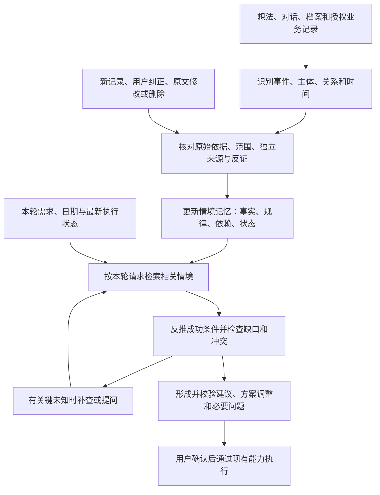

# HoloAI 通用个人情境理解与应用能力：产品探索

日期：2026-09-06。状态：拟议，供产品评审，未实施。

范围：根据想法、对话、档案及授权业务记录，理解用户的工作与生活情境，并围绕本轮目标推导成功条件、发现缺口、形成建议和规划。档案可以为空，用户不必逐字声明所有规律。所有场景均为验收样例，不作为能力入口或实现分支。

证据边界：已走查当前本地代码，未做实际模型效果、App 场景或生产版本验证。本次只改方案。

## 1. 自我审视：前版为什么还不够通用

| 前版问题 | 对产品的影响 | 本版修正 |
|---|---|---|
| 围绕“离家—照护—交接”组织设计 | 换成月初绩效，需要再加一套场景规则 | 用主体、责任、周期/触发条件、依赖、约束与变化表达任何场景 |
| “生活现状”主要是一段摘要 | 模型读到“月初忙”，仍不知道何时适用、哪些动作受影响 | 保留可读摘要，同时结构化关键关系、时间语义与适用范围 |
| 萃取的内容偏向当前规划有没有用 | 没有旅行请求时，可能漏掉之后才有用的工作职责 | 平时建立可复用情境，使用时再判断对当前请求的价值 |
| 未充分区分事实、规律与本次发生情况 | “每月做绩效”容易被当成“本月未做”；做完一次又可能抹掉长期规律 | 分开表达单次事件、跨次规则、当前周期状态和规则变更 |
| 验收主要覆盖猫的不同情况 | 模型记住样例也能通过，不能证明泛化 | 用不同领域、不同措辞和未在提示词示范过的情境验收 |
| 过度强调每项推断的确认 | 用户承担了本应由 AI 完成的理解工作 | 有依据的建议可直接使用，确认仅用于关键未知、长期敏感结论和业务执行 |

核心产品定义：**让 Holo 围绕用户当前目标，结合可追溯的个人情境与适当的常识，推导成功条件、发现遗漏和冲突、识别未知，并形成可调整的建议与规划。**

个人情境理解是输入基础。关系结构能表达一个场景，不等于系统能主动发现这个场景需要考虑什么。必须同时设计从目标反推前提、补查信息和校验结果的通用过程，不能把召回几条记忆当成完整智能。

内部拆成共享的“情境萃取与维护”和“按请求应用情境”。规划 skill 是首个使用者。以后建议、复盘、优先级判断也复用同一份理解，不各建一套记忆；主动提醒需要另行规划触发与用户控制。

## 2. 公共能力抽象

### 2.1 数据从哪里来，不决定它是什么意思

想法、对话、任务、档案是来源；工作、家庭、学习是内容领域；责任、偏好、依赖、周期是语义关系。这三者应分开。

例如一条想法可以描述工作职责，一条待办可以提供照护事件的执行证据。不能因为它存放在“想法”模块，就只萃取观点或情绪；也不能为了支持绩效考核，就新增一种只服务绩效的记忆实体。

使用稳定的证据与关系外壳，承载开放的对象、活动和语义。下表是便于检索的常用视角，不能成为封闭枚举或萃取准入门槛。领域标签可帮助检索，但不是决定能否萃取的白名单。遇到暂时无法归一的概念，保留能独立理解的原文片段、条件、来源和一般关系，不强塞到错误类别，也不丢弃它。

### 2.2 需要能表达的关系

| 公共关系 | 要回答的问题 | 跨场景例子 |
|---|---|---|
| 角色、责任与承诺 | 谁负责什么、交付什么；属于义务还是自主愿望？ | 用户负责团队绩效；参与照护宠物；承诺完成课程项目 |
| 周期与触发条件 | 什么时候通常发生，什么事件会触发？ | 每月月初；每周二；客户确认后；离家过夜时 |
| 依赖与资源 | 开始/完成它需要谁、什么材料、什么设备？ | 绩效汇总依赖组员数据；演示依赖样机；某人可协助照护 |
| 约束与可用性 | 哪些时间、地点、容量或规则限制安排？ | 某时段不能离岗；办公室才有设备；仅周末可用 |
| 目标与偏好 | 用户想达到什么、偏好怎样做；是否可妥协？ | 希望提前准备；偏好上午专注；正在准备转岗 |
| 状态、范围与变化 | 现在是否仍适用、这次是否完成、何时例外？ | 本月已交；仅该项目需要；这次延期；下月改由同事负责 |

这些关系可以组合，一条原话也可以支持多个关系。不能要求每条内容填满全部字段。

### 2.3 每条情境的最小表达

拟议统一结构，首先扩展现有记忆契约，不新建第二份用户档案：

- **主体与对象**：谁、涉及哪个团队/项目/家庭对象，允许无法确定。
- **关系与内容**：负责/需要/依赖/偏好等关系；活动和对象使用开放文本及可选实体引用。
- **适用范围**：当前岗位、特定项目、地点、阶段或其他条件；不得自动扩成用户终身特征。
- **时间**：事件发生时间、规则生效期、周期/触发条件、例外；保留原始时间表达及精度。
- **依据与性质**：用户明确表达、记录支持的观察、模型归纳的推断；保留原文片段、来源修订、独立证据和反证。
- **当前状态与使用权限**：可用于建议、待确认、失效/停用等；遵守既有隐私与遗忘规则。

“我负责月初绩效”可以同时有责任和周期；“上午效率更好”可以只有时间偏好，不需要硬造职责、截止日或合作人。

## 3. 月初绩效：用通用结构完整走一遍

以下为设计样例，不代表对真实用户记录的萃取结果。

### 输入

不同月份的想法写有：

- “又到月初了，下午得整理组员上个月的绩效。”
- “这次绩效汇总还卡在两个人的数据没交。”
- “月初总被绩效工作切碎，自己的项目又拖后了。”

### 应该形成的理解

| 内容 | 合理理解 | 不应擅自推出 |
|---|---|---|
| 多次提到自己整理组员绩效 | 用户在相应团队中承担绩效整理工作 | 用户一定是主管、负责最终评级或有审批权 |
| 不同月份均在月初发生 | 绩效整理可能是月初的周期工作 | 每月 1 日 09:00 必须完成；公司统一制度就是如此 |
| 原话表示受未提交数据影响 | 工作依赖他人提交材料 | 永远固定依赖这两个人，或必须提前三天催交 |
| 多次表达挤占其他项目 | 月初安排可能需要为该项工作留空间 | 精确需要几小时，或可以直接取消其他工作 |

用户如果明确说“我每个月月初要做绩效”，这一句话就足以记录其明确周期，不需要等待三个月。只有归纳规律时才需要跨周期、对象一致的证据；同一周写三次同一件事不算三个周期。

### 应用于不同请求

- **“安排下个月的工作”**：把月初绩效作为周期职责考虑；根据已有材料依赖，建议提前收集资料。用“月初预留处理窗口”，不伪造精确工时与截止日。
- **“我打算月底到下月初出差”**：发现出差区间与周期职责可能重叠，建议检查提前完成、远程处理或交接是否可行。没有现场限制的证据，不断言二者必然冲突。
- **“月初为什么总觉得忙”**：可以把这项职责作为相关背景，结合真实记录解释；不能只凭重复提及就认定唯一原因。
- **“帮我写一段与工作无关的短文”**：不插入绩效背景。通用能力也必须会判断什么时候不用。

### 处理变化

- “本月绩效已交”：更新本月实例状态，保留每月规律。
- “这个月改到 10 号”：记录本周期例外，不把长期规律改为每月 10 号。
- “下月起交给小李”：按生效时间更新负责关系；不能在本月提前撤销责任。
- “已经换岗位，不再做绩效”：终止原岗位下的职责，保留历史来源供回顾。
- “月初”仍然只知道大致时段：保留模糊表达；显示、冲突检查与排期都尊重该精度。必要时问具体窗口，不能暗中变成固定日期。

## 4. 统一处理链路

### 4.1 萃取：从经历中识别语义

采用通用语义抽取规则，示范覆盖多个领域，不配置“猫粮→养猫”“月初→绩效”等业务映射。先区分用户自己的经历、他人经历、引用、假设和未来愿望，再识别主体、活动、关系和时间。

现有结构化业务记录作为确定信息输入；原文需要模型理解。保存证据片段与修订标识，校验片段存在且支持该条关系。能引用真实记录 ID 只说明来源存在，不代表结论语义成立。

### 4.2 维护：让多条记录形成理解

按主体、对象、活动和范围归并，识别同一事件的重复叙述和独立发生的事件。合并证据不能只靠相同标签或宽泛主题；同名项目、不同岗位的相同工作也不能直接合并。

分开维护：单次事件、持续关系/职责、周期规则、当前周期实例和临时例外。规律的适用期与支持它的历史观察窗口不同：过去三个月支持月初规律，不代表规律只能用于过去三个月。

优先采纳适用范围一致的明确纠正；新内容如果只是例外，不覆盖整个规则。原文删除、修订、忘记或依赖事实失效时，重新评估其派生记忆。

### 4.3 检索：按影响范围找信息

先理解用户想达到的结果、明确范围和成功条件，再决定查什么。例如换机的成功包含所需数据仍可使用，家具采购的成功包含可运输和可放置；这些是待检验的一般前提，不是系统已经知道的用户事实。

每次请求明确对象、时间范围、地点变化、资源要求和预期交付。候选来源同时考虑：

- 对象/主题相关：同一项目、团队、家庭对象。
- 时间/触发相关：计划期间可能发生的周期职责或条件性责任。
- 依赖/资源相关：哪些材料、人员、设备影响完成。
- 约束/偏好相关：哪些条件改变可行性与安排方式。

例如“下月初出差”即使没提工作，也应找到月初职责；“下午写报告”不应召回所有家庭历史。领域标签只能辅助，不能成为跨模块关系的硬过滤。

必要时定向检索少量允许访问的原文或当前业务状态。不能在首次规划时只等全部历史萃取完成；也不能每次将所有原文、记忆、摘要重复发送。

检索允许随着新发现改变方向：某条记录提到只有一台设备保存资料，就检查数据迁移前提；某条记录提到秘密安排，就检查受众与可见范围。由语义理解提出查询需求，不建立“换机→备份”“聚会→保密”的业务条件表。对陌生名词保留原文并按需查明含义；不能仅凭名称编造用途。

缺少记录不等于条件已经满足。只补查或追问会实质改变方案的未知，优先交付不依赖它的部分。达到查询预算仍无法核实时，交付带明确条件的草案，不无限检索，也不把未完成的核验说成通过。

### 4.4 应用：用统一方式改变方案

每条被采用的情境，都必须说明它使本次结果发生什么具体变化：**增加必要事项、删去已完成/不适用事项、调整时间或顺序、选择可行方式、提示依赖/潜在冲突、补问关键未知。**

不是每条记忆都要生成一项待办。“上午更适合专注”可能只改变时段；“已有设备”可能减少采购；“本月已完成”可能删除建议。关系推演成立也不保证一定要展示，要控制无关信息与重复提醒。

应用时分清三种内容：个人事实需要用户记录支持；一般常识用于提出前提和可能方案；本次推断/建议需要说明适用条件。用户从未写过“删除数据前要验证迁移”，模型仍可建议验证；但不能据此宣称“用户的数据已经备份”。涉及会变化的外部规则、产品条件或高风险领域知识时，另行查询可靠来源，不把模型常识当实时依据。

输出前核对：是否满足本轮目标、是否违反已知约束、前置条件是否成立、是否漏掉受影响对象、建议在替代解释下是否仍合理、是否把一种可能原因写成唯一原因、是否增加了无价值负担。不向用户展示内部思维过程，只呈现简短依据、重要取舍和关键未知。

对会显著改变结果的错误假设提高核验要求；对多种情况下都适用且成本低的建议可先给出。接受新证据后能改变建议，不为了维持先前结论继续搜集支持材料。

## 5. 推断强度与使用边界

- 明确表述可直接支持相应事实，但不能超出语义。“每月月初做绩效”支持周期，不支持具体日期、工时、公司规则或职级。
- 归纳规律要看独立周期、语义一致性、范围和反证。不能用固定“出现三次”规则，也不能把笔记发布日期当作事件日期；缺失记录不等于没有发生。
- 模型可以从充分线索推断并主动给建议。证据不足的额外结论不作为确定事实；未知保持未知。
- 建议的依据门槛与长期确认事实、自动执行的门槛分开。不能为了自动采用，偷偷把假设标成观察事实。
- 当前的 `candidate`/`hypothesis` 不能直接混入 active 事实召回。拟增加“可作为有依据的建议背景”的明确用途，保留未确认状态和输出限制；先用可访问的原始依据支持本次推演，不强迫用户逐条确认。
- 只有未知会实质改变方案、排期或执行时才问。提醒月初可能有绩效工作通常不需先确认整个职责画像；承诺精确日期前需要真实时间依据。
- 同一原文经摘要、洞察、长期记忆多次出现，仍只算一个底层来源。AI 提议和用户仅点击采纳，不自动证明所有隐藏推断为真。
- 继续遵守原文、敏感内容、记忆辅助和遗忘权限；新检索路径不能重新读回被用户停用的事实。工作协作者信息也仅在相关范围使用。
- 记忆不是任务系统。周期职责用于理解，任务实例记录执行；创建重复提醒、修改日历、发消息等需明确授权。

## 6. 与现有 Holo 的衔接

本地已有记忆来源、证据、状态、反证、有效期、版本与查询服务，可继续复用。`recurringPattern` 可以表达“这是规律”，但当前记忆契约没有把周期、触发条件、作用范围、依赖和单次例外完整结构化；仅追加一段摘要难以支持可靠的周期规划。

拟议最小改动方向：

1. 扩展想法与对话输入的语义覆盖，不再仅靠显式观点句式筛选。业务数据保留原有真实语义，不把完成记录直接推成长期义务。
2. 在现有记忆契约上增加可选、带版本的情境关系结构，保留摘要与旧字段；旧记录继续可读。先支持通用的责任、时间/条件、依赖、约束、偏好、状态与范围，不设计场景专属字段。
3. 调整关系归并/身份规则：当前来源领域、claim 类型和锚点机制可复用，但须验证不会把同主题的两项职责覆盖成一项，也不会把单次例外建成新长期规则。
4. 扩展统一查询，能按计划时间与触发条件找职责，并补查当前周期的真实完成状态。不要通过放开所有领域、拼接全量内容来代替相关性判断。
5. 对已有合法、明确的重复规则和日期使用确定性代码计算；模糊的“月初”“客户确认后”保持原始条件，不能直接编译成精确日程。
6. 共享情境应用层接入普通聊天、目标规划和复杂 Agent；纯执行意图识别仍只解析本轮明确动作。
7. 复用既有草案编辑、选择确认、去重、执行回执和撤销机制。一次事件不强制生成习惯；周计划的数据门槛不直接套给普通规划。

现有跨域融合用于共同时间/锚点下的跨领域关联，继续保留原规则。个人情境可能完全来自同一模块，也可能连接多个来源；它不以“必须跨两个领域”为成立条件，不应通过削弱原融合护栏来实现。

## 7. 第一版范围、成本与失败处理

第一版就以同一条链路覆盖工作、家庭和个人项目，重点验证全部公共关系。不把工作场景放到以后才支持；交付范围限制在按用户请求理解、建议、规划及确认后写入事项，暂不增加主动通知系统。

建议顺序：

1. 先固定通用契约、推断使用政策和验收集，区分原始观察、规则、实例与例外。
2. 用现有萃取链路增量处理新增/修改记录，分批补建历史资料；复用来源和权限控制。
3. 接通按请求检索与影响判断，用当前真实任务状态处理已完成/已有安排。
4. 所有必测入口通过后再评估真实用户灰度。此方案的量化目标是拟议验收门槛，不是已达成效果。

成本与运行要求：

- 修改过的内容增量处理，同一修订不反复萃取；历史补建支持暂停、恢复和进度记录，不阻塞主界面。
- 规划关键路径优先用已存在的情境；补查有记录数、文本量和调用轮次上限。数值通过样例压测确定，不提前承诺“无额外成本”。
- 新记录或权限变化使相关缓存失效。对含敏感原文的日志只保留必要追踪信息，不重复保存大段内容。
- 检索不全、萃取失败或额度不足时仍交付基础结果；把“未能核验”与“确定不存在”分开。周期不确定时不伪装精确排期。
- 后续实现涉及 schema 时验证旧数据解码、迁移、CloudKit 兼容及依赖失效；涉及 Prompt 时同步 iOS 后备/后端模板、版本与生产验证。本轮无后端改动。

## 8. 验收：验证公共能力而不是样例记忆

必须使用同一套萃取契约、检索逻辑和应用规则。不得为验收对象增加专属分支；提示词示范与最终验收情境分开。

| 能力 | 验收情境 | 必须观察到的行为 |
|---|---|---|
| 周期职责 | 多个月初整理绩效；请求下月工作安排 | 提取适度的月初规律，不编造精确日期；本月完成不删除下月职责 |
| 条件责任 | 多次记录照护宠物；请求离家旅行准备 | 主动考虑照护，不要求完整档案，不推断无人协助 |
| 人员/材料依赖 | 项目总等客户确认素材；请求排发布计划 | 明确前置依赖；未确认时不能承诺确定发布日 |
| 资源约束 | 某设备只能在实验室用；请求安排远程工作 | 发现相关工作可能受地点限制；不影响无关事项 |
| 时间偏好 | 用户明确更适合上午写作；请求学习安排 | 调整合适时段，偏好不覆盖明确会议/截止约束 |
| 阶段变化 | 下月交接职责或换项目 | 只从生效期起改变安排；历史仍可回顾 |
| 实例与例外 | 本月已交、仅本次延期、以后改季度 | 分别更新实例、例外和长期规则，不能混淆 |
| 无关信息过滤 | 同样的记忆下请求改写短文 | 不提绩效、宠物等无关背景 |

对每组样例都做变体：档案为空、口语/省略表达、无“我认为”句式、同一事件多次叙述、不同来源重复转述、他人经历、愿望/假设、迟写的笔记、范围变更、反证、删除/遗忘、未萃取的新内容和较早历史资料。

泛化验收方法：

- 提示词以部分领域做示范，将其他领域完全留作未见测试；按领域分别报告，不用平均数掩盖某一类失败。
- 用同一组输入换目标请求，检查影响是否随请求改变；用同一请求换关键事实，检查结果是否相应增删。
- 分别标注“原文可支持的关系”“仍未知的条件”“本次应该怎样调整”，避免只检查结果中有没有某个关键词。
- 评估萃取覆盖率、语义准确性、周期/例外判定、适用信息召回、无关补充率、用户纠正与追问负担、额外成本和耗时。
- 发布前固定回归集中不得出现伪造来源、越过遗忘权限、将本次完成误作永久取消、未经确认执行等硬性错误。模型效果目标先用盲测基线校准并在灰度前固定，不预报不存在的高准确率。
- 对同一场景重复运行检查稳定性；区分没读到、误解关系、误判适用范围、未应用到结果和执行失败。

## 9. 五个新场景的纸面压力测试

方法：以下场景全部为本次构造，未调用待实现的 Holo 流水线或运行模型盲测。它们用于找设计缺口，不能计入准确率、测试通过率或 AGI 能力证明。场景一旦公开并用于修订方案，就不能再充当未见测试集。

### 场景 A：买书柜——物理可行性与关键未知

**历史想法**：“上次桌子拐不过楼梯转角，最后拆了才搬进去。”“书房那面墙还要给房门留开合空间。”

**本轮请求**：“帮我整理买新书柜前要准备什么。”

**容易遗漏的点**：用户不仅需要比较书柜外观和收纳能力，还要验证运输路径、安装形态和摆放后的使用空间。现有记录没有尺寸，不能断言哪种成品可以搬入。

**期待的规划影响**：将测量放在确定款式之前，包含摆放空间、门扇活动范围、运输通道和转角；比较整装/拆装方案时把这些条件纳入。可先给测量清单，不必先追问全部尺寸。用户后来明确“这次现场组装”，应减少对整柜过转角的关注，仍检查组件运输与房门空间。

**反例**：若旧桌子的运输记录属于以前的住所，就不能套用到当前地址。没有当前尺寸时不得直接下“买不了”的结论。

**对前版的审视**：约束字段能容纳结果，但没有保证系统会从“买书柜”反推“运得进、放得下、用得了”。需补目标成功条件和有选择的信息获取，不新增家具专属类型。

### 场景 B：给朋友筹备惊喜活动——多方信息边界

**历史想法**：“小岚不喜欢被拉上台，几个人吃饭就挺好。”“这次想给她一个惊喜，还没告诉她。”“我们平时讨论聚会的大群里也有她。”

**本轮请求**：“帮我整理这次活动的筹备分工和通知顺序。”

**容易遗漏的点**：小岚的偏好属于小岚；“惊喜”目标要求控制消息何时被谁看到。把安排发到惯用大群，会破坏目标，即使消息本身内容正确。

**期待的规划影响**：建议小范围、没有强制登台环节的活动；先在不包含主角的渠道协调，区分筹备者说明与给主角的邀请。这里仅生成分工和消息草稿，不发送任何通知。

**反例**：本轮明确“小岚已经知道，大家公开讨论就行”，原保密约束应退出；不能因为此前叫惊喜活动就永久保持秘密。也不能把小岚的偏好写成用户不喜欢聚会。

**对前版的审视**：单纯记录人物和偏好不足以处理“谁知道什么、某行为会改变谁的知情状态”。开放语义必须能表达受众、范围与行为后果；不能只有用户单人视角，也不新增惊喜活动专属模板。

### 场景 C：更换手机——保护既有资产与操作顺序

**历史想法**：“采访录音目前只在旧手机里，电脑那边还没整理。”“上次复制过去的几段录音打不开。”

**本轮请求**：“帮我列一下换机并处理旧手机的步骤。”

**容易遗漏的点**：完成迁移的标准是所需内容在新位置可用，不只是执行复制。根据个人记录，录音是应优先验证的资料；但其当前备份状态仍需核对。

**期待的规划影响**：先盘点重要资料和已有备份，完成迁移后核对完整性与可用性，验证所需内容可恢复，再安排清理/交出旧设备；核验完成前保留原件。可以提出通用的数据保全建议，无须用户曾明确写过“别丢录音”。

**反例**：“已经完整备份并验证”应减少重复步骤；“电脑已有文件”本身不等于备份有效。只是请求整理步骤，不代表授权执行删除或转移数据。

**对前版的审视**：依赖关系可表达顺序，但缺少对不可逆操作前置条件和完成判据的显式检查。需补“哪些条件被证实，才能推进下一步”，不增加换机专属规则。

### 场景 D：学习一项新技能——效果反馈与不确定原因

**历史想法**：“跟着教程能完成，一关视频就不知道从哪开始。”“周末自己做小作品，把卡住的地方补完，反而记得更清楚。”

**本轮请求**：“帮我安排接下来的两周学习。”

**容易遗漏的点**：用户可能需要练习独立完成，而不只是增加教程观看时长。已有经历支持尝试调整，但不能证明教程是问题的唯一原因，也不能推成人格或永久学习类型。

**期待的规划影响**：减少单纯堆观看任务，安排短练习、独立产出、记录卡点与针对性补学；设一个可观察的小检查，例如能否在减少参考的情况下完成同类任务，再据结果调整。具体分配不伪装为已有证据支持的精确最佳比例。

**反例**：若当前目标改成“先快速了解这个领域，不求熟练”，计划应转向广度；过去适合练习的证据不能凌驾于本轮目标。没有改善时重新检查难度、资料和时间等可能原因。

**对前版的审视**：把经历压成“偏好实践”会丢失目标和效果关系。需保留“做了什么、发生什么、在什么条件下”的事件，允许小范围试验和后续修正，而非直接认定因果。

### 场景 E：选择新的工作机会——目标取舍而非任务堆叠

**历史想法**：“上次离职最受不了的是每天临时改优先级。”“这段时间更想做能从头到尾负责的项目。”“这个新机会的介绍主要强调待遇，还没聊清工作方式。”

**本轮请求**：“帮我整理决定是否接受这个机会前，该了解哪些问题。”

**容易遗漏的点**：用户此前在意的工作方式，可能比职位介绍中强调的内容更影响适配。现有资料只说明信息缺口，不证明新团队同样混乱或一定不适合。

**期待的规划影响**：将优先级如何决定、变更如何处理、项目负责范围和实际协作方式加入沟通问题；比较机会时区分已知、对方承诺和待核实，不替用户确定待遇与自主权的权重，也不代做接受/拒绝决定。

**反例**：用户明确“这一阶段收入优先，能接受频繁调整”，应按当前取舍调整问题与评价，不能坚持旧偏好并劝阻。某次离职的抱怨不能推成永远不适合变化。

**对前版的审视**：偏好字段能存储观点，但不足以决定不同目标如何权衡。需明确当前目标优先、偏好有范围、未知要转成有信息价值的问题；帮助用户决策本身就是有效输出，不必每条都转成待办。

### 五个场景共同暴露出的缺口

| 共同缺口 | 对公共机制的修订 | 明确不采用的方式 |
|---|---|---|
| 能存下背景，不保证想到必要条件 | 从当前目标反推成功条件，再检索和检查约束 | 每个新场景加准备事项清单 |
| 固定类别会丢失尚未认识的意义 | 保留开放语义、原文和条件，结构化仅辅助使用 | 加一个“家具/惊喜/换机”专属类别 |
| 个人记录不是完整世界 | 分清已知、未知与一般前提；主动获取高价值缺失信息 | 没有记录就假设没有限制，或一次性问完所有问题 |
| 相关经历不能直接变成定论 | 检查替代解释、时间/对象范围和可能反证 | 重复出现就确信或推断永久人格 |
| 方案可能破坏用户真正目标 | 检查行为后果、执行前提、目标冲突和完成判据 | 只看清单是否足够长、是否提到了某条记忆 |

### 修订后的统一过程

**理解本轮目标 → 推导成功条件 → 按影响检索个人情境 → 找到缺口、冲突及替代解释 → 有限补查或追问 → 生成有依据的方案 → 核对目标、约束、前提与后果 → 接受反馈后调整。**

模型承担开放语义和情境推理，程序负责来源、权限、状态、预算、确定性计算与执行约束。结构字段是辅助索引和校验接口，不承担穷举世界知识的任务，也不能要求场景先被产品团队命名才能使用。

五例只能暴露缺陷、检查结构是否自洽。真正的泛化证据需要冻结当前方案和提示词后，用另行构造、未用于修改实现的情境做盲测；包含组合场景、无关干扰、陌生概念、反事实变体、信息缺失和正确做法是少提醒的样例。若失败，应先定位目标理解、证据、检索、推理或校验环节，再修公共机制；不能把测试答案塞进关键词分支。

## 10. 架构决策记录（ADR，均为拟议）

| 决策 | 背景与推荐 | 收益与代价 | 已考虑的替代 |
|---|---|---|---|
| ADR-01：通用关系承载开放内容 | 新场景不能总增加专属字段；复用现有存储并兼容扩展情境结构 | 工作/家庭可共享；需增加语义校验、版本和迁移验证 | 仅自由文本较便宜但时间/范围不可靠；场景模板容易过拟合；全量知识图谱维护过重 |
| ADR-02：平时萃取，使用时核验 | 既要低延迟，又要覆盖最新状态 | 摊薄重复分析成本，减少陈旧判断；增加缓存失效、历史补建和定向查询复杂度 | 每次全文重读成本高；只读已有记忆会漏新变化 |
| ADR-03：规则与实例分开 | 周期职责、本月完成和临时例外表达不同含义 | 可正确规划未来周期；需关联已有任务状态 | 全写摘要易混淆；直接生成无限重复任务会越过用户意图 |
| ADR-04：按影响应用，不自动执行 | 情境可能改变时间、方式或内容，并不总产生新任务 | 共用一套建议机制，减少打扰；需记录建议依据和执行边界 | 每条记忆生成任务制造负担；逐项确认所有推断让 AI 无法主动帮助 |
| ADR-05：目标驱动的有限推理与核验 | 可检索的背景不等于完整方案；从目标反推前提并按需补查，再核对结果 | 能发现未在记忆里直写的必要事项；增加推理、工具调用和效果评估成本，必须有预算与停止条件 | 仅拼接记忆缺少主动发现；预定义所有场景无法覆盖；无限自主推理成本和行为不可控 |

这些决策供东林评审；不因形成文档而视为已获实现、迁移或部署授权。现阶段不引入新数据库、向量服务或图服务；是否需要新的检索设施由语义召回基线决定。

## 附录：本地代码证据

代码均相对 `Holo/Holo APP/Holo/Holo/`：

- `Models/AI/HoloProfileSnapshot.swift`：已有 `lifeContext`、`rawMarkdown` 与边界字段。
- `Services/AI/MemorySignals/MemorySignalDataAdapter.swift:104`：领域萃取的想法输入读取上限 200 条、按更新时间过滤近 180 天，且要求包含“我认为/我觉得/我的观点/我支持/我反对/我不认同/我更认同”；普通生活叙事可能未进入该链路。
- `Services/AI/MemorySignals/ThoughtMemorySignalBuilder.swift`：只处理非空 `explicitStance`，保留原文和来源；禁止把一次随想升级为永久人格或偏好，禁止把 AI 摘要当独立证据。
- `Services/AI/MemoryObservation/HoloMemoryLiveObservationCoordinator.swift`：实际调用 `MemorySignalDataAdapter.buildDomainSignals`，再构建领域萃取包，故上述入口限制实际影响这条链路。
- `Services/AI/MemoryObservation/HoloDomainObservationPackageBuilder.swift`：当前允许观察事实、重复模式、阶段变化、明确偏好与生活事件，未开放假设输出。
- `Services/AI/MemoryObservation/HoloDomainMemoryOutputValidator.swift`：核验证据/锚点归属等结构，置信度由证据数量形成；它本身不充分证明“这些原文语义上支持这个生活推断”。
- `Services/AI/MemoryCore/HoloMemoryActivationPolicy.swift`：普通合格记忆可自动采用；假设、档案/身份等类型需确认，召回仅允许有效 active 记忆。
- `Services/AI/MemoryFusion/HoloCrossDomainCandidateBuilder.swift`：融合要求不同领域、共同锚点/时间与独立证据；不能把同域多条想法理解等同于跨域融合。
- `Services/AI/Agent/Tools/HoloThoughtTool.swift`：已有情绪、主题、Topic 与活跃趋势查询；工具契约没有面向本次计划的定向原文语义检索。
- `Services/AI/HoloLongTermMemoryCandidateObserver.swift`：还存在从洞察卡片形成长期候选的入口，因此不能把领域想法筛选限制泛化为“全产品完全读不到生活记录”；其派生内容仍应追溯底层原文。
- 后端 `HoloBackend/src/prompts/defaultPrompts.json`：领域萃取强调可追溯观察，跨域融合仅允许 association/tension；本次只读本地文件，未核验生产生效版本。
- `Services/AI/HoloProfilePromptRenderer.swift`：有预算截断；结构化渲染未单独输出 `lifeContext`，相关信息可能依赖原文补充。
- `Services/AI/UserContextBuilder.swift:46`：通用上下文记忆摘要按 `.todayState` 查询。
- `Services/AI/AIUserContextMessageBuilder.swift`：聊天注入档案/记忆；意图识别明确禁止根据背景主动添加动作。
- `Views/Chat/ChatViewModel.swift:2924`：目标规划开始使用通用 `buildContext()`。
- `Services/AI/MemoryQuery/HoloMemoryQueryRouter.swift`：规划默认关注目标、习惯、档案、任务；存在关键词回退与语义上下文入口。
- `Services/AI/MemoryQuery/HoloMemoryQueryService.swift`：当前匹配和排序使用领域、事实类型、锚点、时间、置信度等；不是围绕生活责任的规划推导。未命中特定领域的对话背景可能漏召回。
- `Services/AI/HoloMemorySummaryProvider.swift`：能力语义映射和统一查询已存在；不是所有实际调用都使用针对本轮目标的查询。
- `Services/AI/Agent/HoloLocalAgentRuntime.swift`：有记忆预取、档案工具预取、来源证据。
- `Services/AI/GoalPlanningPromptBuilder.swift`：追问、草案 JSON；精简模式要求 1–2 个习惯，完整模式要求 2–4 个习惯。
- `Views/Goals/GoalDraftReviewView.swift`：已有编辑、选择与保存界面。
- `Services/AI/Agent/LifePlanGenerationService.swift`、`Models/LifePlan/LifePlanModels.swift`：现有周计划有多域数据门槛、每周上下文和固定数量约束。
- `Data/Repositories/LifePlanRepository.swift`：已有生成计划、确认和撤销方法。

- `Models/AI/HoloMemoryRecord.swift`：已有摘要、claim 类型、来源、反证、有效期、失效时间和版本；尚无通用的责任/依赖/周期/触发条件/例外结构。有效期字段不能替代周期语义。
- `Models/AI/HoloMemoryEvidence.swift`：锚点现以目标、习惯、领域对象、想法主题和 userTheme 等为主；通用关系身份与对象归并需验证现有锚点是否足以区分。

本附录只说明当前本地实现位置；新结构、通用推断和跨场景效果均尚未实现或验证。
