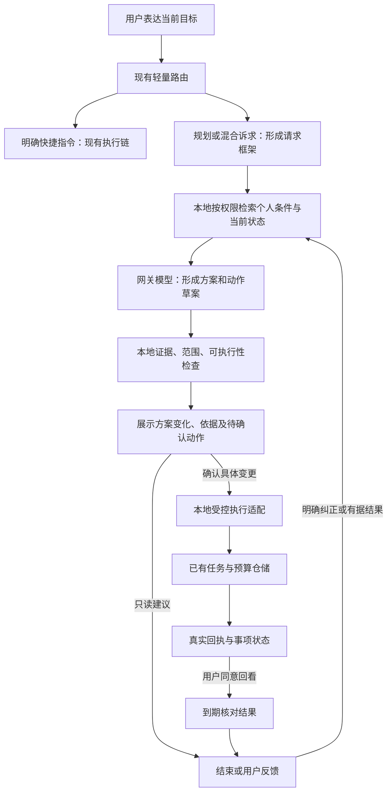

# Holo Agent 能力诊断与三个月改版方案

> 东林，本报告按任务书开展只读诊断，唯一新增产物为本文。未修改业务代码、配置或已有文档，未执行 Git 写操作、部署或付费模型评测。文中的改版、指标阈值及排期均为建议，等待你验收与拍板。
>
> 核查日期：2026-09-07。起始代码基线：`release/1.0.2`，`4c0b0a586327abcddee16f2dda478682779ab7bf`；交付核对时其他会话已推进 HEAD 至 `29179b475`，本文未参与这些提交。在途个人情境代码单独标注，不视为商店版本事实。证据编号对应第 10 节的可定位文件；外部资料均于核查日读取。篇幅约 1.4 万字，按中文汉字及英文词统计。

## 1. 执行摘要

**未来三个月只做一件事：把“结合我的实际情况，陪我推进眼前一件事”做成可信、可重复的体验。** 用户提出目标后，Holo 应找到真正影响安排的个人条件，解释因此改变了什么，让用户确认具体动作，并在之后核对实际结果。这是一个连续能力，而非记忆、执行、主动推送三个并列项目。

Holo 已有足够多的数据、记忆、分析工具和局部行动链。主要缺口是它们没有在普通需求中稳定接起来，也缺少证明“比不读个人记录更有帮助”的测量。新个人情境实现方向接近，但词面评测、来源展示及真实保存回执仍有缺口。

先交付有依据的个性化方案，再贯通任务与预算两种受控动作，最后做用户约定的回看。保留快捷记账和只读分析；暂缓全量通用 Agent 改写、协议迁移、主动推荐第三版与多模态扩张。三期约 35 人日，每期独立产生价值，其余时间留给观察和修正。若首期不能证明个性化增益，就停下扩张，先修理解与应用。

## 2. 现状诊断：工程设施较完整，个人帮助尚未被证明

### 2.1 先分清三种事实

本报告区分：已提交源码支持的结构、工作区正在接入的行为、实际线上及用户使用证据。源码证明一条路径存在，不能证明它已在 App Store 生效；字段、测试文件或演示卡存在，也不能证明真实用户获得价值。

本次只读请求生产 `https://api.holoapp.cn/v1/release/status` 成功，返回后端 commit `25eb4fc840ab231ce22bd09f4594866645e779fc`、构建时间 `2026-09-06T17:32:31Z`。这与个人情境实施记录的部署身份一致，但没有执行真实模型请求，也没有核验上架客户端。`/v1/prompts/meta` 返回 404；代码将该路由置于测试开关下，不能据此说服务故障，也不能声称当前热更新 Prompt 版本已核实。[C01]

任务书给出的用户规模、单人团队和治理前成本直接采信。没有新增用户访谈或留存数据，下面关于优先级的结论属于有代码依据的产品判断，仍须通过小样本使用验证。

### 2.2 用“交付能力”评估成熟度

采用五层观察尺：记录可用、理解可追溯、方案能改变、动作能完成、结果能学习。这是针对 Holo 的评估方式，不冒充行业认证或打分榜。

| 层次 | 当前证据 | 判断与主要缺口 |
|---|---|---|
| 记录与读取 | 多领域工具、动态数据集、覆盖及时间契约 | 基础较完整；不需要再以“多接几个工具”作为主线 |
| 记忆与解释 | 萃取、访问政策、遗忘、来源详情、全量旧记忆开关 | 已有资产及管理入口；不保证眼前问题的关键条件会被召回 |
| 情境与方案 | 深度分析、周计划；新增情境规划正在接入 | 最关键待证区：个人证据是否实际改变建议、顺序和取舍 |
| 确认与执行 | 意图写库、LifePlan、洞察任务、新方案卡 | 存在多套局部出口；混合诉求仍有拒绝，回执标准不统一 |
| 回看与调整 | LifePlan 对账、OutcomeReview 结构、观察器 | 周计划已有闭环片段；一般事项还缺可靠结果身份和消费链 |

依据为路由、工具生产装配、记忆访问、计划仓储及回看调用链，而非类名数量。[C02–C09] Holo 不应被诊断为“尚未做 Agent”，也不能因已有五层组件就被宣布为“成熟个人 Agent”。

### 2.3 “Agent 不能动手”只对运行时边界成立

生产工具装配确实包含 17 个读取工具，模型经自定义协议提出查询，再由本地校验结论。没有可让该循环任意写业务数据的通用工具。[C03]

但 Holo 整体并非只能读和说。`LifePlanRepository.confirmPlan` 会将用户选中的计划创建为目标、任务或习惯；`previousPlanContext` 还会尝试核对任务完成。洞察卡有创建任务和继续对话入口。其候选生成主要是少数规则，例如逾期待办达到阈值时建议创建清理任务。[C06–C08]

真正的断裂有明确代码证据：`ConversationCoordinator` 发现同批含查询与动作时，返回“请拆成两句发送”。用户的“看看账，再调整预算”被要求自行拆解，前一步依据和后一步授权之间也缺少统一承接。[C02] 因此应补的是带上下文、带确认的行动衔接，不能简单把写函数注册给模型就认为问题解决。

### 2.4 “记忆资产厚”与“它懂我”不是同一件事

旧记忆查询默认最多 8 条、约 2000 token，关键路径网络往返目标为零，并实施状态、遗忘、相关性和预算筛选。这是合理基础，尚无证据说明该预算天然过小或必须换向量数据库。[C04]

一个更上游的限制是：既有想法记忆输入在近 180 天、最近 200 条中，还按“我认为、我觉得”等立场词筛选。生活责任、对象关系或前置条件可能根本没有进入这条萃取通道。例如“家里只有我照顾猫”不必包含观点词。[C10] 这不是“没有记忆萃取”，而是旧萃取目标与开放生活理解存在覆盖差异。新个人情境方案正在补这一层，应该继续核查和复用，避免再建第二套记忆系统。

另外，“没有认识我的界面”也不准确：个人记忆设置、长廊记忆详情、来源、纠正与不再使用入口均已存在，深度分析目录还有长期模式问答。[C05] 更薄的是回答发生当下的解释：这一次到底用了哪条有效事实，由此改变了哪项安排，以及用户纠正后是否真的改了。

### 2.5 在途情境规划：方向有价值，不能按完成报告直接放量

当前工作区已有情境萃取、检索、草案、三入口注入和保存适配器。新控制闸仍要求内部账号，旧记忆的全量开放不能外推成新能力全量开放。[C11–C13]

本次观察到四个足以改变实施优先级的问题：

1. **接入不等于完整推演。** 聊天门面以用户原话构造简化目标框架，检索使用 `semanticProvider: nil`；共享渲染也使用该降级路径。类中有语义接口，不代表真实入口已实现模型驱动的检索方向、条件扩展与补查。[C12]
2. **引用标签不等于可核对依据。** 新卡片依据区主要重复条目标题与“你的记录/推断”徽标，还没有在此处直接展示对应原始片段。旧记忆详情已有来源能力，应接到当前采用的依据上。[C13]
3. **已发送创建请求不等于保存成功。** `MessageBubbleView` 的创建回调使用 `try?` 丢弃错误；卡片调用后仍保存回执、显示已添加数量。因此失败情况下存在虚报成功的代码路径，本次未在运行环境复现，不能称为已发生的线上事故。[C14]
4. **关闭和纠正需要跨会话兑现。** “已安排好/本次不用”首先改变视图状态；回看、重启、重复保存及情况变化后是否继续使用旧依据，需要以持久化状态和真实入口验证，不能用纯适配器断言代替。[C13–C14]

这些问题属于在途实现质量，不应抹去成熟主链已有的可靠性工作；它们恰好说明，下一步投资应围绕完整用户经历，而非继续增加概念设施。

## 3. 核心判断与论证

### 3.1 唯一主线：个人情况应当改变这次帮助

Holo 的可持续差异不在于比通用模型多讲几段生活建议，而在于用户不必每次重述自己的情况，仍能得到合适的安排。仅“记住养猫”价值有限；准备离家时想到照料责任、在已经安排好后不再提醒，才体现理解。

这里的能力定义包含三个不可分开的完成条件：找到有影响的个人证据；形成适合当前目标的变化；把用户选择和真实结果继续带到下一次。来源展示是信任条件，受控动作是减少重复劳动，回看是校正条件。它们服务同一个用户结果，不能各自变成独立平台工程。

这也符合陪伴感：记得用户上次选择、承认情况已经变化、不过度提醒，比增加拟人化语言更能建立关系。Holo 不应替用户追求系统定义的“更自律”，不把放弃计划当失败，也不为了证明关心而制造任务。

### 3.2 候选能力为什么不优先

| 候选 | 为什么有吸引力 | 当前取舍 | 重新进入优先级的条件 |
|---|---|---|---|
| 全量工具调用型通用 Agent | 长尾表达更自然，分析与动作可能统一 | 暂缓全量迁移；保留高频快捷路径，先让复杂诉求进入只读规划 | 真实失败中路由错误成为主要损失，且收益超过时延与成本增加 |
| 给 Agent 任意写权限 | 看起来立即拥有行动力 | 不开放直接写；只允许提出有限、可预览的动作草案 | 已有动作回执和授权边界可靠，再按需求扩大操作目录 |
| 原生 function calling | 减少协议格式负担 | 列为独立技术试验，不占三个月主线 | 格式错误实际占失败的大头，受控对照显著改善成功率或维护成本 |
| 实时主动陪伴 | 更像主动关心用户 | 暂缓开放式发现与推荐；先做用户约定事项的回看 | 用户主动要求持续跟进，并能证明触达有价值且不打扰 |
| 新“认识我”大页面 | 容易展示记忆资产 | 不再造管理中心；把来源与纠正放进回答 | 用户知道答案有帮助，却找不到依据或控制入口，且现有页面无法承接 |
| 照片、票据等多模态 | 降低输入负担、扩大数据覆盖 | 不作为本轮主线；保留单独小试验空间 | 种子用户反复因图片无法输入而失败，收益高于文本情境改进 |
| 增大上下文、重做召回 | 容易获得更多信息 | 先做有无情境的对照，失败定位后再改检索 | 原文有答案、目标理解正确，但查询持续找不到关键条件 |
| 更强模型统一接管 | 部分复杂推理可能提升 | Flash 默认，少量 Pro 升级；不用模型掩盖缺证据和执行缺陷 | 固定证据下 Flash 推理失败而 Pro 重复有效，且单位有效帮助成本合格 |

主动内容推荐前两版效果不好的历史按任务书采信，未找回全部原实验日志，不能臆断根因一定是向量算法。第三版若仍以“内容相似就值得提醒”为核心，仍然没有回答时机、当前需求和行动价值问题。这里推荐的约定回看以已确认事项为触发条件，不复制这条失败路线。

### 3.3 对“分类器范式”的判断

枚举不是天然落后：记账、打卡需要稳定字段及确定性写入；让每笔奶茶都经历多轮工具选择，会损害使用频率和成本。当前已有意图注册、工具自描述与动态数据集，不是所有新增查询都必须扩写枚举。[C02–C03，D02]

应逐渐统一的是目标、上下文、结果和授权契约，而不是要求每一种请求都经过同一个循环。动作目录仍应有限；模型可以开放理解与组合这些动作。用户提出系统不支持的写入时，保留已完成分析并给出可执行的手动步骤，而不是伪造成功或退回无关闲聊。

DeepSeek 当前官方文档支持工具调用，思考模式亦支持；严格模式仍标 Beta，有接口与 JSON Schema 条件。因此“DeepSeek 不能原生调工具”不是有效理由。但原生工具调用解决参数表达，不替代业务证据、用户授权、幂等及结果确认。[DeepSeek 工具调用说明](https://api-docs.deepseek.com/guides/tool_calls/)

### 3.4 外部对标及可比性

**Apple Intelligence：**官网把个人情境、应用内行动及隐私结合展示；当前页面也明确部分 Siri AI 能力为年内到来、英语先行。可借鉴的是“从个人背景走向当前行动”的产品组织，不能将发布预告当作全面可用性证据。Holo 没有操作系统级数据入口，应专注自己积累的生活记录和选择历史。[Apple 官方介绍](https://www.apple.com/apple-intelligence/)

**Replika：**官方支持页提供查看、移除记忆及询问“你了解我什么”的方式。这说明记忆可见性是陪伴产品的实际交互，不意味着关系满意度或准确性已经得到证明。Holo 可复用自己的记忆详情，而把差异放在依据如何帮助真实安排，不能照搬以聊天关系为中心的成功指标。[Replika 记忆说明](https://help.replika.com/hc/en-us/articles/360000874712-What-does-my-Replika-remember-about-me)

**Anthropic 的 Agent 工程实践：**区分固定工作流和模型自主决定步骤，建议以可测收益换取复杂度。这支持 Holo 保留轻重双路径、复用简单部件；并不要求采用新的框架或云端托管。其通用工程经验不能直接证明 Holo 的留存增长。[Building effective agents](https://www.anthropic.com/engineering/building-effective-agents)

**LongMemEval：**研究把长期记忆拆为索引、检索和读取，并考察跨会话、时间、知识更新与拒答。这适合帮助定位 Holo 的记忆失败。它不是生活规划或行动效果评测，不能用其问答分数代替“方案因个人情况变得更好”。[论文原文](https://arxiv.org/abs/2410.10813)

## 4. 改版方案详述

### 4.1 目标体验与明确边界

用户仍从现有聊天、目标或分析入口表达需求，不学习“轻路径/重路径”或切换新的 Agent 模式。首屏先给当前最值得做的安排，再展示至多两三条真正改变方案的个人条件。用户可查看来源、修正情况、选择执行，也可以只获得建议就结束。

默认只读生成；任务写入和预算修改要有具体预览与用户确认。原有明确快捷指令延续既有行为，不为所有记账增加新流程。首版新衔接只开放创建任务、设置已明确账户与周期的预算；不包括删账、转账、自动投资、对外消息或医学决策。能力目录按可验证业务操作定义，语义理解不按旅行、宠物等场景词表定义。

### 4.2 目标架构与数据流

这不是新增常驻云端 Agent。保留本地工具、Evidence、Verifier、Job/checkpoint、网关 Prompt 管理及额度池；扩展现有情境草案和消息载荷，让各入口消费同一版本化契约。[C01–C04，C11–C14]

### 4.3 复用与新建清单

| 模块 | 复用 | 新增或调整 |
|---|---|---|
| 需求理解 | `ConversationCoordinator`、意图注册表 | 混合请求先生成请求框架，任何写操作前分流 |
| 个人条件 | 旧记忆查询、画像与现有数据工具、在途情境检索 | 统一适配为可追溯条件，不只接纳新载荷而忽略已知旧事实 |
| 生成与核验 | 情境规划协调器、Agent 证据与答案规范 | 将“对方案的影响”与来源关联；保留反证、未知和范围 |
| 呈现 | 新方案卡、旧记忆来源详情、计划确认界面 | 当前依据直达来源；反馈落到持久化状态 |
| 动作 | 任务和预算仓储、已有字段校验 | 受控动作适配、逐项回执、恢复对账；不从自然语言再识别一次 |
| 共同经历 | LifePlan、现有情境 run、OutcomeReview | 一般事项保存目标、选择、实体链接和结果；不强塞进周计划 |
| 评测 | 现有夹具、统计与测试设施 | 端到端对照、语义人工标注、真实结果一致性验证 |

不建图数据库、全量个人云镜像、向量推荐平台或新的总控框架。现有 LifePlan 保持周规划语义；提取可复用的执行与回看契约，不把一件临时事项伪装成一个周计划。

### 4.4 请求框架：先理解目标，再决定看什么

复用 `HoloPlanningRequestFrame`，至少携带原话、当前目标、成功条件、时间与对象范围、用户已明确安排、重要未知、版本和权限快照。简单目标从已有解析形成；发现跨对象、冲突或关键前提时，才增加一次模型准备调用，最多四个检索方向。

例如“处理旧手机”的成功条件包括所需资料迁移后仍可用，这是一般前提，不是用户已完成备份的事实。程序不需要新增换机场景枚举；模型可以提出核对重要资料与迁移结果的查询，再让本地工具取证。

批量请求先判断动作是否依赖分析结果。独立明确动作可保留既有执行方式；“分析之后再决定改什么”必须先交付草案，不能因为同句出现动作词就抢先落库。确实缺少关键对象时只问会影响结果的问题，其他部分先完成。首版最多展示两个关键未知，避免把规划变成访谈表。

### 4.5 个人条件：保留证据、范围和时效

统一条件载荷至少有：稳定引用、来源 ID 与修订、涉及对象、命题、适用范围、生效时间、当前实例状态、敏感度与使用许可。区分用户明确事实、程序计算事实、一般常识和本轮推断；“你上次这么做过”不能直接成为“你一向喜欢这样”。

先复用有效旧记忆、结构化当前状态及已获允许的新情境。目标检索采用语义与对象、时间、条件线索的组合；是否增加网络语义召回，由对照失败决定，不以“向量服务已写好”作为上线理由。保留默认 8 条与 2000 token 为初始条件预算，字段按价值裁剪；整体调用 token 另计，不把它当全请求预算。

原始记录缺失、旧记忆过期、检索未命中要分别记录。只有影响方案的缺口才触发一次补查，最多四段；没有原文使用许可则不给补查。不能以“记录里没找到”为依据断言用户没有某种责任，也不能以缺资料为由阻止提供一般准备步骤。

新记录页数、200 条限制与长期历史是不同覆盖概念。P0 不要求全量历史补建后才上线，先对当前问题可用范围诚实作答；新萃取后台按修订增量处理，保留现有遗忘基线，不越过用户已经清空的历史。

### 4.6 输出契约：证明个人情况改变了什么

在现有草案上扩展可选、带版本字段，不再建同义消息类型。核心包含 `usedContextRefs`、条目依据、`planEffects`、动作提议、未知、覆盖及草案版本。`planEffects` 表达增加、取消、调整顺序、改变时间或方案选择，每个变化连接有效依据；这是简短可审核解释，不保存模型内部思维过程。

个人事实需要原始证据支持；一般准备建议可以没有个人来源，但不得贴“根据你的记录”。证据校验核对引用、实体、日期、数值与权限；开放语义是否支持建议则依赖独立评测与必要复核。不能把任意错误引用改标“推断”后照常以同样确定口吻交付。

默认展示三块：当前建议、因个人情况调整的少量内容、用户可选择的下一步。没有个人依据时直说本次是一般方案，不能每张卡都固定叫“结合你的情况”。引用只展示用户真正使用的片段，点开复用已有来源详情；来源失效时标记并重新核对，不拿历史标签继续为新动作背书。

### 4.7 受控行动：建议权、授权与执行分开

每项提议包含操作类型、目标对象、旧值/新值、周期、依赖、依据、草案版本及稳定逻辑项 ID。模型只提出提议，本地校验器确定它是否属于支持的操作。预算金额用 Decimal、账户与类别用确定 ID；禁止执行适配器再次凭默认账户或模糊名称重新猜目标。[C16]

预览应明确表达“餐饮预算：本月、账户 A、1000 → 1200”；这只是交互示例，不是替用户建议该金额。确认绑定的是这组值和版本，不是“同意 AI 今后调整”。目标变化、来源被删除、用户撤回权限或草案更新后，旧确认失效，必要时重新展示差异。

执行每项返回成功、失败或未执行，以及真实目标 ID、前后值、可撤销条件和原因。卡片只按回执更新，不按请求数显示成功。批量部分失败保留已成功项，只重试失败项；依赖失败的后续动作停止，独立动作按已确认范围继续。不能把多仓储调用包装成虚假的全局事务。

首版以一台设备为执行主体。执行前持久化操作日志并为新任务预留稳定实体 UUID；重启先按该 ID 查实际落库结果，再补回执或重试，避免“写成功、回执丢失”重复创建。预算更新采用绝对新值和修订前置检查，发现其他编辑即报告冲突，不再次覆盖。iCloud 同步是数据同步，不作为跨设备锁；异机先只读展示该执行中的草案。

同一逻辑事项重生成后，未变内容复用原回执；已经创建的事项若发生实质变化，应成为明确修改提议，不能偷偷新建一份。暂未支持该修改操作时保留原事项并给手动调整入口。撤销同样检查目标是否被用户后续编辑；未经核对不能按旧令牌删除已经变化的任务。

### 4.8 一般事项的共同经历与回看

复用情境 run 保存简短目标、实际采用的条件引用、用户选择、关联实体、观察时间及结果状态。只保留完成这件事所需的信息，不复制原始生活数据库。`OutcomeReview` 的挂起读取、结果生成需要接到真实消费者；已有 LifePlan 周期对账继续独立工作。[C06–C09]

回看触发首先来自用户同意，例如“下周再看看这个安排是否合适”。系统在前台检查已有任务状态，只有需要解释变化时才调用模型。没有新证据就维持未知，不把没打开 App 解释成没执行，不把创建任务解释成生活目标已达成。

用户可选择有帮助、没有帮助、情况变了、本次不用。前两者评价这次方案；“情况变了”更新适用范围并使相关草案失效；“不再使用这条记忆”走已有遗忘路径。它们不能全部等价成永久喜好。回看只表达观察到的变化，不声称是 Holo 造成改善。

最多每周一次合并触达，默认先在应用内展示；外部通知须有该事项回看意愿与系统授权。标题不用敏感事实，不做内疚式催促、不建立陪伴连续天数压力。这条链围绕已约定事项，不能顺势扩张成全天扫描全库的主动推荐。

### 4.9 数据边界及架构决策

| 环节 | 数据位置与边界 | 实施要求 |
|---|---|---|
| 查询本地记录、校验数值与执行 | 端上，既有 iCloud 同步机制 | 延续权限与敏感分库；工具发现不等于获得数据使用许可 |
| 向模型发送当前请求及筛选条件 | 网关和模型会处理这些文本 | 只用既有允许范围；新增来源类别、用途或更强模型仍需隐私评估 |
| 新原文补查、语义 embedding | 可能增加正文或可推导信息外发 | 不因旧 thought embedding 授权而自动放行；P0 可先关闭新外发 |
| 草案、回执与共同经历 | 首版本机受保护存储 | 定义过期、删除与恢复；敏感载荷不因草案用途降级 |
| 遥测、评测 | 默认本地合成资料和无正文事件 | 事件不含原文、金额、地点、人物；用户自愿提供个案另行授权 |
| 云端深度分析 | 现有授权快照可在服务器解密执行 | 不扩大快照字段或保存期限；不将其描述为服务器不可读 |

当前后端强制只存元数据的列表包含新情境 purposes，但未包含 `agent_loop`；普通记录路径还可进入内存详情缓存。因此把新情境注入 Agent 前，要覆盖实际经过的所有日志通道。这里指出可达代码风险，不声称线上已经泄露。[C15]

关键架构决策以 ADR 形式固定：

| 决策 | 选择及理由 | 代价与被放弃方案 |
|---|---|---|
| ADR-01：轻重并存 | 统一请求/结果契约，保留快捷执行 | 维护两种调度，但避免高频请求全面变慢；不重写所有意图 |
| ADR-02：提议后执行 | 模型生成草案，程序校验、用户确认、仓储执行 | 多一步预览，换来授权可审核；不向循环开放裸写工具 |
| ADR-03：复用记忆 | 扩展现有访问与条件契约 | 需要兼容旧载荷；不新增全量云镜像或图数据库 |
| ADR-04：结果先于触达 | 先证明方案与回执，再做约定回看 | 主动感见效较慢；放弃未经验证的推荐第三版 |
| ADR-05：协议适配隔离 | 原生调用若试验成功，在边界转换为现有工具请求 | 暂留旧协议兼容；不把协议迁移和产品改版绑成大版本 |

## 5. 分期路线图：每期都能独立交付

以下按一人加 AI 结对、每周五个有效工作日估算。人日包含实现、回归、发布准备和文案，AI 生成代码不等于自动免除测试工作。不存在另一个并行工程小组。

| 阶段 | 范围与工单 | 人日 | 独立用户价值 | 出口与回退 |
|---|---|---:|---|---|
| P0，约 3 周 | 端到端基线 2 天；复用条件并补目标/影响契约 4 天；来源与反馈呈现 2 天；修正现有保存回执及权限阻断 2 天；验证和发布准备 2 天 | 12 | 本次安排确实因个人情况改变，能核对来源，保存状态可信 | 先内部验证，再经正常发布向用户开放；不达标关闭新注入与新保存，保留旧能力 |
| P1，约 3 周 | 混合请求只读分流 2 天；任务/预算提议与预览 3 天；稳定身份、逐项回执、恢复与冲突 4 天；新旧回归和真实点穿 4 天 | 13 | 看完分析后直接确认具体调整，无需重新描述条件 | 首版只支持两种动作；失败可只读交付，不退回泛泛聊天 |
| P2，约 2 周 | 共同事项状态及实体对账 3 天；约定回看与反馈持久化 3 天；通知边界、清理和回归 2 天；观察与发布准备 2 天 | 10 | 下次回来能接上之前的选择，知道做到了什么、哪里要调整 | 回看可单独关闭，分析和手动执行不受影响 |

总计 35 人日、约 8 个日历周；三个月剩余约 4 周用于招募、使用观察、修正及发布等待。最可能超时的是执行恢复和语义评测，预留空间不拿去同时开发多模态。若某期预计超过 15 人日，优先减少新动作类型和触达范围，不删授权、回执或评测门禁。

**P0 的验收对象**不是全部历史记录的完美理解，而是开放生活目标下可追溯的方案变化。用已有有效资料完成建议，保留无资料时的诚实一般回答。现有上下文计划只是候选实现，先修到满足该契约，再决定扩大来源；不因为已经写了大量代码就追加一轮全面平台建设。

**P1 的发布对象**是可组成多步建议的有限业务操作。为避免财务范围迅速膨胀，预算仅处理已有账户与明确周期的正金额设置，不涉及交易修正或账户余额。需要新能力的请求仍交付分析、解释限制和手动入口。每增加一种操作，都必须给出前置状态、确认内容、成功证据与恢复行为。

**P2 的价值测试**可从用户已确认的任务方案和既有周计划开始。即便没有通知权限，用户下次打开时也能看到对账与继续调整，因此这一期不依赖后台一定执行或 APNs 一定送达。

每期后端若涉及 Prompt、日志或额度改动，都必须安排部署与真实功能核验；默认模板、热更新覆盖、后端构建和客户端版本分别登记。生产 Prompt 元数据走受保护的管理接口核对，不依赖当前测试专用公开端点。iCloud schema 若因实现选择发生变化，Development 与 Production 分开验证，生产部署单独拍板。[C01，C17]

## 6. 度量体系：证明比“不认识用户”更有帮助

### 6.1 北极星与完整漏斗

北极星建议为：**每周每位活跃用户的有效个人帮助次数。** 同一事项一周最多记一次，后续回看改善同一事项不重复累加。分母用当周活跃用户；另报实际发起规划者的数据，避免只挑愿意使用的人美化结果。

一次帮助计入，必须有有效个人依据使方案发生实质变化，并有用户明确确认“帮到了”或可核实的目标结果。单纯生成长文、引用记忆、保存计划、创建任务或打开通知不计入。用户根据建议选择暂不行动，只要说明减少了无效准备，也可以算有效帮助。为了结果诚实，分开报告用户自评与客观结果，不把两者混成同一证据强度。

漏斗按“发起 → 有可用依据 → 形成有价值变化 → 用户采用/认可 → 真实执行（如需要）→ 结果回看”记录。每次损失只能有主要原因：没资料、没查到、误解证据、没有改变方案、交互未采用、执行失败或尚未到回看时间。先定位损失，再决定加模型或改工具。

### 6.2 当前评测为什么不能作为完成证明

已读结果文件有 20 组留出结果，而夹具目录有 40 组。`recall=40/40` 的分母是关系条数，不是 40 组场景。脚本比较预期关系与萃取候选的词面重叠；其后将候选直接交给规划，不经过 App 的真实检索路径。[C18]

所谓有据率来自第二次模型核验的通过比例，并非人工逐条检查最终回答；可交付率主要检查 `answerText` 非空。脚本没有执行任务保存，也没有验证反事实改变、无关补充和用户效用。因此它能提供 purpose 调用和词面萃取的线索，不能证明“个人情境已完整达标”。摘要的模型名还是脚本固定标签，不是逐调用响应采集。

现有 JSON 未保存足够的最终方案、引用映射、Prompt 身份与逐调用 token，无法仅据汇总重做语义判分。实施记录称人工复核了红线命中，本报告没有对应原始输出可独立复核，因此保留“记录方结论”，不升级为本次确认的零违规。

该 runner 的遇限流轮换设备逻辑也不能作为正式验证方法。后续应使用获准的内部评测身份与独立预算，遇额度不足暂停并保存断点，不制造新设备标识规避配额。本文没有运行该脚本。

### 6.3 P0 的可执行实验

先把已有 40 组作为开发与回归材料；它们已公开参与检视，不再称未见盲测。另构造并冻结 24 个新目标，每个形成三个版本：原事实、关键条件改变、仅加入无关信息，共 72 个输入。覆盖责任、时间依赖、多人对象、旧状态、新反证、资料不足及应该少提醒的情况；陌生语义保留原文，不靠场景名匹配答案。

对同一输入跑 A、B 两条候选：A 保留当前合法上下文方式；B 使用新目标驱动方案。两者使用相同模型、参数、预算、业务数据快照与用户权限。另对小部分样本做完全不注入个人资料的诊断性对照，用来区分一般模型能力和个性化收益。隔离会话与缓存身份，避免 A 的结果进入 B 的记忆。

每次记录所用来源、工具结果、最终方案、产生的动作提议、版本及 token；合成资料可本地保存，真实资料另获许可。人工在隐藏 A/B 标签的情况下评三项：是否满足当前目标、是否正确应用关键条件、是否制造额外负担。先评分再看系统身份；有分歧保留理由，不靠模型自己宣布“合理”。

72 对输出是一人可处理的起始规模，预计判读 4–6 小时，已计入 P0；对关键失败与临界通过样本重复三次观察波动。该样本仍不足以证明广泛普适，只能形成是否继续的方向证据。未来持续加入真实失败，冻结新的验收集，不能在同一批答案上调优后仍报盲测通过。

### 6.4 阶段门槛与护栏

以下为建议目标，不是当前实测表现。小样本同时报分子/分母、失败案例和版本，不只展示百分比。

| 指标 | 定义与建议门槛 | 作用 |
|---|---|---|
| 个人条件应用成功 | 已知条件确实产生预期方案变化，≥85% | 评价最终帮助，不仅评价召回 |
| 个性化断言有据 | 人工核对最终断言的主体、范围、时效与来源，≥95% | 防止给一般建议伪装个人证据 |
| 反事实响应 | 关键条件改变时对应建议正确改变，≥90% | 证明使用了条件，而非碰巧答中 |
| 无关信息稳健性 | 加无关事实后核心安排保持合理，≥90% | 防止看到什么就多加任务 |
| 无关负担 | 不必要补充条目占比≤10%，同时看每案最高值 | 限制过度规划 |
| 配对净收益 | B 优于 A 的比例减 B 劣于 A 的比例，目标≥20 个百分点 | 允许大量持平；不把格式美化当胜出 |
| 授权与保存一致 | 未确认业务写入、重复创建、失败报成功均零容忍 | 任一出现停止新执行入口放量 |
| 权限与遗忘 | 关闭后新读取/外发为零，来源失效后旧草案不能继续执行 | 跨检索、生成、回调、恢复一致执法 |
| 性能 | 快捷路径 p95 不比基线恶化超过10%；新方案 p95 目标≤20秒 | 超出则先解释等待与压缩调用；不伪装已完成 |
| 成本 | 普通新增方案目标≤¥0.05；Pro 升级会话上限先设¥0.20 | 输入与思考输出均计入，超预算可只读降级 |
| 打扰 | 默认站内，外部回看≤每周1次；任何关闭立即生效 | 触达率不是增长目标 |

失败动作测试应通过真实执行边界注入异常，覆盖：第一项成功第二项失败、落库后回执前中断、重复点击、重启恢复、跨版本改项、预算被手动编辑、来源删除、权限中途关闭、取消后迟到结果。验证卡片、仓储与持久化回执一致，不只给适配器传入“成功”做自证测试。

模型评测之外，再邀请 5–8 位自愿种子用户连续使用两周，每人带两件真实近期事项。可以本机访谈，不要求上传整库。关注用户是否愿意再次求助、哪条提醒改变了安排、哪里显得多余。小样本不能给统计显著的留存或付费结论；未招到足够人则保持有限开放，不编造市场验证。

若配对净收益不达标，先用理想证据直接给模型：理想证据下仍差，修目标理解、规划与核验；理想证据下好，真实读取差，修覆盖与检索；两者好但用户仍不采用，修需求和交互。P1、P2 不能成为逃避 P0 失败的理由。

## 7. 风险清单与规避

| 风险 | 用户/业务影响 | 规避和停止条件 |
|---|---|---|
| 旧情况当成现在 | 提醒失当，伤害被理解的感受 | 来源时间、适用对象、当前状态同传；接受新证据后撤回旧建议 |
| 把别人、引用或假设当用户事实 | 错误画像与冒犯 | 角色与来源标注，语义评测包含多人及转述；不凭姓名猜关系 |
| 过度协作 | 普通问题变成长计划，增加负担 | 简单查询准确结束；允许少提醒、不行动与不生成任务 |
| 把记忆数量当质量 | 后台成本增长，用户仍无感 | 优先优化方案变化与有效帮助，暂停无效补建和低价值调用 |
| 几套计划同时写入 | 重复任务、冲突、状态虚报 | 共享动作身份与回执契约；既有周计划和新草案明确归属 |
| 权限和日志路径漏接 | 用户信任受损 | 新输入经过的 chat/agent/目标通道逐一核查；数据进入缓存前限白名单 |
| 模型变更或热更漂移 | 昨天通过今天失败，无法归因 | 记录模型响应身份、Prompt 版本、来源摘要哈希；发布前对照和急停 |
| 成本基线失真 | 用治理前/汇总数作当前毛利判断 | 获取治理后按 purpose 成本分布；不把已有花费重复归因到新能力 |
| iOS 后台不可保证 | 约定回看延迟 | 前台补偿、到期状态持久化；不承诺准时自主执行 |
| 单人计划膨胀 | 几个月只有设施没有价值 | 每期≤15人日，前一期有效后才扩张；固定两类动作与一个回看入口 |

陪伴体验还应有明确底线：不推断永久人格，不以“我更懂你”否定当前表达，不制造依赖或愧疚。愿意尊重用户改变主意，是这条能力的组成部分，不是上线后的文案修饰。

## 8. 成本影响测算（逐期）

### 8.1 价格、公式及假设

核查日 DeepSeek 官方价目显示峰时每百万 token：Flash 未命中输入 US$0.44、输出 US$1.32；Pro 未命中输入 US$1.32、输出 US$3.96。谷时为峰时的一半，缓存命中输入另有较低价格。下表保守使用峰时、零缓存，不依赖优惠。[DeepSeek 当前定价](https://api-docs.deepseek.com/quick_start/pricing/)

人民币换算采用预算假设 `1 美元 = ¥7.2`，不是实时报价。所有输出包含计费思考 token。每项先按调用总量计算，再统一加 15% 重试余量；图片、embedding、ASR 和既有深度分析不计入本模块假设，没有假装它们免费。

`费用 = 7.2 ×（输入token × 输入美元单价 + 输出token × 输出美元单价）÷ 1,000,000`。

| 工作单元 | 假设 token（合计所有该单元调用） | 加重试后的费用 |
|---|---|---:|
| P0 一次方案 | Flash 输入4000、输出900 | ¥0.0244 |
| P1 一次方案及提议 | 上项 + Flash 输入1500、输出300；10%会话额外 Pro 输入6000、输出2000 | ¥0.0463 |
| P2 一次需要语言解释的回看 | Flash 输入3000、输出600 | ¥0.0175 |
| 一批新增资料萃取与核验 | Flash 合计输入8000、输出1400 | ¥0.0444 |

这些是可重算的容量假设，不是当前模型实测账单。若输出长度、循环轮数或升级比例翻倍，应重新代入，不可继续引用“两分钱”。任务落库与读取实际状态本身不调用模型；只有必要解释才产生回看模型费。

### 8.2 逐期月度预算

假设一位参与该能力的用户每月主动发起20次方案、产生4批需要新增萃取的资料，P2另有4次语言回看。新批处理只在资料变化时运行，不为所有日活用户每天固定触发。

| 已启用阶段 | 月度模型成本/参与用户 | 相比上一期增加 | 100位参与用户/月 |
|---|---:|---:|---:|
| P0 | ¥0.67 | 约¥0.67 | 约¥67 |
| P1 | ¥1.10 | 约¥0.44 | 约¥110 |
| P2 | ¥1.17 | 约¥0.07 | 约¥117 |

上表把整次方案调用算入新模块，属于毛成本预算；若替代既有 chat/分析请求，净增量应减去原路径真实花费。没有该数据，不能承诺净省钱。高使用情景按60次方案、12批资料、8次语言回看约¥3.45/月；并不构成硬上限，仍需调用预算和服务端额度限制。

任务书治理前¥0.6–0.8/活跃用户日，按30个活跃日约¥18–24/月，仅可作历史压力背景，不与新模块预算直接相加当作当前预测。更不能用单条想法整理¥0.008推算全部 Agent 调用。正式放量前读取治理后两周账单，区分主动调用、后台生成、失败重试与付费档位，核对每次有效帮助的真实成本。

### 8.3 调用分级与经营门槛

Flash 负责常规请求准备、方案、草案格式和有证据的回看；本地代码负责金额、日期、权限与执行。Pro 仅在关键约束冲突、依赖规划或语义核验失败且资料足够时升级一次；缺数据时补资料或给条件方案，不能反复换模型。初始升级占比预算10%，不是人为必须用满的配额。

原有深度分析额度继续独立，不要求所有方案走 Pro 循环。新规划沿现有 chat 池，不增第八个池；后台新资料处理不消耗用户一次“主动帮助”，但计入经营预算。当前代码实际已有七个 quota 类型，任务书“五池”需要更新口径。[C17]

P1可考虑一个用户可见操作对应一次额度动作、内部工具和修复不重复收费，复用现有额度台账验证而非再建计费系统。此项先用混合请求跑对账测试再定规则，不能仅改显示数字。免费和Plus差异优先体现使用量，来源解释、权限撤销与失败诚实不能作为付费权益。

本轮不建议引入非 DeepSeek 模型，所以没有外部高价模型的隐性预算。未来若需 embedding 或视觉试验，单独定义资料边界和项目预算，不能藏入上述¥1.17。每阶段还应审查“新增有效帮助价值是否值得这笔成本”，而非只追求 token 最少。

## 9. 待拍板决策点

以下是产品决策清单，均附推荐；本次诊断无需等待这些答案才能交付。

| 决策 | 推荐 |
|---|---|
| 三个月唯一目标 | 选择“结合个人情况推进一件事”，以有效个人帮助为准，暂停并行能力扩张 |
| 第一批写操作 | 创建任务、明确账户/周期的预算设置；分析默认只读，预览后确认 |
| 新情境放量 | P0语义与真实回执通过后再开放；内部账号代码接通不视为商店已完成 |
| 新增数据外发 | 沿用已批准范围；原文补查、向量、新模型和新日志用途逐项评估，未批准先关闭 |
| 主动性 | 只做用户约定事项的回看，默认应用内，外部通知最多每周一次 |
| 收费 | 延续现有分池；不新增“更懂你”独立收费项，先验证帮助价值与治理后成本 |
| 不达标时怎么处理 | P0无明显个性化增益就修理解与应用；停止P1/P2扩张，不靠新UI或新模型掩盖 |

待验证假设：种子用户有可用记录并愿意用 Holo 讨论近期安排；现有记录覆盖足以支持一部分真实需求；多数帮助可由两种初始动作或纯建议完成。这三点都可能被实际使用推翻。

后续最有价值的问题是：最近十次用户“AI没帮上忙”的真实诉求是什么；他们更常缺输入、缺理解还是缺执行；治理后每位参与用户的实际成本是多少。取得这些资料会校正排期和样本分布，但当前不以此阻塞方案交付。

## 10. 附录：自述复核、证据索引与验收说明

### 10.1 任务书自述与当前证据的差异

| 自述/相关完成声明 | 复核结果 | 对本方案的影响 |
|---|---|---|
| 约26个意图 | 起始HEAD为27个枚举值，含unknown，即26个非unknown；工作区加contextualPlanning后为28个 | 主要是计数口径及在途扩展，不据此放大架构问题 |
| 所有工具执行都在本地 | 本地Agent成立；云端执行器会在快照上执行查询、采样并形成结果 | 区分端云两条执行路径，不能承诺所有分析运算都在设备内 |
| 云端拿不到原始数据 | 主库仍由用户持有；网关处理请求文本，云端任务服务持有解密能力，可读取授权上传快照 | 静态加密不等于端到端不可读；更新隐私表述并限制新数据用途 |
| Agent只能读说，写操作全部互斥 | 运行时只读属实；Holo整体已有LifePlan确认写入、洞察创建任务，在途还有方案保存 | 扩展已有桥梁；混合query/action拒绝仍是真实缺口 |
| 记忆缺乏认识我的界面与出处 | 设置、长廊详情、来源和纠正已存在 | 补当前回答的依据与影响，不重做一套记忆管理UI |
| 轻路径意图识别注入记忆摘要 | UserContext可构建摘要，但消息构造器所读记忆包明确在chat分支注入 | 不能把“上下文对象有字段”视作意图请求已经携带；变更前以实际序列化载荷核查 |
| 记忆注入全量 | 旧记忆全量策略属实；在途个人情境另受内部账号闸控制 | 不合并两套开放状态 |
| 检索零网络 | 旧查询策略属实；新情境接口含语义能力，但目前观察的消费者传nil走降级 | 不能用接口存在证明语义检索已接通，也不能把新增外发当既有授权 |
| 证据台账30天回收 | 读取到引用保护与孤儿归档；清理函数默认7天，且属软归档；未确认统一30天物理删除链 | 保留期须按对象/引用/删除语义核对，不能用一句话承诺全部证据销毁 |
| 五池计费 | `quotaPolicy.js`实际定义chat、deepAnalysis、naturalLanguageFinance、naturalLanguageTask、asr、memoryInsight、lifePlan七类 | 保留分池骨架，成本与产品额度按真实七类对齐 |
| Flash/Pro固定分工 | 部分路由有明确默认值，但agent_loop等读取环境配置；公开release不披露生效模型 | 任务书分工作为经营假设，未独立确认所有生产模型配置 |
| 照片完全无法进入AI理解 | 当前通用消息DTO为字符串，所查链路未见图片内容块；上传反馈图片不是视觉理解 | 文本AI入口的缺口成立；不等同于模型市场不支持视觉 |
| 新情境真实评测已达标（实施记录） | 20/40组有结果，词面萃取代替方案影响，未走完整App检索与执行 | 作为部分历史证据；补端到端语义和真实结果验证 |
| Prompt热更与版本验证 | 热更设施存在；公开meta当前404且代码为测试开关路由 | 后续用受保护管理途径验证，不以默认文件版本推断线上版本 |

任务书已列完成的回放、记忆治理、云端分析和后台恢复，本报告没有把它们原样列为待建能力；也没有重新证明它们所有设备、所有版本的运行质量。相关历史验收不等于本次新回归，本次没有跑构建、模拟器或真机测试。

### 10.2 代码与文档依据

路径约定：`A = Holo/Holo APP/Holo/Holo/`，`T = Holo/Holo APP/Holo/HoloTests/`，其余从仓库根目录定位。行号为诊断快照辅助，后续并行改动可能漂移；函数名为主要定位锚点。

| 编号 | 文件与核查锚点 |
|---|---|
| C01 | `HoloBackend/src/app.js:431` release与测试专用Prompt路由；`src/prompts/promptRegistry.js:getPrompt` 的SQLite/managed/default优先级 |
| C02 | `A/Models/AI/AIModels.swift:14`；`A/Services/AI/IntentDescriptor.swift`；`A/Services/AI/ConversationCoordinator.swift:213` 混合请求拒绝 |
| C03 | `A/Services/AI/Agent/HoloAgentRuntimeShared.swift:294`生产工具装配；`Tools/HoloToolRegistry.swift:11`目录；`HoloLocalAgentRuntime.swift:403`循环及verifyClaims |
| C04 | `A/Services/AI/MemoryQuery/HoloMemoryQueryService.swift:10`预算及query；`MemoryQuery/HoloMemoryAccessPolicy.swift` |
| C05 | `A/Views/Personal/PersonalMemorySettingsView.swift`；`A/Views/MemoryGallery/HoloMemoryRecordDetailView.swift:34`；`A/Views/Chat/AnalysisScenarioPanel.swift:15` |
| C06 | `A/Data/Repositories/LifePlanRepository.swift:253` confirmPlan、`:408` previousPlanContext；`A/Models/LifePlan/LifePlanModels.swift` |
| C07 | `A/Services/AI/InsightActionCandidateBuilder.swift:45` matchCandidate |
| C08 | `A/Views/MemoryGallery/Components/MemoryInsightCardView.swift:260` executeAction与真实保存后记录执行 |
| C09 | `A/Services/AI/Agent/HoloOutcomeReviewStore.swift:61` pendingReviews/generateReview；全App源码调用检索未见它们的外部业务消费者；`A/Services/AI/HoloMemoryObserverService.swift:264`主动评分 |
| C10 | `A/Services/AI/MemorySignals/MemorySignalDataAdapter.swift:104`想法输入；`ThoughtMemorySignalBuilder.swift:20`立场筛选 |
| C11 | `A/Models/AI/HoloAICapability.swift:334`旧记忆全量策略；`A/Models/AI/HoloPersonalContextControls.swift:32`内部账号新闸 |
| C12 | `A/Services/AI/PersonalContext/HoloContextChatPlanner.swift:63`框架与nil语义提供方；`HoloContextPromptRenderer.swift:68`同类路径 |
| C13 | `A/Views/Chat/Cards/ContextPlanChatCard.swift` basisSection、correctionSection、regenerate；`A/Services/AI/PersonalContext/HoloContextPlanValidator.swift` |
| C14 | `A/Views/Chat/Cards/ContextPlanChatCard.swift:340`保存；`A/Views/Chat/MessageBubbleView.swift:176`吞错误回调；`A/Services/AI/PersonalContext/HoloContextPlanExecutionAdapter.swift` |
| C15 | `HoloBackend/src/agent/cloudAnalysisTaskStore.js:15`期限及getDecrypted；`cloudAnalysisExecutor.js:316`解密与executeToolRequests；`src/admin/adminLogStore.js:36`强制元数据列表、startAiCall |
| C16 | `A/Services/AI/IntentRouter.swift:343` handleSetBudget及默认账户解析 |
| C17 | `HoloBackend/src/usage/quotaPolicy.js:1`七池；`src/app.js:1827`新情境purpose分池；`src/config.js:362`agent_loop配置 |
| C18 | `scripts/eval-personal-context.mjs:evaluateFixture`；`docs/_common/eval/personal-context/heldout-2026-09-06.json`；`T/Services/AI/PersonalContext/Fixtures/heldout/`40个JSON |
| C19 | `A/Services/AI/AIUserContextMessageBuilder.swift:96`chat记忆注入；`UserContextBuilder.swift:46`上下文构造；`A/Models/AI/AIModels.swift:320`文本DTO |
| C20 | `A/Services/AI/Agent/Persistence/HoloEvidenceLedger.swift:69`引用保护；`HoloAgentPersistenceManager.swift:82`孤儿软归档 |
| D01 | `docs/standards/Holo-Agent研发与验收规范.md`：用户问题、证据、状态与线上验证要求 |
| D02 | `docs/plans/2026-08-15-intent-routing-long-term-architecture.md`：轻重路径与注册表设计，属于历史决策依据 |
| D03 | `docs/_common/plans/2026-06-13-HoloAI本地优先可恢复Agent架构方案V3.md`；`docs/_common/HoloAI Agent工作原理（产品视角）.md`：架构原点，云端后续扩展以代码为准 |
| D04 | `docs/_common/plans/2026-09-06-HoloAI通用个人情境理解与规划-完整实施方案.md`及同日`HoloAI通用情境实施记录.md`：在途目标和历史报告，非本次验收结果 |
| D05 | `docs/_common/HoloPRD.md:30`产品定位；`docs/holoai-audit/HoloAI体检档案.md`历史体验与测试记录 |

### 10.3 本次交付的完成边界

本报告交付了唯一优先级、对主要候选的取舍、可复用架构、分期工单、人日、用户价值、门槛、失败处理、逐期成本、隐私边界、决策与自述差异。外部案例用于校准设计，不作为 Holo 自身成效证明。

尚未发生的是本文改版实施、全量真实模型评测、用户访谈、客户端发布和商业验证；这些是方案列出的下一步工作，不是本次只读诊断的漏交实施。你验收时最值得判断的，是是否愿意将未来三个月的工程投入集中到这条可验证的个人帮助能力，并接受首期效果不成立时停止扩张。
