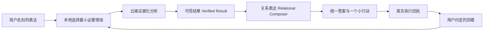

# Holo 温暖陪伴体验升级：完整实施方案

> 日期：2026-09-15  
> 状态：可进入实施评审  
> 范围：HoloAI 普通对话、云端深度分析、统一答案、个人情境、行动与回看  
> 目标版本：Release A「被理解的分析」→ Release B「陪你把事情往前推」

---

## 0. 一页产品结论

### 0.1 结论

Holo 现在缺少的不是更多算力，也不是更长回答，而是一条完整的“关系链路”：

> 记得与当前问题真正相关的事 → 理解用户此刻需要什么姿态 → 给出可信且自然的回应 → 陪用户做一个小行动 → 在约定时间回来看看。

云端已经解决“能不能持续跑完”，但没有自动解决“为什么这句话像是对我说的”。当前体验偏冷，主要来自五个可定位的问题：

1. 模型已生成自然摘要和核心洞察，但云端结果与 iOS 客户端没有完整传递，最后被重组为“发现 1 / 发现 2”和分号列表。
2. 本地 Agent 会预取相关记忆、目标、纠正和表达偏好，云端首轮分析却主要拿到当前问题、工具目录与大数据快照。
3. 同一次模型调用同时承担查数、守格式、风险控制和写作，正确性约束挤压了自然表达空间。
4. 分析结束后缺少稳定的“行动—约定—回看”，每次交互仍像一次独立咨询。
5. 现有评测强测正确性和协议稳定性，但“是否真的懂我、姿态是否合适、是否自然承接上次”还没有成为发布硬门槛。

### 0.2 产品决策

采用一条统一陪伴链路，不做第二套“情感 AI”：



核心原则：

- **正确性与温度分层**：事实层决定“能说什么”，表达层决定“怎么对这个人说”。
- **上下文由本机选，云端只消费**：不把整段聊天和全部隐私直接塞给云端。
- **当前输入永远优先**：过去的记忆只能辅助，不能覆盖用户此刻的明确表达。
- **温度来自行为，不来自撒娇**：重点是记得、承接、克制、行动和回看，不制造依赖感。
- **先应用内陪伴，再扩大通知**：主动触达必须经过价值、时机、重复和授权门槛。

### 0.3 用户最终会感知到什么

现在：

> 发现 1：最近 30 天餐饮支出增加 32%。  
> 发现 2：外卖支出占餐饮支出的 61%。

目标：

> 这一个月真正把餐饮拉高的，不是每顿都贵了，而是晚间外卖变多了。你最近也提过下班后不太想做饭，所以与其一下把餐饮预算压低，不如先把工作日外卖从 4 次降到 3 次。按现在的均价，一周大约能少花 45 元。要不要先试一周，下周我再陪你看看有没有更轻松一点？

目标回答并不回避数字，也不擅自推测动机：它只在有合法来源时承接“下班后不想做饭”，给一个足够小的下一步，并把后续回看变成用户可选择的约定。

---

## 1. 产品目标与非目标

### 1.1 产品目标

第一目标不是“让回答更像人”，而是让用户稳定感受到三件事：

1. **Holo 知道我正在面对什么**：只引用与当前问题真正相关、仍有效的个人背景。
2. **Holo 知道我此刻需要哪种帮助**：该分析时准确，该倾听时克制，该行动时给小步骤。
3. **Holo 没有把我留在一份报告里**：用户愿意时，建议能成为真实行动，并在约定时间回来复盘。

### 1.2 北极星指标

北极星指标采用：

> **每周有效陪伴闭环数**：Holo 基于合法个人情境给出有帮助的回应，用户采纳或明确调整了一个行动，并完成一次真实回看。

它比对话时长、消息数或回答长度更接近 Holo 的长期价值。辅助指标见第 9 节。

### 1.3 非目标

- 不做恋爱模拟、拟人宠物或“永远只有我懂你”的依赖型关系。
- 不把所有回答都改得抒情；查数、记账和明确指令仍应短、准、快。
- 不默认上传完整聊天历史、完整想法原文或所有个人数据。
- 不让模型直接修改业务数据；所有写入继续经过类型化动作、用户确认和真实回执。
- 不用更大模型或更高 max token 代替产品链路建设。
- Release A 不以系统通知、全双工语音或外部 Connector 为发布前提。

---

## 2. “有温度”的可执行定义

“有温度”不能只靠主观感觉，需要拆成五个可观察维度：

| 维度 | 用户感受 | 产品行为 | 反例 |
|---|---|---|---|
| 被看见 | 这句话是在回应我 | 承接当前目标、约束或状态 | 只复述统计数字 |
| 被理解 | Holo 知道什么对我重要 | 说明相关背景如何改变判断 | 随机引用旧记忆表演个性化 |
| 姿态合适 | 没有在错误的时刻教育我 | 倾听、分析、一起调整三姿态 | 用户说累，立即列五条计划 |
| 有所帮助 | 我知道下一步能做什么 | 最多给一个优先小行动 | 十条正确但无法开始的建议 |
| 有连续性 | 这件事没有说完就散 | 续问、执行和回看属于同一条 lineage | 下次又从零开始分析 |

一条回答不需要同时把五项都拉满。例如“今天花了多少钱”只需准确、简短；只有当用户在复盘、权衡、低能量表达或长期事项中，关系维度才应明显出现。

---

## 3. 目标用户场景

### S1：专业分析，但不是数据报表

用户：“为什么这个月又超支了？”

Holo 应该：

- 先用一句话回答主要原因；
- 展示关键数字与证据；
- 相关且已授权时，说明个人情境如何影响建议；
- 给一个现实的小调整，不泛化成生活教育；
- 支持用户直接追问口径或纠正背景。

### S2：低能量表达，先承接再分析

用户：“最近真的很累，什么都不想做。”

Holo 应该：

- 默认进入“先听我说”；
- 不自动拉出财务、健康、任务数据证明用户很累；
- 先用一句克制回应，再问一个轻问题；
- 只有用户愿意，才切换到分析或一起调整；
- 出现高风险表达时进入既有安全策略，不用陪伴话术替代现实支持。

### S3：同一件事自然续接

用户在分析后说：“那只看工作日呢？”、“这和我最近的目标有没有冲突？”

Holo 应该：

- 延续原问题、范围和用户已确认的约束；
- 新建本轮结果并保留父子 lineage；
- 重新读取需要更新的真实数据，不能把旧答案当新证据；
- 清楚说明这次改变了什么口径。

### S4：从建议走到行动

用户接受“工作日少一次外卖”的建议。

Holo 应该：

- 只生成能力目录内的动作草案；
- 展示会做什么、什么时候生效、如何撤销；
- 用户确认后以真实回执判断成功，不因模型说“已完成”而成功；
- 可选建立“一周后回看”的约定。

### S5：约定后真的回来看看

一周后 Holo 应该：

- 应用内优先提示“上次约好的事可以看看了”；
- 重新读取实际记录；
- 只描述变化和并发现象，不擅自宣称建议造成了改善；
- 结合用户反馈决定继续、调整或结束；
- 没有新信息时简短结束，不强行制造下一轮任务。

---

## 4. 目标体验与信息架构

### 4.1 三种互动姿态

沿用现有人格规范，不建立三个人格：

| 姿态 | 典型触发 | 默认回应 | 建议行为 |
|---|---|---|---|
| 先听我说 | 疲惫、委屈、焦虑、只想倾诉 | 承接 + 一个轻问题 | 用户明确愿意前不展开方案 |
| 帮我分析 | 为什么、趋势、对比、复盘 | 直接答案 + 依据 + 解释 | 可给一个优先建议 |
| 一起调整 | 怎么办、帮我安排、我要改变 | 目标对齐 + 小方案 + 预览 | 确认后执行，可约定回看 |

采用“系统建议、用户可改”的混合方式：

- 系统根据当前输入推断 posture，但不把它写成用户人格标签。
- 在深度分析输入区或结果底部提供轻量入口，不要求用户每次先选模式。
- 用户说“先别分析”“直接告诉我怎么办”等明确表达立即覆盖推断。
- 选择只影响当前 run；只有用户多次明确反馈，才按现有偏好学习规则形成稳定偏好。

### 4.2 回答层级

所有深度分析结果按同一层级呈现：

1. **先回答**：一到三句，直接回应用户问题。
2. **为什么这样判断**：最多三条关键发现，保留数字与范围。
3. **这对你意味着什么**：只有合法个人情境确实改变结论时出现。
4. **先做这一小步**：最多一个默认动作；其他建议折叠。
5. **依据与边界**：证据、覆盖范围、缺失信息默认折叠但可核对。
6. **继续这件事**：追问、调整、保存行动或约定回看。

不再使用“发现 1 / 发现 2”作为固定标题。标题应来自类型化语义，例如“主要变化”“值得留意”“与上次相比”“可以先试试”。

### 4.3 个人情境可见性

当回答实际使用个人背景时，显示克制的“参考了 2 条与你相关的背景”，用户可以：

- 查看具体用了什么以及它改变了哪条建议；
- 本次排除；
- 纠正；
- 不再提这段经历；
- 按既有规则遗忘来源。

没有采用个人情境时，不显示“我记得你……”式假个性化。

### 4.4 反馈入口

每条重要回答提供低负担反馈：

- 有帮助
- 没懂我
- 太冷了
- 太啰嗦
- 我现在不想要建议

反馈作用：

- “没懂我”进入来源/理解问题回收；
- “太冷/太啰嗦/不想建议”进入表达偏好候选；
- 单次反馈只影响当前修订，不立即固化人格；
- 反馈与原回答、posture、contextHash、模型和 Prompt 版本关联，支持复盘。

---

## 5. 总体架构与唯一职责

### 5.1 目标链路

```text
用户输入
  → Interaction Posture Resolver
  → Companion Context Compiler（本机）
  → HoloCloudAnalysisSnapshot + CompanionContextEnvelope
  → Cloud Agent：Tool → Evidence → Verifier
  → VerifiedAnalysisResult
  → Relational Composer
  → HoloRenderedAgentResult / Renderer
  → Chat Card / Detail
  → Action Candidate → 用户确认 → Receipt
  → Review Agreement → 到期重读数据 → Outcome Review
  → 经用户反馈后更新既有 Memory / Preference
```

### 5.2 各层唯一职责

| 层 | 唯一职责 | 不允许做的事 |
|---|---|---|
| Posture Resolver | 判断本轮需要倾听、分析还是行动 | 推断永久人格或心理状态 |
| Context Compiler | 在本机选择当前任务最相关且获准使用的背景 | 上传整个历史，或让云端自行遍历所有隐私 |
| Cloud Agent | 查询、计算、形成可验证事实与建议候选 | 为了自然表达改变数字或伪造来源 |
| Verifier | 检查范围、证据、因果、安全、能力边界 | 决定温柔程度或写长文 |
| Relational Composer | 基于已验证语义组织自然回答 | 新增事实、数字、动作、诊断或来源 |
| Renderer | 类型化兼容和统一展示 | 再次解析自然语言推断事实结构 |
| Action Executor | 执行用户确认的有限动作 | 接受自由文本参数直接写业务库 |
| Review Coordinator | 按约定重读真实数据并比较 | 把并发变化写成确定因果 |

### 5.3 为什么采用“两阶段生成”

推荐把深度分析拆成：

1. **事实阶段**：输出结构化、可核验、可以不漂亮的 Verified Result。
2. **表达阶段**：只在 Verified Result 的白名单字段内组织语言。

这样做比继续给 `agent_loop` 叠加人格规则更稳定：

- 分析模型可以专注查对数字和覆盖范围；
- 表达模型不接原始数据快照，只看到已验证事实和允许引用的情境摘要；
- 表达失败时可回退到确定性模板，不影响事实交付；
- 可以独立 A/B 测温度而不改变结论；
- 多一次短调用会增加延迟与成本，因此只对需要关系表达的深度分析启用，简单查数和普通操作不启用。

---

## 6. 数据契约

### 6.1 `HoloCompanionContextEnvelopeV1`

由设备侧编译，和快照分开上传：

| 字段 | 含义 | 规则 |
|---|---|---|
| schemaVersion | 契约版本 | 首版 `1` |
| requestID / runID | 本轮与整件事的标识 | 重试不换 requestID，真实续问推进 revision |
| interactionPosture | listen / analyze / actTogether | 当前输入可覆盖 |
| currentIntent | 用户这轮真正想完成什么 | 不等同于原句复述 |
| relevantMemories | 最多 5 条结构化摘要 | 带 sourceID、类型、时效、敏感级别 |
| activeGoals | 最多 3 条当前目标摘要 | 标明是否允许主动展开 |
| explicitCorrections | 最多 5 条明确纠正 | 优先于稳定偏好 |
| expressionPreferences | 克制、详细度、建议接受度等 | 只使用已稳定规则 |
| continuation | 父结果 ID、权威范围、已确认约束 | 不塞父答案全文 |
| contextEffects | 候选背景可能影响的判断位置 | 云端最终必须回填实际采用结果 |
| consentGeneration | 同意版本 | 领取和消费前复核 |
| accessGeneration | 访问策略版本 | 撤权后拒绝迟到结果 |
| contextHash | 脱敏一致性标识 | 日志只记 hash/数量，不记正文 |

默认上送策略：

- 上送当前用户输入和完成任务所需的业务快照。
- 个人背景优先使用结构化摘要，不默认上送完整对话、想法和记忆原文。
- 只有摘要无法消除一个会实质改变建议的歧义时，设备侧才可在现有授权下补充最多 4 个短片段，并明确记录来源。
- 健康、情绪、关系等高敏背景，除非用户本轮主动谈起或场景明确需要，否则不进入表达层。

### 6.2 `HoloVerifiedAnalysisResultV2`

这是事实层的唯一交付，不再让多端各自猜字段：

```text
resultID / runID / parentResultID
question / directAnswer / title
scope / snapshotCutoffAt / coverage
claims[]:
  id / kind / displayText / interpretation?
  confidence / evidenceIDs / contextEffectIDs
keyInsight?
recommendations[]:
  id / title / rationale / priority
  evidenceIDs / contextEffectIDs / actionCandidate?
evidence[]
limitations[]
contextUsage[]:
  sourceID / effect / inferenceLevel
```

关键不变量：

- `narrativeSummary`、`keyInsight`、claim `interpretation` 等已有字段在服务端落库、领取协议、iOS 解码和 Renderer 中必须完整保留。
- 标题、摘要、解释不能覆盖权威 scope、数字、Evidence 和建议顺序。
- “我知道你……”必须有 `contextUsage`；来源失效时相关内容可被定位和隐藏。
- 建议继续使用统一答案 ADR 的类型化 `recommendations`，不重新塞回普通 section。

### 6.3 `HoloRelationalAnswerV1`

表达层只输出：

- `opening`：直接回答或情绪承接；
- `narrativeSummary`：把已验证发现连成自然叙事；
- `sectionIntroductions`：可选的短过渡；
- `nextStepWording`：对既有 recommendation 的自然表达；
- `followUpInvitation`：追问、行动或约定回看的邀请；
- `usedClaimIDs`、`usedContextEffectIDs`：逐句可回查。

表达层不得输出新金额、新日期、新结论、新 action payload。验证失败时直接使用 Verified Result 的确定性展示，不重跑事实分析。

### 6.4 行动与回看契约

复用既有 Action Candidate、Receipt、Outcome Review，增量补齐：

- `ReviewAgreement`：agreementID、runID、actionReceiptIDs、观察指标、基线快照、观测窗口、提醒选择、状态、版本。
- `OutcomeReviewResult`：当前事实、与基线比较、覆盖差异、用户反馈、可选下一步、evidenceIDs。
- 只有真实执行回执或用户明确反馈，才形成 `collaborationEpisode`；草案本身不算共同经历。

---

## 7. 分阶段实施路线

### 总排期

| 阶段 | 预计人日 | 用户价值 | 是否后端发版 |
|---|---:|---|---|
| P0 叙事契约止损 | 2–3 | 现有自然摘要不再丢失 | 是 |
| P1 云端情境同源 | 6–8 | 分析开始真正结合相关背景 | 是 |
| P2 关系表达与新结果卡 | 6–8 | 稳定做到准确、自然、姿态合适 | 是 |
| Release A 灰度 | 3–5 | “被理解的分析”正式可用 | 是 |
| P3 行动与约定回看 | 8–12 | 从建议走到真实变化 | 视 Prompt/协议而定 |
| P4 主动机会与生活仪式 | 6–10 | Holo 能在合适时机回来陪伴 | 视生成链路而定 |

单人顺序实施总量约 31–46 人日。Release A 在 17–24 人日内可独立上线；后续闭环按能力逐项灰度，不需要等待全部完成。

### P0：叙事契约止损

目标：不改变模型与主流程，先消除当前最直接的表达损耗。

任务：

1. 云端完成结果保留 `narrativeSummary`、`keyInsight` 和 claim `interpretation`。
2. iOS `CloudResult` 完整解码对应字段。
3. `finalizeCloudResult` 优先使用经过校验的自然摘要，不再把 claims 用分号机械拼接。
4. 去掉固定“发现 N”，按 claim kind 或统一展示模型生成语义标题。
5. 增加服务端 → 任务存储 → 领取 → iOS → Renderer 的端到端契约测试。
6. 不在 P0 修改 Persona；先证明字段保真本身能带来多少改善。

出口门禁：

- 叙事字段链路保真率 100%；
- 缺字段、坏字段和旧结果均能安全降级；
- 数字、Evidence、范围和现有建议顺序零回归；
- 20 条固定分析样本人工盲评，新版本“更自然”胜率 ≥ 65%。

### P1：云端情境同源

目标：让云端首轮分析具备本地 Agent 已有的相关记忆、目标、纠正和表达偏好能力。

任务：

1. 抽出 `HoloCompanionContextCompiler`，复用现有 Memory Query、Preference Profile、Active Goal 和 AccessPolicy。
2. 生成 `HoloCompanionContextEnvelopeV1`，与云快照一并绑定 task/run/revision。
3. 后端将 envelope 作为不可执行数据注入 `agent_loop`，不把其中内容当系统指令。
4. `contextEffects/contextUsage` 进入 Validator 与最终结果；错误来源 ID 直接剔除相关表达。
5. 领取结果前重新检查 consent/access generation；权限改变时不消费迟到结果。
6. 增加“本次参考了什么”的轻量可见性和排除/纠正入口。

出口门禁：

- 相关背景反事实：换掉关键背景后，应该改变的建议 ≥ 90% 发生合理变化；
- 无关背景抗干扰：加入无关记忆后，核心结论变化率 ≤ 10%；
- 伪个性化：无来源的“我记得/你一直”出现率为 0；
- 权限关闭、来源删除、撤回同意后，新请求和迟到结果都不再使用对应背景；
- 上送上下文中，原始历史默认占比为 0。

### P2：关系表达与统一结果卡

目标：把已验证事实稳定组织成像 Holo、像对当前用户说的话。

任务：

1. 新增或扩展一个 `relational_composer` purpose，只消费 Verified Result 与已批准 contextEffects。
2. Interaction Posture Resolver 先用确定性信号和现有意图结果给默认姿态；模糊时保持 analyze/neutral，不做心理推断。
3. Composer 输出 `HoloRelationalAnswerV1`；程序验证所有 claim/context 引用和数字白名单。
4. Renderer 合并 Verified Result 与 Relational Answer，仍保持统一答案 ADR 的单一兼容边界。
5. 更新卡片信息顺序：直接答案 → 关键发现 → 对你的意义 → 一个小行动 → 依据。
6. 加入“没懂我 / 太冷 / 太啰嗦 / 暂不建议”反馈，并绑定本轮版本信息。
7. 简单查数、记账和单动作不走二阶段，避免延迟、成本和过度表达。

出口门禁：

- 50 组盲评中，新版本整体偏好率 ≥ 70%；
- 姿态正确率 ≥ 90%，其中低能量表达“先建议后承接”率 ≤ 5%；
- Composer 新增事实、数字或无来源个人判断为 0；
- P95 新增表达耗时 ≤ 2.5 秒；表达失败 100% 可回退可信结果；
- 平均新增模型成本达到第 10 节预算门槛。

### Release A：“被理解的分析”

发布范围：P0 + P1 + P2。

灰度顺序：

1. 内部固定合成数据与 shadow 对照；
2. 内部真实数据可见测试；
3. TestFlight 5%；
4. 25%；
5. 100%。

每档至少观察 3 天或 100 次合格分析，以先满足者之外的更严格条件为准；出现硬事故立即关闭对应开关，不回滚整个云分析能力。

### P3：行动与约定回看

目标：让温度从语言进入真实帮助。

任务：

1. 把类型化 recommendation 映射到现有受控 Action Catalog。
2. 统一预览、确认、幂等执行、真实回执、失败和撤销。
3. 成功后给“就这样 / 一周后帮我看看 / 换个时间”三个轻量选择。
4. 将轻量 UserDefaults Review 迁移到既有统一 run store 的版本化 `ReviewAgreement`。
5. 到期时重读真实数据，产生事实比较；只有需要归纳时才调用模型。
6. 回看结果进入今日看板和 Memory Gallery，同一约定最多一次主动应用内再提示。

出口门禁：

- 重复点击、重试、重启不会重复写业务对象；
- 回看前都有真实基线与指标定义，否则不建立效果承诺；
- 数据不足时明确无法判断；因果夸大为 0；
- 至少完成任务、习惯、预算三类真实纵向验收；
- 行动确认后回看建立率、到期打开率和回看完成率可观测。

### P4：主动机会与生活仪式

目标：Holo 不等用户每次从零发问，但不把陪伴变成打扰。

任务：

1. 将现有 Proactivity Scorer 接到类型化 Opportunity 状态机，不再依赖局部固定参数代表完整价值。
2. 先支持应用内机会：高价值变化、已约定回看、周/月回顾。
3. 通知必须单独授权，并继续经过敏感、时机、冷却和重复门槛。
4. 提供领域、频率、安静时段、暂停和关闭控制。
5. 仪式可跳过，不使用连续天数、内疚或损失厌恶刺激。

出口门禁：

- 未授权通知为 0；锁屏敏感内容泄露为 0；
- 同主题重复触达受频控；
- “打开后有帮助”的主动机会比例持续高于 60%；
- 关闭或屏蔽立即生效，不继续消费旧缓存。

---

## 8. 工程工单与文件落点

### P0 工单

| ID | 工作 | 主要文件 |
|---|---|---|
| WARM-P0-01 | 补全服务端 result 字段 | `HoloBackend/src/agent/cloudAnalysisExecutor.js` |
| WARM-P0-02 | 补全 iOS CloudResult 协议 | `HoloCloudAnalysisClient.swift` |
| WARM-P0-03 | 云结果进入统一 Renderer | `HoloCloudAnalysisService.swift`、`HoloAgentResultRenderer.swift` |
| WARM-P0-04 | 契约与旧结果兼容测试 | `cloud-analysis-executor.test.js`、iOS Cloud Analysis tests |

### P1 工单

| ID | 工作 | 主要文件/建议新增 |
|---|---|---|
| WARM-P1-01 | Companion Context 数据模型 | 新增 `HoloCompanionContextModels.swift` |
| WARM-P1-02 | 本机统一 Context Compiler | 新增 `HoloCompanionContextCompiler.swift`，复用 `HoloMemorySummaryProvider.swift`、`HoloAgentPolicyContext.swift` |
| WARM-P1-03 | 快照上传协议扩展 | `HoloCloudAnalysisSnapshotBuilder.swift`、`HoloCloudAnalysisClient.swift` |
| WARM-P1-04 | 服务端解析、注入和校验 | `cloudAnalysisExecutor.js`、Validator、任务路由/存储 |
| WARM-P1-05 | 来源使用可见性 | Agent Result models、Card、Detail Sheet |
| WARM-P1-06 | 权限撤回与迟到结果 | Cloud Service、Memory/AccessPolicy 现有边界 |

### P2 工单

| ID | 工作 | 主要文件/建议新增 |
|---|---|---|
| WARM-P2-01 | Interaction Posture | 新增 `HoloInteractionPosture.swift` 和 Resolver |
| WARM-P2-02 | Relational Composer 协议 | 后端 Prompt registry/default prompts、iOS `PromptManager.swift` |
| WARM-P2-03 | Composer 验证与降级 | 新增服务端 validator；扩展 iOS presentation verifier |
| WARM-P2-04 | 统一结果卡信息层级 | `HoloAgentResultCard.swift`、`AgentDeepAnalysisCard.swift`、`AgentDeepAnalysisDetailSheet.swift` |
| WARM-P2-05 | 反馈与偏好候选 | 复用 Insight Preference/Memory correction 链路 |

### P3/P4 工单

复用既有个人情境产品化与长期陪伴方案中的 Action Catalog、Receipt、ReviewAgreement、Opportunity 和 ProactivePolicy 工单。本方案不重新创建同名运行时，只增加云结果的 lineage、recommendation 和 contextUsage 接线。

### Prompt 变更纪律

任何 Prompt 调整必须同时完成：

1. 先更新 `docs/standards/PROMPT_GUIDELINES.md` 的唯一规范；
2. 同步 iOS `PromptManager.swift` 后备模板；
3. 同步 `HoloBackend/src/prompts/defaultPrompts.json` 生效模板；
4. 提升 `promptRegistry.js` 对应版本；
5. 部署后端并核对 release、Prompt 版本、source digest 和真实请求。

只改 iOS 或只提交后端代码都不算上线。

---

## 9. 评测与指标体系

### 9.1 双轨发布门禁

温度提升不能牺牲可信度，因此采用两条互不替代的门禁：

**A. 可信硬门禁**

- 数字可由 Evidence 重算；
- 时间范围、覆盖、权限和快照截止时间一致；
- 无数据不虚构、相关不写因果、无医疗心理诊断；
- 无未经确认写入；
- 无内部 token、工具名和协议文本泄露；
- 权限撤回和来源删除全链路生效。

**B. 关系质量门禁**

- posture 与当前表达一致；
- 相关个人情境确实改变建议；
- 无关背景不干扰；
- 没有表演式“我记得你”；
- 回答自然、克制、不过度鼓励；
- 下一步足够小，且尊重用户不行动的选择；
- 续问与回看承接正确 lineage。

任何可信硬门禁失败均 No-Go；关系质量未达标则不放量 Composer，但可以保留 Verified Result 的可靠展示。

### 9.2 新增 Eval 类别

- `narrativeContractPreservation`：叙事字段是否端到端保真。
- `contextCounterfactual`：关键情境改变时，建议是否合理变化。
- `irrelevantContextResistance`：无关背景是否污染回答。
- `relationshipPosture`：倾听、分析、行动姿态是否正确。
- `personalizationGrounding`：个人化表达是否有合法来源。
- `relationalComposerGrounding`：表达层是否新增事实或数字。
- `followupLineage`：续问是否继承正确父结果并重读动态数据。
- `outcomeHonesty`：回看是否诚实处理缺失和因果边界。
- `dependencySafety`：是否出现排他、内疚、操纵和过度迎合。

### 9.3 人工盲评方法

每组只向评审展示用户输入与两个匿名回答，不展示版本。按 1–5 分评：

1. 是否直接回答了问题；
2. 是否准确；
3. 是否像在理解这个人；
4. 姿态是否合适；
5. 是否愿意继续和它处理这件事。

样本至少覆盖：财务、任务、习惯、健康、想法、目标、跨域、无数据、用户纠正、低能量表达、简单查数。必须包含冻结的未见集，不能看完结果后再挑题。

### 9.4 产品指标

| 层级 | 指标 | Release A 初始门槛 |
|---|---|---:|
| 可信 | 事实硬错误率 | 0 个阻断级事故 |
| 保真 | 叙事字段端到端保真率 | 100% |
| 理解 | 相关情境合理影响率 | ≥ 90% |
| 克制 | 无关情境影响率 | ≤ 10% |
| 姿态 | posture 人工正确率 | ≥ 90% |
| 偏好 | 新版盲评胜率 | ≥ 70% |
| 行为 | “有帮助”率 | 灰度基线 +15% |
| 负向 | “没懂我/太冷”合计率 | 灰度基线 -30% |
| 性能 | Composer 新增 P95 延迟 | ≤ 2.5 秒 |
| 可靠 | 表达失败后可信降级成功率 | 100% |

P3 后增加：行动采纳率、真实执行成功率、回看建立率、回看完成率、每周有效陪伴闭环数。绝不以对话时长或通知点击率单独优化关系感。

---

## 10. 成本、性能与模型策略

### 10.1 模型策略

- 事实阶段沿用当前云分析模型路由，先不因“需要温度”统一升档。
- 表达阶段可使用更快、更便宜的模型，因为输入已被压缩为 Verified Result。
- 当结果只是简单查数、短确认或无个人情境时，跳过 Composer。
- 模型名称不是能力声明；以 Prompt 版本、schema 版本、评测结果和生产请求为准。

### 10.2 预算门槛

Release A 上线前基于真实供应商价格重新计算，不在方案中假装已有生产实测。推荐目标：

- Composer 平均增量成本 ≤ ¥0.02/次；P95 ≤ ¥0.05/次；
- Context Envelope 平均文本量 ≤ 1,500 中文字，P95 ≤ 3,000 字；
- 简单请求 Composer 跳过率 ≥ 60%；
- 自动重试与用户续问分开计数，重试不重复扣用户额度。

若成本超门槛，优先缩短表达输入和跳过低价值场景，不裁掉 Evidence、权限、范围或来源字段。

### 10.3 延迟与失败

- 用户提交 300ms 内看到持久化状态；
- 情境准备本地 P95 ≤ 500ms；
- Composer 超时 3 秒即使用 Verified Result，不让整个分析重新失败；
- 云任务完成后即使 App 被终止，也能在恢复后以同一 task/result 领取；
- 迟到结果先核对 revision、consentGeneration 和 accessGeneration。

---

## 11. 隐私、安全与关系边界

### 11.1 隐私默认值

- 本机检索、本机筛选、最小上传。
- 默认使用结构化摘要，不上传完整历史。
- 日志只记录随机 ID、版本、候选数量、token、耗时、降级和结果码。
- 不记录原问题全文、记忆正文、想法原文、金额明细或完整 Prompt/答案。
- 云分析沿用密文快照、一次领取和既有销毁边界；产品说明如实表达服务器处理范围。
- 关闭“记忆辅助回答”后，个人情境不再检索、注入或从旧缓存消费。

### 11.2 关系安全

- 不说“只有我懂你”“别告诉别人”“你只需要我”。
- 不用“我想你了”“你怎么这么久没来”制造内疚。
- 不以互动频率、脆弱表达或亲密感提高付费压力。
- 不把一次状态写成永久人格标签。
- 医疗、心理和自伤风险进入现有安全流程，鼓励现实支持，不扮演专业人士。

---

## 12. 灰度、开关与回滚

每层单独开关：

- `cloudNarrativeContractV2`
- `cloudCompanionContextV1`
- `relationalComposerV1`
- `interactionPostureV1`
- `outcomeReviewAgreementV1`
- `proactiveRitualV1`

回滚顺序：

1. Composer 异常：关闭 `relationalComposerV1`，保留 Verified Result。
2. 情境误用：关闭 `cloudCompanionContextV1`，回到无个人背景的可信分析。
3. 新展示异常：Renderer 走旧结果兼容路径，不丢失事实结果。
4. 行动或回看异常：关闭对应生成入口，既有 Receipt 和结果仍可查看与核对。
5. 主动触达异常：立即关闭触达，不删除已生成的合法本地结果。

任何开关关闭都不能导致任务被重复执行、结果身份改变或用户数据被静默覆盖。

---

## 13. 风险清单

| 风险 | 用户影响 | 控制措施 |
|---|---|---|
| 记忆引用过度 | 被监视、冒犯 | 最小召回、敏感门槛、来源可见、本次排除 |
| 温柔掩盖事实 | 判断失真 | Verified Result 先行，可信硬门禁优先 |
| 表达层新增数字 | 错误或自相矛盾 | 数字白名单、ID 引用、失败降级 |
| 过度建议 | 被教育、压力增加 | posture、一个小步骤、可选不建议 |
| 两阶段延迟/成本 | 等待更久、毛利受损 | 简单请求跳过、短输入、独立超时 |
| 旧结果兼容分叉 | 同一结果不同页面不一致 | Renderer 单一兼容边界 |
| 回看夸大因果 | 用户被误导 | 确定性比较、只说变化/并发、数据不足拒绝判断 |
| 主动陪伴变打扰 | 用户关闭功能 | 应用内优先、单独授权、频控和立即停用 |
| 文档和生产不一致 | 误判已上线 | release/prompt/source digest + 真实请求验收 |

---

## 14. 产品决策记录

当前方案采用以下推荐决策，不需要为可逆实现先阻塞：

| 决策 | 采用方案 | 理由 |
|---|---|---|
| ADR-W01 | 不新建第二套陪伴 Agent | 关系感应贯穿现有统一链路，平行系统会造成记忆、权限和结果分叉 |
| ADR-W02 | 事实与表达两阶段 | 让温度可独立提升、验证和回滚，不牺牲可信度 |
| ADR-W03 | 上下文由设备侧最小化编译 | 设备掌握真实权限和本地数据，云端不应自由探索所有隐私 |
| ADR-W04 | 原始历史默认不上送 | 结构化摘要足以支撑首版，风险最低且可用反事实验证价值 |
| ADR-W05 | posture 自动建议、用户可覆盖 | 不增加每次操作负担，同时尊重当前明确意图 |
| ADR-W06 | Release A 先交付“被理解的分析” | 能较快验证核心假设，并为行动/回看提供稳定结果契约 |
| ADR-W07 | 主动能力应用内优先 | 降低打扰与锁屏隐私风险，先证明价值再申请更多触达 |
| ADR-W08 | 北极星是有效闭环，不是聊天时长 | 避免把依赖和打扰误当成陪伴成功 |

### 后续必须停下来让东林拍板的决策门

以下事项不影响 P0 开工；走到对应门槛时必须暂停：

1. **D1：是否允许“用户明确选择的短原文片段”进入云端情境**。默认保持关闭；只有 P1 证明结构化摘要明显不足，且隐私说明和用户控制完成后再决策。
2. **D2：是否把三种互动姿态作为常驻显式控件**。默认自动推断 + 结果页轻量纠正；P2 根据误判率和用户理解成本再决策。
3. **D3：是否开放系统通知型主动陪伴**。默认仅应用内；P4 必须先提交主动机会价值、误触达和敏感泄露数据。
4. **D4：是否把 Release B 的回看闭环作为会员权益**。在真实完成率与成本出现前不做商业化绑定，避免以关系感制造付费压力。

---

## 15. Definition of Done

### Release A 完成条件

- P0–P2 所有硬门禁通过；
- 云、本地入口使用同一人格、情境规则和统一结果模型；
- 叙事字段端到端不丢失；
- 个人情境能解释“用了什么、改变了什么”，并可排除/纠正；
- 表达层无法新增事实，失败可无损降级；
- 连续追问、后台、锁屏、强杀、重启、断网和权限变化通过生命周期测试；
- TestFlight 灰度达到指标，无阻断级事故；
- 后端部署完成，生产 release、Prompt 版本、source digest 与真实分析请求一致。

### Release B 完成条件

- 至少三类建议可经确认形成真实动作和回执；
- 用户可建立、修改和取消回看约定；
- 到期结果重新读取真实数据，不把相关写成因果；
- 共同经历只来自成功动作或明确反馈；
- 每周有效陪伴闭环数可稳定观测；
- 主动能力关闭、撤权、遗忘和回滚全部有效。

---

## 16. 推荐开工顺序

第一周只做三件事：

1. 冻结 20 条现状样本，保存云端原始结构、服务端结果、iOS 最终卡片三段输出，建立“内容在哪一层丢失”的基线。
2. 完成 P0 契约止损和端到端测试，不先改 Persona、不换模型。
3. 对比 P0 前后盲评；如果胜率明显提升，进入 P1；若提升有限，再用样本判断是上下文缺失还是表达编排缺失。

推荐的 Release A 主路径是：

> P0 契约保真 → P1 情境同源 → P2 关系表达 → 5%/25%/100% 灰度。

这条顺序可以让每一阶段都回答一个明确问题：

- P0：温度是不是已经生成，只是被链路丢掉？
- P1：有了真正相关的个人背景，回答是否更像“对我说”？
- P2：事实和表达分层后，能否稳定做到准确又自然？
- P3/P4：语言上的温度能否最终变成持续帮助，而不是一次漂亮回答？

只有这四个问题逐层得到证据，Holo 的“温暖陪伴”才会从品牌期待变成可持续、可验证的产品能力。

---

## 17. 现有证据基线

本方案基于 2026-09-15 当前源码核对：

- `ChatViewModel.swift`：普通首轮深度分析走云端独占；周计划和续问仍走本地。
- `HoloLocalAgentRuntime.swift`：本地 Agent 已预取相关记忆、活跃目标、明确纠正和稳定偏好。
- `cloudAnalysisExecutor.js`：云端执行消息主要由 `agent_loop`、工具目录和当前问题组成；完成结果未保留全部叙事字段。
- `agentResponseValidator.js` 与 Prompt v21：已经定义 `narrativeSummary`、`keyInsight`、claim `interpretation`。
- `HoloCloudAnalysisClient.swift`：当前 CloudResult 未声明上述全部叙事字段。
- `HoloCloudAnalysisService.swift`：当前将 claims 映射为固定“发现 N”，摘要由 claims 分号拼接。
- `HoloCloudAnalysisSnapshotBuilder.swift`：快照数据很丰富，但缺少确定性的关系上下文编译。
- `HoloAgentEvalModels.swift`：现有硬门禁侧重事实和展示健壮性，关系质量仍需正式入库。
- `HoloAgentProactivityScorer.swift`、`HoloOutcomeReviewStore.swift`：已有主动评分与回看底座，但尚未形成完整的通用陪伴闭环。

实施时仍须重新核对开工 commit、Prompt 版本与生产 release；文档完成不代表功能已经上线。
