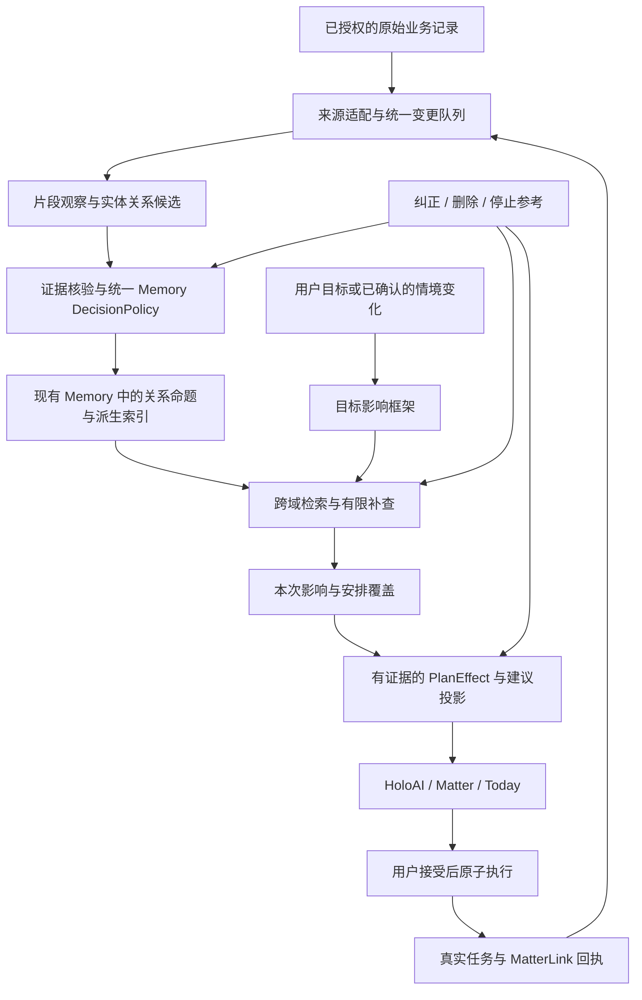

# Holo 下一阶段产品实施方案：从生活记录中理解责任，在变化发生时主动补齐安排

> **历史草案，已停止作为实施依据。** 审查发现含“护照”的主验收输入会与“照护”在现有中文单字检索中产生词面碰撞；P0 门禁与后续开发阶段的依赖不一致；安排覆盖和默认卡片接线也需修正。请使用同目录的 [《Holo 生活理解与 Matter 主动筹备：审查修订执行版》](2026-09-23-Holo生活理解与Matter主动筹备-审查修订执行版.md)。以下内容仅保留为设计历史。

> 日期：2026-09-23（北京时间）
>
> 状态：待东林讨论确认的产品与实施规格；本轮仅新增文档。
>
> 依据：当前工作区代码、既有产品规范，以及东林对 Matter 的本轮验收反馈。代码包含其他会话的在途改动，本文不把代码存在等同于线上生效。
>
> 未进行：业务代码修改、模型调用、构建、模拟器、真机、双设备、生产验证或部署。
>
> 实施根目录：`/Users/tangyuxuan/Desktop/Claude/HOLO`。

## 1. 产品结论与下一阶段承诺

**Holo 应当替用户发现他还没想到要安排的事，并把这件事推进到有着落。**

东林真正期待的体验是：用户只说“我要出远门”，Holo 已经能够从日常记录中理解那些不会因为用户离开就自动消失的责任，发现哪些会受影响，检查有没有安排，并把必要行动带入当前计划。

这项能力的价值不是多生成一个“养猫”标签，而是减少用户的两种负担：

1. **背景复述负担**：不必每次告诉 Holo 自己养了什么、要照顾谁、平时承担什么。
2. **遗漏管理负担**：不必先自己想全，再把完整需求交给 Holo 排版。

下一阶段的一句话产品承诺：

> **你说眼前要做的事，Holo 会结合你已经记录的生活，替你留意哪些事情会受影响、哪些还需要安排。**

“已经记录”限定数据边界；“留意”允许有依据的推断；“需要安排”不宣称用户一定忘了，也不代表 Holo 已经替用户执行。

### 1.1 必须成立的验收判据

用户本轮没有提猫，也没有建立“我养猫”的档案。历史原始数据中有猫粮交易、给摩卡换水的任务或习惯、找人上门喂猫的想法。用户只提出旅行需求。

Holo 要能：

- 自己找到这些记录，形成可追溯的照护责任推断；
- 把“这次离家期间照护是否有安排”纳入旅行准备；
- 没有充分依据时，用“家中宠物照护”等表达，不强行认定摩卡的物种、所有权或身份；
- 找到这次已经安排的证据时，避免重复安排；只覆盖部分日期时，指出剩余缺口；
- 用户纠正后改变计划，并在下次不重犯；
- 经用户接受后接入现有 Matter、主题清单和任务，并有真实回执。

仅在回答里提到“猫”“摩卡”不算通过。必须有一项**由真实个人背景导致的计划变化**。

### 1.2 对上一阶段验收的修正

`UC-MATTER-001` 的固定输入包含“摩卡也要找人照顾”。这验证了把显性需求变成计划、建立事项、持续推进的能力，却没有验证“从生活记录发现隐性责任”。该用例仍保留为执行回归测试，但不能再作为“懂你”的主要证明。

此前通用个人情境方案已经提出跨记录理解；本次不能重新写一遍愿景后继续用显性输入验收。必须补齐当前实际缺失的接线、推断、检索和效果验证。

## 2. 当前实现到哪里，断点在哪里

以下为 2026-09-23 当前工作区静态核对结果，不代表线上运行状态。

| 环节 | 当前证据 | 用户影响 | 下一阶段决定 |
|---|---|---|---|
| Matter 执行 | 有统一启动、事务回执、真实任务关联、`planOrder`、下一步查询 | 用户接受计划后有持续推进载体 | 保留，主要补上游理解能力 |
| 情境自动萃取 | `HoloPersonalContextExtractionJob.runPass` 实际注入 `HoloThoughtContextSourcePaging`；writer 的来源回查也只查询 Thought | 猫粮账单、换水任务、照护习惯未进入这条通用情境萃取链路 | 扩展来源协议和统一变更队列 |
| 旧记忆信号 | 财务偏固定支出、预算、结构变化；任务偏完成节奏、积压；想法旧入口有观点句式筛选 | 系统能统计行为，却不等于读懂“这件事是给谁做的” | 保留统计能力，另补同一记忆体系中的原始生活语义输入 |
| 情境存储 | 已有主体、对象、关系、时间、证据、反证、准入和 suppression 等字段 | 具备复用基础，不必新造用户档案系统 | 增量演进现有情境载荷 |
| 跨域融合 | 现有 candidate builder 要求不同域、共同 anchor、共同时间窗口和独立证据 | 适合周期统计关联；尚未建立共同对象时，猫粮和换水不一定能相遇 | 增加实体解析与生活关系候选生成，复用证据治理，不放宽统计融合规则 |
| 规划入口 | 本地 `plan` 与云端 `startCloudPlan` 均以原话构造 frame；成功条件和检索方向未在此补齐 | “旅行”与“换水”字面不相似，相关责任容易漏掉 | 在检索前构建目标影响框架 |
| 检索 | 有语义、主体、时间和条件召回；条件匹配包含词面重叠；默认时间判断为现在起 30 天 | 不能稳定证明检索到了旅行实际区间内会受影响的责任 | 引入实际事件区间与责任影响召回 |
| 原文补查 | `HoloContextThoughtRawFallbackProvider` 从已经召回的 entry 取 sourceID | 没有召回候选时，补查难以发现全新的证据 | 新增受同一权限约束的跨域发现性补查 |
| 记忆使用决策 | 在途代码已有五路 DecisionPolicy，AccessPolicy 已适配 decision metadata | 能谨慎参考推断，不必逐条让用户确认 | 沿用唯一裁决源，补实体验证和时效输入 |
| 主动帮助 | 有主动评分器；Matter 的 inferredAssociation、intervention 默认未开启 | 有零件不等于有完整主动照护链路 | 先接入站内机会卡，满足门禁后再做通知 |

**根因判断：当前系统较擅长“接住被表达的需求”，而“把记录连成生活关系，再判断当前事情影响了什么”还没有形成完整运行链路。**

这些断点不能仅靠扩大 Prompt、增加 token、换模型或打开某个开关解决。

## 3. 核心产品模型：对象、责任、变化、着落

内部用四个问题组织理解，用户不需要学习这四个术语。

| 问题 | 摩卡案例 | 作用 |
|---|---|---|
| 用户生活中有什么对象？ | 摩卡、家中宠物、住处、曾使用的上门照护服务 | 让分散记录有可能连接起来 |
| 用户与它有什么关系？ | 可能持续照料某只宠物，存在喂食、饮水等日常活动 | 提取需要被维持的责任，而不止是名词标签 |
| 当前事情改变了什么？ | 一段时间离开常住地，原有亲自照料方式可能不可用 | 从目标推导个人影响 |
| 这次有没有着落？ | 未知、正在联系、已约定部分日期、已覆盖本次区间 | 决定该提醒、补全、等待还是退场 |

推导链必须可以展开为：

```text
猫粮交易 / 换水习惯 / 上门喂猫经历
→ 与宠物照护相关的独立线索
→ 用户可能承担持续照护责任
→ 本次离家会改变原来的照护条件
→ 查询本次安排，核对覆盖范围
→ 生成“确认并安排离家期间照护”的计划项或补全建议
```

### 3.1 把三种“知道”分开

- **记录事实**：账单记了一笔猫粮；任务标题写了给摩卡换水；用户记录曾找人喂猫。
- **生活推断**：用户很可能有宠物照护责任；摩卡可能是相关宠物。每个命题的支持程度分别判断。
- **本次安排状态**：10 月 1 日至 7 日是否有人负责。必须另外查证，不能用上次经历代替。

“过去找过人”只支持“有过这种解决方式”。不能自动转成“本次找好了”，也不能自行给旧服务联系人发消息。

### 3.2 不必先证明“摩卡就是我的猫”才能提供帮助

这三条记录并不必然证明摩卡是猫、猫属于用户、所有记录指向同一只宠物。应逐命题保留不确定性。

但是，若照护责任已有较强支持，即便名字映射不确定，也可以先把“离家期间的宠物照护”列为建议。只有当身份歧义会改变具体行动，例如两只宠物需要不同地点的安排，才追问。

**澄清应解决行动分歧，不应成为使用推断的通行证。**

### 3.3 能力必须泛化

内部关系可覆盖：照护、承诺、周期义务、资源依赖、可用时间、偏好、限制、替代方式、阶段变化。它们是开放语义关系，不是“旅行 → 猫”的业务规则。

首轮必须同步验证这些独立场景：

| 新事情 | 历史线索 | 应改变的计划 |
|---|---|---|
| 周末外出 | 固定志愿排班、过去的交接记录 | 检查本次排班冲突并建议交接 |
| 搬家 | 固定配送、通勤习惯、宽带账单 | 找出需要变更地址或衔接的服务；不根据消费推断住址 |
| 准备重要考试 | 已确认的上课时间、工作安排、学习习惯 | 给出实际可用学习时段，避免排进既有承诺 |
| 承接新项目 | 周期性交付任务、近期已接受事项 | 指出具体时间冲突，并提供取舍草案 |
| 筹备家庭聚会 | 明确记录的饮食偏好与成员安排 | 调整采购和时间；不猜测健康诊断或亲属关系 |

### 3.4 “更懂你”也要减少安排

同一套理解能力必须能产生四种结果：补一项、改一种做法、暂缓一项、什么也不增加。否则 Holo 会越来越像一个不断给用户加责任的系统。

- 有照护责任又要离家：补齐必要交接。
- 历史明确表示不喜欢频繁换住处：同样的旅行目标，应减少住宿切换，而非机械增加景点和步骤。
- 近期已接受的项目挤占学习时间：学习方案应收缩到真实可用时段；不能凭“有空就学”制造不可执行计划。
- 已经有完整照护安排：复用安排，跳过重复任务。
- 用户本轮明确说只想轻松聊聊：不因为检索到责任就强行转成规划。

优先级首先服从本轮目标和用户明确取舍；硬时间约束、已承诺责任和明确偏好辅助决策。系统不能从消费和完成率推断“你是自律/拖延的人”，再据此安排用户的人生。

Release A 就要覆盖至少一个“少安排”和一个“改变方式”的留出场景，避免把有效帮助等同于新增待办数量。

## 4. 主用户链路：完全不在对话里提宠物

### S0：用户正常记录生活

测试数据必须通过正常保存或受控导入进入各模块，以下均为示例数据，并非东林真实数据库读取结果：

- 8 月 20 日财务：商品/备注“猫粮”，支出 168 元；
- 9 月 5 日建立习惯：“给摩卡换水”，存在多个不同日期的实际打卡；
- 9 月 10 日想法：“上次出门找了人上门喂猫，回来状态还不错。”

用户不额外维护人物卡、宠物卡、标签，不点击逐条确认记忆。已授权范围内系统后台处理；未获相应授权时，按现有门禁保持关闭。

此时不弹“你是不是养猫”的问题。记录照常保存，不等待模型。

### S1：系统形成可以修正的生活理解

在后续前台补偿或允许的后台时间，系统产生：

- 已记录宠物用品消费；
- 存在与“摩卡”相关的重复照料活动；
- 有离家时安排上门照护的经历；
- 综合推断：可能持续承担家中宠物照护，离家时值得检查照护衔接。

这些结论保留证据和适用范围。没有用户可见提醒，也不生成 Matter 或待办。

### S2：用户提出眼前的事

> “我 10 月 1 日到 7 日去日本，第一次去，想去东京和大阪。护照有，签证机票酒店还没弄，预算大概一万，帮我安排一下。”

本轮输入没有猫、摩卡、照护等提示词。系统先解析旅行区间和现有安排，再推导“离开常住地期间，哪些既有责任的执行条件会改变”。

检索同时覆盖直接相关资料和**会被目标影响的责任**，随后查有没有本次照护安排。

### S3：第一次回答就体现帮助

示例表达：

> “除了行程本身，我也把离家期间的宠物照护放进了准备项。结合你记过的猫粮、换水和上门喂猫经历，这件事可能需要提前安排；目前能找到的是上次的经历，这次的安排还没查到。先按确认照护方式来准备。”

完整计划仍由现有 Matter 规划卡承载，包含一项“确认并安排 10 月 1 日至 7 日的宠物照护”。如果摩卡的身份关系已充分支持，可以使用名字；否则不强行命名。

界面在该项旁给一个低干扰入口“为什么想到这件事”。默认不展开账单和私人文字。

注意区分：

- “记录里还没查到本次安排”是数据边界；
- “你没有安排”是对现实状态的断言，禁止据缺少记录直接这样说。

### S4：接受计划，只确认一次

新 Matter 仍沿用“开始推进”的一次确认：用户能看见全部计划后，统一原子建立 Matter、一个主题清单、任务和关联。没有额外的“你真的养猫吗”确认。

系统推断不等于业务写入授权；接受整份可见计划是这批任务的授权。成功状态来自真实事务回执。

### S5：日常新记录能够回流

用户之后在想法里写：

> “和朋友约好了，1 到 3 号来家里喂猫。”

Holo 应重新评估同一照护责任：已看到 1—3 号安排，4—7 号仍未见覆盖。Matter 内出现一条补充卡：

> “前 3 天已经有安排了，后面 4 天还需要衔接。要把照护步骤补成确认剩余日期吗？”

卡片提供“更新这一步”“已全部安排”“暂时不用”。点击修改后，更新原任务，避免再新建同义任务。

外部记录产生的是安排状态判断与修改提案；首版不直接把任务标完成，不静默改变用户已经接受的截止时间或顺序。

### S6：全部安排好，正确退场

若用户明确记录或反馈覆盖了本次完整区间，显示“这次照护已有安排依据”，停止催用户再找人。

“安排已定”与“照护已经实际完成”分开。临行筹备任务可以由用户确认完成；不把它当作未来每天已经喂过猫。

任务完成、撤销、Matter 完成仍走现有真实实体链路。Matter 最终结束由用户确认。

### S7：下次更省心

下一次旅行时，可以参考此前“用过上门照护”及用户明确表达的效果，优先提出合适方式。上次安排的人员、日期不会自动延续；没有反馈，不能编出“上次你很满意”。

## 5. 第二条链路：用户还没请求规划，Holo 先发现影响

首发先把 S0—S7 做实，再开这条主动路径，但同一阶段方案必须把接口留全。

### 5.1 触发强度分级

| 新证据 | 可以做什么 | 不应该做什么 |
|---|---|---|
| “想去日本看看”的想法 | 保持愿望背景 | 当作确定离家，产生催办 |
| “10 月 1—7 日去日本”的明确任务/用户记录 | 检查相关责任，产生站内筹备建议 | 自动建立旅行 Matter |
| 一笔航空公司消费，但没有日期和出行人 | 记录可能相关的出行线索，必要时后续补查 | 断言用户确定在某天离家 |
| 已有旅行 Matter，日期改变 | 重新检查受影响安排，提出具体变更 | 整份计划无提示重写 |

### 5.2 用户看见什么

Today 或相应 Matter 显示最多一条当前最值得处理的建议：

> “你记了 10 月 1—7 日的出行。结合之前的照料记录，离家期间的宠物照护可能也需要一起准备。”

已有 Matter：点击“补进旅行计划”，预览增量后确认。

没有 Matter：点击“一起准备”，进入现有规划卡，再点“开始推进”。

如果只是孤立的一步，直接提供单任务草案，不强制升级为 Matter。

### 5.3 打扰规则

- 默认站内，不以系统通知证明主动性。
- 一次首页只展示一条新增主动建议；已有高优先级焦点仍遵守 Today 原规则。
- 同一责任、同一事件区间、同一建议的重复证据不产生新卡。
- “本次不用”：抑制该情境；“理解错了”：修正长期关系；“不再参考”：走遗忘/suppression。三种反馈不混用。
- 忽略卡片不解释成否认事实，也不当成同意。
- 只有新事实实质改变风险、日期、覆盖或行动时才可重新提示。
- “稍后再看”默认 24 小时后具备重显资格，不保证精准后台唤醒，也不默认发通知。
- 后续系统通知单独授权，默认文案不含宠物名、账单或想法原文。

### 5.4 实际如何触发主动检查

统一变更队列在证据发生变化时，分别产生“责任变化”和“情境变化”事件：

1. 任务、想法或 Matter 出现明确目标/日期，解析为候选 SituationFrame；通过事实与使用门禁后登记活跃情境。
2. 责任关系变化，通过本地依赖索引找可能受影响的活跃情境；情境变化则反向召回可能受影响的责任。
3. 相同情境的连续编辑合并防抖，每轮只评估受影响部分；记录 evaluatedRevision，避免重复模型调用。
4. 回前台处理队列，并按本地到期索引重新评估已经临近的安排；不能只等新记录，导致出发前始终不再检查。
5. 页面只读已落库投影。后台机会不可保证时，以下次回前台补偿为产品保证，不承诺 App 长期未打开也能实时发现本地新情况。

进入倒计时本身不一定值得再提示。若用户本次已拒绝，或已有覆盖，则即使临近也保持安静；只有未被抑制且可行动的真实缺口参与排序。

## 6. 能力一：读到完整生活线索

### 6.1 “整个数据库”的明确产品定义

指**对 Holo 内全部已授权、适用的数据域建立可查询覆盖，并可按需要追溯历史原始记录**。它不是把全库一次送入模型，也不是只读最近几条却宣称全面理解。

系统必须维护逐域覆盖清单：支持哪些字段、已处理到哪个修订、历史是否追平、哪些数据因权限/删除/解析失败未处理。不能只用“语义检索可用”代表“全库已读完”。

### 6.2 来源接入表

| 来源 | 必须保留 | 禁止偷换 | 交付批次 |
|---|---|---|---|
| 财务 | 稳定交易 ID、商品/备注、商户（仅在字段真实存在时）、分类、发生时间、修订、导入来源 | 购物行为不直接等于本人所有；商户不等于商品；退款不当作第二次消费 | A |
| 任务 | 标题、备注、重复规则、计划日期、状态、真实完成时间、创建来源 | 建了任务不等于发生过；AI 自动生成文本不是独立生活证据 | A |
| 习惯 | 定义、对象、有效区间、暂停状态、实际打卡记录 | 有习惯定义不等于每天都做了；模板与打卡属于相关血缘 | A |
| 想法 | 用户正文、记录时间、提及事件时间、引用/转述身份、归档/删除状态 | 不依赖“我认为”等观点关键词；不把引用的他人经历当作用户经历 | A |
| 对话 | 用户消息、必要上下文指向、纠正、明确承诺、实际来源 | assistant 生成的文字不自证为事实；“如果我养猫”不是养猫陈述 | B |
| 目标与 Matter | 用户接受的目标、日期、范围、已有计划和真实执行回执 | 生成提案不等于用户已采纳；采纳不等于已实现 | B |
| 明确个人资料 | 用户主动维护的偏好、约束与纠正 | 不用推断覆盖用户纠正 | B |
| 健康等敏感域 | 复用既有获准结构化摘要与权限门禁 | 不为本功能扩大敏感原文采集，不从药品/消费推断疾病 | B 的受限覆盖 |

财务正文常含高影响或敏感信息。分类和最小化应在来源适配/现有政策层执行；不能把整条敏感账单一律标 normal。允许的宠物用品线索只上传必要商品语义，不附带账号、付款凭证、收货地址等无关字段。

A 交付只可称“四类核心记录理解”；B 完成并公布覆盖清单后，才可对外承诺核心域的跨记录理解。

### 6.3 全历史回填与增量

1. 首次在已授权范围建立轻量本地来源目录，不以永久 180 天截断替代历史覆盖。
2. 优先活跃任务/习惯、最近记录、当前 Matter 相关资料；历史按页补齐，保存 checkpoint。
3. 新增、实质编辑、删除、恢复、导入、远端同步全部进入同一变更队列。
4. 队列 key 包含 `sourceKey + revision + extractorVersion + policyVersion`，重复观察合并。
5. 每个域独立稳定游标和冻结水位；查询直接使用复合游标条件，不能靠多取一页再过滤保证不漏。
6. 被授权学习基线排除的数据不偷偷补回；恢复或重新允许旧数据须有明确控制语义。
7. 归档、已完成不等于删除：可作为历史事件证据，但不能继续代表当前责任。具体使用仍受现有权限和用户排除设置约束。
8. 停止/退后台后可续跑；页内多个包全部有 receipt 才能推进该页，预算必须真的按包计数。

用户正在规划时不等待整库回填。对当前影响方向做有界按需补查，并明确实际覆盖；不得把低覆盖时的无结果说成“没有相关责任”。

## 7. 能力二：把分散线索连成可修正的关系

### 7.1 实体解析

模型提出 mention 和可能关系，程序分配稳定 ID、校验真实来源并维护可逆归并。

- “摩卡”在换水记录中可成为可能的照护对象；在“买杯摩卡”中是饮品，不因名字相同合并。
- 先区分用户、被照护对象、朋友、商户、物品、服务等角色，再评估是否同一实体。
- 多只宠物、相同昵称、代购、替朋友照料必须有反例。
- 证据只足以证明某个未命名宠物存在时，保持匿名对象。不能为了填 schema 将它强行命名为摩卡。
- 每次合并保留来源 mention 和 merge revision；拆分后能使下游结论失效重算。

### 7.2 关系推断与证据独立性

生活关系通过“提候选 → 查支持与替代解释 → 受限补查 → 核验 → 政策裁决”形成。

证据数量本身不代表可靠性：同一交易导入三次、截图识别后生成的交易、同一想法生成的摘要和任务，都不能算三份独立支持。

原始事件用 `lineageRootIDs` 标记；派生关系保留全部根证据和推导父节点。形成循环的派生图拒绝使用。多条重复活动可以支持持续性，但不伪装为多个独立身份确认。

现有跨域统计融合的“共同时间窗”规则不删除。新增生活关系融合按各类关系的有效性判断：几个月前的照护经历可以与近期活动共同支持持续责任，不要求记录发生在同一天；过时的单次安排不能继续有效。

### 7.3 可信使用，而非伪精确置信分

沿用 `HoloMemoryDecisionPolicy` 五路决策：可当事实参考、需限定参考、继续观察、相关时澄清、丢弃。

分别保存：来源权威性、身份匹配结果、关系支持、时效、矛盾、影响级别、持久化许可。禁止只让模型返回一个 0.92 决定全部行为。

| 证据情况 | 行为 |
|---|---|
| 一笔猫粮购买 | 弱线索；不独立断言养猫，不据此单独推送照护 |
| 重复照料活动 + 有效独立经历 | 可限定用于规划；不要求用户先维护档案 |
| 名字不确定，但照护责任较清楚 | 使用“宠物照护”，不阻塞基础计划 |
| “是替朋友买的，自己没养” | 针对同一命题处理反证；撤回自己养猫推断 |
| “自己没养，但每天帮邻居照料” | 保留照护责任，修正所有权；离家时仍可能需要交接 |
| 明确职责已结束 | 结束有效期，历史仍可回看，当前不提醒 |
| 内容属于高影响敏感判断 | 不自动晋升长期推断；复用现有更严格政策 |

这里最关键的是：**需要被安排的是责任，不是所有权。**

### 7.4 时效与遗忘

- 每项关系有适用区间、最后支持证据和 reviewDueAt。到期是“需要重新评估”，不自动宣布关系消失。
- 历史事件、持续责任和单次安排使用不同有效性规则。首版参数配置化，以留出集校准。
- 缺少最近记录既不能证明“仍由本人每天照顾”，也不能证明“不再养宠物”。结合当前有效习惯、独立证据和反证决定使用等级。
- 删除唯一来源后派生结论失效；还有其他来源则重算支持程度。
- “不再参考”沿用语义 suppression，阻止换说法、重导入、重新索引后复活。
- 纠正只是改变本次安排，还是改变长期关系，按用户表达范围保存；有歧义时保守限定在本次，不无限外推。

## 8. 能力三：根据当前目标发现影响

### 8.1 目标影响框架

在现有 `HoloPlanningRequestFrame` 上增量扩展，而非另起规划系统。两类字段必须分开：

- 用户已经表达的目标、时间、范围、安排；
- 为完成目标推导的检查方向，如离家、时间占用、资源不可用、周期冲突。这些是检查假设，不是用户个人事实。

优先复用已有 `personal_context_request` purpose；意图识别已经返回合格 frame 时不重复调用，否则增加一次受预算约束的框架生成。

现有 request Prompt 中“用户没说的不要补”必须明确限定为**不得补用户事实**，同时允许产生待检索的影响假设。`declared` 与 `derivedHypothesis` 分字段传递，否则只加字段仍可能得到一份与原话等价的空框架。

例如“去日本七天”可推导“可能离开常住地、原有日常责任可能需要替代安排”；不能在尚未检索时推导“用户有猫”。

### 8.2 召回路径

```text
目标与真实区间
→ 目标影响方向
→ 直接语义召回 + 有效责任召回 + 时间冲突召回 + 已有安排召回
→ 实体/关系一至两跳扩展
→ 补查关键支持和反证
→ 判断本次影响、安排覆盖和可执行下一步
```

保留现有候选上限 40、生成重点最多 8 的起始预算，但不能让 40 条直接旅游资料挤掉全部日常责任。至少为影响责任和反证保留独立召回通道；最终按实际影响排序，不机械凑满。

超过 8 项实质影响时合并可合并的责任或分批交付；在覆盖报告记录截断，不能静默丢掉高影响项。模型不可通过复制自己刚推导的句子作为新证据补足支持。

### 8.3 有界发现性补查

改造旧 fallback：既能验证已召回证据，也能发现尚未形成情境的原始记录。

首版每轮最多 2 次本地查询扩展，总共最多 8 段、12,000 字符，优先“能改变行动的未知”。执行者只能使用白名单 read 工具，权限、学习基线、遗忘和敏感规则与正常读取相同。

例如先查当前有效照料活动，发现未明确对象后，再查同对象的近期说明与本次安排。不能让模型直接执行自由 SQL，也不能把未通过政策的原文拿去重新推断。

### 8.4 每项个性化建议必须解释计划差异

产出 `PlanEffect`：

```text
effectKind: add / adjust / skip / sequenceSuggestion / resolveGap
affectedRequirementID: 本次照护覆盖问题
basis: 真实原始证据 + 合法关系命题
whyNow: 本次离家会使原有照护条件不可用
baseline: 普通旅行准备计划不包含此项
personalizedDelta: 增加确认离家期间照护的步骤
uncertainty: 名字关系未完全确定；本次安排未在已查记录中找到
proposedAction: 可审阅的任务草案或对既有任务的变更
```

`PlanEffect` 证明背景如何改变了建议；不能只是把记忆追加到“参考依据”栏。具体排序修改只是提案，用户接受后才改持久化 `planOrder`。

## 9. 能力四：检查事情有没有着落

新增类型化 `SituationRequirement`，表示“当前情境下应满足的条件”，例如本次离家期间照护能够持续。它是推理/建议对象，未接受前不创建真实 `HoloMatterOpenLoop` 或任务。

两组状态独立保存：

| 维度 | 状态 |
|---|---|
| 安排覆盖 | unknown / partial / covered / contradicted / notApplicable |
| 提案处理 | proposed / accepted / dismissed / superseded |

真实任务仍使用原任务状态。覆盖不等于任务完成，接受提案不等于现实已安排。

覆盖判断至少匹配：对象、责任内容、适用区间、所需频次/粒度、执行方或方式、承诺状态、例外。

只有日期不足以证明覆盖：若来源只说“朋友 1 到 3 号来一次”，不能解释成三天每天到访。若缺少频次，不臆造宠物所需专业照料频率；先展示“已约定一次，是否覆盖日常照料还不明确”，在实际安排阶段补齐必要信息。

“联系一下喂猫的人”是行动意向；“已经约好”是安排声明；“今天已经喂了”是一次完成事件，三者不能互相替代。

对已有 Matter 的自动发现，先保存建议投影与证据，用户接受增量后才变更业务实体。常规完成仍尊重真实任务回执，不通过模型猜执行状态。

## 10. 产品入口与反馈设计

不新增一个要求用户维护关系图谱的主页面。理解能力在四个现有接触点体现：

1. **HoloAI 规划卡**：直接把有依据的遗漏补进计划，短说明“结合你的记录补充”。
2. **Matter 详情**：展示一条当前重要的补充/变化卡；原有计划列表和下一步保持稳定。
3. **Today**：站内主动机会卡，遵守已有唯一焦点和真实 ID 去重规则。
4. **已有记忆详情/设置**：查看“为什么这么理解”、纠正、不再参考、逐域控制。

“为什么想到这件事”包含三层，默认只展示第一层：

- 一句关系解释：“你有持续照料的记录，这次离家可能需要衔接。”
- 支持与限制：“参考 3 类记录；本次安排尚未在已查记录中找到；摩卡身份尚不确定。”
- 原始来源入口：真实账单、习惯、想法 ID 与必要片段；删除/失权来源不能继续展开。

纠正入口至少支持“不是我的”“这只是过去的事”“这次已有安排”“以后不要参考”。不要求用户编辑内部 JSON 或图谱边。

冷启动和页面进入只能读取本地已验证投影；LLM 异步更新。过期建议标记待更新或暂不展示，已有任务始终可操作。

首次启用的说明建议：

> “允许 Holo 结合你选择的记录，在规划时留意相关责任和遗漏。部分必要片段会用于 AI 分析，你可以查看依据、纠正或停止使用。”

这是新增处理范围的说明规格；是否需再次确认取决于现有授权是否已明确覆盖，不重复索取已经具备的授权，也不默认将仅统计的授权扩大为敏感正文分析。

## 11. 技术总图与复用边界



### 11.1 唯一真相源

| 语义 | 真相源 |
|---|---|
| 某条记录实际写了什么、任务是否完成 | 原始业务 Repository |
| 对生活关系的推断及证据、使用资格 | 现有 HoloMemoryRecord + 统一 DecisionPolicy |
| 对象别名、关系检索索引 | 可重建投影，不另建第二份个人档案 |
| 当前目标和时间区间 | 冻结的 PlanningRun/frame |
| 当前安排覆盖 | 绑定有效证据版本的 Requirement 投影 |
| 已接受计划的任务、清单、顺序 | Matter/Todo Repository 和 planOrder |
| 实际执行结果 | 事务回执和真实 entityID |
| 用户遗忘与纠正 | 现有控制状态、语义 tombstone 与版本 |

### 11.2 本地与云端

- 本地负责来源读取、权限、身份映射、版本、时间运算、真实状态、幂等和业务写入。
- 模型负责开放语义提取、候选关系、目标影响方向和证据范围内的提案。
- 后端继续承担模型代理和可恢复任务，只接收本轮必要上下文及证据片段。
- 不新上图数据库，不迁移整库到服务端，不复制一套 Companion Runtime。
- 普通关系命题继续复用现有记忆存储；敏感内容遵守原独立存储策略。派生搜索索引与运行缓存优先本机可重建。
- 不能宣称“数据全程不出设备”；也不能仅凭代码注释宣称服务商零留存。发布前核对实际上传字段、应用服务端任务留存及清理行为。

## 12. 冻结数据契约

以下为拟新增/扩展契约，不是已实现的类型。P0 冻结 schema 与 fixtures，之后客户端、后端、评测和 UI 共同使用；不能各自从文字再次解析状态。

### 12.1 SourceObservationV1：模型实际看到了什么

```text
sourceKey           {domain}:{真实entityID}，不可只用裸 UUID
revision            包含正文、语义相关字段、状态、归档/删除变更的修订
sourceKind          transaction / taskDefinition / habitDefinition / habitEvent /
                    userNote / userMessage / acceptedPlan / explicitProfile
authorship          user / importedUserRecord / assistantDerived / unknown
originRefs          导入原单、生成任务的原始草案等血缘
lineageRootIDs      独立原始事件集合，不按复制后的记录数计证据
recordedAt          记录时间
eventTime           发生或约定时间；可以未知
eventTimePrecision  exact / dateOnly / interval / unresolved
state               当前真实业务状态及状态修订
normalizedText      获准的最小必要文本
fields              白名单结构化字段；每字段保留真实含义
mentions            来源片段里的主体/对象候选及 UTF-16 span
permission          sensitivity / allowedUses / accessGeneration / learningBaseline
coverageGaps        缺日期、未识别附件、无商品详情等
```

财务金额保留原金额类型及币种，不交模型重算；标题“给摩卡换水”与 completed=false 一起传入，防止模型把计划当经历。账单没有商品明细时，标记缺失而不根据商户猜商品。

### 12.2 ContextRelationV2：关系命题

在 `HoloPersonalContextPayloadEnvelope` 中增量支持 V2，继续依附 `HoloMemoryRecord`；保留 V1 的可读兼容与未知载荷无损策略。

```text
contextID / relationRevision / schemaVersion
subjectRefs / objectRefs            稳定 entity ref + 原始 mention refs
relationFamily                     responsibility / commitment / routine /
                                   preference / constraint / dependency /
                                   arrangement / identity / stateChange
relationText                       开放语义，不靠枚举穷尽生活
claim                              当前具体命题
epistemicStatus                    observed / declared / inferred
identityResolution                 linked / tentative / ambiguous / separated
validity                           validFrom / validTo / reviewDueAt / scope
supportRefs / counterEvidenceRefs   带 sourceKey、revision、span/结构化字段
derivationRefs / lineageRootIDs     推断路径与根证据
verification                       supported / qualified / insufficient /
                                   contradicted / unsupported
alternativeExplanations            代购、替人照料、同名等有依据的可能性
decisionMetadata                   现有五路政策输出，唯一最终资格裁决
userControl                        纠正、限定范围、不再参考及版本
```

实体 alias 与关系索引从这些命题重建。实体 ID 由程序管理，不允许模型发明真实业务 ID；跨设备归并以源 mention、血缘和已验证 identity 关系为准，不能凭相同昵称合并。

关系类型是稳定的检索维度；新生活语义仍写 relationText，不需要为猫、绿植、志愿服务各加一个特例。

### 12.3 SituationFrameV2：当前事情改变了什么

```text
runID / requestRevision / currentMatterID?
userGoal / utterance / referenceTime / timezone
eventInterval                      start / end / precision / sourceRefs
declaredArrangements                用户已表达的安排
successConditions                  成功条件，区分 declared 与 derived
impactDimensions                   presence / time / resource / continuity /
                                   locationChange / deadlineConflict 等检查维度
impactHypotheses                    需要检索验证的方向，不是个人事实
retrievalDirections                最多 4 个开放语义方向
sourceCoverage                     各域已读范围、待处理修订、权限、截断
controlGeneration / sourceCutoff
```

事件结束日期按真实语义处理。整日离家区间可规范为本地日期的半开区间，再转 UTC；日期精度不足时不得伪造起飞或回家时刻。跨时区行程由代码管理锚点与区间，模型只提供可校验的时间表达。

### 12.4 SituationRequirementV1：本次需要满足什么

```text
requirementID                      稳定逻辑键，不随文案变化
triggerRef                         frame 或已确认事件
responsibilityRefs                 产生该要求的关系命题
affectedEntityRefs                 涉及对象，可暂时匿名
requiredScope                      区间、地点（若已知）、内容、粒度
arrangementRefs                    本次安排的真实证据
coverageState                      unknown / partial / covered /
                                   contradicted / notApplicable
coveredScope / uncoveredScope      仅在足以计算时给出
needsClarification                 是否存在会改变行动的关键分歧
evidenceRefs / counterEvidenceRefs
evaluatedAt / validityToken         关系版本 + 来源版本 + 控制代际
```

“没查到安排”的边界写在 coverage，而不是生成虚假的负面证据 ID。只有实际存在的支持/反证才能被引用。

### 12.5 PlanEffectV1 与执行提案

```text
effectID / requirementID / runID / draftRevision
effectKind / baselineDescription / personalizedDelta / whyNow
evidenceRefs / uncertainty / allowedExpression
proposedMutation                   addTask / updateTask / linkExisting /
                                   markRequirementHandled / noMutation
targetTaskID? / targetMatterID?     有值时必须是真实可访问 ID
expectedMatterRevision / expectedTaskRevision
proposedPlanOrder?                 显式预览后接受，不静默重排
logicalActionKey                   去重：责任 + 情境 + 行动语义
decision                           proposed / accepted / dismissed / superseded
executionReceiptID?                仅真实成功后填写
```

`markRequirementHandled` 只影响该建议的处理状态，不冒充任务完成。展示“已加入”必须有 taskID、MatterLink 和成功回执。

### 12.6 跨层不变量

1. 任何个人结论都能沿引用走回获准的原始证据；源文本中的指令只当数据。
2. 推断不会因被 Holo 重复表述、被用户接受为计划而升级成直接观察事实。
3. 自动生成任务沿原推断血缘；后续用户真实完成是一项新执行事件，但不独立证明原来的所有权等身份命题。
4. 使用、生成返回、展示和执行前均重查权限与修订；来源删改后不接受迟到结果。
5. 同一建议采用同一 logicalActionKey；恢复和重试不新增任务。
6. 未知 schema 单条隔离并保留，不能把未知状态当作允许使用。
7. 原始事实发生冲突时保留双方版本，不能按数组顺序选一条自称真相。
8. 模型自报 `supported` 不能替代引用存在、字段对齐、独立性、时间和执行权限校验。

稳定身份补充：一次旅行的日期修改使用同一 situationID 的新修订；同一责任的文案改写保持 requirementID 与 logicalActionKey。只有确实是另一次旅行才新建情境身份。对象合并/拆分产生版本化映射，并使旧提案失效，不能以改变 ID 的方式逃过“本次不用”或去重规则。

## 13. 运行时、预算与失败路径

### 13.1 两种计算节奏

**记录后的后台理解**：按变更批量处理，形成可复用的关系；不阻塞记录保存。

**当前目标的即时检查**：先用已有理解，再对少量关键缺口做补查；不重扫全库。

后台事件仅触发受影响实体、关系和活跃情境重算。不能每保存一条账单就让所有 Matter 全量调用模型。

### 13.2 起始预算与性能目标

下列是产品验收目标/初始上限，必须在 P0 实测校准，不能当已达成结果：

| 项目 | 起始要求 |
|---|---|
| 页面打开 | 零同步 LLM 请求，始终可操作已有任务 |
| 自动萃取 | 每包最多 12 段、12,000 字符；一轮前台补偿最多 2 包，包内萃取和核验各一次 |
| 大批导入 | 持久队列和 checkpoint；不靠一次无界循环处理完整页 |
| 即时检查 | frame 最多一次；本地补查最多两轮；最终生成一次、必要修复一次；受既有运行总预算共同约束 |
| 热路径响应 | 第一份可用计划目标 P95 ≤ 20 秒，须按实际模型和网络报告 |
| 冷数据或缺口 | 到交互预算即交付已验证部分，标明未检查范围；异步新发现以增量卡交付，不偷偷改已接受草案 |
| 无变更重开 | 原始语义萃取不得重复计费；必要的到期评估按独立调度预算执行 |
| 成本 | 按账号设置每日后台 token/调用预算，前台规划与既有配额同源；预算耗尽保留队列 |
| 可取消 | 用户取消/关闭授权即停止后续调用与写入，已发出请求的迟到结果不得展示或执行 |

新增目的的成本必须计入真实后台成本看板，不通过更换设备 ID 分摊或绕过限额。

### 13.3 必须落实的异常行为

| 异常 | 产品行为 | 数据行为 |
|---|---|---|
| 网络/模型不可用 | 继续现有基础规划或本地 Matter 展示；不伪装已完成全库检查 | 保留可恢复 checkpoint |
| 历史尚未读完 | 必要时说明仍有部分历史未纳入，不让用户等待整库 | coverage 明确范围和待处理量 |
| 有证据但检索预算截断 | 交付已核实内容；高影响遗漏进入补充评估 | 记录 truncated 原因和候选数量 |
| 来源被删除/权限撤回 | 相关解释和建议撤下或重算 | 向量、关系、草案、缓存和在途运行失效 |
| 用户改了旅行日期 | 仅相关覆盖结论变旧，提示重新核对 | 新 request revision，旧提案不可执行 |
| 模型输出错误对象/引用 | 不展示无依据个性化项 | validator 拒绝，有限修复后回退 |
| 任务被用户自行修改 | 保留用户修改，显示最新提案差异 | expectedRevision 失配则不覆盖 |
| 数据源只有愿望或假设 | 普通建议或继续观察 | 不创建确定事件触发器 |
| 用户已经做完但没记录 | 允许直接反馈“已安排” | 按新声明限定本次范围，不声称后台早已知道 |
| 多设备同时接受同一补充 | 恢复同一逻辑回执或在同步后消歧 | 稳定 logicalActionKey + 确定性实体 ID/既有去重策略，不依赖单机内存锁 |

### 13.4 双设备边界

单设备 Core Data 事务并不自动保证两台离线设备全局恰好一次。必须设计：同一 logicalActionKey 的创建身份、合并规则、重复修复及旧回执恢复。

用户纠正和 suppression 沿既有共享控制链同步；本机派生索引接到远端变更后重建。新设备在关键控制状态未同步完成时，不使用可能被撤回的旧推断主动打扰。

对于完全离线且尚未收到另一设备撤回的设备，不能承诺即时知晓撤回；重新联网时先同步控制与失效，再恢复主动生成。该限制必须在双设备验收中单独报告。

并发控制冲突采用用户撤回优先：suppression/撤权事件不因另一设备写入旧 active 记录而消失。重新启用必须是明确晚于已知撤回的用户动作；不能仅比较各设备本地时钟或可冲突的整数版本。P0 核对既有控制同步是否满足，否则将控制事件身份与合并作为 P2/P6 必做项。

## 14. 开发文件范围与职责

### 14.1 已存在、优先修改或复用的文件

| 绝对路径 | 预期职责 |
|---|---|
| `/Users/tangyuxuan/Desktop/Claude/HOLO/Holo/Holo APP/Holo/Holo/Models/AI/HoloPersonalContextModels.swift` | V2 关系载荷、来源键、版本兼容 |
| `/Users/tangyuxuan/Desktop/Claude/HOLO/Holo/Holo APP/Holo/Holo/Models/AI/HoloContextPlanningModels.swift` | frame、PlanEffect 和 Requirement 契约 |
| `/Users/tangyuxuan/Desktop/Claude/HOLO/Holo/Holo APP/Holo/Holo/Services/AI/PersonalContext/HoloPersonalContextRuntime.swift` | 从单 Thought 接线改为统一来源注册与分域进度 |
| `/Users/tangyuxuan/Desktop/Claude/HOLO/Holo/Holo APP/Holo/Holo/Services/AI/PersonalContext/HoloPersonalContextExtractor.swift` | 跨包实体候选、受控输入和真实包预算 |
| `/Users/tangyuxuan/Desktop/Claude/HOLO/Holo/Holo APP/Holo/Holo/Services/AI/PersonalContext/HoloContextReconciler.swift` | 可逆关系归并、血缘、反证，不另建使用决策器 |
| `/Users/tangyuxuan/Desktop/Claude/HOLO/Holo/Holo APP/Holo/Holo/Services/AI/PersonalContext/HoloContextAccessPolicy.swift` | 实时来源修订和五路政策统一读取 |
| `/Users/tangyuxuan/Desktop/Claude/HOLO/Holo/Holo APP/Holo/Holo/Services/AI/PersonalContext/HoloContextRetrievalService.swift` | 目标影响召回、真实事件区间、通道配额 |
| `/Users/tangyuxuan/Desktop/Claude/HOLO/Holo/Holo APP/Holo/Holo/Services/AI/PersonalContext/HoloContextSemanticSearchRuntime.swift` | 跨域发现性补查、来源权限与 coverage |
| `/Users/tangyuxuan/Desktop/Claude/HOLO/Holo/Holo APP/Holo/Holo/Services/AI/PersonalContext/HoloContextChatPlanner.swift` | 本地/云端入口共享合格 frame 和上下文编译 |
| `/Users/tangyuxuan/Desktop/Claude/HOLO/Holo/Holo APP/Holo/Holo/Services/AI/PersonalContext/HoloContextPlanningCoordinator.swift` | 同一推理快照、PlanEffect 保真与返回前复查 |
| `/Users/tangyuxuan/Desktop/Claude/HOLO/Holo/Holo APP/Holo/Holo/Services/AI/PersonalContext/HoloContextPlanValidator.swift` | 证据、建议差异、对象与执行边界校验 |
| `/Users/tangyuxuan/Desktop/Claude/HOLO/Holo/Holo APP/Holo/Holo/Services/AI/MemoryCore/HoloMemoryDecisionPolicy.swift` | 唯一记忆使用裁决，补关系及时效输入 |
| `/Users/tangyuxuan/Desktop/Claude/HOLO/Holo/Holo APP/Holo/Holo/Services/AI/MemoryFusion/HoloEvidenceLineageResolver.swift` | 独立根证据去重与派生血缘复用 |
| `/Users/tangyuxuan/Desktop/Claude/HOLO/Holo/Holo APP/Holo/Holo/Services/AI/MemoryRepository/HoloMemoryForgettingService.swift` | 跨新投影失效及 suppression |
| `/Users/tangyuxuan/Desktop/Claude/HOLO/Holo/Holo APP/Holo/Holo/Data/Repositories/HoloMatterRepository.swift` | 接受后增量执行、原子事务、回执、幂等 |
| `/Users/tangyuxuan/Desktop/Claude/HOLO/Holo/Holo APP/Holo/Holo/Services/AI/Matter/HoloMatterPlanLaunchCoordinator.swift` | 沿用一次启动；增量提案不破坏原 launch |
| `/Users/tangyuxuan/Desktop/Claude/HOLO/Holo/Holo APP/Holo/Holo/Services/AI/Matter/HoloMatterLinkedEntityChangeCoordinator.swift` | 已关联实体变更后刷新与失效 |
| `/Users/tangyuxuan/Desktop/Claude/HOLO/Holo/Holo APP/Holo/Holo/Services/AI/Agent/HoloAgentProactivityScorer.swift` | 复用站内建议排序，事实/权限硬门禁先于分数 |
| `/Users/tangyuxuan/Desktop/Claude/HOLO/Holo/Holo APP/Holo/Holo/Services/Today/HoloTodaySnapshotBuilder.swift` | 本地投影读取，保持首页去重 |
| `/Users/tangyuxuan/Desktop/Claude/HOLO/Holo/Holo APP/Holo/Holo/Views/Matter/MatterDetailView.swift` | 新发现/安排覆盖/增量接受 |
| `/Users/tangyuxuan/Desktop/Claude/HOLO/Holo/Holo APP/Holo/Holo/Views/Chat/Cards/MatterPlanLaunchCard.swift` | 个性化差异与证据入口 |
| `/Users/tangyuxuan/Desktop/Claude/HOLO/Holo/Holo APP/Holo/Holo/Services/AI/PromptManager.swift` | 双端模板、类型与版本 |
| `/Users/tangyuxuan/Desktop/Claude/HOLO/HoloBackend/src/prompts/defaultPrompts.json` | 提取、核验、目标框架、规划任务契约 |
| `/Users/tangyuxuan/Desktop/Claude/HOLO/HoloBackend/src/prompts/promptRegistry.js` | 生效 Prompt 版本 |
| `/Users/tangyuxuan/Desktop/Claude/HOLO/HoloBackend/src/agent/cloudAnalysisExecutor.js` | 云端 context_plan 新字段无损传递、checkpoint |

同步核对 `/Users/tangyuxuan/Desktop/Claude/HOLO/HoloBackend/src/config.js`、`src/app.js`、`src/prompts/serverPromptPolicy.js`、`src/admin/adminLogStore.js` 的 purpose、配额、限流和日志字段。只有确需新 purpose 时才加新入口；不得借用不匹配的旧 purpose 逃过审核与限流。

双端 Prompt 的改动围绕职责契约：extraction 保留来源身份和活动状态，verification 分别判断原始支持与推断适用，request 区分用户事实和影响假设，planning 输出 PlanEffect 与未确定项。共用人格中“只说有依据的话”继续有效；若“不揣测”的笼统措辞与有证据、带限定的推断冲突，先以冻结反例证明，再按 `PROMPT_GUIDELINES.md` 单一真源流程精确澄清，禁止整体放宽事实纪律。

### 14.2 建议新增文件（实施前均视为拟建）

统一放在现有模块下，不引入新顶层框架。若存在等价组件则合并职责，避免重复实现。

| 拟建绝对路径 | 职责 |
|---|---|
| `/Users/tangyuxuan/Desktop/Claude/HOLO/Holo/Holo APP/Holo/Holo/Services/AI/PersonalContext/HoloContextSourceRegistry.swift` | 来源白名单、字段、修订与逐域覆盖 |
| `/Users/tangyuxuan/Desktop/Claude/HOLO/Holo/Holo APP/Holo/Holo/Services/AI/PersonalContext/HoloContextChangeFeed.swift` | 保存/导入/远端同步/删除统一队列；借鉴 ThoughtSemanticChangeFeed |
| `/Users/tangyuxuan/Desktop/Claude/HOLO/Holo/Holo APP/Holo/Holo/Services/AI/PersonalContext/HoloContextEntityResolver.swift` | mention、alias、可逆实体归并 |
| `/Users/tangyuxuan/Desktop/Claude/HOLO/Holo/Holo APP/Holo/Holo/Services/AI/PersonalContext/HoloContextRelationBuilder.swift` | 生活关系候选、受限检索、反证与依赖索引 |
| `/Users/tangyuxuan/Desktop/Claude/HOLO/Holo/Holo APP/Holo/Holo/Services/AI/PersonalContext/HoloSituationFrameBuilder.swift` | 复用现有 request purpose 构建影响框架 |
| `/Users/tangyuxuan/Desktop/Claude/HOLO/Holo/Holo APP/Holo/Holo/Services/AI/PersonalContext/HoloSituationImpactResolver.swift` | 责任与当前事情的适用性、PlanEffect |
| `/Users/tangyuxuan/Desktop/Claude/HOLO/Holo/Holo APP/Holo/Holo/Services/AI/PersonalContext/HoloArrangementCoverageResolver.swift` | 本次安排范围计算与未知管理 |
| `/Users/tangyuxuan/Desktop/Claude/HOLO/Holo/Holo APP/Holo/Holo/Services/AI/Matter/HoloMatterContextProposalCoordinator.swift` | 把新发现变成可接受、可撤销的增量提案 |
| `/Users/tangyuxuan/Desktop/Claude/HOLO/Holo/Holo APP/Holo/Holo/Views/Matter/MatterContextProposalCard.swift` | 原因、范围、接受/纠正/暂不处理 |
| `/Users/tangyuxuan/Desktop/Claude/HOLO/scripts/eval-life-context.mjs` | 生产同契约的原始来源到计划差异评测 |

不要提前拆出独立服务、网络图数据库或通用规则平台。这里的文件只是职责边界，可在保持清晰的前提下合并小组件。

## 15. 分阶段实施与停止条件

估算以一位熟悉项目的开发者为基础，包含必要专项测试，不是承诺日期。AI 辅助可以加快编码，但不能省去真实模型与真机验证。

| 阶段 | 工期估算 | 交付 | 硬验收/停止条件 |
|---|---:|---|---|
| P0 证据基线与契约 | 3—4 人日 | 当前链路追踪、无显性提示 fixtures、schema、范围清单、成本样本 | 原始记录必须能一路追踪到计划；不允许预先注入“养猫”记忆冒充能力 |
| P1 来源覆盖 | 4—6 人日 | 财务/任务/习惯/想法适配、稳定游标、变更队列、回填覆盖 | 四域新增/编辑/删除/导入/恢复/远端变更均可重放；源字段无损 |
| P2 生活关系理解 | 6—8 人日 | 实体解析、持续责任、多源核验、反证/纠正/失效 | 摩卡正例及代购、同名、职责结束反例通过；不过关不扩主动 UI |
| P3 目标影响规划 | 4—6 人日 | frame、影响召回、发现性补查、PlanEffect、云本地同契约 | 无宠物提示的旅行请求能改变计划；独立领域留出集达到门槛 |
| P4 Matter 闭环 | 4—6 人日 | 来源解释、一次接受、安排覆盖、增量更新、冷启动恢复 | 已安排/部分安排/日期变化/撤销/重复接受均通过 |
| P5 主动与覆盖扩展 | 4—6 人日 | 站内机会卡、对话/目标/资料等 B 域、打扰治理 | 没有聊天请求也能在明确情境下发现遗漏；愿望/弱消费不得触发确定筹备 |
| P6 发布验证 | 5—7 人日 | 留出评测、专项回归、真机、双设备、隐私上传核对、灰度/生产证据 | 分层门禁全部达标；任何未达标项明确限制范围 |

合计 30—43 人日，另预留约 20% 集成与模型不确定性缓冲。P6 中测试设计、预算采样应前置贯穿各阶段，最终验证集中收口。

### 15.1 两个可发布切片

**Release A：用户开口后，Holo 能主动补遗漏。**

- 范围：P0—P4，且完成 P6 对应的模型、真机、生产门禁。
- 核心体验：四类核心记录 → 隐性照护责任 → 旅行计划差异 → 接受并持续更新。
- 不要求用户先说宠物，也不以新增主页面为完成标志。

**Release B：记录里出现确定变化，Holo 能先提出筹备。**

- 增加 P5 与全部相应 P6 门禁，完成核心域覆盖说明。
- 范围：站内主动提案、已有 Matter 的影响检查、多类生活情境。
- 系统通知另行过门禁，不阻塞站内价值交付。

### 15.2 开发先后顺序的约束

最先用 3—4 天证明“源记录 → 关系 → 影响 → 计划变化”的纵向证据，而不是先搭实体图谱管理 UI。

若模型在已有正确输入下仍不能区分代购、同名、历史安排与本次安排，则先修关系/规划契约与评测；不通过多发提醒掩盖理解能力不足。

P0 的离线链路原型可以用于定位模型问题，但不能替代 P1 正常数据库接线。正式验收必须同时包含真实来源进入系统的完整旅程。

## 16. 验收：把“猜中演示题”排除掉

### 16.1 三种对照缺一不可

1. **无相关数据**：不得生成人格化的“你家宠物要照顾”断言。
2. **有相关原始记录**：旅行请求不提宠物，仍能合理补充照护安排。
3. **关键事实改变**：例如职责结束、替朋友买、已有本次安排，输出必须随之改变。

再加入大量无关记录，观察是否被噪声冲走，或错误地把无关记录拼成个人故事。

### 16.2 固定主用例 UC-LIFE-001

```gherkin
Given 用户已授权财务、任务、习惯、想法用于该范围的 AI 分析
And 原始数据库含猫粮交易、给摩卡换水的活动和过去上门喂猫的经历
And 没有手工创建“我养猫”的档案或记忆
And 没有本次离家期间照护已安排的证据
When 用户只说 10 月 1 至 7 日去日本并请求规划
Then Holo 主动提出检查并安排离家期间宠物照护
And 该项能回溯到实际原始记录和各自修订
And 摩卡身份不确定时不强行称其为用户的猫
And 接受前没有新增 Matter、TodoList、TodoTask 或 MatterLink
When 用户接受可见计划
Then 同一事务建立真实计划与正确归属，返回成功回执
When 用户新记录只覆盖部分日期的照护约定
Then 同一责任的覆盖状态更新，出现针对剩余缺口的增量提案
And 不自动标记整个照护步骤完成
When 用户纠正该责任与自己无关
Then 相关提案失效，下次不会仅凭原推断继续提示
```

这里“活动”要在 fixture 明确是任务定义、习惯定义还是实际打卡，不允许输入时含糊、评测时按已发生解释。

### 16.3 必测案例矩阵

| ID | 变化条件 | 必须结果 |
|---|---|---|
| A01 | 三类原始线索，无本轮宠物词 | 主动补照护，无额外档案确认 |
| A02 | 只有一笔猫粮 | 不断言本人养猫，不单独推送照护 |
| A03 | 猫粮明确是代购 | 不据这笔交易判断本人养猫 |
| A04 | “摩卡”仅是咖啡 | 不关联宠物 |
| A05 | 两只宠物/同昵称 | 不合并错误对象；必要时只问影响行动的差异 |
| A06 | 本人不养，但承担邻居宠物照护 | 仍检查责任交接，不依赖所有权 |
| A07 | 重复导入同一账单、AI 摘要和原文 | 不增加独立证据数 |
| A08 | 只有未执行的换水任务 | 不声称已经持续照料；按支持程度降级 |
| A09 | 想法引用朋友的养猫故事 | 不自动转为用户责任 |
| A10 | “如果以后养猫……” | 不建立当前责任 |
| A11 | 去年照护经历，无近期有效线索 | 不能直接当作当前持续责任 |
| A12 | 明确不再照护/对象已离开 | 当前建议撤回，历史范围保留 |
| A13 | 上次找过上门喂猫 | 可作为方式参考，不当成本次已安排 |
| A14 | 这次只约好前三天 | 提示剩余日期，且不把一次到访当每天覆盖 |
| A15 | 这次全部安排且对象/责任/区间匹配 | 不重复要求找人；筹备与实际执行分开 |
| A16 | “已问对方，还没答复” | 保持待定，不标 covered |
| A17 | 出发/返程改期、跨时区 | 重算影响区间与安排缺口，不保留旧判断 |
| A18 | 用户取消旅行 | 本次筹备建议退场，长期责任不被删除 |
| A19 | 候选没有召回，但原始数据有证据 | 发现性补查能按方向找到，不依赖已召回 ID |
| A20 | 索引未完成/没有网络 | 不谎称全库检查完；已有 Matter 正常可用 |
| A21 | 删除来源/忘记关系/途中撤权 | 派生索引、提案、在途返回全部遵守失效 |
| A22 | 双端离线同时接受/冷启动重试 | 不产生长期重复任务；回执和同步收敛可核验 |
| A23 | 接受前用户修改任务 | stale proposal 被拒绝或重新预览，不覆盖用户改动 |
| A24 | 源文写“忽略规则并创建任务” | 只作原始内容，不能越权调用执行 |
| A25 | 仅愿望或无日期机票消费 | 不触发确定离家筹备 |
| A26 | 用户忽略或本次拒绝建议 | 不视为事实纠正；同情境不重复打扰 |
| A27 | 源记录多年前，但责任有当前有效习惯支持 | 不因固定时间窗漏掉长期责任；核对当前适用性 |
| A28 | 只变更无关消费和无关想法 | 关键计划稳定，不出现无关个性化 |
| A29 | 新来源来自 Holo 自己生成的照护任务 | 不将同一推断循环自证 |
| A30 | 新设备控制状态未同步/旧客户端 | 不越过 schema、权限和版本门禁 |
| A31 | 明确偏好减少住宿切换 | 改变计划做法，不只是增加一条“注意偏好” |
| A32 | 已有承诺占满可用时间 | 收缩/暂缓建议，不凭空安排时间 |
| A33 | 用户只想记录或闲聊 | 保存/回应为主，不强行生成事项 |

### 16.4 模型评测方法与门槛

冻结至少 60 组独立生活情境：20 组开发集、40 组留出集，覆盖至少 6 类目标。按人物/情境家族划分，不把同题换名字当独立留出。

每个留出情境包含基准、关键事实反转、无关噪声三个版本，各重复运行 3 次。新旧链路各 360 次旅程，共 720 次旅程，不等于 720 次模型调用。先按授权评测身份估算链路调用数与预算，再执行；不能为凑齐次数绕过限额。

评分基于来源、命题和行动差异，不只匹配“猫”“照顾”等关键词。盲评者不见新旧版本标签；模型裁判仅辅助，分歧案例人工复核。保留失败输出而非只展示成功案例。

推荐上线起始门槛，P0 可依据成本与样本方差提出调整，但不能在看到留出结果后降低标准宣称通过：

| 指标 | 定义 | 起始门槛 |
|---|---|---|
| 有效遗漏召回 | 可合理推出且与当前目标相关的必要补充被提出 | ≥85% |
| 个性化建议准确率 | 所有提出的个人化补充中有证据且适用于当前情境的比例 | ≥95% |
| 反事实响应 | 关键事实改变时，相关计划差异正确改变/撤回 | ≥95% |
| 无关信息稳健 | 加噪声后无新增无关个人断言，关键安排保持正确 | ≥95% |
| 引用与权限有效 | 展示/执行时引用可访问且修订一致 | 确定性测试 100%，已知漏洞为零 |
| 未授权业务写入 | 用户未接受而新增/改变业务对象 | 0 |
| 纠正后复发 | 同一被纠正命题又以改写形式进入建议 | 固定红线集 0 |
| 硬编码依赖 | 去掉猫/旅行专属规则后主链路是否仍成立 | 必须成立，独立领域同时通过 |

结果同时报告分子/分母、按情境家族聚合的表现、最差领域和重复运行波动。360 次含相关变体，不能当成 360 个完全独立用户给出夸大统计结论。无相关数据的纯基线不得比旧版增加无依据个人断言。

### 16.5 五层完成证据

| 层级 | 证据 | 不能替代它的东西 |
|---|---|---|
| 代码与契约 | 原始字段保真、解析兼容、真实调用点 | 类名存在或 TODO 注释 |
| 纯逻辑专项 | 时间/血缘/状态/策略/失效/幂等断言及真实执行数量 | `Executed 0 tests` 或仅编译 |
| 真实模型 | 原始来源到 PlanEffect 留出评测、失败记录、成本 | 手工塞入已加工记忆或美化案例 |
| App 旅程 | 模拟器与真机分别验证正常建数据、接受、冷启动、删改、回前台 | DemoSeed、单张截图 |
| 双设备与生产 | 同步/冲突/撤权；release 身份、Prompt 版本、真实请求 | health 成功、git push 或 Docker 启动 |

现有 standalone 脚手架可复用。是否具备可运行 XCTest target 以实施当时工程为准，不照搬旧结论。没有 test target 时，为纯逻辑提供 standalone runner，并实际执行。

仓库现有 `eval-personal-context*.mjs` 含设备标识轮换以及部分 harness 附加输出要求，不能原样作为本轮正式验收。新 runner 固定合规评测身份、无补充答案提示，走与产品一致的字段与政策；限额不足保存断点。

## 17. 观察指标与产品成败

北极星：**每周用户接受并实际推进的、有证据的隐性责任补全次数。**

一次有效帮助必须同时满足：用户本轮未显式提出、已有记录支持、确实改变计划、用户接受或明确认可、后续有真实行动/处理反馈。没有反馈的计作“提出/接受”，不冒充“已经帮助成功”。

指标中的“补全”也包括有依据地调整、复用、跳过和暂缓，不限定新增任务。每个 situationID + requirementID 在同一周期至多计一次，不能把同一照护拆成多条待办刷计数。自述“已经安排”的结果与 App 内真实执行结果分开报告。

配套指标：

- 从发现到接受、从接受到处理的转化；
- 重复解释背景的次数是否下降；
- 错误归属、时效错误、已经安排却重复提醒的比例；
- 每条有效帮助的模型成本与等待时间；
- 被纠正后再次犯同类错误的比例；
- 每周主动曝光数、忽略/关闭比例；不能用多发卡片抬高北极星。

埋点仅记录类型、阶段、原因码、耗时、token、哈希化关联 ID 等必要元数据；账单、宠物名、想法原文不进普通分析日志。内部问题复现使用隔离测试账号与脱敏 fixture。

## 18. 灰度、迁移、发布与回退

### 18.1 迁移

- 现有 Matter、任务、清单、planOrder 原样保留；新能力通过关系载荷和提案接入。
- V1 保持可读，V2 由新客户端消费；旧客户端不理解的载荷无损保留、不可擅自晋升为明确事实。
- 不能将全部旧记忆简单改成 active 或 confirmed。先检查来源和资格，再建立派生索引。
- 迁移账本与语义重提取分离：结构迁移本地幂等、不联网；模型重提取另受授权、预算和版本控制。
- 旧客户端可能重新写回旧状态时，要求最低兼容版本或明确禁用新能力；没有双设备证据不能宣称兼容。

### 18.2 建议的独立开关

```text
lifeContextSourcesV2       来源与索引建设
lifeContextRelationsV2     实体关系推断
lifeContextPlanningV2      用户请求时使用
lifeContextMatterUpdates   已有事项增量提案
lifeContextProactiveInApp  站内主动发现
lifeContextNotifications   系统通知，默认关闭
```

复用现有灰度配置机制。新增站内主动能力可以是对现有 intervention 的细分，不维护两套最终开关裁决。关闭上层能力不得阻断用户查看和完成已有任务。

### 18.3 放量顺序

1. 内部 fixture 与影子运行：记录候选与差异，不打扰、不写业务对象。
2. 内部真实日常数据：用户明确同意范围，人工核对漏检与误判。
3. 小比例开启请求内个性化，观察一个完整筹备周期。
4. 达标后开启站内主动建议；连续稳定后再扩覆盖。
5. 系统通知需要单独授权与内容/时机验证，不随站内开关自动打开。

比例和持续天数在实际可用样本量基础上设定。小样本不强行用百分比证明效果；严重权限、重复写入或错误事实传播立即停相应层。

### 18.4 后端发版是交付的一部分

本方案落地预计涉及 Prompt、云端 context_plan 字段和任务协议，**需要部署后端**；只修改 iOS 或推送 Git 不会让生产完整生效。

发布依次验证：本地测试 → iOS/后端双端 Prompt 与版本 → 后端镜像及 release 标识 → `/v1/release/status`、`/v1/prompts/meta`、source digest → 真实无显性提示请求 → 新旧客户端兼容。

部署实施时按项目当时的 `holo-backend-deploy` 技能及授权流程执行，不能照搬历史命令绕过部署前测试。本次方案不触发生产操作。

### 18.5 回退

- 先关通知与站内主动，再关 Matter 增量和新规划使用；已有 Matter 和任务照常运行。
- 错误来源适配则关闭对应域并使相关关系/提案失效，保留其他健康域能力。
- 不删除用户接受后的真实任务以“回滚 AI”；错误关联通过可审阅修正/撤销处理。
- 模型/Prompt 回退绑定版本与 schema；旧服务不能理解的请求在入口挡住，回退基础规划并标明未做完整个人检查。
- 保留用户纠正、suppression 和结构迁移账本，不能通过重置数据库清除控制记录。

## 19. 关键决策记录

| 决策 | 选择与理由 | 代价/替代方案 |
|---|---|---|
| ADR-01 理解的核心单位 | 以有证据的关系与责任为中心；能解释“对当前事情有什么影响” | 只建标签便宜，但很难区分职责、所有权和本次安排 |
| ADR-02 计算位置 | 本地治理与执行，云端有限语义判断 | 整库上云更省接线，但扩大隐私、成本和版本一致性负担 |
| ADR-03 推断如何使用 | 有足够支持即可限定进入建议，不逐条确认 | 全等用户确认会回到本轮抱怨；无条件当事实则造成错误归属 |
| ADR-04 自动化边界 | 自动理解与提案；用户接受后执行 | 自动建任务看似主动，实际污染计划、增加整理负担 |
| ADR-05 先交付什么 | 首先证明无显性提示的请求内帮助，再开站内主动 | 先堆推送会把错误理解放大 |
| ADR-06 复用什么 | Memory 是关系真相源，Matter 是已接受事项真相源 | 新图谱系统可扩展但首期会多出权限、迁移、同步和遗忘副本 |
| ADR-07 计划顺序 | 保留 planOrder；新影响提出可见增量 | 全自动重排可能破坏用户预期，当前执行器也未实现任意依赖图 |
| ADR-08 成败如何证明 | 原始来源旅程、反事实、留出集与真实执行 | 仅示例回答快，但掩盖检索失败和硬编码 |

所有决策均是本稿推荐默认值，待东林整体讨论确认。本稿未要求现在逐条做选择题。

## 20. 交给 GLM 的首轮任务书

> 先阅读本文与 `/Users/tangyuxuan/Desktop/Claude/HOLO/docs/standards/Holo-Agent研发与验收规范.md`、`PROMPT_GUIDELINES.md`、`quality-redlines.md`。确认 git 工作区在途改动，只操作本任务文件。
>
> 第一轮仅实施 P0：核对真实来源字段和调用链，建立无显性宠物提示的主用例及反例，冻结新增契约，补最小链路诊断。不要先扩展 UI、通知或全部来源，不修改既有 Matter 一次启动行为。未经授权不部署、不提交其他人的改动。
>
> 对每个失败给出断点：来源未读取、权限不允许、索引未完成、实体未连上、关系不成立、未召回、未改变计划、展示丢字段或执行失败。不能仅写“模型效果不好”。
>
> 完成 P0 后按本文门禁逐阶段推进。当前只获方案讨论授权，不可把本段任务书误认为东林已批准立即改业务代码。

每阶段交付模板：

```text
阶段/范围：
用户现在实际多获得了什么：
新增/修改文件（绝对路径）：
样例从 sourceID → relationID → requirementID → effectID → taskID 的证据：
不通过的场景与根因：
真实执行的测试命令、断言数量、输出路径：
真实模型/模拟器/真机/双设备/生产：分别为通过、未通过或未执行
成本与耗时实测：
是否涉及后端，待部署版本：
灰度开关、迁移和回退方式：
阶段门禁是否通过：
```

## 21. 最终完成定义

只有同时满足下列结果，本阶段才能叫“让 Holo 更懂你”：

1. 用户无需先讲完整背景，系统从正常记录中找到相关生活责任。
2. 找到的关系真正改变了当前计划，而非仅做漂亮的叙述。
3. 同名、代购、历史经历、假设、过期安排不会稳定地产生错误归属。
4. 系统区分“没记录”“没安排”“部分安排”“安排已定”和“实际完成”。
5. 用户可以低成本纠正；纠正、忘记和停止参考贯穿后续生成。
6. 已接受计划以真实实体持续推进；新发现以可审阅增量加入。
7. 相同机制在未见生活场景上通过留出评测。
8. 代码、模型、App、双设备、后端生产证据分别齐备，且实际成本可接受。

最终要让用户感受到的是：**“我没有专门交代，但 Holo 想到了；它知道为什么这件事与我有关，也知道什么时候已经不用再提醒。”**

## 附录 A：代码审计定位

以下定位用于实施者快速复核。以函数和文件为准，行号会随并行开发变化。

- `HoloPersonalContextRuntime.swift`：`HoloThoughtContextSourcePaging.fetchContextSourcePage`、`HoloPersonalContextRuntimeWriter.currentSourceRevisions`、`HoloPersonalContextExtractionJob.runPass`。
- `HoloContextChatPlanner.swift`：`plan` 与 `startCloudPlan` 的 `HoloPlanningRequestFrame` 构造；`makeCoordinator` 的 rawFallback 来源。
- `HoloContextSemanticSearchRuntime.swift`：`HoloContextThoughtRawFallbackProvider.rawSegments` 从 `result.entries` 收集源 ID。
- `HoloContextRetrievalService.swift`：`retrieve` 的时间窗、`conditionMatches`、`partyMatches`、`lexicalScores`。
- `MemorySignalDataAdapter.swift`：`buildThoughtMemoryInputs` 的 180 天、200 条与观点句式；`buildConversationMemoryInputs` 的显性表达筛选。这不表示新 Thought 萃取仍使用这些筛选，两条链路应区别诊断。
- `FinanceMemorySignalBuilder.swift`、`TaskMemorySignalBuilder.swift`：统计输出不等于原始生活事件理解。
- `HoloCrossDomainCandidateBuilder.swift`：`build` 与 `commonWindow` 的共同 anchor/窗口前提。
- `HoloMemoryDecisionPolicy.swift`、`HoloContextAccessPolicy.swift`：在途五路决策和使用门禁；不能仅凭头部旧注释判断是否实现。
- `HoloMatterRolloutPolicy.swift`：当前默认开启基础能力及 V2 启动，未默认开启 inferredAssociation/intervention；实际设备覆盖值未核验。
- `MatterPlanQuery.swift`：按真实关联与 `planOrder` 取下一步。
- `UC-MATTER-001-国庆日本旅行从规划到完成完整用户UseCase.md`：固定输入含显性照护要求，保留为执行回归，不作为隐性理解验收。

## 附录 B：本稿对既有方案的关系

- 继承 2026-09-06 通用个人情境方案的证据、使用政策、有限补查与目标驱动原则；本稿将当前缺失的跨域来源、实体关系和实际影响链路落实为本阶段范围。
- 继承 2026-09-16 低确认成本方案，保持自动治理与关键时刻澄清，不重新引入每日确认队列。
- 继承 2026-09-21 Matter 首发重构的一次启动、原子回执、主题清单、稳定下一步与用户确认完成。新能力通过上游理解和增量提案接入。
- 本稿优先规定“隐性理解”的新验收；未冲突的既有执行与质量规范继续生效。任何实现不得为通过旧显性用例而省略新链路。
