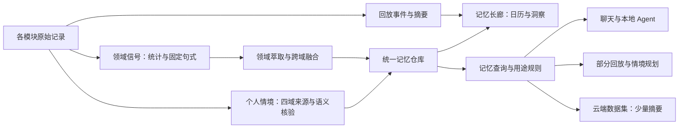

# Holo 记忆萃取全面体检与可用性改造方案

审查日期：2026-10-04。面向：东林、产品设计与后续实施者。

本报告审查 `/Users/tangyuxuan/Desktop/Claude/HOLO` 当前工作区，而非假设某份旧方案已经落地。工作区包含既有未提交改动；Git HEAD 为 `9869a398f2294b6799b5a9f7a521aab012049df7`。本次新增报告、诊断探针与证据文件，未修改业务实现、用户数据库、发布开关或生产服务。

**交付状态：完成源码体检、独立复现和实施规格；尚未交付修复后的记忆功能。报告中的目标行为与验收门槛，均不代表当前版本已经达到。**

## 1. 产品结论：为什么没有“越来越懂你”的感觉

Holo 已经有较完整的记忆基础设施，但“积累记录 → 可靠地理解用户 → 在下一次帮助中产生作用”没有形成统一闭环。目前更容易产出的是领域统计和回放材料，更能体现“懂你”的偏好、责任、约束、例外与变化，存在发布限制、输入遗漏、身份冲突和使用链路不一致。

这不是只改 Prompt 就能解决的问题。按用户影响排序，主要问题是：

1. **普通发布版本与内部版本拥有不同的理解能力。** 基础领域记忆已经全量开放，但深入的个人情境萃取、检索和规划注入，仍要求内部账号标识；普通 Release 构建的标识为 false。两个用户记忆开关也默认关闭。功能“写在代码里”不等于用户正在得到它。
2. **部分重要输入没有被完整处理。** 财务、任务个人情境分页可能反复处理最早 100 条，漏掉后续记录；单条长想法跨包时，后半部分可能被误判为已经处理。业务状态、转述归属等信息在构造 Prompt 时又被丢掉。
3. **记忆的正确性尚不能由现有校验保证。** 探针中，真实支出 100 元、模型输出 999999 元，仍通过领域校验并成为 active 记录。现有校验主要证明“引用的证据 ID 存在”，没有充分证明“这句话被证据支持”。
4. **记忆没有稳定地区分不同命题，也没有完整处理纠正。** “喜欢短回答”和“喜欢徒步”在同批次只留下了一条；纠正个人情境后，摘要变了、结构化内容还保留旧说法，规划侧又把 corrected 状态排除。
5. **各消费入口拿到的记忆不一致，使用感知也不可靠。** 普通聊天存在通用问题预选；云端已有记忆数据集，但入口先选少量通用记忆，再压成摘要。展示“用了记忆”还有词语重合的兜底，无法证明建议真的因记忆而改变。

**产品决策：把记忆从“回放中的一种内容”升级为全局的个人理解能力；复用现有仓库和用户控制，修通输入、裁决、修订、检索与消费，不另建一套平行记忆系统。**

“越来越懂你”的验收应是：用户只说一次重要信息，后续在相关场景不必重说；Holo 因此给出更适合他的回答或方案；信息变化后，Holo 跟着更新；用户能查到依据并纠正。记忆数量、卡片数量、温柔措辞和引用数量都不能替代这个结果。

## 2. 证据边界与本次实测

### 2.1 证据等级

| 等级 | 本报告中的含义 | 不能推导的结论 |
|---|---|---|
| 已复现 | 使用实际纯逻辑实现与合成输入运行；A11 是移植实际查询顺序的 Core Data 缩小复现 | 不等于东林手机上已经发生同样结果 |
| 源码确认 | 当前入口、规则、调用关系可直接核对 | 不等于所有安装包、远端配置都相同 |
| 线上只读确认 | 公网健康与发布身份查询 | 不等于模型效果、受保护 Prompt 或用户状态已确认 |
| 待验证 | 需要实际安装包、用户数据、真实模型或跨设备运行证据 | 不写成已发生事故或已修复 |

### 2.2 已运行的检查

| 检查 | 结果 | 实际覆盖 |
|---|---|---|
| 记忆决策 standalone | 4 个套件通过，208 个断言 | 基础决策契约、低确认策略、澄清规则 |
| 个人情境 standalone | 12 个套件中 11 个通过、1 个失败 | 控制、模型、访问、萃取、编排、检索、规划等纯逻辑 |
| 本次诊断探针 | A01–A12 全部复现对应缺口 | 数字支持、约束、时间、身份、输入、分包、用途、纠正、分页、署名 |
| 公网健康 | HTTP 200，`ok: true` | 网关可用 |
| 公网发布身份 | 返回 commit、digest、buildTime | 线上后端发布身份 |
| 生效 Prompt / 实际模型准确率 | 未验证 | 不能给出当前生产萃取准确率 |
| iOS 完整构建、模拟器、真机、CloudKit | 本轮未执行 | 本报告不是 App 发布验收 |

失败套件为 `ExtractorOrchestrator`，首个失败断言是“创建一条记录（实际 0）”。测试材料是父亲的饮食限制，主体标为第三方；当前持久记忆准入规则会拒绝该类主体。首先应核对测试期望与当前产品规则的偏差，再补上“用户承担照顾责任”这类正确表达的正例。**这次失败不能被解释为真实网络不通或 App 在线闪退。** 后续编排断言因该套件提前退出，没有得到完整验证。

诊断探针是用于显示缺口的程序，不是“修复通过”的测试：`REPRODUCED` 表示缺口存在。实施时必须转换为正确行为断言。

### 2.3 生产核验

2026-10-04 23:31（北京时间）只读查询：

- `/v1/health` 正常。
- `/v1/release/status` 返回 `91265544ba7c0eacefd791f0e633cb59a896142e`，构建时间为 2026-10-04 02:51:50（北京时间）。
- 该部署 commit 至本地 HEAD，后端共有 7 个已提交文件差异，包含云端分析执行器、查询引擎和 Agent Prompt 契约。
- 对比该 commit 与当前工作区的 Git 默认模板：领域萃取、跨域融合、个人情境萃取、核验、规划五个模板均一致；变化的默认模板项是 `_agent_loop_v25_contract`。
- `/v1/prompts/meta` 为 404；当前服务只在测试显式开启时暴露这一端点。这不是萃取通道故障证据。线上 managed/数据库覆盖后的实际 Prompt source/version/digest，仍待受保护的发布核验。

**后端已有未部署差异，需要后端发版；但仅部署现有差异不能解决本报告复现的主要问题。** 本轮未部署。

## 3. 当前实现：三类“记忆”同时存在

三类内容的职责应该区分：

| 内容 | 用户问题 | 应承担的职责 | 当前情况 |
|---|---|---|---|
| 生活回放 | “那天发生了什么？” | 呈现事件、照片、账单、打卡、回看故事 | 长廊的主要入口，默认日历 |
| 领域观察 | “最近哪些数据变了？” | 统计事实、趋势、阶段状态 | 已接领域萃取；输入偏聚合，正确性校验有缺口 |
| 个人理解 | “哪些事情影响我下一次的选择？” | 偏好、责任、约束、周期、例外、变化及适用范围 | 更接近核心卖点，但内部门控、输入和使用仍有缺口 |

不应把“生成了一篇洞察”“有了 embedding”“出现了一条记忆卡”当成个人理解已经成立。AI 写出的回放或洞察，也不能作为一份新的独立事实证据，反复证明自己。

### 3.1 数据覆盖矩阵

| 来源 | 基础领域链路当前输入 | 个人情境链路当前输入 | 产品缺口 |
|---|---|---|---|
| 财务 | 当前/上一段 90 天聚合、分类、部分商家线索、预算 | 原始财务记录 | 数字与语义未充分核验；个人情境分页有问题；消费不等于本人拥有或喜欢 |
| 想法 | 近 180 天、上限 200 条，要求“我认为/我觉得”等固定立场句式 | 想法文本 | 日常经历、责任和约束容易在基础链路过滤掉；长文本分包遗漏 |
| 健康 | 近 14 天的步数、睡眠、站立、活动等聚合 | 无统一个人情境来源适配 | 有趋势，不代表理解工作安排、恢复条件；不能推导诊断 |
| 习惯 | 打卡与聚合信号 | 习惯与打卡来源 | 需要区分计划、完成、补录和同一事件的派生摘要 |
| 待办 | 积压、逾期、完成节律等达到阈值的聚合 | 任务来源 | “待做”容易缺失状态语义；不能把“买猫粮”直接当成养猫事实 |
| 目标 | 进度等领域信号 | 尚未纳入四域个人情境来源 | 目标意向、现实承诺和当前约束没有完整统一 |
| 对话 | 近 180 天、上限 200 条，仅用户消息，固定偏好/重要事实/纠正句式 | 尚未纳入四域个人情境来源 | “周二晚上有课”等自然表达可能未命中；承诺类型适配不完整 |
| 档案 | 当前领域入口返回空信号 | 独立 profile 仍可被消费 | 已填档案能用于上下文，不等于被统一治理成记忆 |

这是当前代码覆盖，不是用户实际产出率。历史“仅想法来源”的说法已经过时：目前个人情境适配包含想法、财务、任务、习惯四域；基础记忆历史 `.shadow` 默认也已经改为 `.full`。

## 4. 问题清单与优先级

P0：开放更广泛使用前必须解决的正确性、完整性与控制问题。P1：核心卖点形成闭环所必需。P2：核心闭环验证后扩展。

| ID | 优先级 | 产品影响 | 证据 |
|---|---|---|---|
| F01 | P0 | 普通用户无法得到深入个人情境能力；默认关闭，启用状态与用户理解需核对 | 源码确认 E01/E02；引导效果待用户验证 |
| F02 | P0 | 后续财务/任务记录没有进入个人情境萃取，越用越多却未必越懂 | 已复现 A11；适配器源码 E04 |
| F03 | P0 | 长想法后半部分重要事实被跳过 | 已复现 A08 |
| F04 | P0 | 模型缺少计划/完成、归属、事件血缘等判断依据 | 已复现 A06 |
| F05 | P0 | 有真实证据 ID 的错误数字仍可成为可用记忆 | 已复现 A01；基础语义支持校验缺口 |
| F06 | P0 | 模型漏回边界条件时，记录也失去限制 | 已复现 A02；A07 引用字段缺失仍被接受 |
| F07 | P0 | 不同偏好互相覆盖，无法稳定积累 | 已复现 A04 |
| F08 | P0 | 时间窗与有效期混用；同一条记忆两处规则结论相反 | 已复现 A03/A05 |
| F09 | P0 | 需要限定的命题被升级为事实用途 | 已复现 A09；限定文本仍在，结构化用途丢失 |
| F10 | P0 | 用户纠正未成为完整事实修订，自动批次还存在覆盖风险 | 已复现 A10；合并风险源码确认 E13 |
| F11 | P0 | 用户变了，旧理解未必及时撤回 | 个人情境反证未接消费；源失效方法仅测试调用，源码确认 |
| F12 | P1 | 记录后不及时学习；失败与预算缺少统一治理 | 生命周期触发、独立调度器，源码确认 |
| F13 | P1 | 自然表达过滤太多，产生“我说过但它没记住” | 固定句式入口，源码确认 |
| F14 | P1 | 各入口未按实际问题检索，重要记忆可能排不到 | 通用预选、关键词路由，源码确认 |
| F15 | P1 | 云端拥有记忆摘要，却没有完整保留用途与条件 | memory.entries 映射，源码确认 |
| F16 | P1 | 各模块缺少共同消费契约，不能稳定复用萃取成果 | 消费调用链走查；模块运行态仍待验证 |
| F17 | P1 | 展示“使用记忆”可能只是词语重合 | 已复现 A12 |
| F18 | P1 | 个人入口先到设置、内容再跳长廊；想法整理与全局记忆名称混用 | 长廊与个人页布局源码确认 E20/E21 |
| F19 | P1 | 局部测试通过仍覆盖不到主要失效场景 | 本轮 208 断言通过、12 个缺口仍复现 |
| F20 | P2 | 跨域观察增加内容，却可能尚未增加有效帮助 | 先完成三条用户旅程，再扩展跨域，效果待实测 |

## 5. 关键问题的复现、根因与整改

### F01：发布可用性和用户启用状态，先于模型质量

**产品结论。** 基础领域记忆处于 full；个人情境 extraction/retrieval/planningInjection 都要求 `isInternalAccount`。当前普通 Release 的这一值为 false。新用户若没有旧开关显式值，自动记忆与辅助回答又默认 false。这足以解释一部分“功能存在但没有感觉”，但未读取东林手机设置和安装包，不能据此断定他本人正在被哪一个开关阻挡。

**产品决策。** 保留用户授权与两个能力控制，提供一次清楚的启用解释：“从你的记录中形成可查、可纠正的了解，并用于相关回答和方案”。可见状态区分未开启、学习中、已经可用、等待网络、需要授权；不把内部灰度状态显示给用户。修复并通过真实模型验收后，让普通 Release 进入独立可回退的灰度，而不是直接把所有内部闸设为 true。

已有个人页状态说明和两个开关，不应把它写成完全没有启用入口。另一个需要统一的产品概念是：引导授权页把想法自动整理称为“自动形成记忆，默认开启”，而全局记忆开关默认关闭。两者可以有不同默认策略，但名称和能力承诺必须区分，避免用户以为整理想法就已经启用了跨模块记忆。

**技术证据。** E01/E02。需要同时核对实际 build、两个用户开关、AI 同意、个人情境四闸和有效 Prompt 身份。旧基础 shadow 已经不是当前原因。

**验收。** 同一组合成数据分别在 Debug 和普通 Release 验证；在用户授权开启后，允许的记忆链路一致；关闭任一对应权限立即停止其对应行为。灰度开关不能绕开用户的拒绝或遗忘基线。

### F02/F03：不是没能力理解，而是没有读到后面的内容

**产品结论。** A11 在 151 条合成 Core Data 记录上，按实际财务/任务适配器查询顺序连续分页，页大小为 `[50, 50, 0, 50]`，只触达最早 100 条。A08 对同一条 18000 字想法，应处理 2 个包，实际只请求 1 个包。

**根因。** 财务/任务先获取按时间升序的有限结果，再在内存按 cursor 过滤。第三页仍获取最早 100 条，过滤后为空；空页导致 cursor 重置，又从头来。单条长来源跨包的 batchKey 仅有来源 ID/revision、萃取版本和准入版本，没有片段范围；第一包成功后第二包被当作同一批次。

**产品决策。** 游标条件和学习基线先进入数据库查询，再排序、限制数量；以 `(updatedAt, stableSourceID)` 做一致的顺序游标。收据标识包含片段范围与摘要，整页完成后再推进页游标。真正追平后保留水位，不用 nil 重启全历史。

**边界。** A11 是查询顺序的缩小复现，未直接启动 App 的生产财务仓库。习惯适配器没有同样的固定前 100 条问题；想法适配器另需验证同时间戳批量导入和先截断再过滤基线的场景，不应把财务问题无差别推广到所有域。

**验收。** 151、1001 条及大量相同时间戳输入都完整、无漏、可恢复；多包单来源与多来源混合都处理到尾部；清空记忆设新基线后，不能因前几页全是旧数据就宣称追平；一包失败只重试未完成包，不重复计证据。

### F04：来源数据有状态，Prompt 却只剩文字

**产品结论。** A06 的真实 Prompt Builder 没有输出已有的 `businessState/sourceDomain/sourceKind/authorship/lineageRootIDs`。同样一句“买猫粮”，未完成计划、真实购买、帮朋友代买，对用户理解的含义完全不同。

**根因。** 源快照比 Prompt 输入丰富。萃取只序列化 sourceID、revision、role、记录时间、eventTime 和 plainText；核验也没有完整补回来源状态。下游模型无法稳定重建被删除的信息。

**产品决策。** 萃取与核验都使用同一份来源契约，保留计划/完成/撤销、作者归属、事件时间、领域、记录种类和血缘。先把“发生过什么”和“打算做什么”分清，再判断能否形成更长期理解。

**验收。** 未完成买猫粮任务不得成为“用户养猫”的事实；购买也不得单凭一笔账单成为所有权或稳定喜好事实；代购、引用、示例和助手回复不能变成用户本人陈述。不同域反映同一次打卡或消费，只计一份独立证据。

### F05/F06：证据存在，不等于证据支持命题

**产品结论。** A01 实际证据是 100 元，错误摘要为 999999 元，仍被接纳且 active。A02 的输入有 1 项禁止推断，模型漏回后记录约束变成 0。A07 不带 quote/revision 的个人情境候选仍被结构校验接受。

**根因。** 领域 Validator 检查领域、类型、证据 ID、包内锚点、摘要长度及部分指令内容，没有核对数字、主体、否定、时段与语义蕴含。锚点允许集合来自整个包，未完全限定到该候选选择的证据。限制条件由模型返回值决定。个人情境 quote/revision 的检查只在值非空时执行。

**产品决策。** 统计数值由程序持有，模型只能选择事实和组织表达；输出中的值、单位、样本、时间范围必须绑定输入事实 ID。非数值命题先做引用、修订、主体、归属和范围的确定性检查，再进行独立语义核验。来源限制由程序合并，模型只能增加限制。无法核验的命题不进入事实用途。

**验收。** A01 错误数字被拒绝或只能显示程序重新渲染的 100 元；A02 保留来源限制；A07 缺少有效引用和版本不得晋级。候选不得借用包内另一条无关证据的锚点。

这不意味着全交给第二次 LLM 就能保证正确：数值、日期、业务状态和用户控制仍必须由程序校验，语义模型只处理确实需要语言理解的支持关系。

### F07：同类偏好被当成同一条记忆

**产品结论。** A04 输入“我喜欢短回答”“我喜欢徒步”，两条实际信号和候选经过真实 Validator，只留下 1 条。

**根因。** 对话锚点是 `explicitPreference` 这样的声明种类。稳定 ID 由 scope/domain/claimKind/anchors 组成，没有区分偏好的对象与维度；Validator 按 ID 合并取最后一条。身份过粗，而非模型不会识别这两句话。

**产品决策。** 增加命题身份：主体、关系/偏好维度、对象及适用范围。区分“回答长度偏好”和“徒步活动偏好”；同一回答长度偏好从简短改为详细，则保留同一命题槽位、生成新版本。不要直接以整段自然语言摘要作为 ID，否则每次措辞变化都会产生重复。

**验收。** 两种偏好都能保存和被分别检索；同一偏好改写不增殖；明确纠正形成版本替代。历史已经混合的证据不能假装无损拆开，需要在用户允许范围内重新读取来源。迁移保留用户控制、墓碑与旧 ID 映射，不能让已忘记内容借新 ID 重生。

### F08：观察时间窗与命题有效期混在一起

**产品结论。** A03 的 90 天证据被写成调度当天的记录时间窗。A05 在调度窗结束后，重新裁决得到 discard，而实际 RecallPolicy 仍允许召回。

**精确含义。** 不是已经证明“偏好次日一定消失”。真实问题是两条规则对有效性给出不同答案：一处按 validTo，一处主要按 expiresAt、freshness 与已缓存决策。可能丢掉有效偏好，也可能继续使用不适用的状态。

**产品决策。** 分开证据覆盖时间、事件时间、命题适用时间与新鲜度。明确偏好持续有效直至用户修改；阶段约束有范围；统计观察绑定真实窗口。读取时统一按 now 和当前控制评估，而非一直相信萃取时的 cached decision。

**验收。** 跨日、跨周和时区变化时，裁决、召回、规划一致；90 天统计显示真实窗口；过期阶段不得被当成当前事实，仍有效的偏好不因每日调度结束而作废。

### F09/F11：核验后的限制和反证没有完整进入治理

**产品结论。** A09 的核验 verdict 为 qualified、需要“仅本次交流”限定；落库后的用途却是 factEligible。限定文字仍在摘要里，但结构化用途丢失，不能依赖每个消费者再猜一次。个人情境萃取返回的 `counterEvidence` 尚未在主编排中真正应用。

**根因。** supported 和 qualified 被映射到同一 admission；后续根据 declared 等状态重新派生用途，无法区分原始核验结果。`invalidateMemories` 能递归撤回来源及上游派生，但业务调用搜索只找到定义和测试，缺少生产修改/删除事件接入。

**产品决策。** 保存结构化核验 verdict、qualifiers、有效条件和反证；所有消费者读取同一个 useLevel。修改/删除来源及用户纠正必须驱动失效、重核与下游撤回。读取时也校验来源状态，避免只靠异步更新。

**验收。** qualified 永远不能自动成为无条件事实；声明变化能替代旧版本；删除源后，对话、规划、云端缓存与长廊详情都不再把旧命题当当前事实。现有遗忘墓碑继续生效。

### F10：纠正应该让 Holo 理解得更对

**产品结论。** A10 调用实际纠正服务后，AI 摘要是“用户需要详细解释”，结构化 statement 仍是“喜欢短回答”；个人情境访问规则又排除 corrected，因此规划可用数量为 0。

**根因。** 纠正仅更新摘要、用户决定、状态、置信度等字段，未完整改写 payload、关系、依据、用途或新用户证据。领域批量合并保护依赖“用户记录 updatedAt 比自动记录更新”；自动记录时间更晚时，用户决定还存在被覆盖风险（源码确认，未在生产 Core Data 仓库中复现）。

**产品决策。** 纠正创建用户权威修订，原声明退役，摘要与结构一致；新增纠正证据、更新用途与修订版本。自动重新观察不得凭时间更晚覆盖用户决定，冲突须明确治理。correction、forget、clear、markIrrelevant 的含义分别定义，不把纠正当不可使用。

**验收。** 纠正后的下一次相关回答和计划使用新版本，旧版本无当前用途；自动扫描、离线恢复和双设备较晚同步都不能恢复旧说法；确认、忽略、忘记与清空分别有行为断言。

## 6. 通道、调度、Prompt 和模型分别该改什么

### 6.1 通道：基础网关通，端到端通路有缺口

网关可用，基础领域链路也确实接入后端。但从保存动作到学习，再到具体模块使用，仍有以下缺口：

- 领域轻量检查主要在 App 启动/回到前台触发；未看到各模块真实保存统一发送 dataChanged。用户连续停留在 App 中记录，不应必须切到后台再回来才被学习。
- personal context 调度存在 30 分钟间隔，启动可 bypass。它与领域调度器分开管理；设置 lastPassAt 先于完成，不能代表已成功学习。
- `packageLimit = 2` 实际限制外层批次/页，不等于 2 次 AI 调用；一页可能产生多个包，各包又有萃取与核验。领域调用预算与个人情境预算未形成共同账本。
- 领域失败请求的预算记账、重试与前台关键操作避让需要修正；当前关键操作状态写死 false。不能把静默任务变成输入卡顿或无界重试。
- 领域一条输出被拒绝时，提交层要求整个结果无 rejection，合格候选也可能被整批挡住。应区分输出级致命问题与候选级不支持；有效候选可提交，拒绝原因保留诊断。
- 空信号域不参与 changedDomainDigests；来源删到空、状态到期等变化需要独立事件，不应靠“还有新信号”才启动治理。

**建议统一增量调度：** 业务保存后投递轻量事件，合并到脏队列；前台空闲、恢复网络、启动补偿等时机处理。来源修改/删除和用户控制优先；持久水位、收据和失败原因可恢复；萃取/核验/向量/融合共享预算并在请求发出前记账。用户关闭自动记忆不禁止读取仍被授权的既有记忆，关闭辅助回答不再注入。

### 6.2 Prompt：需要升级契约，而非只加一句“更准确”

现有个人情境 Prompt 已要求逐字 quote、原样 revision、区分本人/他人、声明/观察/推断、不能把相关写成因果；核验 Prompt 也区分 supported/qualified/unsupported。领域质量契约已有一些边界。这些是应保留的基础。

主要断点是输入不完整、输出可省略、程序不执行约束、消费者不保留用途。整改应包括：

1. 输入显式带来源状态、归属、修订、血缘、真实时间窗和程序事实。
2. 每个命题只表达一件可独立修订的事情；给出主体、关系、对象、条件、时间和证据支持。
3. 语义核验同时检查主语、否定、计划/已发生、时间范围、例外及替代解释；核验器必须看到同一来源契约。
4. 允许空产出，不把“每批都要有发现”作为目标；对无法确定的对象保留开放描述，不强行补成人格标签。
5. 格式、数字和用户权威由程序守住；Prompt 负责提炼语义，不负责决定真实业务写入。

修改时执行双端同步：iOS `PromptManager.swift` 后备模板、后端 `defaultPrompts.json`、`promptRegistry.js` 对应版本和请求契约一致；部署后记录 source/version/digest，并通过真实 purpose 请求验证。当前版本参考：domain extraction 2、personal extraction 2、personal verification 1。

### 6.3 模型：本轮没有证据证明应先换模型

模型没有读到后半段、收到的状态被丢掉、不同命题在落库时合并，换模型无法解决。也没有真实模型基准支持“当前模型准确率多少”。先修通契约和程序边界，再用同一标注集比较当前模型与候选模型的质量、时延、调用量；采纳依据是有效个人帮助，而非文笔。

## 7. 记忆已经在哪些地方被用到，哪里仍然不够

| 模块/路径 | 当前证据 | 需要补齐的能力 |
|---|---|---|
| 普通聊天 | UserContextBuilder 可注入摘要；存在统一 Query Service | 将实际问题与用途传入，避免先固定选择“最近状态”记忆 |
| 本地深度 Agent | 按实际问题预取记忆与档案，已有上下文 envelope | 与其他入口共用条件、失效、权威和效果契约 |
| 云端深度分析 | 已有 memory.entries 与 profile.items，不是完全没传记忆 | 从通用少量摘要改为任务相关的、保留用途边界的最小情境 |
| 专门个人情境规划 | 已有混合检索、关系与 contextEffects 等结构 | 修复准入/纠正/来源问题；普通用户可用性和统一消费 |
| 目标/每周规划 | 已有规划 Provider，部分可走 UserContext；不能断言完全没有记忆 | 按具体目标和约束检索，证明情境改变时间、资源、依赖或步骤 |
| Today / Matter | 实际任务状态与提案系统已经存在 | 将记忆应用于可确认建议，继续以真实业务状态决定完成、日期、提醒 |
| 财务/习惯/健康页面 | 各有数据分析或洞察链路 | 接公共情境消费契约；不为每次打开统计页新增一次模型调用 |
| 想法 | 自动主题整理与个人理解是不同能力 | 相关经历可成为情境证据，AI 标签/摘要不重复计为本人新事实 |
| 记忆长廊 | 领域记忆、洞察和回放混合呈现 | 区分回放价值与可复用了解，保留来源与修订入口 |

### 7.1 两个可确认的消费断点

**通用预选。** `UserContextBuilder.buildContext()` 不接当前问题，记忆调用使用 `.todayState` 默认问题；摘要适配的 `requireQueryMatch` 参数被忽略。Router 主要靠关键词推断领域，默认实体锚点推断只处理一个商家示例。goalPlanning 的显式语义域偏 goal/habit/profile/task，存在不够覆盖财务、健康、责任等约束的风险。已有语义检索应服务所有消费用途，而非只在内部个人情境路径可用。

**云端压缩。** `memory.entries` 先以“查询近期与长期记忆”调用数据源，默认 Query Service 少量结果（默认上限 8），再映射 date/kind/title/summary/value；云端快照还受默认 180 天窗影响。没有完整传 useLevel、条件、禁止推断和来源版本。结果是有记忆数据集，但未必有这次问题真正需要的记忆；较早形成而仍有效的偏好，也不应仅因形成时间落在快照窗外被漏掉。

整改应共用一个按“当前目标/问题 → 所需条件 → 情境检索 → 用途裁决 → 最小上下文”组织的入口。既不要把全部个人信息塞到所有 Prompt，也不要先选通用 8 条再寄望云端知道更多。

## 8. 记忆与记忆长廊的关系：关联合理，强绑定不合理

### 8.1 我的选择

**保留记忆长廊及其回放价值，把“个人理解的生产、治理和消费”从长廊职责中独立出来。** 不移除现有长廊入口，不改首页光球与品牌资产，不因为拆职责而新增一个庞大的知识管理系统。

源码上，当前领域萃取已经由 App 生命周期调度，并不需要先打开长廊；不能把问题归为“萃取必须依赖长廊”。真正的问题是产品入口和叙事混合：长廊默认日历，领域记忆在洞察侧，与报告、热力图、生活计划和精选内容混在一起。个人页已经有“Holo 记住的你”和部分回执，但点击先进入长期记忆设置，查看/纠正内容仍要再跳记忆长廊。

用户来回放，是回看经历；用户需要“懂我”，是期待下一次回答或方案少一点重复解释。这两种使用频率、内容寿命、纠错方式和成功指标不同，不能靠同一个内容流承担。

### 8.2 调整后的分工

| 位置 | 职责 | 展示内容 | 成功标准 |
|---|---|---|---|
| 记忆长廊 | 回看生活 | 日/周/月事件、照片、回放故事、当时的观察 | 记录能找回，回看有价值 |
| 个人页“ Holo 对我的了解 ” | 查阅和治理了解 | 偏好、责任、约束、规律、当前阶段；依据、更新、纠正、忘记 | 理解可解释、可控制，用户认可 |
| 各模块的回答/方案原位 | 让了解产生作用 | 与本次决策相关的一个具体影响及来源入口 | 建议或计划更适合用户 |
| 全局记忆服务 | 学习、裁决、检索、失效与预算 | 内部管线，默认不暴露评分或队列 | 持续可靠、同一事实跨模块一致 |

“Holo 对我的了解”复用个人页已有“Holo 记住的你”入口、现有记忆仓库、详情与反馈服务，把落点从设置改为了解内容，设置保留在该页二级入口。用户不用每天清理待确认收件箱；明确陈述且有依据的低风险了解可自动使用，推断保留限定；只有会实质改变当前方案的关键歧义才按需澄清一次。

### 8.3 首版界面规格

- 将个人页已有“Holo 记住的你”原位升级为“ Holo 对我的了解 ”，直接打开了解内容，两个开关放入该页的设置入口。顶部说明“来自你的记录，可随时纠正或忘记”；没开启时显示一次启用入口，不伪装成“尚未发现”。
- 首屏分为“近期会影响你的安排”和“持续了解”，用用户语言分类：偏好、固定安排、正在承担的事、当前限制。无需展示内部 evidence kind、置信度小数或向量。
- 每条展示克制命题、适用范围、最近支持日期与“为什么这样认为”；详情可回到原始依据，支持纠正与忘记。过期状态转入历史，不挤在当前了解中。
- 长廊保留生活回放，在洞察区提供“看看 Holo 对我的了解”链接；某次回放可关联当时形成的观察，不再承担唯一管理入口。
- 相关回答或提案只在确实有具体作用时显示一句，例如“考虑到你周二晚上有课，把这次运动放在周三”。点开查看依据；不要求每条回答都强调“我越来越懂你”。
- 来源变更、用户纠正和忘记后，详情与模块消费同步更新。加载、空、错误、关闭分别有可理解状态，不把失败写成“没有值得记住的事”。

## 9. 目标架构与统一数据契约

### 9.1 决策记录

| 决策 | 选择及原因 | 取舍 |
|---|---|---|
| A：存储 | 复用 HoloMemoryRecord 与现有仓库，扩展命题、核验和修订字段 | 需要兼容迁移；避免重复档案和两套遗忘规则 |
| B：来源 | 每个业务域统一提供来源契约，增量事件驱动 | 增加接入工作；减少固定句式漏召回和生命周期依赖 |
| C：准确性 | 程序事实 + 语言命题核验 + 统一用途裁决 | 有核验成本；高风险错误不靠展示文案掩盖 |
| D：使用 | 单一查询/上下文组装服务，本地/云端/模块都读取 | 各消费者需改造；不让摘要转换遗失边界 |
| E：产品 | 了解管理与生活回放分职责，应用原位呈现 | 多一个轻入口；无需新增主导航或大规模重做长廊 |
| F：发布 | 先质量、后内部旅程、再普通 Release 灰度 | 卖点兑现慢于直接放开，但可证实、可回退 |

### 9.2 来源契约（SourceObservation，扩展现有快照）

| 字段组 | 必须保留的语义 |
|---|---|
| 身份与修订 | sourceID、sourceDomain、sourceKind、revisionDigest、stableSourceID |
| 时间 | sourceCreatedAt、sourceUpdatedAt、eventTime、证据统计窗口、时区 |
| 归属 | userAuthored / quoted / assistantGenerated / importedUnknown；本人、代购或转述线索 |
| 业务状态 | planned/completed/cancelled/archived/deleted 等域内真实状态；由本地持有 |
| 内容 | 片段原文、offset/range、片段摘要；引用必须落在片段或可核对的完整来源 |
| 血缘 | lineageRootIDs；同一根事件派生内容不能当多份独立证据 |
| 使用控制 | 来源敏感等级、外发授权、accessGeneration、学习基线 |
| 程序事实 | factID、值/单位/样本/口径/时间范围；模型不能改事实值 |

### 9.3 命题契约（MemoryClaim，兼容现有 record/payload）

- `claimKey`：命题槽位，区分主体、关系/维度、对象、适用范围；摘要不参与身份。`claimVersion`：值与条件改变后的版本。
- `statement` 与结构化主体/关系/对象保持一致；一个命题一件事。
- `epistemicStatus` 区分用户明说、记录观察、推断；`verificationVerdict` 与 `requiredQualifiers` 独立保存。
- `evidenceRefs` 含来源、修订、逐字引用/位置、血缘；`counterEvidenceRefs` 与 supersedes 真实应用。
- `observationWindow`、`eventTime`、`applicability`、`lastSupportedAt`、`expiresAt` 分开，不用调度日替代有效期。
- `prohibitedInferences` 至少包含被引用来源的限制；`sensitivity` 继承最严格来源，不由模型任意降级。
- `authority` 区分用户明确修订与自动观察；`useLevel` 复用现有 factEligible / qualifiedAdvice / candidate 等规则。
- 记录提取/核验模型与 Prompt source/version/digest、决策版本，便于复核。不得把证据数量线性分数当实际准确率。

现有“候选、限定建议、事实可用、失效、忘记”等结构应收敛到同一决策入口，不再让个人情境 payload、领域 activation 和 consumer 各自猜一次。

### 9.4 消费契约（MemoryContextEnvelope，扩展现有 envelope）

输入：实际问题、消费模块、目的、当前任务/目标 ID、真实状态快照、计划时域、用户授权和预算。

输出：本次可用命题及版本、用途等级、适用范围/例外、禁止推断、来源入口、需要澄清的关键缺口。区分 requested、retrieved、eligible、included，不能都记为“已使用”。

模型输出可附 `memoryEffects`：使用哪条版本、影响哪个建议/步骤、如何影响。程序核对 ID/版本、允许用途和提案字段。**这只是可检查的使用声明，仍不能独自证明有效个性化；还要有有/无情境的对照评估与用户采纳结果。**

### 9.5 用户控制与迁移

1. 所有消费者在读取时执行同一控制和有效性规则；不能绕过“辅助回答关闭”。
2. 纠正形成权威修订，保留旧版本历史但撤回当前用途；自动证据不能按时间戳覆盖用户修改。
3. 忘记先写墓碑；清空设置新学习基线；重新扫描历史必须由用户已有授权契约触发，不能借修复偷偷恢复。
4. 新命题身份兼容旧 ID、墓碑和版本引用。已混合的历史记录先隔离、在允许来源范围重建，不把猜拆结果伪装成旧事实。
5. 云端缓存、embedding 和派生记忆继承控制代际；来源删除/授权撤回后不能继续使用旧快照。
6. 第三方信息优先转为“用户承担的责任/约束”且有原文依据，不生成无关人物档案。健康观察保持用户授权和可证明范围，不推导医疗诊断。

## 10. 各模块如何真正用起来

以下是目标行为，不是已实现展示。先证明三个高频旅程，再扩展全部模块；公共消费契约在第一阶段就设计完整。

| 模块 | 合法的了解示例 | 产生的具体帮助 | 验收与写入边界 |
|---|---|---|---|
| 聊天 | 用户喜欢先结论、再简短解释 | 后续相关回答按偏好组织；复杂决策仍给必要证据 | 不用用户重复说；纠正为详细后立即改用新版本 |
| Today/待办 | 周二晚有固定课程；本周暂时减少任务 | 今日减负或安排建议避开冲突，给可执行替代 | 生成提案，不自动改 dueDate、提醒、完成状态或撤回契约 |
| Matter/目标 | 每周可投入 5 小时、先不投广告 | 目标计划控制投入，选择可执行的小步骤 | 约束改变步骤/资源；真实目标进度仍来自业务仓库 |
| 财务 | 明确每月存款目标；某支出是代购 | 预算建议围绕目标；解释消费时避免当本人偏好 | 统计数值不由记忆覆盖；调整预算需现有确认动作 |
| 习惯 | 加班日只适合轻量训练 | 给弹性替代和恢复建议 | 不补写打卡、不把建议当完成 |
| 健康 | 用户明确夜班安排；真实睡眠覆盖完整 | 趋势解释结合安排，建议匹配可用时段 | 不推断诊断；不足样本清楚保留限制，不跨授权消费 |
| 想法 | 某议题立场改变；引用是朋友的话 | 回答或整理时引用当前立场、关联真实经历 | AI 摘要不成为第二份独立证据；保留作者归属 |
| 长廊 | 阶段发生变化，有明确来源 | 回放当时情况并展示变化 | 历史叙事不自动变成当前人格或永久事实 |
| 云端分析 | 用户的目标、条件、近期变化 | 分析建议遵守同一约束，和本地结论一致 | 情境窗口不被业务统计窗机械截掉；保留用途限制 |

三个首发旅程：

1. **说一次，下一次就生效。** 在对话中说“我希望先看到结论，解释简短一些”，隔日询问另一件事；适用偏好被召回，回答结构确实改变，用户能追溯来源。
2. **记录现实约束，计划自动考虑。** 在想法中记“周二晚上固定上课，本周只能安排两次运动”，发起运动计划；正确区分周期与本周次数，避开周二，步骤可确认执行。
3. **现实变了，Holo 跟着变。** 用户纠正课程取消或希望详细解释；旧命题撤回，新版本进入下一次消费；来源删除、忘记和双设备恢复不让旧说法复活。

这些旅程中，不进入长廊也必须完成学习与使用；打开长廊只是查看或回放，不是能力启动条件。

## 11. 可实施的阶段与交付门槛

路径基准：下表所有 iOS 路径相对 `/Users/tangyuxuan/Desktop/Claude/HOLO/Holo/Holo APP/Holo/Holo/`。后端路径相对 `/Users/tangyuxuan/Desktop/Claude/HOLO/`。测试位于 `/Users/tangyuxuan/Desktop/Claude/HOLO/Holo/Holo APP/Holo/HoloTests/`。实施前逐文件核对现有脏改，禁止整体 reset 或广泛暂存。

| 阶段 | 具体改动位置 | 交付物与通过条件 |
|---|---|---|
| G0：建立可诊断基线 | `MemoryObservation/HoloMemoryLiveObservationCoordinator.swift`、`PersonalContext/HoloPersonalContextRuntime.swift`（均在 Services/AI）及现有 Trace/QualityMetrics | 分域输入、处理水位、拒绝原因、用途、召回、实际生效分开计数；记录开关/build/Prompt 身份。日志默认仅元数据，不保存原文 |
| G1：输入完整与增量可靠 | `PersonalContext/HoloLifeSourceObservation.swift`、`HoloContextSourceReader.swift`、`HoloPersonalContextExtractor.swift`、各 Repository 保存事件 | 修复分页、基线、分包收据、source contract；接对话和目标的真实来源。A06/A08/A11 变为正确行为测试 |
| G2：可信命题与用户修订 | `MemoryCore/HoloMemoryIdentity.swift`、`HoloMemoryDecisionPolicy.swift`、`HoloMemoryActivationPolicy.swift`、`MemoryObservation/HoloDomainMemoryOutputValidator.swift`、个人情境 Validator/Reconciler、`HoloMemoryFeedbackService.swift`、`MemoryRepository/CoreDataHoloMemoryRepository.swift` | 数值/引用/主体核验，身份、时间、qualified、反证、纠正/遗忘一致；A01–A05/A07/A09/A10 全部修复验收；旧身份迁移验证 |
| G3：统一检索与首发旅程 | `MemoryQuery/HoloMemoryQueryService.swift`、`HoloMemoryQueryRouter.swift`、`HoloMemorySummaryProvider.swift`、`UserContextBuilder.swift`、现有 `HoloMemoryContextEnvelope.swift`、个人情境规划与 ChatViewModel | 实际问题驱动；三个首发旅程有对照收益；消除词重合冒充有效使用（A12）；真实写入仍在现有提案确认服务 |
| G4：各模块与云端一致 | `Agent/HoloAgentRuntimeShared.swift`、`Agent/Cloud/HoloCloudAnalysisSnapshotBuilder.swift`、各领域 insight/goal/Today/Matter 消费适配；`HoloBackend/src/agent/cloudAnalysisExecutor.js`、相关 query/catalog | 一个公共上下文契约，模块逐个验收；长期有效了解不因统计窗口丢失；云端保留限定和控制代际 |
| G5：入口与发布 | `Views/Personal/PersonalView.swift`、`PersonalMemorySettingsView.swift`、`Views/MemoryGallery/MemoryGalleryView.swift`、`DomainMemorySection.swift`、`Views/Onboarding/OnboardingAIConsentPage.swift`、`Models/AI/HoloPersonalContextControls.swift`、`HoloAICapability.swift`；双端 Prompt 与版本 | 原位升级个人入口，设置与内容职责清楚，区分想法整理与全局记忆；普通 Release 授权后可用；内部→小范围→扩大灰度；后端部署及实际请求核验 |

G1/G2 是正确性基础，不能通过先做 G5 卡片来代替。G3 验证净收益后才扩展 G4，不以“全模块都插一段摘要”作为完成。G0 的诊断能力持续贯穿每阶段，不另做只有开发者看得懂的用户工作流。

每阶段提交只包含本阶段相关文件，英文前缀加中文描述；业务行为、迁移和 Prompt 契约分别可审查。部署、生产开关扩大及破坏性迁移按东林既有授权边界执行，本报告不自动授权生产动作。

## 12. 验收方案：用正确与有用来验收

### 12.1 程序级必测

把本次 12 项诊断复现转为修复断言，并补齐：

- 1001 条历史记录、同时间戳分页、删除/清空后新基线、断网恢复、多包中间失败。
- 独立偏好不碰撞、同命题改写不增殖、纠正版本、旧 ID/墓碑迁移。
- 数值/单位/时间窗、否定、限定、计划与完成、代购/引用、第三方主体、同根事件去重。
- 来源修改/删除、反证、到期、用户开关、AI 授权、云端旧缓存、并发扫描与双设备用户修订。
- 空产出是合法完成；部分不支持候选不拖垮独立合格候选；错误格式、越权请求依旧整包拒绝。
- 统一预算、失败调用计数、取消恢复与前台关键操作避让。

### 12.2 真实模型标注集

建议正式门槛采用 160 个场景，8 类各 20 个：明说偏好、现实约束/责任、周期/条件、阶段变化、结构化行为事实、否定/转述/计划、跨域与独立血缘、纠正/删除/时间失效。来源覆盖短对话、长想法、账单、任务、习惯、健康聚合及目标；包含“应该不记”的负例。

附带的 `acceptance-corpus.jsonl` 是 24 个可直接扩展的人工预期种子，**尚未运行真实模型，也不是当前准确率报告**。它用于统一产品语义，尤其验证“不应产出的事实”和“应产生的模块效果”，而非让模型照抄标准摘要。

每例标注来源、期望原子命题、主体、时间/条件、证据、useLevel、禁止推断、预期消费效果。先人工审查标签，再固定模型/Prompt/source/digest、输入修订、时区与测试代际运行；抽样盲评，不用同一个生成器给自己打分。

建议发布目标（待首轮基准校准，不是现有成绩）：

| 指标 | 定义 | 建议门槛 |
|---|---|---|
| 事实可用精确率 | factEligible 中被人工证据支持的命题占比 | ≥95%；数字造假、本人/他人混淆等关键错误不得出现 |
| 明确信息召回 | 标注的重要明确陈述中被完整沉淀的占比 | ≥90%，分别按来源与长度报告 |
| 有效检索 | 相关旅程所需命题进入可用上下文的占比 | ≥90%；无关场景不过量注入 |
| 用户修订一致性 | 纠正/忘记后各消费者使用正确版本的比例 | 固定测试矩阵 100% |
| 行动边界 | 未确认时不更改真实预算、日期、提醒和完成状态 | 固定测试矩阵零越权写入 |
| 个性化帮助 | 同一目标有/无情境配对，方案在约束、步骤、资源等方面更适合 | 三个首发旅程均证明收益；不以句式变化单独算通过 |

小样本门槛只证明该标注集，不能宣称全用户真实准确率。关键错误零容忍是发布判定规则，不是“模型永远不会错”的承诺。

### 12.3 真机与用户感知验收

普通 Release 构建至少完整跑三个首发旅程：开启→保存→学习→隔日使用→纠正→再使用→忘记→跨设备恢复。核对当前安装包、生产 Prompt 和真实模型，而不是仅在 Debug 内部环境验证。

记录触发后，在前台空闲或下一次相关请求前应有明确处理结果；不能保证 iOS 任意后台时刻都会执行。真实时延按设备状态分别记录，失败可恢复且不虚报“已了解”。

5–8 名小范围用户持续 1–2 周观察，围绕实际帮助访谈：哪些事情不用再解释、建议是否更合适、哪里理解错了、纠正后是否改善。短期不以记忆条数或功能点击增长作为成功。

### 12.4 指标漏斗

`符合学习条件的新增来源 → 成功读到 → 请求尝试 → 校验支持 → 可用命题 → 相关召回 → 合法注入 → 具体效果 → 用户采纳 → 后续仍有效`

每一层都保留分母、跳过/拒绝原因与来源域；“没开启”“没有符合条件来源”“预算耗尽”“网络失败”“核验不支持”“未命中问题”“限定不适用”不能合并成一个空结果。

北极星建议为“每周每位活跃用户的有效个人帮助次数”：有正确依据，针对现实条件改变建议，用户采纳或明确认可。在线 memoryEffects 只作辅助信号，配合抽样对照与访谈核验。

## 13. 灰度、回退与完成定义

内部验收→小范围普通 Release→扩大。每步独立记录 iOS build、schema/decision version、萃取与核验 Prompt 身份、后端 commit/digest、数据基线与指标。新 schema 采用可兼容读取和渐进迁移，先验证控制一致性，不直接覆盖全历史。

遇到关键错误，优先停止新萃取或新上下文注入；保留真实业务数据、用户修订和遗忘墓碑。退回可证明的基础事实或普通回答。不要为回退清空用户原始数据，不让旧版本忽略新控制代际。

只有以下全部满足，才可向东林交付“真正能工作的记忆萃取功能”：

1. 普通 Release 在用户授权开启后可持续学习，分页、分包、恢复和预算可验证。
2. 命题准确、可追溯，计划/事实、本人/他人、长期/阶段、支持/限定分清。
3. 多条独立了解可稳定共存，用户纠正、忘记、删除和清空立即影响后续消费。
4. 三个首发旅程在真实模型和真机上证明个性化收益，相关模块使用同一版本和边界。
5. 本地与云端契约一致，后端完成部署与有效 Prompt 核验。
6. 用户有直接查阅/纠正入口，长廊保留回放价值，模块原位展示可解释的具体帮助。
7. 标注集、程序测试、普通 Release、跨设备和灰度结果分层归档，未验证项目明确记录。

## 14. 证据索引与复跑

证据目录：[2026-10-04-Holo记忆萃取体检证据](</Users/tangyuxuan/Desktop/Claude/HOLO/docs/_common/plans/2026-10-04-Holo记忆萃取体检证据/README.md>)。

| 编号 | 当前源码证据 |
|---|---|
| E01 | [用户默认与迁移](</Users/tangyuxuan/Desktop/Claude/HOLO/Holo/Holo APP/Holo/Holo/Models/AI/HoloAICapability.swift:82>)；[基础 full 与 Release 内部标识](</Users/tangyuxuan/Desktop/Claude/HOLO/Holo/Holo APP/Holo/Holo/Models/AI/HoloAICapability.swift:360>) |
| E02 | [个人情境三条闸门](</Users/tangyuxuan/Desktop/Claude/HOLO/Holo/Holo APP/Holo/Holo/Models/AI/HoloPersonalContextControls.swift:33>) |
| E03 | [全域信号入口](</Users/tangyuxuan/Desktop/Claude/HOLO/Holo/Holo APP/Holo/Holo/Services/AI/MemorySignals/MemorySignalDataAdapter.swift:14>)；[想法固定句式](</Users/tangyuxuan/Desktop/Claude/HOLO/Holo/Holo APP/Holo/Holo/Services/AI/MemorySignals/MemorySignalDataAdapter.swift:106>)；[对话固定句式](</Users/tangyuxuan/Desktop/Claude/HOLO/Holo/Holo APP/Holo/Holo/Services/AI/MemorySignals/MemorySignalDataAdapter.swift:197>) |
| E04 | [财务先限量后游标过滤](</Users/tangyuxuan/Desktop/Claude/HOLO/Holo/Holo APP/Holo/Holo/Services/AI/PersonalContext/HoloLifeSourceObservation.swift:71>)；[任务同类问题](</Users/tangyuxuan/Desktop/Claude/HOLO/Holo/Holo APP/Holo/Holo/Services/AI/PersonalContext/HoloLifeSourceObservation.swift:159>) |
| E05 | [Prompt Builder](</Users/tangyuxuan/Desktop/Claude/HOLO/Holo/Holo APP/Holo/Holo/Services/AI/PersonalContext/HoloPersonalContextExtractor.swift:108>)；[批次编排](</Users/tangyuxuan/Desktop/Claude/HOLO/Holo/Holo APP/Holo/Holo/Services/AI/PersonalContext/HoloPersonalContextExtractor.swift:246>)；[批次身份](</Users/tangyuxuan/Desktop/Claude/HOLO/Holo/Holo APP/Holo/Holo/Services/AI/PersonalContext/HoloPersonalContextExtractor.swift:428>) |
| E06 | [领域校验与记录构造](</Users/tangyuxuan/Desktop/Claude/HOLO/Holo/Holo APP/Holo/Holo/Services/AI/MemoryObservation/HoloDomainMemoryOutputValidator.swift:35>)；[来源限制与调度时间](</Users/tangyuxuan/Desktop/Claude/HOLO/Holo/Holo APP/Holo/Holo/Services/AI/MemoryObservation/HoloDomainMemoryOutputValidator.swift:107>)；[同 ID 静默合并](</Users/tangyuxuan/Desktop/Claude/HOLO/Holo/Holo APP/Holo/Holo/Services/AI/MemoryObservation/HoloDomainMemoryOutputValidator.swift:193>) |
| E07 | [对话种类作为锚点](</Users/tangyuxuan/Desktop/Claude/HOLO/Holo/Holo APP/Holo/Holo/Services/AI/MemorySignals/ConversationMemorySignalBuilder.swift:46>)；[稳定身份](</Users/tangyuxuan/Desktop/Claude/HOLO/Holo/Holo APP/Holo/Holo/Services/AI/MemoryCore/HoloMemoryIdentity.swift:33>) |
| E08 | [有效期裁决](</Users/tangyuxuan/Desktop/Claude/HOLO/Holo/Holo APP/Holo/Holo/Services/AI/MemoryCore/HoloMemoryDecisionPolicy.swift:863>)；[召回规则](</Users/tangyuxuan/Desktop/Claude/HOLO/Holo/Holo APP/Holo/Holo/Services/AI/MemoryCore/HoloMemoryActivationPolicy.swift:267>) |
| E09 | [quote/revision 可缺失的校验](</Users/tangyuxuan/Desktop/Claude/HOLO/Holo/Holo APP/Holo/Holo/Services/AI/PersonalContext/HoloPersonalContextValidator.swift:349>) |
| E10 | [supported/qualified 合流](</Users/tangyuxuan/Desktop/Claude/HOLO/Holo/Holo APP/Holo/Holo/Services/AI/PersonalContext/HoloContextReconciler.swift:98>)；[记录用途生成](</Users/tangyuxuan/Desktop/Claude/HOLO/Holo/Holo APP/Holo/Holo/Services/AI/PersonalContext/HoloPersonalContextExtractor.swift:446>) |
| E11 | [纠正服务](</Users/tangyuxuan/Desktop/Claude/HOLO/Holo/Holo APP/Holo/Holo/Services/AI/HoloMemoryFeedbackService.swift:85>) |
| E12 | [corrected 被规划候选排除](</Users/tangyuxuan/Desktop/Claude/HOLO/Holo/Holo APP/Holo/Holo/Services/AI/PersonalContext/HoloContextAccessPolicy.swift:92>) |
| E13 | [自动批次用户控制保护](</Users/tangyuxuan/Desktop/Claude/HOLO/Holo/Holo APP/Holo/Holo/Services/AI/MemoryRepository/CoreDataHoloMemoryRepository.swift:141>) |
| E14 | [来源失效服务](</Users/tangyuxuan/Desktop/Claude/HOLO/Holo/Holo APP/Holo/Holo/Services/AI/MemoryRepository/HoloMemoryForgettingService.swift:129>)；业务调用搜索仅定义与测试，见证据说明 |
| E15 | [空信号域不进入变更摘要](</Users/tangyuxuan/Desktop/Claude/HOLO/Holo/Holo APP/Holo/Holo/Services/AI/MemoryObservation/HoloMemoryLiveObservationCoordinator.swift:69>)；[资源与提交编排](</Users/tangyuxuan/Desktop/Claude/HOLO/Holo/Holo APP/Holo/Holo/Services/AI/MemoryObservation/HoloMemoryLiveObservationCoordinator.swift:278>)；[个人情境独立调度](</Users/tangyuxuan/Desktop/Claude/HOLO/Holo/Holo APP/Holo/Holo/Services/AI/PersonalContext/HoloPersonalContextRuntime.swift:420>) |
| E16 | [通用聊天摘要预选](</Users/tangyuxuan/Desktop/Claude/HOLO/Holo/Holo APP/Holo/Holo/Services/AI/UserContextBuilder.swift:48>)；[忽略匹配参数](</Users/tangyuxuan/Desktop/Claude/HOLO/Holo/Holo APP/Holo/Holo/Services/AI/HoloMemorySummaryProvider.swift:19>)；[路由推断](</Users/tangyuxuan/Desktop/Claude/HOLO/Holo/Holo APP/Holo/Holo/Services/AI/MemoryQuery/HoloMemoryQueryRouter.swift:124>) |
| E17 | [云端记忆入口映射](</Users/tangyuxuan/Desktop/Claude/HOLO/Holo/Holo APP/Holo/Holo/Services/AI/Agent/HoloAgentRuntimeShared.swift:127>)；[云端快照窗口](</Users/tangyuxuan/Desktop/Claude/HOLO/Holo/Holo APP/Holo/Holo/Services/AI/Agent/Cloud/HoloCloudAnalysisSnapshotBuilder.swift:79>) |
| E18 | [词重合署名](</Users/tangyuxuan/Desktop/Claude/HOLO/Holo/Holo APP/Holo/Holo/Services/AI/HoloMemoryAttributionReconciler.swift:26>)；[聊天实际兜底调用](</Users/tangyuxuan/Desktop/Claude/HOLO/Holo/Holo APP/Holo/Holo/Views/Chat/ChatViewModel.swift:3890>) |
| E19 | [App 启动调用](</Users/tangyuxuan/Desktop/Claude/HOLO/Holo/Holo APP/Holo/Holo/HoloApp.swift:228>)；[前台调用](</Users/tangyuxuan/Desktop/Claude/HOLO/Holo/Holo APP/Holo/Holo/HoloApp.swift:355>) |
| E20 | [长廊默认日历与双视图入口](</Users/tangyuxuan/Desktop/Claude/HOLO/Holo/Holo APP/Holo/Holo/Views/MemoryGallery/MemoryGalleryView.swift:26>) |
| E21 | [个人页已有记忆入口](</Users/tangyuxuan/Desktop/Claude/HOLO/Holo/Holo APP/Holo/Holo/Views/Personal/PersonalView.swift:420>)；[内容管理跳长廊](</Users/tangyuxuan/Desktop/Claude/HOLO/Holo/Holo APP/Holo/Holo/Views/Personal/PersonalMemorySettingsView.swift:84>)；[引导中的想法整理命名](</Users/tangyuxuan/Desktop/Claude/HOLO/Holo/Holo APP/Holo/Holo/Views/Onboarding/OnboardingAIConsentPage.swift:36>) |

文件指纹见 `source-manifest.json`，关键行号见 `source-index.json`。指纹用于识别后续漂移，未复制整份业务源码，因此不是可恢复的 Git 快照；复跑前应比较当前指纹。完整日志、只读发布返回、后端差异和默认 Prompt 对比均在证据目录。

## 15. 给东林的最终判断

目前“越来越懂你”不足，既有能力没有完全开放的问题，也有确实影响准确、积累和使用的实现缺口。最应该投入的不是更多记忆产出或更温暖的总结，而是：**重要信息读全，命题可信且可修订，相关场景用对，用户看得见具体帮助。**

长廊继续服务回放；个人理解成为全局能力，个人页可查可改，各模块原位使用。以三个完整旅程作为第一批真实交付，再按同一契约覆盖全部模块，才能把核心卖点从文案变为可验证的体验。
