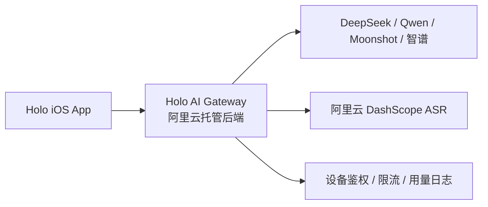

# HoloAI 商用后端网关 MVP 方案

> 日期：2026-05-12
> 状态：Eng Review 已完成，待最终审查
> 目标：将 HoloApp 中的大模型 API Key 从 iOS 客户端移除，改由后端网关统一调用模型服务，为商用上线做第一阶段准备。

## 1. Summary

第一阶段目标：先把所有大模型 API Key 从 iOS App 中移除，改为：



推荐架构：**阿里云函数计算 Web Function + Node/Hono + Tablestore + KMS/Secrets Manager + 日志服务 SLS**。

理由：

- Holo 第一批商用用户面向中国大陆。
- 你已有阿里云账号，暂无域名。
- 阿里云函数计算 Web 函数支持 SSE 流式响应，适合 HoloAI 当前流式聊天。
- 语音识别保持“录完后识别”：客户端上传录音文件到后端，后端内部调用 DashScope WebSocket，客户端不再接触 DashScope Key。
- 第一阶段不需要自建服务器运维，适合没有后端经验的起步阶段。

参考资料：

- [Apple App Attest 官方文档](https://developer.apple.com/documentation/devicecheck/validating-apps-that-connect-to-your-server)
- [阿里云函数计算 SSE 流式响应](https://help.aliyun.com/zh/functioncompute/fc-3-0/does-function-compute-support-sse-streaming-response)
- [Cloudflare Workers WebSocket 文档](https://developers.cloudflare.com/workers/runtime-apis/websockets/)：作为备选，不作为大陆首选。

## 2. Key Changes

客户端改造为“只认识 Holo 后端”：

- 移除 App 内 AI 服务商 API Key 输入、保存和直连调用。
- 保留模型和功能配置为服务端配置，不再让用户填写 DeepSeek/Qwen/Moonshot/智谱 Key。
- 新增 `HoloBackendAIProvider`，替换当前 `OpenAICompatibleProvider` 的线上路径。
- `PromptTestSheet`、`PromptEditorViewModel`、`AIConfigViewModel`、`VoiceRecognitionSettingsViewModel` 中所有直连模型的逻辑都改走后端。
- 语音识别从“客户端连 DashScope WebSocket”改为“客户端上传录音文件到后端，后端内部连接 DashScope WebSocket，返回 transcript”。客户端第一阶段不做实时 WebSocket 语音代理。

后端新增最小 API：

- `POST /v1/app-attest/challenge`：返回一次性 challenge。
- `POST /v1/app-attest/attest`：注册设备公钥、keyId、匿名 deviceId。
- `POST /v1/app-attest/assert`：校验后续请求签名，或作为中间件集成到 AI 接口。
- `POST /v1/ai/chat/completions`：统一文本模型接口，通过 `stream: true` 返回 SSE，通过 `stream: false` 返回非流式 JSON；用于意图识别、Prompt 测试、记忆洞察和普通聊天。
- `POST /v1/asr/transcriptions`：接收录音文件，后端内部调用 DashScope ASR WebSocket，返回 `{ text, duration?, confidence? }`。
- `GET /v1/health`：部署和 App 诊断用。

服务端必须做的安全控制：

- 模型 API Key 只放后端环境变量/KMS，不写入代码仓库。
- 每个 AI 请求必须通过 App Attest 校验。
- 按匿名设备 ID 做每日次数、分钟级频率、单次 token/audio 大小限制。
- 日志只记录 provider、model、耗时、token 估算、状态码，不默认保存用户完整隐私内容。
- 后端统一 provider 路由：`purpose=intent/chat/insight/asr`，不要让 App 任意传 `baseURL`。
- 模型路由配置化：用环境变量或配置文件维护 `purpose -> provider/model/temperature/maxTokens`，更换模型不需要改客户端。

MVP 存储选择：

- 使用 Tablestore，不引入关系数据库。
- `devices`：保存匿名 `deviceId`、App Attest `keyId`、public key、环境、创建时间、最后验证时间、最后 sign counter。
- `challenges`：保存一次性 challenge、过期时间、消费状态，TTL 建议 5 分钟。
- `usage_counters`：按 `deviceId + date + purpose` 记录调用次数、失败次数、token/audio 估算。
- `request_logs`：只记录请求摘要、耗时、状态码、provider/model、错误码，不默认保存用户完整输入、对话内容或音频。

函数计算运行配置：

- 后端使用 FC 3.0 Web Function，确保 SSE 路径使用 Web 函数流式响应能力，不使用事件函数或任务函数承载流式聊天。
- 生产环境配置 1 个预留实例，降低首次聊天冷启动延迟。
- 开发环境不配置预留实例，节省成本。
- 如果后续 ASR 长连接或并发上传在 FC 上表现不稳定，再单独评估 API Gateway + ECS/容器服务，不提前引入。

App Attest 规则：

- 生产环境所有 AI/ASR 请求必须携带 App Attest assertion。
- 服务端校验 challenge、bundle ID、team ID、keyId、公钥签名、sign counter 单调递增。
- 模拟器和本地开发只允许在 `DEBUG`/开发后端环境使用显式绕过开关，生产后端不接受模拟器绕过。
- App Attest 失败时返回统一错误码，客户端提示“安全校验失败，请更新 App 或稍后重试”，不暴露内部校验细节。

## 3. Preparation Checklist

你需要准备：

- 阿里云账号实名认证。
- 函数计算 FC 3.0 服务。
- 一个后端运行区域，建议先选华东/华北等大陆区域。
- 生产域名后续补齐；MVP 内测可先用函数计算测试域名或临时域名。
- DeepSeek/Qwen/Moonshot/智谱中实际要商用的 API Key。
- 阿里云 DashScope ASR API Key。
- Apple Developer 账号，因为 App Attest 依赖真实 iOS App 能力。
- App 的 Bundle ID、Team ID、生产包环境标识。
- 一份用量策略：例如每台设备每天 50 次文本请求、语音每天 20 次、单段语音最长 60 秒。

前置工作顺序：

1. 先在阿里云创建后端服务、密钥配置、日志服务。
2. 实现本地后端 mock，跑通 iOS App -> 后端 -> 模型。
3. 接入真实 LLM SSE，保证现有 HoloAI 流式体验不退化。
4. 接入 ASR 转写代理，替换客户端 DashScope Key。
5. 接入 App Attest + 匿名设备限流。
6. 删除或隐藏客户端 API Key 设置入口。
7. 真机 TestFlight 验证后再考虑域名、备案、账号体系、订阅和付费额度。

## 4. Test Plan

核心验收场景：

- 新安装 App 不配置任何模型 Key，也能使用 HoloAI。
- 抓包时只能看到请求你的后端，看不到任何 DeepSeek/Qwen/DashScope Key。
- 聊天流式输出仍然逐字显示，不出现一次性返回。
- 意图识别、普通聊天、分析查询、记忆洞察都能通过后端完成。
- 语音录音上传后能返回转写文本，并继续复用现有确认后发送逻辑。
- 后端关闭某个 provider Key 时，App 显示简体中文错误，不崩溃不卡 loading。
- 未通过 App Attest 的请求被拒绝。
- 同一设备高频调用会被限流。
- 后端日志能看到调用量、失败率、耗时、模型成本估算。

必测自动化场景：

- 后端 API 单元测试：App Attest challenge/attest/assert、限流、模型路由、错误映射。
- 后端集成测试：非流式 chat、SSE chat、ASR 转写各至少一条真实或 mock provider 路径。
- iOS Provider 单元测试：`HoloBackendAIProvider` 的非流式、流式、错误解析、超时取消。
- 真机 E2E：首次注册 App Attest 后发送聊天、流式聊天中断恢复、语音录音上传失败后可重试。

## 5. Error Handling

文本模型：

- 后端对上游 LLM 设置明确超时：非流式 60 秒，流式首包 30 秒，总时长 120 秒。
- 流式响应每 15 秒发送 SSE comment heartbeat，避免中间链路误判空闲断开。
- 上游超时、限流、鉴权失败、模型不可用统一映射为稳定错误码：`UPSTREAM_TIMEOUT`、`RATE_LIMITED`、`UPSTREAM_AUTH_FAILED`、`MODEL_UNAVAILABLE`。
- iOS 继续保留现有 90 秒 streaming watchdog，但收到后端结构化错误时优先展示后端错误文案并结束 loading。

语音识别：

- 客户端上传录音文件设置大小和时长上限，MVP 建议单段不超过 60 秒。
- 上传中断或 ASR 超时时，客户端停留在语音失败态，提供“重试识别 / 重录 / 取消”。
- 后端不持久化音频文件；如需临时落盘或转存 OSS，只允许短 TTL 临时对象，并在请求结束后清理。

限流与安全：

- 触发设备级限流时返回 `RATE_LIMITED`，客户端提示“今天的 AI 使用次数已达上限，稍后再试”。
- App Attest 校验失败不重试，客户端提示安全校验失败。
- DEBUG 模拟器绕过只连接开发后端，不能访问生产模型 Key。

## 6. Assumptions

- 第一阶段不做账号登录、不做订阅支付、不做用户云同步。
- 第一阶段使用 App Attest + 匿名设备 ID 防刷，不保证等同于完整用户鉴权。
- 第一阶段服务端选择阿里云托管后端，优先服务中国大陆用户。
- 当前 Holo 的本地数据仍保留在设备端，后端只做 AI 网关、鉴权、限流和日志。
- 后续商业化第二阶段再加入 Sign in with Apple、App Store 订阅、用户额度、后台管理和成本看板。

## 7. Eng Review 决议记录（2026-05-13）

### 架构变更

| # | Issue | 决策 | 说明 |
|---|-------|------|------|
| D1 | ASR 架构 | HTTP 上传录音 + 后端内部 WebSocket 调 DashScope | 保持 Holo 当前“录完后识别”产品形态，不把客户端升级为实时 WebSocket 语音代理 |
| D2 | PromptTestSheet/Editor 绕过 | 统一到 AIProvider 抽象 | 先重构这两个文件走 AIProvider 协议，再接入后端 |
| D3 | App Attest | MVP 即实现 | 从第一天建立完整安全架构，需真机调试 |
| D4 | Backend URL 策略 | 编译时硬编码 | `#if DEBUG` / Build Configuration 区分环境 |
| D5 | SSE 端点 | 单端点 + stream 参数 | `POST /v1/ai/chat/completions`，通过 `stream: true` 区分，与 OpenAI 标准一致 |
| D6 | FC 冷启动 | 预留实例 | provisioned concurrency 保持 1 个热实例，避免首次聊天延迟 |
| D7 | 错误处理 | 已新增错误处理章节 | 明确超时时间、用户可见错误提示、重试策略 |
| D8 | 模型路由 | 配置化 | 环境变量或配置文件定义 purpose → model 映射，改模型无需重新部署 |
| D9 | 测试策略 | 已补充完整测试计划 | 后端 API 单元测试 + iOS Provider 单元测试 + 3 个 E2E 场景 |
| D10 | 音频压缩 | MVP 不新增压缩链路 | 先沿用现有录音格式和 60 秒上限；如后续成本或上传耗时明显，再确认 DashScope 支持格式后单独优化 |

### 实施顺序

```
Lane A（后端）: 核心API → ASR转写代理 → App Attest
Lane B（iOS） : HoloBackendAIProvider → Prompt重构 → 语音改造 → 隐藏Key UI
                  ↑ 依赖 Lane A 完成核心API
```

### Critical Failure Modes（实施时必须处理）

1. **流式聊天超时** — 已要求后端超时、SSE heartbeat、稳定错误码，并保留 iOS watchdog
2. **语音上传网络中断** — 已要求语音失败态提供重试识别、重录、取消
3. **App Attest 模拟器运行** — 已限制为 DEBUG/开发后端绕过，生产禁止绕过

### 方案修订完成项

- [x] ASR 端点明确为 HTTP 上传录音，后端内部 WebSocket 调 DashScope
- [x] 新增错误处理章节（超时、限流、网络错误的用户提示策略）
- [x] SSE 端点合并为单端点 + stream 参数
- [x] 新增 FC 预留实例配置说明
- [x] 新增模型路由配置化设计
- [x] 新增测试计划章节

## GSTACK REVIEW REPORT

| Review | Trigger | Why | Runs | Status | Findings |
|--------|---------|-----|------|--------|----------|
| CEO Review | `/plan-ceo-review` | Scope & strategy | 0 | — | — |
| Codex Review | `/codex review` | Independent 2nd opinion | 0 | — | — |
| Eng Review | `/plan-eng-review` | Architecture & tests (required) | 1 | RESOLVED | 10 issues resolved, 3 critical gaps incorporated |
| Design Review | `/plan-design-review` | UI/UX gaps | 0 | — | — |
| DX Review | `/plan-devex-review` | Developer experience gaps | 0 | — | — |

UNRESOLVED: 0
VERDICT: ENG REVIEW PASSED — 10 decisions resolved, 3 critical failure modes incorporated into the plan
