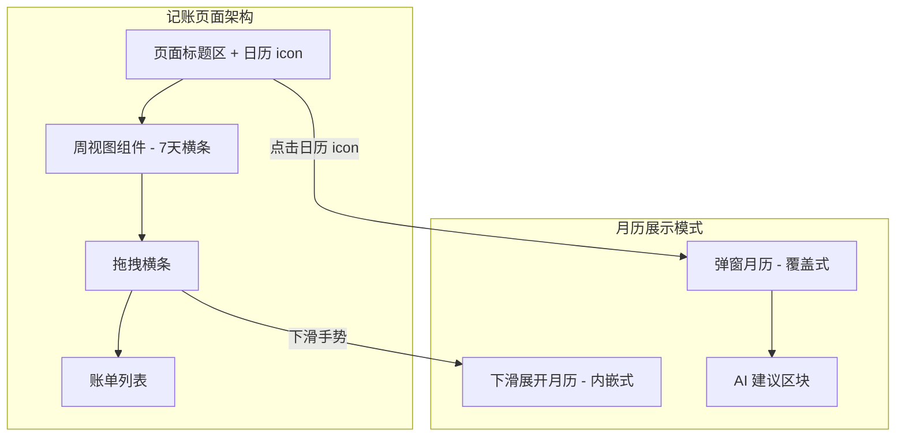
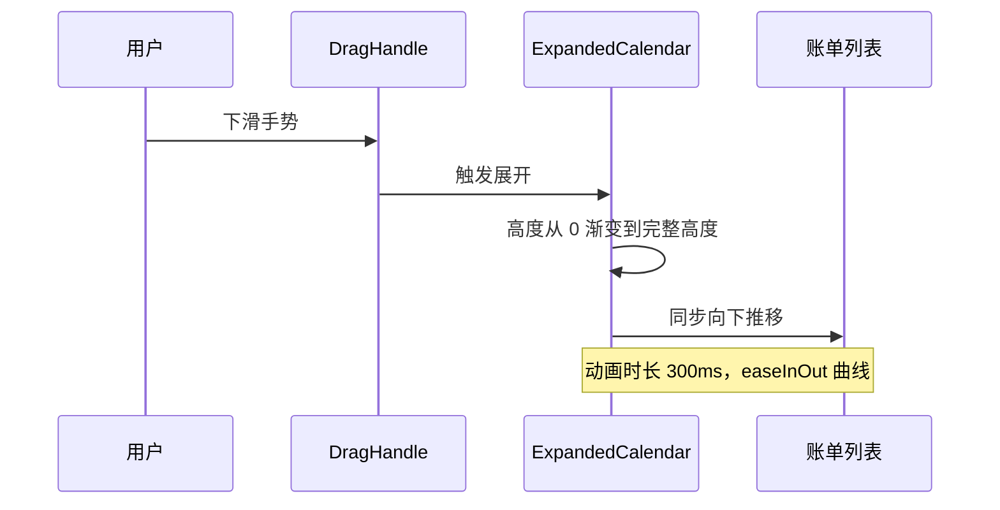
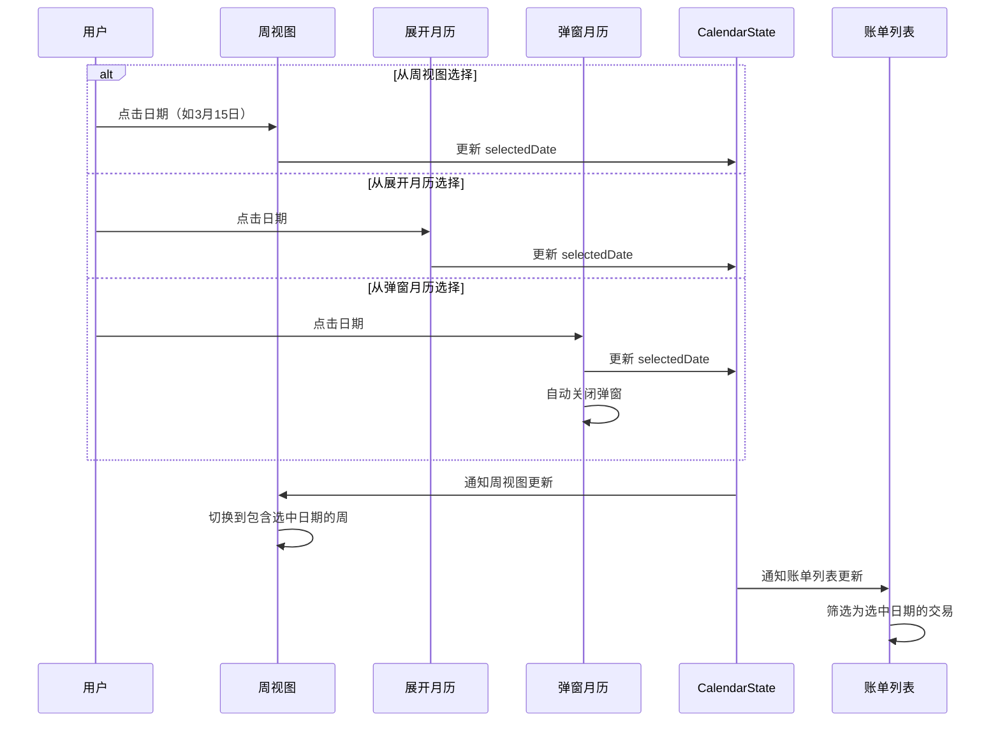
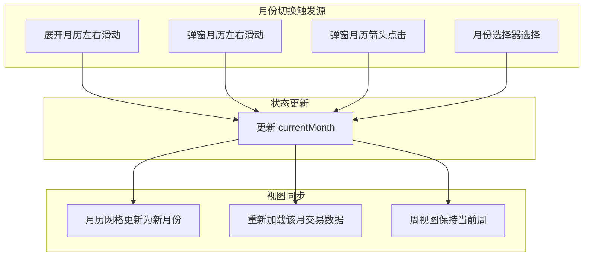
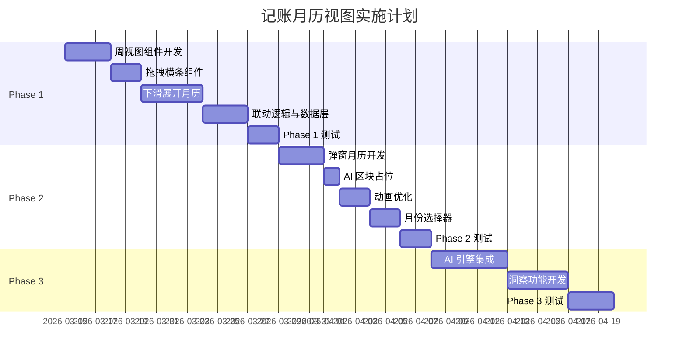

# 记账模块 - 月历视图 PRD

> **版本**：v1.0.0  
> **日期**：2026-03-13  
> **模块**：记账（Finance）- 月历视图（Monthly Calendar）  
> **文档状态**：初稿（Draft）

---

## 一、背景与目标

- **产品背景**  
  Holo 的记账模块已具备交易录入、分类管理、账户管理和列表展示能力，目前主要以「列表 + 日期分组（今日 / 昨日 / 更早）」的方式呈现。随着用户交易记录的累积，单纯列表视图在**时间维度的洞察能力不足**，用户难以快速理解某一月份内的消费节奏和分布。

- **功能目标**  
  为记账模块提供一个**按月度聚合的日期视图入口**，以「月历」形式展示每日收支汇总，让用户可以：
  - 快速感知当前月份整体消费强度与分布；
  - 一眼看到「哪几天花得多 / 花得少 / 没花钱」；
  - 轻松点进某天查看详细交易列表；
  - 从月历视角进入后续统计、预算等能力（为后续迭代预留空间）。

- **定位说明**  
  - 本 PRD 仅覆盖：**记账模块内的「月历视图」**。  
  - 不包含：待办（Todo）、习惯（Habits）、日程（CalendarEvent）等其他业务的日历展示。  
  - 在产品架构中，月历视图是 `FinanceView / FinanceLedgerView` 的一个**日期维度切换视图**，与现有列表视图并列。

---

## 二、功能范围与非目标

- **本期包含（In Scope）**
  - 记账模块内的**月历视图 UI 与交互**；
  - 按**日维度聚合交易数据**（收入 / 支出 / 笔数）；
  - 当前月份的月历展示，以及上下月份切换；
  - 点击某一天查看该日交易列表的入口；
  - 适配 Holo 现有 Design System（颜色、字体、间距、圆角等）。

- **本期不包含（Out of Scope）**
  - 周视图 / 日视图（Time-line）；
  - 跨模块的「总日历视图」（例如 Todo + Habits + Finance 混合）；
  - 提醒能力（例如账单到期提醒）；
  - 高级统计（如热力图、多月对比、预算提醒等）；
  - 与外部日历（Apple Calendar 等）的同步。

---

## 三、核心用户与使用场景

### 3.1 用户画像补充

- 经常记账的用户，已经在 Holo 中累计了**数十到数百条交易记录**；
- 对「本月花了多少钱、哪几天花得多」有强需求，但不一定具备财务专业知识；
- 希望通过「一眼可见」的方式，感知自己的消费节奏，而不是翻很长的列表。

### 3.2 典型使用场景（用户故事）

1. **查看某月整体消费分布**
   - 作为一个经常记账的用户，我希望能在一个月历视图中看到每一天的大致支出情况，这样我不用翻交易列表，也能快速判断「这月消费是不是有点超了」以及「哪几天花得特别多」。

2. **快速定位某天消费记录**
   - 作为用户，我记得「上周三跟朋友聚餐花了很多钱」，但忘记具体日期。我希望在月历里看到「哪天支出最高」，点一下就能直接进入当天的交易列表，找到那笔聚餐记录。

3. **对比不同日期的消费强度**
   - 作为用户，我希望能对比「工作日 vs 周末」的消费差异，在月历上一眼看到周末是否普遍消费更高，从而有意识地控制某些非必要支出。

4. **通过月历作为时间入口浏览历史月份**
   - 作为用户，我想回顾「去年双十一那个月的花费情况」，希望可以从月历视图切换到历史月份，看看那个月整体消费是否异常。

---

## 四、功能概述

### 4.1 核心架构：集成式组件

本次设计采用**集成式组件架构**，月历不再是独立的视图页面，而是与记账页面深度融合的组件系统。



### 4.2 组件构成

| 组件名称 | 位置 | 展示方式 | 核心职责 |
|---------|------|----------|---------|
| **周视图（WeekView）** | 标题下方，常驻 | 7 天横条 | 快速日期选择、当前周概览 |
| **拖拽横条（DragHandle）** | 周视图下方 | 居中短横条 | 触发月历展开/收起 |
| **下滑展开月历（ExpandedCalendar）** | 周视图下方展开 | 内嵌推挤式 | 完整月历浏览、日期选择 |
| **弹窗月历（PopupCalendar）** | 屏幕覆盖层 | 模态弹窗 | 快速月份跳转、AI 建议入口 |

### 4.3 设计原则

- **渐进式信息呈现**：周视图常驻提供即时上下文，完整月历按需展开
- **双入口策略**：下滑展开（沉浸式浏览）+ 弹窗（快速跳转）
- **状态联动**：所有组件共享选中日期状态，保持一致性
- **为 AI 预留空间**：弹窗月历底部预留 AI 建议区块

### 4.4 数据来源

- 仅使用记账模块中的 `Transaction` 数据，不展示其他模块内容
- 按日/周/月维度进行数据聚合
- 支持实时更新：新增/编辑/删除交易后，相关视图自动刷新

---

## 五、功能需求详细说明

### 5.1 周视图组件（WeekView）

#### 5.1.1 组件定位

周视图是记账页面的**常驻组件**，位于「今日账本」标题下方，提供当前周的快速日期导航。

#### 5.1.2 布局规格

```
+----------------------------------------------------------+
|  一      二      三      四      五      六      日        |
|  10      11      12      13      14      15      16       |
|  ¥128   ¥56    ¥0     ¥234   [今天]   ¥0     ¥89        |
|   •       •             •      ●               •          |
+----------------------------------------------------------+
```

| 属性 | 规格 |
|-----|------|
| 布局方式 | 7 列等宽横向排列 |
| 单元格高度 | 60-70pt（根据屏幕适配） |
| 显示内容 | 星期缩写 + 日期数字 + 金额摘要/圆点指示 |
| 周起始日 | 周一（符合中文用户习惯） |

#### 5.1.3 显示规则

**日期内容**：
- **星期缩写**：「一 二 三 四 五 六 日」，使用 `holoCaption` 字体
- **日期数字**：1-31，使用 `holoBody` 字体
- **金额摘要**：当日净支出，使用 `holoCaption` 字体
  - 有支出：显示金额，红色（`holoError`）
  - 有收入无支出：显示金额，绿色（`holoSuccess`）
  - 无交易：不显示金额或显示「-」

**交易指示器**：
- 有交易的日期：显示小圆点（实心 `•`）
- 无交易的日期：不显示圆点

#### 5.1.4 日期状态样式

| 状态 | 视觉表现 |
|-----|---------|
| **今天（Today）** | 圆形背景高亮（`holoPrimary` 背景），白色文字 |
| **选中日期（Selected）** | 圆形边框（`holoPrimary` 边框），正常文字 |
| **普通日期** | 无特殊样式，正常文字颜色 |
| **周末** | 可选：使用稍浅的文字颜色区分 |

#### 5.1.5 交互行为

**点击日期**：
- 选中该日期，更新选中状态
- 下方账单列表切换为该日数据
- 如果点击的日期不在当前周，周视图自动切换到目标周

**左右滑动**：
- 在周视图区域左右滑动可切换周
- 向左滑动：下一周
- 向右滑动：上一周

#### 5.1.6 周切换逻辑

```swift
/// 周视图状态管理
struct WeekViewState {
    /// 当前显示的周（以周一日期为基准）
    var currentWeekStart: Date
    /// 选中的日期
    var selectedDate: Date
    
    /// 切换到包含指定日期的周
    mutating func switchToWeekContaining(_ date: Date) {
        currentWeekStart = date.startOfWeek
    }
}
```

---

### 5.2 拖拽横条组件（DragHandle）

#### 5.2.1 组件定位

拖拽横条位于周视图下方，作为展开/收起完整月历的交互触发器。

#### 5.2.2 视觉规格

```
+----------------------------------------------------------+
|                         ════                              |
+----------------------------------------------------------+
```

| 属性 | 规格 |
|-----|------|
| 位置 | 周视图正下方，水平居中 |
| 形状 | 圆角短横条 |
| 尺寸 | 宽度 36pt，高度 4pt |
| 颜色 | `holoTextTertiary`（浅灰色） |
| 圆角 | 2pt（完全圆角） |
| 点击区域 | 扩展至整行，高度 24pt |

#### 5.2.3 交互行为

| 手势 | 触发条件 | 行为 |
|-----|---------|------|
| **下滑** | 收起状态下，从横条区域向下拖拽 | 展开完整月历 |
| **上滑** | 展开状态下，从横条区域向上拖拽 | 收起月历 |
| **点击** | 点击横条区域 | 切换展开/收起状态 |

#### 5.2.4 状态变化

```swift
enum CalendarExpandState {
    case collapsed  // 收起状态：仅显示周视图
    case expanded   // 展开状态：显示完整月历
}
```

---

### 5.3 下滑展开月历（ExpandedCalendar）

#### 5.3.1 展示方式

采用**内嵌推挤式**布局：
- 月历展开时，向下推挤账单列表等内容
- 超出首屏的内容可通过滚动查看
- 保持页面整体可滚动性

#### 5.3.2 展开动画



| 动画属性 | 规格 |
|---------|------|
| 展开时长 | 300ms |
| 收起时长 | 250ms |
| 动画曲线 | easeInOut |
| 跟手系数 | 0.8（拖拽过程中月历高度跟随手指） |

#### 5.3.3 月历内容

展开后显示完整月历网格：
- 7 列 × 最多 6 行
- 当前月份所有日期
- 上月/下月补位日期（灰显）
- 与弹窗月历共用相同的日期单元格组件

#### 5.3.4 交互功能

| 交互 | 行为 |
|-----|------|
| **点击日期** | 选中该日期，周视图同步切换，账单列表更新 |
| **左右滑动** | 切换月份 |
| **月份导航** | 顶部显示月份标题，支持左右箭头切换 |

#### 5.3.5 与周视图的联动

```swift
/// 展开月历选择日期后的联动逻辑
func onDateSelected(_ date: Date) {
    // 1. 更新选中日期
    selectedDate = date
    
    // 2. 周视图切换到包含该日期的周
    weekViewState.switchToWeekContaining(date)
    
    // 3. 账单列表筛选为该日数据
    transactionListFilter = .date(date)
    
    // 4. 可选：自动收起月历
    // expandState = .collapsed
}
```

---

### 5.4 弹窗月历（PopupCalendar）

#### 5.4.1 触发方式

- **入口位置**：记账页面右上角日历 icon
- **触发动作**：点击日历 icon

#### 5.4.2 展示方式

采用**覆盖式弹窗**：
- 弹窗位于屏幕上部
- 底部有半透明遮罩层
- 点击遮罩层可关闭弹窗

#### 5.4.3 布局结构

```
+------------------------------------------+
|  ×                      2026年3月        |  ← 关闭按钮 + 月份标题
+------------------------------------------+
|   ←                                  →   |  ← 月份切换箭头
+------------------------------------------+
|   一    二    三    四    五    六    日   |  ← 星期标题行
+------------------------------------------+
|                                          |
|              日历网格区域                  |  ← 完整月历网格
|           （7列 × 最多6行）                |
|                                          |
+------------------------------------------+
|                                          |
|           AI 建议区块（预留）              |  ← Phase 2+ 实现
|                                          |
+------------------------------------------+
```

#### 5.4.4 视觉规格

| 属性 | 规格 |
|-----|------|
| 弹窗宽度 | 屏幕宽度 - 32pt（左右各 16pt 边距） |
| 弹窗圆角 | `HoloRadius.lg`（16pt） |
| 背景色 | `holoCardBackground` |
| 遮罩层 | 黑色 40% 透明度 |
| 内边距 | `HoloSpacing.lg`（20pt） |

#### 5.4.5 弹窗动画

| 动画类型 | 规格 |
|---------|------|
| 进入动画 | 从上方滑入 + 淡入，300ms，spring 曲线 |
| 退出动画 | 向上滑出 + 淡出，250ms，easeOut 曲线 |
| 遮罩层 | 同步淡入淡出 |

#### 5.4.6 交互行为

| 交互 | 行为 |
|-----|------|
| **点击日期** | 选中该日期，关闭弹窗，周视图和账单列表同步更新 |
| **左右滑动** | 切换月份 |
| **点击月份标题** | 弹出年月选择器（P2） |
| **点击关闭按钮** | 关闭弹窗，不改变选中日期 |
| **点击遮罩层** | 关闭弹窗，不改变选中日期 |

#### 5.4.7 AI 建议区块（预留）

> **注意**：AI 建议区块为 Phase 2+ 功能，MVP 阶段仅预留占位空间。

**预留布局**：
```
+------------------------------------------+
|  💡 AI 洞察                               |
+------------------------------------------+
|                                          |
|     [占位提示文案]                         |
|     "AI 消费洞察即将上线"                   |
|                                          |
+------------------------------------------+
```

**未来功能规划**：
- 本月消费趋势分析
- 异常消费提醒
- 预算执行建议
- 消费习惯洞察

**占位区域规格**：
| 属性 | 规格 |
|-----|------|
| 最小高度 | 80pt |
| 背景色 | `holoBackground`（略深于弹窗背景） |
| 圆角 | `HoloRadius.md`（12pt） |
| 内边距 | `HoloSpacing.md`（16pt） |

---

### 5.5 月历网格展示（共用组件）

> 下滑展开月历和弹窗月历共用以下月历网格组件规格。

#### 5.5.1 布局规则

- 网格结构：
  - 7 列：从周一到周日（与中文用户习惯对齐）；
  - 最多 6 行：覆盖所有可能的月份视图（起始日不同）。
- 日期填充规则：
  - 当前选中月份记为 `currentMonth`；
  - 计算该月的第一天是星期几，以及当月总天数；
  - 网格中如果有前置空位（例如当月 1 号是周三），可选择：
    - 方案 A：使用**灰显的上月日期**补齐（推荐，提高视觉完整性）；
    - 方案 B：保留为空（更纯粹，只显示当月）。  
  - 本 PRD推荐：**采用方案 A**（灰显上月 / 下月日期），用户更容易理解周维度布局。

#### 5.5.2 日期状态与样式

每个日期单元格至少有以下几种状态：

- **当前日期（Today）**
  - 边框或背景高亮（主色 `holoPrimary` 边框推荐）；
  - 日期文字颜色为主文本色；
  - 如有交易记录，仍按收入 / 支出颜色展示金额。

- **当月其他日期**
  - 正常文本颜色；
  - 背景为透明或轻微卡片底色（具体见 UI 规范）。

- **非当月日期（上月 / 下月补位）**
  - 日期文字使用次级文本颜色（`holoTextSecondary`，不强调）；
  - 金额不展示或以更弱样式展示（建议：不展示金额，只显示日期）。

---

### 5.6 日期单元格内容

#### 5.6.1 基础信息

每个日期单元格至少包括：

- 日期数字（1～31）；
- 当日交易聚合信息（仅针对当月日期）：
  - 总支出金额 `totalExpense`；
  - 总收入金额 `totalIncome`；
  - 交易笔数 `transactionCount`（根据视觉空间决定是否露出）。

#### 5.6.2 展示策略

为保证可读性与信息密度的平衡，推荐以下展示策略：

- 优先维度：**支出金额 > 收入金额 > 笔数**；
- 默认展示：
  - 第一行：日期数字；
  - 第二行：当日支出金额（如有），样式为红色数字（使用 `holoError`）；
  - 第三行（可选）：当日收入金额（如有），样式为绿色数字（使用 `holoSuccess`）。

当空间不足或信息太多时，可简化为：

- 仅展示「净支出」：`totalExpense - totalIncome` 的结果值；
- 或仅展示「支出金额」，并通过视觉强度（颜色深浅）体现大小。

#### 5.6.3 金额格式化规则

- 小于 1000：正常显示，例如 `28`、`135`；
- 1000 以上：
  - 方案 A：`1.2k` 格式（中文环境也可接受）；
  - 方案 B：`1,234` 千分位显示。  
- 为保持与记账模块现有金额格式一致，**建议沿用现有货币格式化器的策略**，在 UI 设计阶段确认：
  - 若现有列表使用「¥1,234.56」，则月历金额可用更紧凑版本，如「1.2k」或「1,234」。

---

### 5.7 月份导航

#### 5.7.1 当前月份展示

- 在月历视图顶部展示当前选中月份，如：`2026年 3月`；
- 支持左右切换月份：
  - 左箭头：上一月；
  - 右箭头：下一月。

#### 5.7.2 快速返回今天

- 在顶部区域提供「回到本月」按钮，当当前选中月份不是今天所在月份时显示；
- 点击后：
  - 将 `currentMonth` 重置为今天所在月份；
  - 月历视图自动滚动 / 更新到该月份；
  - 高亮当天日期。

#### 5.7.3 月份选择器（P2）

- 点击月份标题区域（如 `2026年 3月`）时，弹出「年份 + 月份」选择器；
- 用户可以快速跳转到任意年份 / 月份；
- 本功能为**P2 优先级**，可在后续版本实现。

---

### 5.8 日期交互行为

#### 5.8.1 点击日期：查看当日交易

- 行为描述：
  - 用户点击某一天的单元格；
  - 系统打开「当日交易列表」，展示该日期所有 `Transaction`。
- 展示形式（两种实现路径，二选一）：
  - 方案 A：底部半屏弹窗（Bottom Sheet），在当前月历页面上方滑出；
  - 方案 B：跳转到记账模块现有的列表页面，并自动滚动 / 筛选到该日期。  
- MVP 建议：
  - 为降低工作量并复用现有 `FinanceLedgerView` / 列表视图逻辑，**推荐优先采用方案 B**：
    - 从月历视图跳转到「记账列表视图」，并携带筛选条件（日期）；
    - 列表视图按日期筛选，仅展示该日交易。

#### 5.8.2 长按日期：快速记账入口（P1）

- 行为描述：
  - 用户长按某一天单元格；
  - 弹出快速操作菜单：
    - 「在这一天记一笔」：打开 `AddTransactionSheet`，日期默认设置为该日；
    - （可选）「查看这一天详情」：等价于点击动作。
- 优先级：P1，可在基础功能稳定后加入。

#### 5.8.3 空日期点击行为

- 若某天没有任何交易记录：
  - 点击行为仍然有效：
    - 可提示「当天暂无记录」；
    - 或直接弹出「添加一笔」入口（需与整体交互风格统一）。

---

### 5.9 数据聚合与计算规则

#### 5.9.1 聚合维度

- 聚合单位：**自然日**（00:00 ～ 23:59）；
- 时间基准：设备本地时区（与现有记账时间逻辑保持一致）。

#### 5.9.2 聚合内容

针对每个日期 `d`，需要预先计算：

- `totalExpense(d)`：该日所有**支出**类型交易金额之和；
- `totalIncome(d)`：该日所有**收入**类型交易金额之和；
- `transactionCount(d)`：该日所有交易的笔数；
- 可根据 `Transaction.type` 与 `Transaction.amount` 从数据库中计算。

#### 5.9.3 聚合性能与缓存

- 计算粒度：以**月**为单位，如「2026-03 月」；
- 当进入一个月份时：
  - 从数据库中批量查询该月所有 `Transaction`；
  - 在内存中按「日期 -> 聚合结果」构建字典；
  - 月内每次渲染，优先使用内存中的聚合结果。
- 为减少重复计算：
  - 当用户在日历视图内切换月份时，优先使用简单缓存（如当前月 + 前后各 1 个月）；
  - 当有新增 / 编辑 / 删除交易时，可标记对应月份的缓存失效，重新聚合。

---

### 5.10 交互流程与状态联动

#### 5.10.1 核心状态模型

```swift
/// 月历组件统一状态管理
class CalendarState: ObservableObject {
    /// 选中的日期（全局唯一）
    @Published var selectedDate: Date = Date()
    
    /// 当前显示的月份
    @Published var currentMonth: Date = Date()
    
    /// 周视图当前显示的周（周一为基准）
    @Published var currentWeekStart: Date = Date().startOfWeek
    
    /// 月历展开状态
    @Published var expandState: CalendarExpandState = .collapsed
    
    /// 弹窗月历显示状态
    @Published var isPopupVisible: Bool = false
}
```

#### 5.10.2 日期选择联动流程

无论从哪个组件选择日期，都触发统一的联动逻辑：



#### 5.10.3 月份切换联动



#### 5.10.4 展开/收起状态管理

| 触发动作 | 当前状态 | 目标状态 | 附加行为 |
|---------|---------|---------|---------|
| 下滑手势 | collapsed | expanded | 动画展开月历 |
| 上滑手势 | expanded | collapsed | 动画收起月历 |
| 点击横条 | collapsed | expanded | 动画展开月历 |
| 点击横条 | expanded | collapsed | 动画收起月历 |
| 选择日期后 | expanded | 可配置 | 可选：自动收起 |

#### 5.10.5 弹窗与其他组件的互斥

```swift
/// 弹窗月历显示时的状态处理
func showPopupCalendar() {
    // 1. 如果展开月历正在显示，先收起
    if expandState == .expanded {
        expandState = .collapsed
    }
    
    // 2. 显示弹窗
    isPopupVisible = true
}

/// 弹窗关闭时的处理
func dismissPopupCalendar(withSelection date: Date?) {
    isPopupVisible = false
    
    if let date = date {
        // 更新选中日期，触发联动
        selectedDate = date
    }
}
```

#### 5.10.6 数据刷新策略

| 场景 | 刷新范围 | 触发时机 |
|-----|---------|---------|
| 新增交易 | 交易所在日期的 DailySummary | 保存成功后 |
| 编辑交易 | 原日期 + 新日期（如有变化）的 DailySummary | 保存成功后 |
| 删除交易 | 交易所在日期的 DailySummary | 删除成功后 |
| 切换月份 | 整月的 DailySummary | 月份切换动画完成后 |
| 进入页面 | 当前月的 DailySummary | 页面 onAppear |

---

## 六、UI / UX 设计规范（记账月历视图）

### 6.1 整体布局

- 顶部：月份导航区域
  - 左右切换按钮；
  - 当前月份标题（`YYYY年 M月`）；
  - 「回到本月」按钮（条件显示）。
- 中部：星期标题行
  - 「一 二 三 四 五 六 日」七个字，等宽排列；
  - 使用次要文本颜色，字号略小于日期数字。
- 底部：日期网格
  - 使用 `LazyVGrid` 等等宽布局；
  - 单元格间距遵循 `HoloSpacing.sm` / `HoloSpacing.md`。

### 6.2 视觉风格对齐

结合 `DesignSystem.swift` 中的规范：

- **颜色**
  - 背景：延续记账模块的背景，如 `holoBackground` 或当前 `FinanceView` 背景；
  - 文本：
    - 日期数字：`holoTextPrimary`；
    - 非当月日期：`holoTextSecondary`；
    - 支出金额：`holoError`；
    - 收入金额：`holoSuccess`。
  - 当前选中 / 今天：
    - 使用 `holoPrimary` 作为边框或背景高亮色。

- **字体**
  - 月份标题：`holoHeading`；
  - 星期标题：`holoCaption` 或 `holoLabel`；
  - 日期数字：`holoBody`；
  - 金额信息：`holoCaption`。

- **间距与圆角**
  - 网格单元格内边距：`HoloSpacing.sm`；
  - 网格单元格圆角：`HoloRadius.sm`；
  - 月份导航区域与网格之间：`HoloSpacing.lg`。

### 6.3 空状态与极端状态

- 本月完全没有任何交易：
  - 月历照常展示所有日期；
  - 所有日期的金额区域为空；
  - 页面下方或中间可展示一个空状态提示，例如：「本月还没有记账，长按某一天开始记账吧」。

- 某天交易非常多、金额非常大：
  - 仍只展示聚合金额，不展示逐条交易；
  - 避免在单元格内挤入过多文字，保证整体清爽。

### 6.4 动画规范

#### 6.4.1 展开/收起月历动画

| 动画属性 | 展开 | 收起 |
|---------|------|------|
| 时长 | 300ms | 250ms |
| 曲线 | easeInOut | easeOut |
| 内容 | 高度从 0 → 完整高度 | 高度从完整高度 → 0 |
| 账单列表 | 同步向下推移 | 同步向上收回 |

```swift
/// SwiftUI 动画实现示例
withAnimation(.easeInOut(duration: 0.3)) {
    expandState = .expanded
}
```

#### 6.4.2 弹窗月历动画

| 动画阶段 | 规格 |
|---------|------|
| **进入** | spring(response: 0.3, dampingFraction: 0.8) |
| **退出** | easeOut(duration: 0.25) |
| **弹窗位移** | 从 -100pt（上方）滑入到 0 |
| **透明度** | 从 0 淡入到 1 |
| **遮罩层** | 同步淡入淡出，黑色 40% 透明度 |

#### 6.4.3 日期选择反馈动画

| 场景 | 动画效果 |
|-----|---------|
| 点击日期 | scale 从 1.0 → 0.95 → 1.0，时长 150ms |
| 今天标记 | 圆形背景淡入，时长 200ms |
| 周视图切换 | 横向滑动过渡，时长 250ms |
| 月份切换 | 横向滑动 + 淡入淡出，时长 300ms |

#### 6.4.4 微交互动画

| 元素 | 触发条件 | 动画效果 |
|-----|---------|---------|
| 拖拽横条 | 手指触碰 | 颜色加深，scale 1.1 |
| 日历 icon | 点击 | 旋转 15° 后回弹 |
| 金额数字 | 数据更新 | 数字滚动效果 |

### 6.5 手势规范

#### 6.5.1 支持的手势类型

| 手势 | 作用区域 | 行为 |
|-----|---------|------|
| **点击（Tap）** | 日期单元格 | 选中日期 |
| **点击** | 拖拽横条 | 切换展开/收起 |
| **点击** | 日历 icon | 打开弹窗月历 |
| **点击** | 弹窗遮罩 | 关闭弹窗 |
| **长按（Long Press）** | 日期单元格 | 弹出快速操作菜单 |
| **垂直拖拽（Pan）** | 拖拽横条区域 | 展开/收起月历 |
| **水平滑动（Swipe）** | 周视图 | 切换上一周/下一周 |
| **水平滑动** | 月历网格 | 切换上一月/下一月 |

#### 6.5.2 拖拽手势详细规格

```swift
/// 拖拽展开月历的手势处理
struct DragGestureSpec {
    /// 触发展开的最小拖拽距离
    static let expandThreshold: CGFloat = 50
    
    /// 触发收起的最小拖拽距离
    static let collapseThreshold: CGFloat = -50
    
    /// 拖拽过程中的跟手系数（0-1）
    static let trackingFactor: CGFloat = 0.8
    
    /// 松手后的回弹动画时长
    static let snapDuration: Double = 0.25
}
```

#### 6.5.3 手势冲突处理

| 冲突场景 | 处理策略 |
|---------|---------|
| 垂直拖拽 vs 页面滚动 | 拖拽横条区域优先响应垂直拖拽 |
| 水平滑动 vs 月历网格 | 滑动角度 < 30° 判定为水平滑动 |
| 点击 vs 长按 | 长按延迟 500ms 触发 |

### 6.6 响应式布局

#### 6.6.1 不同屏幕尺寸适配

| 设备 | 周视图高度 | 月历网格行高 | 弹窗边距 |
|-----|-----------|-------------|---------|
| iPhone SE | 56pt | 44pt | 12pt |
| iPhone 14 | 64pt | 52pt | 16pt |
| iPhone 14 Pro Max | 72pt | 60pt | 20pt |
| iPad | 80pt | 68pt | 32pt |

#### 6.6.2 横屏适配（可选）

- 周视图：保持单行显示
- 月历网格：左右增加边距，保持单元格比例
- 弹窗月历：限制最大宽度 500pt

---

## 七、数据结构与接口需求

### 7.1 新增数据结构：DailySummary

> 说明：该结构为**内存层聚合结果**，无需直接落库，可作为 ViewModel 层数据模型。

```swift
/// 单日汇总信息（记账月历视图专用）
struct DailySummary {
    /// 当天日期（只关心到日）
    let date: Date
    /// 当天总支出金额（>= 0）
    let totalExpense: Decimal
    /// 当天总收入金额（>= 0）
    let totalIncome: Decimal
    /// 当天交易笔数
    let transactionCount: Int
}
```

### 7.2 FinanceRepository 新增方法（建议）

- 方法签名示例：

```swift
/// 获取某一整月内的单日聚合数据
func getDailySummaries(for month: Date) async throws -> [Date: DailySummary]
```

- 行为说明：
  - 计算 `month` 所在月份的起止时间；
  - 一次性查询该月份内的所有 `Transaction`；
  - 在内存中按天聚合为 `DailySummary`；
  - 返回以「日期（仅到日）」为 key 的字典，便于在网格中 O(1) 访问。

### 7.3 ViewModel 需求（示意）

- 新增 `FinanceCalendarViewModel` 或在现有记账 ViewModel 中增加：
  - `@Published var currentMonth: Date`
  - `@Published var dailySummaries: [Date: DailySummary]`
  - `func loadMonth(_ month: Date)`
  - `func gotoNextMonth()` / `gotoPreviousMonth()` / `gotoCurrentMonth()`

---

## 八、技术实现要点

### 8.1 月历网格生成

- 使用 `Calendar` API 生成给定月份的所有显示日期：
  - 计算当月第一天对应的星期索引；
  - 根据需求决定是否补齐上月 / 下月日期；
  - 输出一个连续的 `[Date]` 数组，长度为 35 或 42（5 行或 6 行 × 7 列）。

- SwiftUI 布局：
  - 使用 `LazyVGrid(columns: Array(repeating: GridItem(.flexible()), count: 7))`；
  - 对每个日期 `d` 渲染一个 `DayCellView`。

### 8.2 与现有记账模块的集成

- 入口：
  - 在 `FinanceView` 或 `FinanceLedgerView` 顶部增加视图切换 Toggle（列表 / 月历）；
  - 切换时复用同一 ViewModel 的数据源，或使用独立 ViewModel 但共享 `FinanceRepository`。

- 跳转行为：
  - 点击某一天后，调用现有记账列表视图，并传入日期筛选条件；
  - 若当前列表视图暂不支持按日期筛选，可通过：
    - 路由参数传递「targetDate」；
    - 在列表加载时根据「targetDate」过滤或滚动。

### 8.3 性能与体验

- 单月数据量通常不大（几百条以内），一次性聚合性能风险较低；
- 为避免频繁数据库访问：
  - 在 ViewModel 中缓存最近访问的 1～3 个月数据；
  - 当有交易变动时，仅刷新受影响的月份缓存。

---

## 九、边界与异常处理

### 9.1 日期相关边界

- 闰年 / 非闰年：
  - 2 月 29 日仅在闰年展示；
  - 所有日期计算应依赖系统 `Calendar`，避免手写天数逻辑。

- 跨年切换：
  - 从 12 月向右切换应进入下一年的 1 月；
  - 从 1 月向左切换应进入上一年的 12 月。

### 9.2 数据边界

- 某天只有收入没有支出：
  - 仅展示收入金额，或在布局允许的情况下两者都展示；
  - 样式以收入色（绿色）为主。

- 某天只有支出没有收入：
  - 正常展示支出金额，使用红色。

- 某天既有支出又有收入，且金额都较大：
  - 若空间不足，可以只展示**净支出**或**绝对支出金额**，由设计方案最终确定；
  - 详细拆分交由点击后进入的「当日交易列表」解决。

### 9.3 数据加载异常

- 数据库查询失败 / 聚合失败：
  - 月历仍应正常展示日期网格；
  - 所有金额区域置空；
  - 顶部或中部可以显示轻量级错误提示：「加载本月数据失败，请稍后重试」；
  - 日志中记录具体错误信息，便于排查。

---

## 十、优先级与里程碑

### 10.1 功能优先级矩阵

#### 核心组件优先级

| 组件/功能 | 优先级 | 说明 | 阶段 |
|----------|--------|------|------|
| **周视图组件** | P0 | 常驻组件，日期快速导航 | Phase 1 |
| **拖拽横条** | P0 | 展开/收起月历的交互入口 | Phase 1 |
| **下滑展开月历** | P0 | 内嵌式完整月历 | Phase 1 |
| **月历网格展示** | P0 | 共用的日历网格组件 | Phase 1 |
| **日期金额摘要** | P0 | 每日收支聚合显示 | Phase 1 |
| **日期选择联动** | P0 | 周视图/月历/账单列表联动 | Phase 1 |
| **账单列表按日筛选** | P0 | 选中日期后显示该日交易 | Phase 1 |

#### 体验增强优先级

| 组件/功能 | 优先级 | 说明 | 阶段 |
|----------|--------|------|------|
| **弹窗月历** | P1 | 覆盖式月历，快速跳转 | Phase 2 |
| **AI 建议区块（占位）** | P1 | 预留空间，显示占位提示 | Phase 2 |
| **动画优化** | P1 | 展开/收起/弹窗动画精调 | Phase 2 |
| **月份快速选择器** | P1 | 年月选择器组件 | Phase 2 |
| **快速返回今天** | P1 | 便捷性提升 | Phase 2 |
| **长按快速记账** | P1 | 效率提升 | Phase 2 |

#### AI 能力优先级

| 组件/功能 | 优先级 | 说明 | 阶段 |
|----------|--------|------|------|
| **AI 建议区块功能** | P2 | 实际 AI 洞察内容 | Phase 3 |
| **智能消费洞察** | P2 | 本月消费趋势分析 | Phase 3 |
| **异常消费提醒** | P2 | 异常支出识别与提醒 | Phase 3 |
| **预算执行建议** | P2 | 与预算模块联动 | Phase 3 |

### 10.2 实施阶段详细说明

#### Phase 1：MVP（核心功能）

**目标**：实现集成式月历组件的基础框架

**交付物**：
- [ ] 周视图组件（WeekView）
  - 7 天横条布局
  - 日期数字 + 金额摘要显示
  - 今天高亮 + 选中状态
  - 左右滑动切换周
- [ ] 拖拽横条组件（DragHandle）
  - 视觉呈现
  - 点击切换展开/收起
  - 下滑/上滑手势识别
- [ ] 下滑展开月历（ExpandedCalendar）
  - 内嵌推挤式展开
  - 基础展开/收起动画
  - 完整月历网格
  - 月份切换（左右滑动 + 箭头）
- [ ] 日期选择联动逻辑
  - 统一状态管理（CalendarState）
  - 周视图/月历/账单列表三向联动
- [ ] 数据层
  - DailySummary 数据结构
  - getDailySummaries 查询方法
  - 基础缓存机制

**验收标准**：
- 周视图常驻显示，可点击选择日期
- 下滑可展开完整月历
- 选择日期后账单列表正确筛选
- 基础动画流畅（无明显卡顿）

---

#### Phase 2：体验增强

**目标**：完善交互体验，增加弹窗月历入口

**交付物**：
- [ ] 弹窗月历（PopupCalendar）
  - 日历 icon 触发入口
  - 弹窗视觉 + 动画
  - 月历网格（复用）
  - 关闭方式（点击日期/遮罩/关闭按钮）
- [ ] AI 建议区块（预留）
  - 占位 UI
  - 提示文案："AI 消费洞察即将上线"
- [ ] 动画优化
  - 跟手拖拽
  - spring 动画曲线
  - 微交互动画（点击反馈等）
- [ ] 月份快速选择器
  - 年月滚轮/列表选择
  - 快速跳转功能
- [ ] 其他体验优化
  - 快速返回今天按钮
  - 长按日期快速记账入口

**验收标准**：
- 弹窗月历可正常打开/关闭
- AI 区块占位正确显示
- 动画体验流畅自然
- 可快速跳转到任意历史月份

---

#### Phase 3：AI 能力

**目标**：实现 AI 洞察功能

**交付物**：
- [ ] AI 建议区块功能实现
  - 接入 AI 分析引擎
  - 本月消费趋势卡片
  - 消费习惯洞察
- [ ] 智能消费洞察
  - 周环比/月同比分析
  - 消费高峰日识别
  - 分类消费占比
- [ ] 异常消费提醒
  - 异常大额支出识别
  - 异常消费频率提醒
- [ ] 预算联动
  - 预算执行进度
  - 剩余预算建议

**验收标准**：
- AI 洞察内容准确、有价值
- 响应时间 < 1 秒
- 用户可理解、可操作

---

### 10.3 里程碑时间线（建议）



---

## 十一、指标与验证

- **功能使用率**
  - 月历视图入口点击率；
  - 月历视图 PV / UV；
  - 从月历视图进入「当日交易列表」的次数。

- **行为变化**
  - 开启月历视图后，用户每月的记账天数是否增加；
  - 是否有更多用户开始翻看历史月份记录。

- **性能指标**
  - 月历视图首屏加载时间（目标：< 300ms，数据已缓存的情况下）；
  - 切换月份的响应时间（目标：< 200ms）。

