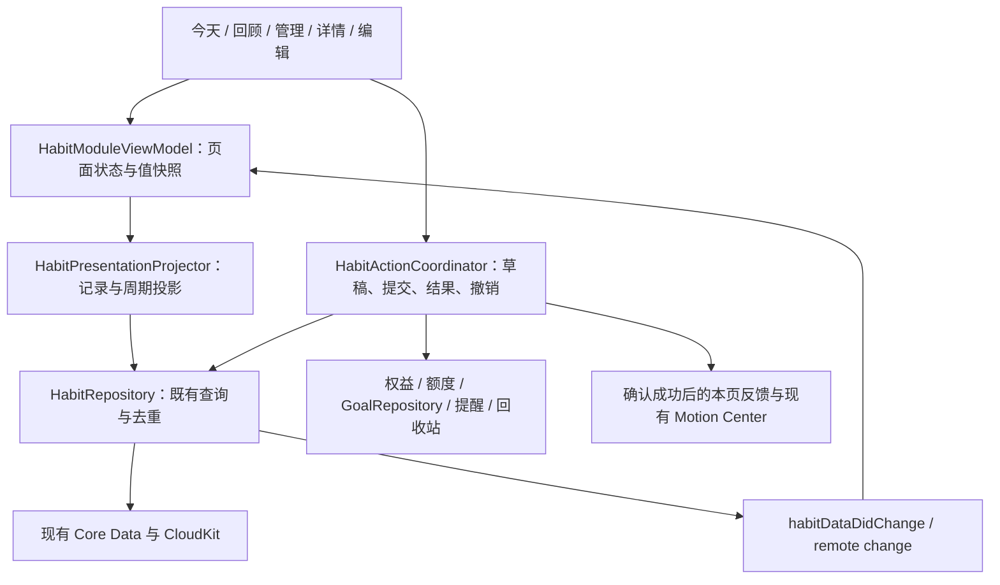

# Holo 习惯模块交互重构：GLM 完整实施方案 V1

> 产品负责人：东林。日期：2026-10-06。
> 交付目标：把习惯模块重构成一个顺手、精美、记录可信，并且值得回看的日常工具。
> 设计方向：**精致日常＋完成惊喜**。日常操作清楚、克制；成功保存和阶段积累带来适量的温暖反馈。
> 本文是 iOS 实施规格。本轮交付了交互式 HTML 和本文，尚未按照本文完成原生 App 重构。

## 0. 给 GLM 的执行指令

在 `/Users/tangyuxuan/Desktop/Claude/HOLO` 主副本内实施，按本文 G0 → G6 顺序完成全部改造。先理解原型的完整交互，再读当前代码和业务规则；不要只替换颜色、去掉白边后宣告完成。

实施范围是习惯模块的今天、回顾、管理、详情、新增编辑，以及这些页面共享的记录与反馈。复用真实 HabitRepository、Core Data、会员、补签额度、提醒、目标关联、回收站和动效系统。页面使用原生 SwiftUI；HTML 是体验参考，不嵌入 WebView。

开始前记录当前脏改，不覆盖其他工作。每阶段提交实际修改清单、实际测试结果、未验证项目和下一阶段。遇到本文已给出默认决策的地方直接执行；只有数据契约无法兼容、需要真实数据迁移或危险操作时才交给东林决定。未经额外授权，不部署、不提交推送、不清空真实数据、不调用 subagents。

### 0.1 权威资料与优先级

1. 东林本轮要求及本文已经明确的产品规则。
2. 交互原型，用于页面组织、视觉和操作节奏。
3. 当前仓库的真实业务契约与下列工程规范。
4. 历史习惯方案，作为背景材料；与本轮冲突的磁贴方向不再沿用。

| 资料 | 绝对路径 |
| --- | --- |
| 本文 | `/Users/tangyuxuan/Desktop/Claude/HOLO/docs/habits/plans/2026-10-06-习惯模块交互重构-GLM完整实施方案-V1.md` |
| 可操作原型 | `/Users/tangyuxuan/Desktop/Claude/HOLO/docs/habits/plans/2026-10-06-习惯模块交互重构原型.html` |
| 项目约定 | `/Users/tangyuxuan/Desktop/Claude/HOLO/AGENTS.md` |
| 开发规范 | `/Users/tangyuxuan/Desktop/Claude/HOLO/docs/standards/开发规范.md` |
| 设计规范 | `/Users/tangyuxuan/Desktop/Claude/HOLO/docs/standards/设计规范.md` |
| 图表规范 | `/Users/tangyuxuan/Desktop/Claude/HOLO/docs/standards/图表设计规范.md` |
| 事故预防 | `/Users/tangyuxuan/Desktop/Claude/HOLO/docs/standards/开发守则与事故预防措施.md` |
| 质量红线 | `/Users/tangyuxuan/Desktop/Claude/HOLO/docs/standards/quality-redlines.md` |

设计规范中 2026-10-05 的“习惯磁贴两态”与本轮取消磁贴冲突：本轮明确采用连续列表，习惯颜色转移到图标、记录痕迹和局部反馈；Tool 色板、热区、字体、容器与品牌资产边界继续遵守。完成时同步这条习惯专属规范，不擅自改其他模块。

### 0.2 原型使用方法

直接打开 HTML 可离线操作。桌面外部控制区可以切换未开始、部分记录、全部记录、空状态、长名称、免费/Plus、额度用尽、下一次保存失败、浅深色、减少动效和大字号。

先走一遍：打卡 → 撤销；计数加减；测量保存失败 → 保留输入 → 重试；补签；暂停 → 管理 → 恢复；新增 → 编辑；回顾点日期 → 查看备注；免费额度用尽 → 会员入口；全部记录及空状态。

原型外围的说明、手机外框、场景切换、模拟购买、失败开关和固定日期都是验收工具，不进入正式产品。原生页面使用真实系统日期、真实会员和真实存储。

## 1. 产品问题、目标与范围

### 1.1 当前体验为什么需要重构

| 当前问题 | 用户感受与影响 | 本轮解决方式 |
| --- | --- | --- |
| 顶部今日进度独立卡片、白边和装饰过重 | 记录之前先被进度催促，视觉浮躁 | 删除独立进度卡，标题下只保留日期和已记录数量 |
| 两列磁贴占用大量空间，完成后整块强色 | 阅读顺序不清楚，像模板式仪表盘 | 连续列表、稳定顺序、留白和细分隔线 |
| 暂停、补签等依赖长按或多层入口 | 重要能力难发现，不知道如何修正遗漏 | 首页快捷入口＋详情直接操作＋管理集中维护 |
| 整块点击和记录混在一起 | 想看详情却误记录；计数、测量缺少明确动作 | 名称进入详情，右侧动作直接记录 |
| 反馈主要是颜色变化 | 保存缺少确信，积累难感知 | 原位成功反馈、撤销、可探索记录痕迹、里程碑 |
| “完成”同时表示有记录与达标 | 一次记录被误解为完成目标 | 分开记录状态、目标状态和连续积累 |

### 1.2 本轮完成后的用户价值

- 打开后能立即找到一个习惯并记录，不需要理解统计、设置或会员体系。
- 能辨认“今天有记录”“本周期达到目标”“还没有记录”和“暂停中”。
- 常用纠错与休息动作有明确入口，失败时知道如何重试。
- 一次成功有反馈，长期记录可回看；坏习惯的发生次数不会被庆祝。
- 大字体、深色、减少动态效果下，操作和状态仍完整可用。

### 1.3 范围边界

本轮必须完成：三页主导航、连续习惯行、记录与撤销、详情、回顾日历与趋势、管理、渐进式新增编辑、补签/补记、暂停恢复、排序、展示设置、提醒与目标入口、归档、现有删除与清空入口、深色/可访问性、跨页面一致性。

本轮不需要新增后端接口、AI 建议、社交排行、积分、宠物、游戏解锁或 Core Data 实体。已有首页品牌光球、中央球体、轨道、弧形文字及默认动效保持原契约。不要通过改变真实目标、记录日期、频率或连续算法来获得更好看的 UI。

## 2. 当前工程事实与实施前基线

以下事实来自 2026-10-06 当前 checkout 源码核对；它们不代表手机安装包或生产行为已经验证。核对时 HEAD 为 `377746373`，仓库有大量未提交改动，习惯文件本身也在脏改范围。GLM 开始时必须重新记录 HEAD、相关文件差异和工作区状态。

| 源码确认事实 | 实施含义 |
| --- | --- |
| `HabitsView` 当前页签是统计/习惯/设置，根页持有 `HabitStatsState` | 改成今天/回顾/管理，但保留常驻状态、原退出方式及深链入口 |
| `HabitListView` 和 `HabitQuickCheckInView` 使用 `HabitProgressHeader`、`HabitTileView` | 主模块移除旧卡片结构；快捷视图若保留，接入共享行，避免旧磁贴再次出现 |
| 当前扫描到 `HabitQuickCheckInView` 的直接调用只有 Preview | G0 再核实运行时调用；不要宣称已在首页使用，或凭空新增首页入口 |
| 两种存储类型为 checkIn/numeric，numeric 用 sum/latest 区分计数/测量 | UI 可提供三种记录方式，底层不新增第三个 HabitType |
| 今日进度把数值型“有记录”算入，未按数值目标判断 | 新标题写“已记录”，旧对外 API 口径保持兼容 |
| 计数减号使用 `removeLatestTodayRecord` | 含义是撤销最近一条计数记录，不是任意把聚合值减 1 |
| `calculateStreakInfo` 当前仅支持打卡型，返回天/周/月 | 打卡继续复用；数值型连续记录需要独立、只读的派生投影 |
| 数值聚合保留真实 0，过滤 nil、NaN、无穷值 | 不得把 0 当成未记录；输入校验与已有聚合口径兼容 |
| 暂停写入使用 `HabitDayClock`，暂停日界钉在 Asia/Shanghai；记录查询多用 Calendar.current | 不做隐性时区迁移。明确区分记录日历与暂停时钟，跨时区专项验证 |
| 补签免费额度是所有习惯共享每自然月 3 次；Plus 无限制 | 新入口复用配额事实源，不做每习惯 3 次或页面内独立计数 |
| lookbackDays=7 包含今天，实际可补过去 6 天 | 日期列表是今天−6 至昨天，不能擅自扩大成过去 7 天 |
| 暂停能力走 `HoloPlusActionCoordinator` | 真实权益确认成功后再暂停，失败/取消不改变数据 |
| 单习惯 `deleteHabit` 当前物理删除；模块清空走 30 天回收站 | 两种确认文案、恢复能力必须不同，不把单删误写成可恢复 |
| 展示数组为空目前意味着“显示全部” | 要支持“全部关闭”，必须新增明确配置状态及兼容适配 |
| `HabitUpdates` 中可选值 nil 目前意味着“不修改” | 新编辑页清除目标/单位不能仅传 nil，必须补齐三态更新语义 |
| 目标关联由详情经 `GoalRepository` 操作，新增编辑页尚未内置完整目标关联 | 新表单增加真实 Goal 选择与事务协调，不保存一个目标名称字符串 |
| 当前工程已有 HoloTests、HoloUITests 和 standalone XCTest bridge | 使用当前测试目标；不要继续假定工程没有 test target |

### 2.1 允许调整的规则与必须保留的规则

允许：信息架构、交互入口、布局、状态文案、只读展示投影、保存失败恢复、视图级撤销、数值型连续记录展示、里程碑本机展示账本、全关闭设置的兼容表示。

必须保留：实体 ID、历史记录、云同步关系、现有打卡连续口径、暂停窗口/自动恢复语义、记录聚合、补签配额事实源、会员权益、提醒标识、目标关联、回收站批次、类型转换的历史记录桥接。需要变更这些业务规则时，应作为单独需求说明影响，不能混入视觉重构。

## 3. 最终信息架构

```text
习惯模块
├─ 今天（默认）
│  ├─ 日期 / 今天已记录 X 项
│  ├─ 最近七天日期条 → 当日记录回看
│  ├─ 补签 / 补记 → 习惯选择 → 日期 → 记录
│  ├─ 暂停管理 N → 管理 / 已暂停
│  ├─ 每日习惯连续列表
│  └─ 本周与本月习惯连续列表
├─ 回顾
│  ├─ 最近七天记录总览 → 选日查看
│  ├─ 习惯选择 / 月份切换
│  ├─ 单习惯月历 → 日记录 → 查看、编辑、符合规则的补录
│  ├─ 数值趋势 / 记录摘要
│  └─ 月度概览、原有统计范围与详细统计入口
└─ 管理
   ├─ 进行中 / 已暂停 / 已归档
   ├─ 编辑 / 暂停 / 恢复 / 归档 / 取消归档
   ├─ 列表排序 / 展示设置
   ├─ 提醒 / 目标关联
   └─ 数据管理 → 清空、最近删除；单习惯删除在详情危险区

点习惯名称 → 详情
新增或编辑 → 基础填写 → 按需配置 → 保存
```

页签切换不重置滚动位置、回顾所选习惯/月、详情范围或未关闭的输入。首次进入默认为今天；原 `.habitDetail` 深链继续按 UUID 定位习惯，包括有效的暂停与归档习惯。已软删/已物理删除目标显示“这个习惯已不可用”，提供返回，不能创建占位数据。

## 4. 今天页规格

### 4.1 页面结构与密度

从上至下：模块返回/标题/新增 → 日期和已记录数量 → 七天日期条 → 补签与暂停管理 → 分组标题及连续列表 → 底部三页导航。

普通字号的 390×844 竖屏，首屏完整看到至少四个习惯及其操作；不要靠缩小热区、字体或压缩安全区满足。320pt 窄屏允许更多自然换行；大字号优先完整阅读和操作，不强求四行。内容边距使用 `HoloSpacing.page=20`。默认行最小高度约 88pt，名字两行时自然增高；由 token 管理，不在多个文件散落尺寸。

标题“习惯”；第二行“10月6日 周二 · 今天已记录 3 项”。全部记录显示“今天已记录 9 项”，可以有轻量“今天的记录都留下了”，不恢复 9/9 大卡片，不宣布所有目标均达成。

### 4.2 七天日期条

是截至今天的滚动七天，不是自然周日阵。今天默认选中；点过去一天打开当日回看弹层，保持今天列表不切成历史可编辑列表。日期条显示每天记录习惯数和细小痕迹，可访问性读出完整日期、是否今天及数量。

每一天的数量是当天有效记录的**不同习惯数**，同一习惯记录十次只计一项。未来日期不显示在滚动条；今天以前的记录可按业务条件补录。日期条不复用 `getWeekCompletionPatterns` 的自然周下标假设，新增滚动七天投影。

### 4.3 习惯行

```text
[图标]  阅读                         [打卡]
        连续 6 天 · 今天未记录
        · · ● ● ● ● ·  （最近七天痕迹）
────────────────────────────────────────
[图标]  喝水                    [−] 3 [＋]
        今天 3 / 8 杯 · 已记录
        · ● ● ● · ● ●
```

左侧名字、图标及摘要构成详情入口；右侧按钮是独立操作。禁止给整行叠加“点击即打卡”。名字和操作的命中区域不重叠，长按不吞掉正常点击或滚动。

图标容器约 40pt，允许淡习惯色；图标本身沿用完整 SF Symbol/自定义/Emoji 渲染。行背景与页面连续，不加白色卡片、白色高光描边、大阴影或整行完成实色底。

最近七天痕迹是探索入口：点击痕迹区打开该习惯的七天回看，点具体日期进入日记录。紧密的每个点不强制变成小于 44pt 的独立按钮；用一个 44pt 高度整体入口，再在日历/日期选择中选择具体日。状态同时有文字/符号，不能只靠颜色。

### 4.4 行操作与状态

| 方式 | 未记录 | 成功后 | 纠错 |
| --- | --- | --- | --- |
| 好习惯打卡 | 明确“打卡” | 勾＋“已记录”；当日点落定 | 勾按钮可取消，短时提示可撤销本次 |
| 坏习惯打卡 | “记录发生” | “今天已记录发生”；中性痕迹 | 可取消发生记录；不播放成功庆祝 |
| 计数 | 右侧 − / 聚合值 / ＋ | 数字过渡；文字区分已记录/已达标 | − 撤销今天最近一条记录；空时禁用 |
| 测量 | “记录” | 今天最新值＋单位；按钮“再记录” | 点击值/记录列表进入编辑具体记录 |

计数聚合值旁不同时堆名字、单位、百分比和多层目标。日频率摘要“今天 3 / 8 杯”；周频率“本周 2 / 3 次”；月频率“本月 1 / 4 次”。右侧计数值始终注明其含义，默认显示今天值；周期达标由左侧摘要表达。不能把本周累计 2 显示成“今天 2”。

测量无今日记录、有历史值时写“上次 64.2 kg · 10月4日”，不能把历史值冒充今天。真实 0 显示“今天 0 … · 已记录”。

每日组按主排序；周月习惯在“本周与本月”组按主排序。首次完成、达标或撤销都不移动习惯位置。暂停/归档确实离开今天列表，可以在成功后收起该行；保留可理解的“已暂停”反馈和直达管理入口。

### 4.5 筛选与空状态

可提供“全部 / 未记录”轻量筛选。进入未记录时固定本次可见 ID 集合：本次成功后该行原位变成已记录；主动切换筛选、离开再进入或跨日时才重算。筛选没有剩余条目时显示“今天的记录都留下了”，保留回顾和全部入口。

从未创建：显示一句说明与“创建第一个习惯”；无进行中但有暂停：显示“给日常留一点空隙”，主动作“查看暂停习惯”；全部归档：提供管理归档与新增。不同空状态不能都写“没有习惯”，更不能把加载失败当作空状态。

## 5. 回顾页规格

### 5.1 首屏与统计能力保留

回顾首先回答“最近留下了哪些记录”，然后允许查看单习惯的积累。首屏为最近七天总览、一个具体变化/记录摘要、习惯选择与月份控制、单习惯月历。数值型在月历下显示趋势；打卡型显示记录天数、连续积累与目标周期。

原有月度完成率、上月比较、近六个月趋势、各习惯月度表现、7/30/90 天/全部/自定义范围、累计值与记录明细继续可达，放到“月度概览”与详情“详细统计”，避免堆在首屏。复用统计计算，把旧大卡外壳调整成符合连续布局的结构。

最近七天总览的新指标名称固定为“记录”，不能直接拿坏习惯的“控制率”或历史 `hasRecord` 成功语义当真实发生记录。现有完成率保留原口径并标清“记录率/控制率”等适当名称；不要偷偷改为目标达成率。

### 5.2 习惯范围

默认选择进行中且允许回顾展示的第一个习惯；保留上次有效选择。暂停习惯通过“包含已暂停”可选查看，查看历史不要求恢复或付费；归档习惯通过管理详情查看，默认不混入活跃汇总；软删习惯及软删记录全部排除。

“本周记录了 X 项”指本自然周有有效记录的不同习惯数；“过去七天共 Y 次日记录”指 habit ID＋日期去重后的组合数。两个指标不混用，不用原始记录条数冒充习惯项数。默认原型七天柱图使用后一口径，并用“每天记录了几项”解释。

### 5.3 单习惯月历

- 复用现有月历的周一至周日排列（源码当前强制周一），月份默认当前月；月份可前后切换，快速回到本月。
- 周目标统计的自然周边界继续使用既有业务 Calendar 规则。月历排列第一列是周一不等于把统计自然周规则改成周一；标题及周期日期必须明确。
- 图例包括有记录、补录、暂停。未来日期、中间补位日期、创建前日期与无记录区分。
- 好习惯记录以习惯色点/环表达，补录增加小标记；暂停使用“休”或灰色痕迹；今天使用轮廓，不覆盖记录状态。
- 坏习惯月历同时区分“记录发生”和原有“控制住/超标”表现。无记录可以参与现有控制率计算，但不能被读作用户主动确认了一次“没有发生”。
- 当天有记录又属于暂停窗口时，保留真实记录痕迹，并标“暂停期间有记录”；不要抹掉历史事实。
- 未来/创建前日可读日期但不补录；没有记录显示明确空说明。

### 5.4 点某一天后的记录弹层

顶部：习惯名＋完整日期；中部：当日状态/合计或最新值/记录条数；下部：每条记录的数值、时间、备注、补录标识。既有具体记录可编辑数值/备注、按现有能力删除，保存后各页一致。

今日记录入口使用正常今日操作；过去日期的入口按补签/补记政策判定，不因为从日历进入就绕开额度。没有符合条件的动作时解释原因：“习惯创建前”“未来日期”“暂停日不算漏签”“这个习惯不支持补录”，不要给一个点击无响应的灰按钮。

### 5.5 数值趋势

计数按日 SUM；测量按日最后一个有效数值 LATEST，复用 `HabitNumericAggregator`。没有记录是缺失，真实 0 是有效值。不要把缺失补成 0，不把测量连线插值结果写成真实记录；没有数据时给空状态，一个点也能被选择。

趋势与月历使用同一个日期范围和数据投影；点选点可查看当日记录。沿用图表规范：右侧 Y 轴、轻网格、稳定坐标域、统一配色和选点反馈。缺失是否断线遵循现有图表契约，若显示连线必须只连接真实样本并明确表示采样趋势，不创造中间采样值。

## 6. 管理页规格

### 6.1 生命周期分组

| 分组 | 内容与主动作 | 对今天及历史的影响 |
| --- | --- | --- |
| 进行中 | 编辑、暂停、归档、排序 | 正常参与今天和现有消费者 |
| 已暂停 | 暂停期限、恢复、编辑、归档 | 今天/提醒/小组件按现规则排除；历史保留 |
| 已归档 | 取消归档、编辑、详情 | 默认不参与今天，历史保留；与删除不同 |

每行显示名称、方式/频率及状态。恢复按钮明确可见；不是必须长按。更多动作使用尾部菜单，可同时保留长按快捷菜单。三分组数量来自同一批有效习惯，加载失败不可变成 0。

从今天“暂停管理 N”进入时，选中已暂停分组。返回今天后保留原滚动位置。归档时保留暂停窗口及暂停标志；取消归档后若仍暂停，进入已暂停，不擅自恢复。

### 6.2 排序与展示设置

主列表排序以 `Habit.sortOrder` 为事实源，调用 `updateHabitOrder`；“排序”进入显式编辑模式，可拖动。只重排当前进行中集合，不覆盖暂停/归档的相对顺序；相同 sortOrder 使用稳定 ID/创建时间兜底，恢复后定位稳定。

回顾既有 `orderedHabitIds` 是独立偏好，应保留；“回顾展示设置”中继续允许调整回顾顺序。主列表排序不会悄悄覆盖用户已有统计排序。两处使用清楚名称“今天列表排序”“回顾顺序”，避免宣称全局统一排序。

显示设置分开控制“在回顾显示”“在今日看板显示”；隐藏不删除、不暂停，不影响习惯模块今天主列表的存在。保留当前今日看板白名单的新增自动纳入规则。

要允许全部关闭，使用本机显式配置标记（见 §12），兼容旧的空数组=全部。全关闭后显示“你关闭了所有展示项 · 调整显示”，不能回弹成全部显示。无需迁移 Core Data/CloudKit。

### 6.3 其他入口

提醒：复用当前提醒设置及权限引导，入口在管理和详情可见。当前真实习惯提醒仅打卡型支持；计数/测量不显示可配置但实际不会生效的提醒。此轮不扩张提醒业务。

目标关联：使用真实 `GoalPickerSheet` 和 `GoalRepository`，可关联/解除；点击关联目标继续走现有目标导航。目标被删除或软删后安全显示无关联，不能保留失效标题冒充关系。

数据管理：提供“清空习惯数据”“最近删除”入口，复用既有模块清空和回收站。单习惯删除放在详情危险区并二次确认，保留当前物理删除不可恢复的文案。推荐先使用归档的选项可出现在确认中，但不自动把删除替换为归档。

## 7. 详情页规格

顶部显示返回、名称、图标、记录方式、频率和状态；下一行展示今天记录/当前周期目标与连续积累；立即可见的操作条包含“编辑”“补签 / 补记”“暂停 / 恢复”。已归档显示“取消归档”并说明状态，补录前要求取消归档；已暂停允许看历史，补录处理见 §10。

主要内容按“本次记录 → 积累 → 日历/趋势 → 记录明细 → 配置与危险区”组织。详情保留原有时间范围、自定义起止、周期统计、累计、备注和目标关联能力，不能以极简为由删掉现有能力。

详情自身也能执行记录；采用与今天相同的动作协调器与状态反馈。进入详情不自动打卡。具体记录的编辑用 record ID，不用“当天最后一条”模糊定位；同日测量多条时用户知道编辑的是哪条。

连续单位固定：每天为天、每周为周、每月为月。周/月目标显示当前周期范围、已记录/已达标和下个周期起点，不把 3 周写成 21 天。数值型“连续记录”和打卡型“连续达标”分别表达（见 §9.4）。

里程碑放在积累区，静态可回看，首次符合条件时有一次轻量动效；没有符合条件的真实积累不显示假徽章。进入详情时不得随机播放庆祝或每次刷新都重放。

详情数据采用值快照；弹层持有 ID 与输入草稿。删除成功或外部同步删除时，详情退出并停止访问原 NSManagedObject，避免对象已删仍被渲染。

## 8. 新增与编辑规格

### 8.1 首屏只做两个必要决定

先输入名称，然后选择记录方式：

| 用户名称 | 说明 | 底层映射 |
| --- | --- | --- |
| 打卡 | 做了以后留一个勾 | HabitType.checkIn |
| 计数 | 一次次累加，例如喝水、练习次数 | numeric＋sum |
| 测量 | 记下每次的数值，例如体重、时长 | numeric＋latest |

默认每日、好习惯、沿用当前合法图标与颜色，不强制用户再答一组配置题。名字去除首尾空白；空名字不保存。长名字可输入和展示，不新增静默截断规则。

### 8.2 按需展开但能力完整

配置分为“目标与频率”“提醒与关联目标”“图标与颜色”“习惯性质”，用摘要行显示当前值，点开设置。不是把已有能力藏进不可发现的长按。

- 每日/每周/每月完整保留；打卡目标次数存 targetCount；数值目标存 targetValue，单位可选。
- 目标可不设置、可清除。输入框空代表用户要清除时必须提交 clear，不得被误解释为“不更新”。
- 计数目标是周期累计目标；每次 ＋ 默认新增 1 个单位，沿用单位与合法数值限制。
- 测量目标作为“参考目标”展示，本轮不自动推断体重越低越好或越高越好，不伪造新的达标方向。
- 好习惯/坏习惯属性保留。坏习惯说明“记录发生与控制情况”，不要出现“完成坏习惯”的引导。
- 全量图标预设、自定义资源、Emoji 和现有颜色能力保留，不能只复制 HTML 的有限选项。
- 提醒仅在当前支持的记录方式出现；切换类型保留历史提醒配置，但调度按真实类型决定。
- 关联目标支持选现有目标、解除关系；无目标时给“暂不关联”，不强制创建目标。

### 8.3 类型切换、取消与保存

编辑切换方式时提示记录解释将发生变化，复用现有 `bridgeRecordsForTypeChange` 幂等桥接。已有数值保留；打卡转数值的已完成记录补值 1；不要删除历史重新创建 habit，不换 UUID。

表单草稿是值类型，未点保存不修改 Core Data 对象；取消有改动时询问是否放弃。保存禁用重复提交，保持草稿；失败在表单内显示原因与重试，用户输入、选定图标、日期、备注不清空、不关闭。只有所有本次配置及关系都真实保存成功才退出并反馈。

新增/编辑的目标关系与基础字段必须作为一项用户意图完整处理。扩展现有保存协调能力，避免“基础习惯已创建、关联失败、重试又新建一条”。失败时按当前操作范围回滚或保留同一个草稿 ID 重试；禁止整体 rollback 共享 context，抹掉其他模块待保存数据。

## 9. 全模块统一数据口径

### 9.1 四个概念分开计算

| 概念 | 定义 | 使用位置 |
| --- | --- | --- |
| 已记录 | 选定日存在有效记录；打卡是 isCompleted=true，数值是有限 Double，含 0 | 标题数量、日记录点、未记录筛选 |
| 已达标 | 当前目标周期达到明确目标；不能由“今天有记录”直接推导 | 好习惯打卡/计数目标摘要 |
| 表现 | 既有记录率、坏习惯控制率/超标情况 | 原有统计和详细统计 |
| 连续积累 | 明确单位及判定方式的连续天/周/月 | 行摘要、详情、里程碑 |

`HabitStatsDayCell.hasRecord` 目前对坏习惯可能表示“控制住”，不能直接作为新的 `isRecorded`。新投影必须持有原始记录存在性和表现状态两个字段。

数值型今日记录数量不得由值是否大于 0 推断。已有 `getTodayCheckInProgress` 保留其兼容 API 和其他消费者语义；新模块标题由统一投影得到，与真实有效记录做交叉验收。

### 9.2 周期目标

打卡 daily：当天是否完成；多次目标需遵循现有一天一个完成状态，不能制造一天多个打卡次数。打卡 weekly/monthly：周期内完成的不同日期数，对照 targetCount；同一天取消再勾选不增加次数。

好习惯计数：新增目标用 targetValue；历史数值习惯若只有 targetCount，保留当前展示中的 targetValue 优先、targetCount 兜底兼容，不批量改旧值。daily 合计当天，weekly 合计当前自然周，monthly 合计当前自然月。无目标只显示已记录及累计，不捏造“达标”。当日值、周期值、生命周期累计值是三个不同字段。用户主动清除数值目标时，清除这一目标的两个兼容字段，避免旧 targetCount 又成为兜底目标。

测量：今日使用当日最新有效值，周期统计继续保留平均/最新/最小/最大等现有指标；参考目标不进入本轮新的自动达标判断。坏习惯继续由 `HabitPerformanceEvaluator` 解释控制/超标，不把数值增加当进步。

### 9.3 日期、边界与缺失

- 记录区间使用半开范围 `[dayStart, nextDayStart)`，月底/跨年也一样，避免“当天 23:59:59”漏掉小数秒。
- 记录读写及历史统计继续遵循当前 Calendar.current 日界，不借 UI 重构批量重写 date。
- 暂停写入、恢复到期继续使用 `HabitDayClock.calendar`。显示冻结日调用现有暂停判断并使用当前投影的日历；保留兼容行为，不能另写一个纯天数算法绕开 pauseWindows。
- 在每次投影开始固定一次 now/calendar；跨午夜、前台恢复、系统时间/时区变化触发失效重算。不要一个列表里各行使用不同的 Date()。
- 周期范围由 Calendar 的 dateInterval 得到，不用 `frequency.periodDays=30` 近似自然月；周边界沿用现有业务规则，月历视觉排列沿用周一。
- 创建前、未来、暂停、软删、无记录、真实 0、取消态记录分别处理。查询过滤 `deletedAt == nil`，父 habit 也须有效，不能只过滤记录。
- 相同业务 UUID 的同步副本继续使用 repository 的现有去重规则，不用 `Dictionary(uniqueKeysWithValues:)` 对未去重输入造成崩溃。

### 9.4 连续积累与里程碑口径

打卡型直接使用 `calculateStreakInfo`：每日连续完成天数、每周/每月连续达到 targetCount 的周期数，冻结周期处理沿用当前仓库。坏习惯现有“连续控制住”口径继续保留，文案明确。

数值型当前没有连续算法，本轮增加**只读数值连续投影**，不修改旧 repository 对外 streak 返回、不写入历史记录或 AI 事实：

- daily：有有效数值的不同日构成“连续记录 N 天”；今天未记录从昨天开始倒查，冻结空日不计数且不断开，有真实记录的暂停日保留记录。
- weekly/monthly 计数：有目标时按周期 SUM 是否达标，显示“连续达标 N 周/月”；无目标按周期至少一次有效记录，显示“连续记录 N 周/月”。
- weekly/monthly 测量：周期至少一次有效记录，显示“连续记录 N 周/月”，不把参考目标当作方向判断。
- 当前未达成周期不立即截断上一周期积累，上一完整周期失败才中断；完整冻结周期跳过且不计数。部分冻结周期沿用既有打卡连续算法的原则，不比例下调数值目标。
- 数值型坏习惯以现有表现摘要为主，不新增“记录得越多连续越好”的里程碑。没有可靠的独立控制连续指标时，只显示记录天数、控制率/超标，避免伪造。

里程碑仅用于好习惯：每日 7/30/100 天，周频率 4/12/52 周，月频率 3/6/12 月。数值 daily 标签为“连续记录”，打卡和有目标计数使用相应“连续达标/坚持”标签。阈值按真实单位，不把月/周折算成天。

里程碑去重以 habit UUID＋指标种类＋周期单位＋阈值为键，本机持久化；首次展示后不因撤销/重做、回到页面、云同步或重启反复播放。升级时旧历史满足阈值可以静态展示，首次开启新 UI 不集中补播历史庆祝。真实本次记录/补签跨过阈值后，允许进入详情时展示一次；离开前台的事件不补播动效，仍可回看静态里程碑。不得为徽章新增云实体。

## 10. 补签、补记、暂停与会员契约

### 10.1 补签与补记不同

| 项目 | 补签 | 补记 |
| --- | --- | --- |
| 目的 | 补最近漏掉的记录 | 写回过去真实发生的记录 |
| 日期范围 | 今天−6 至昨天，且不早于创建日 | 创建日至昨天 |
| 支持对象 | 好习惯；每日打卡型；数值型 | 好习惯打卡/数值型，含周/月 |
| 已有记录 | 每日打卡已完成/数值已有记录不在漏签列表 | 打卡幂等；数值允许追加具体记录 |
| 暂停日 | 排除，不叫漏签 | 当前 fullHistory 写入未排除暂停日，保留可补真实历史的契约 |
| 配额 | 与补记共用免费每月 3 次；Plus 无限制 | 同左 |

首页入口先选习惯，再选“补签 / 补记”；详情预选习惯；从日历预选日期。只提供支持的模式，周/月打卡不要出现漏签日列表。测量必须填数值与可选备注，计数默认 1，可按现有规则填写真实数量。

统一业务判定放在 repository/策略适配层；UI 提前解释状态，但提交时再校验一次日期、习惯有效性、会员、配额、暂停日 eligibility 和已有记录，避免弹层打开后跨日或外部数据变化。

### 10.2 幂等、额度与失败

复用 `retroactiveCheckIn(... allowsFullHistory:)` 及 `HabitRetroactiveQuota`。免费额度只有 context 成功保存后消费；失败、取消、无效日期、已有打卡完成均不扣。数值追加是新的有效记录，因此成功追加扣一次。

当前源码的配额检查位于已有打卡判定之前：额度用尽时，即便目标日已完成，也可能先返回 requiresPlus。本轮把“已有打卡完成”的幂等识别前移到配额门禁前，明确给“这一天已经记录过了”，不展示无意义付费墙；真实新写入才需要配额。配额总数和时间窗口不变。

同一个弹层的重复点击用 operation ID 和 saving 状态阻止；购买成功后继续同一份待执行草稿，不重复写入；取消购买留在原草稿。购买后重新核对日期与对象，不能用弹层创建时缓存的权益绕过真实权限。

补录成功只标记那一天并刷新对应统计，不增加“今天已记录”数量。补录失败保留日期、数值和备注，行内错误＋重试；不得先扣额、先打勾、先播放庆祝再回滚。补录记录允许按现有记录编辑/删除入口修正；配额不因用户删除记录退款，不新增配额返还逻辑。

### 10.3 暂停与恢复

暂停是 Plus 功能，调用 `requirePlus(context: .habitPause)`；可选择指定恢复日期（不早于明天）或无限期。弹层说明“暂时退出今天，历史和连续积累保留”。只在 repository 成功后将行移入已暂停。

手动恢复不要求重新购买 Plus；按当前 `resumeHabit` 规则，今天回到列表，窗口关到昨天。同日暂停再恢复移除空窗口；已有当天记录保留。

定时恢复通过既有加载/前台检查执行，不承诺 App 未打开时就有后台准时执行。沿用 `freezesResumeDay=true`，自动恢复当天仍冻结以保护用户未察觉的那一天。显示“已按计划恢复”，不要重写成自动恢复当天断签。

当前暂停状态的习惯仍可查看历史，也可通过补记入口补写真实历史；今天的正常记录按钮关闭，必须先恢复。补签只针对非冻结漏签日，当前暂停本身不创造新的补签机会。归档习惯需先取消归档再新增/补录，详情仍能看旧记录。以上是新入口的统一限制，不改变已有历史。

### 10.4 会员展示

使用真实 `HoloEntitlementState` 与 `HoloPlusActionCoordinator`，复用现有购买/恢复购买/权益回调。首页补录入口不因免费身份隐藏；到具体动作时展示“本月还可补录 N 次”，用尽后提供 Plus。

原型的免费、Plus、购买成功切换只用于样例。正式 Release 不出现模拟会员开关，不用本机 bool 冒充购买权益。

## 11. 成功反馈、撤销与失败状态机

### 11.1 保存事实先于成功反馈

```text
idle → 提交 → saving
                 ├─ 本次保存成功 → confirmed → 更新快照 → 反馈 → 可撤销窗口
                 ├─ 已经完成     → unchanged → 解释当前事实
                 ├─ 需要权益     → awaitingEntitlement → 成功后重新校验并重试同一操作
                 ├─ 无效/冲突    → invalidated → 保留草稿，说明如何修正
                 └─ 保存失败     → failed → 保留草稿 → 用户重试
```

按钮按压是交互反馈，可以立即出现；完成勾、数字结果、记录点、成功触觉、暖光和里程碑只能基于确认成功。不要用固定延时猜测保存成功。状态由明确结果表达，不把 `toggleCheckIn` 返回 false 等同于保存失败——false 可能是用户成功取消。

### 11.2 动效编排

| 触发 | 反馈 | 约束 |
| --- | --- | --- |
| 正常按压 | `HoloPressStyle` 轻缩放/透明度 | 不新增手势、不改变 Button 可访问性 |
| 好习惯当天首次有效记录 | 勾落定、当天点出现、约 600ms 局部暖光、一次轻触觉 | 复用 `completedHabit` 当天去重；原位、无高度变化 |
| 同一天再次计数 | 数字短过渡，约 160–220ms | 不每次播放强暖光 |
| 计数首次达到周期目标 | “已达标”出现，局部短回弹 | 不绕过现有每日暖光去重；里程碑另处理 |
| 测量保存 | 真实值和单位落定、保存结果说明 | 不把测量增加默认解释为改善 |
| 坏习惯增加 | 数字/文字中性变化 | 无礼花、赞扬、成功庆祝 |
| 日记录/详情打开 | 轻量展开，稳定内容顺序 | 不自动重放记录成功暖光 |
| 撤销 | 勾/记录点和数值恢复真实状态 | 取消对应待播事件；不奖励反复勾选 |

使用 `HoloAnimation` 与现有 motion ledger/可见 surface 规则。局部装饰 `.allowsHitTesting(false)`、`.accessibilityHidden(true)`；不画整块白色发光卡片，不阻塞主操作。Motion 中心目前 `completedHabit` 已经调用 saved，不得外层再调用一次 saved 造成双播放。

减少动态效果、对应动效开关关闭、非前台、页面不可见时：即时呈现真实状态和可操作反馈，去掉空间缩放、光波、礼花；不能禁用撤销/保存，也不在页面回来时补播迟到事件。里程碑可以静态展示。

### 11.3 撤销契约

普通今日打卡、计数新增和测量新增成功后，可显示约 7 秒的**当前页面内**短提示：“已记录 · 撤销”。计时只决定提示可见性，不决定什么时候保存。不要借用任务的三秒延迟落库机制。

提示通过页面 `safeAreaInset` 或局部容器实现，底部导航之上，不调用全局 overlay window toast。提示关闭后打卡仍可取消、数值记录仍可进入明细修正。

撤销必须持有本次操作回执：habit ID、record ID、操作前状态、操作类型和可用于校验的版本/指纹。只撤销本次新增或本次状态修改；不能“删除现在最新一条”，误删用户刚追加的下一条记录。操作对象已被修改/删除/同步冲突时不强行覆盖，显示“这条记录已变化，请到详情确认”，保留当前数据。

计数减号沿用“撤销最近一条今日记录”，与短提示撤销不同；若最近一次录入 3 杯，减号将撤销这条 3 杯记录，应在辅助说明或确认中清楚呈现。不要固定改成 total−1。删除/取消后的撤销恢复同一条记录的原值、备注、日期和 UUID，不插入重复副本。

同一习惯保存过程串行；不同习惯可独立操作。多次操作可更新提示到最近一次，较早操作仍能通过详情修正；后一次结果不能被前一次迟到回调覆盖。单习惯物理删除不提供虚假短时恢复。

### 11.4 错误体验

| 情形 | 用户可见结果 | 数据与后续动作 |
| --- | --- | --- |
| 本地保存失败 | “这次没有保存成功，内容还在”＋重试 | 保留输入；快照维持最后成功值；不扣额度/庆祝 |
| 对象已不可用 | “这个习惯已不可用”＋返回 | 停止读对象；不重建习惯 |
| 数值非法 | 输入框下解释，焦点留在字段 | 不执行写入；不把非法字符串当 0 |
| 重复提交 | 按钮正在保存，重复请求不产生新记录 | 同一 operation ID 一次意图 |
| 权益取消/失败 | 保留当前设置与草稿 | 无暂停/无补录，允许再次尝试 |
| 读数据失败 | 最近成功内容＋错误说明/重试，或明确加载失败 | 不显示“没有习惯”假空态 |
| 云同步带来变化 | 更新真实状态，不播手动记录成功暖光 | 编辑草稿保留，提交时检测冲突 |

记录数值解析使用 Locale 合法小数表示、有限值校验。计数手动新增数量必须 >0，＋固定新增 1；测量新增允许有限非负值，包括 0。当前两处旧输入表单用 >0，新测量表单及补记表单需一并调整为允许 0，与现有聚合器“真实 0 有效”的规则一致。空字符串、负数、NaN、无穷值不给保存；既有历史值只读展示和聚合不重写。目标次数/数值目标开启后须 >0，关闭目标走 clear。

## 12. 工程组织与数据契约

### 12.1 总体结构

在现有 MVVM/Repository 内重构，增加轻量模块状态、纯展示投影和操作协调层。只有 repository/既有领域服务可以写真实数据；UI 不持有第二套业务仓库。



不新增网络依赖，不增加持久化实体或 schema 版本。里程碑与 UI feature flag 使用本机 UserDefaults，按既有账号清理策略管理，不混入业务记录。数据日志不包含名称、备注、测量值或关联目标正文。

### 12.2 建议新增类型及职责

下面是拟新增名称，不代表当前仓库已经存在；GLM 可合并小文件，但不能把所有逻辑塞进一个巨型 View。

| 类型 | 必需内容 | 禁止承担的职责 |
| --- | --- | --- |
| `HabitModuleViewModel` | 所选页签、筛选 ID 集合、各页快照、读取状态、刷新版本 | 重新实现配额/暂停/存储事实 |
| `HabitRowSnapshot` | UUID、名称/图标/颜色、方式/频率/性质/生命周期、今日值/周期值/目标、记录/达标、连续标签、7天痕迹、允许操作 | NSManagedObject、每次 body 中查询数据库 |
| `HabitDaySnapshot` | habit ID＋日期、真实记录状态、冻结/创建前/未来、表现、记录值快照、允许补录模式/原因 | 用 Bool 覆盖所有状态 |
| `HabitReviewSnapshot` | 日期范围、明确数量口径、可选习惯、月历、趋势、统计摘要 | 把控制率当记录数 |
| `HabitPresentationProjector` | 按固定 now/calendar、已去重记录批量派生上述快照 | 改历史日期、插入预览记录、写入表单数据 |
| `HabitActionCoordinator` | ID 解析、校验、重复提交控制、调用 repository、操作回执、 scoped undo | 自建会员 bool、直接播放尚未保存的成功 |
| `HabitEditDraft` / `HabitRecordDraft` | 用户输入、待选日期/关系、校验、失败可恢复状态 | 活 Core Data 对象跨 sheet 留存 |
| `HabitActionReceipt` | operation ID、实际变更 ID、前后事实、对应撤销条件 | 只保存“最近习惯 ID”然后随意删除 |
| `HabitMilestoneStore` | 本机阈值去重和静态展示资格 | 连续天数真源或云同步业务数据 |

用带关联值的结果枚举表达 `confirmed(receipt)`、`unchanged(reason)`、`requiresEntitlement(pendingAction)`、`invalidated(reason)`；底层 throws 的错误映射成用户可理解文案。现有 Bool/API 通过适配使用，不强行一次重构所有外部调用。

### 12.3 身份、查询与刷新

每个行的稳定身份是 habit UUID；记录明细是 record UUID；日历格是规范化日期＋习惯 UUID。弹层项持有 UUID/draft，提交时 `findHabit(by:)` 重新解析并检查 deletedAt/生命周期。已经有快照的详情可扩展使用，避免弹层关闭动画访问已删除对象。

第一页批量取得习惯与需要的记录窗口，内存一次聚合，避免每个行、每个点、每个 body 各 fetch。列表摘要只查今日/当前周期/滚动7天以及必要连续数据；全历史记录只在详情/明确范围请求。不能为每天的状态循环发数千个查询。用查询计数记录同一套9习惯、三年历史的首次投影与刷新：记录获取应按固定窗口批量执行，不能随格子数或连续天数线性增加；纯界面 body 重算应产生0次新fetch。列表应先呈现已有快照，较重的连续投影不得阻塞主线程交互。

连续计算需要与 repository 原口径一致，可用批量数据构建日集合优化，但必须用现有逻辑回归作为判定基线。不要通过取消连续展示回避性能问题。

保留 repository 的 `.habitDataDidChange`、remote change 通路。模块状态在根容器观察，页面尚未创建时也不丢刷新。自有写入完成后先刷新真实快照再发反馈；通知重复到达去重/合并，不二次庆祝。统计切月份/习惯时使用请求版本，迟到结果不覆盖当前选择。刷新不重建整个导航容器、不重置 ScrollView 身份。

### 12.4 两个必要的兼容补齐

**可清除字段：** 为 targetCount、targetValue、unit、goal 关系等区分 keep/set/clear，建议 `HabitFieldUpdate<Value>`。继续兼容旧 `HabitUpdates` 调用，新增 full-draft 更新或增量三态 API。只更新本意图的字段；类型桥接和字段/关系保存协同完成。用户清空目标后旧 NSNumber 必须确实移除。

**展示全部关闭：** 保留原三个数组键，新增明确配置标记，例如 `habit.stats.visibility.configured.v1`、`habit.dashboard.visibility.configured.v1`。没有标记时读取旧逻辑：空数组=全部，非空=指定列表。用户主动设置后标记 true：空数组=全部关闭。集中提供“有效展示集合”方法；新回顾、旧统计适配、今日看板和相关汇总都用它。旧进度 API 对空数组仍按兼容逻辑处理，新适配必须在显式全关闭时直接返回 0/空集合，不能误传 [] 后又显示全部。

新建习惯沿用：默认显示全部时自然出现；已配置的今日看板非空白名单自动加入；显式全关闭时继续关闭，不擅自开启。回顾新增项遵循既有统计展示行为，不删除失效 IDs 对应的用户设置后假装全部展示；提供可调整空态。

### 12.5 保存事务与外部消费者

现有 repository 直接共享 context.save。凡此轮新增“成功才更新 UI”的动作，必须处理 save 抛错后已修改的内存对象，否则重新刷新会显示没有落库的假成功。限定回滚当前操作涉及的字段/新插入对象，或在符合既有架构的隔离事务 context 执行并合并成功结果；选择一种清楚的方式并写测试。不能全局 `context.rollback()` 丢失不相关修改。

操作失败时重试使用同一意图和记录身份，确保“存储已成功但 UI 刷新失败”不会被重试为第二条数值记录。配额消费处于成功保存之后；读取反馈失败不重复扣额。

今日看板、Widget、聊天打卡卡片、Agent 查询和目标统计继续消费同一 repository 事实。本轮新增“达标”和“数值连续”的展示字段不覆盖旧 completionRate/isTodayCompleted/streak 的对外含义。若调整展示全部关闭解析，必须同步所有已有 displaySettings 消费点；不能只修习惯页。

### 12.6 关键决策记录（ADR）

| 决策 | 选择及原因 | 取舍与替代方案 |
| --- | --- | --- |
| ADR-H01 导航与布局 | 今天/回顾/管理＋连续行，让记录和维护都可发现 | 放弃旧磁贴完成整块变色；保留历史入口能力 |
| ADR-H02 存储与事实源 | 继续现有 repository/Core Data，增加值投影 | 不引入 WebView/第二数据模型；需做真实事务适配 |
| ADR-H03 记录/达标/表现 | 独立字段、独立文案 | 不统一成一个 completed Bool，增加少量投影类型换取可信语义 |
| ADR-H04 数值连续 | 新只读投影，旧外部 streak 兼容 | 不迁移历史、不冒充原算法已有支持；增加纯逻辑回归 |
| ADR-H05 删除 | 保留单删物理删除、清空可恢复 | 体验暂时存在两种危险等级；明确文案，避免借重构修改恢复业务 |
| ADR-H06 日界 | 保留记录本地日历＋暂停既有固定时钟 | 不做大范围时区统一；跨区边界是专项验证项 |
| ADR-H07 展示偏好 | 配置标记兼容 legacy 空数组 | 增加本机偏好键，换取全关闭可信；不迁移 schema |
| ADR-H08 成功与撤销 | 立即真实保存＋准确操作回执＋本页短提示 | 不复用任务延迟落库，不用全局窗口；需要冲突校验 |
| ADR-H09 动效 | 复用现有中心/ledger，强反馈限关键时刻 | 不每次计数庆祝；关闭动效仍完整可用 |

## 13. 视觉、适配与可访问性规格

### 13.1 使用现有设计系统

| 用途 | Token | 浅色参考 | 深色参考 |
| --- | --- | --- | --- |
| 页面 | holoToolBackground | #FDFCF8 | #1C1C1E |
| 独立容器 | holoToolSurface | #FFFFFF | #2C2C2E |
| 轻底色 | holoToolInset | #F7F1EA | #3A3A3C |
| 正文 | holoToolText | #333333 | #F5F5F5 |
| 次级文字 | holoToolTextSecondary | #6E6E6E | #A8A8A8 |
| 分隔 | holoToolBorder | #E9E4DA | #48484A |
| 主操作 | holoToolAction | #EA580C | #FF8A5C |
| 操作上文字 | holoToolOnAction | #FFFFFF | #1C1C1E |

上表是当前规范参考值；代码引用 Token/资产，不在页面各写浅深色三元表达式或 raw hex。习惯用户颜色按现有解析器处理，不能迁移或替换用户已选颜色。

连续列表使用 `.holoSurface(.continuous)` 思路，不套独立白卡；真正独立的统计模块/弹层按 independent/floating 使用现有圆角和分隔。禁止卡片套卡片。暖光是局部反馈，静态界面无高光白边。

正文和次文字对比度 ≥4.5:1；品牌主操作按项目现行标准 ≥3:1，普通小号操作文字应尽量达到 4.5:1，若达不到用底色、字号/字重或正文色处理，不能擅自改全局品牌色。淡习惯色不用来承载必要小字。

### 13.2 排版与布局

使用现有缩放文字角色，不全页写固定字号。常规视觉参考：模块标题约 28–30pt；名字 16–17pt；摘要 12–13pt；数字计数 18–20pt；实际用 Holo 文字样式与 Dynamic Type。

所有主要操作实际命中 ≥44×44pt，包括关闭、返回、编辑、计数加减、撤销、日期选择、菜单。Button label 内明确 frame/contentShape，不能给整个容器扩热区导致详情与记录相互覆盖。

长名称默认两行，大字号可三行或自适应；关键动作不被名字挤出屏幕。计数控件拥挤时换到行下方，与左侧摘要分组，仍保留名字详情入口。禁止整体 scaleEffect 缩小产品界面。

采用现有 `HoloAdaptiveLayout`/内容宽度规则。iPad 保留项目的常驻导航和有效阅读宽度，不复制桌面 HTML 手机模型或外围说明。宽屏列表采用清楚的单列主清单，回顾可在规范允许下将月历与趋势并排；不要恢复两列习惯磁贴。

### 13.3 弹层、键盘与返回

输入弹层用 ScrollView＋系统 sheet detents，保存/取消可见；键盘出现时能滚到备注及保存。数字键盘提供完成按钮，避免用户无法收起。iOS 17 与当前支持的系统版本分别检查，不一律给整个根界面禁用键盘避让。

遵守项目事故规范：真正 fullScreenCover 内容使用 `.holoEdgeSwipeBack` 或既有审计登记的明确例外；常驻根页继续依赖 resident 的 close/holoDismiss 契约，不把所有页面机械换成一个手势。不要由文件头注释猜测实际呈现方式，G0 核对真实导航调用与 FullScreenCover 审计。弹层/长按/图表横向拖动不吞边缘返回或纵向滚动。

未保存草稿离开有放弃确认；正在保存时关闭行为明确，禁止 dismiss 后继续拿失效对象更新 UI。长表单回到图标选择后保留输入与滚动位置。

### 13.4 VoiceOver 与动态效果

名称详情按钮标签包含“查看…详情”；打卡/取消标签明确动词；计数朗读“今天 3 杯，增加一次/撤销最近一次”；月历朗读日期、记录/冻结/补录状态。装饰点、光环不单独抢焦点。

状态不只靠颜色：勾、文字、休、补录标记共同表达。错误用行内文字，并把可访问性焦点引到相关字段；保存成功只播一条短公告，不能每个数字变化都造成多重朗读。

深色、Increase Contrast、Reduce Motion、最大辅助字号要覆盖所有页面及弹层；不要只验首页。减动效开关关闭的是动画，真实状态、反馈文字、撤销和记录能力全部保留。

## 14. 文件改造地图

### 14.1 现有核心文件

以下路径本次已核对存在，GLM 开始时重新读取差异。只改必要文件/hunk；源文件已脏不能整体覆盖。

| 绝对路径 | 改造责任 |
| --- | --- |
| `/Users/tangyuxuan/Desktop/Claude/HOLO/Holo/Holo APP/Holo/Holo/Views/Habits/HabitsView.swift` | 三页根导航、module state、深链、今天连续清单、关闭契约 |
| `/Users/tangyuxuan/Desktop/Claude/HOLO/Holo/Holo APP/Holo/Holo/Views/Habits/HabitTileView.swift` | 新 UI 不再使用磁贴及旧进度头；旧视图供回退暂存，不继续堆新逻辑 |
| `/Users/tangyuxuan/Desktop/Claude/HOLO/Holo/Holo APP/Holo/Holo/Views/Habits/HabitQuickCheckInView.swift` | 核实消费者；保留时改为共享行与同一 action coordinator |
| `/Users/tangyuxuan/Desktop/Claude/HOLO/Holo/Holo APP/Holo/Holo/Views/Habits/HabitDetailView.swift` | 直接操作、真实状态、里程碑、日记录与值快照、已有统计保留 |
| `/Users/tangyuxuan/Desktop/Claude/HOLO/Holo/Holo APP/Holo/Holo/Views/Habits/AddHabitSheet.swift` | 三种方式 UI、渐进配置、三态字段清除、真实目标关联、失败保持草稿 |
| `/Users/tangyuxuan/Desktop/Claude/HOLO/Holo/Holo APP/Holo/Holo/Views/Habits/HabitRetroactiveSheet.swift` | ID 草稿、模式/日期预选、真实配额、测量 0、购买续接、失败重试 |
| `/Users/tangyuxuan/Desktop/Claude/HOLO/Holo/Holo APP/Holo/Holo/Views/Habits/HabitPauseSheet.swift` | 保留期限与 Plus 契约，补清楚成功/失败反馈 |
| `/Users/tangyuxuan/Desktop/Claude/HOLO/Holo/Holo APP/Holo/Holo/Views/Habits/HabitReminderDetailView.swift` | 接入管理/详情入口，保留提醒能力 |
| `/Users/tangyuxuan/Desktop/Claude/HOLO/Holo/Holo APP/Holo/Holo/Views/Habits/Stats/HabitStatsView.swift` | 回顾入口及月度概览适配，保留真实统计能力 |
| `/Users/tangyuxuan/Desktop/Claude/HOLO/Holo/Holo APP/Holo/Holo/Views/Habits/Stats/HabitStatsSettingsView.swift` | 接入管理展示设置、明确全关闭、回顾顺序 |
| `/Users/tangyuxuan/Desktop/Claude/HOLO/Holo/Holo APP/Holo/Holo/Views/Habits/Stats/Components/HabitMonthGridView.swift` | 保留日期矩阵，统一新记录/暂停/补录/日明细入口 |
| `/Users/tangyuxuan/Desktop/Claude/HOLO/Holo/Holo APP/Holo/Holo/Views/Habits/Stats/Components/HabitLineChartView.swift` | 趋势可点选、缺失/0、图表外壳与深色规范 |
| `/Users/tangyuxuan/Desktop/Claude/HOLO/Holo/Holo APP/Holo/Holo/Views/Habits/Stats/Components/HabitBarChartView.swift` | 计数趋势及一致图表交互 |
| `/Users/tangyuxuan/Desktop/Claude/HOLO/Holo/Holo APP/Holo/Holo/Models/HabitRepository.swift` | 最小补齐读投影/归档查询/操作回执/失败恢复/幂等前置，保持旧调用兼容 |
| `/Users/tangyuxuan/Desktop/Claude/HOLO/Holo/Holo APP/Holo/Holo/Models/HabitRepository+Stats.swift` | 复用统计事实；新记录存在性与旧表现分开，不改历史口径 |
| `/Users/tangyuxuan/Desktop/Claude/HOLO/Holo/Holo APP/Holo/Holo/Models/HabitStatsState.swift` | 保留统计状态/范围，接统一失效刷新与可见集合 |
| `/Users/tangyuxuan/Desktop/Claude/HOLO/Holo/Holo APP/Holo/Holo/Models/HabitStatsDisplaySettings.swift` | 配置标记、有效集合、legacy 兼容、新增规则 |
| `/Users/tangyuxuan/Desktop/Claude/HOLO/Holo/Holo APP/Holo/Holo/Models/HabitRetroactiveQuota.swift` | 复用现有 3 次/月与日界，不新增页面内 quota |
| `/Users/tangyuxuan/Desktop/Claude/HOLO/Holo/Holo APP/Holo/Holo/Models/HabitNumericAggregation.swift` | 聚合真源，增加必要纯逻辑测试，保留 0/nil 区分 |
| `/Users/tangyuxuan/Desktop/Claude/HOLO/Holo/Holo APP/Holo/Holo/Models/HabitPerformanceModels.swift` | 好坏习惯表现真源；防止新 UI 把坏习惯当正向完成 |
| `/Users/tangyuxuan/Desktop/Claude/HOLO/Holo/Holo APP/Holo/Holo/Models/GoalRepository.swift` | 复用 link/unlink，与编辑保存意图协调，不另写字符串关联 |
| `/Users/tangyuxuan/Desktop/Claude/HOLO/Holo/Holo APP/Holo/Holo/Components/Motion/HoloMotionFeedback.swift` | 复用已确认事件、每日去重、cancel、visible surface；最小必要适配 |
| `/Users/tangyuxuan/Desktop/Claude/HOLO/Holo/Holo APP/Holo/Holo/Models/Motion/HoloMotionEventLedger.swift` | 保留事件时序/去重/非前台/不可见规则 |
| `/Users/tangyuxuan/Desktop/Claude/HOLO/Holo/Holo APP/Holo/Holo/Utils/DesignSystem.swift` | 使用现有 Tool/HoloAnimation/文字/间距，重复新尺寸集中 token |
| `/Users/tangyuxuan/Desktop/Claude/HOLO/Holo/Holo APP/Holo/Holo/Utils/HoloAdaptiveLayout.swift` | 复用宽屏/常驻模块布局，避免改首页几何 |

### 14.2 必须检查的外部消费者与既有服务

这些文件以契约检查为主；只有展示集合适配或本轮真实回归暴露问题时做必要修改。

| 绝对路径 | 检查点 |
| --- | --- |
| `/Users/tangyuxuan/Desktop/Claude/HOLO/Holo/Holo APP/Holo/Holo/Views/DailyKanban/KanbanHabitSection.swift` | 显式全关闭、今日值/记录、暂停、写入仍一致 |
| `/Users/tangyuxuan/Desktop/Claude/HOLO/Holo/Holo APP/Holo/Holo/Views/DailyKanban/KanbanProgressHero.swift` | 新展示集合适配，不误把全关闭当全部 |
| `/Users/tangyuxuan/Desktop/Claude/HOLO/Holo/Holo APP/Holo/Holo/Services/Widgets/HoloWidgetHabitTodoSnapshot.swift` | 记录结果、暂停/归档/删除排除，不改变 Widget 契约 |
| `/Users/tangyuxuan/Desktop/Claude/HOLO/Holo/Holo APP/Holo/Holo/Views/Chat/Cards/HabitCheckInChatCard.swift` | 聊天打卡仍落同一事实，不重复庆祝 |
| `/Users/tangyuxuan/Desktop/Claude/HOLO/Holo/Holo APP/Holo/Holo/Services/HabitReminderScheduler.swift` | 有效提醒、暂停移除、恢复、类型切换 |
| `/Users/tangyuxuan/Desktop/Claude/HOLO/Holo/Holo APP/Holo/Holo/Services/Subscription/HoloPlusActionCoordinator.swift` | 权益续接与取消，不替换真实购买流程 |
| `/Users/tangyuxuan/Desktop/Claude/HOLO/Holo/Holo APP/Holo/Holo/Views/Settings/ModuleClearSheet.swift` | 真实清空/回收站；习惯入口避免新增全局成功 toast |
| `/Users/tangyuxuan/Desktop/Claude/HOLO/Holo/Holo APP/Holo/Holo/Services/RecycleBinService.swift` | 清空批次、30 天、软删隔离 |
| `/Users/tangyuxuan/Desktop/Claude/HOLO/Holo/Holo APP/Holo/Holo/Services/RecycleBinRestoreEngine.swift` | 恢复同一批次/关系，回到正确生命周期 |

对 Agent、目标统计、导出和全局摘要再用 `rg` 搜索 HabitRepository/展示设置消费者并登记，不为纯 UI 重构广泛重写这些模块。CoreDataStack、实体定义和 schema 不在预定修改范围。

### 14.3 拟新增文件

以下尚未创建，由 GLM 实施时新增；命名可按现有项目习惯微调，职责不可遗漏。

| 拟新增绝对路径 | 职责 |
| --- | --- |
| `/Users/tangyuxuan/Desktop/Claude/HOLO/Holo/Holo APP/Holo/Holo/Models/HabitModuleViewModel.swift` | 根模块状态与快照刷新 |
| `/Users/tangyuxuan/Desktop/Claude/HOLO/Holo/Holo APP/Holo/Holo/Models/HabitPresentationModels.swift` | 值快照、状态、动作结果、三态字段 |
| `/Users/tangyuxuan/Desktop/Claude/HOLO/Holo/Holo APP/Holo/Holo/Models/HabitPresentationProjector.swift` | 批量只读投影、数值连续与日期边界 |
| `/Users/tangyuxuan/Desktop/Claude/HOLO/Holo/Holo APP/Holo/Holo/Services/Habits/HabitActionCoordinator.swift` | 提交、权限、操作回执、撤销、错误映射 |
| `/Users/tangyuxuan/Desktop/Claude/HOLO/Holo/Holo APP/Holo/Holo/Services/Habits/HabitMilestoneStore.swift` | 本机里程碑去重 |
| `/Users/tangyuxuan/Desktop/Claude/HOLO/Holo/Holo APP/Holo/Holo/Views/Habits/HabitTodayView.swift` | 今天内容，根导航仍在 HabitsView |
| `/Users/tangyuxuan/Desktop/Claude/HOLO/Holo/Holo APP/Holo/Holo/Views/Habits/HabitReviewView.swift` | 七天回顾、选习惯、月历、趋势、概览入口 |
| `/Users/tangyuxuan/Desktop/Claude/HOLO/Holo/Holo APP/Holo/Holo/Views/Habits/HabitManagementView.swift` | 三种生命周期、配置与数据管理 |
| `/Users/tangyuxuan/Desktop/Claude/HOLO/Holo/Holo APP/Holo/Holo/Views/Habits/Components/HabitRowView.swift` | 连续行，仅显示值与发送动作 |
| `/Users/tangyuxuan/Desktop/Claude/HOLO/Holo/Holo APP/Holo/Holo/Views/Habits/Components/HabitRecordFeedbackView.swift` | 页面内撤销/错误反馈与安全区布局 |
| `/Users/tangyuxuan/Desktop/Claude/HOLO/Holo/Holo APP/Holo/Holo/Views/Habits/HabitDayRecordsSheet.swift` | 单日记录、编辑及条件补录入口 |

新增文件需核对当前 target membership；主工程和测试工程存在不同管理方式，不以“放进目录一定自动编译”代替验证。pbxproj 已有并行脏改，确需改时限定条目，不重新生成整个工程。

## 15. 实施阶段与退出条件

所有阶段均属于本次完整范围，G2 做完不能当作整体交付。先把正常记录闭环做通，再扩到管理和回顾，最后统一反馈与全场景验收。

### G0：冻结事实与建立安全验收环境

1. 记录 HEAD、工作区差异、现有习惯相关修改；读 §0 规范与全部关键业务文件。
2. 建立能力清单，对照本文标出复用/改造/新增；确认新旧导航、fullScreenCover 与 resident 实际路径。
3. 记录真实会员/补录/提醒/目标/删除/暂停事实，确认本文与当前差异。差异先说明根因，再补规格。
4. 创建仅用于测试的内存 store 或独立测试容器、隔离 UserDefaults、StoreKit 配置。样例与失败注入不写真实 CloudKit，也不绑定用户 Development 数据。
5. 固定测试 now/calendar，生成九个进行中、两个暂停样例及长期历史；设定新 UI 整体本机开关。

退出条件：基线可追溯、未覆盖脏改、测试数据隔离、旧 UI 可作为回退路径、已有重点测试的基线结果记录。已有失败区分本轮引入与基线失败，不能全部忽略。

### G1：先建立记录可信的数据与动作基础

完成投影/状态/草稿/action receipt、今日与周期值、记录/达标/表现分离、归档有效查询、三态字段、展示全关闭兼容、失败 scoped 恢复、精确撤销与幂等。

先用纯逻辑和内存 Core Data 验证保存失败、重复提交、清除目标、配额成功后消费、数值0、同步副本去重、数值连续及日期边界，再接入复杂视图。

退出条件：同一数据投影在各页可消费；保存失败不能产生“假记录”；撤销不会碰后续记录；不改 schema/历史数据；旧消费者接口兼容。

### G2：今天页与三个记录方式闭环

完成根页新导航、标题、日期条、常用入口、连续行、分组、筛选、空状态、稳定顺序。接入打卡/计数/测量、页面内反馈/撤销与详情跳转。清除新 UI 中所有旧独立今日进度卡和两列磁贴。

退出条件：390×844 普通字号首屏完整四行；三种记录保存/失败/撤销均可操作；按钮不会误开详情，名字不会误记录；普通完成不跳行；跨页读到同一状态。

### G3：详情、新增编辑、补录与管理

完成详情直接操作、全配置保留、目标关系、类型切换、暂停/恢复、进行中/暂停/归档、排序/显示、提醒/目标入口、数据管理入口及真实会员续接。补录按表 §10 实现，并修补幂等判定顺序。

退出条件：新增后立即可见；编辑清除目标生效；失败草稿保留；暂停与归档数据不丢；免费额度不多扣；购买取消不写数据；单删/清空恢复文案真实；提醒调度与生命周期一致。

### G4：回顾与探索闭环

完成七天总览、真实记录点、习惯选择、月份切换、日记录、备注/编辑/补录、数值趋势、原有统计入口、暂停历史和历史里程碑静态展示。保留日期/习惯选择与请求版本。

退出条件：每个点可解释到具体记录；无记录与0不同；补录不算今天；坏习惯发生与控制不混用；月历/趋势/详情同范围同数值；旧详细统计能力完整可达。

### G5：完成反馈与全适配

统一按压/勾/数字/暖光/触觉/撤销时序，里程碑去重；完成深色、大字体、窄屏、iPad、VoiceOver、Reduce Motion、键盘、返回/滚动手势。仅确认保存后反馈，静态进入页面/云刷新不庆祝。

退出条件：不存在重复暖光、坏习惯庆祝、动效挡触摸、横向溢出、保存按钮被键盘遮挡、页面返回缺失。品牌首页几何和动效默认参数未改变。

### G6：回归、交付与启用决定

执行 §17 的用例和外部消费者回归，形成完整验收记录。模拟器通过后补真机和双设备/CloudKit 门禁，按 §18 决定启用范围。同步习惯专属规范、文件地图和实际差异。

退出条件：§19 的 DoD 全部满足，或以明确“待验收”说明不能发布的缺项；提供可运行 App 结果与证据，不以 HTML、文档或 build 代替业务/真机验收。未获提交发布授权时只交付本地改动与结果。

## 16. 样例、失败注入与验收工具

### 16.1 固定样例

| 名称 | 方式 | 频率/目标 | 验证用途 |
| --- | --- | --- | --- |
| 静心片刻 | 打卡 | 每日 | 6→7 天、打卡撤销 |
| 读几页书 | 打卡 | 每日 | 连续记录、真实目标关联 |
| 好好喝水 | 计数 | 每日 8 杯 | 有记录未达标、计数、多单位记录撤销 |
| 出去走走 | 打卡 | 每日 | 29→30 天与长历史 |
| 记录体重 | 测量 | 每日，kg | 小数/0/最新有效值/多条/备注 |
| 早点睡觉 | 打卡 | 每日 | 独立提醒与权限状态 |
| 力量训练 | 打卡 | 每周 3 次 | 周周期、同日一次、连续周 |
| 整理一个角落 | 打卡 | 每月 4 次 | 月周期、跨月 |
| 少喝咖啡 | 坏习惯计数 | 每日控制目标 2 杯 | 中性反馈、控制/超标 |
| 舒展身体 | 暂停打卡 | 无限期 | 暂停入口与手动恢复 |
| 写下今天 | 暂停打卡 | 明确恢复日 | 到期自动恢复、冻结恢复日 |

另外在测试集合添加周/月计数、周/月测量、坏习惯打卡、已归档、已软删、同步重复 UUID；这些是边界用例，不增加默认今天九项。

### 16.2 场景

支持未开始、部分记录、全部记录、空状态、全暂停、全归档、展示全关闭、长名称/Emoji、大数据历史、免费剩3/剩1/用尽、Plus、购买取消、保存失败、外部删除、并发同步、跨日/时区、深色/大字体/减动效。

所有 fixture 和 fail-next-save hook 只能在明确 Debug/UI Test 路径工作；Release 不能激活，不能从用户可编辑设置绕过会员。失败注入在真实保存调用之前/保存错误分支做测试，不能只让按钮弹错误但实际已写入。

### 16.3 不接触真实数据的原则

测试内存 store、隔离 defaults 和测试容器可随测试销毁。用户当前 CloudKit Development 数据不是可随便清理的沙盒；禁止为了截图、seed 或回归清库/重置真实 store、账户或 cloud zone。需要真实双设备验证时使用专门测试数据和账号，验证后明确清理范围，经授权操作。

## 17. 验收矩阵与执行方式

### 17.1 必须逐项验证的用例

下面是验收要求，不是已经通过的报告。每个用例记录结果与证据层级；纯逻辑、内存持久化、模拟器、真机、双设备不能互相冒充。

| ID | 操作或场景 | 必须成立的结果 | 最低证据层级 |
| --- | --- | --- | --- |
| R01 | 初次打开部分记录场景 | 无独立今日进度卡/两列磁贴；主操作明确，四行完整 | 模拟器 UI |
| R02 | 点名字、点打卡、长按 | 名字只开详情；打卡只记本习惯；长按为额外捷径 | 模拟器 UI |
| R03 | 今日打卡→短提示撤销→再次打卡 | 真实保存/恢复；当天强暖光不重复 | 持久化＋UI |
| R04 | 打卡成功返回 false 的取消路径 | 显示取消成功，不显示保存失败 | 持久化 |
| R05 | 计数从0→1，目标8 | 标题多1项；行“已记录”，不写已达标 | 投影＋UI |
| R06 | 计数7→8→9→减号 | 达标独立；数字不跳行；−撤销最新一条 | 持久化＋UI |
| R07 | 一条计数值3，再点减号 | 撤销的是3单位记录，提示含义清楚 | 持久化＋UI |
| R08 | 新增A记录、随后新增B、再撤销A | 只处理A或明确冲突，B不被删除 | 持久化 |
| R09 | 测量连续写两条及备注 | 今日取最新有效值，明细两条与备注保留 | 持久化＋UI |
| R10 | 测量保存0 | 0显示为真实记录，不变成空态 | 纯逻辑＋持久化 |
| R11 | 空/负/NaN/无穷/不同Locale小数输入 | 非法不写；合法小数正确解析；草稿可改 | 输入逻辑＋UI |
| R12 | 保存失败→重试 | 保留输入，失败期间无勾/暖光/扣额，重试只一条 | 持久化错误注入＋UI |
| R13 | 保存失败后重新 fetch，另一个模块有待保存字段 | 假记录不泄漏，不清除其他修改 | 内存 Core Data |
| R14 | 保存成功但刷新失败后用户重试 | 不重复创建数值记录或重复扣配额 | 持久化 |
| R15 | 连点＋/保存/补录 | 相同意图不重复，独立后续操作按顺序保存 | 持久化＋UI |
| R16 | 记录后切详情/回顾/管理/返回 | 相同 ID 的状态一致；选择和滚动保留 | 模拟器 UI |
| R17 | 未记录筛选中打卡 | 该行原位留下；离开/重新筛选才重算 | 模拟器 UI |
| R18 | 滚动七天记录、同日同习惯多次 | 日期条数量按习惯去重，七天含今天 | 投影 |
| R19 | 周打卡同日反复勾选 | 周完成天数只计1天，不计每次操作 | 既有连续回归 |
| R20 | 周/月计数跨天，测量同日多值 | 周期SUM与日LATEST各自准确，今日值不冒充周期值 | 纯逻辑 |
| R21 | 无目标及清除目标 | 无伪达标；旧目标确实清除，跨页一致 | 持久化＋UI |
| R22 | 周/月连续积累 | 单位周/月正确，当前未达成周期不早断 | 纯逻辑＋既有回归 |
| R23 | 数值日/周/月连续、0/缺失/部分暂停 | 只读新口径准确，旧外部 streak 未被覆盖 | 纯逻辑 |
| R24 | 坏习惯打卡/计数增加/超标 | 中性反馈；发生记录与控制表现分开 | 纯逻辑＋UI |
| R25 | 7/30/100天及周/月阈值 | 真实阈值一次展示，单位正确 | 纯逻辑＋UI |
| R26 | 里程碑撤销重做/重启/升级/同步 | 不重复播放，不集中补播历史 | ledger＋UI |
| R27 | 补签今天−6、−7、昨天、今天、未来 | −6与昨天可判；−7/今天/未来不补签 | 策略测试 |
| R28 | 创建日、创建前、冻结日 | 创建前无资格，冻结日不叫漏签 | 策略＋持久化 |
| R29 | 周/月打卡与数值的补签入口 | 周/月打卡无漏签；数值按无记录日判 | 策略＋UI |
| R30 | 补记早期真实历史及暂停日 | 允许范围遵循表§10；标记真实补录，不改暂停窗口 | 策略＋持久化 |
| R31 | 已完成日补录、免费用尽 | 幂等识别优先，不无意义弹会员、不扣额 | 持久化 |
| R32 | 免费多个习惯混用补签/补记 | 全部共用每月3次，只成功写入扣额 | 配额＋持久化 |
| R33 | 月末跨月补录/失败后跨月重试 | 提交时使用真实当月配额，不缓存上月资格 | 配额＋注入时钟 |
| R34 | Plus/购买取消/购买成功续接 | Plus不限额；取消不写；续接同草稿只写一次 | StoreKit测试＋UI |
| R35 | 补录后看今天标题与选日详情 | 只改变目标日，今天已记录数量不增加 | 投影＋UI |
| R36 | 暂停权限取消、暂停保存失败 | 原行/记录不变，失败可重试 | 持久化＋UI |
| R37 | 无限暂停/定时暂停 | 进入暂停管理，今天/提醒/Widget排除；历史保留 | 持久化＋消费者 |
| R38 | 当天暂停再恢复 | 无空冻结窗口，今日原记录保留 | 既有暂停回归 |
| R39 | 手动恢复/自动到期恢复 | 手动今天参与，自动沿用恢复日冻结；连续不误断 | 既有暂停回归＋UI |
| R40 | 暂停→归档→取消归档 | 保留暂停状态，回已暂停；不误恢复 | 持久化 |
| R41 | 排序/恢复/新建/相同sortOrder | 顺序稳定，普通完成不移动；统计旧独立顺序保留 | 持久化＋UI |
| R42 | Legacy空数组/非空数组读取 | 老用户全部/指定集合行为兼容 | UserDefaults隔离 |
| R43 | 回顾和今日看板全部关闭、重启、新建 | 真正全关，不回弹全显；新建不强开显式全关 | 偏好＋UI＋消费者 |
| R44 | 月历点有记录/无记录/0/补录/休/未来 | 说明与允许动作准确，备注和记录来源可见 | 投影＋UI |
| R45 | 月历切月、趋势选点、快速换习惯 | 范围与数值一致，迟到结果不覆盖新选择 | 投影＋UI |
| R46 | 单点/全空/缺失趋势 | 不补假0或虚构记录，单点可查看，空态准确 | 图表UI |
| R47 | 新增/编辑/清除单位/目标关联失败重试 | 同一habit ID，字段可清除，关系完整，无重复新建 | 持久化＋UI |
| R48 | 打卡↔数值类型转换及sum/latest切换 | 原桥接幂等，记录值保留，提醒按真实类型调度 | 既有转换回归 |
| R49 | 单习惯删除、外部删除时弹层未关 | 无已删对象崩溃，单删不可恢复文案准确 | 持久化＋UI |
| R50 | 模块清空→回收站恢复 | 同批关系恢复，软删不参与统计/提醒/额度判定 | 隔离测试＋恢复服务 |
| R51 | 首次空/全暂停/全归档/读失败 | 各自准确说明与入口，读失败不伪装空态 | UI |
| R52 | 长名称/Emoji/320pt/390pt/大字号 | 无水平溢出，操作完整可见且≥44pt | 模拟器布局＋真机 |
| R53 | 浅色/深色/高对比/最大辅助字号 | 字可读、状态不只靠颜色、弹层全覆盖 | 对比度＋UI |
| R54 | 键盘、小数输入、长备注、图标子弹层 | 保存/取消不遮挡，输入和焦点不异常漂移 | iOS17及当前系统真机 |
| R55 | fullScreen/resident返回、图表拖动、长按 | 返回路径正确，滚动/触摸不被提示或装饰吞掉 | UI审计＋真机 |
| R56 | Reduce Motion/开关关闭/后台/遮挡/迟到反馈 | 状态与撤销仍可用，无补播/重复庆祝 | ledger＋系统设置UI |
| R57 | 北京/东京/洛杉矶切换，DST、月底跨年、午夜前台恢复 | 记录日界与既有暂停时钟兼容，无数据迁移或遗漏 | 注入Calendar＋真机 |
| R58 | 大历史与重复UUID、快速多次刷新 | 不崩溃、不每行反复fetch，最新状态优先 | 数据测试＋Instruments |
| R59 | 今日看板/Widget/聊天/目标/Agent查询 | 使用真实同一份记录，旧语义保持兼容 | 各消费者专项回归 |
| R60 | iPad竖横屏、双设备离线记录后同步、关闭新UI | 状态一致、入口完整、旧UI能读取新记录，回退不丢数据 | iPad＋双设备＋回退 |

### 17.2 现有测试与新增测试组织

优先复用这些已存在文件并按需要补断言：

- `/Users/tangyuxuan/Desktop/Claude/HOLO/Holo/Holo APP/Holo/HoloTests/Models/HabitPauseTests.swift`
- `/Users/tangyuxuan/Desktop/Claude/HOLO/Holo/Holo APP/Holo/HoloTests/Models/HabitStreakTests.swift`
- `/Users/tangyuxuan/Desktop/Claude/HOLO/Holo/Holo APP/Holo/HoloTests/Models/HabitTypeConversionTests.swift`
- `/Users/tangyuxuan/Desktop/Claude/HOLO/Holo/Holo APP/Holo/HoloTests/Models/HabitLifetimeTotalTests.swift`
- `/Users/tangyuxuan/Desktop/Claude/HOLO/Holo/Holo APP/Holo/HoloTests/Models/HabitStatsDisplaySettingsTests.swift`
- `/Users/tangyuxuan/Desktop/Claude/HOLO/Holo/Holo APP/Holo/HoloTests/Models/HabitStatsStateTests.swift`
- `/Users/tangyuxuan/Desktop/Claude/HOLO/Holo/Holo APP/Holo/HoloTests/Models/HabitNumericAggregationStandaloneTests.swift`
- `/Users/tangyuxuan/Desktop/Claude/HOLO/Holo/Holo APP/Holo/HoloTests/Models/HabitPerformanceModelsStandaloneTests.swift`
- `/Users/tangyuxuan/Desktop/Claude/HOLO/Holo/Holo APP/Holo/HoloTests/Services/Calendar/HabitRepositoryCalendarTests.swift`
- `/Users/tangyuxuan/Desktop/Claude/HOLO/Holo/Holo APP/Holo/HoloTests/Services/Motion/HoloMotionEventLedgerStandaloneTests.swift`
- `/Users/tangyuxuan/Desktop/Claude/HOLO/Holo/Holo APP/Holo/HoloUITests/HabitPauseSmokeUITests.swift`
- `/Users/tangyuxuan/Desktop/Claude/HOLO/Holo/Holo APP/Holo/HoloUITests/HabitStatsFloatUITests.swift`

拟新增测试，名称可随实际实现调整：

- `HoloTests/Models/HabitPresentationProjectorTests.swift`：记录/目标/表现、周期、数值连续、0/缺失、日界。
- `HoloTests/Services/Habits/HabitActionCoordinatorTests.swift`：保存失败、重复提交、精确撤销、关系保存、scoped恢复。
- `HoloTests/Models/HabitRetroactivePolicyTests.swift`：窗口、配额、幂等、暂停/历史、跨月。
- `HoloTests/Services/Habits/HabitMilestoneStoreTests.swift`：阈值、去重、升级静态展示、可见性。
- `HoloUITests/HabitInteractionRebuildUITests.swift`：正常记录、失败重试、管理/回顾、键盘、布局、减动效。

这些拟新增测试均位于 `/Users/tangyuxuan/Desktop/Claude/HOLO/Holo/Holo APP/Holo/` 下。给新控件稳定 accessibilityIdentifier，采用 `habit.row.<UUID>.record`、`.detail`、`.increment`、`.decrement`、`habit.record.save`、`habit.feedback.undo` 等明确规则；测试不靠易变文案猜按钮。

纯逻辑使用注入 now/calendar 的确定性测试；Core Data 测试使用内存容器；存储/权益错误用注入依赖，不 mock 掉要验证的真实语义。不要写“snapshot字段等于赋值字段”的自证测试代替失败与边界验证。

### 17.3 执行入口

G0 先确认当前项目、scheme 和可用 Simulator，不新增或改全局开发环境。当前工程位置为：

`/Users/tangyuxuan/Desktop/Claude/HOLO/Holo/Holo APP/Holo/Holo.xcodeproj`

scheme 是 `Holo`，共享 scheme 当前包含 HoloTests 与 HoloUITests。先运行：

```bash
git -C /Users/tangyuxuan/Desktop/Claude/HOLO status --short
xcodebuild -list -project '/Users/tangyuxuan/Desktop/Claude/HOLO/Holo/Holo APP/Holo/Holo.xcodeproj'
xcrun simctl list devices available
```

选择实际可用设备 UDID 后，将下例 `<实际UDID>` 替换；以下是执行模板，本轮未运行这些原生构建/测试：

```bash
export HABITS_TEST_DESTINATION='platform=iOS Simulator,id=<实际UDID>'
xcodebuild -project '/Users/tangyuxuan/Desktop/Claude/HOLO/Holo/Holo APP/Holo/Holo.xcodeproj' -scheme Holo -configuration Debug -destination "$HABITS_TEST_DESTINATION" -derivedDataPath /private/tmp/holo-habits-v1-derived build
xcodebuild -project '/Users/tangyuxuan/Desktop/Claude/HOLO/Holo/Holo APP/Holo/Holo.xcodeproj' -scheme Holo -destination "$HABITS_TEST_DESTINATION" -derivedDataPath /private/tmp/holo-habits-v1-derived -resultBundlePath /private/tmp/holo-habits-v1-model-tests.xcresult -only-testing:HoloTests/HabitPauseTests -only-testing:HoloTests/HabitStreakTests -only-testing:HoloTests/HabitTypeConversionTests -only-testing:HoloTests/HabitStatsDisplaySettingsTests -only-testing:HoloTests/HabitStatsStateTests test
```

新增测试加入实际 target 后追加对应 `-only-testing`；standalone bridge 通过项目已有生成器维护，不手改生成的桥接文件。没有执行到目标测试或 Executed 0 tests 不能算通过。既有 UI 用例适配新信息架构时保留原行为断言，不删除失败测试来凑通过。

相关脚本绝对路径：

- `/Users/tangyuxuan/Desktop/Claude/HOLO/scripts/generate-standalone-xctest-bridge.rb`
- `/Users/tangyuxuan/Desktop/Claude/HOLO/scripts/run-motion-standalone.sh`
- `/Users/tangyuxuan/Desktop/Claude/HOLO/scripts/verify-visual-v2.py`

按脚本实际支持方式执行。新 UI 的对比度、四行密度、键盘和手势必须单独检查，现有脚本通过不能自动证明新增页面通过。构建生成物和临时 fixture 留在临时目录；确有新本地文件时使用局部 ignore，不修改共享配置以掩盖问题。

### 17.4 证据分层报告

| 层级 | 能证明 | 不能替代 |
| --- | --- | --- |
| HTML交互验收 | 原型体验与设计方向可操作 | 原生布局、真实存储/购买/通知 |
| 纯逻辑/内存数据测试 | 指定规则、失败/幂等/边界 | 真机手势、CloudKit、系统调度 |
| iOS构建 | 编译与链接成功 | 使用体验或任何业务通过 |
| Simulator UI | 指定设备配置下走通流程 | 真机键盘/触觉/性能/购买 |
| 真机 | 实际操作、动效、输入、系统权限 | 双设备同步、生产所有版本 |
| 双设备/CloudKit | 指定账号/样例同步一致性 | 全量用户数据兼容或已发布 |
| 发布后验证 | 指定发布版本与实际用户表现 | 未执行的其他场景 |

验收记录写入拟新增文件：`/Users/tangyuxuan/Desktop/Claude/HOLO/docs/habits/plans/2026-10-06-习惯模块交互重构-验收记录.md`。记录设备/系统、配置、测试数量、失败项、截图/结果文件、修改范围及未验证边界。

## 18. 启用、回退与主要风险

### 18.1 整体开关

新增本机 UI 开关建议键 `holo.habits.interactionV1.enabled`，控制整套新页面；与动效开关分开。G0–G5 默认关闭，通过明确 Debug 路径开启；完成验收后由东林决定发布版本是否默认开启。无后端开关需求，不新增服务器配置。

旧 UI 作为短期回退路径保留，复用同一 repository 和记录。关闭开关只切换界面，不删除新记录、不恢复旧数据库、不重置偏好。展示全关闭兼容解析必须在新旧路径都生效；否则不是有效回退。

本机偏好迁移采取读取兼容，新增配置标记可忽略但不能破坏旧数组。里程碑展示账本只影响动效，关闭/移除不影响连续记录。启用首次读历史不补播一屏庆祝。

### 18.2 回退触发条件与操作

出现错误记录/重复记录、配额错误、保存失败假成功、暂停连续被破坏、软删泄漏或页面无法操作，停止默认开启新 UI，保留诊断和记录事实。布局/动效小问题先关闭对应动效或修 UI；涉及数据正确性先关闭整体新 UI。

回退用 feature flag/限定自有代码变更，不执行 `git reset --hard`、整体 checkout 或恢复旧 store。已成功落库的数据保持；确需数据修复时另列影响清单交东林确认，不能由 UI 开关偷偷做清理。

### 18.3 风险及缓解

| 风险 | 用户影响 | 缓解与门禁 |
| --- | --- | --- |
| 并行脏改被覆盖 | 其他在途功能丢失 | G0基线、hunk级修改、提交范围确认 |
| UI读取未保存内存状态 | 假成功/下次启动记录消失 | G1保存错误注入＋操作范围恢复 |
| 撤销错删最新记录 | 用户真实数据丢失 | record ID回执＋指纹校验，R08 |
| 记录/达标/控制混用 | 误导用户表现与积累 | 分字段投影，R05/R20/R24 |
| 暂停日界与本地记录日界不同 | 出境/回国后的格子或连续异常 | 不迁移、复用真源，R57专项 |
| 新全关闭设置遗漏消费者 | 今日看板/汇总仍显示被关闭项 | 集中解析＋消费者扫描，R43/R59 |
| 目标关系部分保存 | 表单重试重复创建/丢关联 | 一项意图协调、稳定草稿ID，R47 |
| 全局toast/装饰吞触摸 | 页面看得见却点不动 | 本页反馈、不建窗口、R55真机 |
| 全历史查询/巨大View | 列表卡顿、栈/内存风险 | 批量投影、独立叶子组件、R58 |
| 原型购买与数据mock进入Release | 权益失真或真实数据污染 | Debug隔离、Release检查、G6门禁 |

本轮预计无 HoloBackend 修改。若 GLM 因范围外原因改了 HoloBackend，必须独立说明必要性并提醒“后端改动需要发版/部署后端”；本地提交或构建不能当后端已生效。

## 19. 完成定义（DoD）与交接报告

只有以下条件全部满足，才可称“习惯模块重构完成”：

- [ ] 今天/回顾/管理/详情/新增编辑全链路已在原生 App 实现，非静态占位。
- [ ] 主界面无独立0/9进度卡、白色高光边与两列磁贴；普通首屏至少四行。
- [ ] 记录动作和详情入口清晰分开，补签/补记、暂停管理及详情常用操作可直接发现。
- [ ] 三种记录方式、失败重试、准确撤销、备注、类型转换、目标与提醒能力完整。
- [ ] 记录/达标/表现/连续单位明确，坏习惯反馈中性，0/缺失不混淆。
- [ ] 真实配额、Plus、暂停窗口、手动/自动恢复、单删/清空恢复遵守本文契约。
- [ ] 回顾每个记录痕迹可追到真实明细；原有统计能力可达；跨页与外部消费者一致。
- [ ] 深色/窄屏/大字号/VoiceOver/Reduce Motion/键盘/iPad/返回手势已验收。
- [ ] 暖光与里程碑只在符合条件时出现，无失败庆祝/重复播放/迟到补播。
- [ ] R01–R60 逐项有证据或明确阻塞项；真机与双设备门禁未通过时不宣称可发布。
- [ ] 无 schema迁移、无真实清库、无无关脏改覆盖、无 mock/失败hook进入Release。
- [ ] 新旧 UI 回退可用，文档与实际改造文件、测试结果一致。

GLM 最终回复东林时，按以下顺序给结果：

1. 用户现在能完成什么，最主要的体验变化。
2. 实际完成的页面与关键规则；未完成或不能发布的部分。
3. 实际测试数量、设备/系统、失败项与证据边界。
4. 本轮文件清单、绝对路径、验收记录和启动方式。
5. 当前开关/启用状态、回退方式；是否需要东林决定发布。

没有执行真实测试就写“未运行”，测试失败就写失败原因；不要用“预计通过”“理论上兼容”替代证据。

## 20. 本次方案交付与尚未验证的边界

本轮已交付可离线操作的单文件 HTML 原型，验证了原型中的打卡撤销、计数加减、数值保存失败/重试、补录、暂停恢复、新增编辑、排序/展示设置、归档、空态、会员额度场景和页面状态联动。原型也做过窄屏、长名称、大字号、浅深色及减动效检查。

本轮新增本文，核对了真实源码及上述关键业务规则，提供原生实现路径和 R01–R60 验收要求。本文相对于原型补齐/明确了：真实数值0与输入规则、补录幂等优先、可清除字段、展示全部关闭兼容、准确操作撤销、数值连续投影、真实目标关系、后台/不可见动效边界及原有统计保留。

本轮未修改 iOS 业务代码，未运行这次原生重构的构建/测试，未验证真机、实际购买、系统提醒、iPad或双设备CloudKit，也未部署或发布。HTML 验收仅证明原型体验；GLM 必须按本文逐层完成原生实施与验收。
