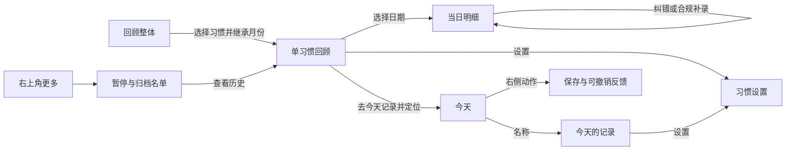

# 习惯模块：动线体检与轻量信息架构 · GLM 实施方案 V2

> 产品负责人：东林。日期：2026-10-07。
> 本轮交付：当前源码体检、确定的信息结构、用户动线、实施边界与验收清单。尚未实施 App 改造。
> 核心决定：**今天记录，回顾统计；回顾按「整体 → 单习惯 → 某天记录」逐层展开；取消管理主页签。**
> 当前状态：**东林已于 2026-10-07 确认最新结构，可交 GLM 按本 V2 实施。** [打开已确认的完整交互原型](./2026-10-07-习惯模块完整动线-交互确认原型-V2.html)。结构确认不代表原生功能或真实统计已验收，本次文档交接没有实施 App 改造。

## 0. GLM 开工入口与版本优先级

本次以本 V2 和已确认完整 HTML 为实施入口，不再按旧三页签方案重建页面。先读本文件，打开完整 HTML 走通路径，再执行 §12 的 G0 → G5；结构已经确认，无需重新征询页签或图表方案。

| 材料 | 本次用途 |
| --- | --- |
| `/Users/tangyuxuan/Desktop/Claude/HOLO/docs/habits/plans/2026-10-07-习惯模块动线体检与轻量信息架构-GLM实施方案-V2.md` | 实施主规格：页面职责、数据与动作契约、文件范围、阶段、R01–R24 验收和回退 |
| `/Users/tangyuxuan/Desktop/Claude/HOLO/docs/habits/plans/2026-10-07-习惯模块完整动线-交互确认原型-V2.html` | 已确认的入口、内容层级、操作位置和返回路径；手机内为 App 结构，手机外说明栏与演示工具不进入 App |
| `/Users/tangyuxuan/Desktop/Claude/HOLO/docs/habits/plans/2026-10-07-习惯今天页-最终效果模拟.html`；`/Users/tangyuxuan/Desktop/Claude/HOLO/docs/habits/plans/2026-10-06-习惯模块交互重构-验收记录.md` 的 10 月 7 日「缝线日课」章节 | 保留今天的紧凑列表和缝线视觉；名称与缝线的导航职责按本 V2，不能恢复旧详情跳转 |
| `/Users/tangyuxuan/Desktop/Claude/HOLO/docs/habits/plans/2026-10-06-习惯模块交互重构-GLM完整实施方案-V1.md` | 仅继承与 V2 不冲突的数据、记录动作、会员、补录、暂停、撤销、保存恢复与质量要求；其三页签、混合详情及重复统计的要求已被 V2 替代 |

HTML 只用于确认体验，原生实现仍使用 SwiftUI 和现有业务真源，不嵌入 WebView，也不移植演示用仓库。固定日期、样例 ID、刷新重置、内存保存、失败开关、Plus 演示、简化暂停状态和撤销计时都不是 App 规则。HTML 为演示记录方式切换所做的值转换，也不得作为改写历史记录的算法；类型转换、数值校验、权限、配额和撤销仍走现有契约，并按 §10/§13 验证。

真实保存成功才更新数据和反馈；查询失败不能当成空数据。页面成功反馈复用现有品牌动效与页面内回执，不照搬 HTML 的浮层或另起一套业务计时。原型没有验证真实购买、系统通知、后台草稿恢复或 CloudKit 同步，这些必须在原生验收中分别报告。

GLM 开工时在 `docs/habits/plans/2026-10-07-习惯模块轻量信息架构-V2-验收记录.md` 新建本轮记录，记录实际 HEAD、保护的在途改动、G0–G5 状态、R01–R24 结果和未验证项，不覆盖 10 月 6 日的旧验收记录。完成标准以 §15 为准，结构已确认后不能把排序、展示、纠错或暂停恢复留作占位。

## 1. 产品结论与本次取舍

问题的根源是页面按现有能力拼接，没有按用户的问题排序。当前「回顾」先展示全部习惯最近七天，再展示一个习惯的本月，最后又进入全部习惯的月度统计；「今天」名称和痕迹进入兼具记录、统计、设置的详情；「管理」又重复习惯列表和统计入口。用户每到一页都得重新判断「现在看的是哪个习惯、什么时间、这里能做什么」。

上一版方案要求保留三页签、月度概览、详情统计与大量原统计展示，这个要求本身造成了层级重复。V2 明确撤销这些页面保留要求，不再靠增加折叠入口维持所有旧仪表盘。

这次做以下确定的产品决定，GLM 无需再征询页面结构：

| 决定 | 用户得到什么 | 取舍 |
| --- | --- | --- |
| 主导航只有「今天 / 回顾」 | 打开就知道是来记录，还是看积累 | 低频维护不再占一个主页面 |
| 今天只保留当日记录、当前周期进展和已有 30 天缝线痕迹 | 保留东林刚调整好的记录手感与积累反馈 | 删除顶部七天日期统计条；缝线变为只读摘要 |
| 回顾首页默认本月，先看整体摘要和每个习惯的结果 | 先回答「这一月怎么样」，再选想看的习惯 | 移除全局七天柱图、平均完成率、六个月柱图和表现排名 |
| 单习惯统计只存在于「单习惯回顾」 | 同一习惯只需认识一个统计页面 | 退出旧详情中的另一套统计与「详细统计」入口 |
| 单习惯每次只展示一块主要可视化 | 看图的目的明确，页面更短 | 打卡看日历；数值默认看趋势，可切换日历，不同时堆叠 |
| 编辑、暂停、归档在具体习惯的设置中；批量选项在右上角更多 | 操作靠近对象；仍能找回暂停或归档习惯 | 保留设置能力，取消「进行中」的重复维护列表 |
| 首版统计优先表达真实记录 | 数字能追到具体日期和记录 | 本轮不展示跨类型总分，不推断「没记录就是控制住」 |

这是一轮信息架构收敛，不再做新的视觉风格评选。沿用当前连续列表、图标、习惯色、紧凑密度、30 天缝线和已有成功反馈。首页品牌球体及其他模块不在范围内。

## 2. 体检方法与证据边界

- 本轮读取当前工作区代码及 10 月 6 日方案、验收记录、10 月 7 日缝线决策。源码核对时 HEAD 为 `d5406381d0d8dbae35710493a6901bece5749e12`。
- 当前 `HabitInteractionFeature.isV1Enabled` 默认 true，显式 false 才回退。`HabitsView` 中「默认关闭」的旧注释已过时，以实际开关实现为准。
- 交接复核时 HEAD 仍为上述版本；当前相关未提交文件包括 `HabitModuleContainer.swift`、`HabitModuleViewModel.swift`、`HabitType.swift`、`HabitTileView.swift`、`HabitStatsView.swift` 和两个数值图表组件。问题表记录的是本轮源码体检时的事实，GLM 在 G0 按当前工作区重新定位，不把旧行号当作当前差异，更不能覆盖东林或其他会话的工作。
- 下表的「源码确认」表示可从代码路径确认；体验影响是产品判断。本轮没有启动 App、没有新增用户测试，也没有复验历史文档声称通过的测试。
- 不把历史「验收完成」当成本轮证明：排序占位、回顾设置跳转和日历事件仍需按当前代码重核。

## 3. 问题清单：不止是图表太多

优先级含义：P0＝数字可信或关键动作可用性；P1＝本轮必须收敛的动线；P2＝独立后续需求，不扩张本轮。

| ID / 优先级 | 当前事实与用户影响 | V2 处理 | 证据 |
| --- | --- | --- | --- |
| A01 / P1 | 回顾的七天总览是全部习惯，下面月历是一个习惯，尾部月度概览又是全部习惯；对象范围来回跳 | 整体首页 → 点习惯 → 单习惯回顾，单习惯页不再出现全局统计入口 | E02、E03，源码确认 |
| A02 / P1 | 回顾默认选第一个习惯，用户还没决定看谁，就进入一个具体对象 | 回顾首页展示可见习惯的月度结果列表，不默认钻入第一个习惯 | E02，源码确认 |
| A03 / P1 | 回顾 `selectedMonth` 和弹出的 `HabitStatsState.selectedMonth` 各自持有月份，入口没有传递当前月份 | 一个回顾状态；从整体进入单习惯继承范围，返回恢复整体原范围 | E01、E02、E06，源码确认 |
| A04 / P1 | 七天柱图、单习惯月历/趋势、旧统计驾驶舱/六个月趋势/洞察/展开卡片，以及详情统计重复表达积累 | 新主流程移除旧仪表盘；整体首页不用图表，单习惯只保留一块主要图 | E02、E03、E04，源码确认 |
| A05 / P1 | 今天同时有七天日期条、30 天行痕迹、详情范围与统计；每日行名称/痕迹打开复杂详情，周/月行痕迹却是空回调，同样外观行为不同 | 删除顶部日期统计条；名称打开「今天的记录」；保留只读缝线，不再点缝线打开统计 | E05、E07，源码确认 |
| A06 / P1 | 管理再次展示进行中列表，还能打开详细统计；维护和统计没有分工 | 删除管理主页签和进行中维护列表；对象设置就近，暂停/归档名单从更多打开 | E01、E08，源码确认 |
| A07 / P0 | 「今天列表排序」按钮动作为空，用户点击无结果 | 完成真实排序流程，保存后今天顺序改变；不交付占位入口 | E08:269，源码确认 |
| A08 / P0 | 「回顾展示设置」回调只切到回顾页；新回顾直接读 todayRows/pausedRows，未消费已有展示偏好 | 接入真实展示设置；统计范围、列表与数字共用同一可见集合，全关闭保持关闭 | E01:76、E02:32、E10，源码确认 |
| A09 / P0 | 回顾挂了日记录弹层，但月历组件没有点日事件，`selectedDay` 未由格子点击赋值 | 月历和趋势的选择都能打开对应日的真实记录；统一日记录组件 | E02、E09，源码确认 |
| A10 / P0 | `monthRecordedDays` 数 `hasRecord` 格子；坏习惯格子的 hasRecord 是「有记录且未超标」。坏习惯发生/超标的日期因此不计入「本月记录天数」 | 「有记录」与「表现是否达标」分字段；记录天数只从有效记录计算 | E02:413、E11:703，源码确认 |
| A11 / P0 | 总平均完成率混合打卡/数值/好坏习惯；坏习惯无记录日被旧控制率视为成功，数值型好习惯主要按记录日计分；它不等于用户理解的整体达标率 | 新 UI 退出总完成率、控制率、跨类型排名；不在其他消费者中偷偷改旧算法 | E11:365、E11:388、E11:450，源码确认 |
| A12 / P0 | 旧月度统计从当前 activeHabits 选样本；暂停或归档后，过去的结果会随当前状态消失。新回顾也默认排除暂停，归档无常规回顾入口 | 历史记录不随当前生命周期隐去；有当月记录的暂停/归档习惯继续列出，标当前状态 | E02:32、E11:437，源码确认 |
| A13 / P0 | 月查询把下月第一天零点传给包含上界的查询；零点记录可能跨月计入。旧完成率分母还使用整月区间，包含尚未过去/创建前的时间，存在口径风险 | 新投影统一半开区间；本月截止当前时刻；新首版没有这些百分比，专项测试边界 | E11:435、E11:353、E12:802，源码确认边界风险，未用真实数据复现 |
| A14 / P1 | 单习惯详情默认最近七天，进入回顾后选的是月，详情里的连续积累又是当前/全历史；同一路径不同时间含义 | 所选范围有唯一标题；历史月份只显示该范围记录结果，不混入今天进度或当前连续 | E04:64、E02:415，源码确认 |
| A15 / P1 | 周/月习惯有周期弹性，坏习惯只按发生记录；「未记录」「都留下了」容易被理解为今天必须完成所有习惯 | 今天保留筛选但不把未记录当失败；周/月显示本周期进展；坏习惯使用「记录发生」，不庆祝、不催全员完成 | E05:164、E07:31，源码确认当前文案，误解待用户验证 |
| A16 / P0 | 管理的恢复/归档和容器的待执行删除/归档使用 try? 吞错误；失败时用户缺少可理解结果 | 生命周期动作给明确成功/失败回执；失败保持原列表和入口，不演成功动效 | E08:165、E01:280，源码确认 |
| A17 / P2 | 当前目标/频率字段不是历史版本；用今天的目标解释以前月份，可能改写历史评价 | 本轮历史只讲记录事实，不显示历史达标率或历史目标线；目标版本化另立需求 | E13，已核对模型/计算路径的边界，非已复现事故 |
| A18 / P1 | 日记录说明部分依赖最近 30 天 trail；更早月份不应靠今天行快照推断当日状态。回顾局部 State 还位于会随页签切换重建的视图中 | 任意历史日按指定 habitId＋date 投影；月份/选择/返回位置提升到模块状态 | E02:20、E02:564、E01:50，源码确认实现风险，状态丢失待运行验证 |

其中 A01–A06 属于结构根因；A07–A13、A16 属于不能用「换页面」掩盖的可用性和数据问题；A17 在本轮用减少不可信评价规避，暂不迁移模型。

## 4. 最终信息结构

```text
习惯
├─ 今天（默认进入）
│  ├─ 日期 · 今天已记录 X 项
│  ├─ 全部 / 未记录 · 补录
│  ├─ 每日习惯：右侧直接打卡 / 加减 / 输入测量
│  ├─ 本周与本月：本周期进展 + 今日记录动作
│  └─ 点名称 → 今天的记录（当天明细、纠错、习惯设置）
├─ 回顾
│  ├─ 月份（默认本月）· 当前可见范围
│  ├─ 整体两项摘要：有记录的日子 / 留下记录的习惯
│  ├─ 各习惯结果列表（不内嵌可展开图表）
│  └─ 点一项 → 单习惯回顾（继承月份）
│     ├─ 一个时间范围 + 该习惯结果摘要
│     ├─ 一块主要可视化：打卡日历 / 数值趋势或日历
│     ├─ 选一天 → 当日明细 → 编辑具体记录 / 合规补录
│     └─ 更多 → 习惯设置；今日无记录时可「去今天记录」
└─ 右上角更多（低频选项，无第三个主页签）
   ├─ 已暂停与已归档（直接恢复 / 取消归档、查看回顾）
   ├─ 今天列表排序
   ├─ 回顾展示与顺序
   ├─ 今日看板展示
   ├─ 提醒设置（沿用现有真实支持范围）
   └─ 数据管理（既有模块清空 / 最近删除）

习惯设置（同一编辑表单＋生命周期操作）
├─ 名称、记录方式、频率、当前目标、提醒、关联目标、图标/颜色
└─ 暂停 / 恢复、归档 / 取消归档、删除
```

模块页签继续沿用当前底部两项导航；大屏沿用顶部两项切换。首次普通进入今天，模块退出后再次普通进入今天；模块内部切换时保存两个页面的范围、筛选和滚动位置。外部回顾/详情深链按 §9 定位。

今天头部显示新增「＋」和更多；回顾头部只显示更多，让统计页面没有新增/直接打卡主动作。所有维护弹层关闭都返回打开它的位置，不能为了保存而强制切到今天。

## 5. 今天：完成一次真实记录

### 5.1 保留与删除

- 保留东林已调整的连续列表、当前紧凑密度、独立右侧动作、习惯颜色、图标、30 天「缝线日课」及保存/撤销反馈。
- 保留每日 / 本周与本月分组；计数右侧值始终是今天值，本周期累计写在副标题，不混用。
- 删除顶部滚动七天日期统计条。它承担历史回看，与回顾重复；移除后把空间还给习惯列表。
- 缝线只作只读积累摘要。取消 Button 和跳转，不留下假的点击热区；VoiceOver 可读「最近 30 天……」，不宣称可点日。保留实针、空心补录、暂停搭线、创建前空位等已定稿状态。
- 标题固定「今天已记录 X 项」，不再根据总数变成「所有习惯都完成了 / 都留下了」。周/月习惯和减少的习惯不能被当成每日必做清单。

### 5.2 操作规则

| 对象 | 右侧主动作 | 点名称后 |
| --- | --- | --- |
| 好习惯打卡 | 打卡 / 已记录（可撤销） | 打开此习惯「今天的记录」 |
| 坏习惯打卡 | 记录发生 / 已记录发生 | 查看今天发生记录；不把没有记录写成已控制住 |
| 计数 | ＋；有今天记录后显示今日值与 − | 查看今天每一条记录、备注；− 仍撤销今天最近一条，不假设减 1 |
| 测量 | 记录 / 再记录 | 查看今天样本；真实 0 可保存、显示和编辑 |

「今天的记录」是一个轻量弹层：习惯名＋完整今日日期 → 今日合计/最新值＋本周期进展 → 今天每条记录（时间、值、备注）→ 习惯设置入口。没有月历、趋势、时间范围切换和累计仪表盘。可复用同一日记录内容组件；正常记录仍走共享协调器，具体纠错按 recordId 定位。

保留「全部 / 未记录」作为记录筛选，不叫待完成或漏做。坏习惯未记录显示中性状态；未记录筛选空时写「当前筛选下没有习惯」，提供查看全部，不庆祝「坏习惯都记录了」。成功行仍原位保留，按已有固定 ID 集合规则刷新筛选，避免刚记录就消失。

统一入口文案为「补录」。习惯选择页中的实际动作再区分「补签 / 补记」；按现有资格决定可选项，不能向不支持的坏习惯、周/月打卡型显示可补按钮。

今天有暂停习惯时，可保留一个轻量「已暂停 N 项」文本入口，打开同一低频名单并定位暂停段；全量活跃列表为空时，这是主动作。全部归档时明确写「习惯都已归档」，提供查看归档与新增，不写「创建第一个习惯」。加载中/失败与真实空状态区分。

首次创建沿用现有名称＋记录方式的基础填写，默认打卡，目标/提醒/关联/图标按需配置。保存后回今天并定位新习惯，让用户马上完成第一次记录；创建本身不自动打卡、不强制设置目标，也不直接送进回顾页。

## 6. 回顾首页：先整体，后具体

### 6.1 只有一个月份、两个摘要、一份结果列表

```text
回顾                                      [更多]
‹             2026年10月                 ›
截至10月7日 · 全部习惯（或：已选3项）

有记录的日子  6 天        留下记录的习惯  3 项

阅读        记录6天                         ›
喝水        共28杯 · 记录6天                 ›
体重        最近63.2kg · 记录4天             ›
吸烟        发生3天 · 共8支                  ›
跑步        记录2天 · 当前已暂停              ›
```

这是结构示例，不是当前用户数据。首页没有单习惯选择胶囊、单习惯月历、最近七天柱图、全局完成环、六个月趋势、洞察排名、可展开统计卡片或「月度概览」二次入口。点一行进入该习惯的回顾，不能原地展开成第二套详情。

两个整体摘要只回答记录覆盖：有记录日子的不同日期数、留下记录的不同习惯数。它们不是坚持天数、目标达成率或健康表现。可以点摘要旁信息按钮看一句口径说明，不新增独立报表。隐藏某习惯后，摘要与列表都按同一可见范围重算，标题注明范围。

当前月截止当前时刻；过去月使用完整月份。未来月份不可选择。本月提供「回到本月」；整个列表无记录时仍能切月份，不能把月份控制一起藏进空状态。

### 6.2 哪些习惯进入回顾

先获取所有未删除 Habit（包含当前活跃、暂停、归档），再应用已有回顾展示偏好，最后按选定月份形成列表：

1. 当月有有效记录的习惯进入列表，无论当前是否暂停/归档，标明当前状态。
2. 当前活跃、且创建日期不晚于该月结束的习惯，即使当月零记录也进入列表，写「该月无记录」。
3. 暂停/归档且该月无记录的习惯不占首页行；仍可从「已暂停与已归档」查看它的历史。
4. 创建前的月份不因当前活跃而生成一整月的「未完成」。软删除 Habit、软删除记录及孤立父引用排除。

已有 `effectiveStatsVisibleIds()`：nil＝全部；[]＝用户明确全部关闭；非空＝白名单。严格复用，不把全关闭恢复成全部，也不为展示新历史偷偷扩张用户白名单。标题「全部习惯」指默认可见范围，不等于只含今天 activeHabits。列表顺序复用 `orderedHabitIds`，未覆盖项按主排序和稳定 ID 兜底，不按成绩排名。

隐藏仅影响指定展示范围，不等于删除/暂停。当天主列表和今日看板展示仍是各自已有契约；「回顾展示」与「今日看板展示」分别命名，不合并成模糊的显示开关。

回顾白名单控制整体汇总和列表，不禁止用户从具体习惯设置、暂停/归档名单或深链直接查看该习惯历史；这种直接访问的页面明确只有一个习惯，不重新把它加入整体白名单。

## 7. 单习惯回顾：唯一的统计详情

### 7.1 进入和返回

- 从整体点阅读：标题「阅读」，范围继承整体选定的月，显示当前暂停/归档状态但不要求恢复或付费才能看历史。
- 单习惯页可改变范围；返回整体时恢复整体原月份、可见范围和滚动位置，不让详情的临时选择改写整体月份。
- 页面内不出现「月度概览」「全部习惯统计」「详细统计」；返回整体用返回键。
- 从今天正常名称点击不开这页；从暂停/归档名单、旧详情深链进入则打开这一个规范页面，关闭返回原来源。

### 7.2 内容顺序与图表数量

习惯名/当前状态 → 一个范围控制 → 该范围两项以内结果 → 一块主要可视化 → 被选日期明细。习惯设置在右上角更多。

| 类型 | 结果摘要（最多两项） | 主要可视化 |
| --- | --- | --- |
| 好习惯打卡 | 记录天数；必要时记录次数说明 | 日历，选日看明细 |
| 坏习惯打卡 | 发生天数；不提供无记录控制率 | 中性发生日历，不把空白渲染为成功 |
| 计数 | 范围总量＋单位；有记录天数 | 默认按日累计柱图；可切换日历，两者互斥 |
| 测量 | 范围内最近值＋日期；有记录天数 | 默认按日最新值趋势；可切换日历，两者互斥 |

默认月范围。已有最近 7/30/90 天、全部、自定义范围保留在同一个「时间范围」菜单，复用原能力，不增加新的详细统计页面。所有摘要、图和明细按选定范围同步变化。日历范围跨月时一次只显示一个月，可在范围内翻月；这是范围内日期定位，不能改变结果统计范围。

数值图直接使用真实日聚合；没有记录保留缺失，不能补 0，真实 0 必须显示。测量没有日样本的地方按既有图表规范表现缺失，不能凭连线生成记录。单点/稀疏数据也可选中并核对。

窄屏/大字号下，若七列日期无法同时满足 44pt 热区，改为该范围的可滚动日期列表，每行显示完整日期与状态、点击查看同一日明细；不要压小日历格强行塞七列。图表另提供同一日期列表供 VoiceOver 和键盘选择，不能把精确点选作为唯一入口。

当前连续积累在今天行按既有口径展示；过去月份页面不混入当前连续、今天完成数量或当前目标评分。长期累计等非首屏指标如需保留，放同页折叠的「更多记录摘要」，不再增加图表或独立页面。此轮不保留总平均完成率、跨类型排名或六个月全局图的可达入口；旧代码可暂留用于完整 UI 回退。

### 7.3 查看某天与修正事实

点日历格/图表真实点，展开同一个日期明细组件：完整日期 → 当日合计/最新值/发生状态 → 每条记录的值、时间、备注、补录标识。日历不靠 `hasRecord` 表现字段判断有没有真实记录；任意历史日不能靠 todayRow 的最近 30 天 trail 取状态。

记录行菜单提供「编辑记录 / 删除记录」，精确定位 recordId，编辑时保持日期与习惯归属；删除按既有确认契约执行。保存成功后留在原范围、原选择日，所有摘要更新。失败保留输入并提供重试。

过去日缺记录时，符合规则才显示「补签 / 补记」，其他情况说明创建前、超出窗口、暂停日不算漏签、类型不支持等原因。今天需要新记录时显示「去今天记录」并跳回今天、定位该习惯；不在统计页常驻另一套打卡/加减操作。补录与编辑历史是纠错例外，不另建第三个历史录入页面。

未来日期和创建前日期可读但不可录。暂停当天已有真实记录时继续显示真实记录并附「暂停期间有记录」，不抹掉它。补录完成后停留在当日，不跳回统计首页。

## 8. 取消管理页签后，能力如何安置

| 原能力 | V2 唯一落点 | 行为 |
| --- | --- | --- |
| 编辑、提醒、关联目标、类型/频率/目标/颜色 | 具体习惯的「习惯设置」 | 沿用 AddHabitSheet 的渐进配置；目标清除用已有三态契约 |
| 暂停、恢复、归档、取消归档、删除 | 同一习惯设置的底部操作 | 危险动作分离；状态决定可用操作，不显示已归档习惯的普通归档按钮 |
| 找回暂停/归档习惯 | 更多 → 已暂停与已归档 | 两个列表段，不再放进行中列表；恢复和取消归档直接可见，历史可看 |
| 今天排序 | 更多 → 今天列表排序 | 显式拖动＋保存/取消；只重排 active 集合，不覆盖暂停/归档相对顺序 |
| 回顾显示与排序 | 更多 → 回顾展示与顺序 | 真实选择＋保存/取消；统计摘要消费相同集合；保留全关闭 |
| 今日看板展示 | 更多 → 今日看板展示 | 复用既有偏好、新增自动纳入和全关闭契约，不影响习惯模块今天列表 |
| 批量提醒与系统权限检查 | 更多 → 提醒设置 | 复用现有 HabitReminderDetailView；仅真实支持的打卡型可配置，不扩张数值提醒 |
| 模块清空与最近删除 | 更多 → 数据管理 | 复用现有 ModuleClearSheet / 回收站入口，不重建清空链路 |
| 全局月度统计、详细统计 | 回顾首页和单习惯回顾 | 原管理统计入口删除，不保留跳转别名 |

暂停按现有 Plus 权益执行；恢复、取消归档和读历史不新增付费门槛。归档保留暂停状态/窗口，取消归档后仍暂停时返回暂停名单，不能擅自恢复。普通暂停/归档用确认后的成功回执更新列表；失败原项仍在并有错误说明。

单习惯删除目前物理删除且不可恢复；模块清空目前进入 30 天回收站。这两类文案必须保持差异，V2 不借架构改造把前者宣称可恢复，也不修改删除机制。真实数据风险操作仍须遵守项目规范。

## 9. 六条主要用户动线与导航契约

| 用户想做什么 | 操作路径 | 终点与返回 |
| --- | --- | --- |
| 今天读了书 | 打开习惯 → 今天 → 阅读右侧打卡 | 原位确认已保存，可撤销，位置不变 |
| 今天体重记错 | 今天 → 点体重名称 → 今日记录 → 编辑那条记录 | 成功回到今日记录，今天数值同步；不用进月统计 |
| 看上个月的变化 | 回顾 → 选九月 → 看各习惯结果 → 点阅读 | 阅读九月日历；返回仍是九月和原列表位置 |
| 核对/补上某天 | 单习惯回顾 → 选那天 → 查看明细 / 合规补录 | 保持该习惯、范围和日期；不返回全局月度页 |
| 这周想休息 | 今天 → 名称 → 习惯设置 → 暂停 | 权益/保存成功后退出今天；更多的暂停名单可找回 |
| 恢复旧习惯 | 更多 → 已暂停与已归档 → 恢复 / 取消归档 | 名单状态更新，今天出现；历史仍能回顾 |



导航状态放在模块根部，建议显式表达 `overviewMonth`、`selectedHabitId`、`detailRange`、`selectedDay`、`returnOrigin` 和滚动锚点，不散落多份 selectedMonth。视图层使用 UUID 和值快照；对象删除/归档后关闭正确页面，再消费回执，避免访问已经失效的托管对象。

外部 `.habitDetail(UUID)` 继续有效，统一进入单习惯回顾，默认为本月；根页选回顾，关闭详情停在回顾整体。有效暂停/归档 ID 可读历史；已删除/软删 ID 显示「这个习惯已不可用」，不重建占位对象。`PendingRetroactiveOpener` 继续接真实补录流程，带回原来源。

普通关闭模块再进入今天；系统恢复未完成表单时优先保留草稿。正在输入的表单不因页签或后台切换被丢弃；需要关闭不同弹层再开下一层时用明确路由交接，不靠多个独立 Bool 竞争展示。排序、展示等未保存草稿取消后不改变真实偏好。

## 10. 数据契约：先统一事实，再换页面

本轮只新增/整理只读投影和导航状态，复用 `HabitRepository`、`HabitPresentationProjector`、`HabitActionCoordinator`。不新增 Core Data 实体、不迁移 CloudKit、不重算存量记录。下面是实现约束，不是新的存储格式。

| 字段/数字 | 确定定义 |
| --- | --- |
| 有效记录 | 父习惯未删除且有效；记录未软删；时间不晚于投影 now。打卡以 isCompleted 为真，数值以有限值为准，真实 0 有效 |
| recordedDays | 所选 habitId 在所选范围内有有效记录的不同日数；好坏习惯均不由表现是否达标决定 |
| activeRecordDays | 可见习惯集合在范围内有有效记录的不同日期数；同日十个习惯也只算一天 |
| recordedHabitCount | 可见集合在范围内留下有效记录的不同 habitId 数；同一习惯十条仍算一项 |
| 计数每日值与范围总量 | 按原 SUM 聚合；范围总量为真实逐日聚合之和；单位不同的习惯绝不相加 |
| 测量每日值与最近值 | 按原 LATEST 聚合及排序真源；范围内最新真实样本，显示日期；不累计体重等测量值 |
| 坏习惯发生 | 打卡＝发生记录；数值＝真实记录量。无记录表示缺少记录，不代表确认未发生、0 或控制成功 |
| 目标与频率 | 今天使用当前业务真源。设置页标「当前目标」。历史页不按当前目标宣布历史达标，不画历史目标线 |
| 当前状态与历史 | 当前暂停/归档只作为状态标签；不抹掉选定范围内真实记录；默认集合及白名单规则见 §6.2 |
| 日期窗口 | 使用统一 calendar/now 的半开区间 `[start, end)`；日末是次日零点，月末是次月零点；本月过滤未来时间 |
| 创建前/未来/暂停 | 分别为不可记录、不可记录、有独立暂停语义；有真实记录与暂停可同时成立 |
| 记录来源与补录 | 保留 recordId、原 date、isRetroactive 与备注；新页面不补造 record，不更改原配额 |

日历值建议用独立 `HabitReviewDay` 表达 `isRecorded / dailyValue / isPaused / isRetroactive / isBeforeCreation / isFuture`。不要重定义旧 `HabitStatsDayCell.hasRecord` 来顺便影响旧控制率或其他模块。

复用现有共享纯逻辑为基础，补一个范围投影方法即可。整页先取一次必要范围的事实，再内存聚合；不能在每个 SwiftUI body/每个格子里逐条查询。结果带同一个范围与可见 ID 集合，整体摘要、行和详情都能解释来源。

记录查询失败需要能表示失败，不能沿用 `allRecordFacts()` 返回 [] 后把失败当「从未记录」。可增加新的 throwing/Result 快照入口供新回顾消费，保留现有 API 兼容；不要求为此重写整个 Repository。

补录沿用现在的业务规则：免费每自然月 3 次、所有习惯共享，Plus 无限制；lookbackDays=7 含今天，实际过去可补今天−6 到昨天；只有现有支持类型和可补日可用；暂停日不算漏签。幂等先判已有记录，成功写入才扣额度，失败/取消不扣；入口变动不能绕过权益或额度。暂停日界与记录日界仍沿用既有真源，不在本轮隐性迁移时区。

## 11. GLM 实施范围与文件清单

主副本：`/Users/tangyuxuan/Desktop/Claude/HOLO`。以下是绝对路径；新文件名可按现有命名习惯微调，但最终职责不能重新混合。

| 文件 | 本轮动作 |
| --- | --- |
| `/Users/tangyuxuan/Desktop/Claude/HOLO/Holo/Holo APP/Holo/Holo/Views/Habits/HabitModuleContainer.swift` | 两页签；集中回顾路由、来源与弹层；删除 showMonthlyOverview 与管理页签挂载；接更多选项 |
| `/Users/tangyuxuan/Desktop/Claude/HOLO/Holo/Holo APP/Holo/Holo/Models/HabitModuleViewModel.swift` | Tab 仅 today/review；保存回顾/返回状态；区分加载失败；保留今日筛选与动作反馈 |
| `/Users/tangyuxuan/Desktop/Claude/HOLO/Holo/Holo APP/Holo/Holo/Views/Habits/HabitTodayView.swift` | 删顶部 weekStrip；名称接今日记录；补录与暂停名单接统一入口；空状态区分 |
| `/Users/tangyuxuan/Desktop/Claude/HOLO/Holo/Holo APP/Holo/Holo/Views/Habits/Components/HabitRowView.swift` | 保留 30 天缝线视觉与数据；取消痕迹 Button；名称语义改今日记录；保留独立右侧动作 |
| `/Users/tangyuxuan/Desktop/Claude/HOLO/Holo/Holo APP/Holo/Holo/Views/Habits/HabitReviewView.swift` | 改为月度整体首页，删除旧混合结构；单行进入规范单习惯页 |
| `/Users/tangyuxuan/Desktop/Claude/HOLO/Holo/Holo APP/Holo/Holo/Views/Habits/HabitSingleReviewView.swift`（新增） | 唯一单习惯统计页；继承范围；一块主要可视化；日期明细与纠错；复用旧详情必要能力 |
| `/Users/tangyuxuan/Desktop/Claude/HOLO/Holo/Holo APP/Holo/Holo/Views/Habits/HabitTodayRecordSheet.swift`（新增） | 今日记录弹层；不含统计范围/图表；共享日记录内容 |
| `/Users/tangyuxuan/Desktop/Claude/HOLO/Holo/Holo APP/Holo/Holo/Views/Habits/HabitModuleOptionsSheet.swift`（新增） | 暂停/归档名单与真实排序、展示、提醒、数据选项；不复制进行中列表 |
| `/Users/tangyuxuan/Desktop/Claude/HOLO/Holo/Holo APP/Holo/Holo/Views/Habits/HabitManagementView.swift` | 提取暂停/归档行与操作供低频名单复用；新主流程不再挂载完整管理页面 |
| `/Users/tangyuxuan/Desktop/Claude/HOLO/Holo/Holo APP/Holo/Holo/Views/Habits/HabitDetailView.swift` | 提取记录编辑、范围、设置等可复用内容；新主流程不再打开这个混合详情；暂留旧 UI 回退 |
| `/Users/tangyuxuan/Desktop/Claude/HOLO/Holo/Holo APP/Holo/Holo/Models/HabitPresentationProjector.swift` | 复用已有有效记录、日聚合、补录资格；补范围摘要和指定日期投影，不复制业务算法 |
| `/Users/tangyuxuan/Desktop/Claude/HOLO/Holo/Holo APP/Holo/Holo/Models/HabitRepository+InteractionRebuild.swift` | 必要时增加能报告失败的批量事实入口；历史获取包含非删除的暂停/归档对象 |
| `/Users/tangyuxuan/Desktop/Claude/HOLO/Holo/Holo APP/Holo/Holo/Models/HabitStatsDisplaySettings.swift` | 复用有效可见集合与独立顺序，保留 nil/[]/白名单兼容，不重置用户偏好 |
| `/Users/tangyuxuan/Desktop/Claude/HOLO/Holo/Holo APP/Holo/Holo/Views/Habits/AddHabitSheet.swift` | 沿用名称＋三种记录方式＋渐进配置，承接对象设置与原三态编辑/目标关联契约 |
| `/Users/tangyuxuan/Desktop/Claude/HOLO/Holo/Holo APP/Holo/Holo/Views/Habits/Stats/Components/HabitMonthGridView.swift` | 增加可选点日回调或抽新叶子组件；旧调用兼容，避免改坏旧 hasRecord 语义 |
| `/Users/tangyuxuan/Desktop/Claude/HOLO/Holo/Holo APP/Holo/Holo/Views/Habits/Stats/HabitStatsView.swift` | 新流程删除所有入口，不在其脏改上整体覆盖；暂留完整旧 UI 回退 |
| `/Users/tangyuxuan/Desktop/Claude/HOLO/Holo/Holo APP/Holo/Holo/Localizable.xcstrings` | 补新增中文/繁体/英文文案与 VoiceOver 标签，不照搬「查看详情/最近30天可点击」旧语义 |

`HabitReviewDay`、范围摘要、回顾状态可分别放小文件，避免把现有大型 DetailView 搬成另一个 1500 行页面。旧统计核心和外部消费者继续兼容；新回顾不调用旧平均完成率作为新摘要。

## 12. 实施阶段与完成条件

按 G0 → G5 完成。这些阶段是同一轮交付，不是让东林分六次批准。业务规则已有默认决策直接执行；危险数据迁移、生产部署、提交推送仍按用户授权范围处理。

| 阶段 | 工作 | 阶段完成条件 |
| --- | --- | --- |
| G0 冻结事实 | 记录 HEAD、习惯文件差异；核真实测试目标、开关、存量偏好与数据规则；确定保护文件 | 不覆盖在途工作；本轮接口与范围清单明确 |
| G1 数据与状态 | 范围快照、有效记录摘要、历史生命周期集合、统一日期范围、回顾导航/返回状态、失败表达 | A08/A10–A13/A18 的确定性逻辑测试通过；不改存储模型 |
| G2 两条主路径 | 两页签与更多；今日名称改为今日明细；保留缝线，删除顶部统计条；入口转移 | 新主路径无法再打开混合旧详情/旧全局报表；今天记录仍可用 |
| G3 回顾 | 整体月度列表 → 单习惯回顾 → 日期明细；互斥图表；继承范围与返回定位；编辑/补录 | 每个可视点可追到事实；上月到详情再返回时间不跳 |
| G4 补齐低频能力 | 真排序、真展示、暂停/归档名单、对象设置、错误回执；补本地化与无障碍 | 所有展示出来的按钮都有实际效果；没有排序占位/设置假跳转 |
| G5 回归交付 | 有针对性的逻辑测试、核心用户路径、适配与外部消费者回归；更新验收记录 | 按 §13 逐项记录真实证据；未完成项明列，不凭编译宣告完成 |

G0/G1 可以在视图接入前完成，不能先把管理删了、低频操作尚未接好就交付。最终版本必须是两条主路径和维护入口一起可用。

当前工程已有 HoloTests/HoloUITests（scheme 有真实 test target），不得沿用旧记忆中「只有 standalone」的假设。纯投影测试优先沿项目已有 Habit* 测试组织；是否使用 standalone 按当前依赖决定。只补能证明统计契约与导航结果的测试，不为删文字/换图标写镜像测试。

## 13. 验收清单：按用户问题验证

固定隔离测试数据，禁止往东林真实库播种：每日好习惯打卡、每周目标打卡、计数（同日三条且有一条数值不等于 1）、测量（真实 0 和缺失）、坏习惯打卡、坏习惯计数、暂停习惯、归档习惯；包含九月/十月跨月、补录、创建前、暂停期间真实记录、软删记录与隐藏项。

| ID | 必须得到的结果 | 证据层 |
| --- | --- | --- |
| R01 | 主导航只有今天/回顾；普通重新进入今天；大屏也是两项 | 原生操作 |
| R02 | 今天名称只开今日记录，右侧操作只记录；无顶部七天统计条；30 天缝线仍符合已定稿样式且无点击假入口 | 原生操作，东林确认保留效果 |
| R03 | 打卡、计数、测量成功/失败/准确撤销仍正确；计数 − 撤销最新 recordId，而非聚合值机械减 1 | 既有动作测试＋原生操作 |
| R04 | 回顾首页先显示所选月份的整体结果，不自动选第一个习惯；无旧全局报表入口 | 原生操作 |
| R05 | 选九月 → 点阅读 → 仍九月；详情改范围 → 返回 → 整体仍九月及原列表位置 | 原生操作/导航状态测试 |
| R06 | 单习惯仅有一个范围控制、一块主要可视化；数值趋势/日历切换互斥，摘要同步 | 原生操作 |
| R07 | 点月历日/真实数据点能查看正确 habitId＋date 的记录；更早于 30 天的记录状态完整 | 逻辑＋原生操作 |
| R08 | 同习惯同日三条＝1 个记录日；多个习惯同日＝1 个整体记录日；不同习惯数去重准确 | 逻辑测试 |
| R09 | 坏习惯发生/超标日计入记录天数；无记录不生成成功/控制率；真实 0 与缺失分开 | 逻辑＋原生操作 |
| R10 | 计数总量与日 SUM 一致；测量最近值与日 LATEST 一致；不同单位不相加 | 逻辑测试 |
| R11 | 9月30日23:59 属九月；10月1日00:00 只属十月；当前月排除未来时刻；创建前不叫漏做 | 逻辑测试 |
| R12 | 暂停/归档前后的当月历史事实摘要不消失；取消归档不清除暂停状态；软删项排除 | 逻辑＋原生操作 |
| R13 | 回顾设置隐藏项后摘要/列表同步；全关闭持续为空且提示调整展示；主今天/今日看板分别遵守偏好 | 逻辑＋原生操作 |
| R14 | 排序拖动保存真实生效，取消不生效；不覆盖暂停/归档相对顺序；回顾独立顺序保留 | 逻辑＋原生操作 |
| R15 | 暂停/恢复/归档/取消归档失败时有错误，原状态保留；成功才更改显示 | 错误注入＋原生操作 |
| R16 | 补录原窗口、类型、暂停、Plus/额度和幂等正确；失败不扣，重试不重复写入 | 既有规则测试＋原生操作 |
| R17 | 编辑历史按 recordId 精确改值/备注；失败保留输入，成功留原范围/日期，整体数字同步 | 逻辑＋原生操作 |
| R18 | 当前目标在设置/今天明确；过去月份没有今日进度、当前连续或伪历史达标率 | 原生操作 |
| R19 | 有暂停/归档但无活跃项，入口可找回；首次空、筛选空、全关闭、加载/失败各不混淆 | 原生操作 |
| R20 | 旧 habitDetail 深链和补录深链能定位 UUID，删掉的习惯不会重建；关闭返回正确来源 | 深链操作 |
| R21 | 320pt/大字号/深色/减动效/VoiceOver 下操作完整；可点热区至少44pt，焦点顺序为标题→范围→列表→返回/更多 | 适配走查 |
| R22 | 电脑/iPad 键盘能移动焦点、确认选项、关闭弹层；手机键盘不遮保存；未保存草稿切后台保留 | 对应设备操作 |
| R23 | 全局 Today 看板、Widget、聊天记习惯、目标关联、提醒与回收站现有契约未被回顾投影改变 | 受影响消费者回归 |
| R24 | 新界面回退后，记录/暂停窗口/展示偏好仍在；iPhone↔iPad 新记录、纠错、恢复同步正确 | 回退＋双设备 |

每项验收标「代码/逻辑已验证」「模拟器已操作」「真机已操作」「待验证」，并记录实际用例数、设备、失败项。构建通过不能替代按钮可用性；126 条历史测试通过不能证明本轮导航已通过。

低流程交付：以原生核心动线和必要数据测试为主，不另开一轮全量视觉截图评分。30 天缝线及紧凑视觉由东林起 App 确认；本轮以功能路径、数字来源和适配能用作为工程门槛。真实双设备、购买和提醒未验时分别注明，装真机前仍遵守项目质量红线。

## 14. 小样本产品验证（实施后）

找 3–5 位用户，不解释页签，分别让他们：①记录今天的一项习惯；②找到上个月某个习惯并核对一天；③暂停并找回一个习惯。观察第一次点哪里、是否返回找入口、能否说明当前看的是谁/什么范围。

本轮体验目标：第一次记录无教学即可完成；看历史不再绕到另一份全局统计；暂停后能自主找回。把路径完成率、错误点击、重复返回和数据误读作为验证结果，不把图表更少直接当成留存提升。这沿用既有「先完成一个价值动作、再按需揭示」的产品原则，效果尚待实测。

## 15. 回退、发布边界与 GLM 完成定义

- 保留当前 `holo.habits.interactionV1.enabled` 整体回退机制：显式 false 进入完整旧 UI，不只回退半个页面。V2 不另建一套与 V1 竞争的开关，不重置用户显式设置。
- 新导航替换当前新 UI 分支；旧详情/旧仪表盘暂留只供 legacyBody 使用。按调用点确认新主流程已断开旧入口，不能只藏一个按钮。
- 不改 Core Data/CloudKit schema、实体 ID、原记录、真实目标、频率、暂停日界、配额或会员规则；不清库，不重置开发库。
- 本轮预计仅 iOS。若 GLM 发现需要改 HoloBackend，先说明新增必要性，并明确提醒「后端改动需要发版/部署后端」；本地提交/构建不代表生产生效。
- 未经东林另行授权，不提交推送、不部署、不调用 subagents。方案和验收记录留在 `docs/habits/plans/`。

完成必须同时满足：两主入口职责明确；旧重复统计在新流程不可达；每个统计数可追到事实；所有可见维护动作可用；低频能力有确定位置；今日记录/纠错/补录/暂停/恢复/归档和返回路径贯通；历史偏好与数据保留；§13 实际证据与未验证边界完整。

GLM 最终交付按产品语言报告：用户现在可以做什么 → 实际完成/未完成什么 → 测试和设备证据 → 改动文件/验收记录 → 开关/回退与发布边界。不得写「全量完成」后再挂账排序或设置按钮。

## 附录：当前源码证据索引

行号是本轮读取时的位置，实施前按函数/属性名重新定位。路径均为当前主副本；不是手机包或生产证据。

| 编号 | 绝对路径与关键位置 |
| --- | --- |
| E01 | `/Users/tangyuxuan/Desktop/Claude/HOLO/Holo/Holo APP/Holo/Holo/Views/Habits/HabitModuleContainer.swift`：50–83 三页分支与设置回调；131–134 全局月度弹层；280–298 生命周期错误吞掉与旧深链 |
| E02 | `/Users/tangyuxuan/Desktop/Claude/HOLO/Holo/Holo APP/Holo/Holo/Views/Habits/HabitReviewView.swift`：20–38 局部状态/范围集合；43–55 混合结构；277–285 月历挂载；373–395 全局概览入口；413–415 记录天数与连续；564–572 用 trail 推断历史日 |
| E03 | `/Users/tangyuxuan/Desktop/Claude/HOLO/Holo/Holo APP/Holo/Holo/Views/Habits/Stats/HabitStatsView.swift`：23–56 驾驶舱/洞察/统计卡列表 |
| E04 | `/Users/tangyuxuan/Desktop/Claude/HOLO/Holo/Holo APP/Holo/Holo/Views/Habits/HabitDetailView.swift`：64 默认七天；103–122 记录/范围/统计/提醒/明细混合；255–261 单习惯不可恢复删除文案 |
| E05 | `/Users/tangyuxuan/Desktop/Claude/HOLO/Holo/Holo APP/Holo/Holo/Views/Habits/HabitTodayView.swift`：42–44 日期条；56–67 名称和每日痕迹开详情；91 周/月痕迹空回调；164–173 全记录文案；249–279 补签与暂停入口 |
| E06 | `/Users/tangyuxuan/Desktop/Claude/HOLO/Holo/Holo APP/Holo/Holo/Models/HabitModuleViewModel.swift`：17–26 实际默认开启；36–54 三页签；81–100 主状态 |
| E07 | `/Users/tangyuxuan/Desktop/Claude/HOLO/Holo/Holo APP/Holo/Holo/Views/Habits/Components/HabitRowView.swift`：31–65 状态副标题；74–95 名称详情；103–113 30 天痕迹 Button |
| E08 | `/Users/tangyuxuan/Desktop/Claude/HOLO/Holo/Holo APP/Holo/Holo/Views/Habits/HabitManagementView.swift`：45–49 三种集合；165–168 恢复 try?；230–245 生命周期 try?；267–283 占位排序/设置/统计入口 |
| E09 | `/Users/tangyuxuan/Desktop/Claude/HOLO/Holo/Holo APP/Holo/Holo/Views/Habits/Stats/Components/HabitMonthGridView.swift`：10–23 仅 month/accentColor；38–66 非交互格子 |
| E10 | `/Users/tangyuxuan/Desktop/Claude/HOLO/Holo/Holo APP/Holo/Holo/Models/HabitStatsDisplaySettings.swift`：65–81 有效展示集合契约 |
| E11 | `/Users/tangyuxuan/Desktop/Claude/HOLO/Holo/Holo APP/Holo/Holo/Models/HabitRepository+Stats.swift`：353–361 分母；365–422 好坏/数值完成率；428–469 当前活跃集合的月度概览；584–591 月窗；703–709 坏习惯 hasRecord 语义 |
| E12 | `/Users/tangyuxuan/Desktop/Claude/HOLO/Holo/Holo APP/Holo/Holo/Models/HabitRepository.swift`：587–647 补录资格与日期；802–807 包含上界 getRecords；920–923 半开日范围查询 |
| E13 | `/Users/tangyuxuan/Desktop/Claude/HOLO/Holo/Holo APP/Holo/Holo/Models/Habit+CoreDataProperties.swift` 当前目标字段；`/Users/tangyuxuan/Desktop/Claude/HOLO/Holo/Holo APP/Holo/Holo/Models/HabitPerformanceModels.swift` 使用当前 targetValue 判表现 |

参考的旧规格：`/Users/tangyuxuan/Desktop/Claude/HOLO/docs/habits/plans/2026-10-06-习惯模块交互重构-GLM完整实施方案-V1.md`。V2 替代其信息结构、今天历史入口、回顾/管理/详情组织、原统计展示保留及对应完成定义；其不冲突的数据、动作、会员、补录、暂停、撤销、保存恢复与质量要求继续有效。

保留的最新体验依据：`/Users/tangyuxuan/Desktop/Claude/HOLO/docs/habits/plans/2026-10-06-习惯模块交互重构-验收记录.md` 的 2026-10-07「缝线日课」章节。V2 不撤销该视觉定稿，只有痕迹跳转职责调整。
