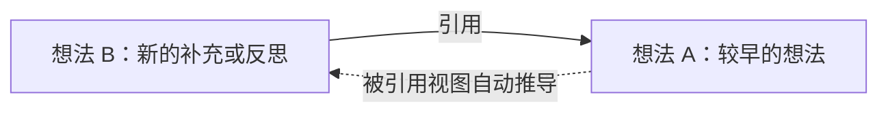

# Holo 想法双向引用与被引用方案

> 日期：2026-08-01
> 模块：想法（Thoughts）
> 状态：代码已实施，真机与 CloudKit 验收待完成
> 对标：[flomo「引用批注」](https://help.flomoapp.com/advance/thread.html)
> 前置方案：`2026-07-18-Holo观点编辑器行内标签与引用方案.md`
> 文档关系：本文不重做既有 `@` Token，而是补齐其目标侧可见性、目标侧发起入口、关系一致性与完整验收；涉及“反向引用”的实施口径以本文为准。

---

## 1. 产品结论

Holo 当前不是完全没有“被引用”的数据基础，而是**引用闭环没有成为用户可见、可操作的产品能力**。

推荐把 `@` 从“写新想法时插入一条旧想法”升级为一套双向关系体验：

1. 新想法主动 `@` 旧想法后，旧想法自动显示“后来哪些想法引用了我”。
2. 用户查看一条旧想法时，可以直接点“基于此继续写”，创建一条预置引用的新想法。
3. 想法卡片和详情页都能感知到关系存在，并能沿关系连续浏览。
4. 正向与反向只来自同一条关系，不维护两份容易失配的数据。

用户最终得到的不是一个“被引用列表”，而是一条可持续生长的想法脉络：旧想法不再只是被动存档，后续补充、反思、修正都能回到它身边。

---

## 2. 对 flomo 的理解与 Holo 取舍

flomo 的能力由三种建链入口和一个反向查看结果组成：

1. **快速引用**：在新 MEMO 中输入 `@`，搜索并插入旧 MEMO。
2. **批注**：从旧 MEMO 的菜单发起新 MEMO，输入框自动带上旧 MEMO 链接。
3. **复制 MEMO 链接**：将链接粘贴到另一条 MEMO 后建立关系。
4. **反向链接**：旧 MEMO 底部显示关联提示，可以查看后来引用它的 MEMO。

Holo 第一版建议吸收前两种入口和反向查看结果，暂不做“复制内部链接”：

| flomo 行为 | Holo 对应设计 | 本期 |
|---|---|---|
| 快速引用 | 保留现有行内 `@` 搜索与引用 Token | 沿用 |
| 批注 | 旧想法菜单新增“基于此继续写” | P0 |
| 反向链接 | 详情展示“后来引用这条想法的”列表 | P0 |
| 复制 MEMO 链接 | 依赖统一 Deep Link/剪贴板协议，单独立项 | 不做 |

不直接使用“批注”作为 Holo 文案。Holo 更强调想法生长，“基于此继续写”比“批注”更符合用户心智，也不会让用户误以为只能写评论。

---

## 3. 当前实现核验

### 3.1 已经具备的能力

- `ThoughtReference` 已表达 `sourceThought → targetThought`。
- `Thought.references` 是“这条想法引用了谁”。
- `Thought.referencedBy` 是 Core Data inverse relationship，表达“谁引用了这条想法”。
- `ThoughtEditorView` 保存 `@` Token 时，会生成 `ReferenceSnapshot` 并调用 `replaceReferences`。
- `ThoughtDetailView` 已有“引用”和“被引用”两个区块。
- 目标删除后，行内 Token 已有 `displayText/snapshot` 快照基础。

### 3.2 用户仍感知不到“被引用”的根因

1. **主路径绕开了详情页**
   `ThoughtListView` 点击卡片后直接打开 `ThoughtEditorView`，而“被引用”只存在于 `ThoughtDetailView`。正常浏览几乎到不了反向引用区。

2. **只能从新想法一侧发起**
   现有入口要求用户先新建想法，再想起要输入 `@` 搜索旧想法；旧想法本身没有“以它为起点继续写”的操作。

3. **关系在卡片上没有存在感**
   列表卡片不显示引用/被引用状态，用户无法知道某条想法已经形成连接。

4. **数据测试只覆盖了正向关系**
   现有 `ThoughtRichContentTests` 验证了 `source.references`，没有直接验证 `target.referencedBy`、重复引用去重、稳定排序和编辑后的反向关系变化。

5. **当前全删重建会丢失关系时间**
   每次编辑来源想法，`replaceReferences` 都删除并重建全部关系，导致未变化的引用也获得新的 `createdAt`；反向列表按“何时建立关系”排序时会失真。

因此本次不能只在详情底部再画一个列表；必须同时修正**入口、导航、展示和关系同步语义**。

---

## 4. 用户心智与关系定义

假设用户先写了想法 A，后来写想法 B，并在 B 中 `@A`：



- 在 B 看：A 是“这条想法引用的”。
- 在 A 看：B 是“后来引用这条想法的”。
- 这不是两条关系，也不是把 B 的内容复制回 A；只是同一条有方向的连接在两侧以不同视角展示。

允许 A 引用 B、B 也引用 A。想法关系是网络，不是目录树；不需要禁止环。

---

## 5. P0 产品交互

### 5.1 路径一：在新想法中 `@` 旧想法

保持现有行为：

1. 用户在新想法 B 中输入或点击 `@`。
2. 搜索并选择旧想法 A。
3. 编辑器插入不可拆分的引用 Token。
4. 保存 B 后建立 `B → A`。
5. A 的详情自动出现 B，不要求用户回到 A 手工确认。

补充规则：

- 同一条想法中多次 `@` 同一目标，正文可以保留多处 Token，但关系列表只记一条 `B → A`。
- 删除最后一个指向 A 的 Token 并保存后，A 的“被引用”列表移除 B。
- 未保存或取消编辑，不建立任何关系。
- 当前想法不能引用自己，沿用现有限制。

### 5.2 路径二：从旧想法发起“基于此继续写”

在想法详情右上角菜单与卡片更多菜单中新增：

> 基于此继续写

点击后：

1. 打开现有快速记录面板。
2. 自动在首行插入对当前想法 A 的引用 Token。
3. 光标定位到下一行，提示语为“写下新的补充、反思或延伸…”。
4. 用户保存后创建 B，并建立 `B → A`。
5. 用户可以删除预置 Token；删除后保存则只创建普通想法，不建立关系。

这个入口复用同一套编辑器和保存链路，不新建“批注实体”或“回复实体”。

### 5.3 想法列表：让关系可被发现

推荐调整主导航语义：

- **点击想法卡片正文：进入想法详情。**
- **编辑：保留在卡片更多菜单、滑动操作和详情右上角。**
- 有关系的卡片底部显示轻量关联提示，例如：`引用 1 · 被 3 条想法引用`。
- 没有任何关系时不显示空占位，避免列表噪音。
- 点击关联提示同样进入详情，并自动滚动到“关联想法”。

取舍：进入编辑比现在多一步，但换来稳定的阅读态、可见的被引用关系、任务来源和后续更多只读能力。Holo 已经存在详情页，当前“卡片点击直接编辑”反而让详情能力长期被架空。

### 5.4 想法详情：统一为“关联想法”

将当前分散的“引用”“被引用”收敛为一个关系区：

```text
关联想法  4

这条想法引用的（1）
└─ 关于标签体系的思考           7 月 18 日

后来引用这条想法的（3）
├─ 我重新理解了标签和主题的区别   今天
├─ Holo 编辑器应该保留上下文      7 月 29 日
└─ 第二轮复盘                     7 月 21 日

[ 基于此继续写 ]
```

交互规则：

- 两组都按“关系首次建立时间”倒序。
- 每张关联卡显示来源想法首行、2 行摘要、创建日期；整卡点击进入对应想法详情。
- 连续点击关系时使用同一条详情导航栈，返回能逐级回退，不叠加多层互不相干的 sheet。
- 如果只有一个方向有数据，只展示有数据的一组。
- 如果两组都为空，保留轻量 CTA“基于此继续写”，不展示两个空列表。
- 文案不用“反向链接”等技术词；标题使用“后来引用这条想法的”。

---

## 6. 数据与架构决策（ADR）

### ADR-1：复用单一 `ThoughtReference`，不新增 `referencedByIds`

**决策**
继续使用：

```text
ThoughtReference
sourceThought = B
targetThought = A
```

正向列表从 `sourceThought` 查询，反向列表从 `targetThought` 查询。`referencedBy` 只作为 Core Data inverse relationship，不作为第二份业务事实源。

**原因**

- 编辑、删除、恢复和 CloudKit 同步只需维护一条边。
- 不会发生“B 说引用 A，但 A 的数组里没有 B”的双写不一致。
- 当前模型已经具备，不需要新增实体或全量迁移。

**否决方案**
在 Thought 上新增 `[UUID]` 或 `referencedByJSON`。它会制造第二份引用事实，长期成本高于短期 UI 便利。

### ADR-2：按目标集合做差量同步，而不是全部删除重建

编辑器节点仍是最终事实源，但保存时改为集合对账：

1. 从当前 `HoloContentNode[]` 提取并按 `targetId` 去重。
2. 保留仍存在的旧关系及其 `id/createdAt`。
3. 新出现的目标才创建关系。
4. 已移除的目标才删除关系。
5. 更新现存关系的 `displayText/snapshot`，但不重置首次建链时间。

这样既保持“正文决定关系”的正确性，也保证反向列表排序不会因普通编辑被刷新。

### ADR-3：正文、结构化 Token、引用关系在同一事务保存

当前 `create/update` 与 `replaceReferences` 分别保存，存在中间态：正文已经保存，但关系保存失败；或关系变化成功但正文未一致更新。

本次将它们收敛为 repository 内的一次保存事务：

```text
ContentNode[]
  ├─ richContentJSON
  ├─ content / firstLine
  └─ deduplicated reference targets
             ↓
      同一个 context.save()
```

保存任一步失败时整体失败，UI 保持编辑态并提示重试。

### ADR-4：关系列表由 Repository 统一过滤、去重和排序

本期保持现有 `getReferences/getReferencedBy` 返回 `[Thought]` 的调用契约，内部共用一套关系处理规则：

- 按关联想法 ID 去重；
- 过滤软删除目标；
- 历史重复边以首次建链时间为准；
- 按首次建链时间倒序，ID 作为稳定兜底顺序。

这样不用为 P0 额外引入展示 DTO，也避免 View 直接依赖无序 `NSSet`。若后续需要展示关系时间、同步状态或不可用原因，再升级为 `ThoughtLinkSummary`。

---

## 7. 删除、恢复、同步与异常边界

| 场景 | 预期行为 |
|---|---|
| 来源想法 B 软删除 | A 的“后来引用”暂时隐藏 B |
| B 从回收站恢复 | A 再次显示 B，原关系时间不变 |
| 目标想法 A 软删除 | B 的行内引用显示“原记录已删除 + 快照” |
| A 恢复 | B 的引用恢复为可点击真实内容 |
| 同一来源多次引用 A | 正文可多 Token，关系列表只出现一次 |
| B 把 `@A` 改成 `@C` | A 移除 B，C 增加 B，同次保存完成 |
| A、B 互相引用 | 允许；两边分别显示一个正向和一个反向关系 |
| CloudKit 关系先到、目标后到 | 暂显“正在同步/暂时无法读取”，目标到达后刷新 |
| 目标永久清除 | 来源保留 Token 快照，不崩溃、不出现空白卡 |
| 保存失败 | 不退出编辑器，不产生半条关系 |

历史重复关系不做启动时全库重写。读取时先按 `(sourceId, targetId)` 去重；用户下次编辑该来源想法时，由差量同步顺手归一化，降低 CloudKit 写放大。

---

## 8. 非功能要求

- **隐私**：引用关系、标题和快照继续留在本地 Core Data 与用户自己的 iCloud 私有库；不新增后端上传、埋点或公开链接。
- **日志安全**：故障日志只记录 relation/thought ID 和错误类型，不输出想法正文、首行或快照。
- **性能**：详情页按需读取关系；列表关系数量应随列表 fetch 一并预取或批量计算，禁止每张卡片各自发起查询。
- **同步容错**：CloudKit 到达顺序不稳定时允许短暂 unavailable，但不能误显示为“原记录已删除”。
- **无障碍**：关系提示、方向分组和“基于此继续写”提供 VoiceOver label；不能只靠链条图标区分方向。
- **可维护性**：正向/反向过滤、去重和排序集中在 repository，不在多个 View 中复制规则。

---

## 9. 实施拆分

### P0-1：先保证关系真实

- `replaceReferences` 改为去重 + 差量对账，保留未变化关系的 `createdAt`。
- 将想法正文与关系保存收敛为同一 repository 事务。
- `getReferences/getReferencedBy` 共用同一套过滤、去重和稳定排序规则。
- 补 `target.referencedBy`、编辑移除、重复 Token、软删除/恢复、事务失败测试。

### P0-2：补齐旧想法发起入口

- `ThoughtDetailView` 与 `ThoughtCardView` 菜单新增“基于此继续写”。
- `ThoughtEditorView` 支持 `prefilledReferenceTarget`，复用快速记录面板。
- 预置 Token 通过 `HoloContentNode.reference` 注入，不拼接普通 `@文字`。
- 取消、删 Token、保存三条路径分别验收。

### P0-3：让被引用真正可见

- 卡片正文点击从直接编辑改为进入详情。
- 卡片增加非零关系提示。
- 详情页收敛为“关联想法”双分组，并显示数量、预览、时间。
- 引用 Token、关联卡和列表卡统一进入同一详情路由。
- 保存/删除/恢复后监听 `.thoughtDataDidChange` 刷新关系数量与列表。

### P1：体验增强

- 在“后来引用”卡片中高亮来源正文内 `@当前想法` 附近的上下文。
- 关系数量较大时支持“查看全部”和按引用时间筛选。
- 全局搜索增加“有引用 / 被引用”过滤条件。
- 统一 Holo 内部 Deep Link 后，再增加“复制想法链接”。

### P2：明确不与本期混做

- AI 自动推荐相关想法。
- 知识关系图/节点图谱。
- 段落级引用。
- 跨用户引用与公开链接。
- 评论线程、回复层级或引用内容双向同步。

---

## 10. 预计涉及文件

| 文件 | 改动 |
|---|---|
| `Data/Repositories/ThoughtRepository+RichContent.swift` | 引用去重、差量对账、事务化保存 |
| `Data/Repositories/ThoughtRepository.swift` | 统一正向/反向查询与稳定排序 |
| `Views/Thoughts/ThoughtListView.swift` | 阅读详情路由、编辑入口拆分、关系刷新 |
| `Views/Thoughts/ThoughtCardView.swift` | 关系提示、“基于此继续写”菜单 |
| `Views/Thoughts/ThoughtDetailView.swift` | “关联想法”双分组、继续写入口、统一导航 |
| `Views/Thoughts/ThoughtEditorView.swift` | 支持预置结构化引用 Token |
| `Views/Thoughts/Editor/*` | 仅在需要时补预置节点初始化，不重写现有 @ 逻辑 |
| `HoloTests/Services/AI/ThoughtRichContentTests.swift` | 引用双向与一致性测试 |
| `HoloTests/Views/Thoughts/*` | 路由/预置 Token/展示状态测试 |

本期是 iOS 本地数据与 UI 能力，不改 HoloBackend、不改 Prompt，因此不需要后端部署。

---

## 11. 验收场景

### 核心闭环

- [ ] 新建 B，在正文 `@A` 后保存；打开 A，能看到“后来引用这条想法的：B”。
- [ ] 从 A 点“基于此继续写”，编辑器预置 `@A`；保存 B 后，A 自动出现 B。
- [ ] 点击 A 的被引用卡 B，进入 B；返回后仍停留在 A 的详情位置。
- [ ] B 删除 `@A` 并保存，A 不再显示 B。
- [ ] B 中两次 `@A`，A 的被引用数量仍为 1。

### 数据与异常

- [ ] 普通编辑 B 但不改 `@A`，关系建立时间不变化，A 中排序不跳动。
- [ ] B 保存失败时不退出，不出现正文有引用但 A 看不到 B 的半完成状态。
- [ ] B 软删除后从 A 隐藏，恢复 B 后重新出现。
- [ ] A 删除后，B 的行内 Token 显示历史快照；恢复 A 后重新可点击。
- [ ] A 与 B 互相引用不死循环、不重复展示、不崩溃。
- [ ] iCloud 双设备上建链、删链、恢复后，两个方向最终一致。

### 体验回归

- [ ] 原有 `@` 搜索、Token 整删、中文输入法、Markdown、撤销/恢复行为无回归。
- [ ] 卡片新增关系提示后，长列表滚动无明显掉帧。
- [ ] 卡片点击进入详情后，编辑、归档、移入主题、删除仍有明确入口。
- [ ] 快速记录面板当前未提交改造不被覆盖，预置引用走同一组件扩展。

---

## 12. 上线口径

本功能应作为现有 `@` 能力的完整性补齐，不单独做会员门槛。它不新增服务端成本，也不应让用户付费才能看到自己已经建立的关系。未来若增加 AI 相关想法推荐或关系图，可再单独评估 Plus 权益。

上线前必须同时满足：

1. 双向关系核心测试通过。
2. iOS 全工程 build 通过。
3. 真机手动完成“新想法引用旧想法”和“旧想法发起继续写”两条路径。
4. 至少两台设备验证一次 CloudKit 建链与删链同步。

---

## 13. 最终产品口径

> 在 Holo 里，引用不是把旧想法搬到新想法中，而是建立一条能从两边看见的连接。你既能在新想法中引用过去，也能从过去的想法出发继续写；每一次后续思考，都会自动回到它所延续的那条旧想法下面。

---

## 14. 2026-08-01 实施记录

### 已完成

- 卡片主点击由直接编辑调整为进入阅读详情；编辑保留在更多菜单。
- 卡片展示有方向的 `引用 N · 被引用 M`，无关系时不占位。
- 详情页统一展示“这条想法引用的”和“后来引用这条想法的”，并提供“基于此继续写”。
- 卡片菜单、长按菜单、详情菜单和详情关系区均可从旧想法发起继续写。
- 快速记录面板会预置真实引用 Token 并将光标放到下一行；取消不建链，保存才建链。
- 正文、富文本 JSON 与引用关系由同一次 `context.save()` 提交，避免半完成状态。
- 引用关系改为差量同步：重复目标去重，未变化关系保留 `id/createdAt`，移除与新增同次完成。
- 正向和反向读取统一过滤软删除数据、去重并按首次建链时间稳定排序。
- 详情监听数据变化通知，新想法保存后会立即刷新反向列表。
- 补充双向、重复引用、关系身份保留和创建事务的 XCTest 用例。

### 当前验证结果

- iOS Simulator 主 App 全工程 build 通过。
- `git diff --check` 与本次 Swift 文件语法检查通过。
- 定向 XCTest 已发起，但现有 `HoloTests` target 会同时编译仓库内多份 standalone `@main` 测试和缺失 Agent 类型，测试在进入本用例前被既有工程配置阻断；不能据此宣称自动化测试已执行通过。

### 交给产品验收的边界

- 需要真机手动走完本章“核心闭环”两条路径。
- CloudKit 双设备建链、删链、软删除与恢复仍需真实设备验证。
- 关联卡当前沿用详情页既有 sheet 路由，返回后能停留在原详情；“所有关联详情共用单一 NavigationStack”可在后续统一想法路由时收口，不阻塞本期双向引用闭环。

---

## 15. 2026-08-01 首轮验收返修

### 现场问题

从旧想法发起“基于此继续写”后，预置引用在快速记录面板中重复出现三次，长标题换行，并与占位提示叠加。该状态不可使用，首轮不应交付。

### 根因与修复

- 根因：预置引用被实现为 `updateUIView` 阶段消费的一次性编辑命令；SwiftUI 因键盘聚焦、面板高度与状态同步连续刷新时，同一命令可能在绑定清空生效前被重复执行。
- 修复：预置引用改为 `ThoughtEditorView` 初始化时直接生成唯一的结构化节点 `[reference, newline]`，不再经过一次性命令注入。
- 展示：预置引用标题单独限制为 14 个字符并加省略号，保证快速记录面板内保持单行。
- 状态：正文绑定、节点数组和 `richContentJSON` 从初始化开始一致，占位提示立即隐藏，光标直接落在引用后的新行。

### 实际界面回归

- 使用 Simulator 创建长标题测试想法并进入“基于此继续写”。
- 初始画面只有一条短引用，无占位叠加，光标位于下一行。
- 主动弹出软件键盘触发布局刷新后，引用仍为一条。
- 输入后保存，目标详情显示“后来引用这条想法的（1）”。
- 主 App 全工程 build、相关 Swift 语法检查和 `git diff --check` 均通过。
