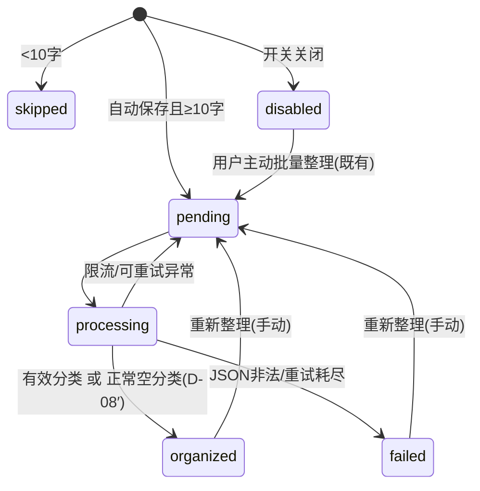

# 想法智能标签端侧治理——P0/P1/P2 实施方案（对抗审查定稿 + 三拍板落定）

> **版本**：v1.1
> **日期**：2026-08-16
> **状态**：待东林 review 后进入研发
> **上游输入**：《Holo「想法」模块 AI 自动标签与智能分类调研报告》（Manus，2026-08-16）、《PRD｜Holo「想法」模块端侧智能标签与主题治理升级》（2026-08-16）、release/1.0.0 分支《想法模块向量化与关联推荐-技术方案 V3.0》（历史教训）
> **代码基线**：main 分支（所有「现状事实」已逐项对照代码核实，见 §2）

| 版本 | 变更 |
|---|---|
| v1.0 | 三轮对抗审查定稿（20 项发现已修复） |
| v1.1 | 东林三拍板落定：①治理设置统一收口知识树；②合理率门槛授权（维持 60%）；③ **embedding 语义候选召回纳入本期（P2），解除「零后端改动」约束，P2 需一次后端发版** |

---

## 0. 一页摘要

**目标**：把现有「AI 打完标签直接展示」的一次性结果，升级为「分级呈现 + 可恢复 + 可治理 + 语义候选增强」的闭环；向量只做候选召回、永不直接决定用户可见结果（V1/V2 失败教训）。

**本期批次**：

| 批次 | 内容 | 后端 | 新实体/表 |
|---|---|---|---|
| P0 | 端侧建议分级、空结果不再误报失败、单条重新整理、拒绝范围拆分 | 无 | 无 |
| P1 | 知识树「整理设置」页（含开关迁移）+ 标签治理页 + 分类反馈事件（本机 JSON） | 无 | 无（JSON 文件） |
| P2 | embedding 语义候选召回：后端 embedding 通道 + 本地向量缓存 + Top-5 近邻标签注入 + 标注评估 Gate | **一次发版**（新增 purpose + prompt 更新） | 无（向量存本机 JSON） |

**P2 上线 Gate（数值化）**：东林标注 40 条真实想法的「可接受标签 Top-3」→ 离线对比「加语义候选前后候选池 Top-3 覆盖率」，**提升 ≥10 个百分点才开注入；否则永久关闭向量候选源**（V3 §5.4 原话移植，不换模型碰运气）。

**工期估算**：P0 约 3.5-4 人日；P1 约 2.5 人日；P2 约 3.5 人日 + 东林标注 0.5 天；合计约 10 人日。

---

## 1. 三轮对抗审查结论（20 项发现，3 高 / 9 中 / 8 低）

### 1.1 高严重度（不修复则方案不成立）

**H-1｜FR-02 是空中楼阁：空结果在 JSON 解析层就被拦截，到不了分类逻辑。**
代码事实：`ThoughtOrganizationService` 的 parse 阶段（约 250-259 行）要求 `suggestedTags` 非空，空数组直接走「JSON 解析失败 → 重试 → failed」。
**修复**：parse 放宽为允许 `suggestedTags == []`（字段必须存在、类型合法）；空数组走新的空结果分支（§3.2 FR-02′）。

**H-2｜D-06/D-07 的「标签置信度 ≥0.80」输入不存在。**
AI 响应只有一个 `confidence`（语义为主题归属置信度），标签没有独立置信度。
**修复**：标签层分流只看「是否全部复用用户认可标签」；主题层沿用现有 0.75 阈值不动。

**H-3｜动工前置：工作区 30+ 未提交修改（其他会话半成品）；测试 target 历史上出过跑不了的情况。**
**修复**：§8 前置条件——工作区先落盘/隔离；`xcodebuild test` 在 HEAD 验证可跑。

### 1.2 中严重度（修复已并入正文）

| 编号 | 发现 | 修复（落入章节） |
|---|---|---|
| M-1 | `enqueueBatch` 无条件重置 `dailyLimitHit`（当日配额暂停解锁）——单条重试复用它会导致连点重试反复解锁、持续撞 429 | §3.2 FR-05′：新增 `enqueueManual(thoughtId:)`，不重置 dailyLimitHit |
| M-2 | PRD 附录 A 遗漏编辑器内第二处拒绝入口（`ThoughtEditorView.swift:733`） | §3.2 FR-06′ 改动文件补入，三处调用点全覆盖 |
| M-3 | thought_organization 无专属配额桶，受全局 chat 限流（默认 20/分、50/天） | 文案改「今日 AI 额度已用尽」；手动重试加节流；列观察指标 |
| M-4 | 反馈事件若新增 Core Data 实体，违反快速回滚原则且有 CloudKit schema 风险 | §4.3：本机派生 JSON（学 V3 `ThoughtRelationCacheStore` 范式） |
| M-5 | 卡片「等待确认」逐张判定需防列表 N+1 查询 | §3.2 FR-04′：展示模型预计算 `pendingConfirmation`，随现有预取路径一次算好 |
| M-6 | chip「×」语义从「全局抑制」变「仅本条」，旧入口可发现性风险 | §5.4 拒绝三入口 + chip 长按放「以后不要推荐」；灰度观察使用率 |
| M-7 | 上线门槛原无数值 | §7.2 数值化（含 P2 Gate） |
| M-8 | 灰度无服务端 flag 通道，kill switch 只能发版回退 | §7.1 灰度=发版节奏，flag 是回滚手段 |
| M-9 | skipped（<10 字）想法显示重试入口会空转 | §3.2 FR-05′：skipped 不显示入口 |

### 1.3 低严重度（确认不改或实现细节）

| 编号 | 发现 | 处理 |
|---|---|---|
| L-1 | 空主题不触发 failed（`ThoughtThemeConstraint` 以「未分类」前缀兜底） | 现状正确，PRD 表述已修正 |
| L-2 | `replaceUnconfirmedAITagAssignments` 空数组=只删不建 | FR-02′ 直接复用 |
| L-3 | 重试期间旧 ai 标签保留展示，写入时自然替换 | 采纳：US-04 AC-03 修正为不提前清理 |
| L-4 | Core Data 实体为代码构建（`CoreDataStack+ThoughtEntities.swift`），非 xcdatamodeld；Swift 文件经 PBXFileSystemSynchronizedRootGroup 自动入 target | 实现要点（本期不新增实体） |
| L-5 | 已存在近似实体 `ThoughtTagConvergenceRejection` | 未来 P2+ 设计时对齐其范式 |
| L-6 | 「等待确认」长期不处理会堆积 | 弱视觉（无红点无数字）+ 筛选器；不自动清除 |
| L-7 | chip 内嵌按钮 10pt 字号在动态字体下命中区域 | 既有问题，本期不重构，验收不回归 |
| L-8 | disabled 用户存量队列会处理完剩余 pending | 边缘可接受 |

### 1.4 审查结论

PRD 的 13 项「现有能力」引用经代码逐项核对：10 项属实、3 项有出入（均已修复）。v1.1 起 P2 纳入本期，后端发版依赖见 §8。

---

## 2. 现状事实基线（已逐项核实，研发以本节为准）

| 事实 | 位置 | 数值/行为 |
|---|---|---|
| 空结果行为 | `ThoughtOrganizationService.swift` 113-117 | `tagPaths` 为空 → `failed`；parse 层已拦截空 `suggestedTags` |
| 队列开关 | `ThoughtOrganizationQueue.swift` 59-63 | `enqueue` 受 `isThoughtAutoOrganizationEnabled` 拦截；`enqueueBatch` 不受拦截但重置 `dailyLimitHit` |
| 队列节奏 | 同上 33-37 | 串行单并发；条目间隔 4s；退避 5/30/120s 共 3 次 |
| 配额 | 后端 `app.js`/`config.js` | 全局 20/分、50/天（.env 可覆盖）；429 → 当日暂停、次日续做 |
| 标签来源 | `ThoughtTagAssignment.Source` | manual / inline / confirmedAI / ai / rejectedAI + confidence/assignedAt/rejectedAt |
| 拒绝现状 | `rejectAndRecord` 153-161 | 拒绝同时写 UserDefaults 全局抑制（50 条/90 天）；调用点三处：DetailView 591、EditorView 733 |
| 请求上下文 | `buildOrganizationPayload` 281-300 | activeTopics/existingTags/recentAITags/rejectedTags/thoughtContent；purpose=`thought_organization` |
| 主题阈值 | `ThoughtRepository.swift` 841 | `topicConfirmationThreshold = 0.75` |
| 查询口径 | `ThoughtRepository.swift` 528-577 | `fetchUserRecognizedTagNames(60)`＝{manual,inline,confirmedAI}；`fetchUnrecognizedAITagNames(40)` |
| 短文本 | `ThoughtAIClassificationPolicy.swift` 19-22 | <10 字 → `skipped`；批量终态集合含 skipped |
| 批量整理 | `markBatchPending` 1178-1192 | 入口：ThoughtListView「自动整理」chip、TopicManagementView |
| 自动整理开关 UI | `SettingsView.swift` 480-529 | 目前在系统设置页（P1 迁移至知识树，见 §4.1） |
| 知识树结构 | `ThoughtKnowledgeTreeView.swift`（427 行） | 子视图形态：AI 状态条 + 主题卡片墙 + 未归类/发现/归档行；无设置入口（P1 新增） |
| 卡片状态 | `ThoughtCardView.swift` 133-147 | 已入主题 → 整理中 → 整理失败 → 已整理 → 待整理 |
| 后端 providers | `HoloBackend/src/providers/` | 仅 ASR（DashScope）/mock/openAICompatible；**无 embedding 通道**；QWEN baseURL 已配 DashScope compatible-mode + key |
| 后端路由 | `config.js` 34-183 | purpose→model 环境变量映射（`HOLO_*_MODEL`） |
| 测试基线 | `HoloTests/Services/AI/` 等 | PRD 附录 B 的 7 个测试文件全部存在 |

---

## 3. P0 工作包（端侧建议分级与可恢复性）

### 3.1 分级决策规则（修订版，替换 PRD §3.3）

阈值集中在新增策略文件中，禁止散落 View/Repository。

| 规则 | 条件 | 处理 |
|---|---|---|
| D-01 | 自动整理关闭 | `disabled`，不入队 |
| D-02 | 正文 <10 字 | `skipped` |
| D-03 | 有效主题且 `confidence ≥ 0.75` | 写入主题；卡片「已入主题」 |
| D-04 | 有效主题且 `0 < confidence < 0.75` | 写入主题 + 进现有待确认池 |
| D-05 | 无有效主题 | 保持未分类（`未分类` 前缀路径照旧）；不算失败 |
| D-06′ | AI 标签**全部**为用户认可标签 | 写为 `ai`；弱提示展示 |
| D-07′ | AI 标签**含新标签**（不在认可集合） | 写为 `ai`；详情「待确认标签」；卡片「等待确认」 |
| D-08′ | 调用成功但有效标签为空 | 清空旧未确认 AI 标签，写 `organized`，保持未分类（前置：parse 允许空数组） |
| D-09 | 网络/限流/空响应/JSON 非法 | 现有重试链路；最终 `failed` |

### 3.2 P0 任务分解（文件级）

| ID | 任务 | 改动文件 | 要点 |
|---|---|---|---|
| FR-01′ | 分类展示策略 | 新增 `Services/AI/ThoughtOrganizationPresentationPolicy.swift` | 纯函数：输入 organizedStatus/confidence/建议标签/认可标签集合 → `weakHint / pendingConfirmation / silent`；单测覆盖 D-03~D-08′ |
| FR-02′ | 空结果不算失败 | `ThoughtOrganizationService.swift` | ① parse 允许 `suggestedTags == []`；② 空结果分支：`replaceUnconfirmedAITagAssignments([], …)` 清旧 → 主题照 D-05 → 写 `organized` |
| FR-03′ | 详情页 AI 分层 | `ThoughtDetailView.swift` | 三态标题：`AI 建议`/`待确认标签`/`AI 整理`（空结果文案）；chip ✓ 确认、× 仅本条；长按 chip 含「以后不要推荐」 |
| FR-04′ | 卡片状态 | `ThoughtCardView.swift`、`ThoughtTagPresentation.swift` | 新增「等待确认」（优先级在「整理中」后、「整理失败」前）；`pendingConfirmation` 预计算防 N+1；标签 ≤3 个 |
| FR-05′ | 单条重新整理 | `ThoughtOrganizationQueue.swift`（新增 `enqueueManual`）、`ThoughtDetailView.swift` | 不重置 `dailyLimitHit`；不提前清理 assignment（写入时自然替换）；skipped 不显示入口；按钮节流；文案「今日 AI 额度已用尽」 |
| FR-06′ | 拒绝范围拆分 | `ThoughtOrganizationService.swift`、`ThoughtDetailView.swift`、`ThoughtEditorView.swift` | 新增 `rejectAssignmentCurrentOnly`（仅 rejectedAI + rejectedAt，不动 UserDefaults）；全局抑制专用 `rejectAndRecord` 仅「以后不要推荐」调用；三处调用点全覆盖 |

### 3.3 状态机



---

## 4. P1 工作包（知识树设置 + 标签治理 + 反馈事件）

### 4.1 知识树「整理设置」页（东林拍板：统一设置收口）

**拍板内容**：想法模块的 AI 整理相关设置，后续统一放知识树的设置入口，不再分散。

| ID | 任务 | 改动文件 | 要点 |
|---|---|---|---|
| FR-07′ | 知识树整理设置页 | 新增 `Views/Thoughts/ThoughtOrganizationSettingsView.swift`；`ThoughtKnowledgeTreeView.swift` 加入口（建议放 `aiStatusBar` 区域或归档行下新增「整理设置」行，sheet 呈现） | 内容：① 自动整理开关（`@AppStorage` 直连 `isThoughtAutoOrganizationEnabled`）+ 关闭后仍可手动整理的说明；② 标签治理页入口；③ （P2 后）语义增强开关 |
| FR-08′ | 开关迁移 | `SettingsView.swift` 480-529 | **删除**系统设置里的想法整理区块（一处事实源，避免双 Toggle 状态漂移）；发布说明注明位置变化 |

> 回归自查（旧操作→新入口）：设置页找开关的用户 → 知识树设置页。知识树入口在想法页顶部「时间流|知识树」切换内，属一级可达，不降级。

### 4.2 标签治理页（FR-09′）

- 新增 `Views/Thoughts/ThoughtTagManagementView.swift`：「我的标签 / AI 建议」分段；
- AI 建议分组复用 `fetchUnrecognizedAITagNames` 口径；动作四件套：确认采用 / 改名后采用 / 合并到已有 / 全局删除（复用 `ThoughtRepository+TagManagement`）；
- 批量动作先展示受影响想法数；删除前二次确认；
- **入口：知识树整理设置页**（拍板落定）。

### 4.3 分类反馈事件（调研报告 §5.4，按 M-4 修订为本机 JSON）

**为什么**：V2 失败主因之一是没有真实反馈数据、被迫用合成数据评估。反馈事件是 P2 语义候选评估和一切未来算法升级的验收地基。

**设计**：新增 `Services/AI/ThoughtClassificationFeedbackStore.swift`（actor），Application Support 下受数据保护 JSON：

```swift
struct ThoughtClassificationFeedbackEvent: Codable, Sendable {
    let id: UUID
    let thoughtId: UUID
    let tagKey: String            // normalizedKey
    let action: String            // confirm / rejectCurrent / suppressGlobal / rename / merge / topicConfirm / topicChange / retry
    let wasRecognizedTag: Bool
    let topicConfidence: Double?
    let semanticCandidatesUsed: Bool   // P2：本次建议是否注入了语义候选
    let occurredAt: Date
    let policyVersion: Int        // FR-01′ 策略版本，从 1 起
}
```

**规则**：上限 2,000 条 LRU；本机存储、不进 Core Data/CloudKit、不外发；`Logger` 结构化同步记录；Debug 聚合视图（确认率/拒绝率/新标签确认率/按标签分组）放知识树整理设置页的 Debug 区（Release 隐藏，沿用 AI 记忆实验室的 Release 隔离范式）。

**打点时机**：确认/两种拒绝/改名/合并/主题确认/主题手动更换/重新整理，共 8 类。

### 4.4 P1 其余项

- 设置说明文案（关闭后不自动请求、仍可手动整理）；
- 筛选器：「待确认 / 未归类 / 整理失败」（`ThoughtFilterSheetView`/`ThoughtListView`）。

---

## 5. P2 工作包（embedding 语义候选召回·本期新增，东林拍板）

### 5.1 架构与数据流（V3 教训全量适用：向量只做候选，不做判断）

```text
想法保存 → 既有分类链路（P0 分级）→ 分类成功后
    ↓（后台、限速）
embedding 生成：contentHash 未变则跳过 → 调后端 thought_embedding → 向量存本机 JSON
    ↓
后续任意想法分类时（组装 payload 前）：
    当前想法 embedding × 历史 embedding 端侧余弦 → Top-5 近邻想法
    → 取近邻想法的认可标签（manual/inline/confirmedAI）去重 ≤8 个
    → payload 新增 semanticNeighborTags 字段 → LLM 最终判断（既有链路）
    → 端侧校验（既有）→ P0 分级呈现（既有）
```

**明确边界（ADR 级，沿用 V3 ADR-001/002）**：
- 向量结果**永不**直接成为用户可见标签/主题；只作为 prompt 候选池输入，最终判断仍在受控 LLM + 端侧白名单校验；
- 不引入任何向量数据库；千条规模端侧暴力扫描余弦（<10ms 量级），向量存本机 JSON（thoughtId + contentHash + modelVersion + vectorData，学 V3 缓存范式）；
- 换 embedding 模型 ≠ 重试：modelVersion 变更触发全量重算；召回不达标即永久关闭，不换模型碰运气。

### 5.2 后端改动（**需要一次发版**，按协作约定向东林声明）

| 项 | 内容 |
|---|---|
| 新 purpose | `thought_embedding`：`config.js` 新增 purpose 配置（模型默认通义 `text-embedding-v3`，走既有 QWEN baseURL 的 DashScope compatible-mode `/embeddings` 端点；`openAICompatibleProvider` 增加 embeddings 方法）；独立限流（建议 120/天、20/分钟，避免吃全局 chat 配额） |
| prompt 更新 | `thought_organization` 的 prompt 增加 `semanticNeighborTags` 可选字段说明：「若提供，优先从中复用」；**字段可选、旧客户端不传不受影响（向后兼容）**；双端同步 `promptVersions` +1，走 `holo-backend-deploy` 流程 |
| 日志 | 服务端不记录正文与向量内容 |

### 5.3 客户端改动

| ID | 任务 | 改动文件 | 要点 |
|---|---|---|---|
| FR-10′ | 向量存储 | 新增 `Services/AI/ThoughtEmbeddingStore.swift`（actor） | 本机 JSON；contentHash 去重；modelVersion 隔离；LRU 上限（建议 5,000 条，纯向量约几 MB）；文件损坏丢弃重建 |
| FR-11′ | 生成链路 | `ThoughtOrganizationService.swift` | 分类成功后按 hash 判断是否需要生成 embedding，走独立低优先级队列（限速 ≤6/分钟，复用队列退避范式但不占分类队列并发）；失败静默重试、不阻塞分类 |
| FR-12′ | 候选召回 | `ThoughtOrganizationService.swift`（payload 组装处） | flag 三档：`off`（不计算）/ `shadow`（计算并记录候选与分数，**不注入** payload）/ `inject`（注入 `semanticNeighborTags` ≤8 个）；端侧余弦 Top-5 邻居 → 邻居认可标签；自身排除 |
| FR-13′ | 存量回填 | 新增回填任务（App 空闲/充电时后台分批） | 只回填有认可标签或已 organized 的想法；每批 ≤20 条；可在知识树整理设置页手动触发（Debug 区） |
| FR-14′ | 注入与观测 | `buildOrganizationPayload` + 反馈事件 | 注入时记录候选清单与近邻距离；反馈事件 `semanticCandidatesUsed` 标记，用于对比注入前后的确认率 |

### 5.4 评估 Gate（P2 上线门槛，不达标永久关闭）

**步骤**：

1. **标注**（东林本人，约 0.5 天）：从真实想法分层抽 40 条（覆盖短句/长文/中英混排/#标签/不同主题），每条标「可接受标签 Top-3」（允许空=该条本就不该有标签）。提供标注辅助页（Debug 区导出，逐条展示想法正文 + 候选池，勾选可接受标签）。
2. **离线评估**（不真调 LLM，评估候选池本身）：对 40 条分别计算——
   - 基线覆盖率：标注标签 ∈ {existingTags ∪ recentAITags} 的比例（Top-3 口径）；
   - 增强覆盖率：标注标签 ∈ 基线 ∪ {semanticNeighborTags} 的比例；
   - **判据：增强 − 基线 ≥ 10 个百分点 → 允许开 `inject` 灰度；否则永久关闭向量候选源**（代码保留 flag 死态，写 ADR 记录）。
3. **inject 后真实验证**：内部账号试用 ≥2 周，对比 `semanticCandidatesUsed=true/false` 两组的标签确认率（反馈事件已带该字段）；确认率无提升或下降 → 关回 shadow 复盘。

**明确不做**：不在本期做标签原型向量聚合（TagPrototype）、BGE-M3 自托管（2.27GB 不入 iOS 包）、服务端向量库（触发条件沿用 V3 §4.1：P95 想法量 >10,000 且本地扫描 >300ms 且向量已被证明有增益）。

### 5.5 隐私

- embedding 请求只发想法正文（与现有 thought_organization 同边界，不新增数据类型）；
- 向量只存本机，不进 CloudKit、不外发；删除账户数据时同步清除；
- 服务端日志无正文无向量。

---

## 6. 交互规范（继承 PRD + 修订）

### 6.1 卡片状态（修订后优先级链）

`已入主题 → 整理中 → 等待确认（新增） → 整理失败 → 已整理 → 未归类 → 待整理`

| 状态 | 文案/颜色 | 标签呈现 |
|---|---|---|
| 整理中 | 「AI 整理中」中性色+sparkle | 不展示未完成 AI 标签 |
| 已入主题/已整理 | 现有文案 | 手动标签正常色；AI 建议灰色角标 |
| 等待确认 | 「等待确认」中性色（非红色、无红点数字） | AI 角标标签 ≤2 个 |
| 未归类 | 「未归类」中性色 | 无空占位 |
| 整理失败 | 「整理失败」唯一警示色 | 保留已有标签 |

### 6.2 详情页三区与拒绝三入口

主题/标签/AI 归类三区沿用 PRD §5.3（含「放这里/更换/保持未分类」「重新整理」）。

| 操作 | 入口 | 数据效果 |
|---|---|---|
| 不适合这条（默认） | chip ×（详情页 + 编辑器一致） | rejectedAI，不写全局抑制 |
| 以后不要推荐 | chip 长按菜单 | rejectedAI + 全局抑制（50 条/90 天） |
| 保留标签 | chip ✓ | confirmedAI，进认可池 |

### 6.3 文案原则

AI 建议 ≠ 已归档完成；未分类 ≠ 失败；标签只显叶子词；配额文案「今日 AI 额度已用尽」。

---

## 7. 测试计划

| 层级 | 文件 | 必测场景 |
|---|---|---|
| 策略单测（新增） | `ThoughtOrganizationPresentationPolicyTests.swift` | D-03~D-08′ 全分支 |
| Service 测试 | 扩展 `ThoughtOrganizationBatchTests.swift` | 空标签写 organized 且清旧 ai；parse 允许空数组；非法 JSON 仍 failed；重试后旧 ai 替换、manual/inline/confirmedAI 保留；shadow 模式 payload 不含新字段；inject 模式含 ≤8 个候选且自身排除 |
| 拒绝语义测试 | 扩展 `ThoughtRepositoryAITagBucketTests.swift` | 仅本条拒绝：全局抑制池不变；全局抑制：进 rejectedTags |
| Queue 测试 | 扩展现有 | `enqueueManual` 开关关闭可用；连点去重；429 后不解锁当日暂停；embedding 生成队列限速与独立退避 |
| 反馈事件测试（P1） | 新增 `ThoughtClassificationFeedbackStoreTests.swift` | 8 类打点字段完整（含 semanticCandidatesUsed）；2000 条 LRU；损坏重建 |
| 向量存储测试（P2） | 新增 `ThoughtEmbeddingStoreTests.swift` | contentHash 去重；modelVersion 隔离；LRU；损坏重建；自身排除 |
| 召回测试（P2） | 新增 `ThoughtSemanticCandidateTests.swift` | Top-5 邻居→认可标签映射；去重上限 8；无向量时降级为基线候选；被拒标签不进候选 |
| 治理页测试（P1） | 扩展 `ThoughtRepositoryTagManagementTests.swift` | 批量动作幂等；受影响计数正确 |
| 后端测试（P2） | HoloBackend `npm test` 新增用例 | embedding purpose 路由与限流；prompt 向后兼容（无 semanticNeighborTags 字段时行为不变）；promptVersions 校验 |
| UI 走查 | 人工（按操作路径走查，含嵌套 Button/sheet 生命周期） | 卡片六态、详情三态、三入口拒绝、重试、知识树设置页、治理页、VoiceOver |
| 回归 | 全量 Thoughts + AI 相关测试 | 转任务、#标签、主题收敛、知识树、批量整理不回归；系统设置页删除想法区块后编译与导航正常 |

---

## 8. 灰度、观察、门槛与依赖

### 8.1 灰度与回滚

| 阶段 | 人群 | 内容 | 回滚 |
|---|---|---|---|
| 内部验证 | 内部账号 | P0+P1 全开；P2 处 shadow | 关本地 flag |
| TestFlight ≥7 天 | 自愿用户 | P0 全量、P1 治理页；P2 视 Gate 结果开 inject 或保持 shadow | 同上 |
| 正式发布 | 全量 | 按 TestFlight 数据决定 P2 inject 范围 | flag 关闭即回退；**不删除任何已写入 assignment/Topic**；向量/事件文件可延后清理 |

Feature Flag（本地，默认 false/off）：`thoughtAI.presentationV2.enabled`、`thoughtAI.retry.enabled`、`thoughtAI.currentOnlyReject.enabled`、`thoughtAI.globalSuppress.enabled`、`thoughtAI.tagManagementV2.enabled`、`thoughtAI.semanticCandidates.mode = off|shadow|inject`。
灰度放量靠发版节奏（无服务端 flag 通道）；flag 是回滚手段。

### 8.2 上线验收门槛（数值化）

**P0/P1 Go 条件**：

1. 内部试用 ≥30 条真实想法（覆盖短句/长文/中英混排/#标签），人工复核**建议合理率（可接受标签出现在建议中）≥60%**（东林授权自定：60% 为首轮经验值——本质是挡住明显不合格，不是精确卡线；上线后用反馈事件的真实接受率校准）；
2. 「等待确认」「未归类」零红色失败误报（走查截图留证）；
3. 重新整理前后 manual/inline/confirmedAI 数量不变（自动化断言）；
4. 全量既有 + 新增测试通过；TestFlight 无 P0/P1；
5. 反馈事件能产出确认率/拒绝率聚合。

**P2 Go 条件（§5.4 Gate）**：40 条标注集上语义候选使候选池 Top-3 覆盖率提升 ≥10pp → 开 inject 灰度；inject 后 ≥2 周真实确认率不劣于 shadow。任一不满足 → 永久关闭向量候选源并写 ADR。

### 8.3 观察指标（反馈事件 + assignment 本地可算）

建议覆盖率、标签接受率、新标签确认率、主题待确认转正率、未分类比例、技术失败率、「以后不要推荐」使用率、手动重试频率（配额冲击）、P2 注入组 vs 对照组确认率。

### 8.4 依赖声明（协作约定）

- **P0/P1：零后端改动、零发版**；
- **P2：需要一次后端发版**（新增 `thought_embedding` purpose + `thought_organization` prompt 可选字段 + 双端 promptVersions 提升），走 `holo-backend-deploy` 流程，发版后 `/v1/prompts/meta` 与真实请求验证；**iOS 端 P2 功能依赖后端先发版**；
- 后端新增独立限流配置需在 ECS `.env` 增加（注意 .env 不写中文注释——历史坑）。

### 8.5 前置条件（动工前逐项确认）

- [ ] 工作区干净：30+ 未提交修改先落盘或隔离（独立 worktree）；
- [ ] `xcodebuild test` 在 HEAD 可跑；
- [ ] PRD 原文归档入库（现仅在 ~/Downloads，随本方案存 `docs/thoughts/` 备查）。

### 8.6 风险表

| 风险 | 信号 | 处理 |
|---|---|---|
| 空结果分支放宽后模型总返回空 | 空结果占比突增 | 观察指标；必要时后端 prompt 收紧（届时才需发版） |
| 手动重试/embedding 回填消耗配额 | 429 频发 | embedding 独立限流桶；回填限速；按钮节流 |
| 语义候选无增益（Gate 不过） | 覆盖率提升 <10pp | 永久关闭，写 ADR；不影响 P0/P1 已上线价值 |
| 语义候选引入噪声标签 | inject 后确认率下降 | 关回 shadow 复盘；候选上限与距离阈值收紧 |
| 状态文案改动引起存量误判 | 旧数据异常 | 不改状态字符串常量，仅改呈现层 |
| 设置入口迁移找不到 | 用户反馈 | 发布说明注明；知识树入口一级可达 |

---

## 9. 拍板记录（2026-08-16，东林）

| 决策 | 结论 | 落点 |
|---|---|---|
| 标签治理/整理设置入口 | **知识树内做统一设置，后续想法 AI 设置都收口这里** | §4.1（含系统设置开关迁移） |
| 建议合理率门槛 | **授权自定** | 定 60%（首轮经验值，上线后按真实接受率校准） |
| embedding 排期 | **本期做（有时间窗口）** | §5 P2 工作包 + §5.4 Gate |

---

## 10. 实施顺序与工期

| 顺序 | 工作包 | 交付物 | 估算 |
|---|---|---|---|
| 0 | 前置条件核验 | 工作区隔离 + 测试可跑 + PRD 归档 | 0.5d |
| 1 | FR-01′ 策略 + 单测 | `ThoughtOrganizationPresentationPolicy` | 0.5d |
| 2 | FR-02′/05′/06′ | Service/Queue/Repository 接口 + 单测 | 1d |
| 3 | FR-03′/04′ UI + 走查 | 详情三态/卡片六态/三入口拒绝 | 1d |
| 4 | P1 设置页 + 治理页 + 反馈事件 | FR-07′~09′ + Store + 单测 | 2.5d |
| 5 | P0+P1 回归 + 内部灰度 | 全量测试 + flag + 30 条样本复核 | 0.5-1d |
| 6 | P2 后端 | purpose + prompt + 测试 + 发版 | 1d |
| 7 | P2 客户端 | EmbeddingStore + 生成链路 + 召回 + 回填 | 1.5d |
| 8 | P2 标注与评估 | 标注辅助页 + 40 条标注（东林 0.5d）+ 离线评估 + Gate 结论 | 1d |

P0 约 3.5-4d；P0+P1 约 6.5d；**全期约 10d**；后端发版在顺序 6（iOS P2 功能依赖其先行）。

---

## 附录 A：与上游文档的差异清单（本方案为准）

| 上游主张 | 本方案 | 原因 |
|---|---|---|
| PRD D-06/D-07 标签置信 ≥0.80 分流 | 删除阈值，纯新旧标签分流 | H-2：标签级置信度不存在 |
| PRD US-04 AC-03「重试先清理 ai assignment」 | 写入时自然替换 | L-3 |
| PRD FR-05「新增 enqueueManually」 | `enqueueManual`，明确不重置 dailyLimitHit | M-1 |
| PRD P2 反馈/偏好走 Core Data 新实体 | 反馈事件本机 JSON；偏好 Core Data 化仍后置 | M-4 |
| 调研报告阶段 2（embedding 召回，后置） | **本期实施（P2），带 Gate 与退出条件** | 东林拍板（时间窗口） |
| 调研报告阶段 3（服务端向量库） | 不做；触发条件沿用 V3 §4.1 | V3 教训 |
| PRD 附录 A 改动文件清单 | 补 `ThoughtEditorView.swift`；Core Data 机制按代码构建描述 | M-2 / L-4 |
| PRD「零后端改动」总约束 | P0/P1 维持；P2 解除（一次发版） | 东林拍板 embedding 纳入本期 |

## 附录 B：历史教训对照（V1/V2/V3 → 本方案）

| 教训 | 回应 |
|---|---|
| 文本相似 ≠ 用户可用关联 | 向量只进候选池，最终判断仍是受控 LLM + 端侧白名单 |
| 召回/判定分层、允许 0 条 | D-05/D-08′ 空结果与未分类均不算失败；shadow 模式先验证再注入 |
| 无真实反馈数据是评估硬伤 | P1 反馈事件 + P2 标注集（东林真人标注，不用合成数据） |
| 换模型碰运气被禁止 | Gate：覆盖率不升 10pp 永久关闭，写 ADR |
| 千条规模不需要向量库 | 端侧余弦扫描；向量本机 JSON；触发条件沿用 V3 §4.1 |
