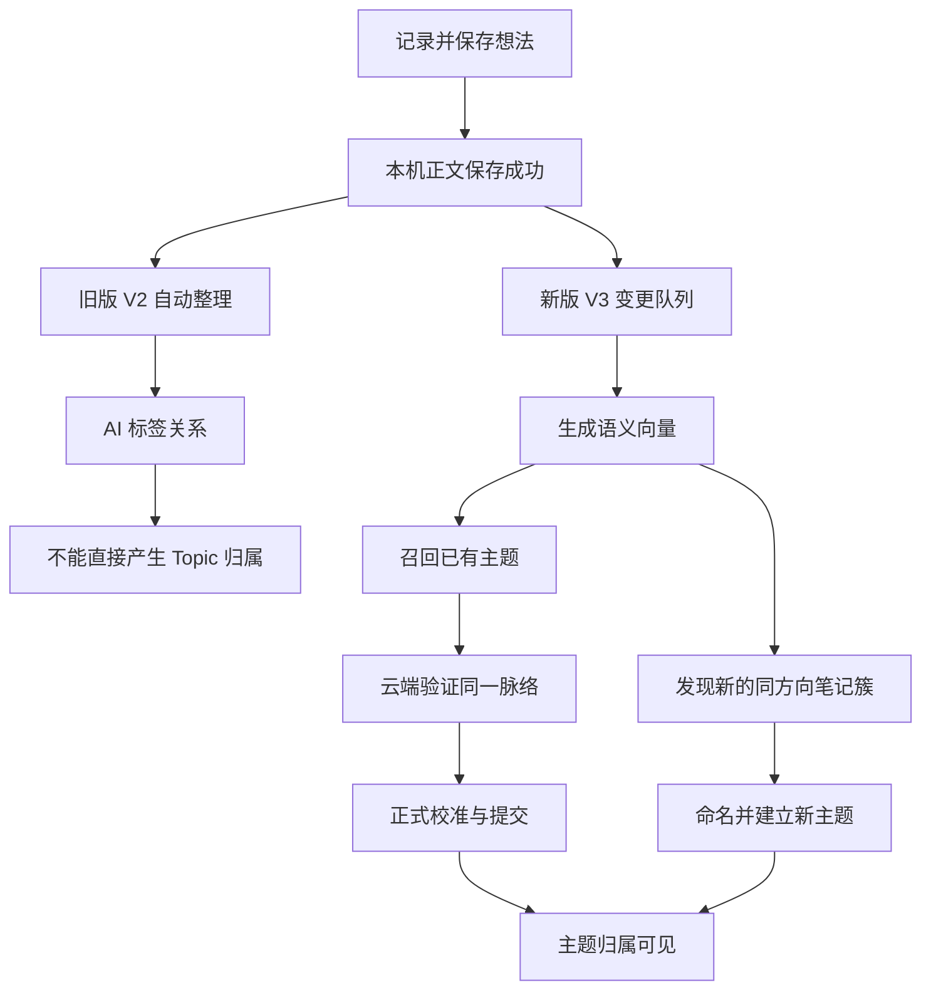

# 想法 AI 自动主题归类：全面诊断与闭环整改方案

日期：2026-10-03。对象：东林。工作副本：`/Users/tangyuxuan/Desktop/Claude/HOLO`。

本轮交付是诊断、隔离复现和整改规格。业务代码、手机数据、生产配置均未修改；未部署、未提交。以下用「当前事实」「复现结果」「整改建议」「待验证」区分证据层级。

## 1. 产品结论

**目前并没有一条已经启用、能持续完成“自由记录 → 自动形成主题”的产品链路。** 这不是继续多写笔记、手动多加标签或者换一个更强的模型就能解决的问题。

已经确认的直接阻塞包括：

1. 旧版自动整理处理的是 AI 标签，不负责把想法写入 Topic。
2. 新版语义索引和已有主题归类默认关闭；正式校准文件缺失，即使 relation 设成 on，仍只记录试验结果，不写用户可见归属。
3. 生产主题归类、主题命名与摘要的隐私核验闸门均未开放。真实模型已配置，但相关端点会在调用模型前拒绝请求。
4. 新主题发现的唯一生产调用点还挂在旧知识树页面；现已全量启用的侧栏结构不会创建该页面。侧栏只读取已生成的建议，不生成建议。
5. 即使解决以上开关问题，现有队列仍存在任务误领、杀进程后无法恢复、历史判断不重评等确定性断点。

9 月 27 日的实施记录明确：数据一致性 P0 和感知层 P1 已交付，真实评测、校准和放量 P2 未开始。当前代码证据与这一状态吻合；不能把当时的“基础设施/界面完成”理解为“AI 自动主题归类已经上线”。

**推荐的产品目标：用户只负责记录；已有主题高可信自动归入，新方向积累到足够证据后自动形成可撤销主题；用户纠错是可选动作，不是逐条审批工作。** 新主题自动形成是对旧方案“必须点击建立”的产品规则调整，需要通过主题质量评测后落地；本轮未擅自改变这个规则。

## 2. 诊断范围与证据边界

| 层级 | 本轮完成 | 能证明什么 |
|---|---|---|
| 当前 iOS 工作副本 | 保存入口、旧整理、新索引、队列、候选、验证器、主题发现、投影、页面、设置全链路走查 | 当前代码能否形成自动主题闭环 |
| 当前生产 ECS | 只读配置白名单、数据库 Prompt 元数据、请求汇总、部署源文件 SHA256 | 服务实际路由与闸门状态 |
| 本机隔离测试 | 原有语义库测试、原有关系投影测试、4 个针对性复现 | 队列和投影断点确实存在 |
| 后端契约测试 | 54 个想法整理/归类/主题洞察测试全部通过 | 本地契约与 stub 路由行为；不代表真实模型效果 |
| 东林手机 | 未读取本机偏好、安装包身份、最新笔记和运行日志 | 不能逐条确定最近笔记停在哪一步 |
| 真实模型质量 | 本轮未向供应商发送笔记或跑真实样本评测 | 不能给出现有模型的准确率/召回率 |
| 真机/双设备 | 未安装 App、未操作模拟器或 CloudKit 数据 | 不能宣称端到端体验或双设备验收完成 |

仓库原本有大量在途改动。本轮保留原状，只新增本报告；不把别人的改动视为本轮成果。

## 3. 当前实际链路



图中 C 的产物与 K 的产物不同。当前 G/H/J 被客户端启用条件拦住，I/M 被生产闸门拦住，L 的调用入口又不在当前正常导航里。把其中某一个环节显示为“完成”没有解决整条链路。

### 3.1 旧版流程为什么有调用却没有主题

`ThoughtOrganizationService.swift:37` 明确写出且实现了“不做主题分类（Topic 体系保留为手动功能）”。实际请求是 `/v1/thoughts/organize`，落的是 `ThoughtTagAssignment`，不是 `ThoughtTopicLink`。

`ThoughtAIClassificationPolicy.swift:16` 的默认行为依赖新 UI：新 UI 开启时 V2 自动整理默认关闭；新 UI 关闭时默认开启。显式用户设置可以覆盖默认。

| 没有显式覆盖时 | Debug | Release |
|---|---|---|
| 新 UI | 默认开 | 默认关 |
| 旧 V2 自动整理 | 默认关 | 默认开 |
| V3 index / relation | 默认 off | 默认 off |
| V3 discovery / resurfacing 的展示判断 | 默认开 | 默认关 |
| 正式 AI Topic 归属 | 不会因默认状态而产生 | 不会因默认状态而产生 |

所以开发版可能出现“新界面已就位，但旧整理停算、新归类没启动”；正式版可能出现“AI 一直打标签，但没有 Topic 归属”。在手机安装包未核实前，这两种情况都不能直接套在东林个人设备上。

### 3.2 “开启索引”为什么仍不等于自动归类

`DeviceIntelligenceIndexView.swift:171` 的开启动作只把 index 设为 shadow，没有开启 relation。代码全库搜索也没有找到把 relation 设为 on 的正常用户入口。

`ThoughtSemanticRelateExecutor.swift:92` 的正式写入条件为：

```swift
let commit = (flag == .on) && isCalibrated
```

`ThoughtSemanticCalibration.current()` 只从 App Bundle 加载正式 JSON；仓库没有 `ThoughtSemanticCalibration.json`。缺文件时 `isCalibrated=false`，即使 relation 是 on 仍回到 shadow。

这是一道尚未完成的质量发布门，不应随便制造一个阈值文件绕过它；需要真实样本校准并确认资源确实打入安装包。

## 4. 生产实测：真实模型已配置，但主题链路被阻止

生产配置快照时间：2026-10-03 11:48:40，北京时间；源文件与 Prompt 元数据随后在同轮核验。SSH 只执行配置读取、只读 SQLite SELECT 和源文件摘要，不输出密钥、账号标识或笔记正文。

公开 health 返回 ok。发布身份：

```text
commit       7d93974c3a72f24288bc9a4e98249d330c9c113c
sourceDigest 7cb43555e33ec8448eac70287a50c0d269dabc06d53241759d6dc7420fb89a4b
buildTime    2026-10-03T02:37:55Z
```

| 能力 | 生产真实路由 | enabled | privacyVerified | 当前含义 |
|---|---|---:|---:|---|
| 语义向量 | qwen / text-embedding-v3 / 1024 维 | 按路由配置提供 | 此端点无同款核验闸门 | 可配置调用；本轮未做真实向量请求 |
| 旧整理 A/R/B | deepseek / deepseek-v4-flash | true | true | 日志可见真实调用 |
| 主题关系验证 | deepseek / deepseek-v4-flash | true | **false** | 按代码返回 503 PRIVACY_ROUTE_UNVERIFIED |
| 主题命名、摘要 | deepseek / deepseek-v4-flash | true | **false** | 按代码返回同款 503 |

证据：`HoloBackend/src/app.js:1048`（关系验证）、`:1116`（命名/摘要）；`src/config.js:607` 和 `:625`。生产这四份源文件与本地 SHA256 一致：

| 文件 | SHA256 |
|---|---|
| src/app.js | 8ae02f6763f42426ab5a0c2b88eab32fea6d57fd7ad7616d192d4aa2b3803ad1 |
| src/config.js | f8da8eca2dd6c78095a89cc4752fdebe648d506038502ecc6cfc369038f2dc45 |
| src/thoughts/semanticRelateService.js | a2b84f3ef1e3d56294ea002053b3a4d5d46284fc16fa1882fe2e2ecb11434935 |
| src/thoughts/topicInsightService.js | f722879da38f2c15dcde26421c0eeab7043486d3976c87eb0f042661148c3f3d |

生产数据库最新的 `thought_organize_a/r/b`、`thought_semantic_relate_v1`、`thought_topic_name_v1`、`thought_topic_summary_v1` 均为 version=1、source=default，内容摘要均与当前 `defaultPrompts.json` 相同。没有发现“生产加载了另一份 managed Prompt”解释本次缺失。

现存近 14 天 AI 日志：整理 A 73 次，完成 71 次；整理 B 65 次，完成 63 次；未检出 semantic-relate/name/summary 的调用。现存请求日志中 organize 有 20 个 200、3 个 500，未检出 semantic-relate 或 embeddings 请求。

**这些是服务器当前留存的全局日志计数，不是东林个人笔记数量，也不是覆盖完整 14 天所有请求的承诺。** 不同日志表的保留和采集口径不同，不能把 A/B 次数与请求次数直接相减，或用它们计算个人分类覆盖率。

公开 `/v1/prompts/meta` 返回 404 的原因也已核实：该端点仅在 `exposePromptEndpointsForTests` 覆盖项下注册，生产不公开。本轮改为只读数据库元数据核验；404 本身不是服务故障。

## 5. 关键缺陷台账

### F01：新主题发现挂在已经不可达的旧页面——直接阻塞

唯一调用是 `ThoughtKnowledgeTreeView.swift:192` 的 `discoverIfNeeded`。`ThoughtListView.swift:243` 仅在知识树模式且侧栏未启用时创建该页面，而 `ThoughtSidebarRollout.isEnabled` 现为常量 true。

当前侧栏 `ThoughtSidebarView.swift:181` 只调用 `loadSuggestedCluster()`，不会启动发现；Pipeline 心跳只消费 embed/relate。

**用户影响：没有预先生成的簇时，正常记录再多也不会经此入口产生新的主题建议。**

整改：发现调度归到数据处理管线，在一批有效向量写入后、前台恢复和受控历史补跑后触发；页面只读结果。节流不能在还没任何可用向量时就消耗掉 6 小时窗口。

### F02：embed 误领 relate 并将其完成——已复现，直接阻塞

`ThoughtSemanticEmbeddingExecutor.swift:38` 领取任务时未传 kind；`ThoughtSemanticStore.swift:429` 的默认 kind=nil 意味着领取任何类型。发现该想法已有向量后，embed 的 `:73` 分支直接 finish=done。

复现步骤：已有有效向量 → 只入队 relate → 按 embed 的真实调用方式领取 → 读到 relate → 命中“已有向量” → 标 done → 正常 relate 执行器再无任务可领。

**用户影响：队列显示处理完成，实际从没判断主题。** 这是调用契约缺陷；并不意味着在所有时序下每条任务都一定丢失。

整改：领取必须显式过滤 kind，执行器消费类型由接口约束；加入 embed 与 relate 混合队列的真实行为回归。

### F03：处理中退出后任务永久卡 running——已复现，恢复断点

Store open 不恢复 running；领取只查 pending；hasPendingJob 把 pending/running 都算占位。任务领取后杀进程、再打开同一隔离库：不可领取，但占位仍存在，阻止补排。

整改：为领取记录租约/开始时间；冷启动或租约超时可恢复任务，并避免活请求被重复执行。UI 统计须包含 running 与 stalled，不能把不可见队列项当完成。

### F04：“曾经没有主题”永久阻止重新理解——已复现，成长断点

Verifier 无召回时记录一条 expired/no_recall；`hasRelationRecord` 只判断同 thought+contentHash 有任意记录，不检查过期、引擎、校准版本或主题目录版本；ChangeFeed 遇到它就不补排。

复现：写入已经过期、旧引擎的 no_recall 记录后，hasRelationRecord 仍为 true。

**用户影响：以前主题库为空时写的笔记，后来新主题建立、规则升级或 shadow 转正式，也可能永不重评。**

整改：区分“已索引”“已评估”“已实际归入”；评估键至少包含正文、模型/引擎、校准、主题目录和运行模式版本。无匹配结果保留可控重评资格。主题新增时只重评相关邻域，避免 AI 归入反过来触发全库无限循环。

### F05：改了正文，旧 AI 归属仍有效——已复现，放量前必须修

link 存有 basisTextHash，但 `effectiveTopics`、`isEffectiveMember` 和计数只看 active，未验证 hash。ThoughtRepository 更新正文与 ChangeFeed 也没将旧 ai/v3 link 退出有效集。

隔离 Core Data 测试：先建旅行 AI 归属，正文改成钢琴内容，旧旅行归属依然有效且被计数。

整改：用户手动关系保留；AI 关系以正文版本为依据，编辑后旧结果退出有效集，新评估完成前不能显示为新正文的有效归属。统一四处读取和候选成员口径。

### F06：新主题还必须人工“建立”——产品目标不一致

侧栏建议卡是建立/忽略；`createTopicFromSuggestion` 写的是 userAcceptedSuggestion。用户不点击，不会生成正式主题。这符合旧方案，却不完整满足“随便记录，系统自动形成主题”。

整改建议：高可信新方向自动形成主题并标注 AI 来源；证据不足的候选留在内部，少量需要判断的歧义才建议用户处理。不能简单在后台模拟点击“建立”，否则把 AI 行为伪装成用户认可。

### F07：只有主题名称，没有成员，归类无法冷启动——算法边界

CandidateEngine 用既有 active link 成员向量算中心，用已有主题成员近邻投票。空主题既没有中心也没有票，名称不会单独参与语义召回。尚未形成主题的新方向也不在候选库里。

整改：允许从已有主题的定义与边界召回；无已有主题时走新方向发现。主题创建同时写明定义、来源和经验证的成员。已有成员的自动归入不能成为“有成员才能再增加成员”的启动前提。

### F08：同方向聚类缺少共同主题验证——自动建主题前的质量缺口

现有聚类是近邻边的连通分量。A 与 B 相似、B 与 C 相似，不代表 A 与 C 属于同一主题。命名 Prompt 又直接假设输入簇已经是同一脉络，只返回 name，没有成员取舍与共同主题证明。

fingerprint 由完整成员集合计算；新增成员即换指纹，原冷却/拒绝记录可能不能识别为同一个方向。现有计数规则也未实际落实跨日、重复内容去重的产品证据约束。

整改：向量只产生候选；模型需提出共同对象/问题、包含边界，并逐条验证成员。拒绝反馈使用稳定方向身份与成员增量，不能只依赖整组成员指纹。不要把现有连通分量直接批量转正式主题。

### F09：目前最多一个 high，不支持真实多方向记录——已核对规则

Verifier 分层要求 isTopCandidate，且使用第一/第二候选差值。因此一条同时涉及产品开发和个人状态的记录，最多一个主题能自动可见，两个都合理时还可能一起停在 medium。

整改：普通主题允许 0–N 个关系，首版展示最多 2 个主要方向；每个关系单独有证据。只有定义上互斥的主题才用相对差值裁决，不能全局单选。精确上限与阈值通过真实样本确定。

### F10：候选与验证器仍有事实源口径差异——需要回归

候选中心和投票直接查询 active link，没有复用 per-pair 优先级裁决；中心没有排除已删除/归档成员，也未核对成员向量 hash 是否仍对应正文。代表片段查询使用两条 ANY，未确保 topic 与 active 来自同一 link，可能把另一个主题的 active 关系当作本主题的证据。

整改：统一从有效成员投影构造中心、票数和代表片段；排除目标自己作代表，避免用目标证明自己属于主题。卡片一致只是显示一致，不能代替输入证据一致。

### F11：保存成功、向量完成与归类完成混在状态里——可诊断性缺口

设置页“自动整理”实际控制 V2；设备索引页“开启”只打开 index=shadow；“已完成：已索引 N 条”不代表 relation 生效。页面还用 index==on 决定暂停/重试入口，正常开启得到 shadow 时这些操作不会出现。

正式提交失败被 commitDecision 日志捕获后不向任务执行器抛出；候选先记 committed_high，执行器最后仍记 done。因此也存在“日志说提交、实际没保存”的风险。recordAIV3Decision 返回 false 时仍可能广播归入回执。

整改：后台统一回执包含真实写入结果；done 对应明确 outcome，不能只表示函数没有抛异常。主页面保持简洁；设置页用普通语言区分未启用、试验中、待处理、无匹配、已归入、服务未开放与失败可重试。

### F12：长文、短句和 Unicode 规则冲突——自由记录的边界缺口

- V2 仍有新建少于 10 字不入队的入口限制，而 V2 新策略又声明由模型判断短句；“睡眠又乱了”这类有意义短句会被旧入口跳过。
- V3 embed 上传整条脱敏正文；后端限制每条 2000 UTF-16 单位，客户端执行器没有切片。长笔记会得到 400，不产生向量，自然也不能归类。
- V3 代表片段/目标用 Swift prefix 按 Character 截断，后端按 UTF-16 计数；含 Emoji 等文本可能超限。
- V2 validatedOutcomes 用 UTF-16 的 location/length 去调用按 Character 的 index(offsetBy:)。含 Emoji/组合字符时可能拒绝合法证据，极端范围可能越界。此项是静态代码证据，未把它认定为东林近期某条笔记的实发崩溃。

整改：统一上传、截断、证据区间的 UTF-16 契约；长文按段切片并保存原文映射，不能只截前 2000 字然后声称理解全文；短句由内容证据决定，图片主导且无文字时如实标记暂不可判断。视觉/OCR 不属于现有已验证能力。

### F13：历史补跑可能挤掉新记录——成本与调度边界

生产 embeddings 限额为每设备 20 请求/分钟、120 请求/天；现有执行器每条一个请求。新记录与历史补跑 priority 都为 0，队列 rowid 升序。

如果按目前单条请求方式索引 1000 条历史笔记、全部额度都给回填，至少需要 9 个日配额窗口；还未计入新笔记、错误或用户离开前台。若新记录排在历史队列末尾，日常体验可能连续多天没有反馈。

整改：新建/编辑优先，历史低优先分页，设置独立日预算；后端已支持最多 16 条的向量批请求，可受控批量处理。实际日成本与模型费用需实测，不把配置价格当供应商当前报价。

### F14：embedding 审核前提已与产品流程脱节——发布前需核实

后端 embeddings 注释以“正文已在 thought_organization 审核”为不重复审核依据；但新 UI 默认关闭 V2，新保存进入 V3 不保证跑过旧整理。

整改：为新链路定义真正执行的首次外发审核与隐私规则，复用统一后端边界；核实供应商条件后再开放生产闸门。不要为了让功能出现而把 privacyVerified 直接写成 true。本轮只发现前提不成立，未修改审核或核验开关。

## 6. 推荐产品规则：让主题从实际记录中生长

### 6.1 用户应当感受到的行为

1. 写笔记立即保存；不要求先选分类、补标签或等 AI。
2. 有足够证据属于现有主题时，异步自动归入。卡片、侧栏数量、详情、筛选读同一个真实结果。
3. 多条记录反复涉及一个新方向时，系统形成具体主题；高可信可直接出现，用户可改名、移除或撤销。
4. 一条记录可以涉及两个方向，不强制塞进一个顶层分类。
5. 短句、偶发内容、信息不足可以暂时没有主题；但后续上下文增加后应可重新理解。
6. 纠错后记住用户决定；用户明确改名或手动归属优先于 AI。AI 不改用户 #标签。

例子仅用于说明规则：连续记录「开发功能过多」「今天的核心价值不清楚」「想减少下一版本范围」，可以形成「Holo 版本取舍」；不应只因为都出现“今天”而形成“日常”，也不能因为提到 AI 就把所有记录塞进“AI”。

主题的共同依据是具体对象、活动或持续问题，不要求成员观点一致。“准备去日本”和“决定不去了”都可能属于同一次旅行计划；要把观点变化作为主题内的时间线保留。

### 6.2 三条 ADR 建议

| 决策 | 推荐 | 取舍 |
|---|---|---|
| ADR-01：整理事实源 | 保留 ThoughtTopicLink 唯一对外关系事实源；在同一管线增补调度与重评 | 复用现有投入，避免另造第四套分类器；仍需修队列与版本规则 |
| ADR-02：新主题生成 | 高可信自动形成、可撤销，歧义才轻量建议 | 减少用户维护负担；必须增加簇成员验证、AI 来源与去重反馈 |
| ADR-03：AI 判定依据 | 语义向量用于召回，模型结合原文与主题定义验证，各关系独立判断 | 成本高于纯向量；能表达对象、活动、否定与多主题，且可追溯 |

本轮给出推荐决策供审阅，未修改旧产品规则。质量风险通过受控样本和小范围真实运行解决，不以逐条用户审批转嫁。

## 7. 工程收口路径

### G0：先让每条笔记停在哪一步可查

完成安装包身份、手机开关/授权与本机队列只读快照核对；取一条近期本应归入的真实笔记，串联保存、embed、召回、验证、提交与投影结果。

工程日志只记 ID/版本/阶段/原因码/成本/时间，不记录正文。一次处理至少给出如下 outcome：

```text
saved / queued / indexing / indexed / evaluating /
assigned / no_match / insufficient / shadow_only /
blocked_by_service / paused_budget / retryable_failure / terminal_failure
```

这些是诊断契约，不全部进入用户界面。设置页只呈现解释当前状态所需的结果。

### G1：修管线执行和恢复，不放量

范围：FeatureFlags、Pipeline、EmbeddingExecutor、RelateExecutor、ChangeFeed、Store、Verifier、LinkProjection。

- 类型化领取、运行租约恢复、明确失败与真实提交回执。
- 独立的 embedding 版本与 relation 评估版本；shadow 升正式、校准升级、主题新增、授权恢复均可受控补跑。
- 开关变化能立即 kick，新记录优先，历史补跑低优先；网络恢复/回前台续跑，不承诺 iOS 任意后台永远持续运行。
- 已有向量不再阻止 relation；旧正文 AI link 失效；用户决定与拒绝关系保护不变。
- 长文切片与 Unicode 契约统一，保存永不等待网络。

DoD：混合任务队列、杀进程重开、无匹配后建主题、shadow 转正式、正文编辑、撤权迟到结果、实际保存失败、长文/Emoji 均有行为回归；不是只检查函数调用次数。

### G2：修主题形成机制，完成真实校准

范围：CandidateEngine、ClusterEngine、SummaryClient、TopicRepository、后端 semantic-relate/topic-name 协议与 Prompt。

- 发现从页面移到后台管线；候选簇先核对共同主题与每个成员，再命名/建立。
- 补主题定义/包含边界/用户命名锁定，空主题有合法召回路径。
- 多主题独立证据；簇去重、稳定方向身份与拒绝/冷却；用户标签保持独立。
- 从可用的近期真实记录形成脱敏开发集与从未调参的留出集。明确标注“同主题”与“只是相关”，覆盖新方向、观点变化、短句、长文、跨主题和误归反例。
- 生成有模型/引擎/样本版本的正式 Calibration JSON，确保打入安装包；旧合成 40 条不能当质量结果。

发布指标建议继承已有目标并补新主题指标：已有主题 high 精确率至少 95%，严重误归为 0，正文足够且确属已有主题的召回至少 60%；新主题按成员精确率、方向重复率、应形成方向的发现覆盖率、纠错率单独评测。样本量与不确定性同时报告，95% 的样本点估计不等于未来准确率承诺。

### G3：生产核验与真实用户旅程

先审阅客户端与后端变更和供应商数据处理证据，再按授权发布后端/调整生产配置。涉及 Prompt 时按项目规则同步 iOS 后备、后端默认、版本号和实际生效元数据；本地 push 不能替代部署。

先证明同一真实笔记从请求到有效 link 再到四处显示；然后做自然记录旅程、双设备同步、拒绝反馈、成本与回退验证。每步记录安装包版本、服务 sourceDigest、实际路由、Prompt source/version/digest。

客户端首次启用不要求用户理解 index/relation/discovery；已有 AI 授权按产品范围核实后统一启用相应能力。不能把三个内部开关留给普通用户手动配齐。

## 8. 最小端到端验收矩阵

| 场景 | 通过标准 |
|---|---|
| 已有主题 + 明确新笔记 | 在可用网络、有效授权和预算内异步归入；四处一致；来源为 AI |
| 有成员向量但无归属 | 只跑 relation，不重复花钱 embed；不能被 embed 抢任务 |
| 开始时没有任何主题 | 新方向能自动被发现；不能要求先人工创建主题 |
| 3 条有独立内容的新方向 | 达到经校准的条件后形成可用主题，不要求逐条确认；重复粘贴不充数 |
| 两个真实方向 | 两个关系可独立成立；不是全局强制单选 |
| 改变观点但仍同一计划 | 保留计划脉络，不能把观点一致当归属条件 |
| 原本无匹配，之后出现主题 | 相关历史范围被重评，旧 no_recall 不永久封死 |
| shadow 通过后转正式 | 有受控补提交/重评，不重新算全部向量 |
| 处理中杀掉 App | 重开可恢复；没有永久 running；没有重复有效关系 |
| 长笔记、短句、Emoji | 按统一规则处理或如实给出不适合原因；不因协议边界静默消失 |
| 编辑成不同内容 | 旧 AI 归属退出有效集；手动决定保留；新版另评 |
| 用户移除/改名 | 同一错误不复活；AI 不盖用户命名或标签 |
| 双设备 + CloudKit 合并 | 相同归属不双计数；用户拒绝在两边一致 |
| 服务未开放/预算耗尽/断网 | 保存成功；状态有真实原因；恢复后续做 |
| 上线回退 | 停新 AI 写入；用户内容、标签、手动关系和纠错记录保留 |

延迟按可处理的前台/合法后台窗口分别统计。建议初始体验目标为通常 1 分钟内出现既有主题结果、P95 在 2 分钟以内，历史补跑单独统计；这是待实测的验收目标，不是当前能力声明。

## 9. 本轮测试结果与复现资料

- 后端 `node --test tests/thought-semantic-v3.test.js tests/thought-organize.test.js tests/thought-topic-insight.test.js`：54/54 通过，mock/stub 机制验证。
- 语义库 standalone：生命周期、向量往返、领取、取消、flat 检索、销毁重建、向量数学通过。
- link 投影 standalone：确定性身份、迁移幂等、墓碑、重复行裁决、合并和用户决定保护通过。隔离夹具出现 deletedAt 动态访问器警告，不代表真机运行结果。
- 额外队列探针：误领 relate、running 无法恢复、expired/no_recall 阻止补排，均已复现。
- 额外内存 Core Data 探针：正文改变后旧 AI link 仍有效，已复现。

探针与编译产物在本机 `/tmp/HoloThoughtAudit-20261003/`，不进入业务仓库：`AuditProbe.swift`、`StaleProjectionProbe.swift`、`audit-probe`、`stale-probe`。复现使用现有生产源码和隔离数据库，未修改实现去制造问题。

原有测试通过仍漏掉这些缺陷，原因是测试覆盖单个存储/投影能力，缺少“真实执行器混合消费 + 进程恢复 + 版本重评 + 当前导航触发”的串联场景。补回归时应覆盖这些边界，不用更多同构 mock 冒充端到端验证。

## 10. 交付状态与下一步结论

全面诊断已完成到“当前代码 + 当前生产配置 + 关键断点隔离复现”。手机近期笔记的逐条轨迹、真实模型评测、正式校准、真机与双设备验收仍未完成。

下一轮实施应优先 G0/G1，再 G2/G3，把这些发布门完整走通。**不能仅开放开关或重写 Prompt 就宣布完成。** 不需要重建整个想法模块，也不需要东林为了让它启动而额外手动整理大量笔记；核心是复用已有结构，补上真实执行、重评、新主题形成和生产发布。

后端的关联/命名/摘要闸门及可能涉及的协议与 Prompt 改动需要后端发版或生产配置发布；这是必要的上线工作。本轮没有执行生产变更。
