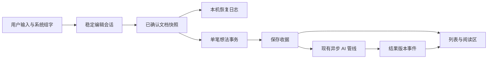

# 想法模块与编辑器：GLM 完整改善方案

日期：2026-10-04。唯一工作副本：`/Users/tangyuxuan/Desktop/Claude/HOLO`。

先读 [01-产品判断与根因.md](01-产品判断与根因.md)；本文件是实施规格。问题编号 E/M 与诊断对应。事实源快照与现有测试结果见 [03-证据与验收边界.md](03-证据与验收边界.md)。

## 1. 目标、范围与交付口径

**版本目标：放心写、顺手改、随时找回。** 让用户从记录一句话到连续写长文都能完成输入、编辑、保存、恢复和找回；AI 在用户已保存的内容上异步工作。

本次必须完成：编辑会话和可靠保存、附件重试、中文输入法和动作确认、内容保真、单滚动画布、撤销/重做入口、同页阅读/编辑、正文查找、最近版本恢复、AI 结果刷新与搜索范围一致。分页和导出恢复分后续阶段实施，但本文件给出完整边界，不用它们阻塞前面的编辑器修复。

本方案授权范围是编写规格。GLM 接手后实施本地可逆改动；生产部署、正式 CloudKit schema 发布、删除用户数据、发布安装包、提交/推送按东林授权和项目规则执行。不要因本文提到发布动作就认为已经授权发布。

### 完成定义

- “代码完成”：实现 + 有效测试，不等于真机可用。
- “编辑器可试用”：核心专项、模拟器行为和升级样例通过，可准备安装包。
- “编辑器可发布”：真机中文输入法/长文/低资源、双设备、升级、失败恢复达到矩阵要求。
- “AI 生效”：客户端与生产版本配套，真实合成请求通过，并在对应安装包看见结果；不能只凭 health 或模型单次返回。
- 不报告“绝无 BUG”；报告已通过的边界和仍未验证的条件。

## 2. 开工与在途改动接管

1. 读取根 `AGENTS.md`、`CLAUDE.md` 和 `docs/standards/INDEX.md`；按范围读设计、质量红线、Core Data、Prompt 规范。
2. 执行 `git -C /Users/tangyuxuan/Desktop/Claude/HOLO status --short`，记录相关文件内容摘要。本文路径均为绝对路径；任何源码行号在接手时重核。
3. 对比本轮证据文件与当前代码；如果其他会话已修改问题入口，先核对修复是否覆盖本规格，再安排新工作，不回滚、不重复重写。
4. 特别保留 10 月 3 日想法 AI 实现、10 月 3 日视觉 V2、想法侧栏/照片横滑手势、分享模板、Thought→Task 现有事务语义。
5. 禁止 `git add .`、整体 reset、清理未跟踪文件、改真实用户库作试验。用合成笔记与专用测试目录。
6. 实施记录放在本目录 `04-实施与验收记录.md`（新建）；每阶段更新变更范围、已跑用例数、失败和未验证项。

## 3. 产品规则：先统一，后编码

### 3.1 一次写作只有一个会话

无论新建、编辑、宽屏切换、加图、语音或 AI 跳转，都由一个稳定会话管理正文、选区、命令、保存、附件和退出。View 负责展示；生命周期回调不能替代业务提交。

### 3.2 保存、本机恢复和云同步分开表达

| 内部状态 | 用户可见说明 | 可退出条件 |
|---|---|---|
| clean | 默认安静；必要时“已保存到本机” | 可以 |
| dirty / saving | 持续超过 1 秒才显示“正在保存…” | 完成按钮先等待本次 flush；保存未完成不能伪装成功 |
| failed + recoveryDurable | “保存未完成，内容已保留为草稿” + 重试 | 默认留在页内；用户明确返回可带草稿退出，并有下次恢复入口 |
| failed + recoveryFailed | “暂时无法保存” + 重试/复制正文 | 保留页面，不把未持久化内容自动丢弃 |
| attachmentsPending / failed | “图片正在保存”或“有 1 张图片未保存” + 重试 | 不显示全量成功；退出须已有图片恢复日志，否则留页 |
| conflict | “这条想法在另一台设备也有修改” | 保留两个版本，等待采用/保留副本；不能静默覆盖 |

“已保存到本机”只表示正文及对应关系提交成功；“iCloud 同步”使用已有同步服务的真实状态，不根据 `context.save()` 推断已到另一台设备。无网络仍可写与本地保存，AI 挂起不影响编辑。

### 3.3 完成和离开

- 顶部主动作统一文案“完成”，新建也不用纸飞机。执行 `requestFinish()`：提交系统组字 → 取得最新快照 → flush → 核对收据与附件 → 关闭。
- 返回手势、宽屏切换笔记、查看标签、打开相关想法、跨模块跳转，统一走 `requestLeave(reason:)`。先保护当前内容，成功或可恢复后才导航。
- `onDisappear` 仅作为最终保险：记录未提交快照/取消 UI 订阅，不再承担唯一成功保存路径。
- 编辑期未确认的输入法候选不能被 AI、排版和状态刷新强行截断。用户明确点完成时，通过系统结束编辑，再等待 delegate 报告提交结果；不要直接把 `markedTextRange` 的临时内容当最终文本。
- 用户没有改正文、格式、引用或附件，不更新 `updatedAt`，不重建标签/引用，不重新安排 AI。

### 3.4 清空与删除

- 从未正式落库的新空会话：不创建空想法，清理该会话的临时文件。
- 已正式保存的想法（包括新建会话首次自动保存后的记录）：清空也是一次合法编辑，保存为空正文，保留手动归属与可恢复版本；显示“空想法”。不把旧正文重新显示成保存成功，也不自动硬删除。
- 删除只从明确“删除想法”操作发生，沿用回收站；关闭、撤销、清空正文、图片在途不得顺带删除实体。
- 引用别人已删除/归档的想法时保留历史快照与原 ID，给出已有失效状态，不能生成另一个来源实体。

### 3.5 标签、主题与 AI

- 行内标签变更只增删 `inline` 来源，不能清除 `manual/confirmedAI/rejectedAI`。界面呈现“我的标签”仍使用当前统一投影规则。
- AI 主题沿用当前 `ThoughtTopicLink` 有效投影，不改成独立编辑器数据源。
- 已有主题可靠自动归入；至少三条独立记录且有共同证据可自动形成新主题；保留用户关闭和拒绝记录，不增加逐条审批。
- 任何 AI 结果不直接覆写原文。未来润色/续写必须预览、用户采用、单次撤销。

## 4. 工程决策与取舍

### ADR-01：保留 UITextView，收口会话与宿主

决定：保留 `MarkdownTextView` 的 UIKit 输入内核和现有 Token/任务/撤销能力，逐步抽出会话、命令、持久化与纯序列化逻辑。SwiftUI 接收状态，不通过旧正文 Binding 回灌正在输入的 UIKit。

理由：已有中文组字和旧快照回归基础；重换 Web 编辑器/富文本库会扩大输入法、键盘、选区、无障碍和数据迁移验证面。直接改成 SwiftUI `TextEditor` 则会丢现有富文本/Token 能力。

代价：仍需管理 UIKit/SwiftUI 桥，但桥的规则可以集中且可测。本轮不同时迁移 TextKit 引擎；如果长文基准失败，先定位 TextKit/布局调用后另写决策记录。

### ADR-02：新内容采用明确的字面文字与样式；旧数据只读迁移

决定：为新编辑器建立 `ThoughtEditorDocument` V2，以文字片段、样式、段落类型和语义节点分别建模。用户输入 `**`、`++`、`{color:...}` 是字面文字；格式只来自明确格式动作或明确 Markdown 导入。

理由：继续在同一个字符串中猜“这是用户文字还是加粗语法”无法保证无损。仅新增转义正则无法覆盖既有未转义数据和旧客户端。

取舍：需要渐进的数据契约与版本兼容，不能一次批量重写旧笔记。新 V2 建议新增 optional 的 `editorDocumentJSON` 和 `editorDocumentBasisDigest` 属性，同时保留 `richContentJSON` V1 镜像供旧读者。新增属性必须过当前动态 Core Data 模型的升级/CloudKit 检查。G1 可先用旧内容契约解决保存问题，G2 才启用 V2。

旧客户端可能重写 V1；新客户端必须检测镜像变化，保留旧 V2 和外部改动两个版本再协调。不要宣称旧客户端能完整显示 V2 的所有字面符号和新格式。正式跨设备保真验收至少使用两个支持 V2 的客户端；旧客户端混用单列兼容测试，必要时延期 V2 持久化放量，保存/会话修复照常发布。

### ADR-03：恢复日志先做设备本地，不扩大云端编辑并发

决定：草稿、附件在途日志和最近写作版本放在独立本地 `ThoughtEditorRecoveryStore`，不与语义向量库共表，不先新增一套云端草稿实体。可使用现有 SQLite 技术建立事务性日志。

理由：崩溃恢复是本机即时责任；让每个按键都同步 CloudKit 会增大性能、隐私和冲突面。之后如需多设备历史，再独立设计同步实体。

代价：第一阶段的“最近版本”属于本设备，UI 明示范围，不能冒称跨设备历史。双设备冲突仍保留两份内容，通过已有同步变更检测与本机恢复日志协调。

### ADR-04：编辑模式单一正文滚动；阅读仍在同页

决定：编辑模式只有 `UITextView` 拥有正文纵向滚动，固定占实际容器的可视区域；外层不再套可纵向滚动的 SwiftUI 容器。附件使用紧凑入口进入附件面板；阅读模式同页显示现有正文/附件/AI 区。

理由：避免短文增长、长文内滚动与外页滚动相互切换。不是新增详情页或导航体系。

代价：阅读/编辑转换需要保留选区与滚动锚点，必须建立同一会话与 shared renderer 之后再实施。

## 5. 文件地图

### 5.1 接续现有文件

| 文件绝对路径 | 职责/修改边界 |
|---|---|
| `/Users/tangyuxuan/Desktop/Claude/HOLO/Holo/Holo APP/Holo/Holo/Views/Thoughts/ThoughtEditorView.swift` | 绑定会话、完成/离开、附件面板、同页模式、状态；删除 View 内主保存逻辑后不继续堆分支 |
| `/Users/tangyuxuan/Desktop/Claude/HOLO/Holo/Holo APP/Holo/Holo/Views/Thoughts/MarkdownTextView.swift` | 稳定输入、命令确认、IME/选区/撤销桥；逐步减少全量赋值 |
| `/Users/tangyuxuan/Desktop/Claude/HOLO/Holo/Holo APP/Holo/Holo/Views/Thoughts/Editor/HoloContentNode.swift` | 保留旧 Token 解码；为 V2 adapter 提供语义身份 |
| `/Users/tangyuxuan/Desktop/Claude/HOLO/Holo/Holo APP/Holo/Holo/Views/Thoughts/Editor/RichContentSerializer.swift` | V1 只读兼容/镜像 adapter；区分源码、可见文本、搜索/AI 投影 |
| `/Users/tangyuxuan/Desktop/Claude/HOLO/Holo/Holo APP/Holo/Holo/Views/Thoughts/Editor/ReadOnlyRichTextView.swift` | 同页阅读 renderer；共享 V2 样式与 Token 契约 |
| `/Users/tangyuxuan/Desktop/Claude/HOLO/Holo/Holo APP/Holo/Holo/Views/Thoughts/Editor/EditorFormatToolbar.swift` | 撤销/重做/Aa/列表/插入/语音；所有热区至少 44pt |
| `/Users/tangyuxuan/Desktop/Claude/HOLO/Holo/Holo APP/Holo/Holo/Views/Thoughts/Editor/TriggerDetector.swift` | 保留邮箱/@、标题符号/#、IME/Token 不误触发规则 |
| `/Users/tangyuxuan/Desktop/Claude/HOLO/Holo/Holo APP/Holo/Holo/Views/Thoughts/Editor/SuggestionPanelViewModel.swift` | 候选取消/版本校验，使用稳定会话 ID 排除自身 |
| `/Users/tangyuxuan/Desktop/Claude/HOLO/Holo/Holo APP/Holo/Holo/Data/Repositories/ThoughtRepository.swift` | 保存原语、无变化跳过、保留手动标签；保持其他调用方契约 |
| `/Users/tangyuxuan/Desktop/Claude/HOLO/Holo/Holo APP/Holo/Holo/Data/Repositories/ThoughtRepository+RichContent.swift` | 引用内部变更不各自提交，差异更新引用 |
| `/Users/tangyuxuan/Desktop/Claude/HOLO/Holo/Holo APP/Holo/Holo/Data/Repositories/ThoughtRepository+Attachments.swift` | 附件按稳定 ID 幂等提交/清理，失败保留 staged 文件 |
| `/Users/tangyuxuan/Desktop/Claude/HOLO/Holo/Holo APP/Holo/Holo/Models/CoreDataStack+ThoughtEntities.swift` | G2 optional V2 属性；先验证迁移，不改已有字段含义 |
| `/Users/tangyuxuan/Desktop/Claude/HOLO/Holo/Holo APP/Holo/Holo/Models/Thought+CoreDataClass.swift` | V2 属性与统一可见文本投影、空正文显示、冲突版本识别 |
| `/Users/tangyuxuan/Desktop/Claude/HOLO/Holo/Holo APP/Holo/Holo/Views/Thoughts/ThoughtListView.swift` | 统一搜索/范围/分页、同页模式导航、跳转前 flush |
| `/Users/tangyuxuan/Desktop/Claude/HOLO/Holo/Holo APP/Holo/Holo/Views/Thoughts/ThoughtsView.swift` | 新建/初始定位与宽屏切换，复用现有侧栏 |
| `/Users/tangyuxuan/Desktop/Claude/HOLO/Holo/Holo APP/Holo/Holo/Views/Thoughts/ThoughtCardView.swift` | 相同正文投影、空想法、AI 主题回显；保留照片横滑与侧滑仲裁 |
| `/Users/tangyuxuan/Desktop/Claude/HOLO/Holo/Holo APP/Holo/Holo/Views/Thoughts/ThoughtRelatedSection.swift` | 按正文/索引版本刷新、可见文本、长文洞察范围/错误分类 |
| `/Users/tangyuxuan/Desktop/Claude/HOLO/Holo/Holo APP/Holo/Holo/Views/Thoughts/ThoughtOrganizationSettingsView.swift` | 保留三开关/授权/真实状态，补服务状态而非另建 AI 控制台 |
| `/Users/tangyuxuan/Desktop/Claude/HOLO/Holo/Holo APP/Holo/Holo/Services/AI/SemanticV3/ThoughtSemanticPipeline.swift` | 索引/关系完成值事件，保留已实现队列与发现规则 |
| `/Users/tangyuxuan/Desktop/Claude/HOLO/Holo/Holo APP/Holo/Holo/Services/AI/SemanticV3/ThoughtSemanticEmbeddingExecutor.swift` | 保存/索引成功后发事件；不让编辑器依赖任务内部细节 |
| `/Users/tangyuxuan/Desktop/Claude/HOLO/Holo/Holo APP/Holo/Holo/Services/AI/HoloBackendAIProvider.swift` | 洞察范围协议、取消、有效授权；不读取密钥或绕过网关 |
| `/Users/tangyuxuan/Desktop/Claude/HOLO/Holo/Holo APP/Holo/Holo/Utils/MarkdownParser.swift` | 仅 V1/明确 Markdown 导入使用，不继续解析 V2 用户字面文字 |
| `/Users/tangyuxuan/Desktop/Claude/HOLO/Holo/Holo APP/Holo/Holo/Utils/DesignSystem.swift` | 使用现有 Tool token、17pt 正文、44pt 热区；不用编辑器改首页品牌资产 |
| `/Users/tangyuxuan/Desktop/Claude/HOLO/Holo/Holo APP/Holo/HoloTests/Views/Thoughts/MarkdownTextViewNodePipelineTests.swift` | 保留 49 项基线，补真实宿主/命令/字面保真边界 |
| `/Users/tangyuxuan/Desktop/Claude/HOLO/Holo/Holo APP/Holo/Holo.xcodeproj/project.pbxproj` | 必要的新文件 target membership，核对现有 tests，不另建重复工程 |

### 5.2 推荐新增文件（计划路径，尚未实现）

| 文件绝对路径 | 职责 |
|---|---|
| `/Users/tangyuxuan/Desktop/Claude/HOLO/Holo/Holo APP/Holo/Holo/Views/Thoughts/Editor/ThoughtEditorSession.swift` | MainActor 会话、dirty revision、命令队列、finish/leave 协调 |
| `/Users/tangyuxuan/Desktop/Claude/HOLO/Holo/Holo APP/Holo/Holo/Views/Thoughts/Editor/ThoughtEditorDocument.swift` | V2 值模型、可见文本/语义/旧镜像投影、校验 |
| `/Users/tangyuxuan/Desktop/Claude/HOLO/Holo/Holo APP/Holo/Holo/Views/Thoughts/Editor/ThoughtEditorHost.swift` | UIKit 编辑宿主、窗口几何/键盘/工具栏、查找选区 |
| `/Users/tangyuxuan/Desktop/Claude/HOLO/Holo/Holo APP/Holo/Holo/Services/Thoughts/ThoughtEditorRecoveryStore.swift` | actor，本地草稿、最近版本和附件恢复日志 |
| `/Users/tangyuxuan/Desktop/Claude/HOLO/Holo/Holo APP/Holo/Holo/Data/Repositories/ThoughtRepository+EditorCommit.swift` | 单笔想法事务提交与 receipt；独立写 context |
| `/Users/tangyuxuan/Desktop/Claude/HOLO/Holo/Holo APP/Holo/Holo/Views/Thoughts/Editor/ThoughtVersionHistoryView.swift` | 本设备最近版本预览/恢复；恢复前先存当前版本 |
| `/Users/tangyuxuan/Desktop/Claude/HOLO/Holo/Holo APP/Holo/Holo/Views/Thoughts/Editor/ThoughtDocumentFindBar.swift` | 正文内查找/上一处/下一处，支持 Cmd+F |
| `/Users/tangyuxuan/Desktop/Claude/HOLO/Holo/Holo APP/Holo/Holo/Services/Thoughts/ThoughtSearchQuery.swift` | scope、日期、状态、keyword/semantic 统一查询 DTO |
| `/Users/tangyuxuan/Desktop/Claude/HOLO/Holo/Holo APP/Holo/Holo/Services/Thoughts/ThoughtArchiveService.swift` | 后续导出/恢复包，复用现有导入导出基础 |
| `/Users/tangyuxuan/Desktop/Claude/HOLO/Holo/Holo APP/Holo/HoloTests/Views/Thoughts/ThoughtEditorSessionTests.swift` | 会话、保存回执、失败、空正文、命令与跳转边界 |
| `/Users/tangyuxuan/Desktop/Claude/HOLO/Holo/Holo APP/Holo/HoloTests/Services/Thoughts/ThoughtEditorCommitTests.swift` | 内存库原子保存、标签/引用、冲突和幂等 |
| `/Users/tangyuxuan/Desktop/Claude/HOLO/Holo/Holo APP/Holo/HoloTests/Services/Thoughts/ThoughtEditorRecoveryTests.swift` | 重启/附件/清理/历史恢复 |
| `/Users/tangyuxuan/Desktop/Claude/HOLO/Holo/Holo APP/Holo/HoloUITests/ThoughtEditorJourneyUITests.swift` | 合成数据实际写作旅程、长文、键盘/工具栏与查找 |

新增文件数量只是职责建议；实施者可以合理合并纯值类型，但不再把保存/恢复重新塞回巨型 View。任何变更影响三个以上文件，按下面阶段小批提交验证。

## 6. 会话、命令与保存契约

### 6.1 会话模型



输入、恢复、正式保存、AI 结果分别有确认点；AI 不能反向控制输入会话。

```swift
struct ThoughtEditorSnapshot {
    let sessionID: UUID
    let thoughtID: UUID
    let generation: Int64
    let baseDocumentDigest: String?
    let document: ThoughtEditorDocument
    let selectionUTF16: NSRange
    let attachments: [EditorAttachmentSnapshot]
}

struct ThoughtEditorCommitReceipt {
    let thoughtID: UUID
    let generation: Int64
    let documentDigest: String
    let committedAttachmentIDs: [UUID]
    let pendingAttachmentIDs: [UUID]
    let savedAt: Date
}
```

这些是接口规格，不是可以直接粘贴编译的完整实现。Swift/Core Data actor 隔离和 Codable 表示由 GLM 按项目版本完成。

- `thoughtID` 在会话创建时分配，新建失败重试仍使用同一 ID。不要继续依赖 `editingThoughtId ?? draftThoughtId` 在每个分支分别猜状态。
- `generation` 每次确定的正文/格式/语义/附件变化递增；选区移动不递增正文版本。
- `baseDocumentDigest` 是打开会话时完整文档依据，不用字符数或 `updatedAt` 代替。新 digest 用完整 canonical payload 的 SHA-256；已有语义 hash 保持当前协议与版本，不擅自改变。
- `snapshot` 是不可变值；异步持久化不读取后来变化的 View State。
- Receipt 的 generation 小于当前 generation，只能确认旧版本已存，当前会话仍 dirty；迟到收据不能把新文字标成已保存。
- 成功、failed、conflict 是明确结果；没有 `try?` 后当成功，也不把编码失败降级成清空富文本。

### 6.2 输入所有权与命令确认

```swift
enum EditorCommandResult {
    case applied(snapshotGeneration: Int64)
    case deferredByComposition
    case rejected(reason: String)
}
```

命令包含唯一 ID、动作、触发时的会话/选区依据。`updateUIView` 只同步展示/订阅；动作在主更新栈之外消费。`deferredByComposition` 保留命令，组字提交后重新校验并仅执行一次；只有 applied 或明确 rejected 才移出队列。

防止连续两个工具动作覆盖同一 `pendingAction`。同一类型冗余状态可以合并，但不能丢掉两次用户不同操作。工具栏/候选在组字时允许暂缓，不得强制重建正文；UI 不展示系统候选中的内容作为最终保存结果。

正常键入使用系统文本编辑链。格式、Token、粘贴和列表作为一次明确操作，优先局部修改 `textStorage`，保存选区与输入属性并注册一次撤销。只有首次加载、明确恢复版本或必要全局环境更新才整体重建。

### 6.3 单笔想法提交

在独立串行写 context 内依次：读取有效实体与最新文档依据 → 对比 base → 设置正文/V2/V1/firstLine → 更新 inline 标签差异 → 更新引用差异 → 记录本次已可提交附件 → 一次 `context.save()` → 生成 receipt → 通知。

- 正文、富文本、行内标签和引用必须同一事务。现有 helper 可拆为不保存的内部函数和保持旧 API 的外层 wrapper，编辑提交只调用内部函数。
- 禁止在共享主 context 失败时整体 rollback：会吞其他模块在途修改。失败只回滚自己的写 context。
- create 按稳定 thoughtID 幂等；Reference identity 按 source/target/token instance 语义比较，未变化不全部删除重建。
- 用户手动标签不归正文扫描管理；inline 删除只影响 inline assignment，统一投影继续有效。
- 提交失败不清 dirty、不更新 original/baseline、不删除恢复日志。成功合并回主 context 后再通知列表和 AI。
- AI 只在可见语义文本改变且主提交成功后安排；改颜色/粗体/纯空白不应重复消耗整理预算。

### 6.4 保存节奏和恢复窗口

- 主文档保存初始沿用 2 秒停顿；完成/离开/进入后台请求立即 flush。
- 本机恢复日志在确定编辑后 600ms 合并写，增加最长 2 秒的写入期限，持续输入不能无限延期；只序列化当前确定文本，不在组字期间重渲染界面。
- UI 只在恢复日志成功时说“草稿已保留”；磁盘满和文件保护不可写时必须保留会话并显示错误。
- OS 无预告终止无法保证未落盘的最后按键。恢复窗口目标 ≤2 秒已确认输入，并在故障测试记录真实窗口，不能把后台回调当绝对保证。
- 冷启动先载本机恢复清单；发现未提交草稿展示“继续上次写作”，按会话/记录 ID 去重。恢复副本不自动覆盖云端更新。
- 本设备历史：进入编辑前保护一份；离开成功、显式恢复和显著批量操作保存检查点；连续输入合并，避免每字一个版本。默认最近 30 天/每条 50 版本，实际字节预算先测再确定。明确标注“本设备最近版本”。

### 6.5 附件日志与幂等

附件状态固定为 `staged → processing → committed`，失败是可重试状态，删除是用户明确动作。

- 相册返回原始 Data 后先写独立 staged 文件与数据库日志，再显示可恢复缩略图；文件路径相对受保护的应用目录，不在日志记录照片内容。
- 附件唯一 ID 在 staged 时生成，后续 `addAttachment` 使用这个 ID 去重；每条记录最多 9 张的现有产品限制保持。
- 新建第一次落库后，任何加图都使用会话 thoughtID；相册和相机统一入口，不能一个判断 isEditing，另一个取 editingThoughtId。
- 主存储成功且附件 ID 核验可读取后才移除 staged 数据；压缩、保存或退出失败保留原件与重试动作。
- 文件写入与 Core Data 无法一次原子提交：用恢复日志记录步骤，重启对账；未引用文件延后清理，先检查正式附件/草稿/历史版本全部引用。
- 删除或软删 thought 时停止新的 attachment commit，迟到压缩结果不能挂回已删除父对象。恢复 thought 时按已有回收站规则复核文件可用性。
- 图片编码在后台；只通过值/ID 跨队列，不把 `NSManagedObject` 传入 actor。错误可见但不丢 staged 图。

## 7. V2 文档与兼容契约

### 7.1 示例

```json
{
  "schemaVersion": 2,
  "documentID": "11111111-2222-3333-4444-555555555555",
  "blocks": [
    {
      "id": "22222222-3333-4444-5555-666666666666",
      "kind": "paragraph",
      "runs": [
        {"kind": "text", "text": "这次保留字面 **符号**。", "marks": []},
        {"kind": "text", "text": "这段明确加粗", "marks": [{"kind": "bold"}]}
      ]
    },
    {
      "id": "33333333-4444-5555-6666-777777777777",
      "kind": "unorderedListItem",
      "runs": [{"kind": "text", "text": "继续写下一条", "marks": []}]
    }
  ]
}
```

此示例说明字面文字/样式分离；不是把 Holo 改成通用块数据库。首阶段只支持段落、现有有序/无序列表与现有内联格式；结构必须保留精确换行、空行、空格、emoji 与末尾空项。

### 7.2 语义节点

标签、引用和任务保留现有实体 ID 与 token instance ID。引用保留展示名/快照；任务保留来源范围。建立统一的 storage UTF-16 ↔ visible UTF-16 映射，任务附件占位不计入可见语义正文。

禁止用 Swift Character 数量作为 UIKit 选区位置。序列化、撤销、查找、转任务、粘贴、AI 引文各自明确坐标空间。删除 Token 的语义与删除链接关系分开：编辑器撤销不能默默撤销已经创建的真实任务。

格式叠加规则：粗体/斜体/下划线可组合；颜色只作用普通文字；清除格式不解除引用/标签/任务。混合格式选区“点击加粗”统一为全部加粗，再点统一取消。列表支持多行、末尾续行、空项退出、选区替换与中途拆分；明确 Markdown 快打仅支持已验证行首规则，字面 `*` 不自动变格式。

### 7.3 数据兼容与错误

- 读取优先级：有效 V2 且 basisDigest 与镜像一致 → V2；否则保留 V2 原副本并分析 V1/外部改动。没有 V2 才按现有 legacy 规则还原。
- 旧记录不批量转换；打开只读不写回。用户第一次实际编辑，才在成功事务中保存 V2 和 V1 镜像。
- 损坏 JSON、未知 schema、无效 Token 不静默覆盖原 payload。可用只读降级展示正文，提供复制/导出和重试；修复必须保留原始字节。
- V1 无法判断一个 `**` 曾是格式还是字面时，保留现有可见解释并存原字节；不替用户“修正文意”。
- V2 样式的渲染、列表卡、引用候选、分享、任务提取、记忆/日历、搜索与 AI 使用统一 projection adapter。不得出现编辑器看到字面符号、分享却吞掉符号的分叉。
- 新 schema 迁移要检查程序化模型的版本识别、历史已发布模型、optional 默认与所有关系 inverse。正式 CloudKit schema 变更不能自动进行。
- 旧客户端混用：模拟旧版保存、两个设备离线改同一条、删除/恢复、旧版 no-op 保存。新客户端必须检测依据变化并保护双方内容；不能凭时间戳直接覆盖。此门失败时先不开 V2 新写入。

## 8. 编辑器交互规格

### 8.1 页面和键盘

- 新建直接进入编辑；已有想法进入同页阅读状态，点正文或“编辑”进入编辑，保留原来位置。无需新增一个独立详情页。
- 编辑正文不包一个不断变高的输入卡片；使用现有 Tool 背景/表面和轻边界，连续画布。正文 17pt 随系统字号，横向留白 16–20pt；大字体允许工具分组，不能缩小热区。
- 顶部：返回、轻保存状态、完成/更多；只有本次确有内容变更才显示保存状态。字数在更多或底部轻信息，不占新建主路径。
- 编辑底部：撤销、重做、Aa、列表、插入、语音；插入菜单包含标签/引用/图片。现有格式与颜色能力保留在 Aa，增加“清除格式”。窄屏收进更多，不用 38pt 挤全部按钮。
- 工具栏固定在编辑宿主底部/键盘上方，内容与控件同一视觉语言。优先在 UIKit 宿主用当前视图的 `keyboardLayoutGuide` 管理，SwiftUI 不另加重复键盘高度避让。
- 高度来自实际容器和 safe area，移除 `UIScreen.main.bounds.height - 固定常数`。iPad 浮动键盘用跟踪约束/局部光标避让，不能整页压成负高度；硬件键盘时工具栏仍可用。
- 候选浮层按宿主可视矩形与键盘占区裁定上下空间；光标在视口上下边缘时仍可选择。不要只计算编辑内容大小，把浮层放到键盘背后。
- 图片在编辑期显示“图片 N”紧凑入口和未保存状态，进入附件面板查看/重试/删除；不默认占用 128pt 正文高度。阅读状态展示完整现有图片。

### 8.2 阅读与导航

- 阅读时才展示主题/相关旧想法/帮我想想。进入编辑不让 AI 结果刷新改变正文高度、光标或触发键盘。
- 保存后返回同一列表滚动位置、搜索词和侧栏范围；打开相关想法后返回可继续原写作会话。
- 宽屏切换先保护旧会话，再载新 ID；两个想法的命令/选区/任务不可串用。
- 完成只是结束当前写作，不自动转任务、不等待 AI、不上传未授权内容。

### 8.3 撤销、剪贴板与查找

- 撤销/重做按钮按系统可用状态启用，Cmd+Z/Shift+Cmd+Z 共用已有 undoManager；既有桥保留并补测试。
- 一次格式/列表/Token 插入/粘贴/语音插入是一次撤销。连续普通输入按系统合并；保存/AI 更新不能清空撤销链。
- 应用内复制可保留现有标签/引用身份；外部复制保证可见文字完整，不泄露内部 ID/任务占位符。复制任务来源不凭空复制真实任务。
- 普通粘贴默认安全的文字/已支持样式；不把所有外部内容自动当 Markdown。需要 Markdown 导入时提供明确入口/预览，确认后转换，失败保留原文本。
- 正文内查找支持中文/emoji/重复片段，上一处/下一处、匹配计数，Cmd+F；阅读状态查找不改正文，关闭后回原选区或最近匹配。
- URL 可以先使用原生识别与明确打开动作；标题/引用段落等增强留到稳定基线后，未支持的粘贴样式明确降级，不凭空宣称完整 HTML/RTF 支持。

## 9. AI 与整个模块的改善

### 9.1 结果刷新契约

定义值事件 `ThoughtSemanticResultDidChange`：thoughtID、contentHash、indexRevision、relationRevision、kind。只在相应结果成功持久化后发；重启从 Store 的真实 revision 读取，不仅依靠内存通知。

相关旧想法任务 identity 用 `(thoughtID, contentHash, indexRevision, consentGeneration)`。区别 `waitingForIndex / noQualifiedMatches / available / unavailable`。索引完成/授权恢复重查；同长度改写立即使旧结果失效；新任务取消旧任务，迟到结果须核对 identity。

不要把内部维度/向量分数塞入普通用户界面。阅读时只显示 1–3 条有依据的旧记录；无可靠结果安静留空。设置里的等待/失败状态解释“联网后继续”“需要数据授权”“服务暂不可用”，不把错误当“没有相关想法”。

### 9.2 搜索统一

统一 query：当前 scope（全部/标签全路径/主题 ID/未归类/归档）+ 日期半开区间 + 整理状态 + 文字查询。

基础集合先按 scope/日期/状态确定，关键词和语义召回各自提供 ID，最后按同一个集合过滤/合并/去重。关键词命中优先，语义命中按得分和稳定次排序；不会因为先用 `content CONTAINS` 就消灭近义结果。

搜索任务记录 query generation，改词或换 scope 立即清旧语义结果；未授权/离线仍可关键词找回，不调用 embedding。缓存同一标准化 query 与索引版本，避免每次重新进入重复付费。

### 9.3 长文“帮我想想”

G4 最小交付：保留全文本机，AI 请求超出当前能力限制时明确显示“本次分析前 X 字”或让用户选择一段；不能默默截断后说“基于整条想法”。记录 `scope=selection/full/partial`、上传实际 UTF-16 范围、source revision。

当前客户端 `prefix(8_000)` 使用 Swift Character，而后端 `text.length` 使用 UTF-16，必须统一传输上限单位。复用 `ThoughtSemanticText` 按完整字符边界、UTF-16 预算截取；同时校验请求字节数。一个极长组合字符超过预算时明确拒绝该分析，原文保持完整，不从中间切坏字符。

后续全文分析：按完整字符/段落边界分块，通过现有网关预算与流式规范执行，最后聚合可回到来源的观察。统一验证请求/响应 operationID、正文版本、授权代数和引文范围；取消/关闭/改稿后迟到结果不落到新稿。

输出展示沿用“原文观察 / AI 思考”；保存原文独立完成，不用 AI 自动润色。无数据、无结果、额度、授权、服务未开放和网络错误分别呈现。

### 9.4 发布接续

接续 `/Users/tangyuxuan/Desktop/Claude/HOLO/docs/thoughts/plans/2026-10-03-想法智能整理实施与验收记录.md`，不要重新实现该轮独立队列/自动主题算法。

发布前分别核验手机构建号/源清单、实际用户开关/全局授权、后端发布 sourceDigest、有效路由/审核配置、Prompt source/version/digest、真实合成 embeddings/relate/name 请求和客户端结果投影。公开发布身份与旧记录相同只能当线索。

已有 HoloBackend 在途改动需要发版/部署后端。审核配置必须按既有政策与东林批准执行，不能为了验收绕开隐私闸门。测试以合成内容为主，不擅自上传东林笔记。

若新增洞察 scope 协议或 Prompt，涉及：

- `/Users/tangyuxuan/Desktop/Claude/HOLO/HoloBackend/src/app.js`
- `/Users/tangyuxuan/Desktop/Claude/HOLO/HoloBackend/src/thoughts/thoughtInsightService.js`（当前请求/响应校验与服务在该文件，不新建平行路由）
- `/Users/tangyuxuan/Desktop/Claude/HOLO/HoloBackend/src/prompts/defaultPrompts.json`
- `/Users/tangyuxuan/Desktop/Claude/HOLO/HoloBackend/src/prompts/promptRegistry.js`
- `/Users/tangyuxuan/Desktop/Claude/HOLO/Holo/Holo APP/Holo/Holo/Services/AI/PromptManager.swift`

遵守双端 Prompt 同步与版本规则；本地编码测试、生产部署与生产生效分别报告。

### 9.5 长期积累与可迁移

- 先为列表/范围查询使用现有 limit/offset 能力或稳定游标分页，避免每次全库读取；首批 50 条，滚动追加，引用候选/主题计数使用轻投影。
- 稳定排序键必须含 UUID 次排序；同步/删除导致分页变化不能重复或漏掉用户刚保存的记录。只在实际压测后选最终分页策略。
- 导出包：manifest 版本、Thought 稳定 ID、原创建/修改时间、V2/原 V1/可见文本、手动标签/主题、引用快照、附件文件及校验摘要。Markdown/纯文本是便携导出，不宣称完整恢复格式。
- 恢复：先校验/预览/隔离导入，再逐笔原子应用；同 ID+相同内容幂等，冲突保留副本；坏一张图片不能默默宣称完整恢复。解包限制路径/大小，防止越界写入。
- 导出—空库恢复—比对正文/格式/关系/附件—重复导入测试通过，才可显示“备份/恢复”。不要把 iCloud 或系统分享图当备份。

## 10. 阶段任务与闸门

| 阶段 | 工作与交付 | 必须通过才进入下一阶段 |
|---|---|---|
| G0 事实基线 | 接管在途、固定代码摘要、现有 49 测试、失败注入入口、行为基准；确认持久化和迁移地图 | E01/E02/E06/E08/E09/M01/M02 的独立用例先能揭示问题；不改真数据 |
| G1 保存可信 | Session、稳定 thoughtID、事务保存、手动标签保护、空正文规则、附件日志、finish/leave、恢复草稿 | 保存/引用/图片失败可恢复，无重复记录；无修改不写；杀进程恢复与同 ID 重试通过 |
| G2 内容保真 | V2 值模型/adapter/optional 属性、字面文字、UTF-16 规则、IME 命令确认、undo/redo、列表/粘贴 | V1 往返回归 + V2 literal/组合格式 + 旧客户端冲突 + 真实宿主；迁移失败保留原件 |
| G3 顺手写作 | UIKit 宿主/单滚动、键盘与工具栏、同页模式、查找、历史预览恢复 | 手机/宽屏/横屏/大字号合成 UI；真机连续写作、选区和中文候选通过 |
| G4 AI/找回闭环 | 结果版本事件、相关刷新、统一搜索、洞察范围说明；接续已有 AI 发布准备 | 同长度编辑/索引晚到/离线/未授权/范围语义一致；生产批准后真实合成请求与安装包对应 |
| G5 长期可靠 | 分页、导出恢复、双设备/升级/低资源、7 天试用 | 矩阵全部要求通过；未验事项明确；版本卖点可被用户实际重复使用 |

G1 可以先独立交付；G2 的 V2 迁移失败不能阻止已通过的保存修复采用。不要先重画全部界面再寻找保存根因。

## 11. 验收矩阵

层级：L=纯逻辑/内存库，H=真实 UIHostingController/UITextView delegate，U=实际模拟器 App，D=真机，C=双设备，P=生产真实合成请求。实现时每条留下用例/日志/结果；截图不替代输入/保存断言。

| ID | 场景 | 必须断言 | 层级 |
|---|---|---|---|
| T01 | 新建输入立即完成，未等 2 秒 | 一条记录、最新正文、收据成功后才关闭 | L/U/D |
| T02 | 完成时注入主保存失败 | 页面保留或明确恢复草稿；无假成功 | L/U |
| T03 | 引用关系提交失败 | 正文/引用/标签同事务回退，不出现一半成功 | L |
| T04 | 快速连续保存与迟到 receipt | 不重复创建，不把较新 generation 标 clean | L |
| T05 | 只打开/退出已有想法 | updatedAt/标签/引用/AI 任务数量不变 | L/U |
| T06 | 正文无该标签的存量 manual 归属 | 改正文保留 manual；inline 增删仅影响 inline | L |
| T07 | 现有想法清空全部正文 | 重开确为空；旧稿可恢复；不硬删 | L/U |
| T08 | 新建空会话退出 | 不创建空记录/重复草稿，无孤儿文件 | L/U |
| T09 | 新建自动保存后继续相册/拍照加图 | 同一 thoughtID 下附件成功，无静默漏图 | L/U/D |
| T10 | 3 图中第 2 图压缩/保存失败 | 成功图保留，失败原图可重试，ID 幂等 | L/U |
| T11 | 加图时立即离开/杀进程 | staged 文件与日志可恢复；不挂到已删父对象 | L/U |
| T12 | 正式附件提交后日志清理中断 | 重启对账，不重复加图，不误删正式文件 | L |
| T13 | 编辑中进后台/恢复，OS 终止 | 恢复最近落盘版本；记录尾部恢复窗口 | U/D |
| T14 | 磁盘满、日志损坏、文件保护不可写 | 错误可见，正文保留/可复制，不覆盖原稿 | L/U/D |
| T15 | 中文拼音/九宫格/第三方 IME 连续写 | 候选不重置、不叠影、不重复/丢字 | H/D |
| T16 | 中文候选未确认点完成 | 系统提交后取得最终正文；无临时候选误存 | H/D |
| T17 | 组字期间点加粗/列表两次 | 命令暂缓后按规则一次消费，顺序不丢 | H/D |
| T18 | 重放多代旧 SwiftUI Binding | 正文/光标稳定，无 State 更新循环 | H |
| T19 | 字面 **、++、颜色语法、反斜线 | 保存/重开/复制/分享保持字符与意图 | L/H/U |
| T20 | 中英/emoji/组合字符混合选区 | UTF-16 正确，不拆字符、不越界 | L/H |
| T21 | 列表末尾回车/空项退出/中间拆分 | 文本和前缀正确，后文不丢/不重复 | H/U/D |
| T22 | 列表中选中一段后回车替换 | 选区真正被替换，撤销恢复原文 | H |
| T23 | 多行列表/改列表类型/取消列表 | 行首与选区正确，一次撤销/重做 | H |
| T24 | 连续键入→格式→Token→粘贴→撤销/重做 | 系统输入与自定义操作不串组，身份完整 | H/U/D |
| T25 | 跨引用/标签/任务的格式和清除格式 | 样式只改正文，语义身份仍在 | L/H |
| T26 | 内外复制/剪切/粘贴、富文本降级 | 可见文字完整，Token 规则明确，无伪任务 | H/U/D |
| T27 | 语音返回前继续编辑/换笔记 | 插入到正确会话与位置，可撤销；迟到不串稿 | L/U/D |
| T28 | 3 千/1 万/3 万字长文连续输入/末尾编辑 | 光标始终可见、工具栏可用、布局不跳 | U/D |
| T29 | 长文与 9 图、横竖屏、大字体 | 单滚动、可达完成/工具、内容无截断 | U/D |
| T30 | iPad 分屏/右栏/浮动/硬件键盘 | 实际窗口几何正确，键盘不覆盖选区 | U/D |
| T31 | 正文查找同字/emoji/重复句 | 匹配顺序和高亮正确，不改变文档 | L/U |
| T32 | 历史恢复再撤销、附件被删除过 | 先保护现稿，关系/文件可用性有说明 | L/U |
| T33 | V1→V2 打开无修改/第一次真编辑 | 前者不写库；后者原子保存且保留原 V1 | L/U |
| T34 | 损坏 JSON/未知版本/迁移失败 | 保留原 bytes，可只读/导出，无空库替代 | L/U |
| T35 | 旧客户端修改与 no-op 保存 | V2 依据变化被检测；旧/新版本均有恢复副本 | L/C |
| T36 | 双设备离线同时改同一条/删除恢复 | 不静默吞任何一方；冲突、软删、恢复语义一致 | C |
| T37 | 当前内容等长改写 | 旧 AI/相关结果立即失效，按新版本查 | L/U |
| T38 | 打开时未索引，稍后 embedding 成功 | 同页能出现相关结果，无需退出重开 | L/U/P |
| T39 | 在写作时 AI 返回/主题变更 | 正文/光标/键盘不动，阅读区状态可更新 | H/U/D |
| T40 | 标签/主题范围 + 日期 + 关键词/近义词 | 范围不泄漏，近义命中不被字面候选提前排除 | L/U |
| T41 | 未授权/关闭/离线/额度/503 | 本机写作照常；原因正确；无越权上传 | L/U/P |
| T42 | 超 8,000 字全文/选择分析、emoji 长文 | 范围明确、引用回源、Character/UTF-16/字节预算一致 | L/U/P |
| T43 | 自动主题真实合成留出集 | 端到端召回与误归分别统计；不复用调 Prompt 样本冒称留出 | P/U |
| T44 | 10,000/50,000 笔记列表/搜索/主题 | 分页无重复漏项，读取/内存有实测 | L/U/D |
| T45 | 导出→空库恢复→重复导入 | 正文/格式/关系/附件/时间一致，幂等 | L/U |
| T46 | 侧栏开合/照片横滑/卡片侧滑 | 既有布局/仲裁回归通过 | U/D |
| T47 | VoiceOver/减少动态/深色/大字号 | 朗读语义正确、44pt 热区、动作可达 | U/D |
| T48 | 保存后返回搜索列表/相关笔记往返 | 范围、词、滚动位置和未完会话保留 | U/D |
| T49 | App 实际包与生产发布核对 | 构建号/源摘要/Prompt/请求对应，health 不替代 | D/P |
| T50 | 连续 7 天真实试写 | 记录阻塞/恢复/找回成功与实际发生频率 | D |

### 性能和体验门槛（产品目标，当前尚未测量）

- 以东林主要使用的 iPhone 和一台较低性能可用设备分别测；记录机型/OS/构建/样本/测量方法。
- 10,000 字常规键入的应用新增同步主线程工作 p95 ≤16ms；按键到可见更新 p95 ≤100ms；3 万字粘贴/打开 ≤1 秒作为初始目标。若原生平台成本不同，记录归因并调整可解释目标，不隐藏卡顿。
- 主保存完成后，“完成”无网络依赖；常规正文 flush 目标 p95 ≤500ms，图片长任务单列状态。不可为了快而跳过保存。
- 恢复日志已确认正文窗口 ≤2 秒；故障恢复没有重复实体、不可恢复已保存版本或静默丢图片。
- 120 条独立人工标注合成/获授权留出笔记测试主题链路：精确率目标 ≥95%、严重误归 0、召回率目标 ≥60%；分别报告候选召回与验证，不拿 40/40 开发断言当 100% 准确率。
- 7 天试写包含短记/长文/摘抄/列表/改稿/加图；至少 20 次完整写作、5 次 20 分钟长文，结束后能重开继续。阻断写作、丢已提交内容、无法恢复的保存失败为 0 才进入发布判断。
- 没有达到的条件如实列出；真机或双设备不可用时只能称“本地/模拟器完成”，不能发布为已验。

## 12. 验证命令与报告模板

项目当前有 XCTest target。UIKit/宿主行为用 XCTest；纯值逻辑可以 standalone。不要把 `swiftc` 的纯逻辑验证等同真实输入法，不接受 `Executed 0 tests`。

现有编辑器基线（模拟器 ID 接手先核对；禁止同时两个 xcodebuild）：

```sh
xcodebuild -project '/Users/tangyuxuan/Desktop/Claude/HOLO/Holo/Holo APP/Holo/Holo.xcodeproj' \
  -scheme Holo \
  -destination 'platform=iOS Simulator,id=0BD94E12-2922-47D2-BC28-7109A54F0034' \
  -derivedDataPath /tmp/HoloEditorVerification \
  -only-testing:HoloTests/MarkdownTextViewNodePipelineTests test
```

新增 suite 实际加入 test target 后单独跑，再与 49 项基线合并回归；模拟器合成 App 测试按项目无头规则执行。给东林的真机包从干净检出+限定本次改动组装，先过项目五入口门禁，不能把多会话脏工作区打包当正式验收包。

每阶段报告必须包括：

1. 用户可见变化和解决的问题 ID。
2. 变更文件、与在途改动的归属、数据库/内容格式变化。
3. 真正执行的 suite/用例数/失败数/产物。
4. L/H/U/D/C/P 各层完成状态。
5. 未验证、回退条件、后端是否需部署。
6. 下一阶段允许做什么；不要用“基本完成”掩盖未跑核心旅程。

## 13. 灰度、回退与数据保护

- 分开控制编辑宿主、新 V2 写入和 AI 展示；控制属于开发/发布手段，不给普通用户加三个内部概念开关。
- 初始只内部构建开启新写作宿主；G1 可独立验证。V2 写入在迁移/旧客户端门禁通过后单独开启，旧数据懒转换。
- 回退宿主不删除草稿/历史/staged 文件；旧界面不得把未识别的 V2 JSON覆盖成纯文本。退回旧二进制前有可读 V1 镜像与恢复副本；无法保证时保持新版只读与导出，不自动降级写入。
- 停止 AI 只停止新处理，保留既有手动标签/主题与原文；迟到结果仍校验授权代数/正文 hash。
- 不批量迁移、清空历史向量或删除主题来“修复”编辑器。缓存清理、附件 GC、恢复日志保留期都有真实引用检查与统计，禁止在用户旧库上试算法。
- 任何出现已保存内容丢失/误覆盖、图片无法恢复、中文组字破坏、核心动作无响应的构建停止放量；先保存证据与失败快照，再定位根因。

## 14. 非功能边界

- 隐私：恢复日志和附件只在应用受保护目录，日志只记 ID/版本/耗时/错误，不记正文和图片；销号/数据清理须把本地恢复、历史和 staged 一起纳入，软删/恢复按项目红线联动。
- 成本：键入/格式动作不请求 AI；保存合并，语义内容相同不重算；搜索查询防抖/缓存；历史回填沿用 16 条批次和当前预算。
- 可访问性：文字与 Token 语义同现有规则，快捷键、VoiceOver 编辑、动态字号纳入验收，颜色不成为唯一状态。
- 可维护性：会话/文档/事务/恢复每层只有一个规则源；不再用若干 View State 的巧合控制保存；新增日志和测试围绕真实失效边界，避免测试照抄实现。

最终交付以实际完成阶段和矩阵为准。G1–G4 是此次编辑器及想法主体验的核心改善；G5 是完整模块的长期可靠性阶段，不应在其未完成时宣称已具备完整备份或全量性能保证。
