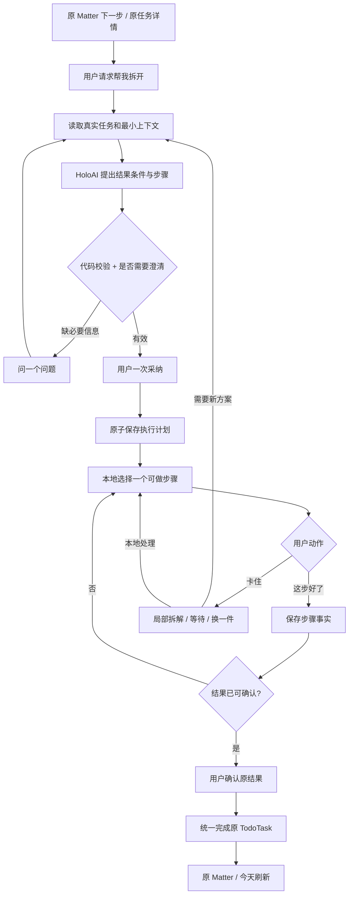

# Holo Matter「分步推进」：ADHD 减负完整实施规格

- 版本：v2，2026-09-25。
- 面向：东林审阅、GLM 直接实施。
- 状态：**实施规格；已核对本地代码，尚未实现、真机验收或上线。**
- 工程根目录：`/Users/tangyuxuan/Desktop/Claude/HOLO`。
- 本文件绝对路径：`/Users/tangyuxuan/Documents/Codex/2026-09-24/ju/outputs/2026-09-25-Holo-Matter分步推进与ADHD减负-完整实施规格-GLM-v2.md`。
- 实施时项目内归档位置：`/Users/tangyuxuan/Desktop/Claude/HOLO/docs/todo/plans/2026-09-25-Matter分步推进与ADHD减负-实施规格.md`。
- **替代**《2026-09-25-Holo-Matter起步辅助与今天衔接-GLM实施方案.md》。“startHint + task_start_assist”不再作为实施方向。
- `holo-adhd-matter-interaction.html` 是已被否定的概念原型，不能作为布局、数据结构、完成规则或验收依据。

---

## 0. 产品结论与不可退让的边界

### 0.1 最终交付什么

在 Matter 原有「下一步」区域内提供 **分步推进**：用户面对一项难以开始的任务时，HoloAI 帮他明确“做到什么算完成”，提出一条保留全部结果要求的执行路径。用户采纳后，Holo 一次呈现一个可执行动作，记住停在哪里，卡住时局部调整；最终由用户确认真实结果，完成原来的待办。

**用户买到的价值是：少想下一步、少记中断位置、少管理一堆新任务，同时不会把“做了一点”误记成“整件事完成”。**

产品中使用「一步步做」「帮我拆开」「卡住了」等普通表达，不要求用户申报 ADHD，不新增 ADHD 模式、诊断标签、独立工作台或导航入口。适用对象包括容易启动困难、遗忘上下文、被大任务压住的用户；实际减负效果必须由用户试用验证。

### 0.2 五项确定的产品决策

1. **入口与执行都融入原 Matter 的下一步卡片。** TaskDetail 提供同一能力的第二入口，不能要求用户先离开 Matter 才能得到帮助。
2. **原 TodoTask 代表一个结果；新步骤属于这个结果内部。** 拆解不增加今天的任务数、不增加 Matter 分母、不生成另一套待办。
3. **AI 只提出计划与修订。** 下一步选择、状态保存、依赖判断、完成和撤回由确定的本地规则执行。
4. **做完步骤与完成任务有不同含义。** 全部步骤做完只使任务进入“可以确认结果”；用户明确确认结果后才完成 TodoTask。最后一步本身就是结果核验时，合并成一次点击。
5. **保留离线执行与直接完成。** 不强迫用户走完 AI 建议流程；用户已在现实中办完，可以直接完成原任务，未做的步骤不能被系统伪造成已做。

### 0.3 第一版完整闭环

必须一起交付：首次拆解 → 一次采纳 → 单步推进 → 中断恢复 → 卡住后局部修订 → 等待与换一件事 → 结果确认 → 撤回 → 今天/详情/小组件/AI 对话一致性。

不把完成语义、跨入口规则或中断恢复推到“后续优化”。首版暂不实现跨 Matter 自动排程、后台不断重写计划、自动联网代办、外部结果自动验真和重复任务模板拆解。

---

## 1. 从减负出发：先定义系统应该接走哪些工作

用户要推进一件事，至少要承担六类工作。这是本方案的设计假设，不是对所有 ADHD 用户的统一描述。

| 负担 | 常见产品造成的额外负担 | 本功能承担的工作 | 可观察的有效性 |
|---|---|---|---|
| 不知道做到什么程度 | 只有“处理报销”这样的标题 | 给出可编辑的结果条件，明确结束点 | 用户能说清什么时候不用继续做 |
| 不知道先做哪一步 | 一次生成十几项清单让用户重新排序 | 本地筛出一个可做动作，其余折叠 | 采纳后无需再次选择便可开始 |
| 第一步仍然太难 | 无限把任务拆得更碎 | 根据障碍拆当前动作，并保留剩余结果义务 | 新动作确实解除当前障碍 |
| 中断后想不起来 | 重新读聊天记录和计划 | 保存当前版本、已做动作、等待原因和可选停留记录 | 重开 App 可直接续上 |
| 没办成却被“完成”迷惑 | 勾完准备项自动完成整个任务 | 结果条件与步骤进度独立校验 | 不出现错误完成 |
| 为了使用工具还要管理工具 | 设置模式、计时、排优先级、同步两套清单 | 按需开启，沿用现有任务与今天 | 新增管理动作少于被省掉的动作 |

**减负约束：**首次生成只确认一次方案；正常执行每步一次点击；不要求每步写总结/上传证据/评价心情；不默认开计时器；不连续弹庆祝；不会因中断、等待或没按计划做而责备用户。

---

## 2. 已核对的 Holo 能力与必须补齐的缺口

以下是 2026-09-25 本地源码事实；不代表生产已有同样版本。

| 现有能力 | 复用方式 | 当前缺口/风险 |
|---|---|---|
| Matter V2 详情：标题、进度、下一步、计划、待确认、底部讨论 | 保留结构，在现有下一步内部展开执行状态 | 下一步现在是展示；计划行可以直接完成根任务 |
| `MatterPlanQuery` 从真实 action link 查询 TodoTask，按 planOrder 取下一项 | 保持任务身份、计数和排序来源 | 没有步骤、依赖、等待和结果条件；相同 order 需补稳定 ID 排序 |
| `launchPlan` 原子创建 Matter、任务、关系等 | 正常创建入口原样复用 | 不能拿它每次拆解时再创建一批任务 |
| `CheckItem` 清单与 TaskDetail、TaskCard | 已有清单按真实 ID 引用 | 最后一项勾选会联动完成父任务，反向取消也联动；没有步骤语义 |
| `TodoCompletionCore` 被 App 和 Widget 共用 | 作为原任务完成的最终写入核心 | 完成父任务会把所有 CheckItem 勾上，不能用它伪造新步骤进度 |
| `HoloTaskCompletionCoordinator` 三秒撤回 | 扩展承载“最后一步 + 父任务”提交意图 | 只有一个 pending 槽；提交时需重验状态，避免与其他入口竞态 |
| 今天的 FocusResolver、Agenda、Matter 概览 | 保持今天排序；从原任务进入原详情 | 不支持步骤作为新排名对象，也不应新增这种对象 |
| Matter 讨论上下文、reconciliation 的候选→校验→应用模式 | 复用上下文范围和提案执行方式 | 现有 snapshot 的下一步没有足够的真实 task/step ID 与结果契约 |
| `TaskTextSplitter` / SubtaskParser | 可借鉴文本解析工具 | 输出不含结果保全、依赖、版本和执行状态，不能直接承担此功能 |
| HoloAI provider、网关、PromptManager、配额和路由 | 增加一个受限用途的 AI 调用 | “AI 会拆任务”不等于已有可执行分步能力 |
| `IntentRouter.handleCompleteTask` | 纳入统一完成入口 | 当前按关键词找到唯一任务后直接 complete，不能把“这步好了”路由成父任务完成 |
| Core Data + CloudKit、现有通知 | 持久化步骤；用户明确选择时安排提醒 | 需要新增模型与同步兼容规则，不能只保存在 SwiftUI state |

**技术判断：生成的微步骤不能直接塞入当前 CheckItem。** 那会触发既有父子级联，并让旧客户端/小组件把“准备完成”误当作“任务完成”。采用新的任务内部步骤记录；它们仍依附同一个 TodoTask，不是一套新的全局任务系统。

---

## 3. 三层结果模型：究竟什么完成了

### 3.1 对象职责

| 层级 | 示例 | 完成的含义 | 谁是事实来源 |
|---|---|---|---|
| Matter | 准备一次出行 | 用户确认整件事告一段落，沿用现有流程 | 现有 Matter 状态 |
| 原任务 TodoTask | 核对并记录护照有效期 | 已读到本人护照的到期日期，并记录到约定位置 | 原 TodoTask.completed / completedAt |
| 执行步骤 | 找到护照；打开资料页；记录到期日期 | 某一个可观察动作已做，或该动作对应的结果成立 | 执行步骤状态；引用清单项则读取 CheckItem |

Matter 的 `2/6` 仍表示 6 个原任务完成了 2 个。一个任务拆成 8 步也不变成 `2/13`。步骤内部不用百分比，不将“多拆几次”计为多完成工作。

### 3.2 原任务结果契约（Outcome Contract）

在第一次采纳方案时一起确认，至少包含：

- `outcomeSummary`：一句人能理解的结果。
- `requirements[]`：必须保留的结果要求，带稳定 requirement ID、内容、来源与来源 ID。
- `verificationPrompt`：最后如何由用户确认结果；不默认索要附件。
- `sourceFingerprint`：建立契约时所依据的任务正文、清单集合与必要上下文版本。
- `scopeChanges[]`：如有明确增减范围，列出差异并由用户采纳；默认不得缩减范围。

来源优先级：用户本次明确说明 > 当前任务正文与已确认清单/约束 > Matter 已确认事实。历史推测和待确认事项只能作为问题，不能写成已确认义务。

任务名“做报销”不足以判断是整理材料、提交还是到账时，AI 只问一个必要问题，例如“这次是准备好材料，还是提交成功？”默认建议可以给，但必须标为建议。答案进入候选预览；不反复问已经写在任务中的条件。

### 3.3 四条完成不变量

1. **准备 ≠ 结果。** 找到护照不等于记录有效期；打开报销系统不等于提交成功。
2. **步骤都完成 ⇒ readyToConfirm；不直接推出 TodoTask.completed。**
3. **用户明确确认原结果 ⇒ 可以完成原任务。** 用户可绕过建议过程，在现实中已经办完时直接完成。
4. **父任务完成不反向证明每一步都做过。** 跳过的步骤保留其历史状态，仅停止展示为待推进；分析也不能计为执行完成。

最后一个必要动作本身能同时核验结果时，按钮写成具体表达，例如「已记录日期，完成任务」。一次用户断言同时提交最后一步和根任务，不能先把根任务自动完成再补一句解释。

### 3.4 原有清单如何融合

- 已有 CheckItem 继续归原任务管理；计划节点通过 `sourceCheckItemID` 引用它，不复制标题和完成布尔值作为第二份真相。
- 生成计划必须交代每一个未完成的原清单项；不得因换一种措辞而遗漏它。
- 需要把原清单项拆小：新增准备/执行步骤，再保留指向该 CheckItem 的收尾节点。只有该清单项的真实条件成立时，才显式勾选它。
- 采纳分步推进后，**这个任务**的清单全勾不再自动完成父任务，进入结果确认。普通未开启分步推进的任务保持原逻辑。
- 删除或改写原清单项会使相关计划需要复核，不把删除当作完成。用户确认取消某项义务后，才通过新版本移除该引用。
- 用户后来新增清单项时，当前计划立即标为需补齐；已有步骤可以继续，最终“按计划完成”被阻止，直到新项已纳入或用户明确直接确认全部结果。

---

## 4. 原界面里的完整交互

### 4.1 Matter 结构保持

沿用：标题/时间 → 原进度 → 原灰色下一步区域 → 原计划列表 → 原待确认事项 → 原底部「和 Holo 讨论这件事」。保留现有颜色、圆角、字体、间距、返回和更多菜单；不要照旧 HTML 重画 Matter。

只修改下一步卡片的内部状态；计划行保留任务身份与完成按钮，可以通过现有/新增轻量详情入口查看任务。按钮与行点击范围分开，不把原完成点击偷偷改成进入分步。

```text
未开启                            采纳后
下一步                            下一步 · 核对并记录护照有效期
核对并记录护照有效期              找到护照，翻到资料页
                                  做到：能看到到期日期
帮我拆开                          [这步好了]   卡住了
                                  查看步骤 ···
```

不是增加第二张“专注卡”；灰色卡片本身获得执行能力。长内容只展开必要说明；完整步骤在原生 sheet 中查看，不撑高整个页面。

### 4.2 首次拆解

1. 用户在下一步点「帮我拆开」。立即原地显示可取消的生成状态，原任务与完成入口仍可用。
2. Holo 收集这个任务已有信息。只有缺失信息决定结束点或第一步是否可执行时，问一个问题。
3. 原生预览 sheet 展示：
   - 原任务标题；
   - 「做到这里就算完成」一句话，可编辑；
   - 通常 2–5 个步骤，最多 7 个初始叶子；本来只需一步就只给一步；
   - 首个动作明确标注；其他条件点开查看；
   - 唯一主要按钮「按这个推进」，次要「先不用」。
4. 一次采纳原子保存结果契约和计划，关闭 sheet，回到同一个 Matter 下一步区域。
5. 预览不创建 TodoTask、提醒、今天安排或已完成记录。关掉预览原任务不变。

结果条件与计划一起确认，避免“先确认目标、再确认拆解、再确认加入今天、再确认开始”四次批准。

### 4.3 正常推进

- 当前卡片显示一个动作和一个短完成条件；不用暴露节点类型、依赖、模型版本。
- 用户点「这步好了」：本地保存当前步骤，立即呈现下一条可做动作；轻量文字回执「已完成：找到护照」，提供撤回。
- 不调用 AI，不强制输入证明，不跳聊天页，不出现计时惩罚。
- 如果这步产物是后续必须用的信息，可以提供非必填短记录，例如“日期记在备忘录”；不强制上传证件或记录证件号码。
- 所有必要步骤处理完后展示结果条件与「结果已达成，完成任务」。若最后一步已完整覆盖核验，使用合并按钮，只点一次。

### 4.4 卡住了：先解除障碍

点「卡住了」打开小型操作面板，优先三项：

| 操作 | 系统做什么 | 不做什么 |
|---|---|---|
| 这步还是太大 | 对当前未完成叶子发起局部修订 | 不重写已完成步骤，不新增整批 TodoTask |
| 现在做不了 | 用户可选写原因；选择等待或换一件事 | 不把等待记为完成，不自动改截止日期 |
| 不知道怎么做 | 将当前步骤和结果条件带入现有 Matter 讨论；回答可带受控计划修改提案 | 不让用户重新解释整件事，不直接执行模型文本 |

附加「这步不需要」放在更多操作。其含义是申请调整计划范围，不等于完成。属于原结果义务时显示影响，例如“取消这步后，仍需确认提交成功”；变更结果义务必须明确确认。

用户主动说“现在没精力”时，优先找仍有意义、无前置障碍的较小动作；如果没有，就允许暂时离开。不能为了留下用户而制造“打开 App”“深呼吸一次”之类与任务无实际关系的清单。

连续两次拆解仍被拒绝时，停止同义改写，问一个具体障碍问题；这不是两次使用配额，用户仍可手改、继续或退出。

### 4.5 等待与换一件事

- 等待记录用户明确提供的原因，如“等同事发票”；如愿意，可选「明天提醒我」，复用通知能力，默认不新增提醒。
- 到提醒时间只进入“可以检查一下”的状态，不认定同事已回复或任务完成。提醒使用单独的 execution/task/step 标识，在现有通知服务内增加调度入口；不得借修改原任务 dueDate 实现。完成、恢复、改期或删除时取消旧提醒，操作重放不重复安排。
- 当前任务存在其他无依赖的动作时优先继续同一任务；否则显示等待原因及「换一件能做的」。
- 换一件事时，在同一 Matter 内给最多 3 个可推进原任务，用户选一次。保存本机当前选择，不改 planOrder、优先级、截止日期或 Today 排名。
- 全部等待时坦率显示“这件事目前在等资料”，可返回原 Matter。没有可做工作时不编造准备项。
- 第一版不建立跨任务依赖推理图。只有已明确存在的约束才能阻止动作；不知道的依赖由用户说明后进入提案。

### 4.6 中断与恢复

无需先点“暂停”。每一步完成、等待、采纳都已保存。退出、杀进程、隔天回来，直接从当前有效版本推导下一步。

可选「记一下停在哪」允许留一行用户记录，下次卡片显示。系统不能因为用户离开了五分钟，就推断护照已经找到了。长时间未操作不丢进度、不加红色落后提示、不每天自动重排。

### 4.7 今天的衔接

- 今天现有结构与 FocusResolver 排序保持。原任务何时进入今天，仍按原日期和调度规则。
- 今天的 Matter 紧凑行继续展示原标题、原任务完成数；点开还是原 Matter。
- 如果今天当前焦点/Agenda 已经是这个原任务，点入现有 TaskDetail 后显示同一个分步组件与同一状态。
- 微步骤不会进入 Agenda、焦点候选、逾期数量、任务通知队列或 Matter 分母。
- 从 Matter 开始分步不等于“加入今天”。无日期任务不会因拆解被偷偷设置为今天。
- 完成原任务触发现有数据更新链路；今天重新读取原任务完成状态。没有第二次“同步到今天”按钮。
- 不复用当前 postpone 重建候选时丢失 Matter/habit 的路径来实现续做；该问题单独修复，不能成为此功能依赖。

### 4.8 可访问性与状态文案

主按钮点击区域至少 44pt；支持动态字体、VoiceOver 朗读任务/步骤/完成条件/操作；状态变化用简短可访问性提示，不抢焦点。减少动态效果开启时只替换文本。完成、等待、失败不能仅靠颜色区别。生成失败显示「这次没拆出来，可以重试或自己写一步」，不说用户任务不够清楚。

---

## 5. AI 到底怎么拆：保全结果，而非制造动词列表

### 5.1 输入边界

一次调用只带：当前 Matter 的必要已确认背景、原任务真实 ID/标题/说明/必要时间约束、结果契约、原清单真实 ID 与状态、当前有效步骤结构、已完成步骤和用户自愿留下的产物、当前障碍。

默认不检索整个财务库、健康记录、所有聊天或生活记忆。明确关联的笔记/资源有必要时在现有授权下带入限定片段。待确认事实与已确认事实分开，材料内容当作资料，不能覆盖系统规则或伪装成执行指令。

### 5.2 模型承担的五件事

1. 判断是否足以定义结果；不足则提出一个必要澄清。
2. 识别当前真正障碍，决定给一步、几步、等待还是建议人工补充。
3. 给每一步写具体动作与完成条件，保证在现有条件下可执行。
4. 声明各步骤与原结果义务的对应关系，保留没有解决的部分。
5. 提出最小修改，不改完成状态、任务日期、优先级或 Matter 结构。

动作写成“对象 + 可执行行为 + 可观察结束点”，例如“在护照资料页找到到期日期，记到任务备注”。避免“了解一下”“认真整理”“准备好所有东西”等没有结束点的词。预计时长若提供只能是可选估计，不作为截止或完成判定。

### 5.3 允许的拆解方式

**A. 完整细化（refine）**

原动作“核对并记录护照有效期”：

- 找到本人护照，翻到资料页；
- 找到到期日期；
- 记录日期，并核对与证件一致。

原动作变成结构分组，其完成由必要子步骤推导；原任务仍等待结果断言。分组自身不再出现独立“完成”勾选。

**B. 降低启动门槛（prepend preparation）**

只知道可以“打开报销系统”，还不知道如何填报时：

- 新增“打开报销系统”准备动作；
- **保留“完成填报并看到提交成功”剩余动作及其原结果条件。**

不能把一个准备动作替换整个提交义务。界面不用显示“残余节点”，只显示尚未做完的实际工作。

**C. 等待/求助**

没有发票时，提出“向同事要发票”以及“等收到后继续填报”。发出请求与收到发票是两种状态，AI 不能因为写出了请求文案就说已发送或已收到。Holo 没有相关执行器时，只提供用户可复制的内容。

### 5.4 硬规则与语义校验

代码必须拒绝：未知对象 ID、跨任务修改、修改已完成叶子、重复节点、依赖循环、依赖自指、缺失被引用清单、无结果条件、超限输入、把不确定事实写成事实、未声明的范围缩减、给已完成/删除/归档任务套计划。

每一项原要求在提案中必须由保留节点或终端核验节点覆盖；覆盖映射是必要条件。**覆盖字段齐全不证明语义正确。** 还需固定反例评测、保留剩余工作、用户预览以及最后的真实结果确认。不能用同一个模型说“我已经覆盖”充当验收。

对于不可确定完整替代的拆解，执行器默认采用准备动作 + 原义务保留；不能猜测省略。只有用户明确改变结果范围才删除义务。

### 5.5 粒度与增长控制

首个方案通常 2–5 步，最大 7 个活动叶子；整个任务活动叶子上限 24、结构层级上限 3。达到上限时帮助用户合并或修改当前动作，不继续展开更多层。限制只影响新提案，不阻止已有步骤完成或用户直接完成任务。

步骤不追求越小越好。用户可以觉得“打开文件并填两栏”是一件事；不强拆成移动鼠标、点击按钮。零价值动作和循环缩写视为质量失败。

---

## 6. 调度：谁什么时候调用谁

### 6.1 两种调度各司其职

| 调度 | 责任 | 触发 |
|---|---|---|
| AI 请求调度 | 生成候选、解释障碍、局部修订 | 用户主动首次拆解、请求拆小、说明新障碍或要求修订 |
| 本地执行调度 | 找当前可做叶子、记状态、恢复、处理等待、完成原任务 | 采纳、勾选、撤回、打开页面、同步到达 |

后台 Agent 不订阅每次勾选自动重拆。既有 Matter reconciliation 不得同时生成第二套执行计划；涉及步骤的修改统一交给本功能命令入口。



### 6.2 本地选择算法

1. 读取有效计划版本；若同步不完整、并发分叉未解决或结果契约过期，展示明确状态，不猜测新版本。
2. 排除已完成、已明确取消、等待中的叶子与结构分组。
3. 只选所有必要依赖已经满足的叶子。并行步骤不因显示顺序被制造成强依赖。
4. 若用户上次选择的叶子仍可做，继续；否则按当前计划稳定 order、UUID 选第一项。
5. 无可做叶子：有等待则显示等待；有契约缺口则请求复核；全部必要叶子满足则进入结果确认；其他情况视为数据/依赖错误，不显示完成。
6. 同一 Matter 更换原任务仅在用户选择后发生；默认继续沿用现有 planOrder。外部删除/完成当前任务时本地选择下一原任务。

本机“正在看哪个动作”的游标是 UI 偏好，不是业务完成事实。业务状态跨设备同步，游标不需要跨设备强抢焦点。

### 6.3 AI 请求生命周期

- 新增独立用途 `matter_execution_plan`，复用 HoloBackendAIProvider、网关、身份验证、配额和 Persona；不另建模型直连。
- 操作枚举 `initial / refine / repair`；请求带 requestID、taskID、baseRevisionID、sourceFingerprint 和当前用户意图。
- 同一 task 同时最多一个有效请求；后来的明确修订取代旧请求。离开生成页可取消；旧结果晚到不得自动落库。
- 候选只在当前会话内保存，杀进程后清除 loading。已采纳的计划完整持久化，断网仍可执行。
- 单次建议超时 20 秒；无效结构最多一次修复重试，总等待不超过 30 秒。模型调用不得被重试循环无限放大。具体 P95 延迟需实测，不把目标写成已达到。
- 结果回来后重验源指纹；采纳时再验一次。期间任务改了、完成了或删了，候选失效，提示按当前内容重新生成。
- 完成步骤/恢复/查看计划/切换可做步骤：AI 调用次数严格为 0。

### 6.4 请求与返回契约示意

下面为待实现契约示意，不是当前后端已有能力。客户端生成真实实体 ID，模型只能引用输入已有 ID 或使用本次候选局部 ref。

```json
{
  "schemaVersion": 1,
  "requestID": "client-request-id",
  "operation": "refine",
  "taskID": "existing-task-id",
  "baseRevisionID": "accepted-revision-id",
  "sourceFingerprint": "canonical-input-hash",
  "targetStepID": "existing-unfinished-step-id",
  "userObstacle": "这步太大了",
  "outcome": {"summary": "记录并核对护照到期日期", "requirements": []},
  "sourceChecklist": [],
  "executionSnapshot": {},
  "confirmedContext": [],
  "unconfirmedContext": []
}
```

```json
{
  "schemaVersion": 1,
  "requestID": "client-request-id",
  "kind": "proposal",
  "outcomeSummary": "记录并核对护照到期日期",
  "verificationPrompt": "已经记录日期，并和证件核对一致了吗？",
  "patch": {
    "mode": "prepend_preparation",
    "targetStepID": "existing-unfinished-step-id",
    "newSteps": [
      {
        "ref": "s1",
        "action": "找到护照，翻到资料页",
        "doneWhen": "可以看到到期日期所在的位置",
        "role": "preparation",
        "dependsOn": [],
        "coversRequirementIDs": []
      }
    ],
    "retainTarget": true
  },
  "scopeChanges": []
}
```

返回联合类型还包括 `clarification {question, suggestedAnswers}`、`cannotHelp {reason, suggestedManualAction}`。拒绝自动携带 `completed=true`、`dueDate`、创建 TodoTask 或外部发送动作。完整 refine 必须声明替代范围、保留节点、依赖重接和覆盖义务；执行器校验后分配 UUID。模型输出未知字段不能变成隐藏副作用。

---

## 7. 数据模型、状态机与原子命令

### 7.1 为什么需要新增内部步骤对象

TodoTask 是原结果事实；CheckItem 有现存级联语义且被旧客户端理解。新增内部步骤实体能保留它们的身份与兼容性，同时提供步骤等待、结果条件、依赖和修订。不能新建“微任务 TodoList”，也不能把整个执行状态只塞进聊天文本。

**采用三个新实体 + TodoTask 上两个兼容字段。** Core Data/CloudKit 字段使用可迁移的 optional/default，关系遵守现有 CloudKit 模型约束，不依赖 CloudKit 不支持的唯一约束。所有读取都以真实 taskID 校验归属。

### 7.2 实体定义

#### A. TodoTask 新字段

- `executionSchemaVersion: Int16`，默认 0；采纳后为 1。用于所有入口识别任务完成策略，不能仅靠 UI feature flag。
- `activeExecutionRevisionID: UUID?`，本地快速定位提示；完整版本选择还需验证版本链，不把可能迟到的云端指针当唯一事实。

原 `completed / completedAt / dueDate / repeatRule / list` 等字段继续为唯一对应事实。

#### B. HoloTaskExecutionRevision：已采纳的不可变计划版本

| 字段 | 含义 |
|---|---|
| id / taskID / originMatterID | 身份、原任务归属、来源 Matter |
| parentRevisionIDsJSON | 正常一个父版本；并发分叉解决时可有多个 |
| operationID / createdAt / schemaVersion | 采纳幂等、时间、格式版本 |
| sourceFingerprint | 用户采纳时的必要输入快照 hash |
| outcomeContractJSON | 结果摘要、requirement ID、来源、核验问题、已确认范围变化 |
| topologyJSON | 节点 ID、分组关系、稳定顺序、必要/可选、依赖、覆盖关系；不存完成状态 |
| acceptedSourceRaw | userAcceptedAI / manual / conflictResolution |
| deletedAt | 软删除与同步处理 |

历史版本不覆盖，便于解释“为什么变了”和恢复。禁止把所有历史正文持续拼进 AI 请求。取消某个可选动作通过新版本移除其活动引用表达，历史节点保留；不把旧版本所有节点都算进当前必要步骤集合。初版不自动清理仍可用于撤回/解决分叉的历史版本；永久清理随原任务生命周期执行，后续归档策略不得静默删除用户恢复所需记录。

#### C. HoloTaskExecutionStep：动作内容与执行事实

| 字段 | 含义 |
|---|---|
| id / taskID / createdAt / deletedAt | 身份与归属 |
| kindRaw | action / sourceCheckItemReference / group |
| actionText / doneWhen | 生成/手写动作的内容与结束点；采纳后改内容产生新节点 |
| sourceCheckItemID | 引用原清单项；引用节点不维护另一份 completed |
| stateRaw | action 的 pending / waiting / done；取消由版本范围表达，不能伪装成 done |
| stateVersion / stateChangedAt | 本地并发校验 token、状态变更时间 |
| completedAt | action 的用户明确完成时间；未做不写 |
| waitReason / reviewAfter | 用户明确等待原因和可选检查时间 |
| userResumeNote | 用户主动留下的简短停留位置/产物说明 |

`group` 的状态纯派生，不能写 done。引用节点显示标题和完成状态直接取 CheckItem；引用不存在时是 brokenReference，不是 done。等待元信息可属于引用节点，但真实清单已被用户勾选时以源完成事实为准并清除本地等待展示。

正文变化通过新节点 ID 表达，原已完成节点继续保留；无变化节点跨版本引用同一 ID。重写一个已做步骤的文字不能让历史看起来做过另一件事。

#### D. HoloTaskExecutionReceipt：命令回执与审计

- id、operationID、taskID、revisionID、stepID?、commandRaw、actorRaw、sourceSurface、createdAt、expectedStateVersion?、beforeStateJSON、afterStateJSON、outcomeAssertion?、revertsReceiptID?。
- 回执用于幂等、解释和安全撤回；不充当另一份任务状态或任意正文日志。
- 最小化内容，禁止存模型原始对话、附件、隐私证件信息。用户结果断言只记录必要摘要和针对哪个契约版本。
- 应用内可先本地查 operationID 幂等；同步合并后逻辑去重同 operationID，不能声称 CloudKit 提供全局事务唯一性。

### 7.3 派生状态

| 任务执行视图状态 | 进入条件 | 可用动作 |
|---|---|---|
| absent | 未采纳方案 | 帮我拆开；原完成 |
| ready | 有可做叶子 | 完成步骤；卡住；查看 |
| waiting | 无可做叶子且有真实等待 | 查看原因；恢复；换一件 |
| needsReview | 原结果来源变动、引用缺失、并发分叉 | 复核差异；继续未受影响步骤；直接确认结果 |
| syncing | 版本引用的节点尚未同步完整 | 说明同步中；原任务仍可直接完成 |
| readyToConfirm | 必要叶子满足且契约有效 | 确认原结果 |
| rootCompleted | TodoTask 已完成 | 查看历史；沿用原重新打开 |
| unavailable | 删除、归档、权限不足或不支持的任务类型 | 沿用原任务处理，不生成新计划 |

候选 generating/preview/error 属于临时 UI 请求状态，不冒充已采纳的业务状态。

### 7.4 必须统一的命令服务

实现 `HoloTaskExecutionService`，包含：

- `adoptProposal(expectedFingerprint, proposal, operationID)`；
- `completeStep(stepID, revisionID, expectedStateVersion, operationID)`；
- `reopenStep(...)`；
- `setWaiting(...) / resumeStep(...) / saveResumeNote(...)`；
- `revisePlan(...) / resolveRevisionConflict(...)`；
- `requestCompleteOutcome(revisionID, optionalFinalStepID, userAssertion, operationID)`；
- `completeRootDirectly(taskID, sourceSurface, explicitUserIntent, operationID)`。

一次业务命令在同一个 Core Data context 事务中验证、修改、写回执并 `save` 一次；失败全部 rollback，界面不出现一半成功。不要循环调用每次自行 save 的 addCheckItem 来假装原子采纳。

**共享完成核心的依赖方向：** App 的命令服务可以使用共享的纯策略和持久化核心；Widget/通知不能依赖 SwiftUI、主 App 单例或 AI provider。根完成策略、兼容字段和必需模型声明加入实际使用的共享 target。App 与 Widget 都通过 `TodoCompletionCore` 的统一策略提交根事实，App 外层再提供三秒体验。由完成核心或其共享事务入口写最小来源回执，不能在 Widget 中调用主 App 的 Coordinator。

步骤完成命令校验该节点仍在活动版本、归属一致、依赖满足，且没有被明确等待或移除。用户在现实中越过前置条件做完时，可直接确认原任务，或明确修订依赖；不能静默忽略依赖。分组完成纯派生，optional 步骤不阻塞结果确认；将 required 改成 optional 属于需确认的计划范围变化。

状态通知在成功保存后发出：复用 `.todoDataDidChange` 和现有 Matter/Today 刷新、Widget reload 机制；避免每个节点发一次刷新。执行模型订阅任务变化以校验候选/活动版本，不依赖页面刚好重绘。

### 7.5 指纹、版本与幂等

**将候选新鲜度与已采纳计划的有效性分开，不能每做一步都让自己的计划过期。**

- `proposalSnapshotFingerprint`：规范化序列化 + 稳定 hash，覆盖 taskID、标题/说明、影响执行的约束、原 checklist ID/内容/状态、有效 revision、目标步骤 stateVersion、相关已确认事实。请求/提案中的 `sourceFingerprint` 是这个字段的传输名称，用来拒绝迟到候选。
- `contractBasisFingerprint`：只覆盖结果义务相关内容与来源集合，例如任务结果描述、checklist 的 ID/内容/必要性、已确认约束；不包含步骤完成状态、普通清单勾选、等待切换和浏览游标。存入 outcomeContract，作为已采纳契约是否需要复核的依据。
- 正常 completeStep / toggleCheckItem 会使旧候选快照过期，但**不会**让已采纳计划自动进入 needsReview。新增、删除或改写义务才触发契约复核。
- UI 展开状态、无关账本变化均不进入这两类指纹。截止日期仅在影响结果或执行约束时进入契约依据。

任何候选采纳均重验；当前节点必须仍属于有效版本且未完成。重复点击、同一网络回包、同一个 operationID 重放不得生成第二份版本或第二次完成。

根任务完成核心提交前再次验证未删除、未归档、未被其他入口完成；已完成返回幂等成功，不再触发重复任务下一轮创建。

---

## 8. 完成、撤回和跨入口一致性

### 8.1 完成矩阵

| 操作 | 步骤状态 | 原任务 | Matter / 今天 |
|---|---|---|---|
| 完成一个准备步骤 | 只完成该动作 | 保持未完成 | 原任务数量/完成数不变 |
| 最后一个普通步骤完成 | 必要步骤满足 | readyToConfirm，未完成 | 不增加原完成数 |
| 合并按钮确认最后动作和原结果 | 最后步骤与根完成同一提交 | 完成 | 按原链路刷新 |
| 用户在原列表勾选整个任务 | 保留步骤实际历史 | 直接完成，来源 explicitRoot | 更新一个原任务 |
| 用户在外部已办好，再来完成 | 未做步骤不被补勾 | 直接完成 | 同上 |
| 原清单全勾，已启用分步 | 清单引用真实完成 | 仍需原结果确认 | 不自动完成根 |
| 没启用分步的普通任务 | 原逻辑 | 原逻辑 | 原逻辑 |
| 所有原任务完成 | 步骤无额外作用 | 已完成 | Matter 保留现有整件事结束确认 |

### 8.2 三秒撤回与最终提交

- 普通步骤完成本地即时保存，提供轻量撤回；不占用原根任务完成的全局 pending 槽。
- 最后一步合并完成时，扩展现有 `HoloTaskCompletionCoordinator.Pending`，记录 taskID、revisionID、finalStepID、expected state token、结果断言、operationID。
- 三秒内只是 pending UI，不提前保存最终步骤或根完成；撤回取消整个意图，之前其他已做步骤不受影响。
- 到期通过统一事务再次验证并同时保存“最终步骤 + 原任务 + 回执”。失败显示未完成状态和可重试操作。
- 沿用现有单 pending 规则：用户请求完成另一任务时，先提交前一个并重验；不得丢掉其最终步骤动作。需要有专项测试覆盖。
- 小组件/通知沿用各自即时提交体验，不伪称也有三秒撤回；但必须使用相同根完成语义。

### 8.3 撤回、重新打开的细则

- 撤回普通步骤只恢复该步骤原状态，不删除后续已经发生的真实完成记录。
- 已经有后续依赖动作被完成时，撤回上游会标记受影响链需复核；这些后续记录不能被系统假装“从未发生”。用户可重新确认上游或修订依赖。
- 若根任务已经完成后用户明确重新打开内部步骤，新客户端在同一事务中重开根任务并使旧结果断言失效；不能出现根仍完成、用户却正在补做必要步骤的无提示矛盾。
- 从原任务入口重新打开根任务：保留步骤完成历史。若全部步骤原本已做，展示结果复核，可重新确认或选择要继续处理的动作，不一律清空进度。
- 旧版客户端改变根状态：把根状态视为外部事实，保留内部步骤历史；新客户端不强行自动反转用户在旧版的操作。
- 跨设备发生更新后撤回须验证当前状态 token；不匹配时展示“状态已在其他设备更新”，不能覆盖较新的动作。

### 8.4 所有完成入口必须覆盖

实施时搜索所有 `completeTask / toggleTaskCompletion / TodoCompletionCore / toggleCheckItem` 调用点，逐个归类，不只修 MatterDetail。

1. MatterDetail 计划行：保留直接完成任务；换成统一可报错命令，去掉吞错误的 `try?`。
2. TaskDetail 和 TaskCard：已启用分步的任务禁止“全清单完成/删除最后项 → 自动完成根”的隐式级联。
3. Today Agenda/TaskSection/任务列表：统一根完成语义与回执来源。
4. Widget 与通知：通过共享完成核心识别 executionSchemaVersion；新客户端完成根时不把生成步骤或原清单补勾成虚假事实。
5. AI 对话：必须明确动作目标，见下一节。
6. 批量完成与其他同步/导入入口：不能让 feature flag 决定数据语义；未知历史操作按外部根完成保留事实。

### 8.5 AI 对话与执行计划的边界

扩展 Matter chat context，明确携带 scope=matter/task/step、真实 ID、原结果条件、当前步骤、revision 和 fingerprint。使用已有 Matter 讨论入口，不另开聊天产品。

| 用户表达 | 处理 |
|---|---|
| 在步骤上下文说“这步好了” | 目标绑定当前 stepID，走 completeStep；不进入按标题完成父任务的 handler |
| “整个报销已经提交成功了，完成这个任务”且唯一明确绑定任务 | 记录用户对原结果的明确断言，走统一根完成 |
| “完成了”但当前既可能指步骤也可能指原任务 | 一次简短目标确认，提供“当前这步 / 整项任务” |
| “帮我拆小点” | 生成同一 revision 的局部提案，展示采纳；不直接写状态 |
| 问“接下来做什么” | 能本地确定就返回当前叶子；不重新生成整套计划 |

当前 IntentRouter 按关键词命中唯一任务就完成，必须在 managed execution 任务上加 scope/explicit intent 校验。一个用户意图只能由一个命令处理器落库，禁止 IntentRouter 与 Matter reconciliation 各执行一次。AI 回复“已完成”必须在命令成功后产生，不能提前宣布。

---

## 9. 同步、兼容、删除与回退

### 9.1 CloudKit 并非跨设备原子数据库

本地采用单次事务，云端记录仍可能分批到达。计划引用节点不齐时进入 syncing，禁止把缺失节点视为已完成，也不退回旧清单自动完成规则。

- 正常版本追加 parentRevisionID，接受版本正文不可变。
- 同一父版本在两台设备离线被修订，形成两个分支；识别多个未被后继版本收敛的 head，进入 needsReview。
- 展示简短差异，用户选择保留哪版；生成引用两个 head 的解决版本。两版历史不删，重用节点的完成事实继续保留。
- 并发更新同一步状态沿用 CloudKit 的现有合并机制，不能承诺全局严格先后；回执帮助解释，冲突后重新读取实际状态。不得设计一边 done、一边 waiting 的双字段真相。
- 使用同一个逻辑 operationID 的重复版本/回执在查询时去重；不要仅依赖本机内存 Set。

### 9.2 旧客户端兼容的实际边界

旧版本只会看到原 TodoTask 与原 CheckItem，看不到新增微步骤，因此微步骤不会触发旧版父子级联。但旧版仍可能按旧规则勾完原 CheckItem 自动完成根任务，新功能无法修改已安装的旧二进制。

因此：

- 新版看到这种根完成，视为外部完成，不伪造新步骤进度、不自动撤销根完成。
- 若要求所有设备都严格执行结果确认，需要全设备升级门槛；未验证旧版往返前只能有限灰度，不能宣传强一致语义。
- 小组件与 App 的共享模型注册必须同步；旧版打开新增 schema 的实际兼容性必须测试，不能仅凭轻量迁移推断通过。

### 9.3 删除与归档

原任务软删除/归档：停止新生成与提醒，执行计划隐藏但随原任务保留可恢复信息；原任务永久删除：按真实归属清理 revision、step、receipt 和提醒，遵守现有云同步删除策略，不能只删 UI。

删除 Matter 不意味着任意删除共享原任务。执行计划归 taskID；originMatterID 只是来源。解绑后原任务仍存在时，TaskDetail 可以继续使用，Matter 不再展示它。

账户退出、数据重置、导出和恢复要纳入新实体；不得将用户的执行笔记留在全局偏好、日志或其他账号。导出明确分开根任务完成和步骤事实。

### 9.4 灰度与回退

分离三个开关：入口展示、AI 新生成、既有计划执行读取。数据语义由 executionSchemaVersion 固定，不随营销/灰度 flag 改变。

紧急关闭 AI：保留手动执行与原任务完成。关闭入口：保留 TaskDetail 中已有计划的只读/基本执行入口及统一完成策略。不能关闭 flag 后让清单又自动完成已管理的任务。

模型迁移只加字段/实体，不删既有字段。回退为兼容读取旧计划的版本，不声称可以无损安装任意旧包。生产 schema 发布与后端发布均需东林明确授权；本规格不包含自动部署授权。

---

## 10. 两个完整用户旅程与反例

### 10.1 核对并记录护照有效期

原 Matter“准备出行”，原任务“核对并记录护照有效期”，原结果“日期已记录且核对一致”。不在此任务中自行推断任何目的地签证规则。

1. 帮我拆开 → AI 给“找到护照 / 找到日期 / 记录并核对”。采纳一次，原 Matter 任务数不变。
2. 完成“找到护照”。根任务仍未完成，今天原数量不变。
3. 中断，次日打开 Matter，显示“找到到期日期”，无需翻聊天。
4. 用户说这步太大：如果实际障碍是看不懂页面，先问/说明位置；不能又让他去找已经找到的护照。
5. 最后点“已记录并核对，完成任务”。三秒后步骤与根任务原子完成；Matter 原任务数 +1 完成。
6. 用户撤回：最终步骤和根任务均不提交，前面找到护照的事实保留。

### 10.2 提交报销，等待资料并在外部办完

原结果“报销系统显示提交成功”，已有清单“收集发票、填写报销单”。

1. 计划引用原清单 ID，不复制出两份同名清单。
2. 拆“收集发票”时，先做“列出缺的发票”，原“收集发票”义务仍保留。
3. 等同事发票：记录等待；不生成“等待完成”勾选，不把任务设成今天。
4. 用户选择同一 Matter 另一个可做原任务。原计划顺序和日期不改。
5. 第二天同事发票到了，用户在公司系统直接办完所有手续。
6. 回 Holo 原列表直接完成“提交报销”：根任务完成；从未逐步勾过的执行步骤保持未执行历史，不要求用户补打卡。
7. 之后重新打开任务处理被退回的报销：旧结果断言失效，保留真实历史，用户说明退回原因后局部修订。

### 10.3 必须失败的方案

- “完成毕业论文”拆成“打开文档”，点击后论文任务被完成。
- 把“提交报销”改成“准备好材料”而没有让用户确认结果变化。
- 每完成一步自动调用 AI，十步产生十次重排。
- 已做 A、B，卡住 C 后重生成 A、B、C，并丢失历史。
- 拆了 12 步，让今天出现 12 项或 Matter 分母增长。
- 用户没精力，系统不停推荐没有产出的“打开页面”刷完成数。
- 云同步缺少最后节点，就认为所有已加载节点完成、自动完成父任务。

---

## 11. 工程文件地图与实施顺序

### 11.1 实施前规则

先执行 `git -C /Users/tangyuxuan/Desktop/Claude/HOLO status --short`，阅读当前 AGENTS/CLAUDE 和模块规范。不要覆盖并行改动。本轮只读检查时已有 `Localizable.xcstrings` 修改与一份想法模块未跟踪方案；实施时需重新检查，不以此清单为固定事实。

遵循：

- `/Users/tangyuxuan/Desktop/Claude/HOLO/docs/standards/Holo-Agent研发与验收规范.md`
- `/Users/tangyuxuan/Desktop/Claude/HOLO/docs/standards/PROMPT_GUIDELINES.md`

实施者可以调整私有类型名和文件组织，但不能缩减上述产品语义。发现现有实现已变化，先更新事实表和受影响文件，不另起一个不同产品。

### 11.2 现有文件与改动职责（绝对路径）

| 文件 | 必要改动 |
|---|---|
| `/Users/tangyuxuan/Desktop/Claude/HOLO/Holo/Holo APP/Holo/Holo/Views/Matter/MatterDetailView.swift` | 原下一步内部融合；保留结构；完成报错；同一计划刷新 |
| `/Users/tangyuxuan/Desktop/Claude/HOLO/Holo/Holo APP/Holo/Holo/Services/AI/Matter/MatterPlanQuery.swift` | 稳定 root 排序；原计数不变；提供执行状态读取挂点 |
| `/Users/tangyuxuan/Desktop/Claude/HOLO/Holo/Holo APP/Holo/Holo/Views/Tasks/TaskDetailView.swift` | 共享分步组件；清单级联策略；保存编辑后再建快照；避免双 NavigationStack |
| `/Users/tangyuxuan/Desktop/Claude/HOLO/Holo/Holo APP/Holo/Holo/Views/Tasks/TaskCardView.swift` | managed task 清单全勾/撤回/删除规则一致 |
| `/Users/tangyuxuan/Desktop/Claude/HOLO/Holo/Holo APP/Holo/Holo/Views/DailyKanban/DailyKanbanView.swift` | 维持原入口，验证今天刷新，不新增结构 |
| `/Users/tangyuxuan/Desktop/Claude/HOLO/Holo/Holo APP/Holo/Holo/Services/Today/HoloTodayFocusResolver.swift` | 原排名保持，补不被 microsteps 污染的回归验证 |
| `/Users/tangyuxuan/Desktop/Claude/HOLO/Holo/Holo APP/Holo/Holo/Services/Today/HoloTodaySnapshotBuilder.swift` | 原 task 完成刷新；必要时携带已有计划标记，不引入子步骤候选 |
| `/Users/tangyuxuan/Desktop/Claude/HOLO/Holo/Holo APP/Holo/Holo/Models/TodoRepository.swift` | 执行命令事务/通知挂接，避免循环独立 save |
| `/Users/tangyuxuan/Desktop/Claude/HOLO/Holo/Holo APP/Holo/Holo/Models/TodoCompletionCore.swift` | managed task 根完成不伪造清单/步骤；共享幂等验证 |
| `/Users/tangyuxuan/Desktop/Claude/HOLO/Holo/Holo APP/Holo/Holo/Services/Tasks/HoloTaskCompletionCoordinator.swift` | 最后一步与根完成 pending、原子确认、撤回、竞态 |
| `/Users/tangyuxuan/Desktop/Claude/HOLO/Holo/Holo APP/Holo/Holo/Models/CoreDataStack+TodoEntities.swift` | 新实体/字段、关系和所有共享 model 注册一致 |
| `/Users/tangyuxuan/Desktop/Claude/HOLO/Holo/Holo APP/Holo/Holo/Models/TodoTask+CoreDataProperties.swift` | 新兼容字段；保持根进度与清单属性原有身份 |
| `/Users/tangyuxuan/Desktop/Claude/HOLO/Holo/Holo APP/Holo/Holo/Services/AI/Matter/HoloMatterPromptSnapshotBuilder.swift` | task/step ID、契约、revision、scope 的受限快照 |
| `/Users/tangyuxuan/Desktop/Claude/HOLO/Holo/Holo APP/Holo/Holo/Services/AI/Matter/MatterChatContextStore.swift` | 讨论上下文带到正确任务/步骤，过期后重验 |
| `/Users/tangyuxuan/Desktop/Claude/HOLO/Holo/Holo APP/Holo/Holo/Services/AI/Matter/HoloMatterReconciliationCoordinator.swift` | 执行提案单一落库入口，避免与普通 task proposal 双写 |
| `/Users/tangyuxuan/Desktop/Claude/HOLO/Holo/Holo APP/Holo/Holo/Services/AI/IntentRouter.swift` | 区分 step/root 明确意图，完成成功后才输出回执 |
| `/Users/tangyuxuan/Desktop/Claude/HOLO/Holo/Holo APP/Holo/Holo/Services/AI/HoloBackendAIProvider.swift` | 新 purpose 与类型化调用；复用网关 |
| `/Users/tangyuxuan/Desktop/Claude/HOLO/Holo/Holo APP/Holo/Holo/Services/AI/PromptManager.swift` | 与后端一致的 fallback，不另改 Persona |
| `/Users/tangyuxuan/Desktop/Claude/HOLO/Holo/Holo APP/Holo/Holo/Services/TodoNotificationService.swift` | 用户选定的等待提醒、完成入口策略和取消清理 |

Widget 当前文件为 `/Users/tangyuxuan/Desktop/Claude/HOLO/Holo/Holo APP/Holo/HoloWidgets/HoloWidgetIntents.swift`。同时检查 `/Users/tangyuxuan/Desktop/Claude/HOLO/Holo/Holo APP/Holo/Holo/Models/CoreDataStack.swift` 的共享模型注册、target membership 和根完成调用，不复制只供主 App 使用的服务到扩展。以上文件不存在时先核对重命名，不创建同名空壳绕过原链路。

### 11.3 建议新增文件

以下均位于 `/Users/tangyuxuan/Desktop/Claude/HOLO/Holo/Holo APP/Holo/Holo/` 下，实施交付报告必须写实际绝对路径：

- `Models/HoloTaskExecutionRevision+CoreDataClass.swift`
- `Models/HoloTaskExecutionStep+CoreDataClass.swift`
- `Models/HoloTaskExecutionReceipt+CoreDataClass.swift`
- `Services/Tasks/Execution/HoloTaskExecutionContract.swift`：请求/返回/错误类型、状态定义。
- `Services/Tasks/Execution/HoloTaskExecutionPolicy.swift`：纯规则，依赖、完成、覆盖和版本选择。
- `Services/Tasks/Execution/HoloTaskExecutionRepository.swift`：持久化读取、事务和同步合并读取。
- `Services/Tasks/Execution/HoloTaskExecutionService.swift`：唯一命令边界。
- `Services/AI/Matter/HoloTaskExecutionProposalCoordinator.swift`：AI 生命周期、快照、解析、校验、候选。
- `Views/Matter/Components/MatterExecutionContent.swift`：可嵌入原灰卡/TaskDetail 的共用内容组件。
- `Views/Matter/Components/MatterExecutionProposalSheet.swift`：采纳/修订/必要澄清。

不为每个状态各建一套 store/controller。尽量沿用现有 repository、context 和主题机制。

### 11.4 后端改动与发布真相

- `/Users/tangyuxuan/Desktop/Claude/HOLO/HoloBackend/src/prompts/defaultPrompts.json`：新增专用 prompt。
- `/Users/tangyuxuan/Desktop/Claude/HOLO/HoloBackend/src/prompts/promptRegistry.js`：注册与版本。
- `/Users/tangyuxuan/Desktop/Claude/HOLO/HoloBackend/src/config.js`：复用现有 purpose 路由，不为概念演示擅自换模型。
- `/Users/tangyuxuan/Desktop/Claude/HOLO/HoloBackend/src/app.js`：purpose 验证、配额、日志策略实际挂接。
- `/Users/tangyuxuan/Desktop/Claude/HOLO/HoloBackend/src/admin/adminLogStore.js`：此用途纳入 metadata-only，禁止记录完整用户任务内容。

检查所有 purpose 枚举/白名单/管理界面，不只上述文件。同步 iOS fallback、后端默认和版本号。数据库/managed prompt 可能覆盖默认，部署后必须核对实际 source/version/digest 和真实请求；镜像里文件更新不等于线上生效。

存在后端改动必须在交付中提醒东林需要部署。部署须另获授权；遵循当时的部署技能/环境，不能机械照旧笔记里的命令执行生产变更。

### 11.5 分阶段交付与决策门

| 阶段 | 交付 | 通过门槛 |
|---|---|---|
| P0 语义与基线 | 三层模型、结果契约、命令接口、真实现有完成入口清单；固定反例测试 | 准备动作永不自动完成原结果；普通任务回归基线清楚 |
| P1 本地核心 | 模型迁移、计划/步骤/回执、状态策略、原子命令、旧清单策略 | 无 AI 手工建计划可完整推进/等待/撤回/直接完成；所有核心断言通过 |
| P2 Matter 融合 | 原卡内步骤、预览 sheet、TaskDetail 复用、今天刷新 | 原 UI 结构不变；不新增根任务；中断冷启动可续做 |
| P3 HoloAI | purpose、双端 prompt、输入最小化、有效性校验、取消/过期处理 | 真实模型反例评测通过；采纳前零业务写入 |
| P4 跨入口与同步 | chat scope、Widget、通知、并发分叉、删除/导出 | 真机与双设备证据齐全，旧版边界已验证 |
| P5 用户验证与灰度 | 试用记录、减负指标、成本与延迟、发布/回退清单 | 真实任务推进得到帮助且管理负担未增加；零已知错误完成缺陷 |

P0–P4 是同一功能的实现阶段，不是允许只交付 P2 演示就宣称完成。遇到无法确认的现有工程接口，先实现可验证的本地核心，报告具体阻塞；不能用假完成按钮替代真实写入。

---

## 12. 验收：从代码正确到确实减负

### 12.1 自动化与可重复验收矩阵

每项记录输入真实 ID、命令、持久化前后状态、AI 调用数和断言。不能仅检查截图里文字变化。

| ID | 场景 | 必须成立 |
|---|---|---|
| E01 | 原任务拆 5 步 | TodoTask、Matter action link、Today 候选数量不变 |
| E02 | 关闭预览 | 零新 revision/step/receipt，原任务未变 |
| E03 | 两次点采纳/回包重放 | 逻辑只采纳一次，无重复节点 |
| E04 | 只完成准备项 | 原任务未完成，原 Matter 计数不变 |
| E05 | 所有必要步骤完成 | readyToConfirm；无用户结果断言不自动根完成 |
| E06 | 最后一步合并完成 | 一个事务保存末步、根和回执；失败全部回滚 |
| E07 | 三秒撤回合并完成 | 末步和根都未提交，前面步骤保留 |
| E08 | pending 时请求另一根完成 | 前一个按既有规则提交且末步不丢失 |
| E09 | pending 时 Widget 已完成根 | 幂等，不重复完成、不生成重复下一轮 |
| E10 | 根直接完成 | 未做步骤不补勾；原结果记录来源正确 |
| E11 | 根重新打开 | 步骤历史保留，旧结果断言不作为当前完成 |
| E12 | 根完成后重新打开必要步骤 | 新客户端原子重开根并使断言失效 |
| E13 | 撤回上游，后续已做 | 不删除真实后续历史，标记需复核 |
| E14 | 原 CheckItem 被计划引用 | 标题/完成读取同一真实源，无第二份布尔值 |
| E15 | managed task 原清单全勾 | 不隐式完成根；TaskCard/Detail/删除路径一致 |
| E16 | 普通未开启任务 | 原清单级联体验不回归 |
| E17 | 只提供一个启动动作的 AI | 原未尽义务保留，不被替换丢失 |
| E18 | 完整局部拆解 | 已做兄弟步骤 ID/状态不变，依赖正确重接 |
| E19 | 循环/未知 ID/跨任务/非法字段 | 提案拒绝，无业务写入 |
| E20 | 生成期间改标题/清单/完成/删除 | 晚到候选不可采纳，无复活数据 |
| E21 | 原新增清单项/删除引用项 | needsReview；不能凭旧计划自动进入结果完成 |
| E22 | 等待后到提醒时间 | 只提示检查，不自动得到资料/完成动作 |
| E23 | 退出重开/断网 | 已采纳计划可继续，等待原因/记录保留 |
| E24 | 查看/完成一步/恢复 10 次 | AI 调用为 0 |
| E25 | AI 超时/无效输出/取消 | 原任务可继续操作，最多一次结构修复重试 |
| E26 | 从今天进任务，Matter 完成 | 同一根 ID、同一状态、同一原进度 |
| E27 | 无日期任务开始分步 | 不自动变今天/逾期，不新增提醒 |
| E28 | 聊天“这步好了” | 只完成正确 stepID，根不误完成 |
| E29 | 聊天“完成了”有歧义 | 一次目标确认；路由与 reconciliation 不双写 |
| E30 | 云端 revision 先于节点到达 | syncing，缺节点不算完成 |
| E31 | 双设备离线同时修订 | 保留分叉，解决版本可追溯，无静默覆盖 |
| E32 | 双设备同一步相反更新 | 重新读取合并状态，撤回不盲盖新状态 |
| E33 | 旧版根/清单操作回到新版 | 根作为外部事实；生成步骤历史不被伪造 |
| E34 | 删除/恢复/永久清理/退出账号 | 新实体与提醒正确随归属处理，无泄漏 |
| E35 | 关闭入口/AI flag | 既有任务完成语义保持，无旧级联回退 |
| E36 | 根变为重复任务 | 明确暂停执行计划或让用户保留为普通任务，不复制计划进下周期 |
| E37 | 同一任务多处/Matter 关联 | 只有一个有效执行计划，来源解绑不误删根数据 |
| E38 | 动态字体/VoiceOver/减少动态效果 | 条件和动作可读可达，无颜色单独传意 |
| E39 | 结果条件被模型偷偷改小 | 被范围/覆盖校验与反例评测拦截；无自动采纳 |
| E40 | AI 看不到外部系统状态 | 不声称已发送/提交/到账，只接受用户断言 |
| E41 | 正常勾步骤/原清单项 | 旧候选过期，已采纳结果契约不因此误进入 needsReview |
| E42 | 改变结果描述/必要清单内容 | 契约依据失效，需要复核；不受影响的真实历史保留 |

优先扩展现有实际 test target，复用：

- `HoloTests/Models/TaskCompletionCascadeTests.swift`
- `HoloTests/Models/HoloTaskCompletionCoordinatorTests.swift`
- `HoloTests/Services/Matter/HoloMatterRepositoryTests.swift`
- `HoloTests/Views/Today/HoloTodayFocusResolverTests.swift`
- `HoloUITests/MatterVerticalSliceUITests.swift`
- `HoloUITests/TodayMatterVerticalSliceUITests.swift`

路径均相对 `/Users/tangyuxuan/Desktop/Claude/HOLO/Holo/Holo APP/Holo/`。当前代码存在 test target；不要沿用旧记忆“项目完全没有 XCTest target”而跳过现有测试。按实际 Xcode scheme 核对运行，`Executed 0 tests` 不算通过。

### 12.2 必须跑的真实旅程

至少用一个通过正常 Matter 创建流程/launchPlan 建立的真实对象，完成：进入 Matter → AI 拆解 → 采纳 → 做一步 → 冷启动 → 拆小 → 等待 → 恢复 → 结果确认 → 三秒撤回 → 再完成 → 今天核对 → 第二设备核对。

不能只用 demo seed、静态 JSON、preview 内存数据或截图验收。记录真实 taskID、revisionID、source key、根计数、调用数量以及最终持久化状态；用户真实内容不进入公开报告。

### 12.3 AI 质量评测集

至少 30 个任务案例：10 个清晰结果、8 个含糊结果、6 个缺资源/等待、6 个已有部分完成或复杂原清单。包含中英文、短标题、口语、重复名称、恶意资料指令与长文本裁剪。

硬失败：丢失原义务、伪造已有事实/执行能力、重做已完成动作、准备替换结果、创建未授权任务或日期。任何已知硬失败都阻止扩大灰度；不能靠“JSON 成功率 99%”覆盖。

人工评审每份候选是否“能开始、能结束、保留结果、没有增加管理负担”。双模型互评可辅助，但不能代替真实验收。

### 12.4 用户验证与上线门槛

邀请 6–8 位自愿参与、存在执行困难的用户，在真实生活任务中试用一周；不收集诊断证明，不把样本当临床研究。与他们使用原 Matter 的情况对照，重点看：

- 是否更容易开始一个原本卡住的动作；
- 中断后能否不回读历史就继续；
- 是否知道“这步好了”和“整项办完”的区别；
- 是否需要频繁修正 AI、管理生成清单；
- 最终原结果是否实际达成，而非只多打了勾。

试用完成后一次简短访谈，不在每一步弹量表。灰度扩大的产品门槛：至少 6 人中 4 人能在真实卡住任务中独立完成“采纳→推进→恢复/卡住处理→正确结束”，并明确认为比原方式省力；任何观察到的错误完成必须修复重测。该门槛是产品决策，不是医学有效性结论。

### 12.5 指标与成本

只记录经既有隐私设置允许的元数据：候选/采纳/拒绝/失败、操作类型、延迟、输入输出 token、重试、根完成来源；不默认上传任务正文、障碍文字、结果条件和停留笔记。

正向指标：真实原结果完成率、恢复成功率、首次有效动作所需交互数、用户报告的省力程度。护栏：错误根完成、撤回/重开异常、计划被反复纠正、一次任务 AI 次数、云冲突、费用和延迟。

不用“生成步骤数”“微步骤完成数”“连续使用天数”作为主要成功指标。

成本验收报告必须包含实际模型/价格时点、每类请求 token 的 P50/P95、缓存/失败/重试、首次拆解与局部修订分别计费，并与现有 HoloAI 配额预算对齐。代码先实现输入裁剪和一次重试上限；未经实测不得声称低成本或瞬时响应。步进、恢复、根完成的模型费用严格为零。

---

## 13. 重要取舍记录

| 决策 | 选择原因 | 接受的成本 |
|---|---|---|
| 下一步原位融合 | 用户卡在什么地方就在什么地方得到帮助，保留 Matter 结构 | 原卡需要多状态组件和严格高度控制 |
| 新内部步骤实体 | 避免 CheckItem 级联误完成与旧版不理解微步骤 | 新 schema、迁移与同步验收 |
| 结果最终由用户断言 | Holo 无法知道大多数现实动作是否实际完成 | 需要一次结果确认，可与最后一步合并 |
| 默认本地调度 | 离线快、稳定、不反复等模型，也不持续推高费用 | 初始提案必须给出明确依赖与条件 |
| 局部修订与版本保留 | 不让一次卡住推翻全部工作和历史 | 多版本与冲突处理，比一个可变 JSON 更复杂 |
| 允许直接完成原任务 | 用户可能在 App 外完成，不应被工具流程绑住 | 步骤历史未全做与根完成可以同时成立，需明确来源 |
| 首版限制普通非重复任务 | 重复周期有独立完成和生成下一轮规则 | 重复任务继续原体验，明确告知当前不支持分步计划 |

### 13.1 重复、共享与编辑边界

- 首版只对活动、非重复、未完成的真实 TodoTask 开启采纳；后续加入重复规则时必须提示“分步计划暂不用于重复任务”，保留历史并暂停执行；不得克隆到下一次发生项。
- 同一 TodoTask 被多个 Matter 引用时只有一份有效执行计划；预览提示会作用于这个任务本身，不为每个 Matter 私自再建一套状态。
- 编辑任务标题/说明时先保存当前真实编辑，再请求 AI；不可读取旧数据库正文生成并覆盖用户未保存内容。
- 活动计划依赖的事实变化不强制取消正在做的无关动作，但要在结果确认前处理差异。

---

## 14. 给 GLM 的最终交付格式

实施完成报告依次提交：

1. 产品行为：用户从哪个原入口进入，如何一步步做、卡住、恢复和完成；注明保留的 Matter/今天结构。
2. 实际改动绝对路径与 commit 范围；并行改动未夹带。
3. 数据契约、迁移、CloudKit schema、旧版兼容和回退状态。
4. E01–E42 逐项结果；未通过/未执行如实标出，附真实记录而非仅测试名称。
5. 模型反例评测结果；Prompt 的本地默认/managed/生产实际版本分开列出。
6. App 编译、单元测试、模拟器、真机、Widget、双设备、后端、生产证据分别报告；任何一层不能代替另一层。
7. 减负试用、成本/延迟、已知边界与尚需东林授权的部署事项。

**交付红线：**不能只实现“一句更小的提示”；不能把所有清单完成当作原结果完成；不能用新界面掩盖未接持久化；不能把“方案已经写好”写成“功能已上线”。

---

## 15. 依据与证据边界

设计参考组织、规划、大任务启动和外部支持需求，未主张软件治疗 ADHD，也未承诺所有用户同样有效。

- NIMH，成人 ADHD 的注意、组织与规划困难背景：<https://www.nimh.nih.gov/health/publications/adhd-what-you-need-to-know>。
- NIMH，ADHD 概览及行为支持中的任务分解：<https://www.nimh.nih.gov/health/publications/attention-deficit-hyperactivity-disorder-what-you-need-to-know>。
- CHADD，组织环境与把复杂工作拆成较小部分：<https://chadd.org/for-adults/organizing-the-home-and-office-space/>。
- CHADD，工作场景的外部支持与组织策略：<https://chadd.org/for-adults/workplace-issues/>。

这些资料支持问题选择与设计方向，不直接证明本方案有效。本方案对 Holo 的入口、状态机、版本、同步和完成关系是基于当前源码提出的工程设计，最终有效性由上述真实任务验收与用户试用决定。
